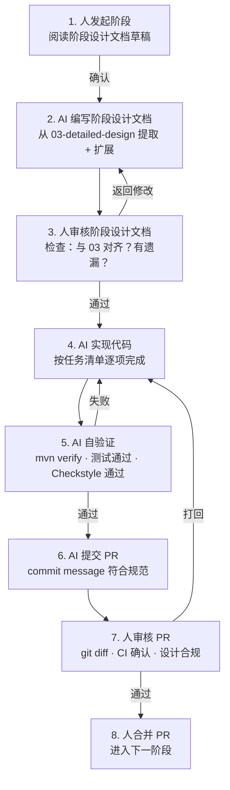

# pi-java AI 驱动开发流程规范

> **核心理念**：AI 负责所有编码工作（设计文档 → 代码实现 → 测试验证），人只做审核决策。

---

## 1. 角色定义

| 角色 | 职责 | 不允许做的事 |
|------|------|-------------|
| **AI 开发者** | 编写阶段设计文档、实现代码、写测试、运行 `mvn verify`、修复 CI 失败 | 合并 PR、推送 main、发布版本 |
| **人（审核者）** | 审核设计文档、审核代码 diff、点合并、决策未覆盖的设计问题 | 写代码、修 bug、跑构建 |

---

## 2. 阶段生命周期

每个 Phase 按以下流程推进，AI 在步骤 2–6 自主循环，人只在步骤 1 和步骤 7 介入。



---

## 3. 各步骤详细说明

### 步骤 1：人发起阶段

- **触发**：上一阶段 PR 已合并，或项目初始化
- **人做的事**：阅读上一阶段的产出文档和当前阶段的 `04` 任务清单
- **发起指令示例**：
  ```
  开始 Phase 1: LLM API 层。
  先写 06-phase1-ai-design.md。写完后给我审核，审核通过后再写代码。
  ```

### 步骤 2：AI 编写阶段设计文档

- **输入**：`03-detailed-design.md` 中对应章节 + `04-implementation-plan.md` 中任务清单
- **输出**：`docs/XX-phaseN-xxx-design.md`
- **内容要求**：
  - 包结构 + 类图
  - 关键接口/类的签名（完整 Java 代码）
  - 数据流（Mermaid 序列图）
  - 测试策略（测试用例清单）
  - 验收标准（可量化的）

### 步骤 3：人审核阶段设计文档

**审核清单（人只看这些）：**

- [ ] 接口签名与 `03-detailed-design.md` 一致？
- [ ] 任务清单覆盖了 `04` 中该阶段所有任务？
- [ ] 有明显设计缺陷吗？
- [ ] 外部依赖变更了吗？（新增/移除 Maven 依赖）

> 人不需要检查代码风格、语法错误、包名拼写——这些 AI 自验证会兜底。

**审核方式**：在文档上直接评论，AI 根据评论修改，再次提交审核。通过后回复"可以开始实现"。

### 步骤 4：AI 实现代码

- **工作方式**：按阶段设计文档中的任务清单顺序实现
- **提交粒度**：每个可独立编译的模块完成即 commit（粒度控制在 200–500 行/commit）
- **Commit 格式**：`{feat,fix,docs}({模块}): <message>`
  ```
  feat(ai): implement Anthropic provider streaming
  feat(ai): implement model catalog with builtin data
  docs(ai): update phase design with implementation notes
  ```
- **质量要求**：
  - 每个 public 类有 Javadoc
  - 每个 sealed 接口的实现全部覆盖 switch
  - 无 `@SuppressWarnings`（除非有明确理由并注释）
  - 文件不超过 500 行（超过则拆分）

### 步骤 5：AI 自验证

AI 在 push 之前必须完成：

```bash
# 1. 编译 + 静态分析（零错误零警告）
mvn clean verify

# 2. 单元测试（该模块相关）
mvn test -pl pi-java-ai

# 3. Checkstyle
mvn checkstyle:check

# 4. 确认没有遗留的 System.out.println 调试代码
grep -r "System.out.println" src/
```

**失败处理**：任何一步失败，AI 自行修复后重新验证，不需要问人。只有连续 3 次同一失败才报告给人做设计决策。

### 步骤 6：AI 提交 PR

```bash
# AI 执行的 PR 创建流程
git checkout -b phase1-ai               # 从 main 创建功能分支
git add <具体文件路径>                    # 只 stage 自己修改的文件
git commit -m "feat(ai): ..."           # 按模块分批提交
git push origin phase1-ai

# 创建 PR
gh pr create \
  --title "feat(ai): Phase 1 - LLM API 层实现" \
  --body "## 本 PR 实现的模块
- [x] StreamApi / ChatApi 接口
- [x] Anthropic Provider
- [x] OpenAI Provider
- [x] Google Gemini Provider
- [x] DeepSeek Provider
- [x] Mistral Provider
- [x] Faux Provider（测试用）
- [x] ModelCatalog + BuiltinCatalog

## CI 状态
- [x] mvn verify 通过
- [x] Checkstyle 通过
- [x] 单元测试通过

## 自验证截图
<粘贴 mvn verify 输出摘要>

🤖 Generated with [Claude Code](https://claude.com/claude-code)"
```

### 步骤 7：人审核 PR

**人只看这些：**
- [ ] PR 描述和 commit history 是否清晰？
- [ ] `git diff main...phase1-ai` 看变化量是否合理（< 2000 行）？
- [ ] CI 是否全绿？
- [ ] 接口签名是否和阶段设计文档一致？
- [ ] 有没有明显不合理的代码（看不顺眼的地方直接 comment）？

**人不需要检查：** 测试覆盖率细节、性能、代码风格、是否使用了最佳 API——这些 CI + AI 自验证兜底。

**审核结果：**
- `LGTM` → 合并
- `请修改 X` → AI 修改后重新 push，人再次审核（只审变化部分）

### 步骤 8：人合并 PR

```bash
gh pr merge --squash phase1-ai
git branch -d phase1-ai
```

---

## 4. 分支策略

```
main
  ├── phase0-infra          ← AI 工作分支
  ├── phase1-ai             ← AI 工作分支
  ├── phase2-agent          ← AI 工作分支
  ├── phase3-cli-tui        ← AI 工作分支
  └── ...
```

- **永远只有一个活跃分支**（串行开发，避免合并冲突）
- 每个 Phase 的 PR 合并后立刻删除工作分支
- 不允许 force push
- 不允许直接 push main

---

## 5. 文档同步规范

AI 在实现过程中发现设计需调整时：

| 变动类型 | 处理方式 |
|---------|---------|
| 接口新增方法（不明显影响设计） | 直接更新代码，同步更新阶段设计文档，PR 中说明 |
| 接口签名变更（影响设计） | 先在阶段设计文档中修改，人确认后改代码 |
| 新增/删除外部依赖 | 先在阶段设计文档中修改，说明理由，人确认后改 `pom.xml` |
| 架构级变更 | 暂停实现，更新 `02` / `03` 主设计文档 + 阶段设计文档，人确认后继续 |

---

## 6. 人操作速查

| 场景 | 人做什么 |
|------|---------|
| 开始新阶段 | 告诉 AI："开始 Phase N，先写阶段设计文档" |
| 审核设计文档 | 对照清单检查，有问题直接 comment |
| 审核 PR | 看 diff + CI + 接口一致性，`LGTM` 或 `请修改 X` |
| 发现设计问题 | 告诉 AI 在阶段设计文档中修改，改完再实现 |
| 想暂停 | 告诉 AI："暂存当前状态，等我回来继续" |

除此清单之外的所有操作（设计、编码、测试、构建、提交 PR）均由 AI 自主完成。
