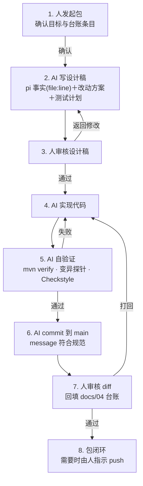

# pi-java AI 驱动开发流程规范

> **核心理念**：AI 负责所有编码工作（设计文档 → 代码实现 → 测试验证），人只做审核决策。
>
> **2026-10-07 口径更新**：执行单位已从「Phase」改为**对齐包**（见 docs/04 台账）。
> 下文的 8 步 gates **逐包适用**（一个包走一遍 1–8），不再有跨阶段 PR/合并：
> 包直接提交到 `main`，push 由人明确指示；文中「提交/合并 PR」按「commit 到 main」读。
> 设计稿审核（步骤 3）是硬性闸门 —— 用户未批准不得写代码。

---

## 1. 角色定义

| 角色 | 职责 | 不允许做的事 |
|------|------|-------------|
| **AI 开发者** | 编写设计文档、实现代码、写测试、运行 `mvn verify`、修复失败 | 未经批准写代码；自行 push/发布 |
| **人（审核者）** | 审核设计文档与 diff、决策未覆盖的设计问题、指示 push | 写代码、修 bug |

---

## 2. 包（对齐包）生命周期

每个包按以下流程推进，AI 在步骤 2–6 自主循环，人在步骤 1、3、7 介入。


```mermaid
flowchart TD
    S1["1. 人发起包\n确认目标与台账条目"] -->|确认| S2
    S2["2. AI 写设计稿\npi 事实(file:line)＋改动方案＋测试计划"] --> S3
    S3["3. 人审核设计稿"] -->|返回修改| S2
    S3 -->|通过| S4
    S4["4. AI 实现代码"] --> S5
    S5["5. AI 自验证\nmvn verify · 变异探针 · Checkstyle"] -->|失败| S4
    S5 -->|通过| S6
    S6["6. AI commit 到 main\nmessage 符合规范"] --> S7
    S7["7. 人审核 diff\n回填 docs/04 台账"] -->|打回| S4
    S7 -->|通过| S8["8. 包闭环\n需要时由人指示 push"]
```

---

## 3. 各步骤详细说明

### 步骤 1：人发起包

- **触发**：上一包闭环，或新的工作方向
- **人做的事**：指明目标（通常对应 docs/04 台账条目）
- **发起指令示例**：
  ```
  做台账 Bxx：<目标>。先出设计稿，写完给我审核，通过后再写代码。
  ```

### 步骤 2：AI 编写设计稿

- **输入**：pi 源码取证（`file:line` 与逐字代码）＋ docs/03 对应章节＋docs/04 条目
- **输出**：设计稿（新方向先立包文档；纯重构可直接在对话中给方案）
- **内容要求**：
  - pi 事实清单（锚点 file:line、逐字代码）
  - pi-java 现状与差距
  - 改动方案（关键签名）
  - 测试计划（含变异探针）与验收标准

### 步骤 3：人审核设计稿

**审核清单（人只看这些）：**

- [ ] pi 事实是否取准（file:line 可核）？
- [ ] 方案是否覆盖台账条目、有无明显设计缺陷？
- [ ] 外部依赖变更了吗？

> 人不需要检查代码风格、语法错误、包名拼写——这些 AI 自验证会兜底。

**审核方式**：在文档上直接评论，AI 根据评论修改，再次提交审核。通过后回复"可以开始实现"。

### 步骤 4：AI 实现代码

- **工作方式**：按审核过的方案实现；RED-first —— 夹具先落（先红），再写实现
- **提交粒度**：每个可独立编译的模块完成即 commit（200–500 行/commit）
- **Commit 格式**：`{feat,fix,docs}({模块}): <message>`
  ```
  feat(ai): implement Anthropic provider streaming
  feat(ai): implement model catalog with builtin data
  docs(ai): update phase design with implementation notes
  ```
- **质量要求**：
  - 每个 public 类有 Javadoc
  - 每个 sealed 接口的实现全部覆盖 switch
  - 无 `@SuppressWarnings`（除非有明确理由并注释）
  - 文件不超过 500 行（超过则拆分）

### 步骤 5：AI 自验证

AI 在 commit 之前必须完成（push 另由人指示）：

```bash
# 1. 编译 + 静态分析（零错误零警告）
mvn clean verify

# 2. 单元测试（该模块相关）
mvn test -pl pi-java-ai

# 3. Checkstyle
mvn checkstyle:check

# 4. 确认没有遗留的 System.out.println 调试代码
grep -r "System.out.println" src/
```

**失败处理**：任何一步失败，AI 自行修复后重新验证，不需要问人。只有连续 3 次同一失败才报告给人做设计决策。

### 步骤 5b：真实终端冒烟（含 TUI/交互的包必选）

**适用范围**：产出包含 CLI 交互或 TUI。纯库改动可跳过；涉及流式/工具执行的模块必须补集成测试。

**执行方式**：在真实终端（Windows Terminal 或等效 tty）运行 `run.cmd`，逐项验证：

- [ ] 启动：正常进入界面、无乱码；输入框不出现 `2027;3$y` 之类的终端应答泄漏
- [ ] 输入：中英文均可输入，光标/`>` 提示正常，输入框固定在底部
- [ ] 键盘：方向键可用（如 `/settings` 切换配置项）、Enter 提交、Esc 关闭
- [ ] 流式：提交后回复逐字出现，结束后无重复或乱序气泡
- [ ] 工具调用：请求写文件等，工具卡片正常、参数不乱、执行成功、结果可见
- [ ] 状态栏：token 数在回答结束后更新
- [ ] 滚动（若实现）：历史可滚动，滚动后渲染不混乱
- [ ] 退出：Ctrl+C 或 `/quit` 正常退出，终端恢复原样

**验收门槛**：任一失败 → 该包不算完成，修复后重跑，并将该场景补进自动化回归。

**自动化兜底**：真实模型流相关缺陷（如 usage 未返回、工具参数交错）必须通过「FauxProvider 注入 → 提交 → 工具执行」的集成测试覆盖，例如 `AgentSessionToolIntegrationTest`（从 `submit` 到真实工具执行的完整链路）。

### 步骤 6：AI commit 到 main

```bash
git add <具体文件路径>          # 只 stage 本次改动，不用 git add -A/.
git commit -m "feat(module): ..."
```

- 一个包内可按模块分多个 commit（格式 `{feat,fix,docs}({module}): <message>`）
- **不 push**：push 只在人明确指示时执行（见步骤 8）
- 不开功能分支、不 force push

### 步骤 7：人审核 diff

**人只看这些：**

- [ ] `git diff HEAD~N` 的变化量与内容是否合理？
- [ ] 设计稿中的方案是否被如实实现？
- [ ] docs/04 台账是否已正确回填（销号/登记新项）？
- [ ] 有没有明显不合理的代码？

**审核结果：** `可以` ⇒ 包闭环；`请修改 X` ⇒ AI 修改、重新自验证与 commit，
人只复审变化部分。

### 步骤 8：包闭环与 push

- 闭环：台账行更新、包的设计稿 banner/记录按需保留或清理（过程文档可删，历史在 git）
- 人明确指示「push」时 AI 才执行 `git push origin main`

---

## 4. 分支与提交策略

- 仓库只使用 `main`：所有工作直接 commit 到 main，串行开发
- 不开长期功能分支；需要探索性改动时可用临时分支/worktree，但不回灌前先经人确认
- 不 force push；push 由人指示

---

## 5. 文档同步规范

实现过程中发现设计需调整时：

| 变动类型 | 处理方式 |
|---------|---------|
| 不影响整体设计的小调整 | 直接改代码，commit message 说明 |
| 接口签名变更（影响设计） | 先改设计稿/相关 docs，人确认后再改代码 |
| 新增/删除外部依赖 | 先说明理由、人确认后改 `pom.xml` |
| 架构级变更 | 暂停实现，更新 docs/02、docs/03，人确认后继续 |

台账（docs/04）是活状态：每包闭环时即时回填，不攒批。

---

## 6. 人操作速查

| 场景 | 人做什么 |
|------|---------|
| 开始新包 | 告诉 AI 目标（对应台账条目），要求先出设计稿 |
| 审核设计稿 | 对照清单检查，回复「可以开始实现」或打回 |
| 审核 diff | 看变化量与方案一致性，确认台账回填 |
| 推送 | 明确说「push」 |
| 想暂停 | 告诉 AI 暂存当前状态 |

除此清单外的操作（设计、编码、测试、构建、commit）均由 AI 自主完成。
