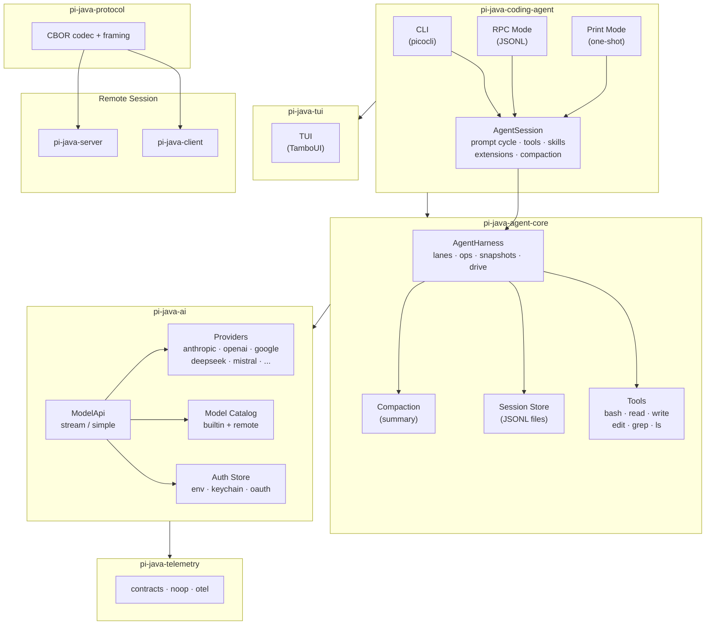
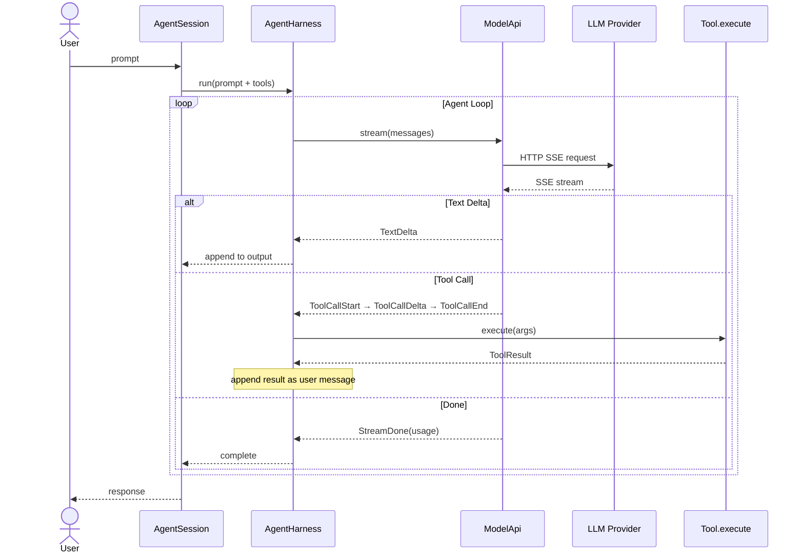
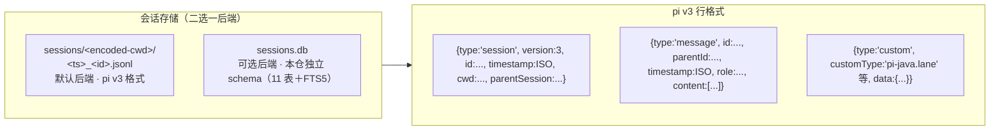

# pi-java 架构设计

> 本文档定义 pi-java 的系统架构，包括模块划分、技术选型、核心抽象、数据流和关键设计模式。

---

## 1. 总体架构

### 1.1 分层架构


```mermaid
graph TB
    subgraph coding["pi-java-coding-agent"]
        CLI["CLI<br/>(picocli)"]
        RPC["RPC Mode<br/>(JSONL)"]
        PRINT["Print Mode<br/>(one-shot)"]
        SESSION["AgentSession<br/>prompt cycle · tools · skills<br/>extensions · compaction"]
        CLI --> SESSION
        RPC --> SESSION
        PRINT --> SESSION
    end

    subgraph tui["pi-java-tui"]
        TUI["TUI<br/>(TamboUI)"]
    end

    subgraph agent["pi-java-agent-core"]
        HARNESS["AgentHarness<br/>lanes · ops · snapshots · drive"]
        TOOLS["Tools<br/>bash · read · write<br/>edit · grep · ls"]
        STORE["Session Store<br/>(JSONL files)"]
        COMPACT["Compaction<br/>(summary)"]
        HARNESS --> TOOLS
        HARNESS --> STORE
        HARNESS --> COMPACT
    end

    subgraph ai["pi-java-ai"]
        API["ModelApi<br/>stream / simple"]
        PROVIDERS["Providers<br/>anthropic · openai · google<br/>deepseek · mistral · ..."]
        CATALOG["Model Catalog<br/>builtin + remote"]
        AUTH["Auth Store<br/>env · keychain · oauth"]
        API --> PROVIDERS
        API --> CATALOG
        API --> AUTH
    end

    subgraph proto["pi-java-protocol"]
        CBOR["CBOR codec + framing"]
    end

    subgraph remote["Remote Session"]
        CLIENT["pi-java-client"]
        SERVER["pi-java-server"]
    end

    subgraph telemetry["pi-java-telemetry"]
        TEL["contracts · noop · otel"]
    end

    SESSION --> HARNESS
    coding --> agent
    coding --> tui
    agent --> ai
    ai --> telemetry
    CBOR --> CLIENT
    CBOR --> SERVER
```

### 1.2 模块依赖方向

依赖流严格自下而上：

```
telemetry ← ai ← agent ← coding-agent
                         ← tui
              agent ← session-backend-sqlite
              coding-agent ← evals
              protocol ← client
              protocol ← server
```

禁止反向依赖，禁止循环依赖，禁止跨层穿透调用。

---

## 2. Maven 模块结构

```
pi-java/  （13 个 Maven 子模块 + 根 POM；reactor 共 14 个）
├── pom.xml                          ← 根 POM（dependencyManagement + pluginManagement）
├── pi-java-bom/                     ← Bill of Materials（统一版本管理）
├── pi-java-telemetry/               ← 遥测接口 + noop/otel 适配器（≈ pi packages/telemetry）
├── pi-java-ai/                      ← LLM API + Provider 注册（≈ pi packages/ai）
├── pi-java-agent-core/              ← Agent 运行时核心（≈ pi packages/agent）
├── pi-java-session-backend-sqlite/  ← 可选 SQLite 后端（本仓独立 schema；pi 参照后端已删）
├── pi-java-tui/                     ← 终端 UI（≈ pi packages/tui）
├── pi-java-protocol/                ← 协议模块
├── pi-java-client/                  ← 远程会话客户端（≈ pi packages/client）
├── pi-java-server/                  ← 远程会话服务端（≈ pi packages/server）
├── pi-java-coding-agent/            ← CLI 入口 + AgentSession（≈ pi packages/coding-agent）
├── pi-java-web/                     ← Web UI + HTTP/WS 服务（本仓独有；pi 无 web）
├── pi-java-evals/                   ← 评估框架（≈ pi packages/evals）
└── pi-java-dist/                    ← 分发包（fat jar）
```

| 模块 | groupId:artifactId | pi 对应 | 说明 |
|------|-------------------|-------------|---------|------|
| telemetry | `com.pijava:pi-java-telemetry` | `packages/telemetry` | 遥测合约 |
| ai | `com.pijava:pi-java-ai` | `packages/ai` | LLM API |
| agent-core | `com.pijava:pi-java-agent-core` | `packages/agent` | Agent 运行时 |
| sqlite-backend | `com.pijava:pi-java-session-backend-sqlite` | —（pi 后端已删） | 可选 SQLite 后端 |
| tui | `com.pijava:pi-java-tui` | `packages/tui` | 终端 UI |
| protocol | `com.pijava:pi-java-protocol` | — | 协议模块 |
| client | `com.pijava:pi-java-client` | `packages/client` | 远程会话客户端 |
| server | `com.pijava:pi-java-server` | `packages/server` | 远程会话服务端 |
| coding-agent | `com.pijava:pi-java-coding-agent` | `packages/coding-agent` | CLI 入口 |
| web | `com.pijava:pi-java-web` | —（pi 无） | Web UI |
| evals | `com.pijava:pi-java-evals` | `packages/evals` | 评估框架 |
| dist | `com.pijava:pi-java-dist` | — | fat jar 打包 |

---

## 3. 技术选型总览

| 关注点 | 选型 | 说明 |
|--------|------|------|
| 运行时 | JDK 25 | 虚拟线程、结构化并发、模式匹配 |
| 构建系统 | Maven 4.x | 声明式配置，依赖管理成熟 |
| HTTP 客户端 | `java.net.http.HttpClient` (JDK 内置) | 支持 HTTP/2、SSE、异步 |
| 并发模型 | 虚拟线程（`--enable-preview` 在 22 之前无需） | 协程风格，百万级并发 |
| JSON | Jackson (`jackson-core`, `jackson-databind`) | 流式解析 + CBOR 模块 |
| YAML | SnakeYAML (仅 CLI 设置文件) | 最小化使用 |
| JSON Schema | `com.networknt:json-schema-validator` | 工具参数校验 |
| 会话存储 | JSONL（默认）＋ SQLite（可选） | JSONL 用 pi 主流 v3 格式；SQLite 是本仓独立 schema（11 表＋惰性 FTS5） |
| 终端 UI | [TamboUI](https://tamboui.dev/) 0.3.x | 源自 Ratatui（Claude CLI 同源），内置差量渲染、Widget 库、CSS 主题、GraalVM 支持 |
| 终端后端 | TamboUI Panama Backend | 基于 JDK FFM，与 JDK 25 Foreign Function API 目标一致 |
| 键盘/输入 | TamboUI JLine3 Backend | 复用 JLine3 的终端输入处理 |
| 日志 | `java.lang.System.Logger` + `java.util.logging` | 零外部依赖，桥接到 SLF4J 可选 |
| 分发形态 | fat jar（pi-java-dist） | Native Image 已放弃 |
| SQLite | xerial/sqlite-jdbc | 可选后端：全文搜索、事务安全 |
| CLI 参数 | 自研 ArgsParser（注解驱动） | 类型安全的参数解析 |
| 测试 | JUnit 5 + AssertJ | 主流组合 |

---

## 4. 核心抽象设计

### 4.1 LLM API 层（`pi-java-ai`）

```java
// 统一的模型标识，编译期安全
public record ModelId<P>(
    String provider,
    String modelName
) {}

// ProviderApi — 标记接口：Provider 对外暴露的 API 能力
public sealed interface ProviderApi permits ChatApi, ImageApi, EmbeddingApi {}

// ChatApi = StreamApi + SimpleApi
public interface ChatApi extends StreamApi, SimpleApi {}

// 核心流式调用接口
public interface StreamApi {
    Flow.Publisher<StreamEvent> stream(
        StreamRequest request,
        ApiOptions options
    );

    StreamIterator<StreamEvent> streamBlocking(
        StreamRequest request,
        ApiOptions options
    );
}

// 非流式调用接口
public interface SimpleApi {
    Message send(StreamRequest request, ApiOptions options);
}

// 流事件的密封层次
public sealed interface StreamEvent permits
    TextDelta, ToolCallStart, ToolCallDelta,
    ToolCallEnd, UsageInfo, StreamError, StreamDone {}
```

### 4.2 Agent 运行时层（`pi-java-agent-core`）

```java
// AgentHarness — 多车道、持久化 Agent 运行时
public class AgentHarness implements AutoCloseable {

    // 车道管理
    Lane lane();
    Lane createLane(String name);
    List<Lane> lanes();

    // 提示与技能
    void prompt(String text);
    void skill(String skillName);
    void promptFromTemplate(String template, Map<String, Object> params);

    // 会话控制
    void compact();
    void navigateTree();
    void resume();
    void abort();
    void steer(String direction);
    void followUp(String text);
    CompletableFuture<Void> nextRun();
    void cancelQueued();
    void recordUsage();

    // 等待与空闲
    void waitForIdle();
    void runWhenIdle(Runnable task);

    // 手动驱动模式
    Action peekAction();
    void executeAction(Action action);
    void runToCompletion();

    // 监听
    WatchHandle watch();
    WatchHandle watchSession(String sessionId);

    // 模型与配置
    ModelId<?> getModel();
    void setModel(ModelId<?> model);
    ThinkingLevel getThinkingLevel();
    void setThinkingLevel(ThinkingLevel level);
    Set<String> getActiveTools();
    void setActiveTools(Set<String> tools);
}

// 工具接口（非函数式接口 — 包含多个抽象方法）
public interface Tool {
    String name();
    String description();
    JsonSchema parameters();
    CompletionStage<ToolResult> execute(Map<String, JsonNode> arguments, ToolContext ctx);
    boolean requiresConfirmation();
    ExecutionMode executionMode();
}

// Entry 类型（持久化事件，对用户可见）—— 9 个变体
public sealed interface Entry permits
    Message, ModelChange, ThinkingLevelChange, Compaction, BranchSummary,
    Usage, ContextEdit, Custom, CustomMessage
{ String id(); long seq(); String parentId(); Instant timestamp(); }

// LaneRecord（车道级内部审计记录）—— 10 个变体
public sealed interface LaneRecord permits
    OperationStarted, AbortRequested, OperationFinished,
    StepAttempt, ToolStarted, ToolFinished, QueueEnqueued, QueueCancelled,
    QueueConsumed, WriteDeferred
{ long seq(); Instant timestamp(); }

// 状态不做 fold/reducer：LaneState 直接逐条 apply entry 增量维护
// （早期的 FoldedState/折叠链已退休 —— 记录是旁路审计，不参与状态推导）。
```

### 4.3 TUI 层（`pi-java-tui`）

`pi-java-tui` 是对 TamboUI 的薄封装层，主要职责：

- **主题定制**：为 AI 编码代理场景定义 TCSS 主题（聊天气泡、工具调用卡片、diff 视图等）
- **复合 Widget**：封装 `ChatPanel`、`ToolCallCard`、`DiffView`、`StatusBar` 等业务组件
- **编辑器集成**：基于 TamboUI Widget 构建多行编辑器组件
- **Markdown 渲染（未接线）**：`MarkdownRenderer`/`SyntaxHighlighter` 类存在但
  助手消息当前走纯文本渲染；「接线还是删声明」见台账 B65，不要当成已生效的职责

```java
// pi-java-tui 的核心职责：主题 + 业务组件，非底层引擎
// 底层渲染、布局、焦点、键盘全部由 TamboUI 处理

// 主题定义（TCSS 格式，写在 resources/themes/ 下）
// resources/themes/pi-dark.tcss
// resources/themes/pi-light.tcss

// 业务组件示例：聊天面板
public class ChatPanel {
    private final Toolkit toolkit;  // TamboUI Toolkit DSL

    public ChatPanel() {
        this.toolkit = Toolkit.create();
    }

    public Component render(List<ChatMessage> messages) {
        return column(/* 每条消息渲染为一个 card */);
    }
}

// 编辑器组件 — 基于 TamboUI 的 Paragraph + TextArea
public class EditorComponent {
    // setText / getText / insert / delete 委托给 TamboUI 的 TextArea
}
```

**TamboUI 使用的三层 API**（全部可用，按场景选择）：

| API 层级 | 用途 | 示例场景 |
|----------|------|---------|
| **Toolkit DSL**（高层） | 快速构建业务 UI | 聊天面板、会话浏览器、设置页 |
| **TuiRunner**（中层） | 托管的渲染循环 | 主事件循环、全局快捷键 |
| **Immediate Mode**（低层） | 精细控制渲染 | 自定义 Diff 视图、Mermaid 图表 |

| TamboUI 模块 | 我们如何使用 |
|--------------|-------------|
| `tamboui-toolkit` | 构建所有业务组件（ChatPanel, ToolCallCard, SessionBrowser 等） |
| `tamboui-jline3-backend` | 键盘输入处理（替代直接使用 JLine3） |
| `tamboui-panama-backend` | JDK 25 FFM 终端后端（零 JNI 开销） |
| `tamboui-css` | 运行时主题切换（亮色/暗色） |
| `tamboui-image` | 多模态图片渲染（LLM 返回的图片） |
| `tamboui-picocli` | 可选：CLI 参数与 TUI 的路由集成 |

---

## 5. 数据流

### 5.1 Agent 循环流程


```mermaid
sequenceDiagram
    actor User
    participant Session as AgentSession
    participant Harness as AgentHarness
    participant Model as ModelApi
    participant LLM as LLM Provider
    participant Tool as Tool.execute

    User->>Session: prompt
    Session->>Harness: run(prompt + tools)
    loop Agent Loop
        Harness->>Model: stream(messages)
        Model->>LLM: HTTP SSE request
        LLM-->>Model: SSE stream
        alt Text Delta
            Model-->>Harness: TextDelta
            Harness-->>Session: append to output
        else Tool Call
            Model-->>Harness: ToolCallStart → ToolCallDelta → ToolCallEnd
            Harness->>Tool: execute(args)
            Tool-->>Harness: ToolResult
            Note over Harness: append result as user message
        else Done
            Model-->>Harness: StreamDone(usage)
            Harness-->>Session: complete
        end
    end
    Session-->>User: response
```

### 5.2 JSONL 会话持久化


```mermaid
flowchart LR
    subgraph Session["会话存储（二选一后端）"]
        direction TB
        JSONL_DIR["sessions/&lt;encoded-cwd&gt;/<br/>&lt;ts&gt;_&lt;id&gt;.jsonl<br/>默认后端 · pi v3 格式"]
        SQLITE_DB["sessions.db<br/>可选后端 · 本仓独立 schema（11 表＋FTS5）"]
    end

    subgraph Format["pi v3 行格式"]
        direction TB
        HDR["{type:'session', version:3, id:..., timestamp:ISO, cwd:..., parentSession:...}"]
        ROW["{type:'message', id:..., parentId:..., timestamp:ISO, role:..., content:[...]}"]
        CUSTOM["{type:'custom', customType:'pi-java.lane' 等, data:{...}}"]
    end

    Session --> Format
```

---

## 6. 关键设计模式

| 模式 | 应用场景 |
|------|---------|
| **SPI（ServiceLoader）** | Provider 注册、工具注册、扩展注册 |
| **密封类层次** | StreamEvent、Entry、LaneRecord、ToolCapability 等有限状态的类型化 |
| **Builder** | StreamRequest、AgentConfig、ToolDefinition 等复杂配置对象 |
| **策略模式** | CompactionStrategy、ModelResolver |
| **观察者模式** | HarnessEvent 订阅、Telemetry 收集 |
| **装饰器** | 遥测包裹的 StreamApi、带缓存的 ModelCatalog |
| **工厂方法** | ProviderFactory → ChatApi/SimpleApi 实例 |
| **手动驱动状态机** | AgentHarness `peekAction()`/`executeAction()`，外层（SessionRunner/TUI/RPC）推着走 |

---

## 7. 安全与错误处理

### 7.1 错误处理策略

```
调用层次          错误类型              处理策略
──────────────────────────────────────────────────
CLI 入口         用户输入错误           友好提示 + 退出码
AgentSession     恢复失败               重建会话
AgentHarness     JSONL 解析错误         跳过损坏行 + 告警日志
ModelApi         网络错误               指数退避重试 × 3
ModelApi         401/403 认证错误        立即失败 + 提示登录
ModelApi         429 速率限制            退避 + 重试
Tool             执行超时                SIGTERM → SIGKILL 级联
Tool             权限拒绝               报告用户，不终止会话
```

### 7.2 安全边界

- **沙箱执行**：工具（bash）在受限环境中执行，可配置允许/禁止的命令列表
- **信任模型**：首次使用项目需用户确认，信任状态持久化
- **密钥管理**：API Key 不记录到会话日志，不序列化到 JSONL
