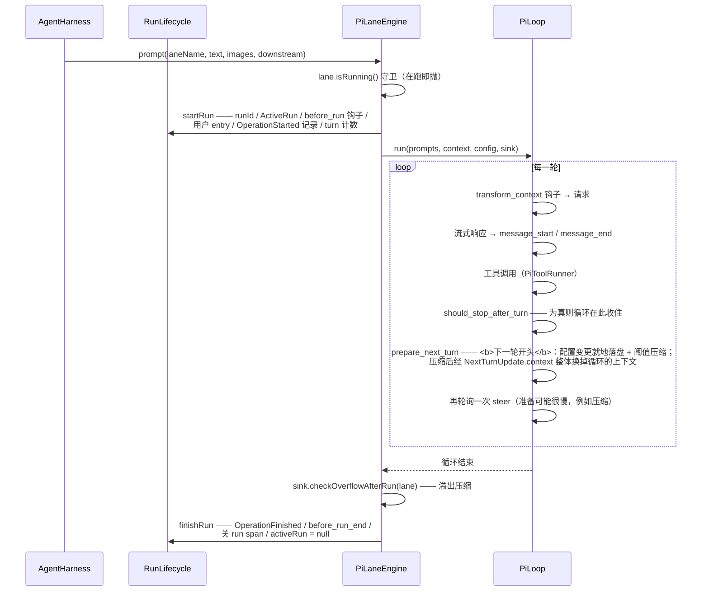
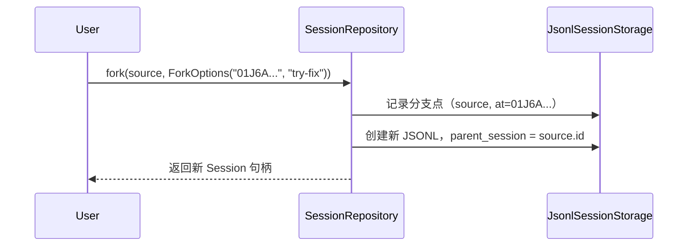

# pi-java 详细设计

> 本文档覆盖核心模块的类级设计、接口契约、状态机和数据模型。

---

## 1. `pi-java-ai` 模块详细设计

### 1.1 包结构

```
com.pijava.ai/
├── api/                    ← 公开 API 接口
│   ├── StreamApi.java
│   ├── SimpleApi.java
│   ├── ChatApi.java
│   ├── ProviderApi.java     ← 标记接口（sealed，permits ChatApi）
│   └── ApiOptions.java
├── protocol/               ← 协议适配器（一个协议一个适配器，所有供应商复用）
│   ├── AnthropicMessagesApi.java
│   ├── OpenAICompletionsApi.java
│   ├── GoogleGenerativeAiApi.java
│   └── MistralConversationsApi.java
├── model/                  ← 模型定义
│   ├── ModelId.java
│   ├── ModelInfo.java      ← 模型元数据
│   ├── ModelCapability.java ← 能力密封接口
│   └── PricingInfo.java
├── message/                ← 消息类型
│   ├── Message.java        ← 密封接口
│   ├── SystemMessage.java
│   ├── UserMessage.java
│   ├── AssistantMessage.java
│   └── ContentBlock.java   ← 文本 / 图片 / 工具调用
├── stream/                 ← 流事件
│   ├── StreamEvent.java    ← 密封接口
│   ├── TextDelta.java
│   ├── ToolCallStart.java
│   ├── ToolCallDelta.java
│   ├── ToolCallEnd.java
│   ├── UsageInfo.java
│   ├── StreamError.java
│   ├── StreamDone.java
│   └── ToolCallBuilder.java ← 工具参数增量聚合（OpenAI/Mistral 共享）
├── provider/               ← Provider 配置（不可变，绑定协议适配器）
│   ├── Provider.java       ← SPI 接口
│   ├── ProviderFactory.java
│   ├── ProviderRegistry.java
│   ├── AnthropicProvider.java
│   ├── OpenAIProvider.java
│   ├── GoogleProvider.java
│   ├── DeepSeekProvider.java
│   ├── MistralProvider.java
│   └── FauxProvider.java    ← 可编程假 Provider
├── catalog/                ← 模型目录
│   ├── ModelCatalog.java
│   ├── BuiltinCatalog.java
│   └── RemoteCatalog.java   ← Phase 6
├── auth/                   ← 认证
│   ├── CredentialStore.java
│   ├── EnvApiKeyResolver.java
│   ├── FileCredentialStore.java
│   ├── KeychainStore.java   ← Phase 6
│   └── OAuthFlow.java       ← Phase 6
├── http/                   ← HTTP 传输
│   └── PiHttpClient.java   ← 对 HttpClient 的薄封装
└── cli/                    ← pi-ai CLI
    └── AiCli.java
```

### 1.2 核心接口设计

```java
// ProviderApi — 标记接口：Provider 对外暴露的一种 API 能力
public sealed interface ProviderApi permits ChatApi {
    // Phase 1 仅 ChatApi 一种能力；
    // Phase 6 可能扩展 ImageApi、EmbeddingApi 等
}

// Provider SPI — 扩展点
public interface Provider {
    /** 供应商名称，如 "anthropic"、"openai" */
    String name();

    /** 供应商显示名称 */
    String displayName();

    /** 支持的 API 类型 */
    Set<Class<? extends ProviderApi>> supportedApis();

    /** 创建具体的 API 实例 */
    <T extends ProviderApi> T createApi(Class<T> apiType, ApiOptions options);

    /** 内置模型列表 */
    ModelCatalog builtinModels();
}

// 流式请求
public record StreamRequest(
    ModelId<?> model,
    List<Message> messages,
    List<ToolDefinition> tools,     // 可为空
    int maxTokens,                  // -1 表示使用默认值
    double temperature,             // -1 表示使用默认值
    Map<String, Object> extra       // provider 特定参数
) {
    public StreamRequest {
        messages = List.copyOf(messages);
        tools = List.copyOf(tools);
        extra = Map.copyOf(extra);
    }
}

// 流消费 — 两种风格
// 方式 1：Flow API（标准 JDK）
Flow.Publisher<StreamEvent> stream = api.stream(request, options);

// 方式 2：虚拟线程友好的同步迭代器（推荐）
try (var stream = api.streamBlocking(request, options)) {
    for (StreamEvent event : stream) {
        switch (event) {
            case TextDelta(var text) -> output.append(text);
            case ToolCallStart(var id, var name) -> tool.start(id, name);
            case StreamDone(var usage) -> stats.record(usage);
            case StreamError(var err) -> handle(err);
            default -> {}
        }
    }
}
```

### 1.3 供应商转换关键路径

以 Anthropic 为例，消息和工具定义转换：

```
Java 内部表示                    Anthropic Messages API 格式
────────────────────────────────────────────────────────
Message.SystemMessage(text)  →  {"role":"system","content":text}
Message.UserMessage(blocks)  →  {"role":"user","content":[...]}
ToolDefinition               →  {"name":"..","description":"..","input_schema":{...}}
ToolCallStart(id,name)       ←  {"type":"content_block_start","content_block":{"type":"tool_use",...}}
TextDelta(text)              ←  {"type":"content_block_delta","delta":{"type":"text_delta","text":"..."}}
StreamDone(usage)            ←  {"type":"message_delta","delta":{"stop_reason":"end_turn"},...}
```

---

## 2. `pi-java-agent-core` 模块详细设计

### 2.1 运行态：`activeRun`

> **本节 2026-09-13 重写。** 原稿描述的是 pi **harness 层**的 phase 枚举
> （`idle` / `turn` / `compaction` / `branch_summary` / `retry`），那不是对齐目标
> `agent.ts` 的形状，对应的 `RunPhase` 枚举也已在 `03d8669` 删除。
> 完整决策见 `docs/31 §3.2` / `§8.8`。

pi 的 `Agent`（`agent.ts`）用**对象存在与否**表示「正在跑」：

```ts
activeRun?: { promise: Promise<void>; resolve: () => void; abortController: AbortController }
```

Java 侧同形 —— `LaneState.activeRun`，`null` 即空闲：

| pi | pi-java |
|---|---|
| `if (this.activeRun) throw "Agent is already processing."` | `RunLifecycle.begin` 的 `lane.isRunning()` 守卫 |
| `this.activeRun?.abortController.signal` | `LaneState.abortSignal()`：空闲返回 `null` |
| `abort() { this.activeRun?.abortController.abort() }` | `AgentHarness.abort(laneName)` |
| `waitForIdle() { return this.activeRun?.promise ?? Promise.resolve() }` | `AgentHarness.waitForIdle(laneName)`（`run.done().join()`） |
| `finishRun()` 里清空 | `RunLifecycle.finishRun` 末尾 `lane.activeRun = null` |

**`compaction` / `retry` / `branch_summary` 不是状态。** 它们各有归属：

| 原「阶段」 | 实际归属 |
|---|---|
| `compaction` | 运行内部的两个触发点 —— 阈值在 `prepareNextTurn`（pi `_compactBeforeNextAssistantResponse`），溢出在 `agent_end` 之后（pi `_handlePostAgentRun`）。**运行态不因此改变**（`docs/31 §4.2`） |
| `retry` | 会话层（`SessionRunner` 的自动重试走 `continueRun` + `dropTrailingErrorAssistant`） |
| `branch_summary` | 会话层 —— 分支是**新会话**（`AgentSession.forkFromEntry`），不是车道 |

#### 一次运行的生命周期



`should_stop_after_turn` 在 `prepare_next_turn` **之前**：pi 的 `shouldStopAfterTurn` 一真，
`prepareNextTurn` 就不再被调用（`docs/31 §8.4`，实施时读源码发现的两处顺序修正之一）。

`drive` 用 `try/finally` 保证**驱动抛异常时同样收口**（按 `"error"` 结算），否则
`activeRun` 会永远挂着，车道再也起不了新运行、`waitForIdle` 永远等下去。

`prompt` / `continueRun` 是**阻塞**的：pi 的 `prompt()` 返回 Promise，Java 侧由调用线程
直接跑到收口 —— 对齐的是「可观察效果的顺序」，不是 async 机器（`docs/31 §8.5`）。

### 2.2 AgentHarness 核心类

> **本节 2026-09-13 重写。** 原稿是 Phase 2c 的推测 API（`TreeNavigator` /
> `promptFromTemplate` / 手动驱动 / 多车道容器），与代码早已不符。下文按 `ab7d309`
> 的实际形状。

`AgentHarness` 是 pi `Agent` 的 Java 版宿主：**一个 harness 恰好一条车道**
（`LaneState`，即 pi 的 `AgentState`），分支是**新会话**而不是新车道
（`docs/31 §4.3` / `§8.12`）。

#### 构造配置 —— `HarnessConfig`（record，19 个字段）

| 字段 | 用途 |
|---|---|
| `streamFn` / `model` / `thinkingLevel` / `systemPrompt` | LLM 调用与提示 |
| `activeTools` / `toolRegistry` / `toolContext` / `commandPrefix` | 工具 |
| `maxInputTokens` | 溢出检测的窗口 |
| `compactionSettings` | `null` = 不自动压缩 |
| `skills` / `summaryGenerator` | 技能与压缩摘要生成 |
| `retryPolicy` / `telemetry` / `thinkingLevelMap` | HTTP 重试、遥测、思考等级翻译 |
| `steeringMode` / `followUpMode` / `toolExecution` | 队列排空模式与工具执行模式 |
| `streamListener` | 每一条 `StreamEvent` 的旁路接收器（TUI / print 流式） |

`HarnessConfig` 被 harness 留存一份副本，**只为 `fork()`**。

#### 公开 API

```java
public class AgentHarness implements AutoCloseable {

    public static final String DEFAULT_LANE = "default";

    /** 同配置的全新 harness（车道为空，内容由调用方播种）。会话层建分支用。 */
    public AgentHarness fork();

    // ── 运行（阻塞；pi Agent.prompt / continue）──────────────
    public PiLaneEngine.RunOutcome prompt(String text);
    public PiLaneEngine.RunOutcome prompt(String text, List<PromptImage> images);
    public PiLaneEngine.RunOutcome prompt(String laneName, String text,
                                          List<PromptImage> images);
    public PiLaneEngine.RunOutcome prompt(String laneName, String text,
                                          List<PromptImage> images, PiLoop.Sink downstream);
    public PiLaneEngine.RunOutcome continueRun();
    public PiLaneEngine.RunOutcome continueRun(String laneName, PiLoop.Sink downstream);
    public void abort();                       // 另有 abort(String laneName)
    public void waitForIdle(String laneName);

    // ── 空闲操作 ────────────────────────────────────────────
    public void reset();                       // 另有 reset(String laneName)
    public void compact(CompactionSettings settings);
    public void seedTranscript(String laneName, List<Entry> entries);   // resume 播种
    public void restoreRecords(String laneName, List<LaneRecord> records);
    public void dropTrailingErrorAssistant(String laneName);            // 重试前清残缺助手消息

    // ── 队列调度（三条：steer / followUp / nextRun）──────────
    public String steer(String laneName, String prompt);
    public String followUp(String laneName, String prompt);
    public String nextRun(String laneName, String prompt);
    public void cancelQueued(String laneName, String queueType);
    public QueueMode steeringMode();  public void steeringMode(QueueMode mode);
    public QueueMode followUpMode();  public void followUpMode(QueueMode mode);

    // ── 模型 / 思考级别 / 提示 / 工具 / 压缩 ─────────────────
    public ModelId<?> getModel();                 public void setModel(ModelId<?> model);
    public ModelThinkingLevel getThinkingLevel(); public void setThinkingLevel(ModelThinkingLevel level);
    public String getSystemPrompt();              public void setSystemPrompt(String prompt);
    public Set<AgentTool<?, ?>> getActiveTools(); public void setActiveTools(Set<AgentTool<?, ?>> tools);
    public CompactionSettings getCompactionSettings();
    public void setCompactionSettings(CompactionSettings s);
    public ToolContext toolContext();
    public ToolExecution toolExecution();         public void toolExecution(ToolExecution mode);

    // ── 快照 / 订阅 ─────────────────────────────────────────
    public LaneSnapshot snapshot(String laneName);
    public WatchHandle<LaneSnapshot> watch(String laneName);
    public WatchHandle<SessionSnapshot> watchSession();
    public AutoCloseable onStreamEvent(Consumer<StreamEvent> listener);

    // ── 其它 ────────────────────────────────────────────────
    public String laneName();                     // 恒为 DEFAULT_LANE
    public AssistantMessage lastAssistantMessage();
    public SkillManager skillManager();
    public HookSystem hookSystem();
    public void close();
}
```

**`setModel` / `setThinkingLevel` 会顺带写 entry**（`docs/31 §4.1`）：字段赋值是唯一真源，
entry 是它的审计副本 —— 模型**无条件**写（pi `agent-session.ts:1687`），思考等级**变了才**写
（`:1813-1829` 的 `isChanging` 守卫，且默认等级 `off` 不入日志）。

#### `LaneState` —— pi `AgentState` 的 Java 版

```java
public final class LaneState {
    String laneName;                       // 恒为 "default"
    final List<Entry> transcript;          // **持久真源**：entry 日志
    final List<Message> messages;          // **工作副本**：送给 provider 的那份
    String runId;
    AssistantMessage partial;              // pi streamingMessage
    NewestOwn newestOwn;                   // 结局判定用（determineOutcome）
    ActiveRun activeRun;                   // null = 空闲
    TelemetrySpan runSpan;
    long runStartNanos;
    String recordedThinking;               // 「上次记过什么」——§4.1 的守卫

    // 配置（pi AgentState 的字段；此前住在 HarnessState）
    ModelId<?> model;
    ModelThinkingLevel thinkingLevel;
    String systemPrompt;
    Set<AgentTool<?, ?>> activeTools;
    CompactionSettings compactionSettings;
    QueueMode steeringMode, followUpMode;
    ToolExecution toolExecution;

    // 调度队列（steer / followUp / nextRun）
    final ArrayDeque<LaneInfo.QueuedItem> steerQueue, followUpQueue, nextRunQueue;
    long queueSeq;

    public final List<LaneRecord> records;  // 旁路审计，不参与状态
}
```

**两层真源的分工**（`docs/31 §4.2`）：`transcript` 是持久真源，`messages` 是它的投影。
工作副本由**事件**维护（`PiLaneSink` 在 `message_end` 上追加，对齐 pi `agent.ts:554-557`），
只在日志被**整体替换**时重建 —— resume 播种、压缩、reset。此前每次请求都从 entry 日志
重走一遍 `pathToLeaf`，那是本字段存在的理由。

#### 快照

| 类型 | 内容 |
|---|---|
| `LaneSnapshot` | `lane` / `transcript` / `records` / `leafId` / `operation`（空闲为 `null`）/ `queues` / `faulted` |
| `SessionSnapshot` | `name` / `model` / `phase`（`"running"`\|`"idle"`）/ `totalTokens` / `turnCount` / `activeTools` / `lanes`（**单元素**：一个 harness 一条车道） |
| `WatchHandle<T>` | `current()` / `subscribe(Consumer<T>)` / `close()` |

`faulted` 的判据是「记录里存在 `OperationFinished` 且结局为 `FAILED`」—— 所以 abort 必须
记成 `ABORTED` 而不是 `FAILED`，否则用户主动中止会污染故障标记。

### 2.3 操作记录体系：Entry + LaneRecord

两层记录：**Entry**（用户可见的持久化事件，构成对话转录）与 **LaneRecord**（车道级内部
审计记录）。两者都是 `sealed interface` + `record` 的代数数据类型，判别字面量由
`type()` 给出并与 JSON 的 `type` 属性一致。

```java
public sealed interface Entry {
    String id();
    long seq();
    String parentId();          // 根为 null
    Instant timestamp();
    String type();              // 判别字面量（@JsonTypeInfo 用）
    boolean isConfiguration();  // 默认 false
    Entry committed(long seq, String parentId, Instant timestamp);  // 存储分配身份后重建
}
```

`seq` 是全仓**共享**的单调序号（entry / record / lane / fact 同一个空间）。

#### Entry 的 8 个变体

| 变体 | 关键字段 | 语义 |
|---|---|---|
| `Message` | `message`（`UserMessage`/`AssistantMessage`/`ToolResultMessage`）、`terminate` | 对话消息。**角色只在消息对象里** —— 系统提示不是 entry，它挂在 `Context.systemPrompt` 上（`docs/31 §8.6`） |
| `ModelChange` | `provider`、`modelId` | 模型切换（配置） |
| `ThinkingLevelChange` | `thinkingLevel`（`"off"`…`"xhigh"`） | 思考等级切换（配置） |
| `ActiveToolsChange` | `activeToolNames` | 活跃工具集切换（配置） |
| `Compaction` | `summary`、`firstKeptEntryId`、`retainedTail`、`tokensBefore`、`details`、`usage` | 压缩标记。**摘要前缀是逐字节固定的文本**，`firstKeptEntryId` 是平铺字段 |
| `BranchSummary` | `fromId`、`summary`、`details`、`usage` | 分支摘要 |
| `Custom` | `customType`、`data` | 扩展事件（不进 LLM 上下文） |
| `CustomMessage` | `customType`、`content`、`display`、`details` | 扩展注入的消息：`content` 进 LLM 上下文，`display` 只管 TUI 渲染 |

> **`isConfiguration()` 的读者**：`ModelChange` / `ThinkingLevelChange` / `ActiveToolsChange`
> 覆写为 `true`。它随 record-log 折叠链一起引入（`docs/21` F3），而折叠链已退休
> （`docs/30`）——**当前无生产读者**。

#### LaneRecord 的 11 个变体

```java
public sealed interface LaneRecord {
    String id(); long seq(); String lane(); Instant timestamp();
    String type();                                              // 判别字面量
    LaneRecord committed(long seq, Instant timestamp);          // 存储分配身份后重建
}
```

| 变体 | 关键字段 | 语义 |
|---|---|---|
| `OperationStarted` | `sourceLeafId`、`intent` | 操作开始。`intent` 是 sealed：`Run`（`originalPrompt` / `initialMessages` / `systemPromptOverride` / `resumeData`）、`Compaction`（`customInstructions` / `resultEntryId`）、`Navigation`（`targetId` / `summarize` / `label` / `summaryEntryId`） |
| `AbortRequested` | `runId` | 中止请求 |
| `OperationFinished` | `runId`、`outcome`、`error`、`durationMs` | 操作结束。`outcome` ∈ `COMPLETED`/`ABORTED`/`FAILED`/`DECLINED` |
| `StepAttempt` | `step`（`StepKind`）、`attempt`、`resultEntryId`、`compactionReason`、`model`、`messageCount`、`toolCount`、`thinking`、`durationMs` | 一次 LLM 调用尝试。**stopReason 不在这里** —— 它在 `resultEntryId` 指向的消息 entry 上，entry 是唯一真源（`docs/22` D1） |
| `ToolStarted` | `assistantEntryId`、`toolIndex`、`toolCallId`、`toolName`、`effectiveArgs`、`resultEntryId`、`replay` | 工具开始执行 |
| `ToolFinished` | `toolCallId`、`toolName`、`isError`、`terminate`、`resultEntryId`、`durationMs` | 工具执行结束（可观测性：结局 + 延迟） |
| `QueueEnqueued` | `queue`（`QueueKind`）、`runId`、`target` | 入队 |
| `QueueConsumed` | `queue`、`runId`、`targets` | 一批排空被消费。pi-java 特有：pi 从 entry 是否出现推断消费，而 pi-java 把整次排空合成一条用户消息，故需要显式标记 |
| `QueueCancelled` | `runId`、`entryId` | 队列项被取消 |
| `WriteDeferred` | `runId`、`target` | 运行中写入被标记为 deferred（`docs/22` D3） |
| `UsageRecord` | `usage`、`cause`（`UsageCause`）、`runId`、`entryId`、`toolCallId`、`attempt`、`stopReason` | token 用量。`stopReason` 是**审计数据不是推导输入**：没有任何代码从它派生（与 `StepAttempt` 上被移除的那份平行副本不同） |

> **记录日志是旁路审计，不参与状态推导。** 折叠链（`LaneStateFolder` /
> `RecordLogValidator`）已退休，`docs/30` 明文禁止从记录反推状态；恢复时记录被原样载入，
> 车道回到**空闲**，队列**为空**（队列是进程内的，崩溃即丢）。
> 恢复的上下文由 `seedTranscript` 负责 —— 它是「用日志重建工作副本」的那条路径。

---

### 2.4 存储接口：SessionStorage + SessionRepository

pi 有两层存储抽象：**SessionStorage**（单会话读写）和 **SessionRepository**（会话生命周期管理）。

```java
// ═══════════════════════════════════════════════════════════
// SessionStorage<TMetadata> — 单会话持久化接口
// ═══════════════════════════════════════════════════════════

public interface SessionStorage<TMetadata> {

    // ── 元数据 ──────────────────────────────────────────
    TMetadata getMetadata();

    // ── 车道管理 ────────────────────────────────────────
    List<LaneInfo> getLanes();
    void createLane(String lane, String at);
    void moveLane(String lane, String to);

    // ── 写入 ────────────────────────────────────────────
    <T extends Entry> T appendEntry(ProvisionedEntry<T> entry, String lane);
    <T extends LaneRecord> T appendRecord(NewRecord<T> record);

    // ── 查询 ────────────────────────────────────────────
    Entry getEntry(String id);
    List<Entry> findEntries(EntryQuery query);
    List<Entry> findEntriesOnBranch(EntryQuery query, BranchBounds bounds, String start);
    List<LaneRecord> findRecords(RecordQuery query);
    List<OperationStarted> findOpenOperations(String lane, int limit);
    List<LogItem> getLog(LogOptions options);

    // ── 命名与标签 ──────────────────────────────────────
    String getName();
    void setName(String name);
    String getLabel(String id);
    void setLabel(String id, String label);

    // ── 统计 ────────────────────────────────────────────
    SessionStats getStats();
}

// ═══════════════════════════════════════════════════════════
// SessionRepository<TMetadata, TCreateOptions, TListOptions>
//   — 会话生命周期管理
// ═══════════════════════════════════════════════════════════

public interface SessionRepository<TMetadata, TCreateOptions, TListOptions> {

    /** 创建新会话，返回包含 SessionStorage 的 Session 句柄 */
    Session<TMetadata> create(TCreateOptions options);

    /** 打开已有会话 */
    Session<TMetadata> open(TMetadata metadata);

    /** 列出所有会话元数据 */
    List<TMetadata> list(TListOptions options);

    /** 删除会话 */
    void delete(TMetadata metadata);

    /** 从源会话分叉 */
    Session<TMetadata> fork(TMetadata source, ForkOptions options, TCreateOptions createOptions);
}

// ── 辅助类型 ──────────────────────────────────────────────

/** Session 句柄：绑定元数据与存储接口 */
public interface Session<TMetadata> {
    TMetadata metadata();
    SessionStorage<TMetadata> storage();
    void close();
}

public record LaneInfo(String name, String leafId, long entryCount) {}

public record ForkOptions(String at, String branchName) {}

public record SessionStats(
    long entryCount,
    long tokenCount,
    long toolCallCount,
    Instant firstTimestamp,
    Instant lastTimestamp
) {}
```

### 2.5 工具系统

对齐 pi 的 `ToolDefinition` + `AgentTool` + 工厂模式。

```java
// ═══════════════════════════════════════════════════════════
// ToolDefinition — 工具元数据 + 渲染定义
// ═══════════════════════════════════════════════════════════

public record ToolDefinition(
    String name,
    String description,
    JsonSchema parameters,

    /** 工具调用渲染器（在聊天中显示工具调用） */
    Renderer renderCall,

    /** 工具结果渲染器（在聊天中显示工具结果） */
    Renderer renderResult,

    /** 在 system prompt 中的工具描述片段 */
    String promptSnippet,

    /** 工具使用指南（注入到 system prompt） */
    String promptGuidelines
) {}

// ═══════════════════════════════════════════════════════════
// AgentTool — 可被 Agent 执行的工具
// ═══════════════════════════════════════════════════════════

public interface AgentTool extends Tool {

    /** 准备/转换参数（例如展开通配符、验证路径） */
    Map<String, JsonNode> prepareArguments(Map<String, JsonNode> rawArgs);

    /** 执行模式 */
    ExecutionMode executionMode();

    enum ExecutionMode {
        SEQUENTIAL,   // 必须顺序执行
        PARALLEL      // 可与其他工具并行执行
    }
}

// ═══════════════════════════════════════════════════════════
// 工具分组工厂
// ═══════════════════════════════════════════════════════════

public final class ToolDefinitions {

    /** 创建编程（写操作）工具集：bash, read, write, edit, find, grep, ls, glob */
    public static List<ToolDefinition> createCodingToolDefinitions(String cwd);

    /** 创建只读工具集：read, find, grep, ls, glob（不含写操作） */
    public static List<ToolDefinition> createReadOnlyToolDefinitions(String cwd);
}

// ═══════════════════════════════════════════════════════════
// 单工具选项
// ═══════════════════════════════════════════════════════════

public record BashToolOptions(
    int timeoutMs,                     // 默认 120_000
    boolean sandbox,                   // 是否启用沙箱
    List<String> allowedCommands,      // 白名单（null = 全部允许）
    boolean streamOutput               // 是否流式回传输出
) {
    public static BashToolOptions defaults() {
        return new BashToolOptions(120_000, true, null, true);
    }
}

public record ReadToolOptions(
    int maxLines,                      // 单次最大行数，默认 2000
    boolean includeLineNumbers,        // 是否包含行号
    long maxFileSize                   // 最大文件大小（字节），默认 1MB
) {
    public static ReadToolOptions defaults() {
        return new ReadToolOptions(2000, true, 1_048_576L);
    }
}

public record EditToolOptions(
    boolean dryRun,                    // 试运行（不实际修改文件）
    boolean createBackup               // 是否创建备份文件
) {
    public static EditToolOptions defaults() {
        return new EditToolOptions(false, true);
    }
}

// ═══════════════════════════════════════════════════════════
// file-mutation-queue（文件变更队列）
// ═══════════════════════════════════════════════════════════

/** 对同一文件的写/编辑操作通过队列串行化，避免竞态条件 */
public interface FileMutationQueue {

    /** 入队一个文件变更操作，返回 CompletableFuture */
    CompletableFuture<Void> enqueue(String filePath, Supplier<CompletableFuture<Void>> mutation);

    /** 等待文件的所有待处理变更完成 */
    CompletableFuture<Void> drain(String filePath);

    /** 等待所有文件的所有待处理变更完成 */
    CompletableFuture<Void> drainAll();

    /** 当前队列深度 */
    int pendingCount(String filePath);
}
```

---

## 3. `pi-java-tui` 模块详细设计

> **核心决策**：`pi-java-tui` 不重新发明终端渲染引擎。它直接构建在 [TamboUI](https://tamboui.dev/) 之上——TamboUI 提供差量渲染、Widget 树、CSS 样式、焦点管理和键盘处理，`pi-java-tui` 负责 AI 编码代理场景的业务组件和主题定制。

### 3.1 为什么选择 TamboUI

| 原因 | 说明 |
|------|------|
| **源自 Ratatui** | TamboUI 的设计直接继承自 Rust 的 Ratatui——Claude CLI 使用的 TUI 库，在 AI 编码代理场景已得到验证 |
| **三层 API** | Immediate Mode → TuiRunner → Toolkit DSL，按需选择抽象层级 |
| **Panama/FFM 后端** | 与 JDK 25 Foreign Function API 目标一致，零 JNI 开销 |
| **GraalVM 原生支持** | 官方支持编译到 ~10MB 原生二进制，与我们的分发方案一致 |
| **MIT 许可证** | 与 pi-java 一致 |

### 3.2 模块结构

```
com.pijava.tui/
├── theme/                     ← TCSS 主题
│   ├── pi-dark.tcss           ← 默认暗色主题
│   ├── pi-light.tcss          ← 亮色主题
│   └── PiTheme.java           ← 主题管理器（加载/切换）
├── component/                 ← 业务组件（基于 TamboUI Toolkit DSL）
│   ├── ChatPanel.java         ← 聊天气泡列表
│   ├── MessageBubble.java     ← 单条消息（user / assistant / tool）
│   ├── ToolCallCard.java      ← 工具调用卡片（名称 + 参数 + 状态）
│   ├── DiffView.java          ← Diff 渲染组件
│   ├── StatusBar.java         ← 底部状态栏（模型、tokens、会话名）
│   ├── SessionBrowser.java    ← 会话选择器
│   ├── MarkdownRenderer.java  ← Markdown → TamboUI Widget 转换
│   └── EditorComponent.java   ← 多行输入编辑器（委托 TamboUI）
├── screen/                    ← 屏幕定义
│   ├── ChatScreen.java        ← 主聊天界面
│   ├── SessionListScreen.java ← 会话列表
│   └── SettingsScreen.java    ← 设置页
├── app/                       ← 应用壳
│   └── PiTuiApp.java          ← 主 TuiRunner 入口，全局事件循环
└── util/
    └── TamboUIAdapter.java    ← TamboUI 版本适配工具
```

### 3.3 核心业务组件设计

```java
// ─── 聊天气泡 ─────────────────────────────────────────
public class MessageBubble {
    /** 将内部 Message 转换为 TamboUI Widget 树 */
    public static Widget of(ChatMessage msg) {
        return switch (msg) {
            case ChatMessage.User(var text) -> panel(
                markupText(text)
            ).cyan().rounded();

            case ChatMessage.Assistant(var blocks) -> column(
                blocks.stream().map(MessageBubble::renderBlock).toList()
            );

            case ChatMessage.ToolCall(var call) -> panel(
                column(
                    text("🔧 " + call.name()).bold(),
                    text(truncate(call.arguments(), 200)).dim()
                )
            ).yellow().rounded();

            case ChatMessage.ToolResult(var result) -> panel(
                markupText(truncate(result.output(), 500))
            ).green().rounded();

            case ChatMessage.Error(var err) -> panel(
                markupText("[red]" + err.message() + "[/]")
            ).red().rounded();
        };
    }
}

// ─── 主聊天面板 ──────────────────────────────────────
public class ChatPanel {
    private final ScrollView scrollView;
    private final List<Widget> messages = new ArrayList<>();

    public Widget render() {
        return scrollView(
            column(messages)
        ).fill();
    }

    public void append(ChatMessage msg) {
        messages.add(MessageBubble.of(msg));
    }
}

// ─── 编辑器组件（委托 TamboUI TextArea）───────────────
public class EditorComponent {
    private final TamboInputWidget inputWidget;   // TamboUI 原生输入组件

    public EditorComponent() {
        this.inputWidget = TamboUI.createTextArea(
            TextAreaConfig.builder()
                .multiLine(true)
                .placeholder("Type your message...")
                .maxHeight(10)
                .build()
        );
    }

    /** 渲染：直接委托给 TamboUI 的输入组件 */
    public Widget render() {
        return panel(
            inputWidget.render()
        ).borderColor(Color.CYAN);
    }

    /** 注册提交回调 */
    public void onSubmit(Consumer<String> handler) {
        inputWidget.onSubmit(handler);
    }

    /** 获取当前文本 */
    public String getText() {
        return inputWidget.getText();
    }

    /** 清空输入 */
    public void clear() {
        inputWidget.clear();
    }
}

// ─── StatusBar（使用 SessionSnapshot 接口）────────────
public class StatusBar {
    public Widget render(SessionSnapshot snapshot) {
        return row(
            text(" " + snapshot.name()).dim(),
            spacer().fill(),                      // ← TamboUI Flex 填充
            text("⚡ " + snapshot.totalTokens() + " tokens").dim(),
            text(" | "),
            text(snapshot.model()).dim()          // ← 从 SessionSnapshot 取值
        ).length(1);  // 固定高度 1 行
    }
}
```

### 3.4 主题系统

```css
/* resources/themes/pi-dark.tcss — 默认暗色主题 */

Screen {
    background: #1a1b26;    /* Tokyo Night 色板 */
}

ChatPanel {
    padding: 1 2;
}

MessageBubble.user {
    border-color: #7aa2f7;   /* 蓝色边框 */
    background: #24283b;
}

MessageBubble.assistant {
    border-color: #9ece6a;   /* 绿色边框 */
    background: #1f2335;
}

ToolCallCard {
    border-color: #e0af68;   /* 黄色边框 */
}

StatusBar {
    background: #16161e;
    foreground: #565f89;
}

EditorComponent {
    border-color: #7dcfff;
    background: #1f2335;
}
```

```java
// 运行时主题切换
public class PiTheme {
    private static final String DARK  = "themes/pi-dark.tcss";
    private static final String LIGHT = "themes/pi-light.tcss";

    public static void applyDark(TuiRunner runner) {
        runner.loadCss(PiTheme.class.getClassLoader().getResource(DARK));
    }

    public static void applyLight(TuiRunner runner) {
        runner.loadCss(PiTheme.class.getClassLoader().getResource(LIGHT));
    }
}
```

### 3.5 应用壳 — TuiRunner 入口

> **设计要点**：`PiTuiApp` 不直接依赖 `AgentSession`（消除循环依赖）。`ChatScreen` 通过 `MessageObserver` 回调接口接收消息，由 coding-agent 模块注入。

```java
// ─── 消息观察者接口（解耦 TUI 和 coding-agent）─────────
@FunctionalInterface
public interface MessageObserver {
    void onMessage(ChatMessage message);
}

// ─── ChatScreen — 接收消息的回调接口 ──────────────────
public class ChatScreen {
    private final ChatPanel chatPanel;
    private final EditorComponent editor;
    private final List<MessageObserver> observers = new ArrayList<>();

    /** 注册消息观察者（由 coding-agent 注入） */
    public void addMessageObserver(MessageObserver observer) {
        observers.add(observer);
    }

    /** 收到新消息时回调所有观察者 */
    public void receiveMessage(ChatMessage message) {
        chatPanel.append(message);
    }

    public Widget render() {
        return column(
            chatPanel.render().fill(),
            editor.render()
        );
    }

    public void onKeyEvent(KeyEvent event) {
        // 委托给当前焦点组件
    }
}

// ─── PiTuiApp — 不持有 AgentSession ───────────────────
public class PiTuiApp implements TuiApp {
    private final ChatScreen chatScreen;
    private boolean running = true;

    public PiTuiApp(ChatScreen chatScreen) {
        this.chatScreen = chatScreen;
    }

    @Override
    public Widget root() {
        // 组合：主聊天区 + 底部状态栏
        return column(
            chatScreen.render().fill(),
            StatusBar.render(chatScreen.currentSnapshot())
        );
    }

    @Override
    public void onKeyEvent(KeyEvent event) {
        // 全局快捷键
        if (event.matches(KeyCode.ESC)) {
            running = false;
            return;
        }
        if (event.matches('s', Modifier.CTRL)) {
            chatScreen.toggleSessionBrowser();
            return;
        }
        // 委托给当前焦点组件
        chatScreen.onKeyEvent(event);
    }

    @Override
    public boolean isRunning() {
        return running;
    }
}

// ─── SessionSnapshot — TUI 层读取的状态快照 ───────────
public interface SessionSnapshot {
    String name();
    String model();
    String phase();
    long totalTokens();
    int turnCount();
    List<String> activeTools();
}
```

### 3.6 TamboUI 版本锁定策略

当前 TamboUI 版本为 **0.3.0**（实验阶段），API 可能变动。应对措施：

- 使用 Maven `dependencyManagement` 锁定精确版本
- `TamboUIAdapter` 工具类封装直接依赖的 TamboUI API，作为隔离层
- CI 中加入 TamboUI 版本升级的专项测试
- 关注 [tamboui.dev](https://tamboui.dev/) 的版本发布和迁移指南

---

## 4. `pi-java-coding-agent` 模块详细设计

### 4.1 AgentSession

```java
public class AgentSession implements AutoCloseable {
    private final AgentHarness harness;
    private final ModelResolver modelResolver;
    private final ToolRegistry toolRegistry;
    private final SkillManager skillManager;
    private final ExtensionManager extensionManager;
    private final Settings settings;
    private final TrustManager trustManager;
    private final CompactionService compaction;

    // 主要入口：处理一个用户提示
    public SessionResult processPrompt(String prompt, PromptConfig config);

    // 恢复会话
    public static AgentSession resume(String sessionId, SessionServices services);

    // 会话管理
    public String currentSessionId();
    public Stream<SessionInfo> listSessions();
    public String branch(String branchName);
}

// DI 容器 — 简化版
public record SessionServices(
    AgentHarness harness,
    ModelResolver modelResolver,
    ToolRegistry toolRegistry,
    SkillManager skillManager,
    ExtensionManager extensionManager,
    Settings settings,
    TrustManager trustManager,
    CompactionService compaction,
    SessionStorage<?> sessionStorage
) {}
```

### 4.2 CLI 入口

对齐 pi 的约 40 个参数 + 7 个子命令：

```java
public final class Main {
    public static void main(String[] args) {
        var parsed = ArgsParser.parse(args);
        switch (parsed) {
            // ═══════════════════════════════════════════
            // 运行模式
            // ═══════════════════════════════════════════
            case Args.Interactive(var opts)    -> runInteractive(opts);
            case Args.Print(var prompt, var o) -> runPrintMode(prompt, o);
            case Args.Version                  -> printVersion();
            case Args.Help                     -> printHelp();

            // ═══════════════════════════════════════════
            // 会话管理
            // ═══════════════════════════════════════════
            case Args.Continue(var opts)       -> runContinue(opts);
            case Args.Resume(var sessionId, var o) -> runResume(sessionId, o);
            case Args.Fork(var sourceId, var o)-> runFork(sourceId, o);

            // ═══════════════════════════════════════════
            // 信息查询
            // ═══════════════════════════════════════════
            case Args.ListModels(var filter)   -> listModels(filter);
            case Args.ListSessions(var filter) -> listSessions(filter);

            // ═══════════════════════════════════════════
            // 扩展管理（子命令）
            // ═══════════════════════════════════════════
            case Args.Install(var name)        -> installExtension(name);
            case Args.Remove(var name)         -> removeExtension(name);
            case Args.Uninstall(var name)      -> removeExtension(name);
            case Args.Update(var name)         -> updateExtension(name);
            case Args.ListExtensions           -> listExtensions();

            // ═══════════════════════════════════════════
            // 配置与认证
            // ═══════════════════════════════════════════
            case Args.Config(var key, var val) -> manageConfig(key, val);
            case Args.Auth(var provider)       -> doAuth(provider);

            // ═══════════════════════════════════════════
            // RPC 模式（headless server）
            // ═══════════════════════════════════════════
            case Args.Rpc(var opts)            -> runRpcMode(opts);
        }
    }
}

// ─── 完整的 CLI 参数定义 ───────────────────────────────
public record Args(
    // ── 运行模式 ──────────────────────────────────────
    @Option(names = {"-p", "--print"},    description = "非交互式打印模式")
    boolean print,

    @Option(names = {"-i", "--interactive"}, description = "交互式 TUI 模式（默认）")
    boolean interactive,

    @Option(names = {"-V", "--version"},  description = "打印版本号")
    boolean version,

    @Option(names = {"-h", "--help"},     description = "打印帮助信息")
    boolean help,

    // ── 会话 ──────────────────────────────────────────
    @Option(names = {"-c", "--continue"}, description = "继续最近的会话")
    boolean continue_,

    @Option(names = {"-r", "--resume"},   description = "恢复指定会话", param = "id")
    String resume,

    @Option(names = {"--session"},        description = "指定会话 ID", param = "id")
    String session,

    @Option(names = {"--fork"},           description = "从已有会话分叉", param = "id")
    String fork,

    @Option(names = {"--name"},           description = "会话名称", param = "name")
    String name,

    // ── 模型 ──────────────────────────────────────────
    @Option(names = {"--model"},          description = "选择模型", param = "model")
    String model,

    @Option(names = {"--models"},         description = "列出可用模型")
    boolean listModels,

    // ── 工具 ──────────────────────────────────────────
    @Option(names = {"-t", "--tools"},    description = "启用的工具列表", param = "tools")
    String tools,

    @Option(names = {"--exclude-tools"},  description = "排除的工具列表", param = "tools")
    String excludeTools,

    @Option(names = {"--strict-tools"},   description = "严格工具模式")
    boolean strictTools,

    // ── 思考 ──────────────────────────────────────────
    @Option(names = {"--thinking"},       description = "思考级别: off|low|medium|high",
                                          param = "level")
    String thinking,

    // ── 审批 ──────────────────────────────────────────
    @Option(names = {"-a", "--approve"},  description = "自动批准所有工具调用")
    boolean approve,

    // ── 扩展 / Skills ─────────────────────────────────
    @Option(names = {"--extension"},      description = "启用的扩展", param = "name")
    String extension,

    @Option(names = {"--skill"},          description = "加载的 skill", param = "name")
    String skill,

    // ── 主题 ──────────────────────────────────────────
    @Option(names = {"--theme"},          description = "TUI 主题: dark|light", param = "name")
    String theme,

    // ── 输出 / 导出 ───────────────────────────────────
    @Option(names = {"--json"},           description = "JSON 格式输出")
    boolean json,

    @Option(names = {"--export"},         description = "导出会话到文件", param = "path")
    String export,

    @Option(names = {"-v", "--verbose"},  description = "详细输出")
    boolean verbose,

    @Option(names = {"-q", "--quiet"},    description = "静默模式")
    boolean quiet,

    // ── 行为 ──────────────────────────────────────────
    @Option(names = {"--offline"},        description = "离线模式（不调用 API）")
    boolean offline,

    @Option(names = {"--cwd"},            description = "工作目录", param = "path")
    String cwd,

    @Option(names = {"--config"},         description = "配置文件路径", param = "path")
    String config,

    @Option(names = {"--max-turns"},      description = "最大转弯数", param = "n")
    Integer maxTurns,

    @Option(names = {"--no-compaction"},  description = "禁用自动压缩")
    boolean noCompaction,

    // ── 子命令 ────────────────────────────────────────
    @Subcommand("install")   String installExtension,
    @Subcommand("remove")    String removeExtension,
    @Subcommand("uninstall") String uninstallExtension,
    @Subcommand("update")    String updateExtension,
    @Subcommand("list")      boolean listExtensions,
    @Subcommand("config")    String configKey,
    @Subcommand("auth")      String authProvider
) {}
```

### 4.3 内置 Slash 命令

pi 提供 23 个内置斜杠命令，在交互式会话中输入 `/` 触发：

| # | 命令 | 功能 |
|---|------|------|
| 1 | `/add-dir` | 将目录添加到工作区上下文 |
| 2 | `/agents` | 管理子代理（创建、查看、终止） |
| 3 | `/clear` | 清除当前会话历史 |
| 4 | `/compact` | 手动触发上下文压缩 |
| 5 | `/config` | 查看或修改配置项 |
| 6 | `/context` | 显示当前上下文窗口使用量 |
| 7 | `/cost` | 显示当前会话的 token 费用统计 |
| 8 | `/doctor` | 诊断环境问题（网络、权限、依赖） |
| 9 | `/export` | 导出当前会话到文件 |
| 10 | `/fork` | 从当前点分叉一个子会话 |
| 11 | `/help` | 显示所有可用命令的帮助 |
| 12 | `/ide` | 在外部 IDE 中打开当前文件或项目 |
| 13 | `/init` | 初始化项目的 CLAUDE.md / AGENTS.md |
| 14 | `/memory` | 管理持久记忆（写入、查看、删除） |
| 15 | `/model` | 切换当前模型 |
| 16 | `/namespace` | 管理命名空间（切换、创建） |
| 17 | `/plan` | 创建或执行计划 |
| 18 | `/review` | 请求对当前变更的代码审查 |
| 19 | `/session` | 会话管理（重命名、切换、查看） |
| 20 | `/skills` | 列出和管理已注册 skills |
| 21 | `/status` | 显示当前代理状态 |
| 22 | `/theme` | 切换 TUI 主题 |
| 23 | `/tools` | 管理激活的工具集 |

命令实现基于 `CommandRegistry` 注册模式：

```java
public interface SlashCommand {
    String name();
    String description();
    String usage();                         // 用法提示

    /** 执行命令，返回执行结果文本 */
    CompletionStage<String> execute(String args, SlashContext context);
}

public class CommandRegistry {
    private final Map<String, SlashCommand> commands = new ConcurrentHashMap<>();

    public void register(SlashCommand cmd) {
        commands.put(cmd.name(), cmd);
    }

    public void unregister(String name) {
        commands.remove(name);
    }

    /** 匹配并执行命令。返回 null 表示未匹配到命令。 */
    public CompletionStage<String> dispatch(String input, SlashContext context) {
        if (!input.startsWith("/")) return null;
        var parts = input.substring(1).split("\\s+", 2);
        var cmd = commands.get(parts[0]);
        if (cmd == null) return null;
        var args = parts.length > 1 ? parts[1] : "";
        return cmd.execute(args, context);
    }

    public Set<String> registeredNames() {
        return Collections.unmodifiableSet(commands.keySet());
    }
}
```

---

## 5. JSONL v4 存储格式

> 对齐 pi 的 harness 层 v4 JSONL 格式。不使用 `index.json` 或 `.lock` 文件；写安全通过内存 tail-promise 串行化保证。

### 5.1 文件布局

```
~/.pi-java/agent/sessions/
└── <encoded-cwd>/                       ← cwd 的 URL-safe Base64 编码
    └── <timestamp>_<id>.jsonl           ← 创建时间 + UUID v7
```

- 目录按 `cwd` 分组，方便按项目查找会话
- 文件名包含时间戳前缀，`ls` 即可按时间排序
- 无 `index.json`——会话信息通过扫描 JSONL header 行构建

### 5.2 行格式

每行是一个独立的 JSON 对象，以 `\n` 结尾。四种 `kind`：

**Header（文件首行，有且仅有一行）**：

```json
{"kind":"header","version":4,"id":"01J5X...","timestamp":"2026-08-10T10:00:00Z","cwd":"/home/user/project","parent_session":null}
```

**Entry mutation（用户可见事件）**：

```json
{"kind":"entry","lane":"main","id":"01J5Y...","type":"message","parent_id":"01J5X...","payload":{"role":"user","blocks":[{"type":"text","text":"fix the login bug"}]}}
{"kind":"entry","lane":"main","id":"01J5Z...","type":"model_change","parent_id":"01J5Y...","payload":{"provider":"anthropic","model_id":"claude-sonnet-4-20250514"}}
{"kind":"entry","lane":"main","id":"01J6A...","type":"compaction","parent_id":"01J5Z...","payload":{"reason":"overflow","entries_before":120,"entries_after":45}}
{"kind":"entry","lane":"main","id":"01J6B...","type":"branch_summary","parent_id":"01J6A...","payload":{"summary":"Implemented login fix: updated auth middleware..."}}
```

**Record mutation（车道内部记录）**：

```json
{"kind":"record","lane":"main","id":"01J6C...","run_id":"run-001","type":"operation_started","intent":"fix login bug"}
{"kind":"record","lane":"main","id":"01J6D...","run_id":"run-001","type":"step_attempt","step_index":1,"input_tokens":4500,"output_tokens":230}
{"kind":"record","lane":"main","id":"01J6E...","run_id":"run-001","type":"tool_started","tool_call_id":"toolu_01...","tool_name":"read","arguments":{"path":"/src/auth.ts"}}
{"kind":"record","lane":"main","id":"01J6F...","run_id":"run-001","type":"queue_enqueued","queue_type":"steer","content":"Check the error logs"}
```

**Lane mutation（车道元数据）**：

```json
{"kind":"lane","seq":1,"lane":"main","leaf_id":"01J5Y..."}
{"kind":"lane","action":"create","lane":"review","at":"01J5Z..."}
{"kind":"lane","action":"move","lane":"review","to":"01J6A..."}
```

**Fact mutation（持久化键值对）**：

```json
{"kind":"fact","seq":1,"fact":"session.name","value":"fix-login-bug"}
{"kind":"fact","seq":2,"fact":"model.default","value":"claude-sonnet-4-20250514"}
```

### 5.3 分支语义

分支通过 `SessionRepository.fork()` 创建，不是简单的文件复制：

1. 创建新 JSONL 文件，header 中设置 `"parent_session": "<source-id>"`
2. 新文件从空开始，但存储层维护 `BranchBounds` 以支持 `findEntriesOnBranch()` 跨文件查询父会话
3. SQLite 后端通过 `branch_cache` 表加速分支边界查找



### 5.4 并发安全

- **JSONL 写入**：通过内存 tail-promise 串行化——每个 JSONL 文件在内存中维护一个写入 Promise 链，保证追加有序
- **JSONL 读取**：无需加锁（追加写不影响已写入的行；崩溃只会导致最后一行不完整，读取时截断最后一行）
- **无文件锁**：pi 不使用 `.lock` 文件；写串行化由应用层保证，不是文件系统锁
- **崩溃恢复**：读取 JSONL 时，解析到最后一行不完整 JSON 则忽略该行（视为未提交）

---

## 6. SQLite 后端

> 对齐 pi 的 `packages/session-backends/sqlite-node`。SQLite 后端提供富查询、全文搜索和更强的并发控制。

### 6.1 表结构（共 12 张表，对齐 pi 的 001_initial.sql）

```sql
-- ═══════════════════════════════════════════════════════
-- schema_version — 数据库版本追踪
-- ═══════════════════════════════════════════════════════
CREATE TABLE schema_version (
    version     INTEGER PRIMARY KEY,
    applied_at  TEXT NOT NULL DEFAULT (datetime('now'))
);

-- ═══════════════════════════════════════════════════════
-- sessions — 会话元数据
-- ═══════════════════════════════════════════════════════
CREATE TABLE sessions (
    id              TEXT PRIMARY KEY,
    created_at      TEXT NOT NULL,
    updated_at      TEXT NOT NULL,
    cwd             TEXT NOT NULL,
    parent_session  TEXT REFERENCES sessions(id),
    name            TEXT,
    entry_count     INTEGER NOT NULL DEFAULT 0,
    token_count     INTEGER NOT NULL DEFAULT 0,
    last_entry_id   TEXT
);
CREATE INDEX idx_sessions_cwd ON sessions(cwd);
CREATE INDEX idx_sessions_parent ON sessions(parent_session);

-- ═══════════════════════════════════════════════════════
-- entries — 持久化事件（Entry）
-- ═══════════════════════════════════════════════════════
CREATE TABLE entries (
    id          TEXT PRIMARY KEY,
    session_id  TEXT NOT NULL REFERENCES sessions(id),
    lane        TEXT NOT NULL DEFAULT 'main',
    seq         INTEGER NOT NULL,
    parent_id   TEXT,
    type        TEXT NOT NULL,       -- "message" | "model_change" | ...
    timestamp   TEXT NOT NULL,
    payload     TEXT NOT NULL        -- JSON blob
);
CREATE INDEX idx_entries_session ON entries(session_id, seq);
CREATE INDEX idx_entries_lane ON entries(lane, seq);
CREATE INDEX idx_entries_type ON entries(session_id, type);

-- ═══════════════════════════════════════════════════════
-- lane_records — 车道内部记录（LaneRecord）
-- ═══════════════════════════════════════════════════════
CREATE TABLE lane_records (
    id          TEXT PRIMARY KEY,
    session_id  TEXT NOT NULL REFERENCES sessions(id),
    lane        TEXT NOT NULL DEFAULT 'main',
    seq         INTEGER NOT NULL,
    type        TEXT NOT NULL,       -- "operation_started" | "tool_started" | ...
    timestamp   TEXT NOT NULL,
    payload     TEXT NOT NULL        -- JSON blob
);
CREATE INDEX idx_records_session ON lane_records(session_id, seq);
CREATE INDEX idx_records_lane ON lane_records(lane, seq);

-- ═══════════════════════════════════════════════════════
-- lanes — 车道定义
-- ═══════════════════════════════════════════════════════
CREATE TABLE lanes (
    session_id  TEXT NOT NULL REFERENCES sessions(id),
    name        TEXT NOT NULL,
    leaf_id     TEXT,
    created_at  TEXT NOT NULL,
    PRIMARY KEY (session_id, name)
);

-- ═══════════════════════════════════════════════════════
-- facts — 持久化键值对
-- ═══════════════════════════════════════════════════════
CREATE TABLE facts (
    session_id  TEXT NOT NULL REFERENCES sessions(id),
    seq         INTEGER NOT NULL,
    fact        TEXT NOT NULL,
    value       TEXT NOT NULL,
    PRIMARY KEY (session_id, fact)
);

-- ═══════════════════════════════════════════════════════
-- checkpoints — 快照检查点
-- ═══════════════════════════════════════════════════════
CREATE TABLE checkpoints (
    id          TEXT PRIMARY KEY,
    session_id  TEXT NOT NULL REFERENCES sessions(id),
    entry_id    TEXT NOT NULL,        -- 检查点对应的 entry id
    created_at  TEXT NOT NULL,
    data       TEXT NOT NULL         -- 序列化状态 JSON
);
CREATE INDEX idx_checkpoints_session ON checkpoints(session_id, created_at);

-- ═══════════════════════════════════════════════════════
-- writer_leases — 写租约（并发控制）
-- ═══════════════════════════════════════════════════════
CREATE TABLE writer_leases (
    session_id  TEXT PRIMARY KEY REFERENCES sessions(id),
    writer_id   TEXT NOT NULL,        -- 写入者唯一标识（host + pid）
    acquired_at TEXT NOT NULL,
    expires_at  TEXT NOT NULL,        -- acquired_at + TTL（30s）
    heartbeat_at TEXT NOT NULL        -- 最后心跳时间
);

-- ═══════════════════════════════════════════════════════
-- branch_cache — 分支边界缓存
-- ═══════════════════════════════════════════════════════
CREATE TABLE branch_cache (
    session_id      TEXT NOT NULL REFERENCES sessions(id),
    branch_point    TEXT NOT NULL,    -- 分支点的 entry id
    parent_session  TEXT NOT NULL REFERENCES sessions(id),
    PRIMARY KEY (session_id)
);

-- ═══════════════════════════════════════════════════════
-- tools_cache — 工具元数据缓存
-- ═══════════════════════════════════════════════════════
CREATE TABLE tools_cache (
    name            TEXT PRIMARY KEY,
    description     TEXT NOT NULL,
    parameters      TEXT NOT NULL,    -- JSON Schema
    prompt_snippet  TEXT,
    updated_at      TEXT NOT NULL
);

-- ═══════════════════════════════════════════════════════
-- models_cache — 模型目录缓存
-- ═══════════════════════════════════════════════════════
CREATE TABLE models_cache (
    provider    TEXT NOT NULL,
    model_id    TEXT NOT NULL,
    display_name TEXT,
    capabilities TEXT,               -- JSON array
    pricing     TEXT,                -- JSON
    updated_at  TEXT NOT NULL,
    PRIMARY KEY (provider, model_id)
);

-- ═══════════════════════════════════════════════════════
-- settings — 持久化设置
-- ═══════════════════════════════════════════════════════
CREATE TABLE settings (
    key         TEXT PRIMARY KEY,
    value       TEXT NOT NULL,
    updated_at  TEXT NOT NULL
);
```

### 6.2 Writer Leases 写租约设计

SQLite 后端支持多进程并发读、单写入者写入。写入控制通过 `writer_leases` 表实现：

| 参数 | 值 | 说明 |
|------|----|------|
| TTL | 30s | 租约有效期 |
| 心跳间隔 | 10s | 写入者定期续约 |
| 租约超时处理 | 抢占 | 其他写入者可抢占过期租约 |

```java
// 获取写租约
public boolean acquireWriterLease(String sessionId, String writerId) {
    var now = Instant.now();
    return db.execute("""
        INSERT INTO writer_leases (session_id, writer_id, acquired_at, expires_at, heartbeat_at)
        VALUES (?, ?, ?, ?, ?)
        ON CONFLICT(session_id) DO UPDATE SET
            writer_id = excluded.writer_id,
            acquired_at = excluded.acquired_at,
            expires_at = excluded.expires_at,
            heartbeat_at = excluded.heartbeat_at
        WHERE writer_leases.expires_at < ?
        """, sessionId, writerId, now, now.plusSeconds(30), now, now);
}

// 心跳续约
public void heartbeat(String sessionId, String writerId) {
    db.execute("""
        UPDATE writer_leases
        SET heartbeat_at = ?, expires_at = ?
        WHERE session_id = ? AND writer_id = ?
        """, Instant.now(), Instant.now().plusSeconds(30), sessionId, writerId);
}

// 释放租约
public void releaseWriterLease(String sessionId, String writerId) {
    db.execute("""
        DELETE FROM writer_leases
        WHERE session_id = ? AND writer_id = ?
        """, sessionId, writerId);
}
```

### 6.3 FTS5 全文搜索

使用 SQLite FTS5 扩展对消息内容建立全文索引。

```sql
-- FTS5 虚拟表
CREATE VIRTUAL TABLE entries_fts USING fts5(
    id UNINDEXED,
    session_id UNINDEXED,
    entry_id,
    text_content,
    content='entries',
    content_rowid='rowid'
);

-- 触发器：插入 entry 时自动更新 FTS
CREATE TRIGGER entries_fts_insert AFTER INSERT ON entries
WHEN NEW.type = 'message'
BEGIN
    INSERT INTO entries_fts (entry_id, text_content)
    VALUES (NEW.id, json_extract(NEW.payload, '$.blocks[*].text'));
END;

CREATE TRIGGER entries_fts_delete AFTER DELETE ON entries
BEGIN
    INSERT INTO entries_fts(entries_fts, entry_id, text_content)
    VALUES ('delete', OLD.id, NULL);
END;
```

查询接口：

```java
/** 跨会话全文搜索 */
public List<FtsResult> search(String query, FtsOptions options) {
    return db.query("""
        SELECT e.session_id, e.id, e.timestamp, e.type,
               snippet(entries_fts, 2, '<b>', '</b>', '...', 40) AS snippet
        FROM entries_fts f
        JOIN entries e ON e.id = f.entry_id
        WHERE entries_fts MATCH ?
        ORDER BY rank
        LIMIT ?
        """, query, options.limit());
}

public record FtsResult(
    String sessionId, String entryId, Instant timestamp,
    String type, String snippet
) {}

public record FtsOptions(int limit, String sessionId) {
    public static FtsOptions defaults() { return new FtsOptions(50, null); }
}
```

### 6.4 分支缓存

`branch_cache` 表存储分支点映射，避免在 `findEntriesOnBranch()` 时递归遍历 JSONL 父链。

```java
/** 计算并缓存从分支点到父会话可见条目的范围 */
public BranchBounds getBranchBounds(String sessionId) {
    return db.query("""
        SELECT b.branch_point, e.seq
        FROM branch_cache b
        JOIN entries e ON e.id = b.branch_point
        WHERE b.session_id = ?
        """, sessionId).map(row ->
            new BranchBounds(
                row.getString("branch_point"),
                row.getLong("seq")
            )
        ).findFirst().orElse(null);
}
```

---

## 7. 错误码体系

```java
public enum ErrorCode {
    // 网络 (1xx)
    NETWORK_TIMEOUT(101),
    NETWORK_DNS_FAILURE(102),
    NETWORK_CONNECTION_REFUSED(103),

    // 认证 (2xx)
    AUTH_MISSING_KEY(201),
    AUTH_INVALID_KEY(202),
    AUTH_OAUTH_EXPIRED(203),

    // 模型 (3xx)
    MODEL_NOT_FOUND(301),
    MODEL_RATE_LIMITED(302),
    MODEL_CONTEXT_TOO_LONG(303),
    MODEL_CONTENT_FILTERED(304),

    // 工具 (4xx)
    TOOL_TIMEOUT(401),
    TOOL_PERMISSION_DENIED(402),
    TOOL_INVALID_ARGUMENTS(403),

    // 会话 (5xx)
    SESSION_NOT_FOUND(501),
    SESSION_CORRUPTED(502),
    SESSION_READ_ONLY(503);
}
```
