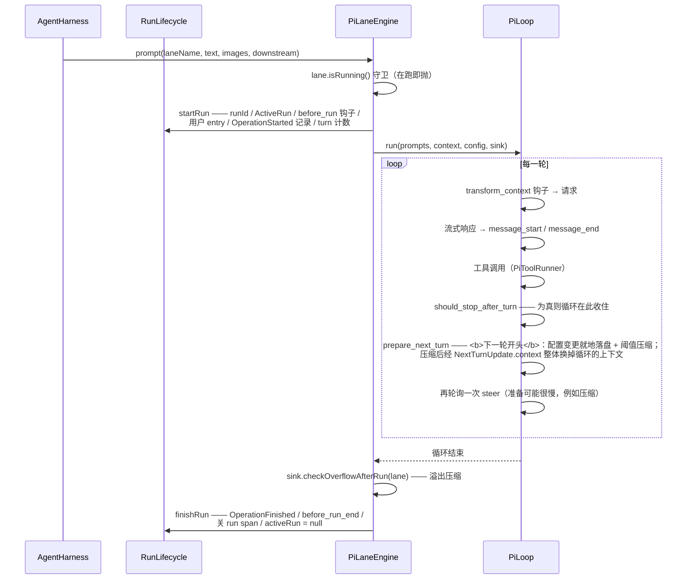

# pi-java 详细设计

> 本文档覆盖核心模块的类级设计、接口契约、状态机和数据模型。

---

## 1. `pi-java-ai` 模块详细设计

### 1.1 包结构

> **本节 2026-09-13 按代码重写。** 原稿是一份**规划**的包结构，与实际不符：
> 流事件是**一个** `StreamEvent.java` 里的 sealed 变体（原稿列了 8 个独立文件）；
> `ModelInfo` 在 `catalog/` 不在 `model/`；`SystemMessage.java` 已随
> `原 docs/31 §8.6` 删除（系统提示改由 harness 的 `Context` 承载）；`KeychainStore`
> 从未实现；`ImageApi` / `EmbeddingApi` / OpenAI Responses / Pi Messages 等
> 后来落地的适配器原稿里没有。

```
com.pijava.ai/
├── api/                    ← 公开 API（能力接口 + 请求/响应记录）
│   ├── ProviderApi.java      ← 标记接口（sealed）
│   ├── ChatApi.java  StreamApi.java  SimpleApi.java
│   ├── ImageApi.java  EmbeddingApi.java            ← 已落地（图片/嵌入能力）
│   ├── StreamIterator.java                         ← 虚拟线程友好的同步迭代器
│   └── StreamRequest.java  ApiOptions.java  ToolDefinition.java
├── protocol/               ← 协议适配器（一个协议一个适配器，供应商复用）
│   ├── AnthropicMessagesApi.java  OpenAICompletionsApi.java
│   ├── OpenAIResponsesApi.java  AzureOpenAIResponsesApi.java
│   ├── GoogleGenerativeAiApi.java  MistralConversationsApi.java
│   ├── PiMessagesApi.java                          ← pi 自有协议
│   ├── OpenAIEmbeddingApi.java  OpenRouterImagesApi.java
│   └── AbstractChatApi.java  ToolCallAccumulator.java  …
├── model/                  ← 模型标识与解析
│   ├── ModelId.java  ModelCapability.java  PricingInfo.java
│   └── ModelResolver.java  DefaultModelResolver.java
├── message/                ← 消息类型
│   ├── Message.java         ← 密封接口（user / assistant / toolResult 三角色）
│   ├── AssistantMessage.java
│   ├── ContentBlock.java    ← 文本 / 图片 / 工具调用
│   └── DeferredHandle.java
├── stream/                 ← 流事件
│   ├── StreamEvent.java     ← 密封接口，变体都是它的嵌套 record
│   ├── StreamPartialBuilder.java
│   └── ToolCallBuilder.java ← 工具参数增量聚合（多协议共享）
├── provider/               ← Provider 配置（绑定协议适配器）
│   ├── Provider.java        ← SPI 接口
│   ├── ProviderFactory.java  ProviderRegistry.java  ProviderConfig.java
│   ├── Protocol.java        ← 协议标识
│   ├── AnthropicProvider.java  OpenAIProvider.java  GoogleProvider.java
│   ├── DeepSeekProvider.java  MistralProvider.java
│   ├── AnthropicCompatibleProvider.java  OpenAiCompatibleProvider.java
│   ├── ConfigurableProvider.java          ← models.json 驱动的自定义供应商
│   ├── ModelsJsonConfig.java  ModelsJsonProvider.java  ModelsJsonSchema.java
│   ├── FauxProvider.java    ← 可编程假 Provider（测试与 L5 用）
│   └── builtin/
├── catalog/                ← 模型目录
│   ├── ModelCatalog.java  BuiltinCatalog.java
│   ├── ModelInfo.java  CatalogModel.java  ModelsStore.java
│   └── FileModelsStore.java  CatalogPublisher.java  …
├── auth/                   ← 认证
│   ├── CredentialStore.java  EnvApiKeyResolver.java  FileCredentialStore.java
│   ├── Credentials.java  AuthProfileManager.java
│   └── OAuthFlow.java  OAuthProvider.java  OAuthProviders.java
│       DeviceCodeFlow.java  OAuthCredentialStore.java  …
├── http/                   ← HTTP 传输
│   ├── PiHttpClient.java     ← 对 HttpClient 的薄封装
│   ├── PiHttpException.java  RetryPolicy.java  ProxyDetector.java
└── cli/                    ← pi-ai CLI
    ├── AiCli.java
    └── CatalogCommand.java
```

### 1.2 核心接口设计

```java
// ProviderApi — 标记接口：Provider 对外暴露的 API 能力
public sealed interface ProviderApi
    permits ChatApi, ImageApi, EmbeddingApi {
}

// Provider SPI — 扩展点
public interface Provider {
    /** 供应商名称，如 "anthropic"、"openai" */
    String name();

    /** 供应商显示名称 */
    String displayName();

    /** 支持的 API 类型 */
    Set<Class<? extends ProviderApi>> supportedApis();

    /** 创建具体的 API 实例 */
    <T extends ProviderApi> T createApi(Class<T> apiType, ApiOptions options);

    /** 内置模型列表 */
    ModelCatalog builtinModels();
}

// 流式请求
// ⚠️ 包 A2（原 docs/49）改签：`systemPrompt`/`messages`/`tools` 三个组件合并为
// `TranscriptContext transcript` —— 系统提示与工具声明都在它的系统消息里
// （pi 的 `normalizeContext` / `TranscriptContext`）。`systemPrompt`/`messages`/`tools`
// 的**兼容构造器**保留（内部调 `ContextNormalizer.normalize`），既有调用点零改动。
public record StreamRequest(
    ModelInfo model,                // 目标模型的完整元数据（含 compat）
    TranscriptContext transcript,   // 归一后的有序转录
    int maxTokens,                  // -1 表示使用默认值
    double temperature,             // -1 表示使用默认值
    Map<String, Object> extra,      // provider 特定参数
    Optional<ThinkingLevel> reasoning  // 未翻译的思考级别；空 ≙ 不开思考
) {
    public StreamRequest {
        transcript = transcript == null ? new TranscriptContext(List.of()) : transcript;
        extra = Map.copyOf(extra);
    }

    /** 兼容构造器：pi 的公开入口形参（Context.systemPrompt/messages/tools）。 */
    public StreamRequest(ModelInfo model, String systemPrompt, List<Message> messages,
                         List<ToolDefinition> tools, int maxTokens, double temperature,
                         Map<String, Object> extra) {
        this(model, ContextNormalizer.normalize(systemPrompt, messages, tools),
            maxTokens, temperature, extra);
    }
}

// 流消费 — 两种风格
// 方式 1：Flow API（标准 JDK）
Flow.Publisher<StreamEvent> stream = api.stream(request, options);

// 方式 2：虚拟线程友好的同步迭代器（推荐）
try (var stream = api.streamBlocking(request, options)) {
    for (StreamEvent event : stream) {
        switch (event) {
            case TextDelta(var text) -> output.append(text);
            case ToolCallStart(var id, var name) -> tool.start(id, name);
            case StreamDone(var usage) -> stats.record(usage);
            case StreamError(var err) -> handle(err);
            default -> {}
        }
    }
}
```

### 1.3 供应商转换关键路径

以 Anthropic 为例，消息和工具定义转换：

```
Java 内部表示                     Anthropic Messages API 格式
─────────────────────────────────────────────────────────
Context.systemPrompt         →  {"system": "..."}（顶层字段，不是一条消息）
Message.UserMessage(blocks)  →  {"role":"user","content":[...]}
Message.AssistantMessage     →  {"role":"assistant","content":[...]}
Message.ToolResultMessage    →  {"role":"user","content":[{"type":"tool_result",...}]}
ToolDefinition               →  {"name":"..","description":"..","input_schema":{...}}
ToolCallStart(id,name)       ←  {"type":"content_block_start","content_block":{"type":"tool_use",...}}
TextDelta(text)              ←  {"type":"content_block_delta","delta":{"text_delta","text":"..."}}
StreamDone(usage)            ←  {"type":"message_delta","delta":{"stop_reason":"stop"},...}
```

> **`Message.SystemMessage` 已删除（`原 docs/31 §8.6`）**：pi 的 `Message` 只有
> user / assistant / toolResult 三个角色，系统提示是 `Context.systemPrompt`，
> **六个 provider 适配层读的都是它、从不扫描消息列表**。原稿把系统提示画成一条
> `{"role":"system"}` 消息，那是删除之前的形态。

---

## 2. `pi-java-agent-core` 模块详细设计

### 2.1 运行态：`activeRun`

> **本节 2026-09-13 重写。** 原稿描述的是 pi **harness 层**的 phase 枚举
> （`idle` / `turn` / `compaction` / `branch_summary` / `retry`），那不是对齐目标
> `agent.ts` 的形状，对应的 `RunPhase` 枚举也已在 `03d8669` 删除。
> 完整决策见 `原 docs/31 §3.2` / `§8.8`。

pi 的 `Agent`（`agent.ts`）用**对象存在与否**表示「正在跑」：

```ts
activeRun?: { promise: Promise<void>; resolve: () => void; abortController: AbortController }
```

Java 侧同形 —— `LaneState.activeRun`，`null` 即空闲：

| pi | pi-java |
|---|---|
| `if (this.activeRun) throw "Agent is already processing."` | `RunLifecycle.begin` 的 `lane.isRunning()` 守卫 |
| `this.activeRun?.abortController.signal` | `LaneState.abortSignal()`：空闲返回 `null` |
| `abort() { this.activeRun?.abortController.abort() }` | `AgentHarness.abort(laneName)` |
| `waitForIdle() { return this.activeRun?.promise ?? Promise.resolve() }` | `AgentHarness.waitForIdle(laneName)`（`run.done().join()`） |
| `finishRun()` 里清空 | `RunLifecycle.finishRun` 末尾 `lane.activeRun = null` |

**`compaction` / `retry` / `branch_summary` 不是状态。** 它们各有归属：

| 原「阶段」 | 实际归属 |
|---|---|
| `compaction` | 运行内部的两个触发点 —— 阈值在 `prepareNextTurn`（pi `_compactBeforeNextAssistantResponse`），溢出在 `agent_end` 之后（pi `_handlePostAgentRun`）。**运行态不因此改变**（`原 docs/31 §4.2`） |
| `retry` | 会话层（`SessionRunner` 的自动重试走 `continueRun` + `dropTrailingErrorAssistant`） |
| `branch_summary` | 会话层 —— 分支是**新会话**（`AgentSession.forkFromEntry`），不是车道 |

#### 一次运行的生命周期


```mermaid
sequenceDiagram
    participant H as AgentHarness
    participant L as RunLifecycle
    participant E as PiLaneEngine
    participant P as PiLoop

    H->>E: prompt(laneName, text, images, downstream)
    E->>E: lane.isRunning() 守卫（在跑即抛）
    E->>L: startRun —— runId / ActiveRun / before_run 钩子 /<br/>用户 entry / OperationStarted 记录 / turn 计数
    E->>P: run(prompts, context, config, sink)
    loop 每一轮
        P->>P: transform_context 钩子 → 请求
        P->>P: 流式响应 → message_start / message_end
        P->>P: 工具调用（PiToolRunner）
        P->>P: should_stop_after_turn —— 为真则循环在此收住
        P->>P: prepare_next_turn —— <b>下一轮开头</b>：配置变更就地落盘 + 阈值压缩；<br/>压缩后经 NextTurnUpdate.context 整体换掉循环的上下文
        P->>P: 再轮询一次 steer（准备可能很慢，例如压缩）
    end
    P-->>E: 循环结束
    E->>E: sink.checkOverflowAfterRun(lane) —— 溢出压缩
    E->>L: finishRun —— OperationFinished / before_run_end /<br/>关 run span / activeRun = null
```

`should_stop_after_turn` 在 `prepare_next_turn` **之前**：pi 的 `shouldStopAfterTurn` 一真，
`prepareNextTurn` 就不再被调用（`原 docs/31 §8.4`，实施时读源码发现的两处顺序修正之一）。

`drive` 用 `try/finally` 保证**驱动抛异常时同样收口**（按 `"error"` 结算），否则
`activeRun` 会永远挂着，车道再也起不了新运行、`waitForIdle` 永远等下去。

`prompt` / `continueRun` 是**阻塞**的：pi 的 `prompt()` 返回 Promise，Java 侧由调用线程
直接跑到收口 —— 对齐的是「可观察效果的顺序」，不是 async 机器（`原 docs/31 §8.5`）。

### 2.2 AgentHarness 核心类

> **本节 2026-09-13 重写。** 原稿是 Phase 2c 的推测 API（`TreeNavigator` /
> `promptFromTemplate` / 手动驱动 / 多车道容器），与代码早已不符。下文按 `ab7d309`
> 的实际形状。

`AgentHarness` 是 pi `Agent` 的 Java 版宿主：**一个 harness 恰好一条车道**
（`LaneState`，即 pi 的 `AgentState`），分支是**新会话**而不是新车道
（`原 docs/31 §4.3` / `§8.12`）。

#### 构造配置 —— `HarnessConfig`（record，19 个字段）

| 字段 | 用途 |
|---|---|
| `streamFn` / `model` / `thinkingLevel` / `systemPrompt` | LLM 调用与提示 |
| `activeTools` / `toolRegistry` / `toolContext` / `commandPrefix` | 工具 |
| `maxInputTokens` | 溢出检测的窗口 |
| `compactionSettings` | `null` = 不自动压缩 |
| `skills` / `summaryGenerator` | 技能与压缩摘要生成 |
| `retryPolicy` / `telemetry` / `thinkingLevelMap` | HTTP 重试、遥测、思考等级翻译 |
| `steeringMode` / `followUpMode` / `toolExecution` | 队列排空模式与工具执行模式 |
| `streamListener` | 每一条 `StreamEvent` 的旁路接收器（TUI / print 流式） |

`HarnessConfig` 被 harness 留存一份副本，**只为 `fork()`**。

#### 公开 API

```java
public class AgentHarness implements AutoCloseable {

    public static final String DEFAULT_LANE = "default";

    /** 同配置的全新 harness（车道为空，内容由调用方播种）。会话层建分支用。 */
    public AgentHarness fork();

    // ── 运行（阻塞；pi Agent.prompt / continue）──────────────
    public PiLaneEngine.RunOutcome prompt(String text);
    public PiLaneEngine.RunOutcome prompt(String text, List<PromptImage> images);
    public PiLaneEngine.RunOutcome prompt(String laneName, String text,
                                          List<PromptImage> images);
    public PiLaneEngine.RunOutcome prompt(String laneName, String text,
                                          List<PromptImage> images, PiLoop.Sink downstream);
    public PiLaneEngine.RunOutcome continueRun();
    public PiLaneEngine.RunOutcome continueRun(String laneName, PiLoop.Sink downstream);
    public void abort();                       // 另有 abort(String laneName)
    public void waitForIdle(String laneName);

    // ── 空闲操作 ────────────────────────────────────────────
    public void reset();                       // 另有 reset(String laneName)
    /** 手动压缩（带不带 customInstructions 两载），返回压缩结果。 */
    CompactionResult compact(CompactionSettings settings);
    CompactionResult compact(CompactionSettings settings, String customInstructions);
    public void seedTranscript(String laneName, List<Entry> entries);   // resume 播种
    public void restoreRecords(String laneName, List<LaneRecord> records);
    public void dropTrailingErrorAssistant(String laneName);            // 重试前清残缺助手消息

    // ── 队列调度（三条：steer / followUp / nextRun）──────────
    public String steer(String laneName, String prompt);
    public String followUp(String laneName, String prompt);
    public String nextRun(String laneName, String prompt);
    public void cancelQueued(String laneName, String queueType);
    public QueueMode steeringMode();  public void steeringMode(QueueMode mode);
    public QueueMode followUpMode();  public void followUpMode(QueueMode mode);

    // ── 模型 / 思考级别 / 提示 / 工具 / 压缩 ─────────────────
    public ModelId<?> getModel();                 public void setModel(ModelId<?> model);
    public ModelThinkingLevel getThinkingLevel(); public void setThinkingLevel(ModelThinkingLevel level);
    public String getSystemPrompt();              public void setSystemPrompt(String prompt);
    public Set<AgentTool<?, ?>> getActiveTools(); public void setActiveTools(Set<AgentTool<?, ?>> tools);
    public CompactionSettings getCompactionSettings();
    public void setCompactionSettings(CompactionSettings s);
    public ToolContext toolContext();
    public ToolExecution toolExecution();         public void toolExecution(ToolExecution mode);

    // ── 快照 / 订阅 ─────────────────────────────────────────
    public LaneSnapshot snapshot(String laneName);
    public WatchHandle<LaneSnapshot> watch(String laneName);
    public WatchHandle<SessionSnapshot> watchSession();
    public AutoCloseable onStreamEvent(Consumer<StreamEvent> listener);

    // ── 其它 ────────────────────────────────────────────────
    public String laneName();                     // 恒为 DEFAULT_LANE
    public AssistantMessage lastAssistantMessage();
    public SkillManager skillManager();
    public HookSystem hookSystem();
    public void close();
}
```

**`setModel` / `setThinkingLevel` 会顺带写 entry**（`原 docs/31 §4.1`）：字段赋值是唯一真源，
entry 是它的审计副本 —— 模型**无条件**写（pi `agent-session.ts:1687`），思考等级**变了才**写
（`:1813-1829` 的 `isChanging` 守卫，且默认等级 `off` 不入日志）。

#### `LaneState` —— pi `AgentState` 的 Java 版

```java
public final class LaneState {
    String laneName;                       // 恒为 "default"
    final List<Entry> transcript;          // **持久真源**：entry 日志
    final List<Message> messages;          // **工作副本**：送给 provider 的那份
    String runId;
    AssistantMessage partial;              // pi streamingMessage
    NewestOwn newestOwn;                   // 结局判定用（determineOutcome）
    ActiveRun activeRun;                   // null = 空闲
    TelemetrySpan runSpan;
    long runStartNanos;
    String recordedThinking;               // 「上次记过什么」——§4.1 的守卫

    // 配置（pi AgentState 的字段；此前住在 HarnessState）
    ModelId<?> model;
    ModelThinkingLevel thinkingLevel;
    String systemPrompt;
    Set<AgentTool<?, ?>> activeTools;
    CompactionSettings compactionSettings;
    QueueMode steeringMode, followUpMode;
    ToolExecution toolExecution;

    // 调度队列（steer / followUp / nextRun）
    final ArrayDeque<LaneInfo.QueuedItem> steerQueue, followUpQueue, nextRunQueue;
    long queueSeq;

    public final List<LaneRecord> records;  // 旁路审计，不参与状态
}
```

**两层真源的分工**（`原 docs/31 §4.2`）：`transcript` 是持久真源，`messages` 是它的投影。
工作副本由**事件**维护（`PiLaneSink` 在 `message_end` 上追加，对齐 pi `agent.ts:554-557`），
只在日志被**整体替换**时重建 —— resume 播种、压缩、reset。此前每次请求都从 entry 日志
重走一遍 `pathToLeaf`，那是本字段存在的理由。

#### 快照

| 类型 | 内容 |
|---|---|
| `LaneSnapshot` | `lane` / `transcript` / `records` / `leafId` / `operation`（空闲为 `null`）/ `queues` / `faulted` |
| `SessionSnapshot` | `name` / `model` / `phase`（`"running"`\|`"idle"`）/ `totalTokens` / `turnCount` / `activeTools` / `lanes`（**单元素**：一个 harness 一条车道） |
| `WatchHandle<T>` | `current()` / `subscribe(Consumer<T>)` / `close()` |

`faulted` 的判据是「记录里存在 `OperationFinished` 且结局为 `FAILED`」—— 所以 abort 必须
记成 `ABORTED` 而不是 `FAILED`，否则用户主动中止会污染故障标记。

### 2.3 操作记录体系：Entry + LaneRecord

两层记录：**Entry**（用户可见的持久化事件，构成对话转录）与 **LaneRecord**（车道级内部
审计记录）。两者都是 `sealed interface` + `record` 的代数数据类型，判别字面量由
`type()` 给出并与 JSON 的 `type` 属性一致。

```java
public sealed interface Entry {
    String id();
    long seq();
    String parentId();          // 根为 null
    Instant timestamp();
    String type();              // 判别字面量（@JsonTypeInfo 用）
    Entry committed(long seq, String parentId, Instant timestamp);  // 存储分配身份后重建
}
```

`seq` 是全仓**共享**的单调序号（entry / record / lane / fact 同一个空间）。

#### Entry 的 9 个变体

| 变体 | 关键字段 | 语义 |
|---|---|---|
| `Message` | `message`（`UserMessage`/`AssistantMessage`/`ToolResultMessage`）、`terminate` | 对话消息。**角色只在消息对象里** —— 系统提示不是 entry，它挂在 `Context.systemPrompt` 上 |
| `ModelChange` | `provider`、`modelId` | 模型切换（配置） |
| `ThinkingLevelChange` | `thinkingLevel`（`"off"`…`"xhigh"`） | 思考等级切换（配置） |
| `Compaction` | `summary`、`firstKeptEntryId`、`retainedTail`、`tokensBefore`、`details`、`usage` | 压缩标记。`firstKeptEntryId` 是平铺字段 |
| `BranchSummary` | `fromId`、`summary`、`details`、`usage` | 分支摘要 |
| `Usage` | `kind`、`provider`、`model`、`usage`，＋本仓审计扩展（`runId`/`entryId`/…） | 模型记账（包 12 D6 起为**一等 entry**；pi 的 9 个键逐字对应） |
| `ContextEdit` | `targetId`、`replacement`（可显式 null） | 追加式上下文编辑（包 13） |
| `Custom` | `customType`、`data` | 扩展事件（不进 LLM 上下文） |
| `CustomMessage` | `customType`、`content`、`display`、`details` | 扩展注入的消息：`content` 进 LLM 上下文，`display` 只管 TUI 渲染 |

> **没有 `ActiveToolsChange` 变体**：pi 主线从不发射它（只存在于 legacy v3 导入器），
> 工具增删状态线在 pi 是**系统消息**（toolsAdded/toolsRemoved），不是 entry；
> 本仓只读形状已于包 A3 删除。曾经的 `isConfiguration()` 也随之于 2026-09-13 删除。

#### LaneRecord 的 10 个变体

```java
public sealed interface LaneRecord {
    String id(); long seq(); String lane(); Instant timestamp();
    String type();                                              // 判别字面量
    LaneRecord committed(long seq, Instant timestamp);          // 存储分配身份后重建
}
```

| 变体 | 关键字段 | 语义 |
|---|---|---|
| `OperationStarted` | `sourceLeafId`、`intent` | 操作开始。`intent` 是 sealed：`Run`（`originalPrompt` / `initialMessages` / `systemPromptOverride` / `resumeData`）、`Compaction`（`customInstructions` / `resultEntryId`）、`Navigation`（`targetId` / `summarize` / `label` / `summaryEntryId`） |
| `AbortRequested` | `runId` | 中止请求 |
| `OperationFinished` | `runId`、`outcome`、`error`、`durationMs` | 操作结束。`outcome` ∈ `COMPLETED`/`ABORTED`/`FAILED`/`DECLINED` |
| `StepAttempt` | `step`（`StepKind`）、`attempt`、`resultEntryId`、`compactionReason`、`model`、`messageCount`、`toolCount`、`thinking`、`durationMs` | 一次 LLM 调用尝试。**stopReason 不在这里** —— 它在 `resultEntryId` 指向的消息 entry 上，entry 是唯一真源（`原 docs/22` D1） |
| `ToolStarted` | `assistantEntryId`、`toolIndex`、`toolCallId`、`toolName`、`effectiveArgs`、`resultEntryId`、`replay` | 工具开始执行 |
| `ToolFinished` | `toolCallId`、`toolName`、`isError`、`terminate`、`resultEntryId`、`durationMs` | 工具执行结束（可观测性：结局 + 延迟） |
| `QueueEnqueued` | `queue`（`QueueKind`）、`runId`、`target` | 入队 |
| `QueueConsumed` | `queue`、`runId`、`targets` | 一批排空被消费。pi-java 特有：pi 从 entry 是否出现推断消费，而 pi-java 把整次排空合成一条用户消息，故需要显式标记 |
| `QueueCancelled` | `runId`、`entryId` | 队列项被取消 |
| `WriteDeferred` | `runId`、`target` | 运行中写入被标记为 deferred |

> token 用量记账已在包 12（D6）改为一等 **`Entry.Usage`**，LaneRecord 不再有
> UsageRecord 变体。**记录日志是旁路审计，不参与状态推导。** 折叠链（`LaneStateFolder` /
> `RecordLogValidator`）已退休，`原 docs/30` 明文禁止从记录反推状态；恢复时记录被原样载入，
> 车道回到**空闲**，队列**为空**（队列是进程内的，崩溃即丢）。
> 恢复的上下文由 `seedTranscript` 负责 —— 它是「用日志重建工作副本」的那条路径。

---

### 2.4 存储接口：SessionStorage + SessionRepository

> **本节 2026-09-13 按代码重写。** 原稿的 `Session` 被写成「只剩 `metadata()` / `storage()`
> 的接口」，实际它是**委派整个存储面的类**；`LaneInfo` / `ForkOptions` / `SessionStats`
> 三个辅助类型也与代码不符。

pi 有两层存储抽象：**SessionStorage**（单会话读写）和 **SessionRepository**（会话生命周期管理）。
另有一个**会话树视图** `SessionTree` —— `Session` 与 `LaneView` 都实现它，因此「读一条车道」
与「读整个会话」共用同一套查询面。

```java
// ═══════════════════════════════════════════════════════════
// SessionStorage<TMetadata> — 单会话持久化接口（后端实现它）
// ═══════════════════════════════════════════════════════════

public interface SessionStorage<TMetadata extends SessionMetadata> {

    // ── 元数据 ──────────────────────────────────────────
    TMetadata getMetadata();

    // ── 车道管理（存储层的分支模型，原 docs/31 §8.10）────────
    List<LanePointer> getLanes();                      // record LanePointer(lane, leafId)
    void createLane(String lane, String at);
    void moveLane(String lane, String to);

    // ── 写入（**身份由这里赋**：committed(seq, parentId, timestamp)）
    <T extends Entry> T appendEntry(ProvisionedEntry<T> entry, String lane);
    <T extends LaneRecord> T appendRecord(NewRecord<T> record);

    // ── 查询 ────────────────────────────────────────────
    Entry getEntry(String id);
    List<Entry> findEntries(EntryQuery query);
    List<Entry> findEntriesOnBranch(EntryQuery query, BranchBounds bounds, String start);
    List<LaneRecord> findRecords(RecordQuery query);
    List<LaneRecord.OperationStarted> findOpenOperations(String lane, int limit);
    List<LogItem> getLog(LogOptions options);

    // ── 命名与标签 ──────────────────────────────────────
    String getName();
    void setName(String name);
    String getLabel(String id);
    void setLabel(String id, String label);

    // ── 统计 / 生命周期 ─────────────────────────────────
    SessionStats getStats();
    void drain();                                      // 把待写缓冲刷到底层
    void close();
}

// ═══════════════════════════════════════════════════════════
// SessionRepository<TMetadata, TCreateOptions, TListOptions>
//   — 会话生命周期管理
// ═══════════════════════════════════════════════════════════

public interface SessionRepository<
        TMetadata extends SessionMetadata, TCreateOptions, TListOptions> {

    /** 创建会话，并取得后端的写者声明（SQLite：writer lease；JSONL：无锁）。 */
    Session<TMetadata> create(TCreateOptions options);

    /** 打开已有会话，同样要取得写者声明。 */
    Session<TMetadata> open(TMetadata metadata);

    /** 只列元数据，不开会话、不取声明。 */
    List<TMetadata> list(TListOptions options);

    /** 删除会话（幂等）。 */
    void delete(TMetadata metadata);

    /** 按给定范围分叉。 */
    Session<TMetadata> fork(TMetadata source, ForkOptions options, TCreateOptions createOptions);
}

// ── 会话句柄：一个类，委派整个存储面 ──────────────────────
//
// Session 不是「只剩两个方法」的接口 —— 它把 SessionStorage 的读写面全套转发出来，
// 并额外提供 view(lane) 取单条车道视图、getLeafId()、idGenerator()。
// 它和 LaneView 一样实现 SessionTree。

public final class Session<TMetadata extends SessionMetadata> implements SessionTree {
    public Session(SessionStorage<TMetadata> storage);            // 默认 UuidV7 id 生成器
    public Session(SessionStorage<TMetadata> storage, IdGenerator idGenerator);

    public TMetadata getMetadata();
    public SessionStorage<TMetadata> storage();
    public IdGenerator idGenerator();
    public SessionTree view(String lane);      // 非 "main" 时返回 LaneView
    public List<LanePointer> getLanes();
    public void createLane(String lane, String at);
    public void moveLane(String lane, String to);
    public <T extends Entry> T appendEntry(ProvisionedEntry<T> entry, String lane);
    public <T extends LaneRecord> T appendRecord(NewRecord<T> record);
    public List<LaneRecord> findRecords(RecordQuery query);
    public List<LaneRecord.OperationStarted> findOpenOperations(String lane, int limit);
    public List<LogItem> getLog(LogOptions options);
    // … SessionTree 的读面：getLeafId / getEntry / findEntries /
    //    findEntriesOnBranch / getStats / getName / setName / getLabel / setLabel
    public void close();
}

// ── 辅助类型（按代码）─────────────────────────────────────

public record LanePointer(String lane, String leafId) {}

/** 分叉范围：整棵树，或在某个 entry **之前/之后**的分支。 */
public sealed interface ForkOptions {
    record Branch(String entryId, Position position) implements ForkOptions {
        public enum Position { BEFORE, AFTER }
    }
    record Tree() implements ForkOptions {}
}

public record SessionStats(
    long messageCount,
    double cachedTokens,
    double uncachedTokens,
    double totalTokens,
    double costTotal
) { public static SessionStats zero() { … } }

/** 合并读流：entry / record / lane 指针 / 会话名 / 标签，按 seq 归并。 */
public sealed interface LogItem {
    long seq();
    record EntryItem(long seq, Entry entry) implements LogItem {}
    record RecordItem(long seq, LaneRecord record) implements LogItem {}
    record LaneItem(long seq, String lane, String leafId) implements LogItem {}
    record NameItem(long seq, String name) implements LogItem {}
    record LabelItem(long seq, String targetId, String label) implements LogItem {}
}

public record LogOptions(Long afterSeq, Integer limit) { … }
public record BranchBounds(String start, String stopAtType, String stopAtId) { … }
```

`EntryQuery` / `RecordQuery` 是查询条件记录（各带 `all()` / `last(n)` 等便捷构造），
字段较细，以源码为准。

**身份归属**（`原 docs/31 §8.14`）：`appendEntry` 是**身份的唯一权威** —— 它调
`entry.committed(state.nextSequence(), 车道的 tip, now)` 重赋 `seq` / `parentId` / `timestamp`
（id 保留并校验未占用）。调用方传进去的 `ProvisionedEntry` 里的这些值是**占位**。
```

### 2.5 工具系统

> **本节 2026-09-13 按代码重写。** 原稿描述的 `ToolDefinitions` 工厂、`AgentTool extends Tool`
> 带嵌套 `ExecutionMode` 枚举、以及 `BashToolOptions` / `ReadToolOptions` / `EditToolOptions`
> 三个选项 record —— **全都不存在**。它们从未被实现过，也没留下痕迹。

工具系统分三层：**工具本体**（`AgentTool`）、**给 LLM 的定义**（`ToolDefinition`）、
**执行与注册**（`ToolRegistry` + `ToolContext` + `ToolResult`）。

```java
// ═══════════════════════════════════════════════════════════
// AgentTool<TParams, TDetails> — 可被 Agent 执行的工具
// ═══════════════════════════════════════════════════════════

public interface AgentTool<TParams, TDetails> {

    String name();                                  // 唯一名（"bash" / "read" / …）
    String label();                                 // UI 显示名
    String description();                           // 给 LLM 的说明
    Map<String, Object> inputSchema();              // 参数的 JSON Schema
    ExecutionMode executionMode();                  // 能否与其他工具并发

    /** system prompt 的 Available-tools 一段里的一行；空串则退回 description()。 */
    default String promptSnippet() { return ""; }

    /** 本工具激活时追加到 system prompt 的指南条目。 */
    default List<String> promptGuidelines() { return List.of(); }

    /** 原始参数 → TParams 的兼容性垫片（schema 校验之前）。 */
    @SuppressWarnings("unchecked")
    default TParams prepareArguments(Map<String, Object> raw) { return (TParams) raw; }

    /**
     * 执行。**失败要抛异常** —— harness 捕获后包成错误结果
     * （对齐 pi 的异常驱动错误模型）。
     */
    ToolResult<TDetails> execute(String toolCallId, TParams params, AbortSignal signal,
                                 ToolUpdateCallback<TDetails> onUpdate, ToolContext context)
        throws Exception;
}

/**
 * 执行模式。**是 sealed interface 不是 enum** —— pi 用对象表达两态，
 * 而 ADT 的形状在这里与常量枚举同价，按 `CLAUDE.md` 的取舍规则取 sealed。
 */
public sealed interface ExecutionMode {
    /** 不能与其他工具并发（bash）。 */
    record Sequential() implements ExecutionMode {}
    /** 可与其他 parallel 工具并发（read / grep / ls / glob）。 */
    record Parallel() implements ExecutionMode {}
}

// ═══════════════════════════════════════════════════════════
// ToolDefinition — 交给 provider 的定义（com.pijava.ai.api）
// ═══════════════════════════════════════════════════════════

public record ToolDefinition(
    String name,
    String description,
    Map<String, Object> inputSchema,
    String label,
    String promptSnippet,
    List<String> promptGuidelines,
    String renderShell            // 供 TUI 渲染工具卡片的 shell 片段
) {}

// ═══════════════════════════════════════════════════════════
// 注册表 —— 注册、按名取、执行、导出定义
// ═══════════════════════════════════════════════════════════

public class ToolRegistry {
    public ToolRegistry(ApprovalHandler approvalHandler);   // null = 不审批

    public void register(AgentTool<?, ?> tool);
    public void registerAll(List<AgentTool<?, ?>> toolList);
    public AgentTool<?, ?> get(String name);
    public Set<String> toolNames();
    public Collection<AgentTool<?, ?>> all();
    public void clear();

    public ToolResult<?> execute(…);
    public List<ToolDefinition> toToolDefinitions();
    public String toSystemPromptFragment();
}

// ═══════════════════════════════════════════════════════════
// 执行环境与结果
// ═══════════════════════════════════════════════════════════

/** 显式注入的执行环境 —— Java 没有 TS 的闭包式 DI，所以由参数传。 */
public class ToolContext {
    public ToolContext(String cwd, Map<String, String> env,
                       ShellExecutor shell, FileSystem fs);
    public String cwd();
    public Map<String, String> env();
    public ShellExecutor shell();
    public FileSystem fs();
}

public record ToolResult<TDetails>(
    List<ContentBlock> content,
    TDetails details,
    UsageInfo usage,                   // 工具自身的用量（可空），不计入主 LLM 计数
    boolean terminate,                 // 提示 Agent 在本批工具后停下
    List<String> addedToolNames        // 本结果动态注册的工具（MCP 预留，当前恒空）
) {
    public static <T> ToolResult<T> success(String text);
    public static <T> ToolResult<T> success(String text, T details);
    public record UsageInfo(long inputTokens, long outputTokens) {}
}

// ═══════════════════════════════════════════════════════════
// 工具集工厂（真名是 ToolSetFactory，不是 ToolDefinitions）
// ═══════════════════════════════════════════════════════════

public final class ToolSetFactory {
    /** 编程工具集：bash / read / write / edit / find / grep / ls / glob … */
    public static List<AgentTool<?, ?>> createCodingTools(String commandPrefix);
    /** 只读工具集：无写操作。 */
    public static List<AgentTool<?, ?>> createReadOnlyTools();
}

// ═══════════════════════════════════════════════════════════
// file-mutation-queue（文件变更队列）
// ═══════════════════════════════════════════════════════════

/**
 * 同一文件的写/编辑串行化，避免并发工具的竞态。
 *
 * <p><b>是包内可见的实现，不是公开接口</b>：入口只有
 * {@code <T> T withQueue(String filePath, ThrowingSupplier<T> fn)} ——
 * 按文件路径算出的 canonical key 排队，前一个完成才轮到下一个，
 * 退出时释放并清掉空队列。原稿写的 {@code enqueue} / {@code drain} /
 * {@code drainAll} / {@code pendingCount} 四个方法都不存在。</p>
 */
final class FileMutationQueue {
    <T> T withQueue(String filePath, ThrowingSupplier<T> fn) throws Exception;
}
```

内置工具在 `com.pijava.agent.tool.builtin`：`BashTool` / `ReadTool` / `WriteTool` /
`EditTool` / `GlobTool` / `GrepTool` / `LsTool`（另有 `EditDiff` / `LineDiff` 供 diff 渲染，
`FileMutationQueue` 供串行化）。每个工具**自带参数校验**，没有集中的 options record
—— 需要开关时由 `ToolSetFactory` 的构造参数决定启用集。

---

## 3. `pi-java-tui` 模块详细设计

> **核心决策**：不自造终端渲染引擎，构建在 TamboUI 之上 —— ToolkitRunner
> 渲染循环、Element 组件树（Column 等）、StyleEngine 样式、终端事件
> （KeyEvent/MouseEvent/…）均由 TamboUI 提供；`pi-java-tui` 只写业务组件、
> 事件接线与主题。终端后端（panama/jline）经 `util` 的 NoMode2027 shim 选择。

### 3.1 包结构（以代码为准）

```
com.pijava.tui/
├── app/                      ← 应用壳
│   ├── PiTuiApp.java         ← 渲染循环：每帧排空跨线程事件、全局快捷键、
│   │                            驱动 InteractiveMode、模态 overlay、滚动
│   ├── PiTuiEntryPoint.java  ← main 入口装配
│   ├── PiTuiLauncher.java    ← 启动/会话切换装配
│   └── SessionEventChannel.java  ← 会话事件订阅通道
├── screen/                   ← 屏幕与模态
│   ├── ChatScreen.java       ← 主屏幕（见 3.2）
│   ├── ModelSelectorScreen.java
│   ├── SessionListScreen.java
│   ├── TreeSelectorScreen.java
│   ├── SettingsScreen.java
│   ├── ScreenOverlay.java    ← overlay 基类
│   └── WelcomeOverlay.java
├── component/                ← 业务组件
│   ├── ChatPanel.java  ChatViewportElement.java  RenderRow.java
│   ├── MessageBubble.java  ChatMessage.java  MetaKind.java
│   ├── EditorComponent.java  EditorWordNav.java
│   ├── LogicalLine.java  KillRing.java
│   ├── SlashCompleter.java  SelectList.java  KeybindingHints.java
│   ├── StatusBar.java  StatusIndicator.java
│   ├── ToolCallCard.java  DiffView.java
│   ├── FuzzyMatcher.java
│   ├── MarkdownRenderer.java  SyntaxHighlighter.java  ← 未接线（B65）
│   └── …
└── util/
    ├── TuiEventDispatcher.java  ← 跨线程事件 → 渲染线程
    ├── TamboUIAdapter.java      ← TamboUI API 隔离层
    ├── TextLayout.java
    ├── ScrollbackTranscript.java  ScrollConfig.java
    ├── ScrollInputNormalizer.java  ScrollUpdate.java
    ├── InlineRenderContext.java  InlineTuiShell.java  CountdownWake.java
    ├── EditorElement.java
    ├── NoMode2027Backend.java  NoMode2027JLineBackend.java  ← 后端 shim
    └── …
```

另在 `src/main/java/dev/tamboui/tui/event/EventParser.java` 等位置有少量
**包内覆写**（TamboUI same-package 覆写点，属例外登记）。
主题资源：`resources/themes/pi-dark.tcss`、`pi-light.tcss`（StyleEngine 加载）。

### 3.2 ChatScreen

主聊天屏幕：转录视口（流式草稿也在视口内）＋ 编辑器 ＋ 状态栏。

- 直接实现 coding-agent 的 **`StreamObserver` / `EntryObserver`**（没有额外的
  MessageObserver 间接层）；所有变动经 `TuiEventDispatcher` 汇集到**渲染线程**
- 持有唯一一个 **`StatusIndicator`** 指示器槽（pi activeStatusIndicator）：
  压缩/重试时显示、结束即清；倒计时唤醒来自独立线程（volatile 承载）
- assistantDraft/thinkingDraft 累积流式草稿；提交时乐观显示的 user 文本在
  转录条目落定后做去重匹配，不重复渲染
- 状态栏数据来自 agent-core 的 **`SessionSnapshot`**（name/model/统计等）

### 3.3 边界与已知问题

- **Markdown 渲染未接线**：`MarkdownRenderer`/`SyntaxHighlighter` 是死代码，
  助手消息走 `MessageBubble`＋`TextLayout` 纯文本；「接线还是删声明」＝台账 B65
- TUI 其它已知缺口（压缩后不重建聊天区 B38、压缩窗口 Esc 换绑 B39、
  tool_execution_update 不发射 B46、fuzzy 语义 B78 等）见 docs/04
- TamboUI 版本由 BOM/dependencyManagement 锁定，升级走 `TamboUIAdapter`
  隔离面与专项验证

## 4. `pi-java-coding-agent` 模块详细设计

### 4.1 AgentSession

> **本节 2026-09-13 按代码重写。** 原稿把 `AgentHarness` 放进了 `SessionServices`，
> 还写了 `resume(String, SessionServices)` 与 `branch(String)` —— 都不存在。
> `SessionServices` 是**共享的依赖容器**（多个会话可以共用一个），harness 是**每个会话
> 自己的**（`原 docs/31 §4.3`），两者刻意分开。

```java
public final class AgentSession implements AutoCloseable {

    public static final String DEFAULT_SYSTEM_PROMPT = …;

    // ── 构造：五个入口，差别只在「后端 + 依赖怎么来」────────
    public static AgentSession create(Args args);                    // 持久化后端（jsonl/sqlite）
    public static AgentSession createWeb(Args args);                 // web：恢复最近会话，无则新建
    public static AgentSession create(Args args, ProviderRegistry providers,
                                      ToolContext toolContext);      // 注入依赖（RPC / 测试）
    static AgentSession create(Args args, InMemorySessionRepository repository);  // 内存仓库（测试）

    // ── 一个会话 = 一个 harness（分支就是新会话）────────────
    public AgentHarness harness();
    public SessionServices services();
    public String laneName();                  // 恒为 AgentHarness.DEFAULT_LANE

    // ── 运行 ────────────────────────────────────────────────
    public SessionResult processPrompt(String prompt);                       // 阻塞
    public SessionResult processPrompt(String prompt, PromptConfig config);
    public SessionResult processPrompt(String prompt, PromptConfig config,
                                       StreamObserver observer, …);          // 带流式观察者
    public void abort();
    public String steer(String prompt);        // 注入当前运行的下一轮
    public String followUp(String prompt);     // 当前运行结束后处理
    /** 手动压缩；无 custom ⇒ 便捷重载。返回压缩结果。 */
    public CompactionResult compact(CompactionSettings settings);
    public CompactionResult compact(CompactionSettings settings, String customInstructions);
    public String lastAssistantText();         // /copy

    // ── 自动重试（RPC 末批命令）──────────────────────────────
    public void setAutoRetryEnabled(boolean enabled);
    public boolean autoRetryEnabled();
    public void abortRetry();

    // ── 分支：**新会话**，各自一个 harness ───────────────────
    /** 整棵树都复制（pi {@code ForkOptions.Tree}）。 */
    public AgentSession forkCopy(String branchName);
    /** 在 entry **之前**分支（pi {@code position:"before"}）。 */
    public AgentSession forkFromEntry(String entryId);
    public List<Entry.Message> getUserMessagesForForking();

    // ── 历史视图 / 会话管理 ─────────────────────────────────
    public long entryCount();
    public List<Entry> accumulatedEntries();   // 持久会话的提交序；无持久会话时退回 harness
    public List<com.pijava.ai.message.Message> accumulatedMessages();
    public String sessionId();  public String sessionName();  public void setSessionName(String);
    public Args sessionArgs();
    public List<SessionInfo> listSessions();
    public List<SessionSummary> listSessionsSummary(String cwd);
    public Optional<AgentSession> latestSession();
    public Optional<AgentSession> findSession(String idOrPrefix);

    // ── 订阅 / 事件 / 扩展 ──────────────────────────────────
    public AutoCloseable subscribe(Consumer<AgentSessionEvent> listener);
    public WatchHandle<SessionSnapshot> watchSession();
    public void extensionUI(ExtensionUI ui);   public ExtensionUI extensionUI();

    // ── 导入导出 / 会话级 bash ──────────────────────────────
    public void exportJsonl(java.nio.file.Path target);
    public AgentSession importJsonl(java.nio.file.Path source);
    public ShellResult executeBash(String id, String command, boolean excludeFromContext);
    public void abortBash();

    public void close();                       // flush 设置、落盘、关 harness
}

/**
 * 会话共享的依赖容器 —— **不含 harness**。
 *
 * <p>harness 是每会话一个（分支 = 新会话），而 settings / providers / tools /
 * slash commands / 仓库句柄这些是进程级的，多个会话共用同一份。</p>
 */
public record SessionServices(
    SettingsManager settings,
    TrustManager trust,
    ProviderRegistry providers,
    ModelResolver models,
    ToolRegistry tools,
    CommandRegistry slashCommands,
    SessionRepository<?, ?, ?> sessionRepository,
    PromptTemplateRegistry promptTemplates
) {}
```

**驱动在哪**：`processPrompt` 不自己跑循环，它交给 `SessionRunner` —— 那里才是
「`harness.prompt(...)` / `continueRun(...)` + 逐条落盘 + 自动重试 + run summary」的地方。
```

### 4.2 CLI 入口

对齐 pi 的约 40 个参数及多个子命令（以 ArgsParser 为准）：

```java
public final class Main {
    public static void main(String[] args) {
        var parsed = ArgsParser.parse(args);
        switch (parsed) {
            // ═══════════════════════════════════════════
            // 运行模式
            // ═══════════════════════════════════════════
            case Args.Interactive(var opts)    -> runInteractive(opts);
            case Args.Print(var prompt, var o) -> runPrintMode(prompt, o);
            case Args.Version                  -> printVersion();
            case Args.Help                     -> printHelp();

            // ═══════════════════════════════════════════
            // 会话管理
            // ═══════════════════════════════════════════
            case Args.Continue(var opts)       -> runContinue(opts);
            case Args.Resume(var sessionId, var o) -> runResume(sessionId, o);
            case Args.Fork(var sourceId, var o)-> runFork(sourceId, o);

            // ═══════════════════════════════════════════
            // 信息查询
            // ═══════════════════════════════════════════
            case Args.ListModels(var filter)   -> listModels(filter);
            case Args.ListSessions(var filter) -> listSessions(filter);

            // ═══════════════════════════════════════════
            // 扩展管理（子命令）
            // ═══════════════════════════════════════════
            case Args.Install(var name)        -> installExtension(name);
            case Args.Remove(var name)         -> removeExtension(name);
            case Args.Uninstall(var name)      -> removeExtension(name);
            case Args.Update(var name)         -> updateExtension(name);
            case Args.ListExtensions           -> listExtensions();

            // ═══════════════════════════════════════════
            // 配置与认证
            // ═══════════════════════════════════════════
            case Args.Config(var key, var val) -> manageConfig(key, val);
            case Args.Auth(var provider)       -> doAuth(provider);

            // ═══════════════════════════════════════════
            // RPC 模式（headless server）
            // ═══════════════════════════════════════════
            case Args.Rpc(var opts)            -> runRpcMode(opts);
        }
    }
}

// ─── 完整的 CLI 参数定义 ───────────────────────────────
public record Args(
    // ── 运行模式 ──────────────────────────────────────
    @Option(names = {"-p", "--print"},    description = "非交互式打印模式")
    boolean print,

    @Option(names = {"-i", "--interactive"}, description = "交互式 TUI 模式（默认）")
    boolean interactive,

    @Option(names = {"-V", "--version"},  description = "打印版本号")
    boolean version,

    @Option(names = {"-h", "--help"},     description = "打印帮助信息")
    boolean help,

    // ── 会话 ──────────────────────────────────────────
    @Option(names = {"-c", "--continue"}, description = "继续最近的会话")
    boolean continue_,

    @Option(names = {"-r", "--resume"},   description = "恢复指定会话", param = "id")
    String resume,

    @Option(names = {"--session"},        description = "指定会话 ID", param = "id")
    String session,

    @Option(names = {"--fork"},           description = "从已有会话分叉", param = "id")
    String fork,

    @Option(names = {"--name"},           description = "会话名称", param = "name")
    String name,

    // ── 模型 ──────────────────────────────────────────
    @Option(names = {"--model"},          description = "选择模型", param = "model")
    String model,

    @Option(names = {"--models"},         description = "列出可用模型")
    boolean listModels,

    // ── 工具 ──────────────────────────────────────────
    @Option(names = {"-t", "--tools"},    description = "启用的工具列表", param = "tools")
    String tools,

    @Option(names = {"--exclude-tools"},  description = "排除的工具列表", param = "tools")
    String excludeTools,

    @Option(names = {"--strict-tools"},   description = "严格工具模式")
    boolean strictTools,

    // ── 思考 ──────────────────────────────────────────
    @Option(names = {"--thinking"},       description = "思考级别: off|low|medium|high",
                                          param = "level")
    String thinking,

    // ── 审批 ──────────────────────────────────────────
    @Option(names = {"-a", "--approve"},  description = "自动批准所有工具调用")
    boolean approve,

    // ── 扩展 / Skills ─────────────────────────────────
    @Option(names = {"--extension"},      description = "启用的扩展", param = "name")
    String extension,

    @Option(names = {"--skill"},          description = "加载的 skill", param = "name")
    String skill,

    // ── 主题 ──────────────────────────────────────────
    @Option(names = {"--theme"},          description = "TUI 主题: dark|light", param = "name")
    String theme,

    // ── 输出 / 导出 ───────────────────────────────────
    @Option(names = {"--json"},           description = "JSON 格式输出")
    boolean json,

    @Option(names = {"--export"},         description = "导出会话到文件", param = "path")
    String export,

    @Option(names = {"-v", "--verbose"},  description = "详细输出")
    boolean verbose,

    @Option(names = {"-q", "--quiet"},    description = "静默模式")
    boolean quiet,

    // ── 行为 ──────────────────────────────────────────
    @Option(names = {"--offline"},        description = "离线模式（不调用 API）")
    boolean offline,

    @Option(names = {"--cwd"},            description = "工作目录", param = "path")
    String cwd,

    @Option(names = {"--config"},         description = "配置文件路径", param = "path")
    String config,

    @Option(names = {"--max-turns"},      description = "最大转弯数", param = "n")
    Integer maxTurns,

    @Option(names = {"--no-compaction"},  description = "禁用自动压缩")
    boolean noCompaction,

    // ── 子命令 ────────────────────────────────────────
    @Subcommand("install")   String installExtension,
    @Subcommand("remove")    String removeExtension,
    @Subcommand("uninstall") String uninstallExtension,
    @Subcommand("update")    String updateExtension,
    @Subcommand("list")      boolean listExtensions,
    @Subcommand("config")    String configKey,
    @Subcommand("auth")      String authProvider
) {}
```

### 4.3 内置 Slash 命令

`CommandRegistry.withBuiltins()` 注册 **24 个**内置斜杠命令（以代码为准；下表与
SlashCommandTest 一致）：

| 命令 | 功能 | 参数提示 |
|------|------|------|
| `/help` | 显示命令与快捷键 | |
| `/settings` | 打开设置 | |
| `/model` | 选择模型 | |
| `/scoped-models` | 启用/停用 Ctrl+P 循环模型 | `always\|never\|ask` |
| `/export` | 导出为 HTML 或 JSONL | `<path>` |
| `/import` | 从 JSONL 导入会话 | `<file>` |
| `/share` | 作为 GitHub gist 分享 | |
| `/copy` | 复制最后一条助手消息 | |
| `/name` | 设置会话显示名 | `<name>` |
| `/session` | 显示会话信息与统计 | |
| `/changelog` | 显示 changelog | |
| `/hotkeys` | 显示全部键盘快捷键 | |
| `/fork` | 从历史 user 消息分叉 | |
| `/clone` | 在当前位置克隆会话 | |
| `/tree` | 浏览会话树 | |
| `/trust` | 保存项目信任决定 | |
| `/login` | 配置 provider 凭证 | `<provider>` |
| `/logout` | 移除 provider 凭证 | `<provider>` |
| `/new` | 开始新会话 | |
| `/compact` | 手动压缩上下文 | `<text>`（customInstructions） |
| `/resume` | 恢复另一个会话 | `[session-id]` |
| `/reload` | 重载设置与键位 | |
| `/quit` | 退出 | |
| `/create-skill` | 让 AI 生成技能（SKILL.md） | |

命令实现基于 `CommandRegistry` 注册模式：

```java
public interface SlashCommand {
    String name();
    String description();
    String argumentHint();

    /** 执行命令，返回结果文本 */
    CompletionStage<String> execute(String args, SlashContext context);
}

public final class CommandRegistry {
    private final ConcurrentMap<String, SlashCommand> commands = new ConcurrentHashMap<>();

    public void register(SlashCommand cmd) {
        commands.put(cmd.name(), cmd);
    }

    /** 匹配并执行。非 "/" 开头或未注册 ⇒ null（调用方按普通 prompt 处理）。 */
    public CompletionStage<String> dispatch(String input, SlashContext context) {
        if (input == null || !input.startsWith("/")) return null;
        var parts = input.substring(1).split("\\s+", 2);
        var cmd = commands.get(parts[0]);
        if (cmd == null) {
            return CompletableFuture.completedFuture(
                "Unknown command: /" + parts[0]);
        }
        return cmd.execute(parts.length > 1 ? parts[1] : "", context);
    }

    public static CommandRegistry withBuiltins() { /* 注册上述 24 个 */ }
}
```

---

## 5. JSONL 会话存储格式（pi v3）

> 磁盘格式对齐 **pi 主流会话格式 v3**（pi `session-manager.ts:41` CURRENT_SESSION_VERSION=3）。
> 本仓早期自造的 `{kind:"header",version:4}` 格式在读入时**惰性迁移**为 v3；
> 不使用 `index.json` 或 `.lock` 文件。编解码代码：`JsonlCodec`/`PiV3Wire`/`SessionJson`。

### 5.1 文件布局

```
~/.pi-java/agent/sessions/
└── <encoded-cwd>/                       ← cwd 的编码目录名
    └── <timestamp>_<id>.jsonl           ← 创建时间戳 + id
```

- 目录按 `cwd` 分组，按项目查找只需扫一个目录
- 文件名带时间戳前缀，`ls` 即按时间排序
- 无 `index.json` —— 会话信息通过扫描首行 header 构建

### 5.2 行格式

每行一个独立 JSON 对象、以 `\n` 结尾。文件首行是 header（有且仅有一行）：

```json
{"type":"session","version":3,"id":"01J5X...","timestamp":"2026-10-04T10:00:00.000Z","cwd":"/home/user","parentSession":"01J5W..."}
```

- 六个键：`type`（判别值 `"session"`）、`version`、`id`、`timestamp`（ISO-8601，
  三位毫秒，等价 JS `new Date().toISOString()`）、`cwd`、`parentSession`（可缺）
- pi 靠 `type === "session"` 找头；缺头时 pi 静默新建空会话，故本仓写头必带此键

其后每行是一条**扁平行**（pi 的 `SessionEntryBase`：`type`/`id`/`parentId`/`timestamp`
＋变体载荷；无 `seq`、无包装层）。pi 的条目型（本仓均可读写）：

| type | 载荷要点 |
|---|---|
| `message` | `role` ＋ `content`（块数组） |
| `thinking_level_change` | `level`（可空） |
| `model_change` | `provider`/`modelId`（等） |
| `usage` | 9 个 usage 键 |
| `compaction` | `summary`、`firstKeptEntryId`、`tokensBefore`、`usage`、`details` |
| `branch_summary` | 分支摘要文本 |
| `context_edit` | `targetId` ＋ `replacement`（可显式 null） |
| `custom_message`/`custom` | 扩展私有内容/状态，不进 LLM 上下文 |
| `session_info`/`label` | 会话名/条目标签 |

**本仓多 lane 模型的扩展承载**（pi 侧未知键照读）：`lane` 字段作为「pi 忽略的扩展键」
保留在消息行上（SessionState 靠它更新车道叶指针）；本仓内部的 lane/审计记录经
`custom` 行承载（`customType: "pi-java.lane"` ／ `"pi-java.record.<type>"`），
不进 pi 的 LLM 上下文。行内**无 seq**——顺序由行号重建。

### 5.3 分支语义

分支通过 `SessionRepository` 的 fork/clone 创建：新会话是**独立文件**，header 上以
`parentSession` 指向来源 id；会话本身只含新分支写入的行，跨会话查询由仓库层完成。

### 5.4 并发安全

- **写入串行化**：每个文件在内存中维护写入链（append 顺序确定），不是文件系统锁
- **读取无锁**：追加写不影响已写入的行
- **崩溃恢复**：末行不完整/不可解析则忽略（视为未提交）

---

## 6. SQLite 后端

> **状态说明**：pi 的参照后端（`packages/session-backends`）已于 2026-10 整包删除，
> 且从未进入 `bin pi`。本模块是**本仓独立设计**、与 pi schema 不对齐（换锚裁决，
> 见 docs/04 §4）；作为可选持久后端保留，模块存废另行裁决。
> DDL 唯一事实源：`pi-java-session-backend-sqlite/src/main/resources/sql/`
> （`001_initial.sql`、`002_pi_identity.sql`）；下表只做清单，不复制 SQL。

### 6.1 表结构（11 张表 + 1 张惰性 FTS5 虚表）

`001_initial.sql`：

| 表 | 用途 |
|---|---|
| `sessions` | 会话行（id/created_at/cwd/parent_session_id/metadata），WITHOUT ROWID |
| `entries` | 条目载荷（按 session 分区、seq 排序），id 与 seq 各一键 |
| `session_sequences` | 每会话 next_seq |
| `session_stats` | 会话统计 |
| `branch_entries` | 分支包含的条目（按 branch/entry） |
| `branch_tips` | 分支叶指针 |
| `lanes` | 车道元数据 |
| `lane_moves` | 车道叶移动记录 |
| `records` | 车道审计记录（operation/step 等） |
| `facts` | name/label 等持久事实 |
| `writer_leases` | 单写入者租约（见 6.2） |

`002_pi_identity.sql`：给 `records`/`lane_moves`/`facts` 补 `parent_id`/`timestamp`
列（pi 条目基线必填；历史行 NULL，读侧兼容）。

### 6.2 Writer Leases 写租约

多读者、单写入者。`writer_leases (session_id PK, owner_id, fence, expires_at_ms)`：
持有者靠 fence 序数防过期写入、按 `expires_at_ms` 判定抢占；过期租约可被其他
写入者夺取。机制代码在 sqlite 包（`WriterLeaseRows` 等），参数以代码为准。

### 6.3 FTS5 全文搜索

`SqliteSessionSearch` 在首次搜索时**惰性建**虚表 `session_search_fts USING fts5(...)`
（`001` 里没有它；无触发器，索引由搜索组件维护）。pi 没有任何搜索实现，
此为本仓独有功能。

### 6.4 分支数据

分支的条目归属与叶指针分别由 `branch_entries`/`branch_tips` 承载（**没有**
branch_cache 表）；跨分支查询读这两张表，不遍历父会话链。

