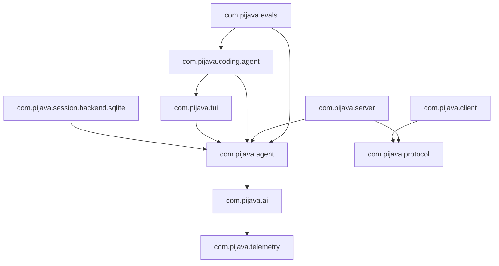

# Phase 0: 基础设施 — 阶段设计文档

> **目标**：搭建可构建（`mvn clean verify`）、可测试、CI 就绪的 Maven 多模块项目骨架。  
> **工时**：1 周（含本文档编写 0.5d）  
> **输入文档**：`02-architecture-design.md` §1–3、`03-detailed-design.md` 全部接口  
> **产出**：编译通过的空项目，所有模块含 `module-info.java`，CI 绿灯

---

## 1. Maven 项目布局

```
pi-java/
├── pom.xml                              ← 根 POM（properties + dependencyManagement + pluginManagement + modules）
├── .mvn/
│   └── wrapper/
│       ├── maven-wrapper.jar
│       └── maven-wrapper.properties
├── mvnw                                ← Maven wrapper（Unix）
├── mvnw.cmd                            ← Maven wrapper（Windows）
├── .editorconfig
├── .gitignore                          ← 已存在
├── CLAUDE.md                           ← 已存在
├── CONTRIBUTING.md
├── AGENTS.md
│
├── pi-java-bom/
│   ├── pom.xml                         ← BOM（dependencyManagement，无 parent 依赖）
│   └── src/main/java/module-info.java  ← 空模块声明（仅用于 BOM 聚合）
│
├── pi-java-telemetry/
│   ├── pom.xml
│   └── src/main/java/
│       ├── module-info.java
│       └── com/pijava/telemetry/
│           ├── TelemetryContext.java    ← 接口定义（startSpan）
│           ├── TelemetrySpan.java       ← extends TelemetryContext（span 可启动子 span）
│           ├── SpanOptions.java         ← span 名称 + 属性
│           └── NoopTelemetryContext.java
│
├── pi-java-ai/
│   ├── pom.xml
│   └── src/main/java/
│       ├── module-info.java
│       └── com/pijava/ai/
│           ├── api/
│           │   ├── StreamApi.java
│           │   ├── SimpleApi.java
│           │   ├── ChatApi.java
│           │   └── ApiOptions.java
│           ├── model/
│           │   ├── ModelId.java
│           │   └── ModelCapability.java
│           ├── message/
│           │   ├── Message.java
│           │   └── ContentBlock.java
│           ├── stream/
│           │   └── StreamEvent.java
│           ├── provider/
│           │   └── Provider.java
│           ├── auth/
│           │   └── CredentialStore.java
│           └── catalog/
│               └── ModelCatalog.java
│
├── pi-java-agent-core/
│   ├── pom.xml
│   └── src/main/java/
│       ├── module-info.java
│       └── com/pijava/agent/
│           ├── harness/
│           │   ├── AgentHarness.java
│           │   ├── Entry.java
│           │   ├── LaneRecord.java
│           │   └── Tool.java
│           ├── session/
│           │   ├── SessionStorage.java
│           │   ├── SessionRepository.java
│           │   └── Session.java
│           └── compaction/
│               └── CompactionSettings.java
│
├── pi-java-session-backend-sqlite/
│   ├── pom.xml
│   └── src/main/java/
│       ├── module-info.java
│       └── com/pijava/session/backend/sqlite/
│           └── package-info.java        ← 占位（Phase 4 实现）
│
├── pi-java-tui/
│   ├── pom.xml
│   └── src/main/java/
│       ├── module-info.java
│       └── com/pijava/tui/
│           └── package-info.java        ← 占位（Phase 3 实现）
│
├── pi-java-protocol/
│   ├── pom.xml
│   └── src/main/java/
│       ├── module-info.java
│       └── com/pijava/protocol/
│           └── package-info.java        ← 占位（Phase 6 实现）
│
├── pi-java-client/
│   ├── pom.xml
│   └── src/main/java/
│       ├── module-info.java
│       └── com/pijava/client/
│           └── package-info.java        ← 占位（Phase 6 实现）
│
├── pi-java-server/
│   ├── pom.xml
│   └── src/main/java/
│       ├── module-info.java
│       └── com/pijava/server/
│           └── package-info.java        ← 占位（Phase 6 实现）
│
├── pi-java-coding-agent/
│   ├── pom.xml
│   └── src/main/java/
│       ├── module-info.java
│       └── com/pijava/coding/agent/
│           └── package-info.java        ← 占位（Phase 3 实现）
│
├── pi-java-evals/
│   ├── pom.xml
│   └── src/main/java/
│       ├── module-info.java
│       └── com/pijava/evals/
│           └── package-info.java        ← 占位（Phase 6 实现）
│
└── docs/
    ├── 00-ai-driven-development-process.md
    ├── 01-requirements-analysis.md
    ├── 02-architecture-design.md
    ├── 03-detailed-design.md
    ├── 04-implementation-plan.md
    ├── 05-phase0-infrastructure-design.md  ← 本文档
    └── review-report.md
```

**说明**：
- Phase 0 只定义 **所有模块的公用接口签名**（`telemetry` + `ai` + `agent-core` 三个核心模块），其余模块只建目录 + `module-info.java` + `package-info.java` 占位
- `pi-java-bom` 无父 POM，仅包含 `dependencyManagement`
- 所有模块均创建 `src/test/java/` 测试目录（结构与 `src/main/java/` 镜像，见 §10.1）
- 核心模块不创建 `package-info.java`（有实际 Java 文件，不会触发空包警告）；占位模块必须创建 `package-info.java`（包内无其他类时 JPMS 需要）
- Maven Wrapper 通过 `mvn wrapper:wrapper -Dmaven=4.0.0-beta-5` 生成（统一版本）

---

## 2. 根 POM 设计

### 2.0 根 POM 坐标

```xml
<groupId>com.pi-java</groupId>
<artifactId>pi-java-parent</artifactId>
<version>0.1.0-SNAPSHOT</version>
<packaging>pom</packaging>
```

### 2.1 Properties

```xml
<properties>
    <java.release>26</java.release>
    <project.build.sourceEncoding>UTF-8</project.build.sourceEncoding>

    <!-- 依赖版本（全局统一通过 BOM 管理） -->
    <version.jackson>2.19.2</version.jackson>
    <version.tamboui>0.3.0</version.tamboui>
    <version.sqlite>3.47.1.0</version.sqlite>
    <version.picocli>4.7.7</version.picocli>
    <version.json-schema-validator>1.5.6</version.json-schema-validator>
    <version.jspecify>1.0.0</version.jspecify>
    <version.snakeyaml>2.4</version.snakeyaml>
    <version.junit>5.12.2</version.junit>
    <version.assertj>3.27.4</version.assertj>
    <version.mockito>5.17.1</version.mockito>

    <!-- 插件版本 -->
    <version.maven-compiler-plugin>3.14.0</version.maven-compiler-plugin>
    <version.maven-surefire-plugin>3.5.3</version.maven-surefire-plugin>
    <version.maven-enforcer-plugin>3.6.1</version.maven-enforcer-plugin>
    <version.maven-checkstyle-plugin>3.6.0</version.maven-checkstyle-plugin>
    <version.spotbugs-maven-plugin>4.9.3</version.spotbugs-maven-plugin>
    <version.maven-javadoc-plugin>3.12.0</version.maven-javadoc-plugin>
</properties>
```

### 2.2 dependencyManagement

所有依赖版本通过 `pi-java-bom` 统一管理。根 POM 仅引用 BOM：

```xml
<dependencyManagement>
    <dependencies>
        <dependency>
            <groupId>com.pi-java</groupId>
            <artifactId>pi-java-bom</artifactId>
            <version>${project.version}</version>
            <type>pom</type>
            <scope>import</scope>
        </dependency>
    </dependencies>
</dependencyManagement>
```

### 2.3 Modules

```xml
<modules>
    <module>pi-java-bom</module>
    <module>pi-java-telemetry</module>
    <module>pi-java-ai</module>
    <module>pi-java-agent-core</module>
    <module>pi-java-session-backend-sqlite</module>
    <module>pi-java-tui</module>
    <module>pi-java-protocol</module>
    <module>pi-java-client</module>
    <module>pi-java-server</module>
    <module>pi-java-coding-agent</module>
    <module>pi-java-evals</module>
</modules>
```

### 2.4 pluginManagement（关键插件）

| 插件 | 用途 | 关键配置 |
|------|------|---------|
| `maven-compiler-plugin` | JDK 26 编译 | `release=26`、`encoding=UTF-8` |
| `maven-surefire-plugin` | 单元测试 | 自动发现 `*Test.java`、argLine 预留 JaCoCo / native-image agent |
| `maven-enforcer-plugin` | 依赖收敛 + JDK 版本 | `requireJavaVersion=26`、`dependencyConvergence`、禁止 `dev.pijava.*` 循环依赖 |
| `maven-checkstyle-plugin` | 代码风格 | Google Java Style + 自定义抑制 |
| `spotbugs-maven-plugin` | 静态分析 | `maxRank=15`、排除 `EXPERIMENTAL` |
| `maven-javadoc-plugin` | Javadoc | `doclint=all`，CI 中不因 `missing` 失败 |

### 2.5 子模块 POM 模板

```xml
<?xml version="1.0" encoding="UTF-8"?>
<project xmlns="http://maven.apache.org/POM/4.0.0"
         xmlns:xsi="http://www.w3.org/2001/XMLSchema-instance"
         xsi:schemaLocation="http://maven.apache.org/POM/4.0.0
         http://maven.apache.org/xsd/maven-4.0.0.xsd">
    <modelVersion>4.0.0</modelVersion>

    <parent>
        <groupId>com.pi-java</groupId>
        <artifactId>pi-java-parent</artifactId>
        <version>0.1.0-SNAPSHOT</version>
    </parent>

    <artifactId>pi-java-{module}</artifactId>

    <dependencies>
        <!-- 只声明本模块直接依赖，版本由 BOM 管理 -->
    </dependencies>
</project>
```

---

## 3. BOM 设计（pi-java-bom）

```xml
<?xml version="1.0" encoding="UTF-8"?>
<project ...>
    <modelVersion>4.0.0</modelVersion>

    <groupId>com.pi-java</groupId>
    <artifactId>pi-java-bom</artifactId>
    <version>0.1.0-SNAPSHOT</version>
    <packaging>pom</packaging>

    <dependencyManagement>
        <dependencies>
            <!-- 内部模块 -->
            <dependency>
                <groupId>com.pi-java</groupId>
                <artifactId>pi-java-telemetry</artifactId>
                <version>${project.version}</version>
            </dependency>
            <!-- ... 其余 10 个内部模块 ... -->

            <!-- 外部依赖（精确锁定版本） -->
            <dependency>
                <groupId>com.fasterxml.jackson.core</groupId>
                <artifactId>jackson-core</artifactId>
                <version>${version.jackson}</version>
            </dependency>
            <dependency>
                <groupId>com.fasterxml.jackson.core</groupId>
                <artifactId>jackson-databind</artifactId>
                <version>${version.jackson}</version>
            </dependency>
            <!-- Jackson CBOR -->
            <dependency>
                <groupId>com.fasterxml.jackson.dataformat</groupId>
                <artifactId>jackson-dataformat-cbor</artifactId>
                <version>${version.jackson}</version>
            </dependency>
            <!-- TamboUI -->
            <dependency>
                <groupId>dev.tamboui</groupId>
                <artifactId>tamboui-toolkit</artifactId>
                <version>${version.tamboui}</version>
            </dependency>
            <dependency>
                <groupId>dev.tamboui</groupId>
                <artifactId>tamboui-panama-backend</artifactId>
                <version>${version.tamboui}</version>
            </dependency>
            <dependency>
                <groupId>dev.tamboui</groupId>
                <artifactId>tamboui-jline3-backend</artifactId>
                <version>${version.tamboui}</version>
            </dependency>
            <dependency>
                <groupId>dev.tamboui</groupId>
                <artifactId>tamboui-css</artifactId>
                <version>${version.tamboui}</version>
            </dependency>
            <!-- SQLite -->
            <dependency>
                <groupId>org.xerial</groupId>
                <artifactId>sqlite-jdbc</artifactId>
                <version>${version.sqlite}</version>
            </dependency>
            <!-- Picocli -->
            <dependency>
                <groupId>info.picocli</groupId>
                <artifactId>picocli</artifactId>
                <version>${version.picocli}</version>
            </dependency>
            <!-- JSON Schema Validator -->
            <dependency>
                <groupId>com.networknt</groupId>
                <artifactId>json-schema-validator</artifactId>
                <version>${version.json-schema-validator}</version>
            </dependency>
            <!-- Nullness annotations -->
            <dependency>
                <groupId>org.jspecify</groupId>
                <artifactId>jspecify</artifactId>
                <version>${version.jspecify}</version>
            </dependency>
            <!-- SnakeYAML -->
            <dependency>
                <groupId>org.yaml</groupId>
                <artifactId>snakeyaml</artifactId>
                <version>${version.snakeyaml}</version>
            </dependency>
            <!-- 测试 -->
            <dependency>
                <groupId>org.junit.jupiter</groupId>
                <artifactId>junit-jupiter</artifactId>
                <version>${version.junit}</version>
                <scope>test</scope>
            </dependency>
            <dependency>
                <groupId>org.assertj</groupId>
                <artifactId>assertj-core</artifactId>
                <version>${version.assertj}</version>
                <scope>test</scope>
            </dependency>
            <dependency>
                <groupId>org.mockito</groupId>
                <artifactId>mockito-core</artifactId>
                <version>${version.mockito}</version>
                <scope>test</scope>
            </dependency>
        </dependencies>
    </dependencyManagement>
</project>
```

---

## 4. 模块化策略

> **Phase 1 决策：不使用 JPMS。** 外部 SDK（anthropic-java、openai-java）及传递依赖不支持模块路径，会产生分裂包冲突。模块隔离由 Maven 多模块 + maven-enforcer-plugin + 包结构约定保证。详见 Phase 1 实施记录。

### 4.1 （已废弃）核心模块 JPMS 声明

```
com.pijava.telemetry          exports com.pijava.telemetry
                              requires 无外部依赖
                              【注】TelemetrySpan extends TelemetryContext，
                              使 span 可启动子 span（span 嵌套）

com.pijava.ai                 exports com.pijava.ai.api
                              exports com.pijava.ai.model
                              exports com.pijava.ai.message
                              exports com.pijava.ai.stream
                              exports com.pijava.ai.provider
                              exports com.pijava.ai.auth
                              exports com.pijava.ai.catalog
                              requires transitive com.pijava.telemetry
                              requires com.fasterxml.jackson.databind
                              requires java.net.http

com.pijava.agent              exports com.pijava.agent.harness
                              exports com.pijava.agent.session
                              exports com.pijava.agent.compaction
                              requires transitive com.pijava.ai
                              requires com.fasterxml.jackson.databind
                              【注】com.pijava.agent 基础包暂不导出（Phase 0 无类），
                              Phase 2 添加类后补充 exports
```

### 4.2 占位模块（Phase 0 仅声明模块名）

```java
// pi-java-session-backend-sqlite/src/main/java/module-info.java
module com.pijava.session.backend.sqlite {
    requires com.pijava.agent;
    requires java.sql;
    exports com.pijava.session.backend.sqlite;
}

// pi-java-tui/src/main/java/module-info.java
module com.pijava.tui {
    requires com.pijava.agent;
    requires dev.tamboui.toolkit;
    requires dev.tamboui.panama.backend;
    exports com.pijava.tui;
}

// pi-java-protocol/src/main/java/module-info.java
module com.pijava.protocol {
    requires com.fasterxml.jackson.databind;
    requires com.fasterxml.jackson.dataformat.cbor;
    exports com.pijava.protocol;
}

// pi-java-client/src/main/java/module-info.java
module com.pijava.client {
    requires com.pijava.protocol;
    exports com.pijava.client;
}

// pi-java-server/src/main/java/module-info.java
module com.pijava.server {
    requires com.pijava.protocol;
    requires com.pijava.agent;
    exports com.pijava.server;
}

// pi-java-coding-agent/src/main/java/module-info.java
module com.pijava.coding.agent {
    requires com.pijava.agent;
    requires com.pijava.tui;
    requires info.picocli;
    exports com.pijava.coding.agent;
}

// pi-java-evals/src/main/java/module-info.java
module com.pijava.evals {
    requires com.pijava.agent;
    requires com.pijava.coding.agent;
    exports com.pijava.evals;
}
```

### 4.3 模块依赖图（JPMS 视角）



---

## 5. Checkstyle 配置

使用 Google Java Style + 项目自定义规则。

### checkstyle.xml（项目根目录）

```xml
<?xml version="1.0"?>
<!DOCTYPE module PUBLIC
    "-//Checkstyle//DTD Checkstyle Configuration 1.3//EN"
    "https://checkstyle.org/dtds/configuration_1_3.dtd">
<module name="Checker">
    <property name="charset" value="UTF-8"/>
    <property name="severity" value="warning"/>

    <!-- 排除自动生成的文件 -->
    <property name="fileExtensions" value="java, properties, xml"/>

    <!-- 行长度 120 列 -->
    <module name="LineLength">
        <property name="max" value="120"/>
        <property name="ignorePattern" value="^package.*|^import.*|^module.*"/>
    </module>

    <!-- 文件长度 500 行限制（与 CLAUDE.md 一致） -->
    <module name="FileLength">
        <property name="max" value="500"/>
    </module>
    <!-- 文件末尾换行 -->
    <module name="NewlineAtEndOfFile"/>

    <module name="TreeWalker">
        <!-- 禁止 import * -->
        <module name="AvoidStarImport"/>
        <!-- 禁止未使用的 import -->
        <module name="UnusedImports"/>
        <!-- 禁止空 catch -->
        <module name="EmptyCatchBlock">
            <property name="exceptionVariableName" value="expected|ignored"/>
        </module>
        <!-- 禁止 System.out.println -->
        <module name="RegexpSinglelineJava">
            <property name="format" value="System\.(out|err)\.print"/>
            <property name="message" value="Use java.util.logging.Logger instead of System.out/err"/>
        </module>
        <!-- Javadoc 要求（public 方法必须有） -->
        <module name="MissingJavadocMethod">
            <property name="scope" value="public"/>
            <property name="allowMissingPropertyJavadoc" value="true"/>
        </module>
    </module>
</module>
```

### maven-checkstyle-plugin 配置（根 POM pluginManagement）

```xml
<plugin>
    <groupId>org.apache.maven.plugins</groupId>
    <artifactId>maven-checkstyle-plugin</artifactId>
    <version>${version.maven-checkstyle-plugin}</version>
    <configuration>
        <configLocation>checkstyle.xml</configLocation>
        <encoding>UTF-8</encoding>
        <consoleOutput>true</consoleOutput>
        <failsOnError>true</failsOnError>
        <linkXRef>false</linkXRef>
    </configuration>
    <executions>
        <execution>
            <id>validate</id>
            <phase>validate</phase>
            <goals>
                <goal>check</goal>
            </goals>
        </execution>
    </executions>
</plugin>
```

---

## 6. SpotBugs 配置

```xml
<plugin>
    <groupId>com.github.spotbugs</groupId>
    <artifactId>spotbugs-maven-plugin</artifactId>
    <version>${version.spotbugs-maven-plugin}</version>
    <configuration>
        <effort>Max</effort>
        <threshold>Low</threshold>
        <maxRank>15</maxRank>
        <excludeFilterFile>spotbugs-exclude.xml</excludeFilterFile>
    </configuration>
    <executions>
        <execution>
            <id>spotbugs</id>
            <phase>verify</phase>
            <goals>
                <goal>check</goal>
            </goals>
        </execution>
    </executions>
</plugin>
```

`spotbugs-exclude.xml`（初始为空，仅框架头）。

---

## 7. maven-enforcer-plugin

```xml
<plugin>
    <groupId>org.apache.maven.plugins</groupId>
    <artifactId>maven-enforcer-plugin</artifactId>
    <version>${version.maven-enforcer-plugin}</version>
    <executions>
        <execution>
            <id>enforce</id>
            <goals>
                <goal>enforce</goal>
            </goals>
            <configuration>
                <rules>
                    <requireJavaVersion>
                        <version>[26,27)</version>
                    </requireJavaVersion>
                    <dependencyConvergence/>
                    <banDuplicatePomDependencyVersions/>
                </rules>
            </configuration>
        </execution>
    </executions>
</plugin>
```

---

## 8. GitHub Actions CI

### 8.1 工作流文件：`.github/workflows/ci.yml`

```yaml
name: CI

on:
  push:
    branches: [main]
  pull_request:
    branches: [main]

jobs:
  build:
    name: Build on ${{ matrix.os }}
    runs-on: ${{ matrix.os }}
    strategy:
      matrix:
        os: [ubuntu-latest, windows-latest, macos-latest]
      fail-fast: false

    steps:
      - uses: actions/checkout@v4

      - name: Set up JDK 26
        uses: actions/setup-java@v4
        with:
          java-version: '26'
          distribution: 'temurin'
          cache: 'maven'

      - name: Verify
        run: ./mvnw clean verify --batch-mode

      - name: Upload test results
        if: always()
        uses: actions/upload-artifact@v4
        with:
          name: test-results-${{ matrix.os }}
          path: '**/target/surefire-reports/*.xml'

      - name: Checkstyle report
        if: always()
        uses: jwgmeligmeyling/checkstyle-github-action@v1
        with:
          path: '**/target/checkstyle-result.xml'
```

---

## 9. .editorconfig

```ini
root = true

[*]
charset = utf-8
end_of_line = lf
insert_final_newline = true
trim_trailing_whitespace = true

[*.java]
indent_style = tab
indent_size = tab
tab_width = 4
continuation_indent_size = 8

[*.xml]
indent_style = space
indent_size = 2

[*.yml]
indent_style = space
indent_size = 2

[*.md]
trim_trailing_whitespace = false
```

---

## 10. 测试基础设施

### 10.1 每个模块的标准测试结构

```
pi-java-{module}/
└── src/test/java/
    └── com/pijava/{module}/
        └── package-info.java       ← @NullMarked（可选）
```

### 10.2 telemetry 模块 Phase 0 自验证测试

```java
// pi-java-telemetry/src/test/java/com/pijava/telemetry/NoopTelemetryContextTest.java
package com.pijava.telemetry;

import org.junit.jupiter.api.Test;
import static org.assertj.core.api.Assertions.assertThat;

class NoopTelemetryContextTest {
    @Test
    void startSpanReturnsCallbackResult() throws Exception {
        var ctx = NoopTelemetryContext.INSTANCE;
        // SpanAttributes 定义为 Map<String, Object>（对应 pi 的 Record<string, AttributeValue>）
        var result = ctx.startSpan(
            new SpanOptions("test.span", Map.of()),
            span -> "ok"
        );
        assertThat(result).isEqualTo("ok");
    }
}
```

### 10.3 Maven Surefire 配置（根 POM pluginManagement）

```xml
<plugin>
    <groupId>org.apache.maven.plugins</groupId>
    <artifactId>maven-surefire-plugin</artifactId>
    <version>${version.maven-surefire-plugin}</version>
    <configuration>
        <includes>
            <include>**/*Test.java</include>
        </includes>
    </configuration>
</plugin>
```

---

## 11. CONTRIBUTING.md（模板）

简要内容：
- AI 驱动开发流程入口（指向 `docs/00-ai-driven-development-process.md`）
- Commit 格式约定
- PR 工作流（人审核 AI 提交的 PR）
- 阶段设计文档约定

## 12. AGENTS.md（模板）

简要内容：
- 架构概览 + 模块依赖方向
- 指向 CLAUDE.md 获取命令和规范
- 指向 `docs/` 获取完整设计文档

---

## 13. 自验证清单

Phase 0 完成的标准（AI 在提交 PR 前必须全部通过）：

```bash
# 1. 全量编译
./mvnw clean verify
# → BUILD SUCCESS，零错误、零警告

# 2. JDK 版本检查
./mvnw enforcer:enforce
# → JDK 26 满足

# 3. Checkstyle
./mvnw checkstyle:check
# → 零违规

# 4. SpotBugs
./mvnw spotbugs:check
# → 零 Bug

# 5. 测试
./mvnw test
# → 至少 telemetry 模块的 NoopTelemetryContextTest 通过

# 6. 循环依赖检查
# 人工检查 mermaid 图与 module-info.java requires 声明一致
```

---

## 14. 里程碑

- [ ] `./mvnw clean verify` 在 ubuntu-latest / windows-latest / macos-latest 均通过
- [ ] 所有 11 个模块含正确的包结构和依赖配置
- [ ] Checkstyle / SpotBugs / enforcer 均无错误
- [ ] CI 绿灯
- [ ] `CONTRIBUTING.md` + `AGENTS.md` 已写入
- [ ] PR 已合并到 main
