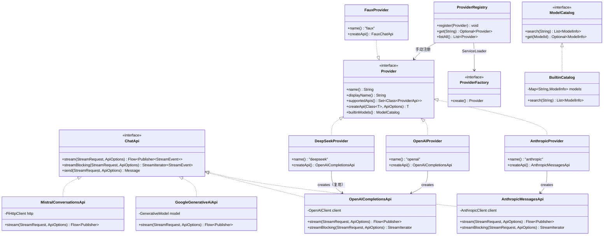
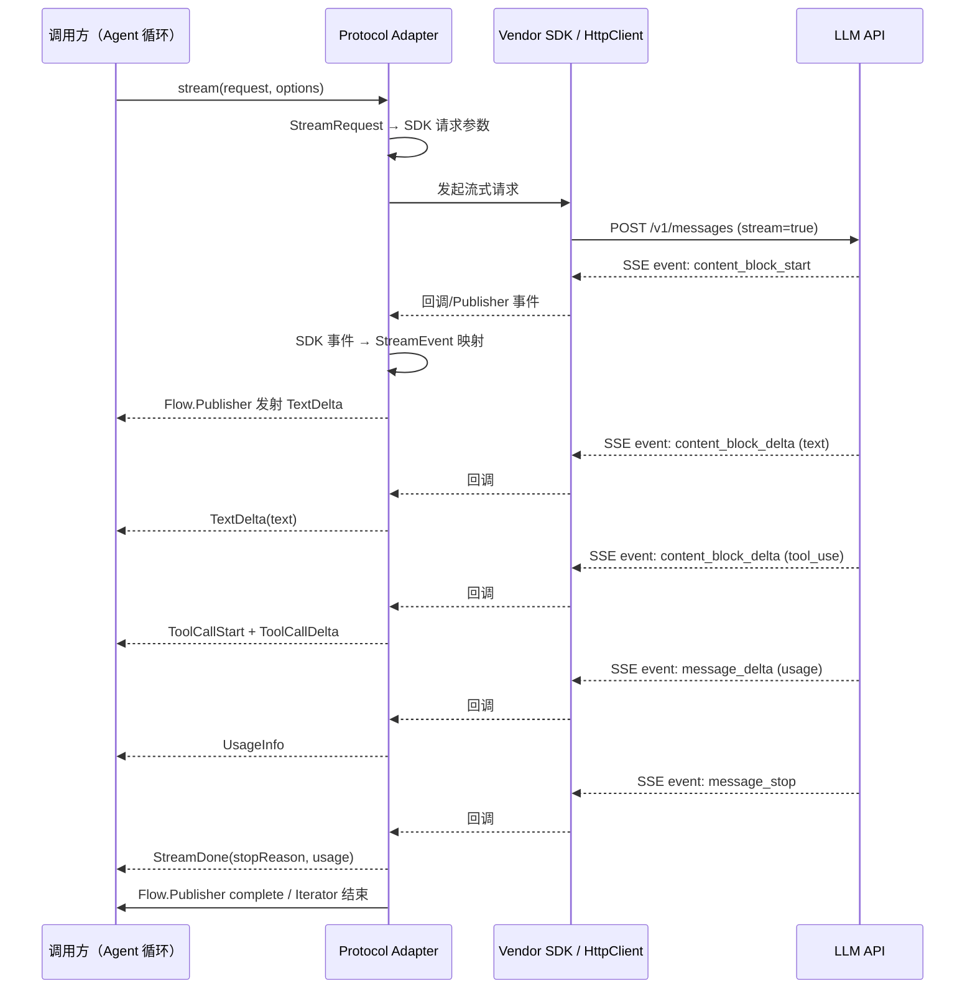

# Phase 1: LLM API 层 — 阶段设计文档

> **目标**：提供统一的 LLM 调用接口，首批支持 5 个主流 Provider。Protocol-center（协议中心）架构，一个协议一个适配器，供应商差异用配置消除。
> **工时**：3–4 周（含本文档编写 0.5d；其中纯编码约 2.5 周，余量为 review 修正、集成联调和 CI 调通 buffer）
> **输入文档**：`03-detailed-design.md` §1、`04-implementation-plan.md` §3
> **前置阶段**：Phase 0（基础设施就绪，核心接口已定义）

---

## 1. 架构决策：Protocol-Center vs Provider-Center

对齐 pi 原版的协议中心架构：

```
Provider（配置） → Protocol Adapter（实现 ChatApi）→ Vendor SDK / HttpClient
       ↑                    ↑
   只需改 baseUrl      每个协议一个适配器
   和 API key          所有供应商复用
```

### 1.1 Java SDK 选型

**为什么选择官方 SDK 而非纯 `java.net.http.HttpClient`？**

Mistral 证明了纯 `HttpClient` + 手动 JSON/SSE 解析完全可行（§2.4）。但 Anthropic、OpenAI、Google 三个主流供应商选择官方 SDK，理由：

1. **流式事件解析复杂度**：Anthropic 的 SSE 事件类型多达 8 种（`content_block_start/delta/stop`、`message_delta`、`message_stop`、`ping`、`error`），SDK 已处理事件分发、重连、错误分类，手写等价逻辑 ≈ 300+ 行且有边界 case 风险
2. **认证与安全**：SDK 内置 API key 注入、请求签名（Google 使用 OAuth2/API key 双模式），避免手动管理敏感 header
3. **社区维护**：API 变更时 SDK 先行适配；自建 HTTP 层需要持续追踪每个供应商的 changelog
4. **JDK 25 兼容**：三个 SDK 均已验证在 JDK 25 下可用

Mistral 使用纯 `HttpClient` 的原因：其 API 是标准 OpenAI 兼容 SSE，无独立 SDK 维护成本低于引入非官方社区 SDK。

| Provider | SDK | Maven 坐标 | 备注 |
|----------|-----|-----------|------|
| Anthropic | 官方 SDK | `com.anthropic:anthropic-java:2.52.0` | 支持流式、工具调用、thinking |
| OpenAI | 官方 SDK | `com.openai:openai-java:4.42.0` | GPT-5、流式 |
| Google Gemini | 官方 SDK | `com.google.genai:google-genai:1.15.0` | 2025-05 GA |
| DeepSeek | 无 | 复用 OpenAI 适配器 | API 兼容，改 baseUrl |
| Mistral | 无独立 SDK | `java.net.http.HttpClient` 直连 | REST API 简洁，标准 SSE |

### 1.2 包结构

```
com.pijava.ai/
├── api/                          ← Phase 0 已有
│   ├── StreamApi.java
│   ├── SimpleApi.java
│   ├── ChatApi.java
│   ├── StreamIterator.java
│   ├── StreamRequest.java
│   ├── ToolDefinition.java
│   └── ApiOptions.java
│
├── protocol/                     ← 🆕 协议适配器
│   ├── AnthropicMessagesApi.java
│   ├── OpenAICompletionsApi.java
│   ├── GoogleGenerativeAiApi.java
│   └── MistralConversationsApi.java
│
├── model/                        ← Phase 0 已有, 追加 PricingInfo
│   ├── ModelId.java
│   ├── ModelInfo.java
│   ├── ModelCapability.java
│   └── PricingInfo.java           ← 🆕
│
├── message/                      ← Phase 0 已有
│   ├── Message.java
│   └── ContentBlock.java
│
├── stream/                       ← Phase 0 已有
│   └── StreamEvent.java
│
├── provider/
│   ├── Provider.java             ← Phase 0 已有
│   ├── ProviderFactory.java      ← 🆕 SPI 注册
│   ├── ProviderRegistry.java     ← 🆕 ServiceLoader 发现
│   ├── AnthropicProvider.java
│   ├── OpenAIProvider.java
│   ├── GoogleProvider.java
│   ├── DeepSeekProvider.java     ← 继承 OpenAI 适配器，改 baseUrl
│   ├── MistralProvider.java
│   └── FauxProvider.java         ← 🆕 可编程假 Provider
│
├── catalog/
│   ├── ModelCatalog.java         ← Phase 0 已有接口
│   ├── BuiltinCatalog.java       ← 🆕 内置目录实现
│   └── ModelsStore.java          ← 🆕 目录持久化抽象
│
├── auth/
│   ├── CredentialStore.java      ← Phase 0 已有接口
│   ├── EnvApiKeyResolver.java    ← 🆕 环境变量解析
│   └── FileCredentialStore.java  ← 🆕 文件存储 ~/.pi-java/auth.json
│
├── http/
│   └── PiHttpClient.java         ← HttpClient 封装（重试、SSE 解析）
│
└── cli/
    └── AiCli.java                ← picocli: list-models, auth, ping
```

#### 与 `03-detailed-design.md` 的差异说明

`03-detailed-design.md` §1.1 将适配器放在 `provider/<name>/` 子包下（如 `provider/anthropic/AnthropicChatApi.java`）。本设计引入 `protocol/` 顶级包，将协议适配器与 Provider 配置分离：

- **`protocol/`**：协议适配器，实现 `ChatApi`，负责消息转换和流事件映射。每个协议一个适配器，所有供应商复用
- **`provider/`**：Provider 配置对象（不可变），绑定协议适配器 + baseUrl + API key 解析

这是 Protocol-Center 架构在包结构上的体现——`03` 的包结构是早期草案，本设计文档为最终权威来源。Phase 1 实现时同步更新 `03` 中的包结构。

#### 类图



### 1.3 关键类型：ProviderApi 标记接口

`ProviderApi` 是 Provider 所能创建的能力单元的类型标记：

```java
/**
 * 标记接口：Provider 对外暴露的一种 API 能力。
 * 具体子类型（如 ChatApi）定义实际的调用契约。
 * Provider.supportedApis() 返回该 Provider 支持的标记类型集合。
 */
public sealed interface ProviderApi
        permits ChatApi {  // Phase 1 仅 ChatApi 一种能力
}
```

`Provider.createApi(Class<T> apiType, ApiOptions options)` 中 `apiType` 参数必须是该 Provider 的 `supportedApis()` 返回集合中的一员。Phase 1 仅 `ChatApi` 一种标记类型，未来 Phase 6 可能扩展 `ImageApi`、`EmbeddingApi` 等。

### 1.4 BOM 新增依赖

```xml
<anthropic-java.version>2.52.0</anthropic-java.version>
<openai-java.version>4.42.0</openai-java.version>
<google-genai.version>1.15.0</google-genai.version>
```

---

## 2. 协议适配器设计

四个协议适配器实现 `ChatApi` 接口（`StreamApi` + `SimpleApi`）。每个适配器内部用各自的 SDK 调用，对外输出统一的 `StreamEvent`。

### 流式调用生命周期



### StreamEvent 基准映射

所有适配器对外输出统一的 `StreamEvent`。以下为完整的内部事件类型及语义：

| StreamEvent 子类型 | 语义 | 触发时机 |
|-------------------|------|---------|
| `TextDelta(text, type)` | 文本增量（`type` 可为 `text` 或 `thinking`） | LLM 输出文本/思考内容 |
| `ToolCallStart(id, name)` | 工具调用开始 | LLM 决定调用工具 |
| `ToolCallDelta(id, jsonDelta)` | 工具参数 JSON 增量 | 工具参数流式传输中 |
| `ToolCallEnd(id, name, arguments)` | 工具调用完成（完整参数） | 工具参数传输完毕 |
| `UsageInfo(inputTokens, outputTokens)` | Token 用量统计 | 流结束前或每个 chunk |
| `StreamDone(stopReason, usage)` | 流正常结束 | LLM 完成本轮响应 |
| `StreamError(throwable)` | 流异常中断 | API 错误 / 网络异常 / 安全拦截 |

各适配器的具体映射见以下子章节，**仅列出与基准有差异的部分**。

### 2.1 AnthropicMessagesApi

**依赖**: `com.anthropic:anthropic-java`

**请求转换 — StreamRequest → SDK MessageCreateParams**:

```
StreamRequest                          SDK MessageCreateParams
══════════════════════════════════     ══════════════════════════════
Message.SystemMessage → system 字段
Message.UserMessage   → user role
  ContentBlock.TextContent       → text block
  ContentBlock.ImageContent      → image block (base64)
  ContentBlock.ToolResultContent → tool_result block
Message.AssistantMessage → assistant role
  ContentBlock.ToolUseContent    → tool_use block

ToolDefinition → SDK Tool
StreamRequest.maxTokens → maxTokens
StreamRequest.temperature → temperature
```

**响应转换 — SDK StreamingMessage 事件 → StreamEvent**:

| SDK 事件 | StreamEvent |
|----------|-------------|
| `content_block_start` (text) | 内部缓冲，不产生事件 |
| `content_block_delta` (text_delta) | `TextDelta(text)` |
| `content_block_start` (tool_use) | `ToolCallStart(id, name)` |
| `input_json_delta` | `ToolCallDelta(id, jsonDelta)` |
| `content_block_stop` | `ToolCallEnd(id, name, arguments)` |
| `message_delta.usage` | `UsageInfo(inputTokens, outputTokens)` |
| `message_stop` | `StreamDone(stopReason, usage)` |
| API/HTTP 异常 | `StreamError(throwable)` |

**关键细节**:
- thinking block 作为 `TextDelta` 发出，标记类型为 thinking
- SDK `createStreaming()` 返回的异步流直接映射到 JDK `Flow.Publisher`
- `streamBlocking()` 内部用 `LinkedBlockingQueue<StreamEvent>` + 虚拟线程桥接
- 图片输入：`ContentBlock.ImageContent` 支持 base64 编码图片（`data:image/...;base64,...`）。URL 引用图片（`ContentBlock.ImageUrl`）暂不实现——pi 原版的 URL 图片路径依赖外部 HTTP 下载 + 缓存层，延后至 Phase 6 与图像模型一起补齐

### 2.2 OpenAICompletionsApi

**依赖**: `com.openai:openai-java`

**请求转换**:

| StreamRequest | SDK ChatCompletionCreateParams |
|--------------|-------------------------------|
| `Message.SystemMessage` | `"system"` role |
| `Message.UserMessage` | `"user"` role |
| `Message.AssistantMessage` | `"assistant"` role |
| `ContentBlock.ToolUseContent` | assistant `tool_calls` |
| `ContentBlock.ToolResultContent` | `"tool"` role message |
| `ToolDefinition` | SDK `FunctionDefinition` |

**响应转换（关键：tool_calls delta 聚合）**:

| SDK ChatCompletionChunk | StreamEvent |
|------------------------|-------------|
| `choices[0].delta.content` | `TextDelta(text)` |
| `choices[0].delta.tool_calls[i]` 首次出现 | `ToolCallStart(id, name)` |
| `choices[0].delta.tool_calls[i]` 增量参数 | `ToolCallDelta(id, args)` |
| `finish_reason="tool_calls"` | `ToolCallEnd(id, name, args)` ← 聚合完成 |
| `finish_reason="stop"` | `StreamDone("stop", usage)` |
| 最后一个 chunk 的 usage | `UsageInfo(inputTokens, outputTokens)` |

**聚合状态机 — `ToolCallBuilder`**（OpenAI 与 Mistral 共享）:

```
ToolCallBuilder (per tool_call_id):
   首次 delta → 记录 id + name, 开始累积 arguments (StringBuilder)
   后续 delta → 追加 arguments
   finish_reason="tool_calls" → 构建 ToolCallEnd
```

`ToolCallBuilder` 是 `com.pijava.ai.stream` 包中的共享工具类，不耦合任何 SDK。OpenAI 和 Mistral 适配器各自在流解析循环中按 `tool_call_id` 创建/查找/销毁 builder 实例，但 builder 本身是协议无关的纯数据结构。

**DeepSeek 适配**: `DeepSeekProvider` 继承此适配器，覆盖以下差异点：

| 配置项 | OpenAI 默认 | DeepSeek 覆盖 |
|--------|------------|--------------|
| `baseUrl` | `https://api.openai.com/v1` | `https://api.deepseek.com/v1` |
| API key 环境变量 | `OPENAI_API_KEY` | `DEEPSEEK_API_KEY` |
| 模型名映射 | `gpt-5`, `gpt-5-mini`, … | `deepseek-chat`, `deepseek-reasoner` |
| 默认 maxTokens | 4096 | 8192（DeepSeek 通常上下文更长） |

已知潜在差异（实现阶段逐项验证，必要时通过 `StreamRequest.extra` 或子类覆盖处理）：
- 部分模型可能不支持 `temperature` 参数
- `finish_reason` 取值可能与 OpenAI 不完全一致
- `tools` 的 `strict` 模式支持情况待确认
- SSE `data: [DONE]` 标记格式一致但 line ending 可能有 `\r\n` vs `\n` 差异

### 2.3 GoogleGenerativeAiApi

**依赖**: `com.google.genai:google-genai`

**请求转换**:

| StreamRequest | SDK GenerateContentParameters |
|--------------|------------------------------|
| `Message.SystemMessage` | `systemInstruction` |
| `Message.UserMessage` | `contents[].role="user"` |
| `Message.AssistantMessage` | `contents[].role="model"` |
| `ContentBlock.TextContent` | `Part(text=...)` |
| `ContentBlock.ImageContent` | `Part(inline_data=...)` |
| `ContentBlock.ToolUseContent` | `Part(function_call=...)` |
| `ContentBlock.ToolResultContent` | `Part(function_response=...)` |
| `ToolDefinition` | Tool `functionDeclarations` |

**响应转换**:

| SDK GenerateContentResponse | StreamEvent |
|----------------------------|-------------|
| `candidates[0].content.parts[i]` (text) | `TextDelta(text)` |
| `candidates[0].content.parts[i]` (function_call) | `ToolCallStart(id, name)` + `ToolCallEnd(id, name, args)` |
| `usageMetadata` | `UsageInfo` |
| `finishReason` | `StreamDone(reason, usage)` |
| `promptFeedback.blockReason != null` | `StreamError(...)` |

**关键细节**: Google 的 functionCall 一次性返回完整参数，不需要聚合——`ToolCallStart` 和 `ToolCallEnd` 可连续发出。`promptFeedback.blockReason` 安全过滤视为错误。

### 2.4 MistralConversationsApi

**依赖**: 无外部 SDK，使用 `PiHttpClient`

**协议**: [Mistral Chat Completions API](https://docs.mistral.ai/api/) — 与 OpenAI 高度相似的标准 SSE

```
请求: POST https://api.mistral.ai/v1/chat/completions
       { "model": "...", "messages": [...], "stream": true, "tools": [...] }

响应: data: {"id":"...","choices":[{"delta":{"content":"..."}}]}\n\n
      data: {"id":"...","choices":[{"delta":{"tool_calls":[...]}}]}\n\n
      data: [DONE]
```

消息和响应转换逻辑与 `OpenAICompletionsApi` 共享，差异在于：
1. 手动构建 JSON 请求体（Jackson）— 替代 OpenAI SDK 的请求构造
2. 手动解析 SSE 事件流（`PiHttpClient` 提供 SSE 迭代器）— 替代 OpenAI SDK 的流解析
3. tool_calls delta 聚合使用共享的 `ToolCallBuilder`（§2.2）— 与 OpenAI 适配器完全相同的聚合逻辑

### 2.5 PiHttpClient

仅 Mistral 直接使用，但设计为可复用于未来无 SDK 的 Provider。

```java
/**
 * JDK HttpClient 的薄封装。提供重试、SSE 解析、代理预留。
 * 实例通过 Builder 创建，配置后不可变。
 */
public final class PiHttpClient implements AutoCloseable {

    /** SSE 事件（单条 data: 行解析结果） */
    public record ServerSentEvent(String id, String event, String data) {}

    /** 向指定 URL 发送 POST 请求，返回 SSE 事件迭代器 */
    public Iterator<ServerSentEvent> postSse(String url, String jsonBody,
                                              Map<String, String> headers);

    /** 发送通用 HTTP 请求 */
    public HttpResponse<String> send(HttpRequest request) throws IOException;

    /** 代理选择器（Phase 2 实现系统代理自动检测，Phase 1 使用默认值） */
    public static Builder builder();

    public static final class Builder {
        public Builder userAgent(String ua);
        public Builder retryPolicy(RetryPolicy policy);
        public Builder proxy(ProxySelector proxy);    // Phase 2 起效
        public Builder connectTimeout(Duration timeout);
        public PiHttpClient build();
    }
}
```

**职责**:
- 携带 `User-Agent: pi-java/<version>` 请求头
- 自动重试 408/409/429/5xx，解析 `Retry-After` 头
- SSE 解析：将 `text/event-stream` 响应体转换为 `Iterator<ServerSentEvent>`
- 通过 `StructuredTaskScope` 支持 AbortSignal 可中断退避

**HTTP 代理**：系统代理检测（`HTTP_PROXY` / `HTTPS_PROXY` 环境变量）延后至 Phase 2 实现。Phase 1 的 `PiHttpClient` 预留 `proxy(ProxySelector)` 配置入口，默认使用 `java.net.http.HttpClient` 内置的 `ProxySelector.of(InetSocketAddress)`。

---

## 3. Provider 注册机制

### 3.1 设计

pi 原版通过 `providers/all.ts` 的 `builtinProviders()` 聚合。Java 版使用手动注册 + ServiceLoader 双通道：

```java
// 手动注册（Phase 1 主力）
var registry = new ProviderRegistry();
registry.register(new AnthropicProvider());
registry.register(new OpenAIProvider());
registry.register(new GoogleProvider());
registry.register(new DeepSeekProvider());
registry.register(new MistralProvider());

// ServiceLoader 发现（Phase 6 扩展）
ServiceLoader.load(ProviderFactory.class).forEach(registry::register);
```

### 3.2 Provider 实现规则

每个 Provider 是**不可变配置对象**，创建时绑定协议适配器。`Provider.name()` 对应 SDK/API 的 provider 标识。

### 3.3 ProviderFactory 接口

SPI 扩展点，第三方 jar 可通过 `META-INF/services/com.pijava.ai.provider.ProviderFactory` 注册。

```java
/**
 * Provider 工厂 SPI。
 * 第三方 jar 实现此接口，通过 ServiceLoader 机制被发现和注册。
 * Phase 1 手动注册为主通道，ServiceLoader 发现为 Phase 6 扩展预留通道。
 */
public interface ProviderFactory {
    /** 创建 Provider 实例。不得返回 null。 */
    Provider create();

    /** 此工厂创建的 Provider 名称，用于去重。 */
    String providerName();
}
```

ServiceLoader 加载路径（Phase 6 启用）：
```
META-INF/services/com.pijava.ai.provider.ProviderFactory
# 内容示例:
# com.example.MyCustomProviderFactory
```

---

## 4. 模型目录系统

### 4.1 BuiltinCatalog

内置 5 个供应商的模型数据，用 `Map.of()` 静态初始化，对齐 pi 的 `providers/*.models.ts` 生成的数据。

模型数据字段（`ModelInfo`）:
- `id`（`ModelId`）、`displayName`、`capabilities`（`Set<ModelCapability>`）
- `maxInputTokens`、`maxOutputTokens`、`deprecated`
- `pricing`（`PricingInfo` — 新增字段）：input/output 每百万 token 价格

### 4.2 模糊搜索

`ModelCatalog.search(query)` 按 model 名称进行大小写不敏感的包含匹配。

### 4.3 ModelsStore

目录持久化抽象（Phase 1 仅 InMemoryModelStore，Phase 4 切换为 SQLite）：

```java
public interface ModelsStore {
    Map<String, ModelInfo> load(String providerId);
    void save(String providerId, Map<String, ModelInfo> models);
}
```

---

## 5. 认证系统

### 5.1 认证优先级

1. `ApiOptions.apiKey` — 代码显式传入（最高优先级）
2. `~/.pi-java/auth.json` — `pi-ai auth` 写入的文件存储
3. 环境变量 — `ANTHROPIC_API_KEY` 等

### 5.2 环境变量映射（EnvApiKeyResolver）

对齐 pi 的 `env-api-keys.ts`：

| Provider | 环境变量 |
|----------|---------|
| anthropic | `ANTHROPIC_API_KEY` |
| openai | `OPENAI_API_KEY` |
| google | `GEMINI_API_KEY` |
| deepseek | `DEEPSEEK_API_KEY` |
| mistral | `MISTRAL_API_KEY` |

### 5.3 FileCredentialStore

文件存储实现 `CredentialStore`：
- 路径：`~/.pi-java/auth.json`
- 格式：`{"provider": "api-key-value", ...}`
- 文件锁保证跨进程并发安全（`FileChannel.lock()`）

---

## 6. FauxProvider — 测试基础设施

对齐 pi 的 faux provider。允许测试中预设 `StreamEvent` 列表作为假 LLM 响应回放。

### 6.1 基础用法

构造时传入一组 `StreamEvent`，`ChatApi` 调用时按顺序回放。

### 6.2 能力

- 文本响应模式：`TextDelta → StreamDone`
- 工具调用模式：`ToolCallStart → ToolCallDelta → ToolCallEnd → StreamDone`
- 错误模式：任意位置插入 `StreamError`
- 延迟模拟：可配置每事件间隔

### 6.3 用途

- 下游模块（agent-core）的单元测试基础
- Provider 适配器的流转换验证
- `ChatApi` 接口的 conformance 测试

---

## 7. pi-ai CLI

基于 picocli 的独立命令行工具，入口点 `AiCli.main()`。

### 7.1 命令

| 命令 | 功能 |
|------|------|
| `pi-ai list-models [provider]` | 列出全部模型或按 provider 过滤 |
| `pi-ai auth <provider>` | 交互式输入 API key，存入 `~/.pi-java/auth.json` |
| `pi-ai ping <provider> [model]` | 发一条简单请求验证连接 |

### 7.2 输出格式

`list-models` 输出表格：

```
Provider    Model ID                    Context    Input/$    Output/$
──────────  ─────────────────────────   ────────   ────────   ────────
anthropic   claude-fable-5              200K       $3.00      $15.00
anthropic   claude-sonnet-4-6           200K       $3.00      $15.00
openai      gpt-5                       128K       $2.50      $10.00
...
```

---

## 8. 测试策略

### 8.1 测试分层

| 层级 | 内容 | 依赖 |
|------|------|------|
| 消息转换测试 | `Message` → SDK params 的字段对应 | 无 |
| 流事件转换测试 | SDK 事件 → `StreamEvent` | FauxProvider 回放 |
| 工具调用聚合测试 | OpenAI tool_calls delta → `ToolCallEnd` | 无 |
| 重试逻辑测试 | HTTP 状态码 → 重试/不重试 | PiHttpClient |
| 认证解析测试 | 环境变量/文件/显式 apiKey 优先级 | 假环境变量 |
| 冒烟测试 | 每个 Provider 1 个真实 API 请求 | 真实 API key（手动触发） |

### 8.2 覆盖率目标

- 协议适配器：≥ 85% 行覆盖
- Provider 配置：不需要测试（纯配置代码）
- 认证系统：≥ 80%
- FauxProvider：≥ 90%

---

## 9. 任务分解

| 编号 | 任务 | 产出 | 工时 |
|------|------|------|------|
| P1-0 | **编写阶段设计文档** | `06-phase1-ai-design.md` | 0.5d |
| P1-1 | 审查/补充 Phase 0 接口 | 补充 `PricingInfo`、定义 `ProviderApi` 标记接口 | 0.5d |
| P1-2 | 审查/补充消息与流事件类型 | 完善 `Message` 密封层次（System/User/Assistant）、`StreamEvent` 密封层次（7 种子类型）、`ContentBlock`（text/image/tool_use/tool_result） | 1d |
| P1-3 | `PiHttpClient` + SSE 解析器 | HttpClient 封装：重试、`User-Agent`、SSE 迭代器 | 1d |
| P1-4 | `AnthropicMessagesApi` | 消息转换 + 流事件映射 + thinking block 处理 | 1.5d |
| P1-5 | `OpenAICompletionsApi` | 消息转换 + tool_calls delta 聚合（`ToolCallBuilder`） | 1.5d |
| P1-6 | `GoogleGenerativeAiApi` | 消息转换 + promptFeedback 安全拦截 | 1.5d |
| P1-7 | `MistralConversationsApi` | JSON 请求构建 + SSE 响应解析 + 复用 `ToolCallBuilder` | 1d |
| P1-8 | 5 个 Provider 配置 | 配置类 + ProviderRegistry 手动注册 | 0.5d |
| P1-9 | `ProviderRegistry` + `ProviderFactory` SPI | 手动注册 + ServiceLoader 发现通道 | 0.5d |
| P1-10 | `FauxProvider` | 可编程假 Provider，支持三种回放模式 | 0.5d |
| P1-11 | 模型目录 + `BuiltinCatalog` | 5 供应商模型数据 + 模糊搜索 + `ModelsStore` 接口 | 1d |
| P1-12 | 认证系统 | `EnvApiKeyResolver` + `FileCredentialStore`（文件锁） | 1d |
| P1-13 | `pi-ai` CLI | picocli：`list-models`、`auth`、`ping` | 0.5d |
| P1-14 | 单元测试 | 覆盖率 > 80% | 2.5d |
| P1-15 | 冒烟测试 | 每 Provider 1 个真实 API 请求（手动触发） | 0.5d |

**总工时**：约 3 周纯编码 + 1 周 review/集成 buffer = 3–4 周（P1-4 到 P1-7 四个适配器可并行开发，各适配器独立）

---

## 10. 里程碑

- [ ] `mvn clean verify` 通过（零错误、零警告）
- [ ] FauxProvider 可用于下游模块测试（不需要真实 API key）
- [ ] 5 个 Provider 至少各有一个单元测试通过
- [ ] `pi-ai list-models` 输出 5 个供应商的所有模型
- [ ] `pi-ai auth <provider>` 交互式配置 API key

---

## 11. 风险

| 风险 | 影响 | 缓解 |
|------|------|------|
| anthropic-java SDK 不兼容 JDK 25 | 中 | SDK 声明 JDK 8+，基本兼容 |
| google-genai 版本快速迭代 | 低 | 锁定精确版本，升版本单独 PR |
| Mistral API 变更 | 低 | 协议简单（标准 SSE + JSON），影响可控 |
| DeepSeek API 与 OpenAI 差异 | 中 | 已知差异用 compat 配置处理 |
| 多个 SDK 传递依赖冲突 | 中 | Maven enforcer `dependencyConvergence` 已配置，CI 自动拦截 |

---

## 12. Phase 1 不做（延后到 Phase 6 实现）

以下功能 pi 原版均已实现，pi-java 延后到 Phase 6（生态扩展）：

| 功能 | pi 现状 | 延后原因 |
|------|---------|---------|
| OAuth 登录流程（`pi-ai login` Anthropic / GitHub Copilot / OpenRouter） | ✅ 已实现 | Phase 1 以 API key 优先，降低认证复杂度 |
| Keychain/系统密钥链存储（`KeychainStore`） | ✅ 已实现 | Phase 1 文件存储 + 环境变量已满足 API key 场景；系统密钥链集成需平台适配（Windows Credential Manager / macOS Keychain / Linux Secret Service） |
| 多 profile 认证（同一 provider 多组凭证切换） | ✅ 已实现 | Phase 1 单 profile 足够；多 profile 依赖 `AuthProfileManager`（Phase 6） |
| URL 引用图片输入（非 base64 内联） | ✅ 已实现 | 依赖外部 HTTP 下载 + 缓存层，与图像生成模型一起在 Phase 6 补齐 |
| 远程模型目录更新（ETag 条件请求 + `refreshModels()`） | ✅ 已实现 | Phase 1 内置静态目录足够 |
| Bedrock 适配器（`bedrock-converse-stream.ts` ~1173行） | ✅ 已实现 | 非核心路径，AWS 依赖重 |
| Vertex AI 适配器（`google-vertex.ts` ~592行） | ✅ 已实现 | 非核心路径 |
| 图像生成模型（`image-models*.ts` + `images*.ts`） | ✅ 已实现 | Phase 1 聚焦文本生成 |
| CBOR 协议（远程会话编解码） | ✅ 已实现 | 依赖 protocol 模块（Phase 6） |
| 模型目录 CLI 发布工具 | ✅ 已实现 | 开发辅助工具，非运行时必需 |

Phase 1 聚焦**可跑通端到端的最小 LLM 调用层**：5 个 Provider + API key 认证 + 静态模型目录。

---

## 13. 自验证清单

Phase 1 完成的标准：

```bash
# 1. 全量编译
./mvnw clean verify
# → BUILD SUCCESS

# 2. 测试覆盖率
./mvnw jacoco:report
# → 协议适配器 ≥ 85%

# 3. CLI 可用
./mvnw -pl pi-java-ai exec:java -Dexec.mainClass="com.pijava.ai.cli.AiCli"
# → 显示 help 信息

# 4. FauxProvider 可独立使用
# → 下游模块可 import FauxProvider 并创建测试
```
