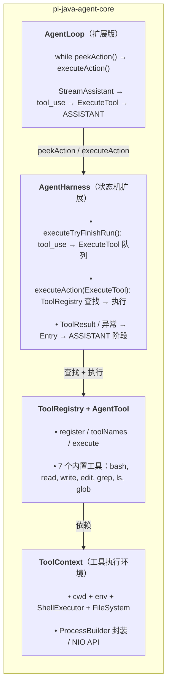
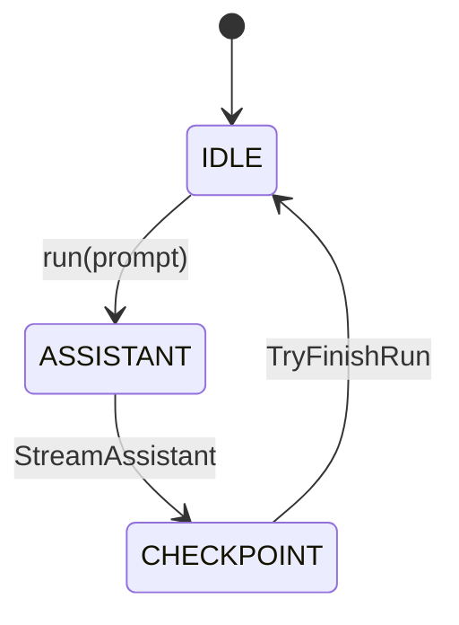
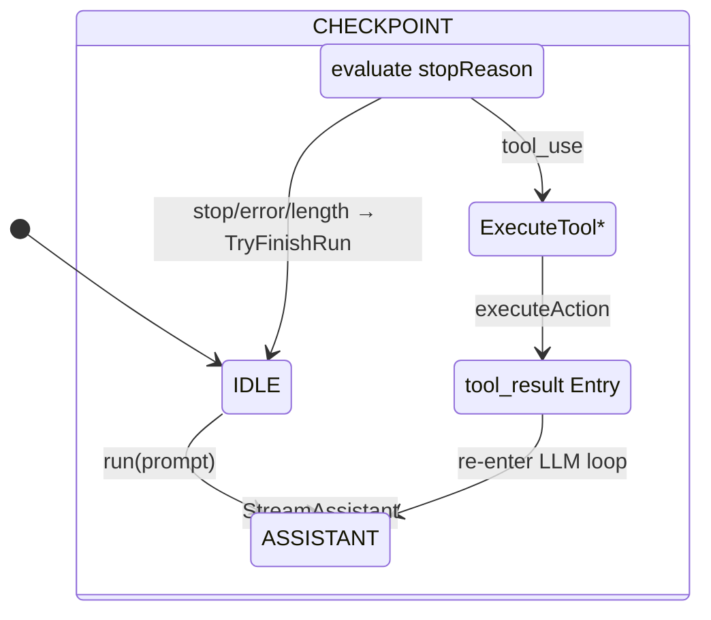
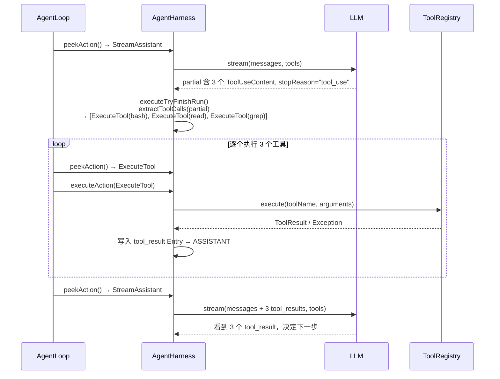

# Phase 2b: 工具系统 — 阶段设计文档

> **目标**：Agent 可以调用 bash/read/write 等工具完成编码任务。
> **工时**：2 周（11 项任务）
> **输入文档**：`03-detailed-design.md` §2.5、`04-implementation-plan.md` §5、`07-phase2a-agent-loop-design.md`
> **前置阶段**：Phase 2a（Agent 循环基础版可用）

---

## 1. 架构概览



**核心设计决策（对齐 pi）：**
- **AgentTool 接口**：对齐 pi 的 `AgentTool<TParameters, TDetails>`，5 参数 execute 签名（含 toolCallId、signal、onUpdate、context）。Java 化差异：context 作为 execute() 参数而非泛型参数
- **7 个内置工具**：bash（ProcessBuilder + 虚拟线程 + 超时/截断）、read（NIO 文件读取 + 行数限制 + 图片检测）、write（NIO 写入 + 原子替换）、edit（精确字符串替换 + diff 输出 + 备份）、grep（ripgrep 正则搜索 + 行号）、ls（目录列表 + 递归）、glob（通配符文件匹配）
- **工具执行引擎**：支持 sequential/parallel 两种模式，Phase 2b 默认 sequential
- **审批机制**：Phase 2b 在 ToolRegistry 层引入 `ApprovalHandler` 回调，Phase 3 CLI/TUI 对接
- **工具结果直接进入转录**：tool_result 作为 `Entry.Message(role="tool")` 写入 transcript

---

## 2. AgentTool 接口设计（P2b-1）

### 2.1 现有 Tool 接口的问题

Phase 2a 的 `Tool` 接口（`com.pijava.agent.harness.Tool`）是占位符设计，Phase 2b 不再扩展它：

```java
// 现状（Phase 2a）— Phase 2b 将整体替换为 AgentTool
public interface Tool {
    String name();
    String description();
    Map<String, Object> inputSchema();
    ToolResult execute(Map<String, Object> arguments) throws Exception;
    record ToolResult(String content, boolean isError) { }
}
```

与 pi 的差异：
1. `execute()` 只有 arguments 参数，缺少 `toolCallId`（标识工具调用）、`AbortSignal`（取消支持）、`onUpdate`（流式进度回调）
2. `ToolResult` 只有 `content: String`，缺少 `details`（结构化详情，用于 UI 渲染）、`usage`（工具自身用量）
3. 没有执行上下文（cwd、env、文件系统），工具无法操作真实文件
4. Phase 2a `Tool` 使用 `isError` 标志位，pi 使用异常驱动模型（throw = error）

**迁移策略**：Phase 2b 引入 `AgentTool`（新接口，对齐 pi），Phase 2a 的 `Tool` 接口标记 `@Deprecated` 并在 Phase 2b 完成后删除。`HarnessConfig.activeTools` 从 `Set<String>` 迁移到 `Set<AgentTool<?,?>>`。

### 2.2 新的 AgentTool 接口

对齐 pi 的 `AgentTool<TParameters, TDetails>`（pi 中 extends `Tool<TParameters>`，4 参数 execute）。
Java 化差异：`execute()` 多一个 `ToolContext context` 参数 — Java 无 TypeScript 的闭包捕获机制，
工具工厂无法隐式注入执行环境，因此显式传入。

```java
package com.pijava.agent.tool;

/**
 * A tool definition executed by the agent runtime.
 *
 * @param <TParams>  validated arguments type (Jackson-deserialized from LLM JSON)
 * @param <TDetails> structured detail type for UI rendering
 *
 * <p>Aligned with pi's {@code AgentTool}. Key Java-izations:
 * <ul>
 *   <li>5-param {@code execute()} — adds explicit {@code ToolContext} (pi injects via closure)</li>
 *   <li>Exception-driven errors — tools throw on failure, harness catches and
 *       wraps in error content (pi identical approach)</li>
 *   <li>{@code @FunctionalInterface} for callbacks instead of inline lambdas</li>
 * </ul></p>
 */
public interface AgentTool<TParams, TDetails> {

    /** Unique tool name (e.g. "bash", "read", "write"). */
    String name();

    /** Human-readable label for UI display. */
    String label();

    /** Description shown to the LLM in the system prompt / tool definition. */
    String description();

    /** JSON Schema describing the tool's input parameters. */
    Map<String, Object> inputSchema();

    /**
     * Execution mode hint.
     * {@link ExecutionMode.Sequential} — cannot run concurrently with other tools (e.g. bash).
     * {@link ExecutionMode.Parallel} — can run concurrently with other parallel tools (e.g. read, grep, ls, glob).
     */
    ExecutionMode executionMode();

    /**
     * Optional compatibility shim for raw tool-call arguments before
     * schema validation. Must return an object matching TParams.
     */
    default TParams prepareArguments(Map<String, Object> raw) {
        @SuppressWarnings("unchecked")
        var casted = (TParams) raw;
        return casted;
    }

    /**
     * Execute the tool call. <b>Throw on failure</b> — the harness catches
     * exceptions and wraps them in error results. This aligns with pi's
     * exception-driven error model.
     *
     * @param toolCallId unique identifier from the LLM
     * @param params     validated arguments
     * @param signal     abort signal (may be null)
     * @param onUpdate   progress callback (may be null; scoped to this invocation)
     * @param context    execution environment (cwd, shell, filesystem) —
     *                   explicit because Java lacks TypeScript's closure-based DI
     * @return the tool result
     * @throws Exception on failure (harness wraps in error result)
     */
    ToolResult<TDetails> execute(
        String toolCallId,
        TParams params,
        AbortSignal signal,
        ToolUpdateCallback<TDetails> onUpdate,
        ToolContext context
    ) throws Exception;
}
```

**ExecutionMode** — 工具执行模式（sealed interface，符合 Erasable Java 规范）：

```java
/** Tool execution mode. */
public sealed interface ExecutionMode {
    /** Must execute sequentially (e.g. bash). */
    record Sequential() implements ExecutionMode {}
    /** Can execute concurrently with other parallel tools (e.g. read, grep, ls, glob). */
    record Parallel() implements ExecutionMode {}
}
```

**ToolResult** — 工具执行结果（异常驱动：成功返回此类型，失败 throw）：

```java
/**
 * Tool execution result.
 *
 * <p>Tools throw on failure; {@code execute()} never returns an error result.
 * The harness catches exceptions and wraps them as error content for the LLM.</p>
 *
 * @param content      text/image content returned to the LLM
 * @param details      structured details for logs or UI rendering (nullable)
 * @param usage        usage from the tool execution itself (nullable)
 * @param terminate    hint that the agent should stop after the current batch
 * @param addedToolNames names of tools dynamically registered by this result
 *                       (Phase 2c — MCP tools; reserved field, always empty in 2b)
 */
public record ToolResult<TDetails>(
    List<ContentBlock> content,
    TDetails details,
    UsageInfo usage,
    boolean terminate,
    List<String> addedToolNames
) {
    public ToolResult {
        addedToolNames = List.copyOf(addedToolNames);
    }

    /** Create a successful text-only result. */
    public static <T> ToolResult<T> success(String text) {
        return new ToolResult<>(
            List.of(new ContentBlock.TextContent(text)),
            null, null, false, List.of());
    }

    /** Create a successful result with details. */
    public static <T> ToolResult<T> success(String text, T details) {
        return new ToolResult<>(
            List.of(new ContentBlock.TextContent(text)),
            details, null, false, List.of());
    }
}
```

**ToolUpdateCallback** — 流式进度回调（`@FunctionalInterface`）：

```java
/**
 * Progress callback for streaming tool execution updates.
 * Scoped to the current {@code execute()} invocation; calls made after
 * the execute() promise settles are ignored.
 */
@FunctionalInterface
public interface ToolUpdateCallback<TDetails> {
    void onUpdate(ToolResult<TDetails> partialResult);
}
```

**AbortSignal** — 工具取消信号：

```java
/**
 * Abort signal for tool cancellation. Wraps a volatile boolean flag.
 * Aligned with pi's {@code AbortSignal}.
 */
public class AbortSignal {
    private volatile boolean aborted;

    /** Check whether the signal has been triggered. */
    public boolean isAborted() { return aborted; }

    /** Trigger the abort signal. */
    public void abort() { aborted = true; }

    /** Create a fresh signal. */
    public static AbortSignal create() { return new AbortSignal(); }
}
```

### 2.2b ToolDefinition（LLM 协议层工具描述）

`ToolDefinition` 是 `AgentTool` 的轻量投影，仅包含 LLM 请求所需的元数据字段。
与 `03-detailed-design.md` §2.5 中带渲染字段的 `ToolDefinition` 不同：渲染字段（`renderCall`、
`renderResult`、`promptSnippet`、`promptGuidelines`）推迟到 Phase 3 TUI 阶段引入。

```java
/**
 * Lightweight tool descriptor for LLM requests.
 * Phase 2b: name + description + JSON Schema. Phase 3: adds renderCall/renderResult/promptSnippet.
 */
public record ToolDefinition(
    String name,
    String description,
    Map<String, Object> inputSchema
) {}
```

### 2.3 ToolContext（执行环境）

对齐 pi 的 `ExecutionToolContext` + `ExecutionEnv`：

```java
package com.pijava.agent.tool;

/**
 * Filesystem and shell context required by built-in tools.
 * Injected by AgentHarness, resolved per-turn from harness configuration.
 *
 * <p>Instances are <b>effectively immutable</b> (record-style fields + final
 * executor/fs references). {@link ShellExecutor} and {@link FileSystem}
 * implementations must document their own thread-safety guarantees.</p>
 *
 * <p>Aligned with pi's {@code ExecutionToolContext} and {@code ExecutionEnv}.
 */
public class ToolContext {

    private final String cwd;
    private final Map<String, String> env;
    private final ShellExecutor shell;
    private final FileSystem fs;

    public ToolContext(String cwd, Map<String, String> env,
                       ShellExecutor shell, FileSystem fs) {
        this.cwd = cwd;
        this.env = Map.copyOf(env);
        this.shell = shell;
        this.fs = fs;
    }

    /** Current working directory. */
    public String cwd() { return cwd; }

    /** Environment variables (merged with inherited env). */
    public Map<String, String> env() { return env; }

    /** Shell executor for bash tool. */
    public ShellExecutor shell() { return shell; }

    /** Filesystem abstraction for read/write tools. */
    public FileSystem fs() { return fs; }
}

/**
 * Shell command executor — wraps {@code ProcessBuilder}.
 * Phase 2b implements {@code DefaultShellExecutor} using Virtual Threads
 * + output capture with truncation.
 */
public interface ShellExecutor {
    /** Execute a command and return captured output. */
    ShellResult execute(String command, ShellOptions options) throws Exception;
}

public record ShellOptions(
    String cwd,
    Map<String, String> env,
    boolean inheritEnv,
    OptionalLong timeoutSeconds,
    AbortSignal signal
) {}

public record ShellResult(
    String output,          // stdout + stderr combined
    int exitCode,
    boolean timedOut,
    boolean truncated,      // output exceeded max lines/bytes
    long outputLines,
    long outputBytes
) {}

/**
 * Filesystem abstraction for read/write tools.
 * Implementations: real filesystem (production) or in-memory (tests).
 *
 * <p>{@code glob()} and {@code grep()} are NOT on this interface —
 * those are tool-level operations, not filesystem primitives.
 * GrepTool and GlobTool use {@code listDir()} + own logic.</p>
 */
public interface FileSystem {
    /** Read a text file. Returns lines as a list. */
    List<String> readLines(String path, long offset, long limit) throws IOException;

    /** Read a binary file. Returns raw bytes. */
    byte[] readBinary(String path) throws IOException;

    /** Write content to a file, creating parent directories. */
    void writeFile(String path, String content) throws IOException;

    /** Get file metadata. */
    FileInfo fileInfo(String path) throws IOException;

    /** Resolve a path (relative → absolute, symlink → target). */
    String resolvePath(String path);

    /** List directory contents. */
    List<FileInfo> listDir(String path, boolean recursive) throws IOException;
}

public record FileInfo(
    String path,
    String kind,       // "file" | "dir" | "symlink"
    long size,
    Instant modifiedAt
) {}

public record GrepMatch(
    String file,
    int line,
    String content
) {}
```

### 2.4 ToolRegistry

```java
package com.pijava.agent.tool;

/**
 * Registry of tools available to the agent.
 *
 * <p>Thread-safe. Tools are registered by name; the registry provides
 * lookup by name, enumeration for LLM tool definitions, and execution
 * via the agent harness.</p>
 */
public class ToolRegistry {

    private final ConcurrentMap<String, AgentTool<?, ?>> tools = new ConcurrentHashMap<>();
    private final ApprovalHandler approvalHandler;

    /**
     * @param approvalHandler nullable; tool calls that require approval
     *        are passed through this handler. If null, all tools auto-approve.
     */
    public ToolRegistry(ApprovalHandler approvalHandler) {
        this.approvalHandler = approvalHandler;
    }

    /** Register a tool. */
    public void register(AgentTool<?, ?> tool) {
        tools.put(tool.name(), tool);
    }

    /** Register all tools from a list. */
    public void registerAll(List<AgentTool<?, ?>> toolList) {
        for (var t : toolList) tools.put(t.name(), t);
    }

    /** Lookup a tool by name. Returns null if not found. */
    public AgentTool<?, ?> get(String name) {
        return tools.get(name);
    }

    /** All registered tool names. */
    public Set<String> toolNames() {
        return Set.copyOf(tools.keySet());
    }

    /** All registered tools. */
    public Collection<AgentTool<?, ?>> all() {
        return List.copyOf(tools.values());
    }

    /**
     * Execute a tool call by name.
     *
     * @throws SecurityException        if the tool call is not approved
     * @throws IllegalArgumentException if the tool is not found
     * @throws Exception                on tool execution failure (harness catches and wraps)
     */
    public ToolResult<?> execute(
            String toolName, String toolCallId,
            Map<String, Object> arguments,
            AbortSignal signal, ToolUpdateCallback<?> onUpdate,
            ToolContext context) throws Exception {
        var tool = tools.get(toolName);
        if (tool == null) {
            throw new IllegalArgumentException("Tool not found: " + toolName);
        }
        // Phase 2b: check approval before execution (Phase 3 CLI/TUI provides interactive handler)
        if (approvalHandler != null && !approvalHandler.approve(toolName, arguments)) {
            throw new SecurityException("Tool call not approved: " + toolName);
        }
        // Heterogeneous tool map requires unchecked cast; type-safety guaranteed
        // by register-time coupling between name key and AgentTool's generic signature.
        @SuppressWarnings("unchecked")
        var result = ((AgentTool<Map<String, Object>, Object>) tool)
            .execute(toolCallId, arguments, signal,
                     (ToolUpdateCallback<Object>) onUpdate, context);
        return result;
    }

    /** Generate tool definitions suitable for the LLM request. */
    public List<ToolDefinition> toToolDefinitions() {
        return tools.values().stream()
            .map(t -> new ToolDefinition(t.name(), t.description(), t.inputSchema()))
            .toList();
    }

    /** Generate tool descriptions for the system prompt. */
    public String toSystemPromptFragment() {
        var sb = new StringBuilder();
        for (var tool : tools.values()) {
            sb.append("- **").append(tool.name()).append("**: ")
              .append(tool.description()).append("\n");
        }
        return sb.toString();
    }
}

/**
 * Approval callback for tool execution.
 * Phase 2b: functional interface; Phase 3 CLI/TUI provides interactive approval.
 */
@FunctionalInterface
public interface ApprovalHandler {
    /**
     * @return true if the tool call is approved for execution
     */
    boolean approve(String toolName, Map<String, Object> arguments);
}
```

---

## 3. 7 个内置工具设计

所有工具名称、参数 schema、行为对齐 pi。

### 3.1 Bash 工具（P2b-2）

```java
/**
 * Shell command execution tool.
 * Aligned with pi's {@code createBashTool}.
 *
 * Schema: { command: String, timeout?: Number }
 * Execution: ProcessBuilder + Virtual Threads + output capture
 * Truncation: last 2000 lines or 100KB (whichever hit first),
 *   save full output to temp file if truncated
 *
 * <h4>Security model (Phase 2b)</h4>
 * Phase 2b runs commands directly via {@code ProcessBuilder} with no sandbox.
 * The {@code ApprovalHandler} callback (§2.4) is the primary safeguard —
 * every command requires user approval before execution (Phase 3 CLI/TUI).
 * Server/CI modes may auto-approve via a programmatic handler.
 * Phase 3+ may add sandboxing ({@code --sandbox}) and command whitelists
 * ({@code --allowed-commands}) aligned with pi's {@code BashToolOptions}.
 */
public final class BashTool {
    private static final int DEFAULT_MAX_LINES = 2000;
    private static final long DEFAULT_MAX_BYTES = 100_000L;
    private static final long MAX_TIMEOUT_SECONDS = 2_147_483_647L / 1000;

    /**
     * Create a bash tool.
     * @param commandPrefix optional prefix prepended to every command
     */
    public static AgentTool<BashInput, BashDetails> create(String commandPrefix);

    record BashInput(String command, Optional<Long> timeoutSeconds) {}
    record BashDetails(TruncationResult truncation, String fullOutputPath) {}
}
```

### 3.2 Read 工具（P2b-3）

```java
/**
 * File reading tool. Supports text files and images (jpg/png/gif/webp/bmp).
 * Aligned with pi's {@code createReadTool}.
 *
 * Schema: { path: String, offset?: Number, limit?: Number }
 * Text output truncated to 2000 lines or 100KB.
 * Images returned as base64 ContentBlock.ImageContent.
 */
public final class ReadTool {
    public static AgentTool<ReadInput, ReadDetails> create();

    record ReadInput(String path, Optional<Integer> offset, Optional<Integer> limit) {}
    record ReadDetails(TruncationResult truncation) {}
}
```

### 3.3 Write 工具（P2b-4）

```java
/**
 * File writing tool. Creates parent directories, overwrites existing files.
 * Aligned with pi's {@code createWriteTool}.
 *
 * Schema: { path: String, content: String }
 * Uses atomic write (write to temp + rename) for safety.
 */
public final class WriteTool {
    public static AgentTool<WriteInput, Void> create();

    record WriteInput(String path, String content) {}
}
```

### 3.4 Edit 工具（P2b-5）

```java
/**
 * File editing tool using exact string replacement.
 * Aligned with pi's {@code createEditTool}.
 *
 * Schema: { path: String, edits: Array<{ oldText: String, newText: String }> }
 * Each edit's oldText must be unique and non-overlapping.
 * Returns a unified diff in details.
 * Creates .bak file before modification.
 */
public final class EditTool {
    public static AgentTool<EditInput, EditDetails> create();

    record EditInput(String path, List<Edit> edits) {}
    record Edit(String oldText, String newText) {}
    record EditDetails(String diff, String patch, int firstChangedLine) {}
}
```

### 3.5 Grep 工具（P2b-6）

```java
/**
 * Regular expression search in files.
 * Aligned with pi's grep tool.
 *
 * Schema: { pattern: String, path?: String, glob?: String }
 * Uses Java regex. path defaults to cwd; glob filters files.
 * Returns matches with file, line number, and matching line content.
 */
public final class GrepTool {
    public static AgentTool<GrepInput, Void> create();

    record GrepInput(String pattern, Optional<String> path, Optional<String> glob) {}
}
```

### 3.6 LS 工具（P2b-7）

```java
/**
 * Directory listing tool.
 * Aligned with pi's ls tool.
 *
 * Schema: { path?: String, recursive?: Boolean }
 * Lists files and directories with size, type, and modified time.
 */
public final class LsTool {
    public static AgentTool<LsInput, Void> create();

    record LsInput(Optional<String> path, Optional<Boolean> recursive) {}
}
```

### 3.7 Glob 工具（P2b-8）

```java
/**
 * Glob-based file matching tool.
 * Aligned with pi's glob tool.
 *
 * Schema: { pattern: String, path?: String }
 * Returns matching file paths. Uses Java NIO PathMatcher.
 */
public final class GlobTool {
    public static AgentTool<GlobInput, Void> create();

    record GlobInput(String pattern, Optional<String> path) {}
}
```

---

## 4. 工具辅助设施

### 4.1 截断工具（TruncationUtils）

```java
/**
 * Output truncation for tools (bash, read).
 * Aligned with pi's truncate utilities.
 *
 * Truncation strategy: first hit wins (lines or bytes).
 * "Head" truncation — keeps first N lines/bytes (used for read).
 * "Tail" truncation — keeps last N lines/bytes (used for bash).
 */
public final class TruncationUtils {
    public static final int DEFAULT_MAX_LINES = 2000;
    public static final long DEFAULT_MAX_BYTES = 100_000L;

    /** Truncate keeping the tail (for bash output). */
    public static TruncationResult truncateTail(String content, int maxLines, long maxBytes);

    /**
     * Truncate keeping the head (for read output).
     * {@code lastLinePartial} is always {@code false} for head truncation —
     * the last line is excluded entirely (not partially included) when the
     * byte limit is exceeded mid-line. This avoids showing a broken partial line.
     */
    public static TruncationResult truncateHead(String content, int maxLines, long maxBytes);

    record TruncationResult(
        String content,
        boolean truncated,
        String truncatedBy,    // "lines" | "bytes"
        int outputLines,
        long outputBytes,
        boolean lastLinePartial  // meaningful only for tail truncation (bash)
    ) {}

    /** Format a byte size for display. */
    public static String formatSize(long bytes);
}
```

### 4.2 路径解析（PathUtils）

```java
/**
 * Path resolution utilities for tools.
 * Aligned with pi's {@code path-utils.ts}.
 */
public final class PathUtils {
    /** Resolve a tool path: relative → absolute, reject traversal attempts. */
    public static String resolveToolPath(ToolContext ctx, String path);

    /** Detect image MIME type from file bytes. */
    public static Optional<String> detectImageMimeType(byte[] data);

    /** Encode bytes as base64 (for image content). */
    public static String encodeBase64(byte[] data);
}
```

### 4.3 工具集工厂（ToolSetFactory）

```java
/**
 * Factory methods for creating tool sets.
 * Aligned with pi's tool creation patterns.
 */
public final class ToolSetFactory {

    /**
     * Create the full coding tool set: bash, read, write, edit, grep, ls, glob.
     * @param cwd           working directory for tools
     * @param commandPrefix optional prefix prepended to every bash command
     */
    public static List<AgentTool<?, ?>> createCodingTools(String cwd, String commandPrefix);

    /**
     * Create a read-only tool set: read, grep, ls, glob.
     * No mutation-capable tools included.
     */
    public static List<AgentTool<?, ?>> createReadOnlyTools(String cwd);
}
```

---

## 5. AgentHarness 工具集成（P2b-10）

### 5.1 状态机扩展

Phase 2a 状态机：



Phase 2b 扩展（工具回环）：



### 5.2 executeTryFinishRun 扩展

```java
private Action executeTryFinishRun(Action.TryFinishRun tfr) {
    // ... existing overhead ...
    String stopReason = lane.newestOwn.stopReason();
    if ("tool_use".equals(stopReason)) {
        // Phase 2b: extract tool calls from partial, return ExecuteTool actions
        List<Action.ExecuteTool> toolActions = extractToolCalls(lane.partial);
        if (!toolActions.isEmpty()) {
            lane.phase = RunPhase.CHECKPOINT; // stay in checkpoint
            // Queue tool actions — pop one at a time via peekAction
            lane.pendingToolCalls.addAll(toolActions);
            return peekAction();
        }
        lane.phase = RunPhase.IDLE;
        return null;
    }
    // stop, error, length → run is done
    lane.phase = RunPhase.IDLE;
    return null;
}
```

### 5.3 executeAction(ExecuteTool) 新分支

工具执行遵循异常驱动模型：工具成功返回 `ToolResult`，失败时抛出异常，
harness 捕获后构造 error 内容块写入 transcript。

Phase 2b 直接调用 {@code toolRegistry.execute()}（单工具逐个执行）；
Phase 3 替换为 {@link ToolExecutor}（支持 batch 级并行 + 审批流水线）。

```java
private Action executeTool(Action.ExecuteTool et) {
    List<ContentBlock> resultBlocks;
    boolean isError = false;

    try {
        var result = toolRegistry.execute(
            et.toolName(), et.toolCallId(), et.arguments(),
            lane.abortSignal(), null, toolContext);
        resultBlocks = result.content();
    } catch (Exception e) {
        // Exception-driven error model: wrap thrown error as text content
        resultBlocks = List.of(new ContentBlock.TextContent(
            "Error: " + e.getMessage()));
        isError = true;
    }

    // Write tool result as Entry.Message(role="tool")
    var parentId = lane.lastEntry().header().id();
    var toolEntry = new Entry.Message(
        Entry.newHeader(lane.nextSeq(), parentId),
        "tool",
        List.of(new ContentBlock.ToolResultContent(
            et.toolCallId(), et.toolName(),
            resultBlocks, isError))
    );
    lane.transcript.add(toolEntry);
    lane.pendingWrites.add(new ProvisionedEntry(toolEntry));

    // Record tool execution
    lane.records.add(new LaneRecord.ToolStarted(
        LaneRecord.newHeader(lane.records.size()),
        et.toolCallId(), et.toolName(), et.arguments()));

    // Transition back to ASSISTANT for follow-up LLM call
    // (error or success — LLM decides next step)
    lane.phase = RunPhase.ASSISTANT;
    return peekAction();
}
```

### 5.4 peekAction 扩展

```java
public Action peekAction() {
    return switch (lane.phase) {
        case RunPhase.Idle i -> null;
        case RunPhase.Assistant a -> {
            var pw = drainNextPendingWrite();
            if (pw != null) yield pw;
            // Check for pending tool calls from previous turn
            if (!lane.pendingToolCalls.isEmpty()) {
                yield lane.pendingToolCalls.remove(0);
            }
            yield new Action.StreamAssistant("assistant", 0);
        }
        case RunPhase.Checkpoint c -> {
            var pw = drainNextPendingWrite();
            if (pw != null) yield pw;
            yield new Action.TryFinishRun(determineOutcome());
        }
    };
}
```

### 5.5 LaneState 扩展

```java
final class LaneState {
    // ... existing fields ...

    /** Pending tool calls to execute (populated after tool_use stopReason). */
    final List<Action.ExecuteTool> pendingToolCalls = new ArrayList<>();

    /** Abort signal for the current run. */
    AbortSignal abortSignal;

    // ... existing methods ...
}
```

### 5.6 HarnessConfig 扩展

```java
public record HarnessConfig(
    StreamFn streamFn,
    ModelId<?> model,
    ModelThinkingLevel thinkingLevel,
    String systemPrompt,
    Set<AgentTool<?, ?>> activeTools,  // Phase 2b: ToolRegistry filters from this set
    int maxInputTokens,
    // Phase 2b additions:
    ToolRegistry toolRegistry,    // ← 新增
    ToolContext toolContext,      // ← 新增
    String commandPrefix          // ← 新增（bash 工具命令前缀）
) {
    public HarnessConfig {
        activeTools = Set.copyOf(activeTools);
    }
}
```

### 5.7 工具错误处理流程

工具执行错误遵循 pi 的异常驱动模型，在 harness 层统一捕获和转换：

```mermaid
flowchart TD
    exec["executeTool(ExecuteTool)"] --> call["toolRegistry.execute()"]
    call -->|成功| success["ToolResult.content<br/>→ tool_result Entry<br/>isError = false"]
    success --> assistant["→ ASSISTANT 阶段"]

    call -->|异常| classify{异常类型}
    classify -->|SecurityException| denied["审批拒绝<br/>→ tool_result Entry<br/>isError = true"]
    classify -->|IllegalArgumentException| notfound["工具未找到<br/>→ tool_result Entry<br/>isError = true"]
    classify -->|工具自身异常| toolerr["bash超时/read不存在/edit冲突<br/>→ tool_result Entry<br/>isError = true"]
    classify -->|不可恢复| fatal["OOM / 文件系统错误<br/>→ lane.partial.stopReason = error<br/>→ TryFinishRun(error)"]

    denied --> assistant
    notfound --> assistant
    toolerr --> assistant
```

关键设计决策：
- **工具错误不结束 run**：即使 `isError=true`，tool_result 写入 transcript 后仍返回 ASSISTANT，
  LLM 可基于错误信息自行修正（例如用正确路径重试 read）
- **"Tool not found" 不结束 run**：与 pi 一致，LLM 可能打错工具名，返回错误让它重试
- **工具结果的 `terminate` 标志**：当同一批次所有工具结果均设置 `terminate=true` 时，
  harness 提前结束 run（可用于"任务已完成"信号）

### 5.8 多工具批量处理（Multi-Tool Batch）

一个 assistant turn 可能返回多个 `tool_use` 块。Phase 2b 逐个处理：



Phase 3 将使用 `StructuredTaskScope` 并行化 `ExecutionMode.Parallel` 模式工具（read/grep/ls/glob）。

---

## 6. Tool 消息/内容块扩展

### 6.1 ToolResultContent（ContentBlock 新子类型）

Phase 2b 需要在 `ContentBlock` 中新增 `ToolResultContent`，用于在转录中表示工具执行结果：

```java
// ContentBlock.java — 新增子类型
record ToolResultContent(
    String toolUseId,
    String toolName,
    List<ContentBlock> content,   // 工具返回的文本/图片
    boolean isError
) implements ContentBlock {}
```

**与 pi 对齐**：pi 的 `ToolResultMessage` 包含 `toolCallId`、`toolName`、`content`、`isError`。Java 化时作为 `Entry.Message(role="tool")` 的 content block。

### 6.2 buildMessages 扩展

`LaneState.buildMessages()` 需要处理 `role="tool"` 的 Entry：

```java
private static Message toMessage(Entry.Message entry) {
    return switch (entry.role()) {
        case "user" -> new Message.UserMessage(entry.blocks());
        case "assistant" -> new Message.AssistantMessage(entry.blocks());
        case "tool" -> {
            // Extract ToolResultContent and convert to ToolResultMessage
            var block = (ContentBlock.ToolResultContent) entry.blocks().get(0);
            yield new Message.ToolResultMessage(
                block.toolUseId(), block.toolName(),
                block.content(), block.isError());
        }
        default -> new Message.UserMessage(entry.blocks());
    };
}
```

---

## 7. 工具执行引擎（P2b-9）

Phase 2b 实现基本的 sequential 执行模式。Parallel 执行模式使用虚拟线程 `StructuredTaskScope`。

```java
/**
 * Tool execution engine.
 * Phase 2b: sequential execution (one tool at a time).
 * Phase 3: parallel execution via StructuredTaskScope when appropriate.
 */
public class ToolExecutor {

    private final ToolRegistry registry;
    private final ToolContext context;
    private final ApprovalHandler approval;

    /**
     * Execute a batch of tool calls sequentially.
     * Returns the list of tool result entries to append to the transcript.
     */
    public List<Entry.Message> executeSequential(
            List<Action.ExecuteTool> toolActions,
            AbortSignal signal) throws InterruptedException;

    /**
     * Execute a batch of tool calls in parallel.
     * Only tools with {@link ExecutionMode.Parallel} can run concurrently;
     * {@link ExecutionMode.Sequential} tools force the whole batch to execute sequentially.
     */
    public List<Entry.Message> executeParallel(
            List<Action.ExecuteTool> toolActions,
            AbortSignal signal) throws InterruptedException;
}
```

---

## 8. 包结构

```
# pi-java-agent-core 模块（com.pijava.agent）
com.pijava.agent/
├── tool/
│   ├── AgentTool.java              ← 工具接口（泛型 + 5 参数 execute）
│   ├── ToolDefinition.java         ← LLM 协议层工具描述
│   ├── ToolRegistry.java           ← 工具注册/查找/执行
│   ├── ToolResult.java             ← 工具结果 record
│   ├── ToolUpdateCallback.java     ← 流式进度回调（F.I.）
│   ├── AbortSignal.java            ← 取消信号
│   ├── ExecutionMode.java          ← sealed: Sequential | Parallel
│   ├── ApprovalHandler.java        ← 审批回调（F.I.）
│   ├── ToolContext.java            ← 执行环境（cwd + shell + fs）
│   ├── ToolExecutor.java           ← 工具执行引擎
│   ├── ToolSetFactory.java          ← 工具集工厂方法
│   ├── ShellExecutor.java          ← Shell 执行器接口
│   ├── DefaultShellExecutor.java   ← ProcessBuilder 实现
│   ├── FileSystem.java             ← 文件系统抽象接口
│   ├── DefaultFileSystem.java      ← 真实文件系统实现
│   ├── FileInfo.java               ← 文件元数据 record
│   ├── GrepMatch.java              ← grep 匹配结果 record
│   ├── TruncationUtils.java        ← 输出截断工具
│   ├── PathUtils.java              ← 路径解析工具
│   └── builtin/                    ← 内置工具实现
│       ├── BashTool.java           ← bash 工具
│       ├── ReadTool.java           ← read 工具
│       ├── WriteTool.java          ← write 工具
│       ├── EditTool.java           ← edit 工具
│       ├── GrepTool.java           ← grep 工具
│       ├── LsTool.java             ← ls 工具
│       └── GlobTool.java           ← glob 工具
├── harness/
│   ├── AgentHarness.java           ← 状态机扩展（工具回环）
│   ├── LaneState.java              ← 新增 pendingToolCalls + abortSignal
│   ├── HarnessConfig.java          ← 新增 toolRegistry + toolContext
│   └── Action.java                 ← ExecuteTool 已声明（Phase 2a）
├── entry/
│   └── Entry.java                  ← 已有（工具结果作为 Message(role="tool")）
└── record/
    └── LaneRecord.java             ← ToolStarted 已声明（Phase 2a），Phase 2b 构造

# ── pi-java-ai 模块（com.pijava.ai）───────────
# message/
#   └── ContentBlock.java           ← 新增 ToolResultContent 子类型
#   └── Message.java                ← 新增 ToolResultMessage 子类型
```

---

## 9. 测试策略（P2b-11）

### 9.1 测试分层

| 层级 | 内容 | 依赖 |
|------|------|------|
| 工具单元测试 | 每个工具的 execute() 独立测试 | InMemoryFileSystem |
| Bash 工具测试 | 命令执行 + 超时 + 截断 + 取消 | ProcessBuilder |
| Read 工具测试 | 文本/图片文件读取 + 行限制 | InMemoryFileSystem |
| Write 工具测试 | 文件写入 + 目录创建 + 原子性 | TempDir |
| Edit 工具测试 | 精确替换 + diff 输出 + 冲突检测 | TempDir |
| Grep 工具测试 | 正则匹配 + 文件过滤 | TempDir |
| LS/Glob 工具测试 | 目录列表 + 递归 + 通配符 | TempDir |
| ToolRegistry 测试 | 注册/查找/未找到 + 审批拒绝 + 工具异常传播 | 无 |
| ToolExecutor 测试 | 顺序/并行执行 | 无 |
| AgentHarness 工具回环测试 | tool_use → ExecuteTool → ASSISTANT → stop | FauxProvider + ToolRegistry |
| AgentLoop 工具集成测试 | 多轮工具调用往返 | FauxProvider + InMemoryFileSystem |

### 9.2 覆盖率目标

- AgentTool 接口：≥ 95%
- 每个工具：≥ 90%（bash 因系统差异可能略低）
- ToolRegistry + ToolExecutor：≥ 95%
- AgentHarness 工具回环：≥ 85%
- AgentLoop 工具集成：≥ 80%

---

## 10. 里程碑与验收

```bash
# 1. 全量编译
mvn clean verify
# → BUILD SUCCESS

# 2. Bash 工具测试
mvn test -pl pi-java-agent-core -Dtest=BashToolTest

# 3. 全部 7 个工具测试
mvn test -pl pi-java-agent-core -Dtest="*ToolTest"

# 4. Agent 工具回环测试（模拟）
mvn test -pl pi-java-agent-core -Dtest=AgentHarnessToolLoopTest

# 5. 端到端（FauxProvider + 真实工具）
mvn test -pl pi-java-agent-core -Dtest=AgentLoopToolIntegrationTest

# 6. 手动验证
pi-java -p "read src/main/java/com/pijava/agent/harness/AgentHarness.java and count the lines"
# → 返回文件行数
```

---

## 11. Phase 2b 不做

- 并行工具执行（→ Phase 2c/3，batch 级别的 StructuredTaskScope）
- 工具 Hook（`beforeToolCall`/`afterToolCall` → Phase 2c）
- 工具审批 UI（→ Phase 3 CLI/TUI）
- 工具结果图片渲染（→ Phase 3 TUI）
- `addedToolNames` 动态工具注册（→ Phase 2c）
- 工具执行的 `onUpdate` 流式进度（Phase 2b 定义接口，各工具按需实现；bash 工具实现，其余工具直接返回最终结果）
- Skills 系统（→ Phase 2c）

---

## 12. 设计审查记录

### v1.1（2026-08-11 review 修复）

| 修复项 | 位置 | 变更 |
|--------|------|------|
| `ToolDefinition` 类型缺失 | 新增 §2.2b | 定义 `record ToolDefinition(name, description, inputSchema)`，与 03 §2.5 的差异加注释 |
| `Tool` 基接口迁移路径 | §2.1 | 补充 Phase 2a `Tool` → Phase 2b `AgentTool` 迁移策略，`@Deprecated` + 删除计划 |
| `isError` → 异常驱动 | §2.2, §2.4, §5.3, §5.7 | 移除 `ToolResult.isError`；工具 `execute()` 抛异常，harness 捕获后构造 error content；新增 §5.7 错误处理流程 |
| `ToolResult.addedToolNames` 预留 | §2.2 | 新增字段（Phase 2c MCP 工具动态注册），Phase 2b 始终为空 |
| 5-param `execute()` 说明 | §2.2 | 添加 Javadoc 说明：Java 无闭包 DI，`ToolContext` 需显式传入 |
| `FileSystem` 接口职责过重 | §2.3 | 移除 `glob()` 和 `grep()` → 工具自行实现；添加 Thread-safety 说明 |
| `ToolRegistry.execute()` 异常处理 | §2.4 | `Tool not found` 改为 `throw IllegalArgumentException`；异常向上传播 |
| 多工具批量处理 | 新增 §5.8 | 描述逐个执行流程 + Phase 3 并行化计划 |
| Bash 安全模型 | §3.1 | 添加 Phase 2b 安全策略：`ApprovalHandler` 审批 + 无沙箱（Phase 3+ 补充） |
| `lastLinePartial` 语义 | §4.1 | 明确 head 截断下始终为 `false`，仅 tail 截断有意义 |
| 包结构 `builtin/` 子包 | §8 | 7 个工具类从 `tool/` 扁平 → `tool/builtin/`
