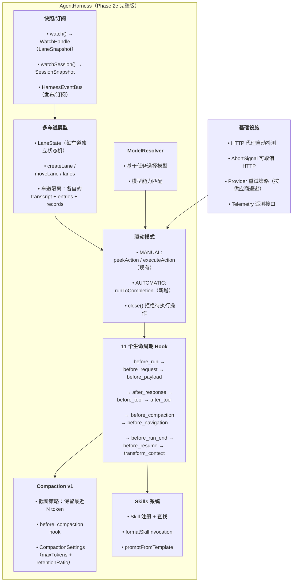

# Phase 2c: 高级编排 — 阶段设计文档

> **目标**：对齐 pi AgentHarness 全部能力 — 多车道、Hook、压缩、Skills、手动驱动。
> **工时**：2 周（13 项任务）
> **输入文档**：`03-detailed-design.md` §2.2–2.4、`04-implementation-plan.md` §6、`07-phase2a-agent-loop-design.md`、`07b-phase2b-tools-design.md`
> **前置阶段**：Phase 2b（工具系统可用）

---

## 1. 架构概览



**核心设计原则**：
- **手动驱动为主**：Phase 2a/2b 的 `peekAction()` / `executeAction()` 模式延续，`runToCompletion()` 在此之上封装
- **Hook 即拦截点**：每个 Hook 在状态机特定阶段触发，可修改上下文、中止操作
- **Lane 即隔离单元**：每个 Lane 有独立的状态机、transcript、工具集
- **对齐 pi 语义**：类型名称、Hook 签名、错误类型均对齐 pi

> **与 `03-detailed-design.md` §2.2 的已知偏离**：`03-detailed-design.md` 为高层设计文档，部分签名为简化版。本设计文档以下各处做了更细化的 Java 映射，与 pi TypeScript 源码对齐：
> - `DriveMode` 使用 `sealed interface`（非 `enum`），遵循 Erasable Java 规范
> - Hook 注册返回 `AutoCloseable`（非 `void`），支持取消注册
> - Hook 注册接受 `laneName` 参数，支持多车道 Hook
> - `BeforeToolHook` 返回 `BeforeToolResult`（非 `void`），允许拒绝/修改参数
> - `AfterToolHook` 返回 `ToolResult<?>`（非 `void`），允许修改工具结果
> - `TransformContextHook` 使用 `List<Message>`（非 `ContextDelta`），Phase 2c 尚未引入 `ContextDelta` 类型
> - `compact()` 接受 `laneName` 参数，支持多车道独立压缩
> - `watch()` 接受 `laneName` 参数（非无参），支持多车道独立订阅
> - `runToCompletion()` 接受 `laneName` 参数（非无参），支持指定车道自动运行
> - `LaneRecord.HookError` 是规格 §2.3 之外的新增变体
> - `peekAction()` / `executeAction()` 接受 `laneName` 参数（非无参），支持多车道操作
> - `LaneInfo`（§4.2）与规格 §2.4 的 `LaneInfo(String, String, long)` 同名不同结构——前者是快照投影（含 `OperationInfo`/`Queues`），后者是存储层车道元数据
> - Hook 上下文类型 `ToolCallContext` 对应规格中的 `ToolContext`——命名微调以明确表示「工具调用」语义
> - 活跃工具类型 `Set<AgentTool<?, ?>>` 对应规格中的 `Set<Tool>`——`Tool` 为 Phase 2b 废弃接口，Phase 2c 统一使用 `AgentTool`

---

## 2. 多车道模型（P2c-1）

### 2.1 当前状态

Phase 2a/2b 只有单车道 (`LaneState`)，通过 `AgentHarnessFuture` stub 方法占位：

```java
// 现状 — Phase 2a/2b 单车道
final class LaneState {
    String runId;
    int stepIndex;
    RunPhase phase;
    AssistantMessage partial;
    // ...
}
```

### 2.2 目标设计

AgentHarness 管理 `ConcurrentMap<String, LaneState>`（线程安全），默认车道名为 `"default"`。

```java
// AgentHarness.java — 多车道扩展

/** Default lane name. */
public static final String DEFAULT_LANE = "default";

// 替换单车道字段
private final ConcurrentMap<String, LaneState> lanes = new ConcurrentHashMap<>();
private final String defaultLaneName;

/** Get the default lane handle. */
public LaneHandle lane() {
    return new LaneHandle(defaultLaneName, this);
}

/** Create a new lane. */
public LaneHandle createLane(LaneConfig config) {
    if (lanes.containsKey(config.name())) {
        throw new LaneExists(config.name());
    }
    var state = new LaneState();
    state.laneName = config.name();
    state.parentLeafId = config.parentLeafId();
    state.activeTools = config.activeTools() != null
        ? Set.copyOf(config.activeTools()) : Set.of();
    lanes.put(config.name(), state);
    return new LaneHandle(config.name(), this);
}

/** Move entries from one lane to another. */
public void moveLane(String source, String target) {
    var src = requireLane(source);
    var tgt = requireLane(target);
    // Append source transcript entries to target, clear source
    tgt.transcript.addAll(src.transcript);
    src.transcript.clear();
}
```

### 2.3 LaneConfig

```java
/**
 * Configuration for creating a new lane.
 *
 * @param name          unique lane name
 * @param parentLeafId  optional parent leaf for branching
 * @param activeTools   tools enabled for this lane (defaults to harness tools)
 * @param systemPrompt  lane-specific system prompt override
 */
public record LaneConfig(
    String name,
    String parentLeafId,
    Set<AgentTool<?, ?>> activeTools,
    String systemPrompt
) {
    public static LaneConfig of(String name) {
        return new LaneConfig(name, null, null, null);
    }
}
```

### 2.4 LaneHandle

```java
/**
 * Handle to a specific lane. Delegates to AgentHarness with lane name context.
 * All operations are scoped to this lane.
 */
public class LaneHandle {
    private final String laneName;
    private final AgentHarness harness;

    LaneHandle(String laneName, AgentHarness harness) {
        this.laneName = laneName;
        this.harness = harness;
    }

    public String name() { return laneName; }
    public Action run(String prompt) { return harness.run(laneName, prompt); }
    public void abort() { harness.abort(laneName); }
    public LaneSnapshot snapshot() { return harness.snapshot(laneName); }
}
```

### 2.5 `lanes()` — 列出所有车道

```java
/** List all lane handles. */
public List<LaneHandle> lanes() {
    return lanes.keySet().stream()
        .map(name -> new LaneHandle(name, this))
        .toList();
}
```

### 2.6 Lane 隔离

每个 `LaneState` 有独立的状态机、条目队列、记录。run() 和 tool 操作通过 `laneName` 参数定位目标车道。

```java
final class LaneState {
    String laneName;
    String runId;
    RunPhase phase;
    // ... existing fields (transcript, pendingWrites, records, pendingToolCalls, etc.)
    Set<AgentTool<?, ?>> activeTools;   // lane-level override
    String parentLeafId;                 // branching source
}
```

---

## 3. 手动驱动模式完善（P2c-2）

### 3.1 当前状态

Phase 2a/2b 已实现 `peekAction()` + `executeAction()` 手动驱动，`run()` 启动新 run。

### 3.2 完善项

| 项目 | 现状 | Phase 2c |
|------|------|----------|
| `drive(DriveMode)` | stub（抛异常） | 实现：设置 `driveMode` 字段，AUTOMATIC 禁用 `peekAction/executeAction` |
| `drive()` getter | stub | 返回当前模式（§3.3） |
| `runToCompletion()` | stub | 内部循环 `peekAction/executeAction` 直到 null |
| `close()` | no-op | 拒绝所有待执行操作，抛出 `Closed` 异常 |
| 多车道 `run(laneName, prompt)` | 不存在 | 新增：以 laneName 参数启动 run |
| 多车道 `peekAction(laneName)` | Phase 2a 无参版 | 扩展：接受 laneName，缺省为 default lane |
| 队列调度（steer/followUp/nextRun/cancelQueued） | 不存在 | → Phase 3 stub；仅声明方法签名，抛 `UnsupportedOperationException` |

### 3.3 `drive()` getter / setter

```java
/** Get the current drive mode. */
public DriveMode drive() {
    return driveMode;
}

/** Set the drive mode. AUTOMATIC disables peekAction/executeAction. */
public void drive(DriveMode mode) {
    if (closed) throw new HarnessClosed();
    this.driveMode = mode;
}
```

### 3.4 DriveMode

```java
/** AgentHarness drive mode.
 * Uses sealed interface per Erasable Java convention (no enum).
 * Differs from 03-detailed-design.md §2.2 line 207 which sketches as enum. */
public sealed interface DriveMode {
    /** Manual drive: outer loop calls peekAction/executeAction. */
    record Manual() implements DriveMode {}
    /** Automatic drive: harness loops internally. */
    record Automatic() implements DriveMode {}
}
```

### 3.5 runToCompletion

```java
public CompletionStage<Void> runToCompletion(String laneName) {
    if (driveMode instanceof DriveMode.Manual) {
        throw new IllegalStateException("Cannot runToCompletion in MANUAL mode");
    }
    return CompletableFuture.runAsync(() -> {
        Action action;
        while ((action = peekAction(laneName)) != null) {
            executeAction(laneName, action);
        }
    });
}
```

### 3.6 close() 行为

```java
@Override
public void close() {
    closed = true;
    // Abort all active runs
    for (var lane : lanes.values()) {
        if (lane.abortSignal != null) {
            lane.abortSignal.abort();
        }
    }
}
```

---

## 4. 快照/订阅系统（P2c-3）

### 4.1 设计目标

- `watch(String laneName)` 返回 `WatchHandle<LaneSnapshot>` — 车道级快照订阅
- `watchSession()` 返回 `WatchHandle<SessionSnapshot>` — 会话级快照
- 每次状态变更后触发回调（通过 `HarnessEventBus`）

### 4.2 LaneSnapshot + SessionSnapshot

```java
/**
 * Immutable point-in-time snapshot of a lane.
 */
public record LaneSnapshot(
    String lane,
    List<Entry> transcript,
    String leafId,
    LaneInfo.OperationInfo operation,
    LaneInfo.Queues queues,
    List<ProvisionedEntry> pendingWrites,
    boolean faulted
) {}

/**
 * Immutable point-in-time snapshot of the entire session.
 */
public record SessionSnapshot(
    String name,
    String model,
    String phase,
    long totalTokens,
    int turnCount,
    List<String> activeTools,
    List<LaneInfo> lanes
) {}

public record LaneInfo(
    String name,
    String leafId,
    OperationInfo operation
) {
    public record OperationInfo(
        String id,
        String kind,   // "run" | "compaction" | "navigation"
        String status  // "running" | "suspended" | "aborting"
    ) {}
    public record Queues(
        List<QueuedItem> steer,
        List<QueuedItem> followUp,
        List<QueuedItem> nextRun
    ) {}
}
```

### 4.3 WatchHandle

```java
/**
 * Handle returned by watch() — allows unsubscription.
 */
public interface WatchHandle<T> extends AutoCloseable {
    T current();
    @Override void close(); // unsubscribe
}
```

### 4.4 HarnessEventBus

```java
/**
 * Internal event bus for harness state changes.
 * Not part of public API — used to drive watch() subscriptions.
 */
final class HarnessEventBus {
    private final List<Consumer<LaneSnapshot>> laneListeners = new CopyOnWriteArrayList<>();
    private final List<Consumer<SessionSnapshot>> sessionListeners = new CopyOnWriteArrayList<>();

    void publish(LaneSnapshot snapshot) {
        for (var l : laneListeners) l.accept(snapshot);
    }
    void subscribeLane(Consumer<LaneSnapshot> listener) {
        laneListeners.add(listener);
    }
    void unsubscribeLane(Consumer<LaneSnapshot> listener) {
        laneListeners.remove(listener);
    }
    // session-level similarly
}
```

### 4.5 AgentHarness 公开 watch() 方法

```java
// AgentHarness — public snapshot subscription methods

/** Subscribe to lane-level snapshots. Returns handle for unsubscription. */
public WatchHandle<LaneSnapshot> watch(String laneName) {
    DefaultWatchHandle<LaneSnapshot> handle = new DefaultWatchHandle<>(
        () -> buildLaneSnapshot(laneName));
    eventBus.subscribeLane(snapshot -> {
        if (snapshot.lane().equals(laneName)) {
            handle.notify(snapshot);
        }
    });
    return handle;
}

/** Subscribe to session-level snapshots. */
public WatchHandle<SessionSnapshot> watchSession() {
    return new DefaultWatchHandle<>(
        () -> buildSessionSnapshot());
    // session listeners registered on eventBus
}
```

`DefaultWatchHandle<T>` 是 `WatchHandle<T>` 的内部实现，持有 `current` supplier 和 `List<Consumer<T>> listeners`，在 `notify()` 时分发快照：

```java
final class DefaultWatchHandle<T> implements WatchHandle<T> {
    private final Supplier<T> currentSupplier;
    final List<Consumer<T>> listeners = new CopyOnWriteArrayList<>();

    DefaultWatchHandle(Supplier<T> currentSupplier) {
        this.currentSupplier = currentSupplier;
    }

    @Override public T current() { return currentSupplier.get(); }
    @Override public void close() { eventBus.unsubscribeLane(this); }
    void notify(T snapshot) { listeners.forEach(l -> l.accept(snapshot)); }
}
// Note: close() requires DefaultWatchHandle to hold a reference to HarnessEventBus
// (omitted from constructor for brevity — passed at construction time in real impl)
```

---

## 5. 11 个生命周期 Hook（P2c-4）

### 5.1 Hook 名称与触发点

| Hook | 触发时机 | 可修改上下文？ |
|------|----------|--------------|
| `before_run` | `run()` 开始时，写入 user entry 之前 | 可修改 prompt |
| `before_resume` | 恢复暂停操作时 | 可修改上下文 |
| `transform_context` | 构建 LLM 消息列表时 | 可注入/移除消息 |
| `before_request` | 发出 LLM API 请求前 | 可取消请求 |
| `before_payload` | 序列化 API payload 前 | 可修改 JSON payload |
| `after_response` | 收到 LLM 响应时 | 只读 |
| `before_tool` | 执行工具调用前 | 可修改参数/拒绝 |
| `after_tool` | 工具执行完成后 | 可修改结果 |
| `before_compaction` | 压缩前 | 可修改压缩计划 |
| `before_navigation` | 树状导航前 | 可拒绝导航 |
| `before_run_end` | run 结束前（stop/error/length） | 可注入最终消息 |

### 5.2 Hook 接口（对齐 pi）

```java
package com.pijava.agent.hook;

// 11 FunctionalInterface 定义，对齐 pi 的 Hook 命名

@FunctionalInterface public interface BeforeRunHook {
    void beforeRun(RunContext ctx);
}
@FunctionalInterface public interface BeforeResumeHook {
    void beforeResume(ResumeContext ctx);
}
@FunctionalInterface public interface TransformContextHook {
    List<Message> transformContext(List<Message> messages);
}
@FunctionalInterface public interface BeforeRequestHook {
    void beforeRequest(RequestContext ctx);
}
@FunctionalInterface public interface BeforePayloadHook {
    Map<String, Object> beforePayload(Map<String, Object> payload);
}
@FunctionalInterface public interface AfterResponseHook {
    void afterResponse(ResponseContext ctx);
}
@FunctionalInterface public interface BeforeToolHook {
    BeforeToolResult beforeTool(ToolCallContext ctx);
}
@FunctionalInterface public interface AfterToolHook {
    ToolResult<?> afterTool(ToolResultContext ctx);
}
@FunctionalInterface public interface BeforeCompactionHook {
    CompactionPlan beforeCompaction(CompactionContext ctx);
}
@FunctionalInterface public interface BeforeNavigationHook {
    void beforeNavigation(NavigationContext ctx);
}
@FunctionalInterface public interface BeforeRunEndHook {
    void beforeRunEnd(RunEndContext ctx);
}
```

### 5.3 AgentHarness 注册方法

```java
// 每个 Hook 一个注册方法，返回取消注册的 callback
public AutoCloseable onBeforeRun(String laneName, BeforeRunHook hook);
public AutoCloseable onBeforeResume(String laneName, BeforeResumeHook hook);
// ... 其余 9 个
```

### 5.4 Hook 上下文类型

```java
public record RunContext(String lane, String runId, List<Message> prompt) {}
public record ResumeContext(String lane, String runId, SuspendedOperation suspended) {}
public record RequestContext(String lane, String runId, List<Message> messages) {}
public record ResponseContext(String lane, String runId, AssistantMessage response, Usage usage) {}
public record ToolCallContext(String lane, String toolCallId, String toolName,
                               Map<String, Object> arguments) {}
public record BeforeToolResult(boolean allow, Map<String, Object> arguments) {
    public static BeforeToolResult allow() { return new BeforeToolResult(true, null); }
    public static BeforeToolResult deny(String reason) { return new BeforeToolResult(false, null); }
    public static BeforeToolResult modify(Map<String, Object> newArgs) {
        return new BeforeToolResult(true, newArgs);
    }
}
public record ToolResultContext(String lane, String toolCallId, String toolName,
                                 ToolResult<?> result) {}
public record CompactionContext(String lane, List<Entry> transcript, int currentTokens) {}
public record CompactionPlan(List<Entry> keepEntries, int targetTokens) {}
public record NavigationContext(String lane, String targetLeafId) {}
public record RunEndContext(String lane, String runId, String outcome) {}
```

### 5.5 LaneRecord.HookError

> **注意**：`HookError` 是 Phase 2c 在规格 §2.3 定义的 9 个 `LaneRecord` 子类型之上新增的第 10 个变体。

Hook 执行错误记录为 `LaneRecord` 的新变体：

```java
/**
 * Recorded when a lifecycle hook throws an exception.
 * The error is non-fatal — the run continues.
 */
record HookError(
    long seq, Instant timestamp,
    String hookName,
    String message
) implements LaneRecord {}
```

### 5.6 Hook 执行

每个 Hook 在状态机的对应阶段同步调用。Hook 抛出的异常不中止运行——捕获后记录为 `LaneRecord.HookError`，运行继续。

11 个 `fire*` 方法均遵循相同模式（以 `fireBeforeRun` 为例）：

```java
private void fireBeforeRun(String laneName, RunContext ctx) {
    for (var hook : hooks.get(laneName, "before_run")) {
        try {
            hook.beforeRun(ctx);
        } catch (Exception e) {
            lane(laneName).records.add(new LaneRecord.HookError(
                lane.nextRecordSeq(), Instant.now(), "before_run", e.getMessage()));
        }
    }
}
// fireBeforeResume, fireTransformContext, fireBeforeRequest, fireBeforePayload,
// fireAfterResponse, fireBeforeTool, fireAfterTool, fireBeforeCompaction,
// fireBeforeNavigation, fireBeforeRunEnd — 结构相同，仅 Hook 类型与参数不同
```

`hooks` 内部存储类型为 `Multimap<String, String, Hook>`（lane name → hook name → Hook 实例列表），定义在 `AgentHarness` 中：

```java
// AgentHarness — hook storage (compound key: lane + hook name)
private final Table<String, String, List<Consumer<?>>> hooks = HashBasedTable.create();
// Table<laneName, hookName, List<Hook>> — Guava Table or custom Multimap equivalent
```


---

## 6. Skills 系统（P2c-5）

### 6.1 设计

Skills 是预注册的命名能力，可通过 `skill("name")` 查找并注入到 system prompt 中。

```java
package com.pijava.agent.skill;

/**
 * A named skill that can be loaded into the agent's context.
 * Aligned with pi's Skill interface.
 */
public interface Skill {
    /** Unique skill name (e.g. "code-review", "tdd"). */
    String name();

    /** Human-readable label. */
    String label();

    /** Description shown to the LLM. */
    String description();

    /**
     * Get the system prompt fragment for this skill.
     * Inserted into the agent's system prompt when the skill is active.
     */
    String systemPrompt();

    /**
     * Optional tool definitions contributed by this skill.
     * Return empty list if the skill is purely prompt-based.
     */
    List<ToolDefinition> tools();
}
```

### 6.2 SkillManager

```java
public class SkillManager {
    private final ConcurrentMap<String, Skill> skills = new ConcurrentHashMap<>();

    public void register(Skill skill) {
        skills.put(skill.name(), skill);
    }

    public Skill get(String name) {
        var skill = skills.get(name);
        if (skill == null) throw new UnknownSkill(name);
        return skill;
    }

    public Collection<Skill> all() {
        return List.copyOf(skills.values());
    }
}
```

### 6.3 PromptTemplate

> Phase 2c 仅定义最小接口；模板注册机制与内置模板集（如 `"tool-use"`、`"code-review"`）推迟到 Phase 3。

```java
/**
 * Named template for prompt generation.
 */
public interface PromptTemplate {
    String name();
    String render(Map<String, Object> vars);
}
```

### 6.4 集成到 AgentHarness

```java
// AgentHarness
private final SkillManager skillManager = new SkillManager();

public Skill skill(String name) {
    if (closed) throw new HarnessClosed();
    return skillManager.get(name);
}

public String promptFromTemplate(String template, Map<String, Object> vars) {
    // lookup template, render with vars
}
```

---

## 7. Compaction v1（P2c-6）

### 7.1 设计

Phase 2c 实现基本的截断式压缩：当 transcript token 数超过阈值时，保留最近 N token 并总结较早内容。

### 7.2 CompactionSettings

```java
/**
 * Settings controlling auto-compaction behavior.
 * Aligned with pi's CompactionSettings.
 */
public record CompactionSettings(
    int maxTokens,           // trigger compaction when transcript exceeds this
    double retentionRatio,   // fraction of tokens to keep (0.0–1.0)
    boolean preserveSystemMessages,
    boolean preserveRecentTools
) {
    public static CompactionSettings defaults() {
        return new CompactionSettings(100_000, 0.3, true, true);
    }
}
```

### 7.3 压缩逻辑

```java
// AgentHarness.compact()
public void compact(String laneName, CompactionSettings settings) {
    if (closed) throw new HarnessClosed();
    var lane = requireLane(laneName);
    if (lane.transcript.size() <= 1) throw new NothingToCompact(laneName);

    // Fire before_compaction hook
    var plan = fireBeforeCompaction(laneName, new CompactionContext(
        laneName, List.copyOf(lane.transcript), estimateTokens(lane.transcript)));

    // Build compacted transcript
    int keepCount = Math.max(1, (int)(lane.transcript.size() * settings.retentionRatio()));
    var compacted = new ArrayList<>(lane.transcript.subList(
        Math.max(0, lane.transcript.size() - keepCount), lane.transcript.size()));

    // Prepend compaction entry
    int entriesBefore = lane.transcript.size();
    int entriesAfter = compacted.size();
    compacted.add(0, new Entry.Compaction(
        Entry.newHeader(lane.nextSeq(), ""),
        "overflow", entriesBefore, entriesAfter));

    lane.transcript.clear();
    lane.transcript.addAll(compacted);
}
```

---

## 8. 模型/思考级别/活跃工具管理（P2c-meta）

> P2c-meta 是独立任务，覆盖 AgentHarness 运行时配置的 getter/setter；非 P2c-7（SystemPromptBuilder）的子任务。

### 8.1 设计

对齐 `03-detailed-design.md` §2.2 第 339–344 行——模型、思考级别、活跃工具的 getter/setter。

```java
// AgentHarness — model, thinking, active tools

/** Get the currently selected model. */
public ModelId getModel() {
    return config.model();
}

/** Set the model for subsequent runs (delegates to config.withModel). */
public void setModel(ModelId model) {
    if (closed) throw new HarnessClosed();
    config = config.withModel(model);
}

/** Get the current thinking level. */
public ThinkingLevel getThinkingLevel() {
    return config.thinkingLevel();
}

/** Set the thinking level for subsequent runs. */
public void setThinkingLevel(ThinkingLevel level) {
    if (closed) throw new HarnessClosed();
    config = config.withThinkingLevel(level);
}

/** Get the currently active tool set. */
public Set<AgentTool<?, ?>> getActiveTools() {
    return Set.copyOf(activeTools);
}

/** Set the active tools for subsequent runs. */
public void setActiveTools(Set<AgentTool<?, ?>> tools) {
    if (closed) throw new HarnessClosed();
    this.activeTools = Set.copyOf(tools);
}
```

### 8.2 HarnessConfig 扩展

对齐 P2b §5.6 模式，Phase 2c 扩展 `HarnessConfig` record 新增以下字段：

```java
// HarnessConfig.java — Phase 2c 扩展（新增字段加 ★）
public record HarnessConfig(
    // Phase 2a fields
    ModelId defaultModel,
    ThinkingLevel thinkingLevel,
    Set<AgentTool<?, ?>> tools,
    String systemPrompt,

    // Phase 2c fields ★
    DriveMode driveMode,         // 默认 MANUAL
    Map<String, Skill> skills,    // 已注册 skills
    CompactionSettings compaction, // 压缩设置（null = 禁用自动压缩）
    RetryPolicy retryPolicy,      // 重试策略（Phase 2c-9）
    TelemetryContext telemetry    // 遥测上下文（Phase 2c-11）
) {
    public static HarnessConfig defaults() {
        return new HarnessConfig(
            ModelId.from("anthropic", "claude-sonnet-4-20250514"),
            ThinkingLevel.OFF,
            Set.of(),
            "",
            new DriveMode.Manual(),
            Map.of(),
            null,
            RetryPolicy.defaultPolicy(),
            TelemetryContext.noOp()
        );
    }

    // with* 不可变更新方法
    public HarnessConfig withModel(ModelId model) { ... }
    public HarnessConfig withDriveMode(DriveMode mode) { ... }
    public HarnessConfig withCompaction(CompactionSettings s) { ... }
}
```

---

## 9. 系统提示构建器（P2c-7）

### 9.1 设计

将 Phase 2b 中分散的 system prompt 拼接逻辑集中到 `SystemPromptBuilder`。

```java
package com.pijava.agent;

/**
 * Builder for constructing the agent's system prompt from components.
 * Phase 2c: centralizes prompt assembly — base template + active tools +
 * active skills + custom instructions.
 */
public final class SystemPromptBuilder {

    private final StringBuilder sb = new StringBuilder();

    /** Append a base template. */
    public SystemPromptBuilder base(String template) {
        sb.append(template).append("\n\n");
        return this;
    }

    /** Append tool descriptions for the given tools. */
    public SystemPromptBuilder tools(Collection<AgentTool<?, ?>> tools) {
        if (tools.isEmpty()) return this;
        sb.append("## Available Tools\n\n");
        for (var t : tools) {
            sb.append("- **").append(t.name()).append("**: ")
              .append(t.description()).append("\n");
        }
        sb.append("\n");
        return this;
    }

    /** Append skill prompts. */
    public SystemPromptBuilder skills(Collection<Skill> skills) {
        if (skills.isEmpty()) return this;
        sb.append("## Active Skills\n\n");
        for (var s : skills) {
            sb.append(s.systemPrompt()).append("\n");
        }
        sb.append("\n");
        return this;
    }

    /** Append custom instructions. */
    public SystemPromptBuilder instructions(String text) {
        if (text != null && !text.isEmpty()) {
            sb.append(text).append("\n");
        }
        return this;
    }

    /** Build the final system prompt string. */
    public String build() {
        return sb.toString().stripTrailing();
    }
}
```

---

## 10. HTTP 代理检测 + AbortSignal（P2c-8）

### 10.1 HTTP 代理检测

```java
package com.pijava.ai.http;

/** Detect system HTTP/HTTPS proxy settings. */
public final class ProxyDetector {
    private ProxyDetector() {}

    /**
     * Detect proxy from environment variables and system properties.
     * Checks: https_proxy → HTTPS_PROXY → http_proxy → HTTP_PROXY → System properties.
     */
    public static Optional<ProxySelector> detectProxy() {
        // Check env vars and system properties, return configured ProxySelector
    }
}
```

### 10.2 AbortSignal 完善

Phase 2b 已有 `AbortSignal`（`volatile boolean`）。Phase 2c 扩展为依赖注入到 `PiHttpClient`：

```java
// PiHttpClient 扩展 — 支持 AbortSignal 取消 HTTP 请求
public Stream<StreamEvent> streamMessages(..., AbortSignal signal) {
    // Wrap HttpRequest with CompletableFuture, cancel on signal.isAborted()
}
```

---

## 11. Provider 重试策略（P2c-9）

### 11.1 RetryPolicy 接口

```java
package com.pijava.ai.http;

/**
 * Per-provider retry backoff strategy.
 */
public interface RetryPolicy {
    /** Maximum retry attempts. */
    int maxRetries();

    /** Delay before next retry in milliseconds. */
    long delayMs(int attempt);

    /** Whether the given HTTP status code is retryable. */
    boolean isRetryable(int statusCode);

    /** Whether the given exception is retryable. */
    boolean isRetryable(Throwable t);
}
```

### 11.2 预置策略

| Provider | maxRetries | delayMs | retryable statuses |
|----------|------------|---------|--------------------|
| Anthropic | 3 | 1000 * 2^attempt | 429, 500, 502, 503, 504 |
| OpenAI | 5 | 500 * 2^attempt | 429, 500, 502, 503 |
| Google | 3 | 2000 * 1.5^attempt | 429, 500, 503 |
| Mistral | 3 | 1000 * 2^attempt | 429, 500, 502, 503 |
| DeepSeek | 3 | 1000 * 2^attempt | 429, 500, 502, 503 |

Phase 2c 在 `PiHttpClient` 中根据 `RetryPolicy` 自动重试；Phase 2a 硬编码的 3 次重试被替换。

---

## 12. 模型路由（P2c-10）

### 12.1 ModelResolver

```java
package com.pijava.ai.model;

/**
 * Selects the best model for a given task based on capability matching.
 * Phase 2c: simple capability-based resolution.
 */
public interface ModelResolver {
    /**
     * Resolve the best model for the given requirements.
     * @param required minimum capabilities required
     * @param preferred optional preferred model family
     * @return the resolved ModelId
     */
    ModelId resolve(Set<ModelCapability> required, Optional<String> preferred);
}
```

### 12.2 DefaultModelResolver

基于 ModelCapability（TEXT、TOOL_USE、IMAGE、THINKING、LARGE_CONTEXT）和预算约束选择模型。

---

## 13. 遥测系统集成（P2c-11）

### 13.1 TelemetryContext

```java
package com.pijava.telemetry;

/**
 * Lightweight telemetry interface.
 * Implementations: no-op (default), OpenTelemetry (Phase 6), logging.
 */
public interface TelemetryContext {
    /** Increment a counter metric. */
    void incrementCounter(String name, long delta);

    /** Record a timing metric in milliseconds. */
    void recordTiming(String name, long durationMs);

    /** Create a child telemetry context with additional dimensions. */
    TelemetryContext with(String key, String value);
}
```

Phase 2c 默认实现 `NoOpTelemetry`，Phase 6 引入 OpenTelemetry 实现。

---

## 14. 包结构

```
# pi-java-agent-core（com.pijava.agent）
com.pijava.agent/
├── harness/
│   ├── AgentHarness.java          ← 扩展：多车道 + Hook + 队列 + close()
│   ├── LaneState.java             ← 扩展：laneName + parentLeafId + 多实例
│   ├── LaneHandle.java            ← 新增：车道句柄
│   ├── LaneConfig.java            ← 新增：车道创建配置
│   ├── LaneSnapshot.java          ← 新增：快照 record
│   ├── SessionSnapshot.java       ← 新增：会话快照 record
│   ├── HarnessConfig.java         ← 扩展：driveMode + skills + settings
│   ├── Action.java                ← 已有
│   ├── DriveMode.java             ← 新增：sealed Manual|Automatic
│   ├── HarnessEventBus.java       ← 新增：内部事件总线
│   ├── WatchHandle.java           ← 新增：取消订阅句柄
│   └── AgentHarnessFuture.java    ← 移除（不再需要 stub）
├── hook/
│   ├── BeforeRunHook.java         ← 新增
│   ├── BeforeResumeHook.java      ← 新增
│   ├── TransformContextHook.java  ← 新增
│   ├── BeforeRequestHook.java     ← 新增
│   ├── BeforePayloadHook.java     ← 新增
│   ├── AfterResponseHook.java     ← 新增
│   ├── BeforeToolHook.java        ← 新增
│   ├── AfterToolHook.java         ← 新增
│   ├── BeforeCompactionHook.java  ← 新增
│   ├── BeforeNavigationHook.java  ← 新增
│   ├── BeforeRunEndHook.java      ← 新增
│   └── (context types)            ← RunContext, ToolCallContext, etc.
├── compaction/
│   ├── CompactionSettings.java    ← 新增
│   └── CompactionService.java     ← 新增：compact() 委托目标（实现见 §7.3）
├── skill/
│   ├── Skill.java                 ← 新增
│   ├── SkillManager.java          ← 新增
│   └── PromptTemplate.java        ← 新增
├── prompt/
│   └── SystemPromptBuilder.java   ← 新增
├── tool/                           ← Phase 2b 不变
│   └── ...
├── entry/                          ← Phase 2a 不变
│   └── Entry.java                 ← 已有 Compaction + BranchSummary
└── record/
    └── LaneRecord.java            ← 扩展：HookError 事件

# pi-java-ai（com.pijava.ai）
com.pijava.ai/
├── http/
│   ├── PiHttpClient.java          ← 扩展：AbortSignal + RetryPolicy
│   ├── RetryPolicy.java           ← 新增
│   └── ProxyDetector.java         ← 新增
├── model/
│   ├── ModelCapability.java       ← 已有
│   └── ModelResolver.java         ← 新增
└── ...

# pi-java-telemetry（com.pijava.telemetry）
com.pijava.telemetry/
├── TelemetryContext.java          ← 新增
└── NoOpTelemetry.java             ← 新增
```

---

## 15. 测试策略（P2c-12）

| 层级 | 内容 | 工具 |
|------|------|------|
| Hook 单元测试 | 每个 Hook 独立触发 + HookError 捕获 | Mock LaneState |
| 多车道测试 | createLane + moveLane + lane 隔离 | 2+ LaneState 实例 |
| Compaction 测试 | 压缩前后 transcript 对比 + retentionRatio | 真实 Entry 列表 |
| Skills 测试 | register → get → systemPrompt 拼接 | SkillManager |
| SystemPromptBuilder 测试 | base + tools + skills 输出验证 | 字符串断言 |
| ModelResolver 测试 | 能力匹配 + fallback | Mock ModelCatalog |
| runToCompletion 测试 | 完整 run 自动完成 | FauxProvider |
| 端到端集成测试 | 多 lane + hook + compaction 完整流程 | FauxProvider + ToolRegistry |

---

## 16. 里程碑与验收

```bash
# 1. 全量编译
mvn clean verify
# → BUILD SUCCESS

# 2. Hook 单元测试
mvn test -pl pi-java-agent-core -Dtest="*HookTest"

# 3. 多车道测试
mvn test -pl pi-java-agent-core -Dtest="MultiLaneTest"

# 4. Compaction 测试
mvn test -pl pi-java-agent-core -Dtest="CompactionTest"

# 5. 端到端（FauxProvider + 多车道 + hook + compaction）
mvn test -pl pi-java-agent-core -Dtest="AgentHarnessIntegrationTest"

# 6. 手动验证
pi-java -p "create a file called hello.txt with 'Hello World'"
# → Agent 使用 write 工具创建文件
```

---

## 17. Phase 2c 不做

- 持久化/恢复（→ Phase 4，SessionStorage / JSONL）
- 树状导航（navigateTree → Phase 4）
- 队列调度（steer / followUp / nextRun → Phase 3，CLI 交互需要）
- Telemetry OpenTelemetry 实现（→ Phase 6）
- MCP 工具动态注册（`addedToolNames` → Phase 3）
- 并行工具执行（→ Phase 3，StructuredTaskScope）
- AI 生成 Skills（→ Phase 6）
- 远程会话（→ Phase 6）
- GraalVM Native Image（→ Phase 5）

### 17.1 §9–§13 超出 `03-detailed-design.md` §2.2–2.4 范围的说明

以下章节不在 `03-detailed-design.md` §2.2–2.4 的直接范围中，但作为 AgentHarness 核心能力的基础设施依赖纳入 Phase 2c：

| 章节 | 内容 | 纳入 Phase 2c 的理由 |
|------|------|----------------------|
| §9 SystemPromptBuilder | 系统提示拼装 | Skills（§2.2）+ 工具（P2b）均需注入 system prompt，需集中拼装逻辑 |
| §10 HTTP 代理 + AbortSignal | 网络基础设施 | Phase 2a 的 LLM 调用需代理检测（企业环境）；AbortSignal 是 `close()` 取消的前提 |
| §11 RetryPolicy | 重试策略 | 替换 Phase 2a 硬编码 3 次重试，对齐 pi 的 per-provider 退避策略 |
| §12 ModelResolver | 模型路由 | Phase 3 CLI/TUI 切换模型时需要能力匹配解析 |
| §13 TelemetryContext | 遥测接口 | Phase 2c 仅定义接口 + NoOp 实现（零开销），为 Phase 6 OpenTelemetry 预留接入点 |
| LaneHandle 便捷方法（§2.4） | `run()`/`abort()`/`snapshot()` | 车道句柄便捷封装，内部委托 AgentHarness 对应方法，减少调用方样板代码 |

---

## 18. 设计审查记录

### v1.4（2026-08-12 第四次审查修复）

基于 v1.3 的第四次双轴审查（PASS 级，零硬违规），修复 6 项残留微小缺口：

- **偏离框补全**（§1）：新增 `AgentTool vs Tool` 类型迁移说明
- **队列调度前向引用**（§3.2）：新增 `steer/followUp/nextRun/cancelQueued` → Phase 3 stub 行
- **类型一致性**（§8.2 + §8.1）：`HarnessConfig.defaultModel` 字段类型 `String` → `ModelId`，默认值同步改为 `ModelId.from(...)`
- **hooks 存储类型**（§5.6）：新增 `Table<String, String, List<Hook>>` 定义片段
- **`DefaultWatchHandle.close()`**（§4.5）：注释改为伪实现 + 说明需持有 eventBus 引用
- **`PromptTemplate` 范围说明**（§6.3）：新增提示框——Phase 2c 仅最小接口，模板注册推迟到 Phase 3

### v1.3（2026-08-12 第三次审查修复）

基于 v1.2 的三次双轴审查修复（残留异味 + 遗漏偏离记录）：

- **`DefaultWatchHandle` 定义补全**（§4.5）：新增完整 class 定义（`current()`、`listeners`、`notify()`、`close()`），消除未定义引用
- **`fire*` 方法族说明**（§5.6）：新增注释列出全部 11 个 fire* 方法，声明均遵循相同 try-catch-HookError 模式
- **类型修正**（§7.2）：`HarnessConfig.withModel(String model)` → `withModel(ModelId model)`，与 `AgentHarness.setModel(ModelId)` 类型一致
- **空壳引用消除**（§14）：`CompactionService.java` 注释补充 `→ compact() 委托目标（实现见 §7.3）`
- **任务编号澄清**（§8）：`P2c-7a` → `P2c-meta`，添加说明独立于 P2c-7 SystemPromptBuilder
- **偏离记录补全**（§1）：新增 `peekAction/executeAction` laneName、`LaneInfo` 同名冲突、`ToolContext→ToolCallContext` 命名偏离

### v1.2（2026-08-12 第二次审查修复）

基于 v1.1 的二次双轴审查修复：

- **编号修复**：§8–§13 子章节编号整体偏移修正（`### 7.1` → `### 8.1` 等），v1.1 新增 §8 引入的级联错误
- **代码错误修复**：`DriveMode.Manual.INSTANCE` → `new DriveMode.Manual()`（record 无 INSTANCE 字段）
- **任务数修正**：标题 "12 项" → "13 项"（P2c-7a 为新增任务）
- **内部一致性**：§4.1 `watch()` 签名修正为 `watch(String laneName)`，与 §4.5 一致
- **缺失定义补全**：`SessionSnapshot` record（§4.2）、`drive(DriveMode)` setter 代码（§3.3）、`peekAction/executeAction` 多车道说明（§3.2）
- **规格扩展标注**：`LaneRecord.HookError` 标注为规格 §2.3 之外的第 10 个变体（§5.5）
- **偏离记录补全**：§1 偏离框新增 `watch()`、`runToCompletion()` 的 laneName 参数 + `HookError` 新增
- **范围说明补全**：§17.1 新增 LaneHandle 便捷方法的纳入理由

### v1.1（2026-08-12 审查修复）

基于 code-review 双轴审查（Standards + Spec vs `03-detailed-design.md` §2.2–2.4）修复：

- **硬违规修复**：
  - `Entry.Compaction` 构造函数对齐 P2a：`Map.of(...)` → `(header, "overflow", entriesBefore, entriesAfter)`
  - 新增 `LaneRecord.HookError` record 定义（§5.5），消除 4 处未定义引用
  - 新增 `HarnessConfig` 扩展章节（§7.2），对齐 P2b §5.6 模式
- **缺失 API 补全**：
  - 新增 `lanes()` 方法（§2.5）
  - 新增 `watch()` / `watchSession()` AgentHarness 公开方法（§4.5）
  - 新增 `drive()` getter（§3.3）
  - 新增模型/思考/活跃工具 getter/setter（§8）
- **偏离说明**：§1 新增「已知偏离」提示框，说明 `DriveMode`、Hook 注册签名、返回值等与 `03-detailed-design.md` 的差异及理由
- **范围说明**：§17.1 新增表格说明 §9–§13 纳入 Phase 2c 的理由

### v1.0（2026-08-12 初稿）

初始版本，对齐 `03-detailed-design.md` §2.2–2.4 和 `04-implementation-plan.md` §6。
