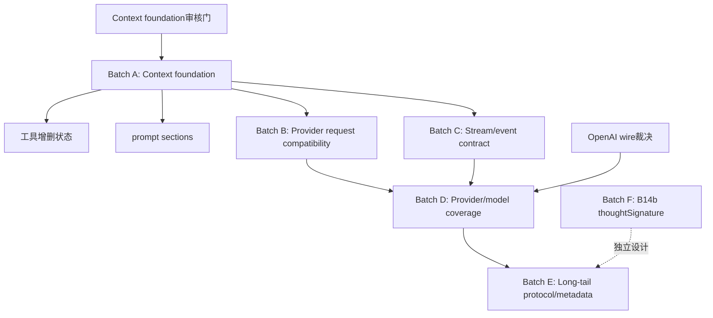

# 48 - pi-java-ai 下一步待做清单与设计入口

**状态：已批准；Batch A 已闭环 A1、A2 与包 B87/B88（2026-09-25–26）—— A3 已闭环（四条车道全部原生渲染，`原 docs/51 §12`）；A4 已闭环（prompt sections 构建/替换/差分 ＋ 生产接线，`原 docs/52 §12`，2026-09-26）；A-07 已闭环（`Model.compat` 的解析链、目录标注与已消费字段的生产者，`原 docs/53 §12`，2026-09-27）；A-01 已闭环（Anthropic 缓存断点 ＋ `cacheRetention` 选项通道 ＋ 压缩路径的 `none` 生产者，`原 docs/54 §12`，2026-09-27 —— **B89 结案**）—— 下一项＝ A-02/A-09/A-14。**2026-09-27：C 批次（终局事件载荷）设计稿已出 ⇒ [`原 docs/55`](55-c-terminal-event-payload-design.md)；同日按「R1–R9 全按建议」实施并闭环 ⇒ [`原 docs/55 §12`](55-c-terminal-event-payload-design.md)（`3684a82`/`b8d7e48`/`882fcaa` ＋ docs）**。**2026-09-27：B109（`stopReason` 词表偏差）已单独裁决为「对齐 pi」并闭环 ⇒ [`原 docs/56`](56-b109-stop-reason-vocabulary-design.md)（归一化停因 `"tool_use"`→`"toolUse"`；`原 docs/56 §12`）**。**2026-09-28：A-10（请求侧选项层与 `max_tokens`）已闭环 ⇒ [`原 docs/57 §12`](57-a10-request-options-max-tokens-design.md)（`7fc23d2`→`8d04fe1` ＋ docs）—— 核心是给 `maxTokens` 补上**生产者**（改前 Anthropic 发**自家发明的 `4096`**、其余五条车道**一个上限都不发**，台账 **B122**）；同批落模型级 `samplingParams`、顶层思考预算字段与 Responses 的 `max_output_tokens` 门（**新登记 B122–B128**）。⚠️ **下一项＝ A-09**（`compat.thinkingFormat`）—— 须复用 `SimpleOptions.clampedReasoningEffort`，**不要再接一次夹取**（`原 docs/57 §12.3` 的「归属前移」）**。**2026-09-28：A-09 设计稿已出 ⇒ [`原 docs/58`](58-a09-thinking-format-design.md)（`cbbcaeb`，**待审核；零行代码**）—— 设计期实测三处口径更正：是**十一种**形状（缺省 `openai` 也是一支，原台账写十种）；`openai-completions` 车道今天**一个思考字段都不发**（连缺省形状的 `reasoning_effort` 都没有）；探测与**目录**是两处来源（`moonshotai*`／`xiaomi*`／`qwen-token-plan*` 的目录值须经 `CatalogCompatRules.completions`，混进探测会吞掉用户 models.json 的显式值）**。**2026-09-29：A-09 已闭环 ⇒ [`原 docs/58 §12`](58-a09-thinking-format-design.md)（`2f8acb9`→`14a165e` ＋ docs）—— completions 车道从「一个思考字段都不发」到**十一形状全落**（`ThinkingFormatWriter` exhaustive switch）＋ `$var` 解析 ＋ 探测/目录/models.json 三处来源接通；⚠️ **两处设计结论被实测推翻**（`原 docs/58 §11`）：**R4 前提证伪** —— 夹取先行使显式 null 到不了写点 ⇒ 两派 null 语义在生产路径**语义等价**（探针零红＝变异体语义等价，「第五种成因」实锤）；**R11 的坑在 SDK 层** —— `JsonValue.from(map 含 null)` 被 NON_NULL inclusion **静默丢键** ⇒ `put` 必须经树（`SdkJsonEscapeHatchTest` 新探针双向钉住，升级 SDK 须重跑）；**新登记 B129–B133**（xiaomi 回放目录值／zai 数据漂移／ant-ling 穿透角＝裁决不改／不携带 provider 常量／openrouter 形状随 A-02）。
**2026-09-29：✅ A-02 已闭环** ⇒ [`原 docs/59 §12`](59-a02-openrouter-chat-lane-design.md)（`4f210e8`→`43926c0`，R1–R8 全按建议——双车道 openrouter chat provider＋`ModelInfo.api` per-model 派发通道（`extra["protocol"]` 首个生产写入者）＋`:batch` id 的 resolver 精确匹配先行；**B105／B133 结案**（completions anthropic 形 cache_control 三断点＋`prompt_cache_retention`／openrouter 思考形状生产可达）、`openRouterRouting` 落线、**B138 随包修**（provider 层四处丢 `authKind`）；新登 **B134–B137**（sessionId 消费面／错误 metadata.raw／per-model baseUrl／resolver glob）；计数 17→18（evals 用例同步）。⚠️ **下一项＝ A-14**（provider retry `x-should-retry`）／B103（sessionId 通道族；待裁决）**
**2026-09-30：✅ B103 已闭环（用户裁决方案 2）** ⇒ [`原 docs/61 §12`](61-b103-session-id-affinity-design.md)——`sessionId` 通道建成（StreamOptions＋DefaultProviders/AgentSession 接线）；体侧 `prompt_cache_key` 照落（码点截 64）；**升级 Anthropic SDK 2.52→2.66（零兼容破坏）**。⚠️ 官方 Java SDK streaming transport 不向用户透传任意头 ⇒ Anthropic/completions 的非标准亲和头登记为不可达差异 **B140**（responses 头透传）；ai 1195/1195 绿。
**2026-09-30：✅ A-14 已闭环** ⇒ [`原 docs/60 §12`](60-a14-provider-retry-design.md)（`16a9144`→`f09c400` 7 commits，R1–R8 全按建议）—— 七条 SDK 车道全 `.maxRetries(0)`＋初始请求包 `ProviderRetry`（判据/延迟/cap 照 pi），Mistral 的 RetryPolicy 补三头＋60s cap，DefaultProviders 硬编码 2 ⇒ settings ?? 链；实施期发现运行时 genai 1.72 内置 RetryInterceptor（attempts(1) 关闭）、并修复 3d 起嵌套 record JSON 序列化丢失的潜在 bug；新登 **B139**，J5 更新。ai 1182、coding-agent 287 全绿**
**2026-10-01：✅ B1 已闭环（Anthropic OAuth credential → request path）** ⇒ [`原 docs/63 §12`](63-b1-anthropic-oauth-request-path-design.md)（`4a869c9`，R1–R3 全按建议）—— stored OAuth 接上请求路径、Anthropic 订阅 token 走 **x-api-key（非 Bearer，照 pi `toAuth⇒{apiKey}`）**、5 分钟临期锁内单次刷新、失败不回落 env；台账 **B82 结案**（B81 系统提示前缀/工具名仍开，属 A-15）。ai **1208**、coding-agent **287** 全绿。
**2026-10-02：✅ B2 已闭环（ContextOverflow z.ai/Cerebras 门控）** ⇒ [`原 docs/64 §12`](64-b2-context-overflow-zai-cerebras-gating-design.md)（`0d41f94`，R1–R3 全按建议）—— 首正则补 z.ai 无 is 形态（生产可达真漏检）、Cerebras bodyless 判据移出通用列表改 provider 门控分支（消过宽误判）；RED 6 红、两变异各恰 3 红；新登 **B141**（openai-java bodyless 文案 `400: Unknown` ⇒ Cerebras 正向不可达、门控照 pi 保留）。ai **1215**、agent-core **525** 全绿。
**2026-10-02：✅ D3 已闭环（OpenAI 默认 Responses wire）** ⇒ [`原 docs/62 §12`](62-d3-openai-default-responses-wire-design.md)（`af2eaa9`，9 files +337/−34）—— 复合 id 链先行：接收存 `call_id|item.id`、重放拆分（output 只用 call_id、function_call 恢复真实 item.id、跨模型/非 fc_ 丢 id）、默认协议最后翻 responses；RED 6 红、M1/M2/M3 各恰 1 红；**2026-10-02：✅ D-P1 已闭环（models.json 对现有 provider 的覆盖合并）** ⇒ [`原 docs/65 §12`](65-d-models-json-existing-provider-override-design.md)（`cbe1f76`，15 files +1271/−256）—— provider 级 baseUrl/compat/headers 叠加每个内置模型 → models[] upsert（R1 api 继承）→ modelOverrides 最后逐字段覆盖；headers 经 client-builder default headers 出站、**streaming 实测生效**（R2）；拆 733 行的 ModelsJsonConfig 为 Config(330)/Compat(431)/Merge(256)。**B102、B136 结案**，闸门 76；ai **1231**、coding-agent **290** 全绿**
**2026-10-02：✅ E json_schema strict constrained sampling 已闭环** ⇒ [`原 docs/66 §12`](66-e-constrained-sampling-json-schema-design.md)（`5606ec9`＋`20737c1`）—— sealed ConstrainedSampling＋StrictJsonSchema 转换器＋五车道（completions/responses/azure/anthropic/google/mistral）schema 转换与 strict 标志；anthropic/openai 目录无条件标注；read/bash/edit/write 默认 strict-prefer；旧测试更新 4 处；M1–M5 全命中。ai **1259**、agent-core **528**、coding-agent **290** 全绿；闸门仍 76**
**2026-10-02：✅ A-20 无生产者代码清理已闭环** ⇒ [`原 docs/68 §12`](68-a20-no-producer-cleanup-design.md)（`78aee75`→`de0ce06`，R1–R7 全按建议）—— 删 `UsageInfo.from`、RetryPolicy 六预设、`StreamSimple`/`ContextEstimator`、`HarnessConfig.retryPolicy` 死分量；**PiHttpClient 默认零重试**（pi-messages 对齐单次 fetch，唯一行为修复，M1 恰 1 红）；`supported/clamp`、ToolResult `details` 旧登记翻案为已接线/有生产者；DeferredHandle、toolResult.usage 留形状不接线。**B112、B15-残留-9 结案，B111 维持**，新登 **B142**（8 车道 clamp 待对齐）。ai **1285**、agent-core **526**、coding-agent **290** 全绿；下一项＝ grammar/metadata（见 §5）**
**2026-10-02：✅ Batch F 已闭环（thoughtSignature／加密推理往返与跨模型剥离）** ⇒ [`原 docs/67 §12`](67-f-thought-signature-design.md)（`648edfd`→`516517a`，R1–R9 全按建议）—— Google 签名采集（text/thinking/functionCall）与同身份/base64 重放门、Responses include＋reasoning item 序列化＋Azure 回填、Completions reasoning_details 结构化采集/重放＋legacy 路径、跨模型剥离＋PiMessages 透传；converter 512→496，另抽 ToolArgumentParser。**B14b/R1、B19 结案**；M1–M9 全命中（M1 实 4、M9 实 2 红）。ai **1284**、agent-core **535**、coding-agent **290** 全绿；下一项＝ grammar/metadata/无生产者清理（见 §5）**
**2026-10-03：✅ E grammar/JsonObject 已闭环** ⇒ [`原 docs/69 §12`](69-grammar-json-object-design.md)（`9fe8c01`→`f05d772`＋`c7d0b7a`）—— GrammarSampling 变体＋两车道 custom 出站/回放（输入净化）/入站重组（GrammarInputBuffer），grammar 能力位与 models.json 通道；**JsonObject 零代码结案**（编译期约束等价）。无内置生产者（扩展-only）。M1–M4 全命中（红集 1/12/2/2）。ai **1313** 全绿；processor 424→378、converter 493→492**
**2026-10-03：✅ D「内置模型目录运行时覆盖/重生成机制」已闭环** ⇒ [`原 docs/70 §12`](70-remote-catalog-design.md)（`fcff3a6`→`711d898`，R1–R8 全按建议）—— **pi wire DTO**（`RemoteModelWire`/`RemoteCostWire`，未知字段忽略）＋ **单文件 `models-store.json`**（Record keyed by provider，取代每 provider 一文件）＋ **Provider 动态协议**（`getModels`/`refreshModels` 两个 default，零破坏）＋ **`RemoteCatalogProvider`**（离线恢复⇒TTL⇒条件 GET⇒304/404/501/transient/200 全分支 ＋ generatedAt 守卫）＋ **世代协调器与两阶段编排**（先全部离线恢复、再全部联网；持久化先落、世代检查后判）＋ **RPC 后台刷新**（`--offline`／`PI_OFFLINE` 门控）＋ 装配层包装（models.json 合并在内层）。⚠️ **三处实测推翻设计稿**：① **R4 前提证伪** —— `CatalogPublisher` 有真 CLI 生产者（`pi-ai catalog publish`），故 PUT 及其类**不删**，只删孤儿 `RemoteCatalog`/`CatalogRefreshResult`（**B143**）；② **404 的同调用内 overlay 语义**（只 persist 不带 update ⇒ 本次调用 overlay 仍是离线相恢复的那份，「空」是**下一次**的效果）；③ **步骤 3+4 与 5 的 RED 没取到**（夹具写在实现之后 ⇒ 首跑 4 红全是夹具错、步骤 5 零红），改由 M1–M6 变异补证。**新登记 B143–B145**（自创 catalog CLI 面／既有 `StrictSampling` spotbugs 项让全 reactor `verify` **今天物理上跑不绿**／TUI 定向刷新未接线）。ai 1318（cleanup 后 1312）、coding-agent 307⇒**319**；checkstyle 0 新违规
**2026-10-03：✅ E「模型/消息 metadata 对齐」已闭环** ⇒ [`原 docs/71 §12`](71-metadata-alignment-design.md)（`26cbb42`→（§12.1），R1–R7 全按建议）—— 这是 §5 清单的**最后一项**，闭环后本表**再无 `⬜`**。要点：18 个字段逐条核到 pi 的 `file:line` ⇒ **8 项早已落**（前面各包顺带做的）、3 项半落、7 项缺失；本包收尾三条 —— ① `UserMessage`/`ToolResultMessage` 补**消息级 `timestamp`**（pi 四变体皆必填，本仓只有两个有；连带 `Estimate` 的时间守卫对 user/tool 从此生效）；② Responses 车道 `textSignature` **双向接线**（`TextSignatureV1` 编解码 ＋ id 链：一文本块一条 output message、超 64 字符走 `shortHash`、`phase` 随签名回放）；③ 同车道 `done` 的 **refusal 权威内容合并** ＋ `phase=final_answer ⇒ stop`。⚠️ **两条设计期实测推翻**：**合成 user 消息取 entry 自己的时间戳**（pi `messages.ts:141-160` 的 `timestamp: m.timestamp`），不是设计稿写的 `now()` —— 只有活提示词与摘要请求用 `Date.now()`；**G4 只在 `text_end` 的 `partial` 上可观察**（pi `:590` 的终局映射会覆盖，两侧同形）。⚠️ **一个既有夹具翻了期望值**：`OpenAIResponsesSurrogateSanitizeTest` 原先断言两个文本块**拼接**成 `"AB"` —— 那是本仓的形状，pi 一直是「一块一条」⇒ 拼接才是偏差，夹具改为反向禁止。**新登 B147/B148**（Responses item 分组 vs 块序／`responseModel`+`diagnostics` 的移植条件），**B23 收窄结案**；`promptCache`＋CacheWarmer、`error.metadata.raw`（B135）、`metadata`/`user_id` 三块**另立包**。全 reactor `mvn -o clean test` **14/14 SUCCESS**；ai 1312⇒**1344**、agent-core 527⇒**534**
> ⚠️ 本行是**活状态**，每包闭环后须回填（§9 步骤 7）。
**创建基准：** pi-java `f0400a2`（B14 收尾）  
**参考台账：** [`41-gap-inventory.md`](41-gap-inventory.md)、[`32-open-items-register.md`](32-open-items-register.md)、[`40-module-alignment-map.md`](40-module-alignment-map.md)  
**参考设计：** [`03-detailed-design.md`](03-detailed-design.md)、[`42-usage-domain-design.md`](42-usage-domain-design.md)、[`43-ai-hardfail-credentials-design.md`](43-ai-hardfail-credentials-design.md)、[`44-ai-image-content-design.md`](44-ai-image-content-design.md)、[`45-google-tool-result-design.md`](45-google-tool-result-design.md)、[`46-ai-extended-thinking-design.md`](46-ai-extended-thinking-design.md)、[`47-ai-transform-messages-rest-design.md`](47-ai-transform-messages-rest-design.md)

> 设计审核已通过；当前只允许按第 5 节逐项实施并回填证据，未完成任务不得标记为已完成。

---

## 1. 当前基线与范围

### 1.1 已完成、从本清单排除

以下功能在 `f0400a2` 前已完成，不得作为新任务重复开启：

- H1：usage、cache usage、cost、reasoning 生产链路；
- A0：Unicode sanitize、retryable error 扩展、凭证优先级、Anthropic Bearer/OAuth token 识别与鉴权头分派；
- H2：主流图片内容路径；
- B84：Google tool-result 路径的已核实结论；
- H5：extended thinking 块采集、落盘和回读；
- B14：图片降级、跨模型 tool-call ID normalization、orphan tool-result synthesis；
- B14：五类 ID normalizer 的六车道生产接线和四个 pi oracle。

### 1.2 B14 明确保留的差异

这些项目已在 `原 docs/47-ai-transform-messages-rest-design.md` 登记，不应被误报为 B14③④失败：

- B14b/R1：`thoughtSignature` 完整往返与剥离；
- R2：Java `UserMessage` / `ToolResultMessage` 没有 pi 对应的 timestamp 字段；
- R3：Responses composite tool-call ID 的部分生产来源不可达；
- R4：Responses 流程丢失 pi 的 `item.id` 会话迁移语义；
- R5：Java 当前没有独立 `SystemMessage` / `heldSystemMessages` 机制。

B14b/R1 单独列为 Batch F；R2/R3/R4 作为已知差异保留，除非后续设计包明确重新裁决。

### 1.3 统计口径

`docs/07-gap-inventory.md` 的总体数字和部分旧快照尚未因 H1/A0/H2/H5/B84/B14 完成而重新计算。当前排期以逐项行为证据为准，不使用旧百分比推导完成度。native-image 未验证、TUI 临时 JSONL 环境失败和历史并发 Maven `target` 竞争属于质量/环境记录，不混入功能任务。

---

## 2. 用户可观察缺口矩阵

| 编号 | 功能 | 优先级 | 用户可观察后果 | 当前 Java 现状/证据 | 依赖批次 | 设计包 |
|---|---|---:|---|---|---|---|
| A-01 | Anthropic `cache_control` | P0 | Anthropic prompt caching 无法按 pi 标记缓存区段，成本和延迟表现不一致 | `AnthropicRequestBuilder` / `AnthropicMessageConverter` 无 Anthropic `cache_control` 生产命中；`docs/07:54` | B | 无 |
| ~~A-02~~ | OpenRouter chat provider（双车道）＋per-model api 派发；吸收 B105/B133/openRouterRouting（[`原 docs/59 §12`](59-a02-openrouter-chat-lane-design.md)，2026-09-29） | P0 | 原后果：OpenRouter 只有 images 面，主流 7 家之一整条不可用 | `ProviderCatalog` 17→18（evals 计数同步 Eighteen）；新登 B134–B137、B138 随包修 | — | `原 docs/59`（设计＋闭环） |
| A-03 | 统一 transcript/context 模型 | P0 | 缺少中途系统提示变化、工具变化和统一 provider context normalization | `Message` 只有 user/assistant/toolResult；`Context`/`StreamRequest` 分离 systemPrompt、messages、tools；`docs/07:56-58` | A | 无；挂靠 B14 R5 |
| A-04 | OpenAI 默认 wire 裁决 | P0 | pi 的 `openai` 默认走 Responses，Java 默认走 Completions，协议能力和会话语义不同 | `OpenAIProvider` 默认路由；`docs/07:101` | D | 无 |
| A-05 | ~~`done` / `error` 终局事件载荷~~ | P0 | ✅ **已闭环**（[`原 docs/55 §12`](55-c-terminal-event-payload-design.md)，2026-09-27，`3684a82`/`b8d7e48`/`882fcaa`）：终局载荷＝**落定后的累加器**（单工厂 ＋ 三落点；`err.error()` 读点 6⇒1）；顺带修真缺陷两条（缺终局被报成成功、`send()` 吞错）。原后果：下游拿不到与 pi 等价的最终 assistant/error message —— `error.partial` 是**空**的（流到故障点的内容全丢）、错误文本只在 Throwable 上、宿主线还把 `stackTrace` 发上对外协议 | C | [`原 docs/55`](55-c-terminal-event-payload-design.md) |
| A-06 | xAI provider | P1 | xAI 普通 provider 端点不可用 | 当前仅 OAuth/provider error 相关痕迹，无 xAI provider 注册；`docs/07:63-64` | D | 无 |
| A-07 | `Model.compat` 扩展 | P1 | provider 无法依据模型能力决定 store、max-token 字段、developer role、缓存、会话亲和性和中途变化 | `ModelCompat` 当前只有少量已消费字段；`docs/07:67-68` | B/D | 无 |
| A-08 | 内置模型目录覆盖 | P1 | 大量模型退化为 `ModelInfo.minimal`，模型能力和价格不完整 | 当前内置目录为手写/有限覆盖；`docs/07:68-69` | D | 无 |
| A-09 | ~~非 Anthropic `thinkingFormat`~~ | P1 | ✅ **已闭环**（[`原 docs/58 §12`](58-a09-thinking-format-design.md)，2026-09-29，`2f8acb9`→`14a165e`）：**十一种**形状全落（含无生成数据生产者的 `chat-template`/`qwen-chat-template`/`string-thinking`，models.json 是唯一入口）＋ `$var` 解析 ＋ 探测（`isGrok`）与目录标注；改前 completions 车道**一个思考字段都不发**。⚠️ 两处设计结论被实测推翻（R4 两派 null 语义＝语义等价；R11 的坑在 SDK 的 `JsonValue.from` 丢 null ⇒ `put` 经树）；新登记 **B129–B133** | `ThinkingFormatWriter` 十一臂 exhaustive switch；`docs/07:75` 已划行 | B | `原 docs/58` |
| A-10 | ~~`simple-options`~~ | P1 | ✅ **已闭环**（[`原 docs/57 §12`](57-a10-request-options-max-tokens-design.md)，2026-09-28，`7fc23d2`→`8d04fe1`）：`maxTokens` 补上**生产者**（缺席 ⇒ 模型上限）＋ 夹到 `窗口 − 估算 − 4096`（`SimpleOptions` ＋ `ai/utils/Estimate`），落点在唯一漏斗 `AbstractChatApi.stream`（`PiMessagesApi`／`FauxChatApi` 豁免）；三条 OpenAI 兼容车道另得模型级 `samplingParams`（body 最后）与顶层思考预算字段；Responses 的 `max_output_tokens` 带 `supportsMaxOutputTokens` 门（**只有 openai-responses 读它**）。⚠️ **原后果行的描述低估了缺口**：真因是 `maxTokens` **在生产上没有任何生产者** ⇒ Anthropic 发**自家发明的 `4096`**、其余五条车道**一个上限都不发**（台账 **B122**）。`ai` 996 ⇒ 1058 | B | [`原 docs/57`](57-a10-request-options-max-tokens-design.md) |
| A-11 | 工具状态增量 | P1 | 会话中途增删工具无法表达 | `Entry.ActiveToolsChange` 有形状但生产发射/归一化未闭环；`Context.tools` 目前整体替换；`docs/07:77` | A | 无 |
| A-12 | prompt `sections` | P1 | 无法按分段替换、比较或诊断系统提示词 | `SystemPromptBuilder` 仍输出单一字符串；`docs/07:78-79` | A | 无 |
| A-13 | `ContextOverflow` provider 门控 | P1 | z.ai 错误可能匹配不到，Cerebras 规则可能误命中其他 provider | `ContextOverflow` 仍是旧匹配/门控；`docs/07:79-80` | B | 无 |
| ✅ A-14 | provider retry `x-should-retry` | P1 | — | **已闭环（2026-09-30，`原 docs/60 §12`）**：SDK 车道 maxRetries(0)＋ProviderRetry wrap、Mistral 三头＋cap、settings 消费链接通 | B | B139 |
| A-15 | Anthropic OAuth 请求分支 | P1 | OAuth token 可识别/发头，但 OAuth 专用请求语义未完整进入 Anthropic 请求路径 | OAuth flow 主要由 `AuthCommand` 使用；system prompt 前缀和工具名转换未完整移植；`docs/07:69-70,156-157` | B | `原 docs/43` 部分覆盖鉴权基础 |
| A-16 | `models.json` provider/protocol/baseUrl 覆盖 | P1 | 自定义 provider 的 per-model 协议/URL 形状不完整，CLI base URL 可能被固定值覆盖 | `ModelsJsonSchema` 有字段但 `ModelsJsonConfig`/`ModelsJsonProvider` 消费不完整；`docs/07:108-109,262` | D | 无 |
| A-17 | 低频 provider wire | P2 | Bedrock、Vertex、Codex、Cloudflare 等特定 provider 不可用 | `Protocol` 无对应完整适配器；`docs/07:84-90` | E | 无 |
| A-18 | 模型/消息元数据长尾 | P2 | provider 能力、缓存和消息诊断信息表达不完整 | `namespace`、`textSignature`、`Model.input`、`ThinkingLevel.max`、Images registry、prompt cache metadata、Mistral compat、assistant 扩展字段等缺口 | E/F | 无；R1 单独 |
| A-19 | 低频协议能力 | P2 | grammar、transport、session resources、严格 JSON object 约束等能力缺失 | 当前生产路径零命中或未统一；`docs/07:89-90` | E | ~~grammar 已落 原 docs/69~~；transport/resources 仍 codex 独占 |
| A-20 | ~~死码/无生产者清理~~ | P2 | ✅ **已闭环**（[`原 docs/68 §12`](68-a20-no-producer-cleanup-design.md)，2026-10-02，`78aee75..de0ce06`）：删 UsageInfo.from/RetryPolicy 六预设/StreamSimple/ContextEstimator/HarnessConfig.retryPolicy，PiHttpClient 默认零重试；supported/clamp 与 details 翻案为有生产面；B112 结案、B111 维持、新登 B142 | `docs/07 §1.5` 已逐条标注 | —— | `原 docs/68` |
| A-21 | B14b/R1 `thoughtSignature` | P2/独立裁决 | Google thought signature 无法完成真实往返/剥离 | Java 当前结构没有对应字段；`原 docs/47` B14b/R1 | F | 无；必须单独设计 |

---

## 3. 批次边界与依赖图



### Batch A — Context foundation

共同基础：`SystemMessage`/系统上下文表达、`TranscriptContext`、`normalizeContext`、工具增删事件和 prompt sections。必须先解决数据形状和 entry/transcript 投影，再让 provider 消费；不得先在单个 provider 中添加不可复用的特例。

### Batch B — Provider request compatibility

包括 Anthropic `cache_control`、`Model.compat`、thinking format、simple-options、retry header/provider retry、Anthropic OAuth 请求分支。涉及请求接口、模型元数据或鉴权链时必须先通过设计审核门。

### Batch C — Stream/event contract

统一 `done`/`error` 终局事件的载荷契约，检查 provider stream、agent 消费者、RPC/JSON 序列化和既有 pattern matching 的兼容性。

### Batch D — Default wire

只含 OpenAI 默认 Responses/Completions wire 裁决与已落地的 OpenRouter chat。OpenAI 默认 wire 不能以改常量代替设计；必须先处理 Responses `item.id`/composite ID 与模型 compat 关系。

> ⚠️ **2026-09-30 完工边界裁决（用户）＋归属复核**：**「重构对齐」与「新 provider 接入」严格分开。**
> - 纯「新 provider 接入」（xAI／Bedrock／Vertex／Codex／Cloudflare 的接入）**删除、不进对齐分母**。
> - **现有车道主流可达的对齐项全部保留**：近期三项核心原列 D3 → B1 → B2 —— ✅ **三项全部闭环**（D3：2026-10-02 `原 docs/62`；B1：2026-10-01 `原 docs/63`；B2：2026-10-02 `原 docs/64`），现剩余项为 metadata／grammar／thoughtSignature／models.json 覆盖／目录机制等现有车道对齐项（见 §5）。
> - 判据＝R5 主流可达性：现有 openai/anthropic/google 车道在 bin pi → main 这条线上会发生的就算对齐；只有新增当前不存在的 provider 后才发生的才算接入、删除。

---

## 4. 设计审核门（实施前必须裁决）

以下问题没有裁决前，不得进入对应代码任务：

1. **Context 形状**：恢复独立 `Message.SystemMessage`，还是继续保留 `Context.systemPrompt` 并新增 `TranscriptContext`/分段模型？必须覆盖 entry 回放、provider 转换和 JSONL 兼容。
2. **工具增量**：`ActiveToolsChange` 如何投影为统一 transcript 语义，Anthropic `tool_addition`/`tool_removal` 与其他 provider 如何表达？
3. **prompt sections**：sections 是持久化 entry、仅构建期结构，还是两者分离？替换/差分的稳定 ID 如何定义？
4. **Anthropic cache control**：缓存边界是 system、tools、历史消息还是按模型 compat 选择；如何避免对不支持模型发出不兼容字段？
5. **终局事件**：`done`/`error` 是否扩展现有 sealed record，是否保留旧访问器；完整 assistant message 如何避免重复构造和不一致？
6. **OpenAI 默认 wire**：默认 Responses 与显式 Completions 的覆盖优先级；哪些模型/配置仍强制 Completions；OpenAI 与 Azure 的 `apiName`/item identity 差异。
7. **Model.compat**：字段默认值、`models.json` 反序列化、内置目录来源，以及每个字段的实际 request consumer。
8. **Maven 依赖**：任何新增或移除依赖必须先回写本文件并重新审核。

---

## 5. 实施任务表

> ⚠️ 本表**只列需求对齐项**（2026-09-30 裁决＋归属复核）：纯「新 provider 接入」任务已删除（xai／bedrock／vertex／codex／cloudflare 接入）；现有车道主流可达的对齐项全部保留（含 metadata、grammar、thoughtSignature、models.json 覆盖、目录机制等）。各粗行备注里标出了该行内被排除的「新 provider 独占」子项。

状态定义：`⬜ 待开始` / `📐 设计待审核` / `🔴 先红` / `🟡 实施中` / `🟢 已完成` / `⛔ 阻塞`。

| 批次 | 任务 | 优先级 | 依赖 | 状态 | Commit | 先红证据 | mutation probe/红集 | 回归证据 | 遗留 |
|---|---|---:|---|---|---|---|---|---|---|
| A | Context/Transcript 数据模型与 entry 投影设计落地 | P0 | 设计门1 | 🟢 已完成 | `f94d221..3491543`（Task 1）、`9065ec6`（全仓 sealed-switch 编译适配）、`7adea0d`（便捷构造器对齐设计）、`1956d6d`（Task 3：entry 投影＋session JSON）、`dc5ba44`（review 修复：≤500 行门禁＋显式 `case`＋删同义反复断言） | Task 1：`TranscriptContextTest` 编译失败（缺 `Message.SystemMessage`/`ToolReference`/`TranscriptContext`）；Task 3：`SessionJsonSystemMessageTest` 2 error（`timestamp`/可选字段键缺席）。Task 3 的 entry 投影测试**先红不成立**（`project` 已原样透传载荷）——按计划 §Execution Notes 记为结构性 RED 例外，改由 JSON 侧 mutation 守门 | M1 关掉前导插入 ⇒ 恰 1 红 `ContextNormalizerTest.prependsLegacySystemPromptAndCopiesTools:35`；M2 去掉 `SystemMessage.toolsAdded` 的 `List.copyOf` ⇒ 恰 1 红 `TranscriptContextTest.systemMessageAndTranscriptContextDefensivelyCopyCollections:54`；M3 关掉 `SessionJson` 的 system 分支 ⇒ 恰 2 红（`…WritesRoleContentAndTimestamp:51`、`…WritesNonEmptyOptionalFieldsUnderPiNames:66`）；M4 去掉「空值省略」门 ⇒ 恰 2 红（`…OmitsAbsentTimestamp:87`、`…WritesRoleContentAndTimestamp:54`）；M5 去掉重复守卫 ⇒ 恰 1 红 `…preservesExistingLeadingSystemMessageWithoutInjectingLegacyFields:56` | focused：`ContextNormalizerTest` 4/4、`TranscriptContextTest` 3/3、`MessageTest` 16/16、`ContentBlockJsonTest` 2/2；agent-core focused：`ContextEntriesTest` 17/17、`SessionJsonSystemMessageTest` 4/4、`JsonlSessionStorageTest` 11/11；模块回归 ai 819/819、agent-core 484/484；checkstyle 0 violations、`git diff --check` clean、无 `System.out.println`、改动文件均 ≤500 行 | 见 §10.3 遗留清单（`MessageJsonCodec` 回读、`toolsAdded` 线格形状、`sections` null 语义、TUI/web 无系统消息处理） |
| A | `normalizeContext` 与 provider 消费迁移 | P0 | A1 | 🟢 已完成 | `c1c8bf6`/`dc5ba44`（normalizer，A1 期）＋ **A2 迁移**：`7647097`（A2a helpers）· `3576bc3`（A2b ＋ R5）· `01cb866`（A2c PiMessages 线形状）· 文档 `6c74f18`/`52eeab2`（`原 docs/49 §12`） | A2a：新类型全部「找不到符号」（编译失败）；A2b：**stash 实现 ＋ 旧代码复跑** ⇒ 11/11 红（4 处 `IllegalStateException: unreachable message role` ＋ 7 处「桩零请求 ⇒ 线格解析 NPE」）；A2c：同法 2/2 红（失败信息里打出的旧体逐字在 `原 docs/49 §12.4`） | A2a：M6 ⇒ 3 红、M9 ⇒ 恰 1 红、M-TOOLS ⇒ 恰 1 红、M10 ⇒ 恰 1 红；A2b：M1 ⇒ 恰 2 红、M3 ⇒ 恰 2 红、**M5 ⇒ 零红**（可达输入下不可观察，`原 docs/49 §12.2-2`）；A2c：— | focused 全绿（`TranscriptsTest` 9 / `MessageTextsTest` 7 / `OrphanToolResultsHeldSystemMessageTest` 4 / `LaneTranscriptSourceTest` 7 / `PiMessagesRequestShapeTest` 2）；ai 819⇒**849**、agent-core 484、checkstyle 0 新违规、全 reactor `mvn clean verify` **SUCCESS**（14/14、7:08） | 两处计划被实测推翻（**R5 前移为 A2b 的前置条件**；M5 零红）；新登记 **B88**（Responses 带工具硬故障）/**B89**/**B90**；B87 **①仍开**（回读，见 `原 docs/50`）、②待收敛；四条非 Anthropic 车道的 pi 侧探针仍未补（`原 docs/49 §12.6-3`） |
| — | **包 B87/B88**（系统消息回读 ＋ Responses 车道工具声明）—— 设计见 `原 docs/50` | P0 | A1/A2 收尾 | 🟢 已完成 | `47e7f57`（B88）· `9f86e8c`（B87a 回读）· `6275f13`（B87b 落线收敛）· 文档 `0df2e54` ＋ 本行回填（`原 docs/50 §12`） | B88：新夹具 2/2 失败（`` `strict` is required, but was not set ``，桩零请求）；B87a/B87b：两个实现同时 stash ⇒ 读侧 6 error `has unknown message role` ＋ 1 failure、写侧 1 failure（键集 7 个） | B88：M1 ⇒ 恰 1 红（azure）、M2 ⇒ 恰 1 红（openai）；B87a：M3 ⇒ **4 红**（设计稿预测 1，校验随 helper 一起消失）、M4 ⇒ 恰 1 红；B87b：M5/M6 各 **2 红**（1 ＋ 1，两个写者各一，跨模块分两次跑） | ai 849⇒**851**、agent-core 484⇒**494**，全绿；checkstyle 0 新违规；全 reactor `mvn clean verify` **SUCCESS**（14/14、7:14） | 设计稿 §9 的 R1–R6 全按建议；实现偏离一处（`toToolDeclaration` 返 record 而非 `LinkedHashMap`）；连带面：五处**反射**夹具随签名改直调（21 个运行期 `NoSuchMethod`）；`constrainedSampling`/grammar 工具仍缺（L-A）；B87③/④ 分别归 A4/宿主面 |
| A | 工具增删状态线与 `tool_addition/removal` | P1 | A1/A2 | 🟢 | `bef15fa` `8a0f67c` `1700985` `f6665ec` `c59db5a` ＋ docs `61d0178` `3a088b1` | 先红：A3a 编译失败；A3b `git stash` ＋ pi 金标 ⇒ **10 红**；A3c 逐车道 `git stash` ⇒ Responses **4 红**、Anthropic **5 红**、Completions **3 红**（全部是「请求没有真的发出去」） | M1–M5 各 1–5 红 · M6–M11 各 1–5 红 · N1–N5 各 1–3 红 · A1–A5 各 1 红 · C1–C4 各 1–2 红 | ai 866⇒886、agent-core 494⇒505、conformance 15/15（金标已重生成为 pi `3390bd936` 的真实行为） | ⚠️ 实施中推翻过一处设计结论：Anthropic 与 Completions 一度被登记为「SDK 表达不了」（`原 docs/51 §3 F13` 初版、`docs/05` B92/B93），**实测两条 SDK 都有原始 JSON 直通** ⇒ 已落地并撤销登记（`原 docs/51 §12.4.1`）。四条车道的原生渲染在 A7 接线前仍**只有测试可达**（F5/F6）|
| A | prompt sections 构建、替换和差分 | P1 | A1 | 🟢 已完成（`原 docs/52 §12`） | `92a4b99`（A4a 删除态）· `fc1404e`/`032de6d`（A4b 机制＋替换旧 builder）· `40bb3ea`/`e7c68cc`（A4c 生产者＋接线） | A4a：新夹具 **9 跑 8 红**（`NullPointerException: section value`，形状门在上游故红集不分叉）；A4b/A4c：新增的 `NON_NULL` 落线陷阱与「每轮刷新 context.tools」各由**新夹具先红**（后者 2 红、前者 1 红，见 §12） | M1 ⇒ 10 红 · M2 ⇒ 2 红 · M3 ⇒ 4 红 · M4 ⇒ 3 红 · M5 ⇒ 2 红 · M6 ⇒ 2 红 · B1 ⇒ 4 红 · B2–B5 各 1 红 · C1 ⇒ 2 红 · C2 ⇒ 3 红 · C3 ⇒ 3 红 · C4 ⇒ 1 红 · C5 ⇒ 5 红 | 全 reactor `mvn -o test` SUCCESS；`ai` 886⇒893、`agent-core` 504⇒519、`coding-agent` 272；checkstyle 0 新违规 | R1–R7 全按建议；⚠️ **探针自身出过两次假零红**（子串式落地检查、`perl -0pi` 不带 `/g`），且 **C4 的零红是夹具盲区而非探针问题**（补「同 run 内切工具」后恰 1 红）——三条新教训见 `原 docs/52 §12.5`；新登记 **B94**（内置工具无 `promptSnippet`）/ **B95**（`docs` 段无生产者）/ **B96**（录制格式扩字段）；`ensureInitialDeclaration` 与 `ToolChangeDeclaration.initialDeclaration` 按 R4 **删除**（`原 docs/51` F11 更正）；`AgentHarness` 514⇒523、`PiLaneSink` 533⇒556（存量超限各增 9/23 行，未拆） |
| B | Anthropic `cache_control` | P0 | A1、设计门4 | 🟢 已完成（`原 docs/54 §12`） | `8356ff8`（A1a 解析层）· `c7ee45b`（A1b 三处落点 ＋ A1c 选项通道与压缩生产者） | **4 处既有断言**实测红（`AnthropicToolChangesWireTest:92/:214`＋`LaneTranscriptSourceTest:59/:155` 的 `body.path("system").asText()` 在块形态下返回 `""`）—— ⚠️ 设计稿曾断言「零既有守门」，实测推翻（只 grep 了 SDK 访问器、漏了 JSON 层，见 `原 docs/54 §12.3`）；A1a 为编译失败先红 | A1a：long 门恒真⇒1 · `none` 不生效⇒2 · 两个缺省写 false⇒5 · `parse` 塌成 SHORT⇒1 · env 比较宽松化⇒1；A1b/A1c：system 断点⇒8 · 工具断点⇒8 · 消息断点⇒7 · **判定移到 flush 之前⇒1** · 工具门恒真⇒1 · long 门恒真⇒2 · 通道恒空⇒1 · 摘要不发 `none`⇒1（⚠️ 前三条首跑**零红**是 CRLF 让变异没落地，第 5 次） | 全 reactor `mvn -o test` **SUCCESS**（14/14）；`ai` 942⇒**977**、agent-core 519⇒**520**、coding-agent 272⇒**274**；**conformance 20/20 仍绿**；checkstyle 0 新违规 | R1–R8 全按建议；⚠️ **B89 随本包结案**（顶层 `system` 无条件改块数组，pi 在 `none` 时也是块）；实施偏离两处（R2 位置改 `catalog` 以免包环；原 M4 不可表达，换成 M4' 顺序变异）＋两处夹具期望值按实测改写；三处方法论教训见 `原 docs/54 §12.8`（**取证面要覆盖全部观测口径**、CRLF 第 5 次、`writeValueAsString(MessageCreateParams)` 得 `{}` ⇒ 观测面必须用 `RecordingHttpServer`）；新登记 **B103–B108**；未覆盖：`System.getenv(PI_CACHE_RETENTION)` 那一跳无可替换夹具 |
| B | `Model.compat` 字段、JSON 映射与 request consumers | P1 | 设计门7 | 🟢 已完成（`原 docs/53 §12`） | `9eee9f8`（A7a 解析层）· `22bde33`（A7b 目录标注 ＋ models.json 面）· `3770fd3`（A7c 车道接线）· `3d7898e`（收口：最后一处直接读点） | A7a/A7b/A7c 均**编译失败**先红（新类／签名变更）；行为先红见 mutation 列（M1/M3/M4/M5c/M6/M7/M8 的红集就是「旧行为」） | M1⇒1 · **M2⇒0**（`forceAdaptiveThinking` 是二态常量字段，解析层贡献恒等于原值 ⇒ 形状改动非行为改动）· M3⇒2 · M4⇒1 · **M5⇒0**（`A && B ;` 被折叠成原条件 = **假变异**，与 A4 的 `\|\| false` 同型）· M5c⇒1 · M6⇒2 · M7⇒7 · M8⇒2 | 全 reactor `mvn -o test` **SUCCESS**（14/14）；`ai` 893⇒**942**、agent-core 519、coding-agent 272、conformance **15/15 仍绿**；checkstyle 0 新违规 | R1–R8 全按建议；⚠️ **「零红」新增第四种成因**（变异体语义等价，M2）＋**「假变异」第 2 次兑现**（M5）＋ CRLF 第 4 次（多行模式）——三条见 `原 docs/53 §12.7`；新登记 **B97**（内置目录三个 id 与 pi 不匹配，归 A-08）/ **B98**（零消费者的 compat 字段清单）/ **B99**（`supportsMidConvoEffort` 半可移植）/ **B100**（探测只认 `model.baseUrl` 的偏差）/ **B101**（F5/F6 结案）/ **B102**（缺 `modelOverrides` 与 provider 级 compat 两条覆盖路径，归 A-16）；**两处存量超限**（`MistralConversationsApi` 508⇒512、`ResponsesMessageConverter` 544⇒545，A7c **之前**即已超限）未拆 |
| B | 非 Anthropic `thinkingFormat` | P1 | B2 | 🟢 已完成（`原 docs/58 §12`） | `cbbcaeb`（设计）· `2f8acb9`（四字段能进能解析＋目录常量）· `a063d9e`（openai 臂＋R5＋预算上提）· `80128f4`（zai/qwen/deepseek/ant-ling）· `9c249ef`（together/openrouter/string-thinking）· `14a165e`（`$var`＋模板三臂＋R11 树路） | 目录标注**恰 3 红**（moonshotai/xiaomi/qwen-token-plan-cn）；openai 段 5 红（3 负对照空绿）；R5 双写 **1 红**（`expected 1 but was 2`）；四臂 10 红＋2 空绿；三臂 6 红；模板段 8 红＋1 空绿 —— ⚠️ §7 的「全红」预测不精确：**负断言在零实现下空绿** | **R4（设计探针）⇒ 零红 = 前提证伪**：夹取先行使显式 null 到不了写点 ⇒ 两派 null 语义**语义等价**（探针零红第五种成因：变异体等价）；替代探针（zai 回落拆除/clear_thinking 守卫/ANT_LING 终止性/TOGETHER 门/OPENROUTER off 门/**R11a** Literal(null)/**R11b** put 不经树/**R6** 空声明回落）⇒ **各恰 1 红**，全部回滚复绿 | `pi-java-ai` 1058⇒**1108**；全 reactor `mvn test` **14/14 SUCCESS**；checkstyle 0 新违规；`ModelCompat` 435⇒**499**（≤500 达标）；converter **513 净零增**（「不再往里加」兑现）；`ThinkingFormatWireTest` 722（测试文件，同 793/716 先例，登记不拆） | R1–R11 全按设计落地，⚠️ 但**两处设计结论被实测推翻**（`原 docs/58 §11`）：① R4 的「统一会改变线格」不成立（两助手保留＝文本保真）；② §4.5 草图的 `put` 直喂 `JsonValue.from(map 含 null)` 会被 SDK 的 NON_NULL **静默丢键** ⇒ 必须经树（`SdkJsonEscapeHatchTest` 新探针双向钉住，升级 SDK 须重跑）；另 §4.6 草图 baseten off 支冗余已取等价简形、ant-ling else-if 穿透角＝**B131**（pi 数据不可达，裁决不复制）；**新登记 B129–B133**；**归属前移回执**：`ThinkingFormatWriter` 只读 `SimpleOptions.clampedReasoningEffort`、零二次夹取（`原 docs/57 §12.3`） |
| B | `simple-options` max-token/thinking budget 夹取 | P1 | B2 | 🟢 已完成（`原 docs/57 §12`） | `7fc23d2`（设计）· `c30341f`（估算器）· `626032b`（生产者＋夹取）· `687858a`（先红偏离＋更正）· `4adab3b`（`samplingParams`）· `74470da`（顶层预算字段）· `8d04fe1`（Responses 门）· `1d0b83e`（收口） | ⚠️ **真因不是「没夹取」**：`maxTokens` 在生产上**没有任何生产者**（三处 `StreamOptions` 构造点全传 `OptionalInt.empty()`）⇒ Anthropic 发**本仓自发明的 `4096`**、其余五条车道**一个上限都不发**（台账 `docs/07:77` 低估了它，**B122**）；第 3 步先红**没取到**（实现与夹具同批），第 6 步**取到真先红**（撤掉 `supportsMaxOutputTokens` 门 ⇒ 恰 1 红，azure 对照全程绿） | M3⇒**3**（设计预测「全红」，实为 3——Anthropic builder 自带同一回落）· M5⇒**3**（预测 1，azure 对照绿 ⇒ 门无泄漏）· M6⇒1／2（单个写者／两个写者）· M7⇒1 后 2（原断言拿常量自身比较＝没牙，改写**字面量**） | `pi-java-ai` 996⇒**1058**；全 reactor `mvn -o test` **14/14 SUCCESS**；checkstyle 0 新违规 | R1–R12 全按用户裁决「按照建议实施」；⚠️ **四处预测被实测推翻**（M3／M7／M5／§5 行数预算 +30 不是 +8）＋两处实施偏离；**归属前移 1 处**：`clampThinkingLevel` 的接线原记 A-09 ⇒ 实现在本包（`SimpleOptions.clampedReasoningEffort`），**A-09 直接复用、不要再接一次夹取**；**新教训：`mvn -Dtest='A+B'` 的 `+` 不是分隔符 ⇒ 零用例 `BUILD SUCCESS` 且一行 `Tests run` 都不打**；新登记 **B122–B128**；存量超限 `ResponsesMessageConverter` 548⇒578（A-07 之前即已超限） |
| B | retry header 与 provider retry 预设接线 | P1 | B2/设计门8 | 🟢 已完成（[`原 docs/60 §12`](60-a14-provider-retry-design.md)，2026-09-30） | `16a9144..f09c400`（7 commits：ProviderRetry 环＋七车道 `maxRetries(0)`＋Mistral 三头/cap＋settings ?? 链接线） | RE-1/RE-2/RE-3/RE-4 各命中预期红（`原 docs/60 §12`） | 见 `原 docs/60 §12` 各步红集（撤短路/拆 wrap/关 genai 拦截器） | ai 1182/1182、coding-agent 287/287 | **B139**（GETTER NONE 下嵌套 record 序列化 `{}`）；J5 更新 |
| B | Anthropic OAuth credential → request path | P1 | A0 已完成、设计门8 | 🟢 已完成（[`原 docs/63 §12`](63-b1-anthropic-oauth-request-path-design.md)，2026-10-01） | `4a869c9` | 接通前 `Credentials` 不读 OAuth store ⇒ stored 订阅 token 请求无凭证：由 `CredentialChainTest.storedAnthropicOauthYieldsApiKeyNotBearer` 等接线用例钉（同批新增，见下） | 5 分钟窗口 ⇒ `StoredOAuthCredentialsTest`：去窗口则不主动刷；toAuth 记 BEARER ⇒ `storedAnthropicOauthYieldsApiKeyNotBearer` 红；并发下刷新计数恒 1（锁内 DCL）；刷新失败恒抛不回落 | ai **1208/1208**、coding-agent **287/287**、checkstyle 0 | **B82 结案**（kind 经核实为 API_KEY 非原建议 OAUTH）；**B81**（系统提示前缀/工具名，A-15）仍开 |
| B | `ContextOverflow` z.ai/Cerebras 门控 | P1 | — | 🟢 已完成（[`原 docs/64 §12`](64-b2-context-overflow-zai-cerebras-gating-design.md)，2026-10-02） | `0d41f94` | **RED 6 红全为预期原因**：z.ai 参数项 2、非 cerebras 门控 3、z.ai wire 1 | ① 回退首正则 ⇒ 恰 3 红；② 删 provider 判断 ⇒ 恰 3 红 | ai **1215/1215**、agent-core **525/525**（-am）、checkstyle 0 | R1–R3 全按建议；新登 **B141**（openai-java bodyless 文案差异 ⇒ Cerebras 正向不可达，门控照 pi 保留） |
| C | `done` 终局完整 assistant payload | P0 | 设计门5 | 🟢 已完成（[`原 docs/55 §12`](55-c-terminal-event-payload-design.md)） | `3684a82`（C1a 单工厂＋三落点）· `b8d7e48`（C1b 删 `withErrorShape`、读消息不读 Throwable）· `882fcaa`（C2 终局帧投影） | 新夹具 **22 跑 6 红**（`builderErrorCarriesTheText`／`missingTerminalIsAnErrorNotASuccess`／`abortSettlesTheReasonAndText`／`closeSettlesTheStopReasonOnTheSyntheticDone`／`sendReturnsTheSettledError`／`streamErrorExitsTheSeamSettled`）；对照组 `builderErrorKeepsWhatStreamedBeforeTheFailure` 绿（内容保留那一半本来就对） | M1 ⇒ 5 红 · M2 ⇒ 12 红 · M3 ⇒ 恰 1 红 · **M4 ⇒ 0 红**（读尾覆盖，语义等价 ⇒ 新登记 B117）· M5 ⇒ 恰 1 红 · M6 ⇒ 3 红 · M7 ⇒ 恰 1 红（每次落地后 grep 复核） | 全 reactor `mvn test` **SUCCESS**（14/14）；`ai` 977⇒**995**、agent-core 520、coding-agent 279、tui 209（1 skip）、web 48、evals 43（17 skip） | R1–R9 全按建议；⚠️ **两处设计结论被实测推翻**：① F4「aborted 被塌成 error」不成立（读尾覆盖 ⇒ M4 零红，改动保留但注释/夹具 javadoc 写明它不是判别器）② E8 预测「三条既有夹具仍绿」错 —— 它们手搓**裸** `StreamError`、靠被删的补丁过关，连同重试三条共**五条夹具改走 `settle`**（`原 docs/55 §12.4`）；**需知悉**：终局帧对外形状变更（`stackTrace`/`cause` 不再上线，`done.usage` 改扁平）；新登记 **B109–B117** |
| C | `error` 终局 assistant error payload | P0 | C1 | 🟢 已完成（同上，同包） | 同上 | 同上 | 同上 | 同上 | 同上 |
| C | provider/agent/RPC 终局载荷迁移 | P0 | C1/C2 | 🟢 已完成（同上，同包） | 同上 | 同上 | 同上 | 同上 | 同上 |
| D | OpenAI 默认 wire 与显式 override 设计/实施 | P0 | 设计门6、R4裁决 | 🟢 已完成（[`原 docs/62 §12`](62-d3-openai-default-responses-wire-design.md)，2026-10-02） | `af2eaa9` | **RED 6 红**：接收复合 1、出站拆分 3、默认协议 1；显式 override 零实现即绿（A-02 已建） | M1 接收回退裸 callId ⇒ 1；M2 output 不拆分 ⇒ 1；M3 默认翻 completions ⇒ 1 | ai **1222/1222**、agent-core **525/525**、coding-agent **287/287**（均带 -am）、checkstyle 0 | 旧测试 3 处更新（钉老行为）；无新登记 B 项；未跑全 reactor verify（tui/evals/web 无调用面） |
| D | OpenRouter chat provider | P0 | D1 | 🟢 已完成（包 A-02，[`原 docs/59 §12`](59-a02-openrouter-chat-lane-design.md)） | `4f210e8..43926c0`（双车道＋`ModelInfo.api` per-model 派发） | 见 `原 docs/59 §12` | 见 `原 docs/59 §12` | 全 reactor 14/14 | B105/B133 结案，B138 修 |
| E | **模型/消息 metadata 对齐**（现有车道主流字段） | P2 | 现有车道 | 🟢 已完成（[`原 docs/71 §12`](71-metadata-alignment-design.md)，2026-10-03） | `26cbb42`→`c66d4b2` ＋ 收尾提交 | 18 项逐条核现状：**8 项早已落**、3 项半落、7 项缺失（其中 4 项是既有「不移植」裁决）。本包做 3 个尾巴：步骤 1 编译红、步骤 3 **8/11** 真红、步骤 4 **5/8** 真红 | M1 落盘恒写⇒1 · M2/M2b 回读两侧⇒2/1 · M3 Estimate 守卫⇒2 · M4 `{` 判定⇒8 · M5 shortHash 分支⇒1 · M6 done 合并⇒2 · M7 phase⇒stop⇒1，**无零红** | 全 reactor `mvn -o clean test` **14/14 SUCCESS**；ai 1312⇒**1344**、agent-core 527⇒**534**；checkstyle／spotbugs 0 新违规 | R1–R7 全按建议；**两条设计期实测推翻**（用户消息取 **entry** 时间戳不是 `now()`；G4 只在 `text_end` 的 partial 上可观察）；**既有夹具翻一处**（Responses 两块拼接→逐块）；新登 **B147**（item 分组 vs 块序）/**B148**（responseModel/diagnostics 的移植条件）＋**B23 收窄结案**；未做的三块（promptCache＋CacheWarmer、error.metadata.raw、metadata/user_id）各自另立 |
| E | **json_schema strict 约束采样**（原 docs/66） | P2 | 现有车道 | 🟢 已完成（[`原 docs/66 §12`](66-e-constrained-sampling-json-schema-design.md)，2026-10-02） | `5606ec9`＋`20737c1` | wire 夹具 6 红 2 对照绿；生产者夹具撤覆盖 1 红 | M1 跳过转换⇒1 · M2 门恒真⇒1 · M3 去 require⇒1 · M4 去目录标注⇒2 · M5 去生产者⇒1 | ai **1259**、agent-core **528**、coding-agent **290**（-am）；checkstyle 0 | gate false 须显式 JsonMissing；PiMessages 逐项写避免 null 键；拆分 6 个 wire helper |
| E | **grammar / JsonObject 对齐** | P2 | 现有车道 | ✅ 2026-10-03 闭环 | [`原 docs/69`](69-grammar-json-object-design.md) | 同上 | — | — | **对齐**：~~json_schema strict 结构化输出（原 docs/66）~~、~~grammar 自定义工具（原 docs/69：两车道出站/回放/入站，扩展触发、无内置生产者）~~、~~JsonObject（编译期约束等价，零代码结案）~~。**排除（codex 独占）**：transport 选择、session-resources 实质生命周期 |
| E | ~~**无生产者代码逐项裁决与清理**~~ | P2 | — | 🟢 已完成（[`原 docs/68 §12`](68-a20-no-producer-cleanup-design.md)，2026-10-02） | `78aee75..de0ce06` | 唯一行为修复＝pi-messages 重试归零（RED＋M1 恰 1 红）；删除步骤以编译＋模块回归为证 | —— | ai **1285**、agent-core **526**（删 9 旧测试）、coding-agent **290**（-am）、checkstyle 14 模块 0 | B112、B15-残留-9 结案；B111 维持；新登 **B142**（8 车道 clamp 待对齐） |
| F | **thoughtSignature 可达性与对齐（B14b/R1）** | P2 | 独立设计门 | ✅ 已闭环 `原 docs/67`（2026-10-02） | `648edfd`→`516517a` | 1284 | 535 | 290 | Google thoughtSignature 往返＋跨模型剥离、Responses reasoning item＋Azure 回填、Completions reasoning_details（B19 结案）。**排除**：xAI include 分支 |
| D | **models.json 对现有 provider 的覆盖**（api/protocol/baseUrl/headers/modelOverrides） | P1 | 主流 ModelRuntime | 🟢 已完成（[`原 docs/65 §12`](65-d-models-json-existing-provider-override-design.md)，2026-10-02） | `cbe1f76` | 纯函数合并器三阶段（叠加/upsert/topmost）＋ OverrideProvider 接线 | M-A 去 baseUrl 叠加 ⇒ 2 红；M-B 跳 headers 合成 ⇒ 1 红 | ai **1231/1231**、coding-agent **290/290**、checkstyle 0 | R1–R4 按建议；R2 client-builder headers streaming 生效；**B102、B136 结案**，闸门 76 |
| D | **内置模型目录运行时覆盖/重生成机制** | P1 | 现有 provider | 🟢 已完成（[`原 docs/70 §12`](70-remote-catalog-design.md)，2026-10-03） | `fcff3a6`→`711d898`（7 commits） | 结构新增编译红（步骤 1/2）；步骤 3+4/5 **未取到**（夹具写在实现之后），由 M1–M6 变异补证 | M1 TTL⇒1 · M2 validator⇒1 · M3 merge⇒1 · **M4 守卫⇒3**（预测 1）· M5 世代⇒1 · M6 404⇒1，无零红 | `mvn -o -pl pi-java-coding-agent -am test`：telemetry 31／ai 1318（cleanup 后 1312）／agent-core 527／sqlite 35／coding-agent **319**（307⇒319）全绿；checkstyle 0 新违规；⚠️ 全 reactor `verify` 收尾时被**既有** spotbugs 项挡住（B144，包后已按裁决加排除条目修复 ⇒ `verify -DskipTests` 14/14 绿） | R1–R8 按建议；**R4 前提证伪**（`CatalogPublisher` 有 CLI 生产者 ⇒ PUT 不删）＋9 条实施裁决见 `原 docs/70 §12.4`；新登 **B143–B145**（自创 `pi-ai catalog` 面／既有 spotbugs 红／TUI 定向刷新未接线）。**对齐**：pi.dev 远程目录运行时覆盖＋ModelsStore 单文件持久化＋两阶段刷新＋世代发布；**排除**：生成器里「新增全新 provider 变换」（属接入工作） |

> 审核通过前，这张表的状态、commit、证据列保持为空。实施时每完成一项立即更新，不等到批次收尾。

---

## 6. 每项验收门槛

每个任务必须按以下顺序留下证据：

1. **先红**：证明旧实现下目标测试失败；若结构上无法先红，必须说明原因并用 mutation probe 证明测试有牙。
2. **GREEN**：目标测试和必要的 provider/adapter-path 集成测试通过。
3. **Mutation probe**：移除接线或改变关键条件，记录精确红集。
4. **模块回归**：
   ```bash
   export JAVA_HOME='D:\soft\jdk\graalvm-jdk-25' && \
   /d/soft/apache-maven-3.9.9/bin/mvn -pl pi-java-ai -am test
   ```
5. **静态门禁**：checkstyle 0 violations、`git diff --check`、无新增 `System.out.println`、无无说明的 `@SuppressWarnings`、Java 文件不超过 500 行。
6. **串行构建**：不得并发运行会共享 `target` 的 Maven 命令。
7. **全 reactor**：运行 `mvn clean verify`；若 TUI 临时 JSONL 或其他环境问题失败，原样记录失败点，不得伪报成功。
8. **交互/流式任务**：补 FauxProvider 或真实 adapter-path 集成测试；涉及 TUI/CLI 时另做真实终端 smoke。
9. **审阅门**：每个独立任务必须有 SPEC COMPLIANCE 和 TASK QUALITY 两项审阅结论。

---

## 7. 明确不做与已知风险

- 不重做已完成的 H1/A0/H2/B84/H5/B14③④。
- 不把 Java 当前不存在的 `thoughtSignature`、timestamp、Responses `item.id` 或 `SystemMessage` 结构伪装成已实现。
- 不实现 pi 已删除或范围裁决排除的长尾功能。
- 不因无关模块的全 reactor flake 修改 `pi-java-ai` 生产行为。
- 不在没有 pi 行为证据、Java 可达路径和测试断言的情况下添加仅形状字段。
- `docs/07` 的旧总数、旧百分比和早期测试数量仅作历史参考。

已知环境/质量风险：

- native-image 尚未验证；
- 全 reactor clean verify 曾在 TUI 临时 JSONL append 处因 `NoSuchFileException` 失败；
- 并发 Maven 曾造成共享 `target` classfile race，必须串行复跑；
- 设计先于代码：本文件审核前不应产生实现 commit。

---

## 8. 人工审核清单

请审核以下事项：

- [ ] P0/P1 范围和优先级是否正确；
- [ ] Batch A 是否接受“先定义统一 Context/Transcript，再迁移 provider”的依赖顺序；
- [ ] 是否接受不恢复独立 `Message.SystemMessage`，而在设计阶段重新裁决 Context/Transcript 形状；
- [ ] OpenAI 默认 wire 的裁决范围是否足够；
- [ ] `done`/`error` 是否合并为一个终局事件契约包；
- [ ] Batch B、C、D 是否需要拆分或合并；
- [x] B14b/R1：已按 原 docs/67 对齐并闭环（2026-10-02）；
- [ ] 是否接受先红、mutation probe、串行回归、双审阅结论作为每项完成条件；
- [ ] 是否同意审核通过后才进入实施。

**审核回复入口：** 请直接指出需要修改的任务、优先级、范围、依赖或验收门槛；在收到明确审核通过前，本清单保持“设计待审核”，不开始实施。

> ⚠️ **（2026-09-26 注）本节是获批前写下的审核邀请，措辞已过时** —— 本清单已于 2026-09-25 获批并进入实施。**当前状态一律以文首 banner 与 §5 实施表为准**，不要据本行判「尚未开工」。

---

## 9. 实施后回填约定（自 2026-09-25 起执行）

审核通过后，按以下顺序更新：

1. 将顶部状态改为 `已批准，进入实施`，并记录用户裁决；
2. 每项按 `RED → GREEN → mutation → regression → review` 执行；
3. 每项完成后立即更新第 5 节对应行；
4. 仅在实际闭环后同步 `docs/07-gap-inventory.md` 和 `docs/05-open-items-register.md`；
5. 批次完成后追加“裁决与执行”“实测校正”“实施记录”；
6. 最终记录 focused tests、`pi-java-ai` 全模块回归、checkstyle、全 reactor 环境结果和剩余差异；
7. **闭环时回填文首 banner**：本文件第 3 行不是一次性盖章，而是**活状态** —— 每包闭环后改写为「已闭环 <包名>（<日期>）；下一项＝ <X>」；
8. **每个包自己的设计文档也要翻**：`原 docs/49` / `原 docs/50` 这类「一包一文档」的顶部 `状态：设计待审核` 必须改为「已裁决并闭环（裁决、提交、§12 记录）」，否则与文末实施记录自相矛盾（2026-09-26 实测漏了 `原 docs/42`/`原 docs/49`/`原 docs/50` 三处，见 `docs/05` **B91**）。

> ⚠️ **核心纪律（2026-09-30 用户强调）：每完成一项，立即做一次「全量状态对账」，不许只改一处、不许攒到收尾。**
> 完成任一项时，逐项核对并更新该任务关联的**全部**状态点：
> 1. 文首 **banner**（活状态：已闭环谁、下一项）；
> 2. **§5 任务表**对应行（状态/commit/证据/遗留）；
> 3. **本包设计文档**顶部状态与 §12 实施记录；
> 4. **台账 `docs/05`**（新登记 / 结案 / 引用更新）；
> 5. **历史遗留清单**（如 §10.3）——若该项消化了某条遗留，当场在该条标注最终处置，别让历史快照被误读成「还欠着」；
> 6. 其它引用该状态的文档（docs/07、docs/08 概览等）。
>
> 判据：**一项闭环后，全仓不应再存在任何一处把它描述成「未完成 / 待开始 / 待审核」的地方。** 提交前用 grep 按该任务/包名复核一遍。发现不一致就是没做完，不算闭环。

---

## 10. Batch A1 实施记录（2026-09-25）

提交范围：`f94d221..3491543`（Task 1，先前已落）、`c1c8bf6`（Task 2）、`9065ec6`、`7adea0d`、`1956d6d`、`dc5ba44`。

### 10.1 裁决与执行

| # | 事项 | 裁决 | 落点 |
|---|---|---|---|
| A1-1 | 是否恢复独立 `Message.SystemMessage` | **恢复**，作为 `Message` 的第四变体；`Context.systemPrompt` 保留为兼容输入 | `Message.java:49-78` |
| A1-2 | 是否新增 `Entry.SystemMessage` | **不新增**：系统消息仍以 `Entry.Message` 载荷存在 | `ContextEntries.project` 原样透传 |
| A1-3 | `normalize` 的签名 | 三个 AI 层值直传（`String, List<Message>, List<ToolDefinition>`），不反向依赖 agent-core 的 `Context` | `ContextNormalizer.java:24-26` |
| A1-4 | 前导系统消息的重复守卫 | **保留** —— pi 的 `normalizeContext` 没有这道门，这是 A1 兼容层的适配，不是对 pi 原函数的承诺 | 设计 §Normalization 规则 2；`ContextNormalizer.java:30-34` |
| A1-5 | provider 文件的可改范围 | 只允许「让 Java 编译器能过的机械适配」，且不得超出显式不支持守卫 | `GoogleMessageConverter:89-93`、`MistralConversationsApi:333-336`、`ContextUsageEstimator:169-171` |
| A1-6 | 便捷构造器的 null 文本 | **一个空文本块**（`text == null ? "" : text`），不是空列表 | `7adea0d`；`Message.java:64-78` |
| A1-7 | `default` 还是显式 `case` | **显式 `case Message.SystemMessage`**：`default` 会把将来第五个变体一并吞进「不支持的角色」 | `dc5ba44` |

### 10.2 实测校正

1. **加一个 `Message` 变体会让全仓三处 pattern switch 不再穷举**（`GoogleMessageConverter.toContents`、`ContextUsageEstimator.estimateTokens`、conformance 的 `FrameNormalizer.messageOf`；`MistralConversationsApi` 此前已补）。第一次 `mvn compile` 报「成功」是**假的** —— agent-core 在 ai 的 jar 变化后没有被增量重编，只有 `mvn clean compile` 才暴露出 `ContextUsageEstimator.java:149`。与 `docs/05` 的「共享 `target` 假绿」同型，故本记录的回归一律走 clean。
2. **`ContextUsageEstimator` 的 system 分支取 `0L` 不是机械兜底**：pi 的 `estimateTokens` 根本没有 `"system"` case，落到函数末尾的 `return 0`（`compaction.ts:273-306`）。
3. **`SessionJson.messageNode` 的 `timestamp` 是「有才写」**，不是设计 §JSON shape 原文的「always write」：pi 的 `timestamp` 是必填 number，Java 的 `Instant` 可为 null（只有手写构造走得到），写 `null` 会造出 pi 里不存在的形状。这是**有意偏差**，由 `systemMessageNodeOmitsAbsentTimestamp` 钉住。
4. **`MistralConversationsApi` 因 A1 的守卫从 500 行涨到 505 行**，违反计划 §Global Constraints 与 §6 门禁 5。`checkstyle:check` 不报，是因为 `checkstyle.xml:7` 把全局 severity 设成 `warning`、插件只在 error 上失败 —— 但仓库自己的 `checkstyle-result.xml` 一直记着这条。修复＝把 `buildToolResultText` **原样搬进** `MistralToolResultText`（纯搬移，pi 侧本就是独立函数），文件回到 478 行。
5. **A1 的编译适配不能靠 `default` 兜底**：计划把它写成「机械适配」，但 `default` 的语义比「只处理 system」宽，故两处都改成显式 `case`。

### 10.3 遗留清单（A1 未做，需后续设计包裁决）

> ⚠️ **2026-09-30 对账**：本表是 **A1 当时的历史快照**，不是当前未完成的活。L1–L3 已在后续包闭环，L4 属 TUI/web 模块（不在 ai 对齐范围）。

| # | 缺口 | 现状（A1 当时） | 影响（A1 当时） | ✅ 最终处置（2026-09-30） |
|---|---|---|---|---|
| L1 | **系统消息不能回读** | `MessageJsonCodec.decode` 对 `role: "system"` 抛 `unknown message role`（`:60`） | A1 的落线是**只写**的。当时不可达（无生产者），但 A2/A3 一旦接线，带系统消息的会话 resume 会直接报 schema 错 | ✅ **已闭环**（B87①，`原 docs/50 §12`）：补 `case "system"` 回读 |
| L2 | **`toolsAdded` 的线格形状未定** | `SessionJson` 用 `valueToTree` 原样写 `ToolDefinition`（7 个组件），而 pi 的 `toolsAdded` 是 ai 层 `Tool[]` ＝ `{name, description, parameters}`（`types.ts:600-605`），与同仓 `PayloadRecordingStreamFn:125-131` 的 `{name, inputSchema}` 也不一致 | 当时不可达；A3 一读这个字段就会撞上。现有测试只断言 `name`，抓不到多余/错名键 | ✅ **已收敛**（B87②，`原 docs/50 §12`）：统一到 pi 三键的 `ToolDeclaration` |
| L3 | **`sections` 表达不了「删除」** | Java 是 `Map<String,String>`，pi 是 `Record<string, string \| null>`（`null` ＝ 删掉具名段，`types.ts:501`）；`Map.copyOf` 还会在 null 值上 NPE | A1 无 section 生产者，随 sections 包处理 | ✅ **已闭环**（A4，`原 docs/52 §12`）：null＝删除，逐项落盘 |
| L4 | **TUI / web 不认系统消息** | `ChatMessage.java:73` 会渲染成 `"Unknown message role: system"`；`WebWireJson` / `JsonEventMapper:226` 不产出 `sections`/`toolsAdded`/`toolsRemoved` | 在 A1 的模块范围之外，当时无生产者 ⇒ 是静默误渲染，不是响亮失败 | ⏸ **不属 ai 对齐**：属 TUI/web 模块，做宿主面对齐时另处理 |

### 10.4 门禁结果

- **focused**：`ContextNormalizerTest` 4/4、`TranscriptContextTest` 3/3、`MessageTest` 16/16、`ContentBlockJsonTest` 2/2、`ContextEntriesTest` 17/17、`SessionJsonSystemMessageTest` 4/4、`JsonlSessionStorageTest` 11/11。
- **模块回归**：`pi-java-ai` 819/819、`pi-java-agent-core` 484/484。
- **静态门禁**：checkstyle 0 violations（ai + agent-core）、`git diff --check` clean、无新增 `System.out.println`、无无说明的 `@SuppressWarnings`、改动文件均 ≤500 行。
- **全 reactor**：`mvn clean verify`（串行）第一次在 `pi-java-tui` 的 `PiTuiAppInputTest.enterSubmitsAndLfInsertsNewline:292` 因临时目录 `NoSuchFileException` 失败 —— 即 §7 已登记的环境问题；该用例带 `-am` 单独复跑 10/10 绿，随后整条 reactor 复跑 **BUILD SUCCESS（14/14 模块，7:21）**。⚠️ 另记一条踩坑：`-pl pi-java-tui` **不带** `-am` 时该用例 10 个全 NPE，那是 `~/.m2` 旧构件，不是行为回归。

### 10.5 审阅结论

**SPEC COMPLIANCE：PASS**（一处已登记偏差）。无 provider 行为迁移 —— 主源码的 provider 改动只有两处机械守卫（`GoogleMessageConverter`、`MistralConversationsApi`）与 `ContextUsageEstimator` 的 `0L`，均不触碰 user/assistant/toolResult 的落线映射；`ContextNormalizer` 在生产代码里**零调用者**，五条 provider 车道仍读 `request.systemPrompt()`，A1 的 API 面是纯增量。未新增 `Entry.SystemMessage` 子类型（`Entry.java` 的 `@JsonSubTypes` 未动）。归一化逐条对齐设计 §Normalization 的六条规则；`Message.SystemMessage` / `TranscriptContext` / `ToolReference` 三个值类型与设计片段逐字一致。既有 user/assistant/tool 的 JSON 键集合由 `legacyMessageNodesKeepTheirExistingKeys` 用 `containsExactly` 钉住，形状不可能回归。无 Maven 依赖变更。唯一偏差是上文 §10.2-3 的 `timestamp` 条件写入 —— 已在代码注释与本节登记，不称「逐字合规」。

**TASK QUALITY：PASS**（首轮 FAIL 一项，已修）。文件聚焦、record 不可变、无重复归一化逻辑、无无关清理、无新增 `@SuppressWarnings`、无 `System.out.println`。首轮唯一硬失败是 `MistralConversationsApi` 的 505 行破门禁，已由 `dc5ba44` 修复（纯搬移）；同轮删掉 `ContextNormalizerTest` 里一条同义反复断言（`isNotSameAs(List.of(...))` 恒真，没有牙）。测试有牙由五条 mutation 证明（红集见 §5 表格首行），其中 M3/M4 分别证明「分支存在」与「空值省略」各自被守住。
