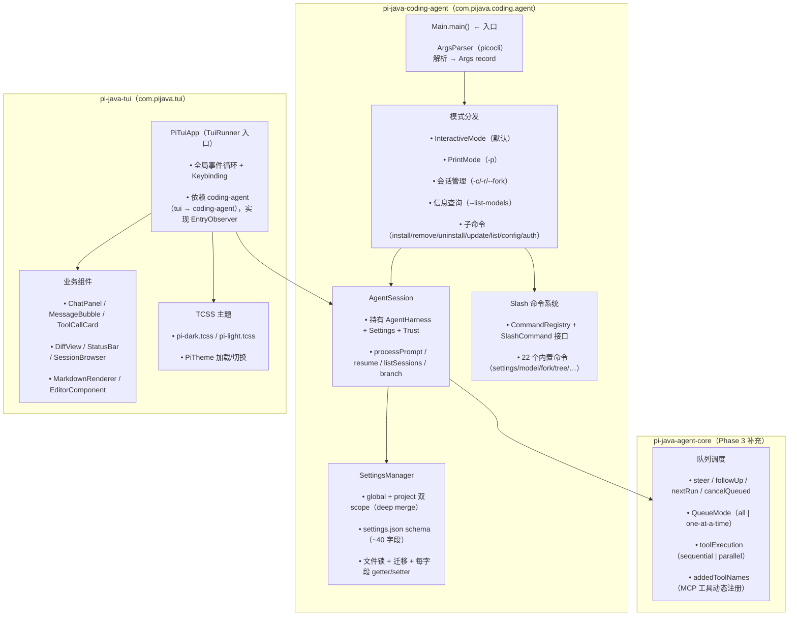
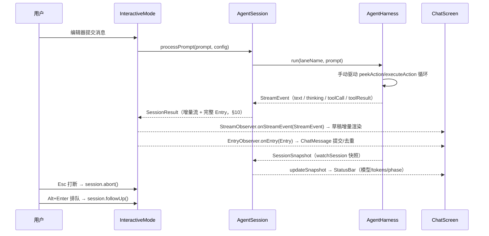
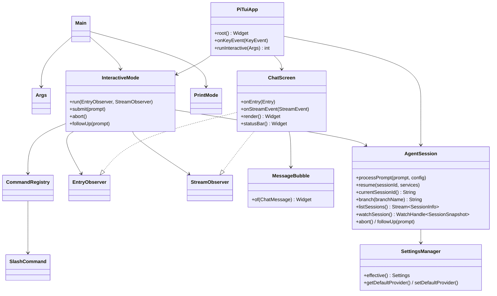

# Phase 3: CLI + TUI — 阶段设计文档

> **目标**：提供完整的交互式终端体验 —— `pi-java` 命令行可用（交互模式 + Print 模式），内置 22 个 slash 命令、~40 个 CLI 参数、settings.json 设置管理、TCSS 双主题。
> **工时**：2–3 周（14 项任务）
> **输入文档**：`03-detailed-design.md` §3（TUI 模块）、§4（coding-agent 模块）、`04-implementation-plan.md` §5、`07c-phase2c-orchestration-design.md` §3.2 / §17（队列调度前向引用）
> **前置阶段**：Phase 2c（AgentHarness 完整能力 + `SessionSnapshot`/`WatchHandle` 已就绪）

---

## 1. 架构概览



**核心设计原则**：
- **TamboUI 承载渲染，pi-java 承载业务**：pi-java-tui 不重写终端渲染引擎（TamboUI 提供差量渲染、Widget 树、CSS、焦点、键盘），只实现 AI 编码代理场景的业务组件与主题。
- **TUI 与 coding-agent 解耦**：模块方向 `tui → coding-agent`（tui 依赖 coding-agent，反之不成立）。`EntryObserver`（coding-agent 定义，观察 agent-core `Entry`）由 tui 实现；`InteractiveMode`（coding-agent）驱动 `AgentSession`，不引用任何 tui 类型。交互入口 `PiTuiApp`（tui）经 ServiceLoader 被 `Main` 发现。
- **手动驱动复用**：Phase 2c 的 `peekAction()` / `executeAction()` 是交互模式主循环的基础；`steer()`/`followUp()` 提供「运行中注入/排队消息」能力，是 TUI 交互（Alt+Enter 排队、Esc 打断）的前提。
- **对齐 pi 语义**：CLI 参数、slash 命令、settings.json 字段名对齐 pi 当前实现（`D:\workplaceForai\pi\packages\coding-agent\src`）。

> **与 `03-detailed-design.md` §3–4 的已知偏离**：`03-detailed-design.md` 为高层设计，其中 §3.4 主题、§4.2 CLI 参数、§4.3 slash 命令三处在撰写时已与 pi 当前实现产生偏离。本设计文档以 **pi 当前源码为准**，偏离逐条记录如下：
> - **TUI 渲染引擎**（§3）：pi 为自研 TUI（`packages/tui`），pi-java 用 [TamboUI](https://tamboui.dev/)（Java 的 Ratatui 移植）。§3.1 已明确该决策，本阶段落地。
> - **Slash 命令列表**（§4.3）：03 列的 23 个命令（`add-dir`/`agents`/`clear`/`context`/`cost`/`doctor`/`ide`/`init`/`memory`/`namespace`/`plan`/`review`/`status`/`theme`/`tools`…）为早期 Claude Code 风格清单，**已过时**。pi 当前为 **22 个** 命令（`settings`/`model`/`scoped-models`/`export`/`import`/`share`/`copy`/`name`/`session`/`changelog`/`hotkeys`/`fork`/`clone`/`tree`/`trust`/`login`/`logout`/`new`/`compact`/`resume`/`reload`/`quit`）。见 §14。
> - **CLI 参数集**（§4.2）：03 的 `Args` record 为简化版，缺失 pi 当前的 `--mode`、`--api-key`、`--system-prompt`、`--append-system-prompt`、`--models`、`--no-tools`、`--no-builtin-tools`、`--tui-mode`、`--session-id`、`--session-dir`、`--no-session`、`--prompt-template`、`--no-skills`、`--no-prompt-templates`、`--no-themes`、`--no-context-files`、`--list-models`、`--approve`/`--no-approve`、`--offline`、`--verbose` 等。见 §9。
> - **03 有但 pi 已移除的参数**（§4.2）：03 的 `--interactive`/`-i`（交互为默认模式，无显式 flag）、`--strict-tools`、`--json`（pi 改为 `--mode json`）、`--quiet`（pi 改为 `quietStartup` 设置 + `--verbose`）、`--cwd`（pi 内部 `session-cwd` 处理）、`--config`（pi 改为 `config` 子命令）、`--max-turns`、`--no-compaction` 在 pi 当前均不存在，本设计不再保留。见 §9。
> - **短选项冲突**（§4.2）：03 中 `-v`=verbose、`-V`=version；pi 当前 `-v`=**version**（verbose 无短别名）。跟随 pi。
> - **ThinkingLevel 映射**：pi 的 `ThinkingLevel` 为 6 级刻度（`minimal`/`low`/`medium`/`high`/`xhigh`/`max`），`off` 由 `ModelThinkingLevel.Off` 表示（CLI 共 7 个取值）。pi-java 的 `ThinkingLevel` 为 5 级（`Minimal`/`Low`/`Medium`/`High`/`XHigh`，`XHigh` 的 label 为 `"xhigh"`，合并了 pi 的 `xhigh` 与 `max`），`off` 由 `ModelThinkingLevel.Off` 表示。`--thinking` 参数映射到 `ModelThinkingLevel`。见 §9.3。
> - **SessionSnapshot 命名冲突**（§3.5）：03 定义 TUI 层 `SessionSnapshot` interface（`name/model/phase/totalTokens/turnCount/activeTools`）；Phase 2c 已在 agent-core 定义 `SessionSnapshot` record（含 `lanes`）。**决策**：TUI 层复用 agent-core 的 `SessionSnapshot`，不再重复定义，废弃 03 §3.5 的简化 interface。见 §4.5。
> - **队列调度**（§2.2）：03 未细化；Phase 2c §3.2 声明 `steer`/`followUp`/`nextRun`/`cancelQueued` 为 Phase 3 stub。本阶段实现。见 §11.2。
> - **设置管理**（§4.1）：03 仅提 `Settings` 类型名，未给 schema。本阶段对齐 pi `settings-manager.ts` 完整 schema。见 §12。

### 1.1 数据流（序列图）



### 1.2 核心类图



---

## 2. TamboUI 集成 + Panama 后端（P3-1）

### 2.1 依赖引入

在 `pi-java-tui/pom.xml` 引入 TamboUI（当前 **0.3.0**），版本锁定在根 `pom.xml` 的 `dependencyManagement`（见 R6 缓解策略：`TamboUIAdapter` 隔离层封装所有直接依赖）。

```xml
<!-- pi-java-tui/pom.xml -->
<dependency>
    <groupId>dev.tamboui</groupId>
    <artifactId>tamboui-toolkit</artifactId>   <!-- BOM 已管理（根 pom dependencyManagement） -->
</dependency>
<dependency>
    <groupId>dev.tamboui</groupId>
    <artifactId>tamboui-panama-backend</artifactId> <!-- Panama/FFM 后端（BOM 已管理） -->
</dependency>
```

> 坐标以根 `pom.xml` / `pi-java-bom` 已管理的为准：`tamboui-toolkit`（核心 Widget + TuiRunner）、`tamboui-panama-backend`（Panama/FFM 后端）、`tamboui-jline3-backend`（备用后端）、`tamboui-css`（TCSS），版本统一走 `${version.tamboui}`（0.3.0）。若实际发布的 artifact 坐标有变，仅更新 BOM 与本处依赖声明，业务代码仍经 `TamboUIAdapter` 隔离。

### 2.2 Panama 后端配置

TamboUI 的 Panama 后端通过 JDK 26 Foreign Function & Memory API 直连终端，零 JNI。`TamboUIAdapter` 是唯一直接 import TamboUI API 的类：

```java
package com.pijava.tui.util;

/**
 * 隔离层：封装对 TamboUI 的直接依赖。
 * Phase 3 所有 TamboUI API 调用均通过此类或此包，避免业务组件直接 import 第三方类型。
 * 版本升级时仅需修改此隔离层（R6 缓解策略）。
 */
public final class TamboUIAdapter {
    private TamboUIAdapter() {}

    /** 创建 TuiRunner，使用 Panama 终端后端。 */
    public static TuiRunner createRunner(TuiApp app) {
        return TuiRunner.builder()
            .app(app)
            .backend(Backend.PANAMA)
            .build();
    }
    // 其余 Widget 工厂方法（panel/column/row/text/scrollView/...）集中在此
}
```

### 2.3 验收标准

- `mvn test -pl pi-java-tui` 通过
- 一个最小 smoke：创建空 `TuiRunner` 并渲染一行文本不抛异常
- Panama 后端冒烟：真实终端启动 `PiTuiApp`，输入/渲染/退出不崩溃（§13 手动验证矩阵）
- 降级后端冒烟：`tamboui-jline3-backend` 可无缝替代 Panama（`TamboUIAdapter.createRunner` 切后端参数）
- 三平台 headless 渲染：`TuiRunner` 在 CI 三平台矩阵渲染固定 Widget 树不抛异常（§16）

---

## 3. TCSS 主题系统（P3-2）

### 3.1 主题资源

TamboUI 使用 TCSS（类 CSS）样式。暗色默认（Tokyo Night 色板），亮色可选。

```css
/* pi-java-tui/src/main/resources/themes/pi-dark.tcss */

Screen { background: #1a1b26; }

ChatPanel { padding: 1 2; }

MessageBubble.user      { border-color: #7aa2f7; background: #24283b; }
MessageBubble.assistant { border-color: #9ece6a; background: #1f2335; }
ToolCallCard            { border-color: #e0af68; }
StatusBar               { background: #16161e; foreground: #565f89; }
EditorComponent         { border-color: #7dcfff; background: #1f2335; }
```

### 3.2 PiTheme 管理器

```java
package com.pijava.tui.theme;

/** 主题加载/切换。Phase 3 仅支持内置 dark/light 两套，自定义主题文件 → Phase 6。 */
public final class PiTheme {
    public static final String DARK  = "themes/pi-dark.tcss";
    public static final String LIGHT = "themes/pi-light.tcss";

    private PiTheme() {}

    public static void applyDark(TuiRunner runner) { load(runner, DARK); }
    public static void applyLight(TuiRunner runner) { load(runner, LIGHT); }

    private static void load(TuiRunner runner, String resource) {
        runner.loadCss(PiTheme.class.getClassLoader().getResource(resource));
    }
    /** 根据 settings.theme（"dark"|"light"）应用；未知值回退 dark。 */
    public static void apply(TuiRunner runner, String theme) {
        if ("light".equalsIgnoreCase(theme)) applyLight(runner); else applyDark(runner);
    }
}
```

---

## 4. 业务组件（P3-3）

> 组件 API 对齐 03 §3.3，但 `SessionSnapshot` 复用 agent-core 类型（见 §4.5），`ChatMessage` 为 TUI 层自有密封类型（见 §4.1）。

### 4.1 ChatMessage（TUI 内部消息模型）

```java
package com.pijava.tui.component;

/**
 * TUI 层内部消息模型。将 agent-core 的 Entry/LaneRecord 投影为渲染友好的扁平类型。
 * 用 sealed interface 表示 6 种气泡（Erasable Java，无 enum）。
 */
public sealed interface ChatMessage {
    record User(String text) implements ChatMessage {}
    record Assistant(List<ContentBlock> blocks) implements ChatMessage {}
    record ToolCall(String name, String arguments) implements ChatMessage {}
    record ToolResult(String output) implements ChatMessage {}
    record Error(String message) implements ChatMessage {}
    record System(String text) implements ChatMessage {}   // 元数据事件提示条（ModelChange/Compaction/…）
}
```

> **Entry → ChatMessage 投影**：`ChatMessage.from(Entry)`（静态工厂，或独立 `EntryMapper`）把 agent-core 的 `Entry` 投影为上述气泡。agent-core `Entry` 共 7 子类型：`Message`（role=`"user"`/`"assistant"`/`"tool"`）、`ModelChange`、`ThinkingLevelChange`、`ActiveToolsChange`、`Compaction`、`BranchSummary`、`Custom`。其中 `Message` 按 role 与 `ContentBlock` 投影为 `User`/`Assistant`/`ToolCall`/`ToolResult`，错误内容（或 lane 故障）投影为 `Error`；其余 5 种元数据事件投影为 `System` 提示条（富样式渲染 → Phase 6 细化）。供 `ChatScreen.onEntry` 使用（§7.1）。

### 4.2 MessageBubble — 单条气泡

```java
/** 将 ChatMessage 转为 TamboUI Widget 树。switch 全覆盖（无 default）。 */
public final class MessageBubble {
    private MessageBubble() {}

    public static Widget of(ChatMessage msg) {
        return switch (msg) {
            case ChatMessage.User(var text) ->
                panel(markupText(text)).cyan().rounded();
            case ChatMessage.Assistant(var blocks) ->
                column(blocks.stream().map(MessageBubble::renderBlock).toList());
            case ChatMessage.ToolCall(var name, var arguments) ->
                new ToolCallCard(name, arguments, "running").render();   // 委托 §4.3
            case ChatMessage.ToolResult(var result) ->
                panel(markupText(truncate(result.output(), 500))).green().rounded();
            case ChatMessage.Error(var err) ->
                panel(markupText("[red]" + err.message() + "[/]")).red().rounded();
            case ChatMessage.System(var text) ->
                text(text).dim();
        };
    }

    private static Widget renderBlock(ContentBlock block) {
        return switch (block) {
            case ContentBlock.TextContent(var t) -> markupText(t);
            case ContentBlock.ToolUseContent(var id, var name, var arguments) ->
                new ToolCallCard(name, arguments.toString(), "running").render();  // 委托 §4.3
            case ContentBlock.ToolResultContent(var toolUseId, var toolName, var content, var isError) ->
                panel(markupText(truncate(content.toString(), 500))).green().rounded();
            case ContentBlock.ImageContent(var mediaType, var data) ->
                text("[image: " + mediaType + "]").dim();   // 内联图片渲染 → Phase 6
        };
    }
}
```

> **流式渲染（增量文本）**：`Entry` 是消息级完整事件；打字机效果的增量文本由 `StreamObserver`（§11.1）转发 `StreamEvent.TextDelta`/`ThinkingDelta`，`ChatScreen` 维护 in-flight 草稿气泡（assistant 文本 + thinking 块），`TextEnd`/`Entry` 到达后提交为 `ChatMessage.Assistant`。注意 `ContentBlock` 没有 `Code`/`Thinking` 子类型（实际为 `TextContent`/`ImageContent`/`ToolUseContent`/`ToolResultContent`），thinking 是 `StreamEvent` 层的事件，不在内容块层虚构类型。
>
> **toolCall 流式呈现策略**：`ToolCallStart/Delta` **不逐字渲染**（JSON 增量无展示价值）；`ToolCallEnd` 或对应的 `Entry.Message(role="tool")` 到达时才渲染 `ToolCallCard`（状态 running → done/error 随 `ToolResultContent` 更新）。

### 4.3 ChatPanel / ToolCallCard / DiffView

```java
/** 主聊天面板：滚动视图 + 消息列表。 */
public final class ChatPanel {
    private final ScrollView scrollView;
    private final List<Widget> messages = new ArrayList<>();

    public Widget render() { return scrollView(column(messages)).fill(); }
    public void append(ChatMessage msg) { messages.add(MessageBubble.of(msg)); }
    public void clear() { messages.clear(); }
}

/** 工具调用卡片：名称 + 参数 + 状态。 */
public record ToolCallCard(String name, String arguments, String status) {
    public Widget render() {
        return panel(column(
            row(text("🔧 " + name).bold(), spacer().fill(), text(status).dim()),
            text(truncate(arguments, 200)).dim()))
            .yellow().rounded();
    }
}

/** Diff 渲染组件：unified diff 着色。 */
public final class DiffView {
    public Widget render(String diffText) {
        var lines = diffText.lines().map(line -> switch (line) {
            case String l when l.startsWith("+") -> text(l).green();
            case String l when l.startsWith("-") -> text(l).red();
            case String l when l.startsWith("@@") -> text(l).cyan();
            default -> text(line);
        }).toList();
        return panel(column(lines)).rounded();
    }
}
```

### 4.4 StatusBar — 底部状态栏

```java
/** 底部状态栏：会话名 + tokens + 模型。数据来自 agent-core SessionSnapshot。 */
public final class StatusBar {
    public Widget render(SessionSnapshot snapshot) {
        return row(
            text(" " + snapshot.name()).dim(),
            spacer().fill(),
            text("⚡ " + snapshot.totalTokens() + " tokens").dim(),
            text(" | "),
            text(snapshot.model()).dim()
        ).length(1);
    }
}
```

### 4.5 SessionSnapshot 复用（消除命名冲突）

TUI 层不再定义独立的 `SessionSnapshot` interface，直接复用 Phase 2c 的 agent-core 记录：

```java
// com.pijava.agent.harness.SessionSnapshot（Phase 2c 已定义，TUI 复用）
public record SessionSnapshot(
    String name, String model, String phase,
    long totalTokens, int turnCount,
    List<String> activeTools, List<LaneInfo> lanes
) {}
```

`PiTuiApp` 通过 `AgentSession` 注入的 `WatchHandle<SessionSnapshot>` 订阅实时快照。

---

## 5. Markdown → Widget 转换桥接（P3-4）

### 5.1 MarkdownRenderer

```java
package com.pijava.tui.component;

/**
 * Markdown → TamboUI Widget 树转换。
 * Phase 3 支持：标题、粗体/斜体、代码块、行内代码、列表、引用、链接（仅文本）。
 * 表格、图片、mermaid → Phase 6。
 */
public final class MarkdownRenderer {

    /** 将 markdown 字符串渲染为 Widget 树。 */
    public Widget render(String markdown) {
        var blocks = MarkdownParser.parseBlocks(markdown);  // 内部分块
        return column(blocks.stream().map(this::renderBlock).toList());
    }

    private Widget renderBlock(MarkdownBlock block) {
        return switch (block) {
            case MarkdownBlock.Heading(int level, var text) ->
                text(text).bold();  // 级别越大字重越高（Phase 3 简化为 bold）
            case MarkdownBlock.Paragraph(var text) -> wrapMarkupText(text);
            case MarkdownBlock.Code(var lang, var code) ->
                panel(text(code)).gray().rounded();
            case MarkdownBlock.ListBlock(var items) ->
                column(items.stream().map(i -> text("• " + i)).toList());
            case MarkdownBlock.Quote(var text) -> text(text).dim();
        };
    }
}
```

> **解析策略**：Phase 3 不引入第三方 Markdown 解析库，自研轻量行级解析（标题 `#`、代码围栏 ```` ``` ````、列表 `- `、引用 `>`）。完整的 GFM 兼容（表格/图片/LaTeX/mermaid）→ Phase 6。

---

## 6. 编辑器组件（P3-5）

```java
package com.pijava.tui.component;

/** 多行输入编辑器，委托 TamboUI TextArea。 */
public final class EditorComponent {
    private final TamboTextArea inputWidget;

    public EditorComponent() {
        this.inputWidget = TamboUIAdapter.createTextArea(TextAreaConfig.builder()
            .multiLine(true)
            .placeholder("Type your message...")
            .maxHeight(10)
            .build());
    }

    public Widget render() { return panel(inputWidget.render()).borderColor(Color.CYAN); }
    public void onSubmit(Consumer<String> handler) { inputWidget.onSubmit(handler); }
    public String getText() { return inputWidget.getText(); }
    public void clear() { inputWidget.clear(); }
    public void setText(String text) { inputWidget.setText(text); }
}
```

> **语法高亮 + 补全**：pi 自研 TUI 有独立的高亮/补全子系统；pi-java Phase 3 委托 TamboUI TextArea 的输入能力，**语法高亮/智能补全 → Phase 6**（依赖 TamboUI 0.4+ 的语法高亮 API）。

---

## 7. 主应用壳 + 全局快捷键（P3-6）

### 7.1 ChatScreen + PiTuiApp（tui → coding-agent，无循环依赖）

```java
// com.pijava.tui.screen — ChatScreen 实现 coding-agent 的 EntryObserver + StreamObserver
public final class ChatScreen implements EntryObserver, StreamObserver {
    private final ChatPanel chatPanel = new ChatPanel();
    private final EditorComponent editor = new EditorComponent();
    private SessionSnapshot snapshot;   // 由 WatchHandle 快照驱动（见 §4.5）
    private final StringBuilder assistantDraft = new StringBuilder();  // in-flight 增量文本
    private final StringBuilder thinkingDraft = new StringBuilder();   // in-flight thinking 增量

    /** 接收 agent-core 的 Entry，投影为 ChatMessage 后追加（投影见 §4.1）。 */
    @Override public void onEntry(Entry entry) {
        // assistant Message 若已由流事件提交（TextEnd），按 header.seq 去重；其余照常追加
        if (!(entry instanceof Entry.Message m && "assistant".equals(m.role()))) {
            chatPanel.append(ChatMessage.from(entry));
        }
    }

    /** 增量流事件 → 草稿气泡；TextEnd/ThinkingEnd 提交（流式打字机效果，见 §4.2）。 */
    @Override public void onStreamEvent(StreamEvent event) {
        switch (event) {
            case StreamEvent.TextStart(var contentIndex, var partial) -> assistantDraft.setLength(0);
            case StreamEvent.TextDelta(var contentIndex, var delta, var partial) -> assistantDraft.append(delta);
            case StreamEvent.TextEnd(var contentIndex, var text, var partial) -> {
                chatPanel.append(ChatMessage.Assistant(List.of(new ContentBlock.TextContent(text))));
                assistantDraft.setLength(0);
            }
            case StreamEvent.ThinkingDelta(var contentIndex, var delta, var partial) -> thinkingDraft.append(delta);
            case StreamEvent.ThinkingEnd(var contentIndex, var thinking, var partial) -> {
                chatPanel.append(ChatMessage.Assistant(List.of(new ContentBlock.TextContent("🧠 " + thinking))));
                thinkingDraft.setLength(0);
            }
            default -> {}
        }
    }

    /** 订阅 agent-core 快照，驱动底部状态栏。 */
    public void updateSnapshot(SessionSnapshot s) { this.snapshot = s; }

    /** in-flight 草稿渲染：assistant/thinking 有增量时显示为列表尾部气泡（打字机效果）。 */
    private Widget draftBubble() {
        var text = assistantDraft.length() > 0 ? assistantDraft.toString()
                 : thinkingDraft.length() > 0 ? "🧠 " + thinkingDraft : null;
        return text == null ? row().fill() : panel(markupText(text)).cyan().rounded();
    }

    public Widget render() { return column(chatPanel.render().fill(), draftBubble().fill(), editor.render()); }
    public Widget statusBar() { return snapshot == null ? row().length(1) : new StatusBar().render(snapshot); }  // 首帧未就绪渲染空行
    public void onKeyEvent(KeyEvent event) { editor.onKeyEvent(event); }

    /** 快捷键动作支持（§7.2 动作分发）。 */
    public void clearEditor() { editor.clear(); }
    public boolean editorEmpty() { return editor.getText().isEmpty(); }
    public String draftText() { return editor.getText(); }
    public void showModelSelector() { /* §8.3：弹出 ModelSelectorScreen（root overlay 层） */ }
}
```

```java
// com.pijava.tui.app — PiTuiApp（交互模式入口，依赖 coding-agent）
public final class PiTuiApp implements TuiApp {
    private final InteractiveMode mode;       // coding-agent 类型
    private final ChatScreen chatScreen;
    private final KeybindingsManager keys;
    private boolean running = true;

    public PiTuiApp(InteractiveMode mode, ChatScreen chatScreen, KeybindingsManager keys) {
        this.mode = mode;
        this.chatScreen = chatScreen;
        this.keys = keys;
    }

    @Override public Widget root() {
        return column(chatScreen.render().fill(), chatScreen.statusBar());
    }

    @Override public void onKeyEvent(KeyEvent event) {
        var keyId = keys.resolve(event);
        if (keyId != null) { handleAction(keyId); return; }   // app.* 命中 → 动作分发
        chatScreen.onKeyEvent(event);
    }

    @Override public boolean isRunning() { return running; }

    /** app.* 动作表：Esc 打断、Alt+Enter 排队、Ctrl+C 清空、Ctrl+D 空编辑器退出等。 */
    private void handleAction(String keyId) {
        switch (keyId) {
            case KeybindingsManager.INTERRUPT      -> mode.abort();
            case KeybindingsManager.FOLLOW_UP      -> mode.followUp(chatScreen.draftText());
            case KeybindingsManager.CLEAR          -> chatScreen.clearEditor();
            case KeybindingsManager.EXIT           -> { if (chatScreen.editorEmpty()) exit(); }
            case KeybindingsManager.MODEL_SELECT   -> chatScreen.showModelSelector();
            // MODEL_CYCLE/THINKING_CYCLE/THINKING_TOGGLE/TOOLS_EXPAND/EXTERNAL_EDITOR/DEQUEUE → 动作或 Phase 6 占位
            default -> {}
        }
    }

    /** 退出路径：/quit、Ctrl+D（编辑器为空）、Ctrl+C 连按两次 → running=false，TuiRunner 停止。 */
    private void exit() { running = false; }

    /** 交互模式入口：tui 依赖 coding-agent 构造 AgentSession + InteractiveMode（见 §11.1）。 */
    public static int runInteractive(Args args) {
        var session = AgentSession.create(args);            // coding-agent
        var chatScreen = new ChatScreen();
        var mode = new InteractiveMode(session);            // coding-agent
        var tui = new PiTuiApp(mode, chatScreen, new KeybindingsManager());
        mode.run(chatScreen::onEntry, chatScreen::onStreamEvent);  // Entry + 增量流 → 渲染
        return TamboUIAdapter.createRunner(tui).run();      // TuiRunner 驱动，阻塞直到退出
    }
}
```

> **快照驱动**：`runInteractive` 中 `session.watchSession()` 返回 `WatchHandle<SessionSnapshot>`，每帧读取 `current()` 调用 `chatScreen.updateSnapshot(snapshot)` 刷新状态栏（见 §4.5/§11.1）。
>
> **线程模型**：`TuiRunner.run()` 在**主线程**跑事件循环（渲染 + 按键）；`InteractiveMode.submit()` 在**虚拟线程**上驱动 `AgentHarness` 手动循环（`peekAction/executeAction`）并把增量事件/Entry 经观察者回传。`abort()/followUp()` 从主线程调用，跨线程安全依赖 Phase 2c 的 `AbortSignal` 与 `WatchHandle`（见 §11.1）。

### 7.2 全局 Keybinding（对齐 pi `app.*` 命名空间）

```java
package com.pijava.coding.agent.core;

/** 应用级键盘绑定，对齐 pi keybindings.ts 的 app.* 集合。 */
public final class KeybindingsManager {
    // Phase 3 实现的核心绑定（模型/会话树选择器随 §8.3 落地；tree.filter.*、models.* 等 → Phase 6）
    public static final String INTERRUPT       = "app.interrupt";        // Esc
    public static final String CLEAR           = "app.clear";           // Ctrl+C
    public static final String EXIT            = "app.exit";            // Ctrl+D（编辑器为空时退出）
    public static final String MODEL_CYCLE     = "app.model.cycleForward"; // Ctrl+P
    public static final String MODEL_SELECT    = "app.model.select";    // Ctrl+L
    public static final String THINKING_CYCLE  = "app.thinking.cycle";  // Shift+Tab
    public static final String TOOLS_EXPAND    = "app.tools.expand";    // Ctrl+O
    public static final String THINKING_TOGGLE = "app.thinking.toggle"; // Ctrl+T
    public static final String EXTERNAL_EDITOR = "app.editor.external"; // Ctrl+G
    public static final String FOLLOW_UP       = "app.message.followUp"; // Alt+Enter
    public static final String DEQUEUE         = "app.message.dequeue"; // Alt+Up
    // ... 其余（session.new/tree/fork/resume 等由 slash 命令覆盖；tree.filter.*、models.* 富过滤）→ Phase 6

    private final Map<String, Keybinding> bindings = new HashMap<>();
    private final Path configPath; // ~/.pi-java/agent/keybindings.json

    /** KeyEvent 归一化为 keyId 后匹配绑定，返回命中的 keyId（未命中返回 null）。 */
    public String resolve(KeyEvent event) { /* KeyEvent → keyId → bindings.get(keyId) */ }
    public void reload() { /* 从 keybindings.json 重载用户覆盖 */ }
}
```

> **键名对齐**：pi 的 keybinding 系统（`@earendil-works/pi-tui` KeybindingsManager）支持 `tui.editor.*` / `tui.input.*` / `tui.select.*` / `app.*` 命名空间。pi-java Phase 3 实现 `app.*` 核心子集（编辑器游标移动委托 TamboUI TextArea 内置能力），模型/会话树选择器绑定随 §8.3 的 `SelectList` 落地；`tree.filter.*`、`models.*` 等富过滤绑定 → Phase 6。

---

## 8. 会话浏览器 + 设置页（P3-7）

### 8.1 屏幕定义

```java
package com.pijava.tui.screen;

/** 会话列表屏幕：交互式会话选择。 */
public final class SessionListScreen {
    public Widget render(List<SessionInfo> sessions) { /* 列表渲染 */ }
    public void onKeyEvent(KeyEvent e) { /* 上/下选择、Enter 确认、Esc 取消 */ }
}

/** 设置页：JSON 配置的交互式 UI。 */
public final class SettingsScreen {
    public Widget render(Settings settings) { /* 分组渲染 */ }
    public void onKeyEvent(KeyEvent e) { /* 字段导航 + 修改 */ }
}
```

### 8.2 会话浏览器

`SessionBrowser` 组件在 Ctrl+S（或 `/resume`）时弹出，列出 `AgentSession.listSessions()` 结果，支持模糊过滤（复用 pi `fuzzy.ts` 逻辑 → 独立 `FuzzyMatcher` 工具类）。

```java
/** 模糊匹配工具，对齐 pi packages/tui/src/fuzzy.ts。 */
public final class FuzzyMatcher {
    /** 返回候选列表按匹配分降序排序。 */
    public static List<String> rank(String query, List<String> candidates) { /* ... */ }
}
```

### 8.3 选择器组件（模型 / 会话树，P3-7 范围）

`/model`、`/tree`、`/fork`、`/resume` 与 Ctrl+L 共用同一个 `SelectList` 骨架（Phase 3 实现），树过滤等高级模式 → Phase 6：

```java
/** 通用可选项列表：上/下选择、Enter 确认、Esc 取消、FuzzyMatcher 过滤。 */
public final class SelectList<T> {
    public SelectList(List<T> items, Function<T, String> label) { /* ... */ }
    public void onKeyEvent(KeyEvent e) { /* 上/下/Enter/Esc */ }
    public Optional<T> selected() { /* ... */ }
}

/** 模型选择器：/model、Ctrl+L 打开。候选来自 ModelCatalog 可用模型。 */
public final class ModelSelectorScreen {
    public Widget render(List<ModelInfo> models) { /* SelectList 渲染 */ }
    public void onKeyEvent(KeyEvent e) { /* 选择 → AgentSession.setModel(modelId) */ }
}

/** 会话树选择器：/tree、Ctrl+S 打开。按 SessionSnapshot.lanes 渲染分支树。 */
public final class TreeSelectorScreen {
    public Widget render(SessionSnapshot snapshot) { /* lanes 树渲染 */ }
    public void onKeyEvent(KeyEvent e) { /* 选择 → AgentSession.navigate(lane) */ }
}
```

> **范围裁定**：Phase 3 落地 `SelectList`/`ModelSelectorScreen`/`TreeSelectorScreen`（对齐 pi 的 model-selector / tree-selector 基础交互）；`treeFilterMode` 过滤预设、图片粘贴、模型详情的富 UI → Phase 6。`/model` 验收可见 §17。

---

## 9. CLI 参数解析（P3-8）

### 9.1 参数全集（对齐 pi args.ts）

| 分类 | 参数 | 短选项 | 语义 |
|------|------|--------|------|
| 运行 | `--print` | `-p` | 非交互打印模式 |
| 运行 | `--mode` | | `text`(默认) / `json`→Phase 6 / `rpc`→Phase 6 |
| 运行 | `--tui-mode` | | `regular`(默认) / `fullscreen` |
| 运行 | `--help` | `-h` | 帮助 |
| 运行 | `--version` | `-v` | 版本号 |
| 会话 | `--continue` | `-c` | 继续最近会话 |
| 会话 | `--resume` | `-r` | 选择会话恢复 |
| 会话 | `--session` | | 指定会话文件/部分 UUID |
| 会话 | `--session-id` | | 精确项目会话 ID（缺失则创建） |
| 会话 | `--fork` | | 从已有会话分叉 |
| 会话 | `--session-dir` | | 会话存储目录 |
| 会话 | `--no-session` | | 不保存会话（临时） |
| 会话 | `--name` | `-n` | 会话显示名 |
| 模型 | `--provider` | | Provider 名（默认 google） |
| 模型 | `--model` | | 模型 pattern/ID（支持 `provider/id` 和 `:thinking`） |
| 模型 | `--models` | | Ctrl+P 轮换模型列表（逗号分隔，支持 glob） |
| 模型 | `--list-models` | | 列出模型（可选模糊搜索） |
| 认证 | `--api-key` | | API key（默认读环境变量） |
| 提示 | `--system-prompt` | | 系统提示（默认 coding assistant） |
| 提示 | `--append-system-prompt` | | 追加系统提示（可多次） |
| 工具 | `--tools` | `-t` | 工具白名单（逗号分隔） |
| 工具 | `--exclude-tools` | `-xt` | 工具黑名单 |
| 工具 | `--no-tools` | `-nt` | 禁用所有工具 |
| 工具 | `--no-builtin-tools` | `-nbt` | 禁用内置工具（保留扩展/自定义） |
| 思考 | `--thinking` | | `off/minimal/low/medium/high/xhigh/max`（`max` 合并入 `xhigh`，见 §9.3） |
| 审批 | `--approve` | `-a` | 本次运行信任项目本地文件 |
| 审批 | `--no-approve` | `-na` | 本次运行忽略项目本地文件 |
| 扩展 | `--extension` | `-e` | 加载扩展（可多次） |
| 扩展 | `--no-extensions` | `-ne` | 禁用扩展发现 |
| 技能 | `--skill` | | 加载 skill（可多次） |
| 技能 | `--no-skills` | `-ns` | 禁用 skills 发现 |
| 模板 | `--prompt-template` | | 加载 prompt 模板（可多次） |
| 模板 | `--no-prompt-templates` | `-np` | 禁用模板发现 |
| 主题 | `--theme` | | 加载主题文件（可多次；Phase 3 仅内置 dark/light，路径加载 → Phase 6） |
| 主题 | `--no-themes` | | 禁用主题发现 |
| 上下文 | `--no-context-files` | `-nc` | 禁用 AGENTS.md/CLAUDE.md 发现 |
| 输出 | `--export` | | 导出会话到 HTML 并退出（HTML 渲染器依赖会话存储 → Phase 4；Phase 3 解析参数 + 占位提示） |
| 行为 | `--offline` | | 禁用启动网络操作 |
| 行为 | `--verbose` | | 强制详细启动 |
| 位置 | `@file` | | 将文件加入初始消息 |
| 位置 | `messages...` | | 初始提示消息（可多个） |

### 9.2 Args record + ArgsParser（picocli）

```java
package com.pijava.coding.agent.cli;

/**
 * 解析后的 CLI 参数。字段对齐 pi Args 接口。
 * Phase 3 用 picocli 处理已知参数；未知 flag 收集为 extension flags（@Unmatched）。
 */
public record Args(
    String provider, String model, String apiKey,
    String systemPrompt, List<String> appendSystemPrompt,
    String thinking,                       // 原始字符串，映射见 §9.3
    boolean continue_, boolean resume, boolean help, boolean version,
    String mode, String name, boolean noSession,
    String session, String sessionId, String fork, String sessionDir,
    List<String> models, List<String> tools, List<String> excludeTools,
    boolean noTools, boolean noBuiltinTools,
    List<String> extensions, boolean noExtensions,
    List<String> skills, boolean noSkills,
    List<String> promptTemplates, boolean noPromptTemplates,
    List<String> themes, boolean noThemes, boolean noContextFiles,
    boolean print, String export, String listModels, // --list-models：null=未传、""=裸用、非空=搜索词（折叠 pi 的 string|true）
    boolean offline, String tuiMode, boolean verbose,
    Boolean projectTrustOverride,           // --approve/--no-approve
    List<String> messages, List<String> fileArgs,
    List<String> unmatched,                 // picocli @Unmatched 原始列表（未知 flag + 位置参数），后处理 → extension flags
    List<ArgDiagnostic> diagnostics         // 解析警告/错误（对齐 pi Args.diagnostics）
) {
    /** 解析诊断：type = "warning" | "error"。对齐 pi Args.diagnostics。 */
    record ArgDiagnostic(String type, String message) {}
}

public final class ArgsParser {
    /** 解析 CLI 参数；@Unmatched 收集未知 flag 与位置参数，后处理按 pi args.ts 规则解析 extension flags（--xxx=value / --xxx value）。 */
    public static Args parse(String[] args) { /* picocli 解析 + 后处理 */ }
}
```

> **picocli 集成要点**：picocli 的 `@Unmatched`（`List<String>`）捕获未知 flag 与位置参数；`@file` 前缀与 `-p` 后续消息通过 `setUnmatchedArgumentsAllowed(true)` + 自定义后处理实现（对齐 pi args.ts 的 `@` 分支与 `-p` 消息吞入逻辑）。未知项中 `--key=value`/`--key value` 解析为 extension flags（保留原始顺序），无法配对的值记入 `diagnostics`。`--help`/`--version` 由 picocli 内置 `mixinStandardHelpOptions` 处理（注意 `-v` 需按 pi 映射为 version）。

### 9.3 ThinkingLevel 映射

```java
/** 将 --thinking 字符串映射到 pi-java ModelThinkingLevel。未知值回退 Off 并告警。 */
public static ModelThinkingLevel parseThinkingLevel(String raw) {
    return switch (raw == null ? "off" : raw.toLowerCase()) {
        case "off"     -> ModelThinkingLevel.off();
        case "minimal" -> ModelThinkingLevel.of(new ThinkingLevel.Minimal());
        case "low"     -> ModelThinkingLevel.of(new ThinkingLevel.Low());
        case "medium"  -> ModelThinkingLevel.of(new ThinkingLevel.Medium());
        case "high"    -> ModelThinkingLevel.of(new ThinkingLevel.High());
        case "xhigh"   -> ModelThinkingLevel.of(new ThinkingLevel.XHigh());
        case "max"     -> ModelThinkingLevel.of(new ThinkingLevel.XHigh());  // pi 的 max 合并入 XHigh
        default -> { /* 诊断告警 */ yield ModelThinkingLevel.off(); }
    };
}
```

> pi 的 `max` 级别在 pi-java 合并入 `XHigh`（label `"xhigh"`，model maximum）。`ModelThinkingLevel` 与 `ThinkingLevel` 均位于 `com.pijava.ai.thinking` 包。

---

### 9.4 子命令分发（对齐 pi `main.ts` 的 7 个子命令）

03 §4.2 将子命令建模为 `Args` 的密封变体（`Args.Install`/`Args.Remove`/`Args.Uninstall`/`Args.Update`/`Args.ListExtensions`/`Args.Config`/`Args.Auth`）。pi 当前在 `main.ts` 顶层独立分发（`runAuthCommand` / `handlePackageCommand` / `handleConfigCommand`），`Args` 为扁平 record（§9.2）。本设计对齐 pi：

| 子命令 | 语义（对齐 pi help） | 落地 |
|--------|---------------------|------|
| `install <source> [-l]` | 安装扩展源并写入 settings | Phase 6（扩展系统） |
| `remove <source> [-l]` | 从 settings 移除扩展源 | Phase 6 |
| `uninstall <source> [-l]` | `remove` 别名 | Phase 6 |
| `update [source\|self\|pi]` | 更新 pi / 扩展 / 模型目录 | Phase 6 |
| `list` | 列出已安装扩展 | Phase 6 |
| `config [-l]` | 打开 TUI 开关 package 资源（Tab 切 scope） | Phase 6 |
| `auth <command>` | 打印凭据 / 检查 provider 就绪（Phase 3：`print-api-key`/`check`；`print-bearer-token` → Phase 6） | Phase 3 |

> **偏离说明**：03 将子命令并入 `Args` sealed 变体；pi 在 `main.ts` 顶层 `switch` 分发到 `auth-command.ts` / `package-manager-cli.ts` / `config-selector.ts`。pi-java 采用 `Main.main()` 顶层 `switch` 分发 + 独立 `SubcommandHandler`。`auth` Phase 3 落地基础版（`print-api-key`/`check`），扩展包管理与 `config` TUI → Phase 6（依赖扩展系统）。

### 9.5 Main 分发 + AgentSession 组装

```java
// com.pijava.coding.agent.Main — 顶层分发（对齐 pi main.ts）
public final class Main {
    public static void main(String[] args) throws Exception {
        var sub = SubcommandHandler.matches(args);        // install/remove/uninstall/update/list/config/auth（§9.4）
        if (sub != null) { System.exit(SubcommandHandler.dispatch(sub, args)); return; }

        var parsed = ArgsParser.parse(args);
        if (parsed.help())    { HelpText.print(); return; }
        if (parsed.version()) { System.out.println(Version.VERSION); return; }
        if (parsed.listModels() != null) { System.exit(ListModelsCommand.run(parsed.listModels())); return; }
        if (parsed.print())   { System.exit(PrintMode.run(parsed.messages(), parsed)); return; }

        // 交互模式（默认）：ServiceLoader 发现 tui 入口（§11.1）
        var entry = ServiceLoader.load(TuiEntryPoint.class).findFirst()
            .orElseThrow(() -> new IllegalStateException(
                "interactive mode requires pi-java-tui on the classpath"));
        System.exit(entry.runInteractive(parsed));
    }
}
```

```java
// AgentSession.create — 组装流程（Args → Settings → SessionServices → AgentHarness）
public static AgentSession create(Args args) {
    var settings = SettingsManager.load(args.projectTrustOverride());   // global + project deep merge（§12.2）
    var services = new SessionServices(
        settings,
        new TrustManager(settings.defaultProjectTrust()),
        ProviderFactory.withDefaults(),                                  // ai：5 个内置 Provider
        new DefaultModelResolver(BuiltinCatalog.INSTANCE),               // ai：模型目录
        ToolSetFactory.createCodingTools(Path.of("")),                   // agent-core：内置工具集
        CommandRegistry.withBuiltins());                                 // 22 个 slash 命令（§14）
    var harness = AgentHarness.builder()
        .streamFn(services.providers().streamFn(args))
        .model(ModelResolver.resolve(args.model(), settings))
        .thinkingLevel(parseThinkingLevel(args.thinking()))             // §9.3
        .activeTools(activeTools(args, settings))
        .toolRegistry(services.tools())
        .driveMode(DriveMode.MANUAL)                                     // 交互模式手动驱动（§11.1）
        .build();
    return new AgentSession(harness, services, InMemorySessionRepository.create(args));  // §11.5
}
```

---

## 10. Print Mode（P3-9）

```java
package com.pijava.coding.agent.modes;

/** 非交互打印模式：处理 prompt 后退出。 */
public final class PrintMode {
    /**
     * 运行一次打印模式。
     * 复用 AgentHarness.runToCompletion()（AUTOMATIC 驱动），流式输出 assistant 文本到 stdout。
     */
    public static int run(String prompt, Args args) throws Exception {
        var session = AgentSession.create(args);
        try (session) {
            var result = session.processPrompt(prompt, PromptConfig.from(args));
            result.stream().forEach(PrintMode::renderEvent);  // text → stdout
            return result.status().exitCode();
        }
    }
}
```

```java
/** 一次 processPrompt 的结果：增量事件流 + 完整 Entry + 运行状态。Print/Interactive 模式共用。 */
public record SessionResult(
    Stream<StreamEvent> stream,     // 增量事件（text/thinking/toolCall 各阶段，单次消费）
    List<Entry> entries,            // 完整 transcript 项（消息级，驱动结束后回放）
    RunStatus status
) {}

/** 运行结束状态：退出码 + 结束原因（对齐 StreamEvent.StreamDone.reason）。 */
public record RunStatus(int exitCode, String reason) {}
```

**输出契约**：
- `--mode text`（默认）：纯文本流式输出 assistant 回复
- `--mode json`：JSON 事件流（对齐 pi `modes/json-event.ts`，→ Phase 6 与 RPC 共用 schema）
- 工具调用默认隐藏细节，`--verbose` 时打印工具名/参数

```java
/** 专用输出器（Print Mode 的 stdout 出口，满足 §17 无 System.out.println 残留约定——此处仅示意）。 */
static void renderEvent(StreamEvent event) {
    switch (event) {
        case StreamEvent.TextDelta(var contentIndex, var delta, var partial) -> System.out.print(delta);
        case StreamEvent.ThinkingDelta(var contentIndex, var delta, var partial) -> { /* 默认隐藏；--verbose 打印 */ }
        case StreamEvent.ToolCallEnd(var contentIndex, var id, var name, var arguments, var partial) ->
            System.out.println();   // 工具阶段结束后换行分隔
        case StreamEvent.StreamError(var reason, var error, var partial) -> {
            System.err.println("error: " + reason);   // 错误 → stderr；退出码由 RunStatus 决定（非零）
        }
        case StreamEvent.StreamDone(var reason, var usage, var partial) -> { /* usage → --verbose 摘要 */ }
        default -> {}
    }
}
```

> **StreamDone/StreamError 处理**：`StreamDone` 携带 `usage`（进状态栏/`--verbose` 摘要）与 `reason`（停止原因，映射 `RunStatus.reason`）；`StreamError` → 非零退出码（Print）或 `ChatMessage.Error` 气泡 + 状态栏红色提示（交互模式，§4.1）。两者都在 `SessionResult.status()` 收敛，模式代码不重复判错。

---

## 11. 交互模式主循环（P3-10）

### 11.1 主循环（coding-agent 驱动，tui 渲染）

```java
// com.pijava.coding.agent.core — EntryObserver + StreamObserver（coding-agent 定义，tui 实现）
@FunctionalInterface
public interface EntryObserver {
    void onEntry(Entry entry);   // com.pijava.agent.entry.Entry（agent-core）
}

/** 增量流观察者：转发 StreamEvent（text/thinking/toolCall 各阶段），供 TUI 打字机渲染。 */
@FunctionalInterface
public interface StreamObserver {
    void onStreamEvent(StreamEvent event);   // com.pijava.ai.stream.StreamEvent
}

// com.pijava.coding.agent.modes — InteractiveMode（coding-agent，不依赖 tui）
/** 交互模式：提交消息后在虚拟线程驱动 AgentSession 手动循环，增量流 + Entry 回调观察者。 */
public final class InteractiveMode {
    private final AgentSession session;
    private EntryObserver entryObserver;
    private StreamObserver streamObserver;

    public InteractiveMode(AgentSession session) { this.session = session; }

    /** 注册观察者后立即返回（不阻塞，不启动线程）；提交消息时才启动驱动循环。 */
    public void run(EntryObserver entries, StreamObserver stream) {
        this.entryObserver = entries;
        this.streamObserver = stream;
    }

    /** TUI 线程调用：提交消息 → 在虚拟线程上驱动 harness 手动循环并转发事件（线程模型见 §7.1）。 */
    public void submit(String prompt) {
        var result = session.processPrompt(prompt, /* PromptConfig */);  // SessionResult（§10）
        Thread.startVirtualThread(() -> {
            result.stream().forEach(streamObserver::onStreamEvent);      // 增量 → 草稿气泡
            result.entries().forEach(entryObserver::onEntry);            // 完整 Entry → 提交/去重
        });
    }
    public void abort() { session.abort(); }                 // 跨线程安全：AbortSignal.abort（Phase 2c）
    public void followUp(String prompt) { session.followUp(prompt); }   // Alt+Enter 排队
}
```

> **模块方向（消除循环依赖）**：`coding-agent` 只依赖 `agent`/`ai`/`telemetry`，**不**依赖 `tui`。`EntryObserver` 定义在 coding-agent、观察 agent-core `Entry`；`InteractiveMode` 不引用任何 tui 类型；tui 实现 `EntryObserver` 并构造 `InteractiveMode`/`AgentSession`（`tui → coding-agent`）。`Main.main()`（coding-agent）解析参数后，非交互模式（print/json/rpc）与子命令在 coding-agent 内完成；交互模式经 ServiceLoader（SPI，对齐 P1-9）发现 tui 提供的交互入口，避免编译期依赖 tui。

```java
// com.pijava.coding.agent.spi — TuiEntryPoint（coding-agent 定义 SPI，tui 提供实现）
/** TUI 交互入口 SPI。Main.main() 经 ServiceLoader 发现；pi-java-tui 在 META-INF/services/com.pijava.coding.agent.spi.TuiEntryPoint 注册实现。 */
public interface TuiEntryPoint {
    /** 运行交互模式，返回进程退出码。 */
    int runInteractive(Args args);
}
```

> **SPI 发现与回退**：`Main.main()` 对交互模式执行 `ServiceLoader.load(TuiEntryPoint.class).findFirst()`；发现实现（pi-java-tui 提供 `PiTuiEntryPoint`，委托 `PiTuiApp.runInteractive`）则运行；未发现时 stderr 提示「interactive mode requires pi-java-tui on the classpath」并返回非零退出码（进程级错误，不允许静默降级为 Print 模式）。

> **线程模型（补充定义）**：
> - **主线程（TUI 事件循环）**：`TuiRunner.run()` 负责渲染与按键分发（§7.1）。`submit/abort/followUp` 均在此线程调用，不阻塞。
> - **虚拟线程（每轮 run 一个）**：`InteractiveMode.submit` 启动，驱动 `peekAction/executeAction` 状态机，消费 `SessionResult.stream()` 转发给 `StreamObserver`，结束后回放 `SessionResult.entries()` 给 `EntryObserver`。
> - **跨线程安全**：`AgentHarness.abort()` → `AbortSignal.abort()`（Phase 2c 已实现，可跨线程触发）；快照经 `WatchHandle<SessionSnapshot>`（线程安全订阅）供主线程每帧 `current()` 读取；`ChatScreen` 草稿**只允许主线程读写**。定稿方案：虚拟线程的观察者回调经**事件队列投递到主线程**执行——优先使用 `TuiRunner.invokeLater`（若 TamboUI 0.3.0 无此 API，则自建 `BlockingQueue<StreamEvent>` + 每帧 drain，投递逻辑收敛到 `com.pijava.tui.util.TuiEventDispatcher` 单一工具类）。`synchronized` 包裹草稿仅作无事件队列可用时的最后兜底，不作为默认方案。
> - 手动驱动循环在虚拟线程上运行时，`peekAction` 可能阻塞等待 LLM 流；Esc 打断即通过 `abort()` 使循环尽快退出。

### 11.2 队列调度（AgentHarness Phase 3 补充）

> Phase 2c 已声明签名（`AgentHarness` 委托 `QueueManager`，方法抛 `UnsupportedOperationException`）。本阶段实现 `QueueManager` 消费逻辑，供 TUI 交互（运行中注入、排队后续消息、中断后恢复）使用。

```java
// com.pijava.agent.harness.AgentHarness — 队列调度（Phase 2c 已定签名，Phase 3 实现消费）

/** 运行中注入消息（steering）。返回排队项序号。 */
public String steer(String laneName, String prompt);
public String followUp(String laneName, String prompt);   // 排队后续消息
public String nextRun(String laneName, String prompt);    // 下一轮运行消息
public void cancelQueued(String laneName, String queueType); // "steer"|"followUp"|"nextRun"
```

> 语义：`steer` 注入当前 run 的下一轮；`followUp` 在 agent 停止后处理；`nextRun` 排队新 run；`cancelQueued` 按队列类型清空。队列项与快照已在 Phase 2c 定义：`LaneInfo.QueuedItem(String prompt, long seq)`、`LaneInfo.Queues(List<QueuedItem> steer, followUp, nextRun)`。

```java
/** 队列模式（Phase 3 新增，对齐 pi QueueMode）。 */
public sealed interface QueueMode {
    record All() implements QueueMode {}          // 一次处理全部排队消息
    record OneAtATime() implements QueueMode {}   // 一次一条（默认）
}

/** 工具执行模式（Phase 3 新增，对齐 pi toolExecution）。 */
public sealed interface ToolExecution {
    record Sequential() implements ToolExecution {}
    record Parallel() implements ToolExecution {}  // StructuredTaskScope
}
```

`QueueMode`/`ToolExecution` 挂到 `HarnessConfig`（Phase 3 新增字段）：

```java
// HarnessConfig — Phase 3 新增字段
QueueMode steeringMode;    // 默认 OneAtATime
QueueMode followUpMode;    // 默认 OneAtATime
ToolExecution toolExecution; // 默认 Parallel（对齐 pi agent.ts 的 toolExecution 默认值）
```

> **Settings ↔ 类型映射**：`Settings` 层以 String 存储（JSON，对齐 pi settings-manager 的 `"all" | "one-at-a-time"`），构造 `HarnessConfig` 时映射为 `QueueMode`（`"all"` → `All`，`"one-at-a-time"` → `OneAtATime`）。两处表示因边界不同（JSON 持久化 vs 强类型运行时）并存，非重复逻辑。

### 11.3 addedToolNames（工具延迟注册，对齐 pi `deferred-tools.ts`）

> `ToolResult.addedToolNames` 已在 Phase 2c 定义（预留字段）。pi 的 `splitDeferredTools`（`ai/src/utils/deferred-tools.ts`）消费该字段：工具结果声明的工具名若尚未被 assistant 的 toolCall 引用，则从下一轮 immediate 工具集中**剔除**，作为「deferred 工具」暂不发送，待首次被 toolCall 引用后再启用。pi-java Phase 3 消费 `addedToolNames`：`ToolRegistry` 记录动态工具名，`AgentHarness` 每次发送前按 transcript 重算 immediate/deferred 集（对齐 pi 的 per-send 重算，非持久标记）；拆分细节 → Phase 6。

```java
// com.pijava.agent.tool.ToolResult（Phase 2c 已定义，Phase 3 消费 addedToolNames）
public record ToolResult<TDetails>(
    List<ContentBlock> content,
    TDetails details,
    UsageInfo usage,
    boolean terminate,
    List<String> addedToolNames   // ← Phase 3 消费：动态注册 MCP 工具
) {}
```

### 11.4 工具执行模式（对齐 pi `ToolExecutionMode`）

pi 的 `ToolExecutionMode = "sequential" | "parallel"`，默认 **`parallel`**（`agent.ts` 构造函数 `toolExecution ?? "parallel"`）。pi-java 的 `ToolExecution` sealed 接口对齐之：默认 `Parallel`，同一 assistant 轮次内的多个工具调用通过 `StructuredTaskScope` 并行执行；`Sequential` 为逐次执行（调试/兼容时显式降级）。R4 缓解：虚拟线程 bug 时 `-Dpi.virtual-threads=false` 降级为顺序执行。

### 11.5 会话生命周期（Phase 3：InMemory，跨进程恢复 → Phase 4）

> 会话持久化在 Phase 4（SQLite/JSONL），但 `-c/-r/--fork`、`/resume`/`/fork`/`/clone`/`/tree`/`/new` 在 Phase 3 必须可用。定稿：**同一进程内**的会话由内存注册表管理，进程退出即丢失；Phase 4 用持久化实现替换该注册表（API 不变）。

```java
// com.pijava.coding.agent.core.session — InMemorySessionRepository（Phase 3）
/** 内存会话注册表：同一进程内可 resume/fork/list；跨进程恢复与落盘 → Phase 4。 */
public final class InMemorySessionRepository {
    public Session create(Args args);            // /new、--session-id
    public Optional<Session> latest();           // -c 继续最近会话
    public Optional<Session> find(String id);    // -r/--session/--resume
    public Session fork(Session source, String branchName);   // --fork、/fork、/clone
    public List<SessionInfo> list();             // /session、/resume 选择器
}
```

> `AgentSession` 持有该注册表；`listSessions()` 返回当前进程内全部会话，跨进程列表 → Phase 4。`--session-dir` 参数在 Phase 3 仅保留解析（存储位置对 InMemory 无意义），Phase 4 生效。

---

## 12. 设置管理（P3-11）

### 12.1 Settings schema（对齐 pi settings-manager.ts）

```java
package com.pijava.coding.agent.core;

/** 设置根对象，对齐 pi Settings 接口（字段名保持 snakeCase，由 Jackson 映射）。 */
public final class Settings {
    // 顶层（Phase 3 实现子集，完整字段见 pi settings-manager.ts §90–139）
    public String defaultProvider;         // 默认 provider
    public String defaultModel;            // 默认模型
    public String defaultThinkingLevel;    // off/minimal/low/medium/high/xhigh
    public String transport;               // auto（websocket/sse → Phase 6）
    public String steeringMode;            // all | one-at-a-time
    public String followUpMode;            // all | one-at-a-time
    public String theme;                   // dark | light
    public CompactionSettings compaction;  // enabled/reserveTokens/keepRecentTokens
    public Boolean hideThinkingBlock;
    public String externalEditor;          // Ctrl+G 外部编辑器
    public String shellPath;
    public Boolean quietStartup;
    public String defaultProjectTrust;     // ask | always | never
    public List<String> extensions;
    public List<String> skills;
    public List<String> prompts;
    public List<String> themes;
    public Boolean enableSkillCommands;
    public TerminalSettings terminal;      // showImages/imageWidthCells/...
    public ImageSettings images;           // autoResize/blockImages
    public List<String> enabledModels;     // Ctrl+P 轮换模型
    public String doubleEscapeAction;      // fork | tree | none
    public String treeFilterMode;          // default | no-tools | user-only | labeled-only | all
    public Integer editorPaddingX;
    public Integer outputPad;
    public Integer autocompleteMaxVisible;
    public MarkdownSettings markdown;      // codeBlockIndent/mermaid
    public String sessionDir;
    public String httpProxy;
    public String tuiMode;                 // regular | fullscreen
    // ... 其余（branchSummary/retry/warnings/thinkingBudgets/...）→ 按需补齐

    // 未知字段透传：Jackson @JsonAnySetter/@JsonAnyGetter 保留 pi 未来字段，
    // 兑现「核心子集 + 透传」承诺——未知字段不丢失、不阻断加载，迁移后原样写回。
    private final Map<String, Object> unknown = new HashMap<>();
    @JsonAnySetter public void setUnknown(String key, Object value) { unknown.put(key, value); }
    @JsonAnyGetter public Map<String, Object> unknown() { return unknown; }
}
```

### 12.2 SettingsManager

```java
/** 设置管理：global + project 双 scope，deep merge，文件锁，迁移。 */
public final class SettingsManager {
    private final SettingsStorage storage;   // FileSettingsStorage | InMemorySettingsStorage
    private Settings globalSettings;         // ~/.pi-java/agent/settings.json
    private Settings projectSettings;        // <cwd>/.pi-java/settings.json
    private Settings merged;                 // deepMerge(global, project)
    private boolean projectTrusted;

    /** 每字段 getter/setter（对齐 pi 的 setXxx → markModified + save 模式）。 */
    public String getDefaultProvider();
    public void setDefaultProvider(String provider);
    public String getSteeringMode();
    public void setSteeringMode(String mode);   // 记录到 modifiedFields，写回 global
    // ... 约 40 个 getter/setter

    /** 合并后的最终值（global 兜底，project 覆盖，嵌套对象递归合并）。 */
    public Settings effective();

    /** 项目信任切换时重载 project settings（非信任则清空 project 层）。 */
    public void setProjectTrusted(boolean trusted);
    public void reload();
    public void flush();
}
```

> **优先级与覆盖**：取值优先级 **CLI > project > global**。`effective()` 只做 global/project 的 deep merge（global 兜底、project 覆盖）；CLI 显式参数（`--model`/`--thinking`/`--tools` 等）在 §9.5 组装时覆盖 `effective()`，不写回 settings 文件（对齐 pi：CLI flag 不改持久化配置）。

### 12.3 存储与锁

```java
/** 文件存储，带文件锁（对齐 pi FileSettingsStorage + proper-lockfile）。 */
public final class FileSettingsStorage implements SettingsStorage {
    private final Path globalPath;   // <agentDir>/settings.json
    private final Path projectPath;  // <cwd>/.pi-java/settings.json

    @Override
    public void withLock(SettingsScope scope, Function<String, String> fn) {
        // 获取 FileLock（重试 10 次、20ms 间隔），读取 current → fn(current) → 写回
    }
}

public sealed interface SettingsScope { /* Global | Project */ }
```

> **迁移**：`migrateSettings` 处理旧字段（`queueMode`→`steeringMode`、`websockets`→`transport` 等），对齐 pi 的迁移逻辑。

### 12.4 信任管理

```java
/** 项目级信任标记，持久化到 ~/.pi-java/trust/。Phase 3 实现 ask/always/never 三级。 */
public final class TrustManager {
    public boolean isTrusted(Path projectDir);
    public void trust(Path projectDir);   // 写入信任标记
}
```

> 完整信任持久化（`~/.pi-java/trust/`）→ Phase 4（与持久化一起落地）。Phase 3 内存实现 + `/trust` 命令写入。

---

## 13. 手动测试 + 调优（P3-12）

### 13.1 终端兼容矩阵

| 终端 | 平台 | 验证项 |
|------|------|--------|
| Windows Terminal | Windows 11 | 差量渲染、Unicode/emoji、IME、全屏模式 |
| macOS Terminal.app | macOS | 同上 |
| iTerm2 | macOS | 图片协议（可选）、256 色 |
| Alacritty | Linux | 同上 |

### 13.2 测试方法

- CI TUI 冒烟按平台差异化：Linux/macOS 用 `script`/tmux 伪终端截屏回归；Windows 用 ConPTY 伪控制台冒烟（或跳过渲染截图，仅验证 `TuiRunner` headless 不抛异常，见 §16）
- 手动真机验证（人操作，AI 提供 checklist）
- 调优项：启动时间、重绘闪烁、长会话滚动性能

### 13.3 风险矩阵

| # | 风险 | 概率/影响 | 缓解 |
|---|------|----------|------|
| R1 | TamboUI 0.3.0 实际 API 与本文假定形状（`TuiRunner`/`TuiApp`/`loadCss`/`TextArea`/`ScrollView`）不符 | 高/高 | `TamboUIAdapter` 全量隔离直接依赖；P3-1 首日先跑 API 探针 smoke（§2.3）；必要时升级 0.4 或切换后端 |
| R2 | Panama 后端在 CI/部分终端不兼容（无真终端/权限受限） | 中/高 | `tamboui-jline3-backend` 无缝回退（§2.3 冒烟）；CI 用 headless 渲染断言 |
| R3 | 虚拟线程/`StructuredTaskScope` 在 JDK 26 的兼容或 bug | 低/中 | `-Dpi.virtual-threads=false` 降级顺序执行（§11.4）；并行工具测试覆盖 Sequential/Parallel 结果一致 |
| R4 | Windows ConPTY/IME/Shift+Tab 修饰键差异 | 中/中 | §13.1 Windows Terminal 真机验证 + ConPTY 冒烟；Shift+Tab 依赖后端 VT 模式（同 pi `terminal.ts` 处理） |
| R5 | API key 泄露（`--api-key` 参数、settings、日志） | 低/高 | 认证走 ai 模块 `FileCredentialStore`/`EnvApiKeyResolver`；`--api-key` 不进日志；`auth print-api-key` 输出前确认 |
| R6 | ServiceLoader 发现失败或重复实现 | 低/中 | 单实现注册（§11.1）；未发现 → 明确错误而非静默降级；重复实现 → 首个 + 警告 |
| R7 | 长会话滚动/渲染性能退化 | 中/中 | `ChatPanel` 消息截断（500/200 字符）；§13.2 性能调优项 + 基准 |
| R8 | 终端无 UTF-8/emoji 支持（图标乱码） | 中/低 | TCSS 图标走单点常量（StatusBar/ToolCallCard），检测失败回退 ASCII |

---

## 14. Slash 命令系统（P3-13）

### 14.1 命令接口 + 注册表（对齐 pi `BuiltinSlashCommand`，命令集为 pi 当前 22 个）

```java
package com.pijava.coding.agent.core.slash;

public interface SlashCommand {
    String name();
    String description();
    String argumentHint();                 // 可选参数提示

    /** 执行命令，返回结果文本（渲染到聊天区或触发 UI 选择器）。 */
    CompletionStage<String> execute(String args, SlashContext context);
}

public final class CommandRegistry {
    private final Map<String, SlashCommand> commands = new ConcurrentHashMap<>();

    public void register(SlashCommand cmd) { commands.put(cmd.name(), cmd); }
    public void unregister(String name) { commands.remove(name); }

    /** 匹配并执行。输入不以 "/" 开头返回 null（按普通消息处理）；未知名命令返回错误文本 future。 */
    public CompletionStage<String> dispatch(String input, SlashContext context) {
        if (!input.startsWith("/")) return null;
        var parts = input.substring(1).split("\\s+", 2);
        var cmd = commands.get(parts[0]);
        if (cmd == null) return CompletableFuture.completedFuture("Unknown command: /" + parts[0]);
        return cmd.execute(parts.length > 1 ? parts[1] : "", context);
    }
}
```

> **接口说明**：`name`/`description`/`argumentHint` 对齐 pi `BuiltinSlashCommand`（`slash-commands.ts`）的元数据；`execute` 为 pi-java 运行时接口（pi 将命令执行内联在 interactive-mode 的 slash 分发器中，无独立 `execute` 方法）。03 §4.3 的 `usage()` 已废弃（pi 用 `argumentHint`），`registeredNames()` 移除（pi 无此方法，03 为早期设计）。

### 14.2 22 个内置命令（对齐 pi slash-commands.ts）

| # | 命令 | 功能 | 触发 UI / 直接输出 | 实现度 |
|---|------|------|-------------------|--------|
| 1 | `/settings` | 打开设置菜单 | 设置页 | 完整 |
| 2 | `/model` | 选择模型（打开选择器） | 模型选择器（§8.3） | 完整 |
| 3 | `/scoped-models` | 启用/禁用 Ctrl+P 轮换模型 | 选择器 | 部分（写 `enabledModels`；富 UI → Phase 6） |
| 4 | `/export` | 导出会话（HTML/JSONL） | 直接 | 占位（HTML 渲染器依赖会话存储 → Phase 4） |
| 5 | `/import` | 从 JSONL 导入并恢复会话 | 直接 | 占位（依赖 JSONL 解析/会话重建 → Phase 4） |
| 6 | `/share` | 分享会话为 GitHub gist | 直接 | 占位（需远程 gist API → Phase 6） |
| 7 | `/copy` | 复制最后一条 agent 消息 | 直接 | 部分（桌面剪贴板；headless 降级为打印） |
| 8 | `/name` | 设置会话显示名 | 直接 | 完整 |
| 9 | `/session` | 显示会话信息与统计 | 直接 | 部分（内存统计；跨进程 → Phase 4） |
| 10 | `/changelog` | 显示 changelog | 直接 | 完整（内置 changelog 文本） |
| 11 | `/hotkeys` | 显示所有键盘快捷键 | 直接 | 完整 |
| 12 | `/fork` | 从历史 user 消息分叉 | 选择器（§8.3） | 完整（内存，§11.5） |
| 13 | `/clone` | 在当前位置复制会话 | 直接 | 完整（内存，§11.5） |
| 14 | `/tree` | 导航会话树（切换分支） | 树选择器（§8.3） | 完整（内存 lanes；过滤预设 → Phase 6） |
| 15 | `/trust` | 保存项目信任决策 | 直接 | 部分（内存；持久化 → Phase 4） |
| 16 | `/login` | 配置 provider 认证 | 直接 | 完整（复用 ai 认证） |
| 17 | `/logout` | 移除 provider 认证 | 直接 | 完整（复用 ai 认证） |
| 18 | `/new` | 开启新会话 | 直接 | 完整（内存，§11.5） |
| 19 | `/compact` | 手动压缩上下文 | 直接 | 完整（Phase 2c compaction） |
| 20 | `/resume` | 恢复其他会话 | 会话选择器（§8.3） | 完整（内存；跨进程 → Phase 4） |
| 21 | `/reload` | 重载 keybindings/extensions/skills/prompts/themes/context files | 直接 | 部分（settings/keybindings；extensions/skills/prompts/themes 加载 → Phase 6） |
| 22 | `/quit` | 退出 | 直接 | 完整 |

> **实现度定义**：**完整** = Phase 3 核心路径可用；**部分** = 核心路径可用、富能力推迟（括号标注阶段）；**占位** = 仅注册 + 输出提示（§18 对应条目）。22 个命令全部注册且 `/hotkeys` 可列（§17 验收）。
>
> **偏离说明**：04 的 P3-13 写「23 built-in commands」基于 03 §4.3 过时清单；本设计跟随 pi 当前 **22 个** 命令。`/export` 在 pi 中支持 HTML（默认）与 JSONL（指定 `.jsonl` 后缀）双格式，但 HTML 渲染器与 JSONL 导入依赖 Phase 4 会话存储，Phase 3 仅注册命令 + 输出占位提示（见 §18）。`/share` → Phase 6（需远程 gist API）；Phase 3 输出占位提示。

---

## 15. 包结构

```
# pi-java-coding-agent（com.pijava.coding.agent）
com.pijava.coding.agent/
├── Main.java                          ← CLI 入口
├── cli/
│   ├── ArgsParser.java                ← picocli 解析 + 后处理
│   ├── Args.java                      ← 解析结果 record
│   └── HelpText.java                  ← 帮助文本
├── core/
│   ├── AgentSession.java              ← 会话编排（对齐 03 §4.1）
│   ├── SessionResult.java             ← processPrompt 结果（stream + entries + status，§10）
│   ├── RunStatus.java                 ← 运行结束状态（exitCode + reason，§10）
│   ├── SessionServices.java           ← DI 容器 record
│   ├── SettingsManager.java           ← 设置管理（§12）
│   ├── Settings.java                  ← settings schema（§12.1）
│   ├── TrustManager.java              ← 项目信任（§12.4）
│   ├── KeybindingsManager.java        ← 键盘绑定（§7.2）
│   ├── EntryObserver.java             ← Entry 观察者接口（coding-agent 定义，tui 实现，§11.1）
│   ├── StreamObserver.java            ← 增量流观察者接口（coding-agent 定义，tui 实现，§11.1）
│   ├── session/
│   │   └── InMemorySessionRepository.java ← 内存会话注册表（§11.5；Phase 4 换持久化实现）
│   ├── slash/
│   │   ├── SlashCommand.java          ← 命令接口
│   │   ├── CommandRegistry.java       ← 注册表
│   │   ├── SlashContext.java          ← 命令上下文（session/settings/trust 引用）
│   │   └── builtin/                   ← 22 个内置命令（每命令一个类，或按域分组）
│   └── subcommand/
│       ├── AuthCommand.java           ← auth print-api-key/check（§9.4；print-bearer-token → Phase 6）
│       ├── PackageCommand.java        ← install/remove/uninstall/update/list（§9.4，→ Phase 6）
│       └── ConfigCommand.java         ← config 资源开关 TUI（§9.4，→ Phase 6）
├── spi/
│   └── TuiEntryPoint.java             ← TUI 交互入口 SPI（§11.1，tui 提供实现）
├── modes/
│   ├── InteractiveMode.java           ← 交互模式（§11）
│   ├── PrintMode.java                 ← 打印模式（§10）
│   └── JsonEventMode.java             ← --mode json 事件流（Phase 3 定义，实现 → Phase 6）

# pi-java-tui（com.pijava.tui）
com.pijava.tui/
├── theme/
│   ├── pi-dark.tcss                   ← 默认暗色主题（§3）
│   ├── pi-light.tcss                  ← 亮色主题
│   └── PiTheme.java                   ← 主题加载/切换
├── component/
│   ├── ChatMessage.java               ← TUI 消息模型（sealed，§4.1）
│   ├── ChatPanel.java                 ← 聊天面板
│   ├── MessageBubble.java             ← 单条气泡
│   ├── ToolCallCard.java              ← 工具卡片
│   ├── DiffView.java                  ← Diff 渲染
│   ├── StatusBar.java                 ← 底部状态栏
│   ├── SessionBrowser.java            ← 会话选择器
│   ├── SelectList.java                ← 通用可选项列表（§8.3）
│   ├── MarkdownRenderer.java          ← Markdown → Widget（§5）
│   ├── EditorComponent.java           ← 输入编辑器（§6）
│   └── FuzzyMatcher.java              ← 模糊匹配（§8.2）
├── screen/
│   ├── ChatScreen.java                ← 主聊天界面
│   ├── SessionListScreen.java         ← 会话列表
│   ├── SettingsScreen.java            ← 设置页
│   ├── ModelSelectorScreen.java       ← 模型选择器（§8.3）
│   └── TreeSelectorScreen.java        ← 会话树选择器（§8.3）
├── app/
│   ├── PiTuiApp.java                  ← TuiRunner 入口（§7）
│   └── PiTuiEntryPoint.java           ← TuiEntryPoint 实现（委托 PiTuiApp.runInteractive，§11.1）
└── util/
    ├── TamboUIAdapter.java            ← TamboUI 隔离层（§2.2）
    └── TuiEventDispatcher.java        ← 虚拟线程事件 → 主线程队列投递（§11.1 线程模型）

# pi-java-agent-core（com.pijava.agent，Phase 3 补充）
com.pijava.agent/
└── harness/
    ├── AgentHarness.java              ← 扩展：实现 steer/followUp/nextRun/cancelQueued 消费
    ├── QueueManager.java              ← 扩展：从 stub 到实现
    ├── QueueMode.java                 ← 新增：sealed All|OneAtATime
    └── ToolExecution.java             ← 新增：sealed Sequential|Parallel
```

```java
/** DI 容器：组装 AgentHarness 所需的全部服务（Phase 3 子集）。 */
public record SessionServices(
    SettingsManager settings,
    TrustManager trust,
    ProviderFactory providers,     // com.pijava.ai.provider
    ModelResolver models,          // com.pijava.ai.model
    ToolRegistry tools,            // com.pijava.agent.tool
    CommandRegistry slashCommands
) {}
```

> **pom 依赖变更（必做，防循环依赖）**：Phase 3 起模块方向为 `tui → coding-agent → agent-core → ai → telemetry`。
> - `pi-java-coding-agent/pom.xml`：**移除** `pi-java-tui` 依赖（交互入口改经 ServiceLoader 发现，运行时 classpath 同时包含两个 jar）；
> - `pi-java-tui/pom.xml`：**新增** `pi-java-coding-agent` 依赖（`EntryObserver`/`StreamObserver`/`AgentSession`/`InteractiveMode`/`Args` 均在其内）。
> 未同步修改将导致 Maven 循环依赖（当前 coding-agent → tui 与设计方向相反）。

---

## 16. 测试策略（P3-0 附带）

| 层级 | 内容 | 工具 |
|------|------|------|
| ArgsParser 单元测试 | 每个参数 + 组合 + 未知 flag 收集 + @file | picocli + JUnit |
| ThinkingLevel 映射测试 | 7 输入 → 6 级映射 + 非法回退 | 纯函数断言 |
| Slash 命令测试 | 22 命令 register → dispatch 命中/未命中 | CommandRegistry |
| SettingsManager 测试 | deep merge + 文件锁 + 迁移 + 字段 setter/getter | FileSettingsStorage + 临时目录 |
| 队列调度测试 | steer/followUp/nextRun/cancelQueued + QueueMode | Mock LaneState |
| 并行工具执行测试 | Sequential vs Parallel 结果一致 | StructuredTaskScope |
| MarkdownRenderer 测试 | 标题/代码块/列表/引用 → Widget 树 | 字符串断言 |
| PrintMode 集成测试 | `-p` 端到端（FauxProvider） | FauxProvider |
| InteractiveMode 集成测试 | 手动驱动 + 队列 + 打断 | FauxProvider + WatchHandle |
| 流式渲染测试 | TextDelta/ThinkingDelta → 草稿 → TextEnd 提交（含 assistant 去重） | StreamObserver + ChatScreen |
| 草稿渲染测试 | 草稿气泡在 render() 中可见、TextEnd 后消失 | ChatScreen + 假 StreamObserver |
| 快捷键动作分发测试 | keyId → abort/followUp/clear/exit 动作正确分发 | KeybindingsManager + 假 InteractiveMode |
| 组件渲染快照测试 | MessageBubble/DiffView/MarkdownRenderer → 文本断言 | 纯 JUnit |
| 选择器测试 | SelectList 上/下/Enter/Esc + 模型/树选择器渲染 | 纯 JUnit |
| 模块依赖方向测试 | `dependency:tree` 验证 coding-agent 不依赖 tui（无环） | maven |
| TUI 冒烟测试 | TuiRunner 渲染不抛异常（headless） | 三平台 CI |

---

## 17. 里程碑与验收

```bash
# 1. 全量编译 + 静态分析（零错误零警告）
mvn clean verify

# 2. 模块测试
mvn test -pl pi-java-coding-agent -am
mvn test -pl pi-java-tui -am

# 3. Checkstyle
mvn checkstyle:check

# 3.5 模块依赖方向（coding-agent 不依赖 tui，无循环）
mvn -pl pi-java-coding-agent dependency:tree | grep pi-java-tui      # 期望：无输出（Windows 用 findstr）

# 4. Print 模式手动验证
pi-java -p "List all .java files in src/"
# → 输出 assistant 文本并退出

# 5. 交互模式手动验证
pi-java
# → 进入 TUI，输入消息 → LLM 回复 → 气泡渲染

# 6. slash 命令验证
/model → 弹出模型选择器；/compact → 触发压缩；/quit → 退出
```

**验收标准**：
- [ ] `pi-java -p "hello"` 输出正确（复用 Phase 2 链路）
- [ ] `pi-java` 交互模式可用（消息收发 + 气泡渲染 + Esc 打断 + Alt+Enter 排队）
- [ ] 交互模式流式输出可见（assistant 文本逐字/逐段渲染，非等消息完成）
- [ ] 流式运行中 Esc 打断生效（草稿气泡停止增长、状态栏回 idle、可继续提交）
- [ ] 22 个 slash 命令注册且 `/hotkeys` 可列（帮助走 `--help`；pi 无 `/help` 命令）
- [ ] `settings.json` 读写 + global/project 覆盖生效
- [ ] Windows Terminal / macOS Terminal.app / iTerm2 / Alacritty 四终端冒烟通过
- [ ] 无 `System.out.println` 残留（Print Mode 的 stdout 输出走专用输出器）

---

## 18. Phase 3 不做

- **RPC 模式**（`--mode rpc`、`Args.Rpc` → Phase 6，参数解析可保留但实现推迟）
- **JSON 事件流 schema**（`--mode json` → Phase 6，与 RPC 共用）
- **远程会话 / CBOR 协议**（→ Phase 6）
- **完整 41 个 `app.*` keybinding**（`tree.filter.*`、`models.*` 等富过滤 → Phase 6；核心 `app.*` 子集见 §7.2，选择器随 §8.3 落地）
- **Markdown GFM 全兼容**（表格/图片/LaTeX/mermaid → Phase 6）
- **编辑器语法高亮/智能补全**（依赖 TamboUI 0.4+ API → Phase 6）
- **自定义主题文件加载**（`--theme <path>` 仅内置 dark/light → Phase 6）
- **`/share` gist 上传**（→ Phase 6，需远程 API）
- **信任标记持久化**（`~/.pi-java/trust/` → Phase 4）
- **会话持久化**（SessionStorage/SQLite → Phase 4；Phase 3 用 Phase 4 之前的 InMemory 或 stub）
- **HTML 导出渲染器 / JSONL 会话导入**（CLI `--export` 与 `/export`、`/import` 完整实现依赖 Phase 4 会话存储；Phase 3 仅解析/注册 + 占位提示）
- **完整 settings schema**（branchSummary/retry/warnings/thinkingBudgets/npmCommand 等边缘字段 → 按需，Phase 3 实现核心子集 + 透传）
- **扩展包管理子命令**（`install`/`remove`/`uninstall`/`update`/`list` → Phase 6，依赖扩展系统；Phase 3 仅枚举分发入口）
- **`config` 子命令的 TUI 资源开关**（→ Phase 6）

---

## 19. 设计审查记录

### v1.8（2026-08-14 四轮复审修复：消除残留矛盾 + 定稿关键决策）

- **§7.1 ChatScreen 草稿渲染**：`render()` 在消息列表尾部渲染 in-flight 草稿气泡（assistant/thinking），打字机效果真正可见。
- **§7.1 快捷键动作分发**：`resolve(event)` 返回 keyId 后经 `handleAction` switch 分发到 abort/followUp/clear/exit/modelSelect，不再只吞键不做事；补退出路径（`/quit`、Ctrl+D 空编辑器、Ctrl+C 连按两次）。
- **§11.1 ServiceLoader SPI**：新增 `TuiEntryPoint` 接口（coding-agent `spi` 包）+ `PiTuiEntryPoint` 实现（tui `app` 包）+ `META-INF/services` 注册与「未发现 → 明确报错」回退。
- **§11.1 线程模型定稿**：观察者回调经事件队列投递主线程（`TuiEventDispatcher`，优先 `TuiRunner.invokeLater`，无则 `BlockingQueue` + 每帧 drain）；`synchronized` 仅作最后兜底。
- **§11.5 会话生命周期**：Phase 3 用 `InMemorySessionRepository`（同进程 resume/fork/list），跨进程/落盘 → Phase 4；`-c/-r/--fork` 与相关 slash 命令语义落地。
- **§9.1/§18 `--export` 矛盾消除**：CLI `--export` 与 `/export`、`/import` 统一为 Phase 3 解析/注册 + 占位，HTML 渲染器与 JSONL 导入 → Phase 4。
- **§14.2 实现度矩阵**：22 个命令逐一标注 完整/部分/占位，验收不再含糊为「注册即可」。
- **§9.5 Main 分发 + AgentSession 组装**：顶层子命令/help/version/list-models/print/交互分发伪代码 + `Args → Settings → SessionServices → AgentHarness` 组装流程。
- **§10 PrintMode 输出器**：定义 `renderEvent` 最小实现与 StreamDone/StreamError 处理（错误 → stderr + 非零退出码；usage → 状态栏/摘要）。
- **§12 Settings 透传与优先级**：`@JsonAnySetter/@JsonAnyGetter` 保留未知字段；取值优先级 **CLI > project > global**，CLI 不写回配置文件。
- **§2.3/§13.3/§16/§17 补强**：TamboUI 三档验收（Panama 冒烟 + jline3 回退 + headless）；R1–R8 风险矩阵；草稿渲染/快捷键分发/组件快照测试；流式运行中 Esc 打断验收。
- **§15 包结构同步**：新增 `spi/TuiEntryPoint`、`session/InMemorySessionRepository`、`PiTuiEntryPoint`、`TuiEventDispatcher`。

### v1.7（2026-08-13 四轮复审修复：类型对齐 + 线程模型 + 范围裁定）

- **§4.2 `renderBlock`**：`ContentBlock.Text/Code/Thinking`（不存在）→ 实际 4 子类型 `TextContent`/`ToolUseContent`/`ToolResultContent`/`ImageContent`，switch 全覆盖。
- **§4.1/§4.2 `ChatMessage.System`**：新增 `System(String)` 气泡变体，5 种元数据 Entry（ModelChange 等）投影为系统提示条（富样式 → Phase 6）。
- **§4.2/§11.1 流式渲染**：新增 `StreamObserver`（coding-agent 定义），`ChatScreen` 维护 assistant/thinking 草稿，`TextDelta`/`ThinkingDelta` 增量渲染，`TextEnd`/`Entry` 提交并按 `header.seq` 去重。
- **§7.1/§11.1 线程模型**：明确 TUI 主线程跑事件循环、每轮 `submit` 在虚拟线程驱动 harness 手动循环、`abort()` 经 `AbortSignal` 跨线程、观察者回调经事件队列投递主线程。
- **§15 pom 依赖变更**：`coding-agent` 移除 `pi-java-tui` 依赖、`tui` 新增 `coding-agent` 依赖（ServiceLoader 运行时发现），防循环依赖；§17 增依赖方向检查。
- **§8.3 选择器范围**：`/model`、`/tree`、`/fork`、`/resume`、Ctrl+L 共用 `SelectList` 骨架，新增 `ModelSelectorScreen`/`TreeSelectorScreen`；`tree.filter.*`、`models.*` 富过滤 → Phase 6。
- **§14.2/§18 `/export` `/import`**：HTML 渲染器与 JSONL 导入依赖 Phase 4 会话存储，Phase 3 仅注册 + 占位提示。
- **§9.2 `Args`**：`Map<String,String> unknownFlags` → `List<String> unmatched`（对齐 picocli `@Unmatched`），后处理解析 extension flags。
- **§10 SessionResult/RunStatus**：定义 `processPrompt` 返回类型（stream + entries + status），Print/Interactive 共用。
- **§2.1 TamboUI 坐标**：改为 BOM 已管理的 `tamboui-toolkit`/`tamboui-panama-backend` 等真实坐标。
- **§13.2/§17**：CI TUI 冒烟按平台差异化（Windows 用 ConPTY 或跳过）；模块测试补 `-am`；验收补流式输出与依赖方向。

### v1.6（2026-08-13 消除 null 语义歧义）

- **§14.1 `CommandRegistry.dispatch`**：区分两种 null 结果——输入不以 `/` 开头返回 `null`（按普通消息处理）；未知名命令返回 `CompletableFuture.completedFuture("Unknown command: /xxx")`（渲染错误提示），不再用同一个 null 表达两种语义。

### v1.5（2026-08-13 三轮复审修复）

- **§4.2 记录模式**：`ToolCall(var call)` → `ToolCall(var name, var arguments)`（2 组件 record 需 2 个模式，原不编译）。
- **§7.1/§7.2 KeybindingsManager**：`resolve(String)` → `resolve(KeyEvent)`，消除 `keys.resolve(event)` 与签名的失配。
- **§7.1 `runInteractive`**：`tui.run()` → `TamboUIAdapter.createRunner(tui).run()`（`PiTuiApp` 无 `run()`，由 `TuiRunner` 驱动）；`statusBar()` 补首帧 null 空行。
- **§4.1 Entry 投影**：修正 agent-core `Entry` 7 子类型（`Message` role=user/assistant/tool + 5 元数据事件）描述，`ToolCall`/`ToolResult`/`Error` 由 `Message` 的 role 与 ContentBlock 投影。
- **§9.1 `--mode`/`--theme`**：`json` 标注 → Phase 6；`--theme` 标注 Phase 3 仅内置 dark/light。
- **§11.3**：补注 per-send 重算（对齐 pi `splitDeferredTools`）而非持久标记。

### v1.4（2026-08-13 消除剩余 code smells）

- **S2/S6（§4.2/§4.3）**：`MessageBubble` 的 tool-call 分支委托 `ToolCallCard.render()`，消除重复；`(name, arguments)` clump 收敛到 `ChatMessage.ToolCall` + 单一渲染器 `ToolCallCard`。
- **S3（§3.2）**：`PiTheme.applyDark/applyLight` 收敛为私有 `load()` 辅助方法。
- **S1（§11.2）**：补注 Settings 层 String ↔ HarnessConfig `QueueMode` 的映射边界（对齐 pi settings-manager 的 `"all"|"one-at-a-time"`，JSON 持久化 vs 强类型运行时）。
- **S4/S5/S6 其余**：`ArgDiagnostic(String type)` 对齐 pi `"warning"|"error"`（保留）；`JsonEventMode` 桩与 `app.*` 子集已在 §18/§7.2 记录为 Phase 6 范围。**J1**（public 类 Javadoc）由 00-process §4 + checkstyle 在实现阶段强制，设计文档不逐条补。

### v1.3（2026-08-13 二轴复审修复）

针对复审新增的模块循环依赖（Standards H1）与 Spec 校正：

- **模块循环依赖**（§1/§7.1/§11.1/§15）：`MessageObserver`（tui 类型被 coding-agent 引用）改为 `EntryObserver`（coding-agent 定义、观察 agent-core `Entry`），`InteractiveMode` 不再构造 tui 类型；`PiTuiApp`（tui）构造 `AgentSession`/`InteractiveMode`（`tui → coding-agent`），交互入口经 ServiceLoader 注入。§1 mermaid 箭头 `session → app` 反转为 `app → session`。
- **§11.3 方向修正**：对齐 pi `splitDeferredTools` 的「剔除 unreferenced 工具为 deferred」语义（原写反）。
- **`--export`**（§9.1）：CLI 为 HTML-only，JSONL 走 `/export` 命令。
- **`auth` 子命令**（§9.4/§15）：`print-bearer-token` → Phase 6，`print-api-key`/`check` Phase 3。
- **`Args.listModels`**（§9.2）：标注三态（null/""/非空）折叠 pi `string|true`。
- **AgentSession**（§1.2 类图）：补 `currentSessionId()`/`branch()`（支持 `/fork`/`/clone`/`/tree`）。
- **§7.1 ChatScreen 包名**：`com.pijava.tui.screen`（与 §15 一致，原误置 `app`）。

### v1.2（2026-08-13 审查修复 + pi 源码对齐）

针对二轴审查（Standards/Spec）修复，并以 pi 当前源码为对齐标准：

- **子命令**（§1/§9.4/§15/§18）：补全 pi `main.ts` 的 7 个子命令 `install/remove/uninstall/update/list/config/auth`，新增 §9.4 分发设计；`auth` Phase 3 落地，扩展包管理 + `config` → Phase 6。
- **`--list-sessions`**（§1）：移除——pi 无此 flag，会话列出走 `/resume`/`/session`。
- **03 有但 pi 已移除的参数**（§1）：枚举 `--interactive`/`--strict-tools`/`--json`/`--quiet`/`--cwd`/`--config`/`--max-turns`/`--no-compaction`。
- **`Args` record**（§9.2）：补 `diagnostics` 字段 + `ArgDiagnostic` 嵌套 record，`listModels` 标注 `string|true` 语义。
- **`toolExecution` 默认值**（§11.2/§11.4）：`Sequential` → `Parallel`（pi `agent.ts` 默认 `"parallel"`）；§11.4 重写为「对齐 pi ToolExecutionMode」。
- **`addedToolNames`**（§11.3）：标注对齐 pi `deferred-tools.ts`，明确非新增功能。
- **slash 命令**（§14.1/§17）：`/help` 移除（pi 无此命令，帮助走 `--help`）；接口说明改为「对齐 pi `BuiltinSlashCommand`」，记录 `usage()`/`registeredNames()` 的废弃。
- **TUI 解耦结构**（§7.1/§11.1）：补 `MessageObserver` + `ChatScreen` 定义，修复 `tui::receiveMessage`/`chatScreen.statusBar()` 未定义问题；§11.1 改为 `session.injectObserver(chatScreen)`。
- **图表**（§1.1/§1.2）：补 Mermaid 序列图（数据流）+ 核心类图，满足 00-process 内容要求。

### v1.1（2026-08-13 源码对齐修正）

对照 pi-java 已实现的 agent-core 源码（`ThinkingLevel`/`ModelThinkingLevel`/`ThinkingConfig`、`AgentHarness`/`QueueManager`/`HarnessConfig`、`LaneInfo`、`ToolResult`）修正初稿的类型错误：

- **§9.3 ThinkingLevel 映射**：`parseThinkingLevel` 返回类型 `ThinkingLevel` → `ModelThinkingLevel`；`"off"` 映射 `ThinkingConfig.OFF` → `ModelThinkingLevel.off()`；补 `"max"` case（合并入 `XHigh`）；修正 §1 偏离框「6 级」表述为「`ModelThinkingLevel` 双层 + `ThinkingLevel` 5 级」。
- **§11.2 队列调度签名**：对齐 Phase 2c 已定死的 `String steer(String laneName, String prompt)` / `void cancelQueued(String laneName, String queueType)`，删除虚构类型 `QueueResult`/`CancelQueuedResult`/`QueueStatus`/`AgentMessage`；`QueuedItem` 引用 Phase 2c 已定义的 `LaneInfo.QueuedItem(String prompt, long seq)`。
- **§11.3 addedToolNames**：`ToolResult.addedToolNames` 已在 Phase 2c 定义，Phase 3 为「消费」而非「新增」。
- **§15 包结构**：删除不存在的 `QueuedItem.java`/`QueueResult.java`，补 `QueueManager.java`（从 stub 到实现）。

### v1.0（2026-08-13 初稿）

初始版本，对齐 `03-detailed-design.md` §3–4 与 `04-implementation-plan.md` §5，并以 pi 当前源码（`args.ts`/`slash-commands.ts`/`keybindings.ts`/`settings-manager.ts`）修正三处过时设计（slash 命令列表、CLI 参数集、settings schema）。
