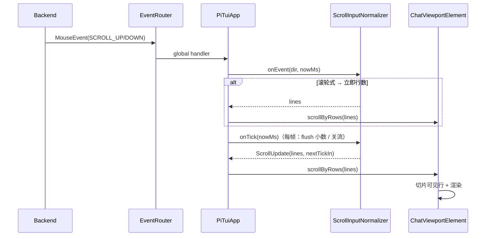
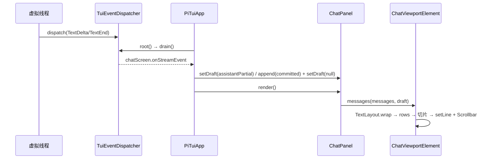

# Phase 3 TUI 对齐 Codex CLI — 设计文档

> **目标**：以 Codex CLI（Rust ratatui + crossterm）的 TUI 架构为参考，重构 pi-java 会话记录层：
> P0 滚动输入归一化（ScrollStream 模型）+ P1 逻辑行 + 行级视口（reflow at render）。
> **前置**：Phase 3 TUI 已实现（chat / 流式 / 工具卡片 / 状态栏 / slash / 选择器），
> Windows 输入与滚轮事件链路已通（`NoMode2027JLineBackend`，commit `c66524a`）。
> **流程**：本文档经人审核通过后，再按 §8 任务清单实施。

---

## 1. 背景与问题

### 1.1 用户反馈汇总（本轮前的交互问题）

| # | 反馈 | 状态 |
|---|------|------|
| 1 | 输入框无 `>`/光标、不在底部、无分割线 | 已修复（EditorComponent + 静态光标 + Separator） |
| 2 | 无流式输出 | 已修复（draft bubble 逐字渲染） |
| 3 | 白色空白框、每段对话白色边框/背景 | 已修复（纯文本、无边框，commit `c3f8d08`/`a85b890`） |
| 4 | 工具调用显示错乱/带边框 | 已修复（ToolCallCard 纯文本） |
| 5 | 底部 token 不更新 | 已修复（`ff5d01e` usage 先赋值再快照） |
| 6 | Windows 下 bash 不可用 | 已修复（settings `shellPath` 对齐 pi，`5b99ed6`） |
| 7 | 鼠标/触控板上下滚动无效 | 已修复事件链路（`c66524a` X10→SGR），**但滚动手感未归一** |
| 8 | 上下滚动后内容彻底乱掉 | **根因未除**（见 §3.2，ListWidget 部分行缺陷） |
| 9 | 流式/工具输出偶发交错、resize 后错位 | **根因未除**（宽度折行烧进渲染缓存） |

### 1.2 本轮范围

只处理 7/8/9 的根因，其余维持现状。

---

## 2. 参考对象与依据

### 2.1 Codex CLI TUI（Rust）

- 架构：全屏 alternate screen + ratatui widget 树 + 帧差量渲染 + tick 事件循环；crossterm 统一跨平台 key/mouse/paste。
- 会话记录：HistoryCell 存**逻辑行**（width-agnostic），渲染时 `transcript_lines_with_joiners(width)` 折行，视口按**行**滚动。
- 滚动输入：`codex-rs/tui2/src/tui/scrolling/mouse.rs`（PR #8357，merged）——事件流模型 + 密度归一。
- 流式换行：PR #8761（merged）——**不在流式时把折行烧进历史**，逻辑行在渲染时 reflow。

### 2.2 TamboUI（Java，0.4.0）

- 定位：Java 的 Ratatui 移植（项目 `08-phase3` §1 已定）。官方 demo `fakodex-demo` 即 Codex 风格聊天助手。
- 会话容器：`ListElement`（widgets-src `ListWidget`）行级滚动；`Scrollbar`/`ScrollbarState` 为公开 API。

### 2.3 结论

**参考的是架构模式与 UX 语义，不抄代码**。Codex 的两个设计直接对应我们的 7/8/9：

1. **滚动事件流归一化**（解决滚轮/触控板手感不一致）；
2. **逻辑行 + 渲染时 reflow**（解决滚动/resize 后内容错乱）。

---

## 3. 差距分析与架构决策

### 3.1 对照表

| 层 | Codex TUI2 | pi-java 现状 | 差距 |
|---|-----------|-------------|------|
| 渲染引擎 | ratatui widget 树 + 帧差量 | TamboUI widget 树 + 帧差量 | 同源，不动 |
| 终端输入 | crossterm 归一化 key/mouse | Panama + JLine Windows 补丁 | 已可用 |
| 事件循环 | tick + 事件流 | 50ms tick + `TuiEventDispatcher` | 已一致 |
| 会话记录 | HistoryCell 逻辑行 + 行级视口 | `ListElement`（行级滚动但状态私有） | **重构** |
| 滚动输入 | ScrollStream 归一化 + 配置旋钮 | `ListElement` 每事件硬编码 ±3 行 | **新增** |
| 流式 | 逻辑行 reflow（不烧宽度） | 预换行 + width 缓存 | **重构** |
| 底部窗格 | composer + 状态 + 快捷键 | `>` prompt + 静态光标 + StatusBar | 已接近 |
| 主题 | 语义色约定 | PiTheme TCSS | 已接近 |
| 测试 | insta 快照 | 渲染/输入单测 | 可补 |

### 3.2 两个根因（已从 TamboUI 0.4 源码确认）

**根因 A：`ListWidget` 部分行滚动缺陷。**
`ListWidget.render`（`.agents/tamboui-0.4/widgets-src/.../list/ListWidget.java` L178-199）：

```java
int startLine = Math.max(0, scrollOffset - currentOffset);
int visibleItemHeight = Math.min(itemHeight - startLine, listArea.bottom() - y);
Rect itemArea = new Rect(contentX, y, contentWidth, visibleItemHeight);
items.get(i).widget().render(itemArea, buffer);   // startLine 未传给 widget
```

当滚动落在某条多行消息中间（`startLine > 0`）时，widget 仍从自己的第 0 行开始渲染，
可见区显示的是该消息**顶部**而不是续行——这就是"上下滚动后内容彻底乱掉"的直接原因。

**根因 B：`ListElement` 的 `ListState` 私有，外部无法驱动。**
`ListElement.listState` 为 `private final`，无 `state()` 访问器、无外部 `scrollBy` 入口；
滚轮事件在 `handleMouseEvent` 中硬编码 `scrollBy(±3)`。归一化滚动无法接线，只能：

- fork `ListElement`（vendor 900+ 行，升级需 diff）；或
- 反射取私有字段（脆弱）；或
- **自研行级视口（推荐，见决策 1）**。

### 3.3 架构决策

**决策 1：自研 `ChatViewportElement` 替换 `ListElement` 作为会话容器。**

对齐 Codex HistoryCell 模式：消息 → 逻辑行 → 渲染行（每帧按当前宽度 reflow）→ 行级 `ScrollState` 切片渲染。
自持滚动状态，天然解决根因 A/B；复用 TamboUI 公开 API（`StyledElement`、`Scrollbar`/`ScrollbarState`、`Buffer.setLine`）。

**决策 2：逻辑行模型（width-agnostic）+ 渲染时折行。**

消息内容只存逻辑行（换行符为界、含缩进/等宽/样式元数据），折行是渲染期派生物。resize/滚动不再破坏内容。

**决策 3：滚动输入归一化（移植 Codex ScrollStream 模型）。**

`ScrollInputNormalizer` 纯状态机（无 I/O、可单测），消费 SCROLL_UP/DOWN 事件流，输出归一化行数；
`PiTuiApp` 全局鼠标 handler 驱动 `ChatViewportElement.scrollByRows`。

**决策 4：流式草稿并入视口。**

删除 ChatScreen 中"列表下方独立 draft 行"，流式文本作为视口内最后一条消息渲染（对齐 Codex）。
消除 draft 行与列表之间的空白框/闪烁问题，`Separator` 一并移除。

---

## 4. P0 — 滚动输入归一化（ScrollStream 模型）

### 4.1 模型（对齐 Codex PR #8357）

终端把滚轮/触控板都编码为离散 SCROLL 事件，且密度差异巨大（实测一格物理滚轮刻度 = 1/3/9 个事件）。
处理为**短事件流**：

1. **流切分**：首个事件开启流；空闲间隔（`STREAM_GAP_MS`，默认 100ms）或方向翻转结束流。
2. **归一化**：原始事件按 per-terminal `scroll_events_per_tick` 折算为 tick 等价量。
3. **滚轮式（wheel）**：每物理刻度固定 `scroll_wheel_lines`（默认 3）行，立即 flush。
4. **触控板式（trackpad）**：每事件 `scroll_trackpad_lines / min(events_per_tick, 3)` 行，
   小数累积 + 跨流结转 + draw tick（~60Hz）合并 flush + 有界加速。
5. **auto 模式**：先按触控板保守起步；首个 tick 当量事件在 `wheel_tick_detect_max_ms` 内到达 → 提升为滚轮式；
   1 事件/刻度的终端按流时长兜底。
6. **有界加速**：`multiplier = clamp(1 + eventsInStream / accelEvents, 1..accelMax)`（默认 30 事件 → 最大 3×）。
7. **上限**：`MAX_EVENTS_PER_STREAM = 256`、`MAX_ACCUMULATED_LINES = 256`。
8. **配置逃生舱**：`tui.scroll_mode / scroll_events_per_tick / scroll_wheel_lines / ... / scroll_invert`。

### 4.2 配置（settings.json）

对齐 pi config `[tui]`，在 `Settings` 增加 `tui` 段：

```java
// pi-java-coding-agent .../core/Settings.java（JSON 边界，snake_case 直映）
public Tui tui;

/** tui 段（对齐 Codex TUI2 tui.scroll_*，PR #8357）。 */
public record Tui(
    String scrollMode,               // auto | wheel | trackpad；默认 auto
    Integer scrollEventsPerTick,     // 默认 3；Warp/Ghostty≈9，WezTerm/iTerm/VS Code≈1
    Integer scrollWheelLines,        // 默认 3（每物理滚轮刻度行数）
    Integer scrollTrackpadLines,     // 默认 1
    Integer scrollTrackpadAccelEvents, // 默认 30
    Integer scrollTrackpadAccelMax,  // 默认 3
    Boolean scrollInvert,            // 默认 false
    Integer scrollWheelTickDetectMaxMs, // 默认 12
    Integer scrollWheelLikeMaxDurationMs, // 默认 200
    Boolean disableMouseCapture      // 默认 false；true = 关鼠标捕获，允许终端原生选择文本
) {}
```

`ScrollConfig.from(Settings)` 映射（tui 模块内，空值回落默认）。

### 4.3 类设计

```java
// com.pijava.tui.util.ScrollConfig
public record ScrollConfig(
    String mode,
    int eventsPerTick,
    int wheelLines,
    int trackpadLines,
    int trackpadAccelEvents,
    int trackpadAccelMax,
    boolean invert,
    int wheelTickDetectMaxMs,
    int wheelLikeMaxDurationMs,
    int streamGapMs
) {
    public static ScrollConfig defaults();
    public static ScrollConfig from(Settings settings);
    boolean wheelLike();     // mode == "wheel"
    boolean trackpadLike();  // mode == "trackpad"
}

// com.pijava.tui.util.ScrollUpdate
public record ScrollUpdate(int lines, long nextTickInMs) {
    static ScrollUpdate immediate(int lines);
    static ScrollUpdate none();
}

// com.pijava.tui.util.ScrollInputNormalizer
/**
 * 终端原始滚轮/触控板事件流 → 归一化行滚动（移植 Codex TUI2 PR #8357）。
 * 纯状态机：不碰 I/O、不依赖 TamboUI，可单测。
 */
public final class ScrollInputNormalizer {
    public ScrollInputNormalizer(ScrollConfig config);
    public ScrollInputNormalizer();               // defaults

    /** 投递一个滚动事件（direction: +1 下 / -1 上）。返回本次应立即滚动的行数。 */
    public int onEvent(int direction, long nowMs);

    /** 每个 draw tick 调用：flush 触控板小数、关闭超时事件流。 */
    public ScrollUpdate onTick(long nowMs);

    /** 重置（会话切换 / 配置变更）。 */
    public void reset();
}
```

内部状态：`StreamKind { UNKNOWN, WHEEL, TRACKPAD }`、`streamStartMs`、`lastEventMs`、
`eventsInStream`、`fractionalLines`（跨流结转）、`lastDirection`。

### 4.4 集成点

- `PiTuiApp.onEvent`：新增 `MouseEvent` 分支（`MouseEventKind.SCROLL_UP/DOWN`）。
  `EventRouter.route` 对 MouseEvent **先跑全局 handler 再路由元素**（源码已确认），
  因此全局 handler 消费后元素不再收到，`ListElement` 内置 ±3 行为被旁路（容器替换后不再存在）。
- `PiTuiApp.root()`：每帧调用 `normalizer.onTick(now)`，flush 结果 → `chatPanel.scrollByRows(lines)`。
- 键盘导航（输入为空时）：由 `PiTuiApp` 直接调用 `chatPanel.scrollByRows(±1 / ±page)` / `scrollToBottom()`，
  不再依赖 ListElement 的 key handler。
- `NoMode2027JLineBackend` 不动（X10→SGR 链路已完成）。



---

## 5. P1 — 逻辑行 + 行级视口

### 5.1 模型

```java
// com.pijava.tui.component.LogicalLine —— 与终端宽度无关（PR #8761 语义）
public record LogicalLine(
    String markup,          // 原始文本（含 TamboUI markup 标记）
    int initialIndent,      // 首行缩进（格）
    int subsequentIndent,   // 续行缩进（格）
    boolean preformatted,   // 代码块/工具输出：不折行，超宽硬截断
    Style style             // 整行样式（dim/bold/color，EMPTY=默认）
) {}

// com.pijava.tui.component.RenderRow —— 逻辑行在给定宽度下折行后的单行产物
public record RenderRow(String text, Style style) {}

// com.pijava.tui.util.TextLayout —— 显示宽度感知的布局工具
public final class TextLayout {
    /** 按 \n 切逻辑行（保留空行；preformatted 整体一行）。 */
    public static List<LogicalLine> split(String text, boolean preformatted);
    /** 逻辑行 → 渲染行（按 width 折行；preformatted 硬截断 + "…"）。 */
    public static List<RenderRow> wrap(List<LogicalLine> lines, int width);
    /** 显示宽度（宽字符计 2，沿用 MessageBubble.isWide 规则）。 */
    public static int displayWidth(String s);
}
```

### 5.2 `ChatViewportElement`

```java
// com.pijava.tui.component.ChatViewportElement
/**
 * 会话记录视口：以行（row）为单位滚动，渲染时对消息逻辑行 reflow。
 * 对齐 Codex TUI2 HistoryCell（逻辑行 + 行级视口 + sticky 跟随）。
 */
public final class ChatViewportElement extends StyledElement<ChatViewportElement> {

    /** 行级滚动状态。 */
    public static final class ScrollState {
        public int offset();
        public boolean userScrolledAway();
        /** 归一化滚动入口：delta 行；上滚标记 userScrolledAway，滚到底恢复跟随。 */
        public void scrollByRows(int delta, int totalRows, int visibleRows);
        public void scrollToBottom();
        public void clamp(int totalRows, int visibleRows);  // resize/新内容后夹取
    }

    public ChatViewportElement messages(List<ChatMessage> messages, ChatMessage draft);
    public ChatViewportElement scrollbar(boolean enabled);
    public ScrollState scrollState();

    @Override
    protected void renderContent(Frame frame, Rect area, RenderContext context);
}

// com.pijava.tui.component.ChatPanel（改造）
public final class ChatPanel {
    public void append(ChatMessage message);
    public void setDraft(ChatMessage draft);   // 流式草稿并入视口（TextDelta 时更新，TextEnd 时置 null）
    public void scrollByRows(int delta);
    public void scrollToBottom();
    public int size();
    public ChatMessage last();
    public Element render();                   // 返回 ChatViewportElement
}
```

渲染管线（每帧）：

```java
// renderContent 伪码
int contentWidth = Math.max(1, area.width() - (scrollbar ? 1 : 0));
List<RenderRow> rows = flatten(messages, draft, contentWidth);  // 消息 → 逻辑行 → 折行
state.clamp(rows.size(), area.height());                        // sticky 跟随 + resize 夹取
for (int i = 0; i < area.height() && state.offset() + i < rows.size(); i++) {
    RenderRow row = rows.get(state.offset() + i);
    frame.buffer().setLine(area.x(), area.y() + i, toLine(row, contentWidth));
}
// 右侧 Scrollbar（复用 TamboUI 公开 API）：
//   ScrollbarState.contentLength(rows.size()).viewportContentLength(area.height()).position(offset)
```

要点：

- **切片即滚动**：`offset` 是行号，`rows.get(offset+i)` 直接取到正确续行，从根上消除根因 A。
- **reflow at render**：`flatten` 每帧按当前宽度派生，resize 后内容逐字一致（消除根因 B）。
- **sticky 跟随**：新消息到达时，`userScrolledAway == false` → 钉底；用户上滚 → 暂停；滚回底部 → 恢复。
- **性能**：只对**可见行**建 `Line` 渲染对象；长会话可后续加行缓存（本轮不做）。

### 5.3 流式草稿并入视口



`ChatScreen` 变更：

- 删除 `draftBubble()` 与 `separator()`；`render()` 变为 `column(chatPanel.render().fill(), editor.render())`。
- `TextDelta/ThinkingDelta` → `chatPanel.setDraft(...)`；`TextEnd/ThinkingEnd` → `append(...)` + `setDraft(null)`。
- 输入行与列表之间保留 1 行空白（对齐 fakodex demo），不再有独立"白框"。

`MessageBubble`/`ToolCallCard` 变更：由"返回 Element"改为"返回 `List<LogicalLine>`"，
工具名/状态行与参数行均进逻辑行（参数 `preformatted`，超宽硬截断 500/200 字符规则保留）。

---

## 6. 影响文件

| 操作 | 文件 |
|------|------|
| 新建 | `pi-java-tui/.../util/ScrollConfig.java`、`ScrollUpdate.java`、`ScrollInputNormalizer.java`、`TextLayout.java` |
| 新建 | `pi-java-tui/.../component/LogicalLine.java`、`RenderRow.java`、`ChatViewportElement.java` |
| 修改 | `ChatPanel.java`（视口替换 ListElement）、`ChatMessage.java`、`MessageBubble.java`、`ToolCallCard.java` |
| 修改 | `ChatScreen.java`（draft 并入视口、删 Separator）、`PiTuiApp.java`（鼠标/键盘滚动接线 + normalizer 注入） |
| 修改 | `Settings.java`（新增 `Tui` 段）、`TamboUIAdapter.java`（如需要 scrollbar 工厂） |
| 修改 | `pi-dark.tcss`/`pi-light.tcss`（ChatViewport 滚动条样式，可选） |
| 测试 | 新建 `ScrollInputNormalizerTest`、`ChatViewportElementTest`、`TextLayoutTest`、`PiTuiAppScrollTest`；更新 `ChatPanelTest`、`MessageBubbleTest`、`ChatScreenTest` |

新增依赖：无（全部基于 TamboUI 0.4.0 现有公开 API）。

---

## 7. 测试策略

### 7.1 单元测试

`ScrollInputNormalizerTest`（对齐 Codex `cargo test -p codex-tui2` 的 scroll tests）：

- 流切分：空闲间隔（> `streamGapMs`）结束流；方向翻转结束流并开启新流。
- 密度归一：`events_per_tick = 1/3/9` 时，一格物理滚轮刻度均 ≈ `wheelLines` 行。
- 滚轮式：立即 flush；方向为 +1/-1；`scroll_invert` 反转。
- 触控板式：小数累积跨流结转；draw tick（onTick）合并 flush；60Hz 语义（tick 间隔内不重复 flush）。
- 有界加速：`accelEvents` 内事件数越多倍率越高，封顶 `accelMax`；大流封顶 256 事件/256 行。
- auto 提升：tick 当量事件在 `wheelTickDetectMaxMs` 内到达 → wheel；1 事件/刻度终端按流时长兜底。
- 配置覆盖：mode=wheel/trackpad 强制行为；非法配置回落默认。

`TextLayoutTest`：

- 逻辑行切分（`\n`、空行、CRLF、preformatted 单行）。
- 折行：单词边界、超长单词硬断、宽字符计 2、缩进（首行/续行）、preformatted 超宽截断加 "…"。
- 宽度 1 与 0 的边界。

`ChatViewportElementTest`（FakeBackend 渲染断言）：

- 行切片：`offset` 落于多行消息中部时，渲染行与未滚动时逐字一致（回归根因 A）。
- sticky：新消息到达且未上滚 → 钉底；上滚后 → 不跳；滚回底部 → 恢复。
- resize：宽度变化后 reflow，内容逐字一致（回归根因 B）；高度夹取不越界。
- 滚动条：position/contentLength/viewportContentLength 正确。

### 7.2 集成测试

`PiTuiAppScrollTest`（FakeBackend）：提交 → 流式 → 注入 SCROLL 事件序列 → 断言视口偏移与渲染行；
输入为空时 Up/Down/PageUp/PageDown/Home/End 直接驱动视口。

### 7.3 真实终端冒烟（00 流程 §5b 扩展）

- [ ] 滚轮：同一终端一格物理滚轮刻度 ≈ 3 行；不同终端手感一致（配置可调）
- [ ] 触控板：滑动流畅、不飞、无 overshoot（快速滑到底不弹回）
- [ ] 滚动/窗口 resize 后内容逐字不乱
- [ ] 流式中视口钉底；上滚暂停跟随；回底部恢复
- [ ] 工具调用/输出长行不折行截断显示，滚动不串行
- [ ] 键盘导航（空输入时）行为不变

---

## 8. 验收标准（可量化）

1. `mvn verify` + Checkstyle 零错误零警告。
2. 新增单测 ≥ 30 项（normalizer 状态机 ≥ 15、TextLayout ≥ 8、viewport ≥ 7），全部通过。
3. 滚轮归一化：同一终端物理刻度行数 = `wheelLines` ± 1；`events_per_tick` 1/3/9 三种密度下一致。
4. 触控板：单帧最多 `MAX_ACCUMULATED_LINES` 行；快速滑到底不 overshoot。
5. 滚动与 resize 回归：`ChatViewportElementTest` 行级快照断言（滚动前/后逐字一致）。
6. 真实终端冒烟清单（§7.3）全过；任一失败修复后重跑并把场景补进自动化。

---

## 9. 风险与缓解

| 风险 | 影响 | 缓解 |
|------|------|------|
| 自研视口替换 ListElement 属重构 | 中/中 | 现有 ChatPanelTest/MessageBubbleTest/FakeBackend 全量回归；渲染改动按 §7.1 快照断言 |
| 滚动默认参数未按 Windows Terminal 实测校准 | 中/低 | 提供 `tui.scroll_*` 配置逃生舱；auto 模式保守起步；文档标注默认值来源（Codex 实测） |
| TamboUI 后续升级 API 变化 | 低/低 | 视口仅用公开 API（StyledElement/Scrollbar/Buffer）；隔离层收敛 |
| 每帧 reflow 性能 | 低/中 | 只构建可见行；长会话行缓存列为后续优化项 |
| 流式草稿与提交消息去重 | 低/中 | TextEnd 时先 append 后 setDraft(null)，沿用现有 assistantStreamed 去重语义 |

---

## 10. 本轮不做

- 语法高亮 / diff 渲染（Phase 6）
- approval / onboarding / notification 等 Codex 产品特性
- inline（非 alternate screen）模式、`disable_mouse_capture` 默认开启（**v1.1 已提前实施**：regular 模式＝raw-scrollback inline，见 §11 v1.1）
- 软换行 joiner 与复制粘贴语义（TUI 无复制入口，LogicalLine 模型已预留）

---

## 11. 设计审查记录

### v1.0（2026-08-15 初稿）

- 以 Codex CLI TUI2（PR #8357 / #8761）为架构参考，确定"逻辑行 + 行级视口 + 滚动流归一化"三条主线。
- 从 TamboUI 0.4.0 源码确认两个根因（ListWidget startLine 缺陷、ListState 私有），据此选择自研视口而非 fork/反射。
- 流式草稿并入视口，消除独立 draft 行。
- 待审核后实施。

### v1.1（2026-08-15 实施评审：inline / raw-scrollback 模式）

用户实测后要求对齐 Codex CLI 的 `--no-alt-screen` / `tui.alternate_screen = "never"`：
**不要自定义滚动条，内容区交给终端原生 scrollback 滚动，只有输入框固定在底部。**
据此在 v1.0（fullscreen 全屏视口）之外新增 **regular（默认）＝ raw-scrollback inline 模式**：

- **模式映射**：`--tui-mode regular`（默认）/ settings `tuiMode` → `InlineTuiShell`（不进入 alternate screen、不开鼠标捕获）；`--tui-mode fullscreen` → 原 `ToolkitRunner`（alternate screen + 内部视口/滚动条）。两种模式各只有一条滚动条。
- **`InlineTuiShell`**（`com.pijava.tui.util`）：`InlineDisplay` + `TerminalInputReader` + 自绘渲染循环。聊天内容逐行 append 进终端主缓冲（原生滚动条/选中），底部固定区域（编辑器 + 状态栏）原地重绘；modal overlay 临时切入 alternate screen（主缓冲原样保留）再切回，避免重绘回卷。
- **`ScrollbackTranscript`**（`com.pijava.tui.util`）：提交消息按终端宽度 reflow 后逐行打印进 scrollback；流式草稿在原位置写（cursor-up + erase + 重写，`replaceLastBlock`），超屏高时退化为 append 兜底；TextEnd 时按渲染文本去重，草稿不重复打印。
- **`InlineRenderContext`**：绕过 `DefaultRenderContext` 的元素注册（规避 TamboUI 私有渲染线程标记），保留 StyleEngine CSS 主题解析。
- **验证**：新增 `ScrollbackTranscriptTest`（去重/原位重写/超屏退化）、`InlineTuiShellTest`（println/重写/overlay）、`PiTuiAppInlineTest`（端到端打印 + TextEnd 去重）；pi-java-tui 全量测试通过。
- **遗留**：inline 模式下超长草稿 off-screen 更新与终端滚动交互存在已知 artifact（与 Codex raw_output_mode 官方已知限制一致）。

### v1.2（2026-08-15 用户实测反馈：交互体验修复）

用户实测 regular（默认）模式后反馈三项交互问题，均已修复：

- **光标不停闪烁**：移除呼吸光标（`EditorElement` 色阶循环），改为静态青色块。任何动画都要求持续重绘，而每次重绘都会把终端光标拉回底部。
- **上下滚动无效**：`InlineTuiShell` 改为按需渲染——启动时、每个输入事件后、以及 `markDirty()`（异步流式增量/会话快照经 `TuiEventDispatcher.setWake` 唤醒）时各渲染一次；空闲时不再每 40ms 重绘。根因是 `InlineDisplay.redrawDisplayArea` 每次都会 erase+重写整个底部区域并把光标移到屏底，用户向上滚动 scrollback 后下一次重绘立即回卷，表现为"滚动没有反应"。
- **右侧没有滚动条**：regular 模式按 v1.1 决策不绘制自定义滚动条，滚动交给终端原生 scrollback；修复空闲重绘后，Windows Terminal 右侧原生滚动条可正常使用。需要应用内滚动条时使用 `--tui-mode fullscreen`（内部视口自带右滚动条 + 滚轮/拖拽）。

- **验证**：新增 `InlineTuiShellTest.idleLoopDoesNotWriteAfterInitialRender`（空闲 300ms 零写入）；`EditorElementTest` 改为断言静态光标色；pi-java-tui 全量 110 个用例通过。

### v1.3（2026-08-15 用户实测反馈：输入与多轮渲染）

用户再次实测后反馈三项问题，均已修复：

- **空格/换行无法输入**：`EditorComponent` 的 CHAR 分支用 `isBlank()` 过滤，把所有空白字符（空格、`\n`）都丢了；改为只丢弃空串与孤立 `\r`（Enter 由 app shell 处理），空格与换行正常输入。`isShiftEnter` 同时兼容 Windows 控制台把 Shift+Enter 以 CR/LF 字符形式送达的情况。
- **提交后无响应**：提交链路本身存在（`PiTuiApp.submit → InteractiveMode.submit → AgentSession.processPrompt`）；补充即时反馈——状态栏显示 `● running` 运行指示，模型错误以红色 Error 气泡进入会话记录而非只藏在状态栏。若模型真实存在但仍无响应，需要抓取状态栏/气泡中的具体错误（网络、鉴权、模型名）再定位。
- **多轮对话后渲染错乱**：两个根因。其一，消息文本未经转义直接进 TamboUI MarkupParser，模型输出中的 `[`/`]`/`\`（如 C 代码 `arr[0]`）被当作样式标签解析，新增 `TextLayout.escapeMarkup` 在 `MessageBubble` 统一转义；其二，thinking 流式结束（`ThinkingEnd`）已提交气泡后，run 完成时 `onEntry` 会再渲染一次同一内容，新增 `thinkingRendered` 去重。

- **验证**：新增 `EditorComponentTest.spacesAndNewlinesAreInserted`、`MessageBubbleTest.messageTextIsEscapedSoMarkupRendersLiterally`、`TextLayoutTest.escapeMarkupEscapesBracketsAndBackslashes`、`ChatScreenTest.thinkingEntryIsDeduplicatedAfterThinkingEnd`；pi-java-tui 全量 114 个用例通过。

### v1.4（2026-08-15 对齐 Codex CLI 交互模式：全屏默认 + Enter 发送 / Shift+Enter 换行）

用户确认“对齐 Codex CLI TUI 交互模式”后实施：

- **默认模式改为 fullscreen**：`tuiModeFrom` 无配置时回退 `"fullscreen"`（alternate screen + 内部视口/滚动条），与 Codex 默认 `tui.alternate_screen = "auto"`（全屏）一致；`--tui-mode regular` / settings `tuiMode="regular"` 保留为逃生舱（对应 Codex `--no-alt-screen` / `"never"`）。
- **Enter 发送、Shift+Enter 换行**：`TamboUIAdapter.isSendEnter` 改为“无修饰键的 Enter/CR 才发送”（对齐 Codex composer `submit=[Enter]`）；`isNewlineEnter` 覆盖 CHAR LF、Shift+Enter、Alt+Enter（对齐 Codex editor `insert_newline=[Ctrl+J, Ctrl+M, Enter, Shift+Enter, Alt+Enter]`）。`PiTuiApp.onKeyEvent` 先判发送再判换行。
- **LF 兜底（关键修复）**：新增同包名 `dev.tamboui.tui.event.EventParser` 覆盖（classpath 本地类优先，升级 diff 点仅 `parseControlChar`）：CR（0x0D）→ `KeyCode.ENTER`（发送），LF（0x0A）→ `KeyEvent.ofChar('\n')`（换行）。Windows ConPTY / Zed 等把 Shift+Enter 报成 LF 的终端从此可用；这正是 Codex `c0_control_char_to_ctrl_char` 把 U+000A 归一化成 Ctrl+J→insert_newline 的 C0 兜底逻辑（openai/codex #20555、PR #20798）。
- **粘贴多行**：仍走 `PasteEvent`，保留换行且不触发发送。
- **提示文案**：输入框占位改为 “Type a message… (Enter send, Shift+Enter newline)”；`--help` 与 `Args` javadoc 的 `--tui-mode` 默认值同步改为 fullscreen。
- **验证**：`TamboUIAdapterTest.enterSendsAndLfOrShiftEnterInsertsNewline`、`PiTuiAppInputTest.enterSubmitsAndLfInsertsNewline`（端到端：CR 发送、LF 换行、多行发送）、`slashCommandsRespondToSendKey` / `submittedUserMessageRendersAsBubble` 改用 CR 发送；pi-java-tui 全量 113 个用例通过。
- **遗留**：`app.message.followUp`（Alt+Enter 排队）与 Alt+Enter=换行 存在键位占用（此前 Alt+Enter=发送 时同样不可达），后续可把排队移到 Ctrl+Enter 或 Tab（Codex queue 默认键）再评估。

### v1.5（2026-08-15 用户实测：工具调用结果重复执行 / 输出重复）

用户反馈“使用python 输出hello”后 write 块重复 4 次。排查后确认**不是渲染重复，而是同一工具真的被执行了 4 次**：

- **根因**：`OpenAICompletionsApi.buildParams` 只序列化了 system/user/assistant 文本消息，`Message.ToolResultMessage`（工具结果）和 AssistantMessage 里的 `ToolUseContent`（模型自己的 tool_calls）**全部被丢弃**。模型第二轮看不到 write 的结果和自己的调用记录，于是反复调用 write，直到随机停止——TUI 忠实渲染了每一次真实执行。
- **修复**：`buildParams` 完整序列化 OpenAI 兼容协议——assistant 消息带 `tool_calls`（id/name/arguments），工具结果序列化为 role=tool 的 `tool_call_id` 消息（DeepSeek/OpenAI/Mistral 共用此路径）。
- **验证**：新增 `OpenAICompletionsApiRequestTest`（工具结果回传 + assistant tool_calls 断言，2 例）；`AgentSessionToolIntegrationTest.laterRunsDoNotReplayEarlierTranscriptEntries` 固化“每轮条目只投递一次”不变量；全量测试与 `install -DskipTests`（SpotBugs）通过。
- **排查中已排除**：AgentSession 每轮结束的全量 transcript 重放（`driveRun`）一度被怀疑是重复源，实测 `ActionExecutor.run` 每次 run 会清空 transcript，重放只覆盖当轮，并非重复来源（相关改动已回退）。

### v1.6（2026-08-15 用户实测：任务“没有下文”——工具调用被流式解析丢弃）

用户反馈“用c语言实现hello”时模型只回复“好的，我用c语言来创建”就结束，hello.c 未生成。

- **根因**：OpenAI 兼容端点（DeepSeek 实测）把 tool call 拆成多个 chunk 发送，常见形态是 chunk1 只有 `id`、chunk2 才有 `function.name + arguments`。`OpenAICompletionsApi.streamInternal` 旧逻辑要求 `id` 与 `function` 必须**同 chunk 出现**才启动工具调用，分块到达时工具调用被整体丢弃 → `toolStarted=false` → 结束原因被算成 `stop` → harness 认为 run 正常完成，只渲染了前置文本，工具从未执行。
- **修复**：新增 `ToolCallAccumulator`（纯逻辑、可单测）：第一个工具 chunk（无论只含 id/name/arguments 哪一项）就发出 `ToolCallStart`，按槽位累积 id/name，结束统一发 `ToolCallEnd`，只要出现过工具 chunk，stopReason 即为 `tool_use`。
- **验证**：`ToolCallAccumulatorTest`（id/name 分块、参数多片拼接、无工具 chunk 三种形态，3 例）；连同 v1.5 的 `OpenAICompletionsApiRequestTest`；全量测试与 `install -DskipTests`（SpotBugs）通过。
- **说明**：若模型真的没有发出工具调用（stopReason=`stop`），run 正常结束、只有文本回复，这是模型行为而非缺陷；本修复保证“模型确实发出了工具调用”时不再丢失。
- **遗留**：`StreamPartialBuilder` 与 `ToolCallAccumulator` 仍为单工具调用模型，并行（多 index）工具调用需后续支持多槽位。

### v1.7（2026-08-15 默认系统提示词补充沟通风格，对齐 Claude Code communication style）

用户反馈工具调用后模型“不说文件已生成”直接进入下一步（写完 compare_ints.py 后直接说“运行一下验证结果：”）。对照三家参考实现后确认：Codex / Claude Code / pi 都没有写死“每次工具结果后必须说一句”的规则——工具结果由 UI 卡片呈现，系统提示词只约束“什么时候说话、怎么说”。pi-java 原 `DEFAULT_SYSTEM_PROMPT` 只有一句身份描述，比 pi 的两条固定准则还少，模型便按自身话少风格跳过交代。

用户选择方案 1（不写死专项规则，补统一沟通风格）：

- `AgentSession.DEFAULT_SYSTEM_PROMPT` 追加 Communication style 块，对齐 Claude Code communication-style 提示词并适配 pi-java TUI（工具调用以卡片显示）：
  - 补回 pi 的两条固定准则：Be concise in your responses；Show file paths clearly when working with files；
  - 工具调用会以卡片显示其结果，不要在文本里逐条复述卡片内容；
  - 第一次工具调用前用一句话说明意图；工作过程中只在关键节点（发现、转向、阻塞）给一句话更新；
  - 工具调用前不要用冒号结尾（对应 Claude Code tool-call colon avoidance）；
  - 每轮结束用 1-2 句总结“改了什么、下一步是什么”。
- 不采用“每次工具完成后必须播报一句”的硬规则（会变成噪音，与 Codex/pi 极简路线冲突）。
- 验证：pi-java-coding-agent 及依赖模块（telemetry/ai/agent）全量测试通过（0 失败）；`install -DskipTests`（SpotBugs）通过。

### v1.8（2026-08-15 用户实测：bash 命令“\n”被传输破坏 / 无默认超时）

用户实测“使用python实现两个整数比较大小”：write 与前面几条 bash 正常，但最后一条 UTF-8 验证命令停在 running、无结果。两个根因：

- **根因 1：Windows 命令行传参破坏反斜杠（已复现）**。`DefaultShellExecutor` 在 Windows 用 `bash --login -c <command>`（ARGV 传输），命令经 Windows 命令行 → Git Bash（MSYS）参数解析时，双引号内的反斜杠被 C 风格解转义：`echo -e "5\n3"` 实际变成 `echo -e "5n3"`（实测 od 输出 `5 n 3`），Python `int("5n3")` 抛 ValueError，脚本打印“输入错误”后 exit 0。第一次输出因终端编码显示为乱码，模型误判为“中文编码问题”，加 `PYTHONIOENCODING=utf-8` 重试仍失败。对照实验：命令写进脚本文件执行、或经 stdin 传给 `bash --login -s` 均正常输出“5 大于 3”，仅 `-c` 传参路径损坏。
- **根因 2：bash 工具无默认超时**。`BashTool` 默认 `timeout=0` 即无限等待，命令一旦挂起，工具调用永久 `running`，模型拿不到结果也无法续跑，表现为“最后的结果没有输出”。

修复（对齐 Claude Code / Codex / pi 生态）：

- **A. Windows bash 改为 stdin 传输**：`configFor` 对 Git Bash / MSYS 返回 `bash --login -s` + STDIN（命令写入 stdin），绕过 MSYS argv 反斜杠转换（与 legacy WSL 的 `bash -s` 方案一致）；`DefaultShellExecutorTest` 的 Windows 假 bash 改为 `findstr` 读 stdin 回显。
- **B. BashTool 默认超时**：默认 120 秒（Claude Code 官方 Bash 默认 2 分钟、Codex exec 默认 120s、pi 生态 pi-bash-timeout 默认 120s），上限 600 秒（Claude Code 10 分钟 / pi-bash-timeout 上限 600s）；模型显式传 `timeout` 优先（`filter(t -> t > 0).orElse(120)`），长任务不会被误杀；超时返回 error 卡片并附超时前部分输出（截断 2000 字符）；description/schema 告知模型默认值与上限。

- **验证**：`BashToolTest` 新增 3 例（未传 timeout 默认 120、显式 300 透传、601 超上限拒绝）；`DefaultShellExecutorTest` 更新 1 例（stdin 语义）；pi-java-agent-core 全量测试通过（0 失败）；`install -DskipTests`（SpotBugs）通过。
- **遗留**：STDIN 传输下命令内的交互式 stdin（如 `read`）与命令输入共享管道，非交互工具场景可用（pi legacy WSL 同款限制）。

### v1.9（2026-08-15 用户反馈：用户输入与模型响应等无区分度 → 对齐 Codex CLI TUI 消息视觉分层）

用户反馈“用户输入和模型响应等内容都混在一起，没有区分度”，要求参考 Codex CLI TUI 交互优化。先输出方案并经用户确认（“可以，一起修改”），方案如下：

- **问题**：`MessageBubble` 中 User/Assistant 均为无前缀裸文本；ToolResult 无缩进；消息块间无空行；轮次间无分隔线。
- **方案（对齐 Codex TUI 源码，codex-rs/tui history_cell）**：
  1. 消息前缀：User 首行 `› `（bold dim）、Assistant 首行 `• `（dim），续行缩进 2 格（`LogicalLine.initialIndent/subsequentIndent`，`TextLayout.wrap` 渲染时应用）；
  2. 工具层级：工具参数行缩进 4 格 dim（需给 `TextLayout.hardTruncate` 补 indent 支持，preformatted 行当前忽略缩进）；ToolResult 缩进 4 格 dim、错误加 `! ` 红色前缀（`ChatMessage.ToolResult` 增加 isError 字段）；
  3. 消息间距：`ChatViewportElement.flatten` 在消息块间插入空行（渲染层处理，不改消息模型）；
  4. 轮次分隔线：`ChatScreen.onStreamEvent` 收到 `StreamDone` 时，若本轮有工具调用则追加 `── Worked for X • Local tools: N ──` 分隔线（dim），耗时与工具数由 TUI 侧统计（submit 记 startTime + ToolCallStart 计数），不动 coding-agent 的 RunStatus。
- **影响面**：pi-java-tui（ChatMessage/MessageBubble/ToolCallCard/ChatViewportElement/ChatScreen/TextLayout）+ 测试；ScrollbackTranscript 复用 MessageBubble 自动同步。
- **实施要点**：前缀用纯字符（`› `/`• `），不用 markup 标签，避免标签字符干扰 `TextLayout.wrap` 宽度计算；消息间空行在 `ChatViewportElement.flatten` 插入（渲染层，不改消息模型）；轮次分隔线由 `PiTuiApp.submitPrompt` 在 `SessionResult.statusFuture()` 完成后触发（`InteractiveMode.submit` 改为返回 `SessionResult`，`SessionResult` 新增非阻塞 `statusFuture()`），保证分隔线落在 transcript replay 之后。
- **验证**：pi-java-tui 全量 119 例通过（0 失败），`install -DskipTests`（SpotBugs）通过；新增/更新：`MessageBubbleTest`（前缀/分隔线/工具错误标记）、`ChatScreenTest`（有工具轮次加分隔线、纯对话轮次不加，2 例）、`TextLayoutTest`（preformatted 行 indent）、`ChatViewportElementTest`/`ScrollbackTranscriptTest`/`PiTuiAppInputTest` 按新行模型适配。
- **状态**：已完成。

### v1.10（2026-08-15 启动欢迎横幅：软件介绍 + 版本 + 使用提示）

用户要求“参考 codex，启动之后先输出软件介绍以及版本等信息”。Codex CLI 启动时播放 logo 动画并展示版本/状态信息；pi-java 实现为静态欢迎横幅（动画留待后续）：

- `ChatScreen.showWelcome()` 追加一条 `ChatMessage.System` 横幅：`pi-java v0.1.0-SNAPSHOT`（复用 `Version.VERSION`）、简介 “Pure Java AI coding agent — a port of pi”、快捷键提示（Enter 发送 / Shift+Enter 换行 / /help）。
- `PiTuiApp.showWelcomeOnce()` 在 `start()`（fullscreen）与 `startInline()`（regular）中调用一次，两种模式都显示；`welcomeShown` 标志防止重复。
- **验证**：新增 `ChatScreenTest.showWelcomeAppendsSystemBanner`；`PiTuiAppInlineTest` 消息数断言计入横幅（2→3）；pi-java-tui 全量测试通过（0 失败）；`install -DskipTests`（SpotBugs）通过。
- **遗留**：Codex 的启动 logo ASCII 动画（frames 帧驱动）未移植，当前为静态横幅；后续可用现有 TickEvent/渲染循环做动画版。

### v1.11（2026-08-15 启动欢迎动画：Codex 风格 spinner + 逐行 reveal）

用户要求“实现动画版本”。参考 Codex `AsciiAnimation`（帧序列 + frame_tick 驱动），pi-java 实现为启动 overlay 动画：

- **`WelcomeOverlay`**（`com.pijava.tui.screen`，新文件）：对齐 Codex 启动卡片（`>_` 标题 + 圆角边框 + model/directory + Tip），内容为 `>_ pi-java (v0.1.0-SNAPSHOT)`、`model: <modelName> <level>   /model to change`（来自 `session.harness().getModel()/getThinkingLevel()`）、`directory: <user.dir>`、`Tip: Enter 发送 · Shift+Enter 换行 · /help`；动画为卡片 6 行逐行 reveal（每行 2 帧，共 12 帧）；任意键立即跳过。
- **驱动**：`PiTuiApp.playWelcomeAnimation()` 用虚拟线程每 160ms `dispatcher.dispatch(welcome::advance)`，完成后 dispatch 关闭 overlay；`start()`（fullscreen）与 `startInline()`（regular）都触发，regular 模式经已有 overlay→alternate screen 机制显示。
- **可关闭**：`PiTuiApp` 新增 `startupAnimation` 构造参数（默认 true），测试统一传 false 避免动画干扰端到端断言。
- **修复**：启动横幅 `\\n` 误写成字面转义（PowerShell 转义层级错误），已改为 Java `\n`；`running` 是 boolean 非 AtomicBoolean，动画循环误用 `running.get()` 已修正。
- **验证**：新增 `WelcomeOverlayTest`（帧推进到完成、render 非空、任意键跳过，3 例）；pi-java-tui 全量测试通过（0 失败）；`install -DskipTests`（SpotBugs）通过。
### v1.12（2026-08-15 CSI-u 修饰键支持：Shift+Enter 在支持该协议的终端可换行）

用户反馈 Windows 下 Shift+Enter 仍触发发送（只有 Ctrl+J 换行）。根因是终端层限制：Windows Terminal/ConPTY 把 Shift+Enter 与 Enter 都发成 CR（\r），应用层拿不到修饰键，无法区分；Codex 官方同样依赖 Ctrl+J（issue #16121 官方回复、博客确认）。

- **修复**：`EventParser`（pi-java 覆盖类）新增 CSI-u（kitty keyboard protocol）解析——`parseCSIWithParams` 增加 `terminator == 'u'` 分支，`parseCsiU` 按 `ESC[<code>;<modifier>u` 解析（13=Enter、9=Tab、27=Esc、127=Backspace、32-126 可打印字符），修饰码复用现有 `parseModifierCode`（XTerm 编码）。`ESC[13;2u`（Shift+Enter）→ `KeyCode.ENTER + SHIFT` → `isSendEnter` 判 false、`isNewlineEnter` 判 true → 换行。
- **配套**：Windows Terminal 需在 settings.json 把 `shift+enter` 绑定为发送 `\u001b[13;2u` 才会生效；`ESC[13;u`（无修饰）仍解析为 Enter → 正常发送，行为不回归。
- **验证**：新增 `PiTuiAppInputTest.csiUShiftEnterInsertsNewlineAndDoesNotSubmit`（feed `\u001b[13;2u` 后输入框含换行且不发送，Enter 仍可提交）；`submittedUserMessageRendersAsBubble` 的“无气泡边框”断言限定到用户消息行（欢迎卡片自带圆角边框）；pi-java-tui 全量测试通过（0 失败）；`install -DskipTests`（SpotBugs）通过。
### v1.13（2026-08-16 工具参数 JSON 容错：执行结果不再静默丢失）

用户实测“今天广州天气如何”时第 3 个 bash 调用结果未返回：卡片显示 `•   running` 且参数为 `{_raw={"command": ...}}`，随后直接出现轮次分隔线。根因与修复：

- **根因**：deepseek 流式返回的工具 arguments JSON 不完整/含模型常见语法（未闭合、尾逗号等），`StreamPartialBuilder.parseArgs`（及低层 `ToolCallBuilder.toEnd`）解析失败后兜底成 `{"_raw": "<原始串>"}`，`BashTool.prepareArguments` 拿不到 `command` 键 → 命令无法执行 → 结果静默丢失；同时 assistant 渲染把 `• ` 前缀错误加到工具卡片行，且工具名缺失时显示空。
- **修复**：
  1. `StreamPartialBuilder.lenientMapper()`（ToolCallBuilder 复用）：开启 `ALLOW_COMMENTS / ALLOW_SINGLE_QUOTES / ALLOW_UNQUOTED_FIELD_NAMES / ALLOW_TRAILING_COMMA`，提升模型输出解析成功率；
  2. `BashTool.prepareArguments` 对 `_raw` 兜底：`extractCommand` 先宽容完整解析，失败再用正则提取 `"command":"..."` 并还原转义，命令可恢复执行；
  3. 渲染修复：`MessageBubble.renderBlocks` 的 `• ` 前缀只加给助手文本块（工具卡片不再被加前缀）；工具名缺失显示 `tool`；`{"_raw": ...}` 参数显示原始内容。
- **验证**：新增 `BashToolTest.rawArgumentsFallbackRecoversCommand`（合法嵌套 + 截断 JSON 正则提取）、`MessageBubbleTest.toolCardInAssistantBlocksGetsNoBulletPrefix` / `toolCardUnwrapsRawArgumentsAndFallsBackName`、`StreamPartialBuilderTest.lenientMapperAcceptsModelJsonQuirks`；pi-java-tui 及依赖全量测试通过（0 失败）；`install -DskipTests`（SpotBugs）通过。
- **遗留**：若模型 arguments 截断到连 command 字段都不完整，命令仍无法恢复，此时工具以 error 结果呈现（不再静默）；Shift+Enter 换行依赖终端发送 CSI-u（v1.12），默认 Windows 终端仍用 Ctrl+J。
### v1.14（2026-08-16 斜杠命令提示与补全，对齐 Codex）

用户反馈斜杠命令没有提示/补全。实现 Codex 风格命令面板：

- **`SlashCompleter`**（`com.pijava.tui.component`，新文件）：输入以 `/` 开头且无空格/换行时激活，按前缀过滤命令（`name/argumentHint/description` 来自 `CommandRegistry`）；`↑/↓` 切换高亮，`Tab` 补全高亮命令全名，`Esc` 关闭，完全匹配命令名后面板自动收起；最多显示 8 行 + “…N more”。
- **`ChatScreen`**：持有 completer，`setSlashCommands` 注入命令目录；`render()`/`renderBottomArea()` 在编辑器上方渲染面板（fullscreen 与 regular 均生效）；键事件先经过 completer，再进编辑器。
- **`PiTuiApp`**：构造时从 `session.services().slashCommands()` 装载命令；Enter 先 `applyCompletion()`（高亮命令替换输入）再提交；Esc 在补全面板打开时优先关闭面板、不触发中断；Tab 被拦截用于补全（普通输入时忽略，不插入 tab）；regular 模式底部区域高度计入面板行数。
- **关键修复**：TamboUI 的焦点系统会消费 `KeyCode.TAB`，全局 handler 收不到 Tab——`EventParser` 把 0x09 改为 `CHAR('\t')`（与 LF 同思路），PiTuiApp 拦截该字符事件用于补全；Shift+Tab（`ESC[Z`）仍走 `THINKING_CYCLE`。
- **验证**：新增 `SlashCompleterTest`（激活/过滤/选择/Tab/Esc，5 例）、`ChatScreenTest`（补全替换、Tab 键、集成，3 例）、`PiTuiAppInputTest.slashCompleterFiltersCompletesAndCloses`（端到端：`/mo` → 面板、Tab → `/model`、Esc 关闭）；pi-java-tui 全量测试通过（0 失败）；`install -DskipTests`（SpotBugs）通过。
### v1.15（2026-08-16 DeepSeek thinking 多轮回传：reasoning_content 修复 + 条件化）

用户多轮对话（获取格林美股价）报 `400: The reasoning_content in the thinking mode must be passed back to the API`。

- **根因**：思考内容（`reasoning_content`）在流式构建时与正常文本一样存成 `ContentBlock.TextContent`，assistant 历史序列化时既没有独立 `reasoning_content` 字段，思考文本还混进 content；DeepSeek thinking 模式要求历史 assistant 消息必须原样回传 `reasoning_content`，缺失即 400。
- **修复**：
  1. `ContentBlock` 新增 `ThinkingContent`（带 JSON 子类型 `"thinking"`）；`StreamPartialBuilder` 的 thinking 块改用该类型，与正文彻底分离；
  2. `OpenAICompletionsApi.addAssistantMessage`：content 只取 `TextContent`，thinking 拼入 `reasoning_content`，通过 `putAdditionalProperty` 回传；
  3. **条件化**：`reasoning_content` 是 DeepSeek 专属扩展字段，仅在 provider 为 `deepseek` 时回传（`buildParams` 传入 provider），避免 OpenAI/Mistral/vLLM 等 OpenAI 兼容端点收到未知参数；无思考块的模型完全不受影响；
  4. 其他路径适配：`GoogleGenerativeAiApi` 的 `ThinkingContent` 忽略（Gemini 有自己 thinking 协议）、TUI `MessageBubble` 对思考块 dim 显示（transcript 兜底）。
- **验证**：`OpenAICompletionsApiRequestTest` 新增 2 例（deepseek 回传 `reasoning_content`、openai 不回传）；全量测试通过（0 失败）；`install -DskipTests`（SpotBugs）通过。
- **遗留**：Anthropic 路径的思考内容仍按 TextContent 处理（Anthropic 有自己的 thinking 协议，后续按需适配）；请求侧 DeepSeek thinking 参数的显式透传（`extra`）未改动。
