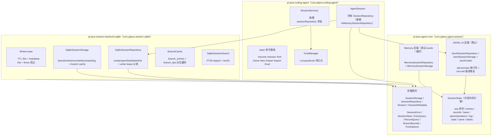
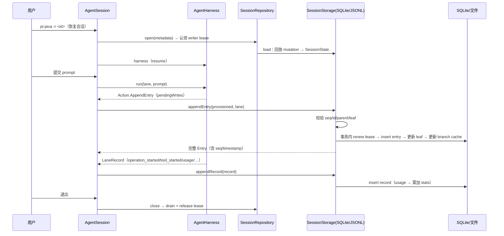
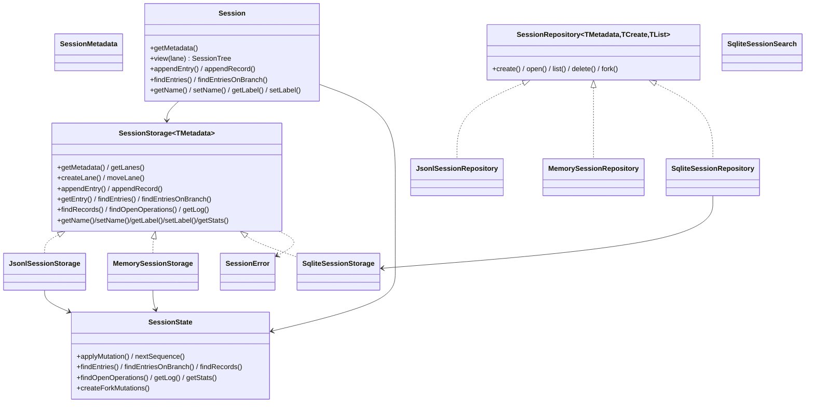

# Phase 4: 持久化与恢复 — 阶段设计文档

> **目标**：SQLite + JSONL v4 双轨会话存储（1:1 对齐 pi），含 FTS5 全文搜索、写租约、分支缓存与崩溃恢复。会话可跨进程重启恢复，崩溃仅丢失最后一行未完整写入的数据。
> **工时**：3–4 周（10 项任务 + 3 项前置任务）
> **输入文档**：`03-detailed-design.md` §2.4（存储接口）、§5（JSONL v4）、§6（SQLite 后端）、`04-implementation-plan.md` §6
> **前置阶段**：Phase 3（`AgentSession`/`SessionServices`/`InMemorySessionRepository` 已就绪）
> **对齐基准**：pi 当前源码 `packages/agent/src/harness/session/`（接口 + JSONL 后端）与 `packages/session-backends/sqlite-node/`（SQLite 后端）

---

## 1. 架构概览



**核心设计原则**：

- **双轨同构**：JSONL（agent-core 内置，默认）与 SQLite（`pi-java-session-backend-sqlite`，富查询/搜索/并发）实现**同一套 `SessionStorage`/`SessionRepository` 契约**，上层（coding-agent / harness）不感知具体后端，仅在启动时按配置选择。
- **`SessionState` 复用**：JSONL 与 Memory 后端共用同一份内存态 `SessionState`（seq 序列、entries/records/lanes/log/stats/name/labels 的规范状态），后端只负责「把 mutation 落盘 + 从落盘回放」。这与 pi 的 `state.ts` 一一对应。
- **同步方法（虚拟线程承载 I/O）**：pi 的存储接口为 `async`（Promise）；pi-java 沿用现有 harness 的同步风格——存储方法为同步签名，阻塞 I/O 由调用方（`AgentSession.driveRun` 的虚拟线程）承载。语义与 pi 等价，仅异步表达不同。
- **以 pi 源码为准**：`03-detailed-design.md` §5–6 为高层设计，其中 JSONL 行格式示例（snake_case `parent_id`/`payload`）与 SQLite 表结构（12 表）与 pi 当前实现不符。本设计以 pi 当前源码为准，偏离逐条记录见下。

> **与 `03-detailed-design.md` §2.4 / §5 / §6 / §7 的已知偏离**：
> - **存储接口**（§2.4）：03 的 `SessionStorage`/`SessionRepository` 为高层签名；当前 agent-core 的 `SessionStorage`/`SessionRepository`/`Session`/`LaneInfo`/`EntryQuery`（Phase 2a 定稿）为**简化版**，与本阶段要落地的 pi 全量契约差距较大。本设计以 pi `types.ts`/`session.ts` 为准重写，见 §2。
> - **JSONL 行格式**（§5）：03 §5 示例使用 snake_case（`parent_id`、`entries_before`、`payload`）与嵌套 payload，pi 当前为 **camelCase 平铺字段**（`parentId`、`summary`、`retainedTail`…），且 header 用 `createdAt`(epoch ms) 而非 `timestamp`。见 §4.2。
> - **SQLite 表结构**（§6.1）：03 列 12 张表（`schema_version`/`lane_records`/`checkpoints`/`branch_cache`/`tools_cache`/`models_cache`/`settings`…），pi 当前 `001_initial.sql` 为 **11 张表**（`sessions`/`entries`/`session_sequences`/`session_stats`/`branch_entries`/`lanes`/`records`/`lane_moves`/`facts`/`branch_tips`/`writer_leases`）+ `migrations` 表 + FTS5 虚拟表 `session_search_fts`。03 的 `checkpoints`/`tools_cache`/`models_cache`/`settings` 等为早期设想，pi 未采用。见 §5。
> - **Writer lease**（§6.2）：03 用 `ON CONFLICT ... DO UPDATE ... WHERE expires_at < ?`（无 fence）；pi 用 **fence 单调整数**（抢占时 `fence+1`），写前需 `owner+fence+未过期` 三重校验，比 03 更严谨。见 §8。
> - **Entry/LaneRecord 字段形状**（§2.3）：当前 agent-core 的 `Entry`/`LaneRecord` 为 Phase 2 简化版（`Message{role,blocks}`、`Compaction{reason,entriesBefore,entriesAfter}`、`StepAttempt{stepIndex,inputTokens,outputTokens}`…），与 pi 的字段形状（`Message{message:AgentMessage,terminate?}`、`Compaction{summary,retainedTail,tokensBefore,details,usage}`、`StepAttempt{runId,step,attempt,resultEntryId}`…）不一致。本设计在 §3 对齐并列为前置任务。
> - **时间戳**：pi 的 JSONL 用 epoch ms（`number`），SQLite `created_at`/`timestamp` 列用 ISO-8601 文本；pi-java 内部类型沿用 `Instant`（与现有 `EntryHeader` 一致），编解码层完成 `Instant ↔ epoch ms / ISO-8601` 转换。
> - **`SessionStats` 形状**（§2.4 辅助类型）：03 为 `{entryCount, tokenCount, toolCallCount, firstTimestamp, lastTimestamp}`；本设计对齐 pi 改为 `{messageCount, cachedTokens, uncachedTokens, totalTokens, costTotal}`（§2.1）。`tokenCount` 拆分为 cached/uncached/total，`toolCallCount`/`firstTimestamp`/`lastTimestamp` pi 的 stats 形状不含而丢弃。见 §2.1。
> - **`ForkOptions` sealed 化**（§2.4 辅助类型）：03 为 `record ForkOptions(String at, String branchName)`；本设计对齐 pi 改为 sealed 联合 `Branch(entryId, position) | Tree()`（§2.5），`at`/`branchName` 语义由 `Branch.entryId`/`Branch.position`（At/Before）与 `Tree` 承载。见 §2.5。
> - **Usage 类型缺失**：pi 的 `Usage`（`@earendil-works/pi-ai`）含 `input/output/cacheRead/cacheWrite/totalTokens/cost.total`；pi-java 现有 `StreamEvent.UsageInfo` 仅有 `inputTokens/outputTokens`，**无 cache/cost 字段**。`SessionStats`（cached/uncached/total/cost）与 `UsageRecord.usage`、`Compaction.usage` 依赖完整 usage，故 Phase 4 需在 ai 模块新增对齐 pi 的 `com.pijava.ai.Usage` 类型（见 §3.4 前置）。
> - **FTS5 搜索表**（§6.3）：03 用 `entries_fts` + `json_extract` 触发器（仅索引 message）；pi 用外部内容表 `session_search_fts`（`content='entries'` + trigram + bm25），索引全量 entry payload。见 §10。
> - **后端选择 SPI**（§13.1）：`SessionBackendFactory` + `settings.sessionBackend` 为 pi-java 新增（03/04 未列），运行时经 ServiceLoader 选择 JSONL/SQLite，避免 coding-agent 编译期依赖 sqlite 模块。
> - **错误码体系**（§7）：03 用 `enum ErrorCode`（数值码 1xx–5xx，含 `SESSION_NOT_FOUND(501)`/`SESSION_CORRUPTED(502)`/`SESSION_READ_ONLY(503)`）。本设计**弃用该数值 enum**：① 会话存储域以 pi 的**字符串码**为准，建模为 `enum SessionErrorCode`（8 个 snake_case 字面量，§2.5）；② `SESSION_CORRUPTED`/`SESSION_READ_ONLY` 在 pi 无对应字面量，其语义由 `STORAGE`/`INVALID_ENTRY` 等承载；③ 03 的数值 `ErrorCode` 横跨网络/认证/模型/工具/会话多个域，其余域不在 Phase 4 范围，留待对应阶段。

> **与 `01-requirements-analysis.md` 的已知偏离**：
> - **SQLite 主存储 vs JSONL 默认**（01 第 127 行「存储选型」）：01 写『SQLite 为主存储、JSONL v4 为 mutation 日志』，但 pi 的实际架构是 **JSONL 为默认后端**（agent 内置、零配置），SQLite 为 opt-in 富查询后端（FTS5/写租约/branch cache）。本设计以 pi 为准（§1「以 pi 源码为准」），二者为**同构双轨、按需增强**——JSONL 提供 mutation 日志 + 崩溃恢复基线（默认后端），SQLite 提供 FTS5/租约/cache 增强（可选，`settings.sessionBackend` 决定，§13.1）。与 01 措辞偏离，特此记录。

### 1.1 数据流（序列图）



### 1.2 核心类图



---

## 2. 存储契约（前置任务 P4-A：接口层）

> 本阶段首先把 Phase 2a 的简化 `SessionStorage`/`SessionRepository`/`Session`/`LaneInfo`/`EntryQuery` 重写为 pi 的全量契约。这是 JSONL 与 SQLite 两个后端的公共地基，也是 conformance 测试的公共断言面。包名 `com.pijava.agent.session`（JSONL/Memory 后端同属 agent-core）。

### 2.1 SessionMetadata + SessionStats + LanePointer

```java
package com.pijava.agent.session;

import java.time.Instant;

/** 会话元数据的最小公共基（对齐 pi SessionMetadata）。 */
public interface SessionMetadata {
    String id();
    Instant createdAt();          // 编解码层转 epoch ms（JSONL）/ ISO-8601（SQLite）
    String parentSessionId();     // null 表示根会话
}

/** 会话统计（对齐 pi SessionStats）。usage 记录增量累加。 */
public record SessionStats(
    long messageCount,
    double cachedTokens,
    double uncachedTokens,
    double totalTokens,
    double costTotal
) {}

/** 车道指针（对齐 pi LanePointer）。 */
public record LanePointer(String lane, String leafId) {}
```

### 2.2 SessionStorage（全量契约）

```java
package com.pijava.agent.session;

/**
 * 单会话持久化接口。同步签名（阻塞 I/O 由虚拟线程承载，见 §1）。
 * 对齐 pi SessionStorage（types.ts）。
 *
 * @param <TMetadata> 会话元数据类型（JsonlSessionMetadata / SqliteSessionMetadata）
 */
public interface SessionStorage<TMetadata extends SessionMetadata> {

    TMetadata getMetadata();

    // ── 车道 ────────────────────────────────────────────
    List<LanePointer> getLanes();
    void createLane(String lane, String at);          // at 可为 null
    void moveLane(String lane, String to);            // to 可为 null

    // ── 写入（provisioned：id 已由调用方分配，seq/parentId/timestamp 由存储分配）──
    <T extends Entry> T appendEntry(ProvisionedEntry<T> entry, String lane);
    <T extends LaneRecord> T appendRecord(NewRecord<T> record);

    // ── 读取 ────────────────────────────────────────────
    Entry getEntry(String id);                          // null 表示不存在
    List<Entry> findEntries(EntryQuery query);
    /** start 强制传入（默认 leaf 是 Session 视图层的糖）。 */
    List<Entry> findEntriesOnBranch(EntryQuery query, BranchBounds bounds, String start);
    List<LaneRecord> findRecords(RecordQuery query);
    List<OperationStarted> findOpenOperations(String lane, int limit);
    List<LogItem> getLog(LogOptions options);

    // ── 全局事实（latest-wins，非分支作用域）──────────────
    String getName();
    void setName(String name);
    String getLabel(String id);
    void setLabel(String id, String label);

    // ── 统计 ────────────────────────────────────────────
    SessionStats getStats();

    /** 等待所有已排队写完成（JSONL tail 串行链 / SQLite 串行队列）。 */
    void drain();

    /** 释放资源（JSONL 无状态；SQLite 释放租约与心跳）。 */
    void close();
}
```

> **与 03 §2.4 的差异**：`appendEntry(ProvisionedEntry<T>, lane)`、`appendRecord(NewRecord<T>)`、`getEntry`、`findEntries`、`findEntriesOnBranch(query, bounds, start)`、`findRecords`、`findOpenOperations`（返回 `OperationStarted`，其字段形状变化见 §3）、`getLog`、`getName/setName`、`getLabel/setLabel`、`getStats` 签名与本设计一致（03 §2.4 已含 `start` 强制参数）。实质差异有三处：① `getLanes()` 返回 `LanePointer`（03 为 `LaneInfo{name, leafId, entryCount}`，本设计收敛为 `lane/leafId` 并丢弃 `entryCount`）；② `TMetadata` 增加 `extends SessionMetadata` 上界（03 为原始泛型参数）；③ 新增 `drain()`/`close()`（见下注）。

> **`drain()`/`close()` 为 Java 化增补（非 pi 直接对应）**：pi 的 `SessionStorage`（`types.ts`）**无** `drain()`/`close()`——`drain` 是 `JsonlSessionStorage` 的私有方法，SQLite 队列排空在 repo 层。pi-java 因存储方法为同步签名、阻塞 I/O 由虚拟线程承载（§1），资源生命周期（SQLite 租约 + 心跳）需显式 `close()` 释放，故在契约层补这两个方法。语义对齐 pi，仅生命周期表达方式不同。

### 2.3 SessionRepository + Session

```java
package com.pijava.agent.session;

/**
 * 会话生命周期管理（对齐 pi SessionRepo）。泛型三参对应后端的具体选项类型。
 *
 * @param <TMetadata>     元数据类型
 * @param <TCreateOptions> 创建选项类型
 * @param <TListOptions>   列表选项类型
 */
public interface SessionRepository<
        TMetadata extends SessionMetadata,
        TCreateOptions,
        TListOptions> {

    Session<TMetadata> create(TCreateOptions options);
    /** 打开会话并认领后端 writer claim（SQLite：writer lease；JSONL：无锁）。 */
    Session<TMetadata> open(TMetadata metadata);
    /** 仅列出元数据，不打开会话、不认领 writer claim。 */
    List<TMetadata> list(TListOptions options);
    void delete(TMetadata metadata);
    Session<TMetadata> fork(TMetadata source, ForkOptions options, TCreateOptions createOptions);
}
```

```java
package com.pijava.agent.session;

/**
 * 会话读写门面（对齐 pi session.ts 的 Session 类，实现 SessionTree）。
 * 包装 {@link SessionStorage} + {@link IdGenerator}，提供 branch 视图与便捷写入。
 */
public final class Session<TMetadata extends SessionMetadata> implements SessionTree {
    private final SessionStorage<TMetadata> storage;
    private final IdGenerator idGenerator;

    public Session(SessionStorage<TMetadata> storage) { this(storage, UuidV7.INSTANCE); }
    public Session(SessionStorage<TMetadata> storage, IdGenerator idGenerator) { ... }

    public TMetadata getMetadata() { return storage.getMetadata(); }

    /** 车道视图：findEntriesOnBranch 以该车道 leaf 为默认 start。main 返回 this。 */
    public SessionTree view(String lane) { ... }

    // 委托 storage（此处省略其余方法体，见 §2.2）
    public SessionStorage<TMetadata> storage() { return storage; }
    public IdGenerator idGenerator() { return idGenerator; }

    /** 释放资源：透传 storage.close()。SQLite 释放 writer lease + 停心跳；JSONL 无状态。 */
    public void close() { storage.close(); }
}
```

```java
/** 车道级读写门面（对齐 pi SessionTree）。 */
public interface SessionTree {
    String getLeafId();
    Entry getEntry(String id);
    SessionStats getStats();
    String getName(); void setName(String name);
    String getLabel(String targetId); void setLabel(String targetId, String label);

    List<Entry> findEntries(EntryQuery query);
    Entry findEntry(EntryQuery query);
    /** start 取自 bounds.start()，缺省用本车道 leaf（对齐 pi SessionTree 的视图糖）。 */
    List<Entry> findEntriesOnBranch(EntryQuery query, BranchBounds bounds);
    Entry findEntryOnBranch(EntryQuery query, BranchBounds bounds);

    /** 便捷写入：返回被持久化 entry 的 id。 */
    String appendMessage(Message message);
    String appendCustomEntry(String customType, Map<String, Object> data);
}
```

> **命名冲突解决**：当前 agent-core 的 `com.pijava.agent.session.Session` 为 **record 描述符**（`id/displayName/createdAt/updatedAt/entryCount`），仅被当前简化 `SessionRepository` 引用。本设计将 `Session` 改为**门面类**（对齐 pi），会话列表描述符由 `SessionMetadata` 承担；原 `Session` record 废弃。coding-agent 的 `SessionInfo`（§13）映射自 `SessionMetadata`。

### 2.4 SessionState（共享内存引擎，对齐 pi state.ts）

```java
package com.pijava.agent.session;

/**
 * 会话内存态规范引擎。JSONL/Memory 后端复用；SQLite 后端经 conformance 测试
 * 对齐其语义（但 SQLite 用表/索引实现查询，不持有此对象）。
 *
 * 维护：sequence、usedIds、entries(by id)、records、openOperationsByLane、
 * lanes(main→null)、log、stats、name、labels。applyMutation 校验 seq 严格递增、
 * id 唯一、parent 存在、entry 链到 lane leaf。
 */
public final class SessionState {
    long nextSequence();                                     // sequence + 1
    List<LanePointer> getLanes();
    String requireLane(String lane);                         // 返回 leaf，缺失抛 invalid_lane
    void validateNewLane(String lane);                       // 已存在抛 already_exists
    void validateTarget(String targetId);                    // 非 null 且缺失抛 not_found
    void validateUnusedId(String id);                        // 已用抛 already_exists
    void applyMutation(SessionMutation mutation);

    Entry getEntry(String id);
    List<Entry> findEntries(EntryQuery query);
    List<Entry> findEntriesOnBranch(EntryQuery query, BranchBounds bounds, String start);
    List<LaneRecord> findRecords(RecordQuery query);
    List<OperationStarted> findOpenOperations(String lane, int limit);
    List<LogItem> getLog(LogOptions options);
    String getName(); String getLabel(String id);
    SessionStats getStats();

    /** 生成 fork 的 mutation 序列（tree 全量 / branch 按路径 + label 过滤）。 */
    List<SessionMutation> createForkMutations(ForkOptions options);
}
```

> **规模预算**：对齐 pi `state.ts`（344 行），Java 记录化后预计 ~400 行。若 `applyMutation` 校验 + `createForkMutations` 使其超 500 行（`CLAUDE.md` 上限），拆出 `SessionStateQueries`（findEntries/findRecords/getLog 查询族）与 `ForkMutationBuilder`。

```java
/** 一次可持久化变更（对齐 pi SessionMutation 联合类型）。 */
public sealed interface SessionMutation {
    record Entry(String lane, com.pijava.agent.entry.Entry entry) implements SessionMutation {}   // lane 可空
    record Record(com.pijava.agent.record.LaneRecord record) implements SessionMutation {}
    record Lane(long seq, String lane, String leafId) implements SessionMutation {}
    record FactName(long seq, String name) implements SessionMutation {}                            // name 可空
    record FactLabel(long seq, String targetId, String label) implements SessionMutation {}         // label 可空=删除
}
```

### 2.5 SessionError + 查询/选项类型

```java
package com.pijava.agent.session;

/** 会话存储错误码（对齐 pi SessionErrorCode 的 8 个字符串字面量）。纯常量闭集 → enum。 */
public enum SessionErrorCode {
    NOT_FOUND("not_found"),
    ALREADY_EXISTS("already_exists"),
    INVALID_ENTRY("invalid_entry"),
    INVALID_PAYLOAD("invalid_payload"),
    INVALID_LANE("invalid_lane"),
    INVALID_QUERY("invalid_query"),
    INVALID_FORK_TARGET("invalid_fork_target"),
    STORAGE("storage");

    private final String value;
    SessionErrorCode(String value) { this.value = value; }

    /** snake_case 字面量（对齐 pi）。 */
    public String value() { return value; }
}

/** 会话存储错误。code 为 {@link SessionErrorCode}。 */
public class SessionError extends RuntimeException {
    private final SessionErrorCode code;
    public SessionError(SessionErrorCode code, String message) { super(message); this.code = code; }
    public SessionError(SessionErrorCode code, String message, Throwable cause) { super(message, cause); this.code = code; }
    public SessionErrorCode code() { return code; }
}
```

```java
/** 排序方向（对齐 pi EntryOrder）。纯常量闭集 → enum。 */
public enum EntryOrder {
    NEWEST_FIRST,   // 默认
    OLDEST_FIRST
}

/** 操作意图判别（对齐 pi OperationStartedRecord.intent.kind，纯常量闭集 → enum）。 */
public enum OperationKind {
    RUN("run"),
    COMPACTION("compaction"),
    NAVIGATION("navigation");

    private final String value;
    OperationKind(String value) { this.value = value; }

    /** intent.kind 字面量（对齐 pi，§3.3）。 */
    public String value() { return value; }
}
```

> **`OperationKind` 与 §3.3 `LaneRecord.OperationStarted.Intent` 的关系（有意分离，非 Duplicated Code）**：二者同为 Run/Compaction/Navigation 判别，但角色不同——`OperationKind` 是 `RecordQuery` 的**过滤条件**（纯常量 → enum），`Intent` 是 `OperationStarted` 的**数据载荷**（`Run` 携带 `originalPrompt`/`initialMessages`/… 字段 → sealed + record）。用 `Intent` 作过滤条件需凭空构造载荷字段，故拆为独立的 enum 判别（`OperationKind` 的 `value()` 与 `Intent` 变体输出同一 `kind` 字面量）。

```java
public record EntryCursor(long afterSeq) {}

public record EntryQuery(
    String type,          // null = 全部；Entry 判别字段
    String customType,    // 仅 type=="custom" 时有效
    EntryOrder order,     // 默认 NEWEST_FIRST
    int limit,            // 0 = 无上限；正整数
    EntryCursor cursor    // 排序无关的 seq 过滤（newest: seq<afterSeq; oldest: seq>afterSeq）
) {
    public static EntryQuery all() { return new EntryQuery(null, null, EntryOrder.NEWEST_FIRST, 0, null); }
}

/** 分支扫描边界（对齐 pi BranchBounds：{start?, stopAtType?, stopAtId?}）。start 缺省为视图层 lane leaf。 */
public record BranchBounds(String start, String stopAtType, String stopAtId) {
    public static BranchBounds none() { return new BranchBounds(null, null, null); }
    public static BranchBounds from(String start) { return new BranchBounds(start, null, null); }
}

public record RecordQuery(
    String lane,          // 精确车道，null=所有车道
    String type,          // 精确 record 判别字段，null=所有类型
    String runId,         // 匹配 operation_started.id 或带 runId 的 record
    OperationKind operationKind, // 仅 type=="operation_started" 有效（RUN|COMPACTION|NAVIGATION）
    long afterSeq,        // seq > afterSeq（-1 = 无下限）
    EntryOrder order,     // 默认 NEWEST_FIRST
    int limit
) {}

/** 日志项（对齐 pi LogItem 联合类型）。 */
public sealed interface LogItem {
    record EntryItem(long seq, com.pijava.agent.entry.Entry entry) implements LogItem {}
    record RecordItem(long seq, com.pijava.agent.record.LaneRecord record) implements LogItem {}
    record LaneItem(long seq, String lane, String leafId) implements LogItem {}
    record NameItem(long seq, String name) implements LogItem {}
    record LabelItem(long seq, String targetId, String label) implements LogItem {}
}
```

> **与 `SessionMutation` 的结构对应（有意重复，非 Duplicated Code）**：`LogItem` 与 §2.4 `SessionMutation` 均为 5 变体（Entry/Record/Lane/Name/Label），但语义不同——`SessionMutation` 是「待落盘变更」，`LogItem` 是「带 seq 的已落盘日志」。二者对齐 pi 的两个独立联合类型，不合并。

public record LogOptions(long afterSeq, int limit) {}

/** 分叉选项（对齐 pi ForkOptions）。 */
public sealed interface ForkOptions {
    /** branch scope：只复制选中路径（对齐 pi ForkOptions.Branch）。entryId 可空：null=fork 于 main leaf（"at"）；entryId 非空且 position 可空：null→"before"。 */
    record Branch(String entryId, Position position) implements ForkOptions {
        public sealed interface Position permits At, Before {}
        public record At() implements Position {}
        public record Before() implements Position {}
    }
    /** tree scope：复制全部 entries + lanes + branch tips。 */
    record Tree() implements ForkOptions {}
}
```

### 2.6 辅助类型：ProvisionedEntry / NewRecord / IdGenerator

```java
package com.pijava.agent.entry;

/** 已 provision（有 id）但 seq/parentId/timestamp 由存储分配的 Entry（对齐 pi ProvisionedEntry）。 */
public final class ProvisionedEntry<T extends Entry> {
    private final T entry;
    public ProvisionedEntry(T entry) { this.entry = entry; }
    public T entry() { return entry; }
}
```

> **与现有 `ProvisionedEntry` 的差异**：当前 agent-core 的 `ProvisionedEntry` 是「entry + written 标记」的桥接类（用于 `LaneState.pendingWrites`）。本阶段把「written 标记 + pendingWrites 队列」职责移回 harness（harness 仅靠 id 追踪待写），`ProvisionedEntry<T>` 收敛为 pi 的「缺 seq/parentId/timestamp 的写入入参」语义。见 §3 对齐说明。

```java
package com.pijava.agent.record;

/** 缺 seq/timestamp 的 record 写入入参（对齐 pi NewRecord）。 */
public final class NewRecord<T extends LaneRecord> {
    private final T record;
    public NewRecord(T record) { this.record = record; }
    public T record() { return record; }
}

package com.pijava.agent.session;

/** 会话 id 生成器（对齐 pi IdGenerator）。 */
@FunctionalInterface
public interface IdGenerator { String next(); }
```

> **`ProvisionedEntry`/`NewRecord` 是 pi 类型别名的 Java 等价物（非 Middle Man）**：pi 里二者是类型级 `Omit<T, "parentId"|"seq"|"timestamp">` / `Omit<T, "seq"|"timestamp">`。Java 无类型级 Omit，故用单字段包装类表达「写入入参缺 seq/parentId/timestamp」语义。透传访问器 `entry()`/`record()` 是唯一载荷，不构成委托链。

### 2.7 验收标准

- `com.pijava.agent.session` 契约类全部有 Javadoc，方法签名与 pi `types.ts`/`session.ts` 一一对应（同步化）。
- `SessionState.applyMutation` 对 seq 非连续、id 重复、parent 缺失、entry 未链到 lane leaf、record 引用缺失 lane 抛对应 `SessionError`。
- 「同 lane 双 open operation」校验归属**存储写路径**（`JsonlSessionStorage.appendRecord` / SQLite `startLaneOperation`，对齐 pi `jsonl/storage.ts`），不在 `SessionState.applyMutation`。
- 查询参数校验：`limit ≤ 0`、`cursor.afterSeq < 0`、`operationKind` 配非 `operation_started` → `invalid_query`。

---

## 3. Entry / LaneRecord 对齐（前置任务 P4-B）

> pi-java 当前 `Entry`（7 子类型）/ `LaneRecord`（10 子类型）为 Phase 2 简化形状，字段与 pi 的 v4 格式不一致。JSONL v4 字节级兼容（§4）与 SQLite `payload` 列一致（§7）都要求字段名与结构对齐 pi。

### 3.1 对齐表（pi 为准）

| pi-java 当前 | pi 目标 | 变更 |
|---|---|---|
| `Entry.Message.header + role + blocks` | `MessageEntry{type,id,seq,parentId,timestamp, message:AgentMessage, terminate?}` | `message` 收敛为 ai-message `Message`（含 role+content）；`terminate` 标记工具终止 |
| `Entry.ThinkingLevelChange.level` | `ThinkingLevelEntry.thinkingLevel` | 字段改名 |
| `Entry.ActiveToolsChange.toolNames` | `ActiveToolsEntry.activeToolNames` | 字段改名 |
| `Entry.Compaction.reason + entriesBefore + entriesAfter` | `CompactionEntry{summary, retainedTail:Message[], tokensBefore, details?, usage?}` | 从「截断计数」升级为「摘要 + 保留尾 + 压缩前 token」 |
| `Entry.BranchSummary.summary` | `BranchSummaryEntry{fromId, summary, details?, usage?}` | 新增 `fromId` |
| `Entry.Custom.kind + data` | `CustomEntry{customType, data?}` | 字段改名 `kind→customType` |
| `EntryHeader`（嵌套） | 平铺 `id/seq/parentId/timestamp` | 序列化平铺，见 §3.2 |
| `LaneRecord.OperationStarted.runId + intent(String)` | `OperationStartedRecord{id,seq,lane,timestamp, sourceLeafId, intent{kind,originalPrompt?,initialMessages?,systemPromptOverride?,resumeData?,customInstructions?,resultEntryId?,targetId?,summarize?,label?,summaryEntryId?}}` | `intent` 从 String 升级为联合 |
| `LaneRecord.OperationFinished.runId + status` | `{runId, outcome:completed\|aborted\|failed\|declined, error?}` | `status→outcome` 取值扩充 |
| `LaneRecord.StepAttempt.stepIndex + inputTokens + outputTokens` | `{runId, step:assistant\|compaction\|branch_summary, attempt, resultEntryId, compactionReason?}` | 全面重构 |
| `LaneRecord.ToolStarted.toolCallId + toolName + arguments` | `{runId, assistantEntryId, toolIndex, toolCallId, toolName, effectiveArgs, resultEntryId, replay}` | 全面重构 |
| `LaneRecord.UsageRecord.inputTokens + outputTokens + modelId` | `{usage, cause:assistant\|compaction\|branch_summary\|deferred_fetch\|tool\|hook\|adjustment, runId?, entryId?, toolCallId?, attempt?, stopReason?}` | 全面重构 |
| `LaneRecord` 其余 5 类型（AbortRequested/QueueEnqueued/QueueCancelled/WriteDeferred/HookError） | pi 对应 9 类型（含 `AbortRequestedRecord{runId}`、`QueueEnqueuedRecord{queue,runId,target}`、`QueueCancelledRecord{runId?,entryId}`、`WriteDeferredRecord{runId,target}`；pi 无 `HookError`） | 对齐字段 |

### 3.2 序列化策略（关键决策）

- **平铺字段 + Jackson `@JsonTypeInfo`**：`Entry`/`LaneRecord` 各子类型直接持有 `id/seq/parentId/timestamp`（Entry）/ `id/seq/lane/timestamp`（Record）**平铺字段**，与 pi 的 JSON 键名一致（camelCase）。废弃 `EntryHeader`/`RecordHeader` 嵌套。`@JsonTypeInfo(use=NAME, property="type")` 的 name 保持 `message`/`model_change`/… 与 pi 的 `type` 判别字段一致。
- **`AgentMessage` 映射**：pi 的 `MessageEntry.message` 是 `@earendil-works/pi-ai` 的 `AgentMessage`（role + content blocks）；pi-java 对应 `com.pijava.ai.message.Message`（sealed：System/User/Assistant，含 ContentBlock）。JSONL 的 `message` 字段序列化为该 `Message` 的 JSON。
- **可选字段省略（对齐 pi `?:` 字段）**：pi 的 `terminate?`/`details?`/`usage?`/`data?`/`parentId?`/`systemPromptOverride?` 等可选字段在 JSON 中**缺省即省略**。Java 用**可空引用 + `@JsonInclude(NON_NULL)`** 表达：`terminate` 用 `Boolean`（存在即 `true`，省略即 null）、`details`/`usage`/`data`/`parentId` 用可空引用。`@JsonInclude(JsonInclude.Include.NON_NULL)` 配在 `Entry`/`LaneRecord` 接口上，保证与 pi codec 字节级一致（§3.4 抽样断言）。基础字段（`id/seq/type/lane/timestamp`）永非空。
- **平铺 header 字段的取舍（Data Clump）**：`id/seq/parentId/timestamp`（Entry）/ `id/seq/lane/timestamp`（Record）在每个子 record 重复，属有意取舍——平铺保证 Jackson 键名与 pi 字节级一致；`@JsonUnwrapped` 嵌套 header record 虽消重，但改变键序/结构、破坏与 pi 的逐字段对照。维持平铺。
- **判别字段：嵌套 vs 平铺（sealed vs enum 的取舍）**：pi 的判别联合分两种形状——`OperationStarted.intent` 是**嵌套对象**（`intent:{kind:"run",...}`），故 sealed 化（§3.3 `Intent`）；而 `UsageRecord.cause`、`QueueEnqueued.queue`、`StepAttempt.step` 是**平铺判别字段**（`cause`/`queue`/`step` 与 `runId`/`toolCallId`/`compactionReason` 同层，非嵌套对象），故用 `enum 判别 + 可空变体字段`（§3.3）。若把后者也 sealed 嵌套，会改变 JSON 键结构、破坏与 pi 的字节级一致。变体字段的「必填/互斥」不变式（如 `cause=tool` 必填 `toolCallId`、`step=compaction` 必填 `compactionReason`）由存储校验（§2.7、§4.3 codec）承载，而非类型系统——这是平铺 JSON 格式的固有取舍。
- **影响面（有界重构）**：harness 构造点在 `ActionExecutor`（`run`/`executeStreamAssistant`/`injectUserMessages`/`executeTool`/`executeToolBatch`/`executeTryFinishRun`）、消费点在 `HarnessUtils`/`AgentSession`/`ChatScreen`（`Entry.header().id()` → `Entry.id()`）。全部为密封类型 switch + record 访问器，替换有编译器兜底。
- **harness 未产出的富字段**：Phase 2 harness 目前不追踪 `resultEntryId`/`effectiveArgs`/`usage.cause` 等 pi 富字段；本阶段**类型形状对齐 pi（字段就位、可空/默认）**，harness 逐步填充——保证存储格式稳定、向前兼容，避免 Phase 4 承担 harness 记录语义的完整重构。
- **`HookError` 移除**：pi 的 `LaneRecord`（9 类型）**无 `HookError`**；hook 相关 usage 经 `UsageRecord{cause:"hook"}` 承载。Phase 2 harness 产出的 `LaneRecord.HookError` 本阶段删除，其发射点随 §3.2「harness 记录语义」的逐步对齐移除或改走 `UsageRecord{cause:"hook"}`——不留 pi 之外的 record 类型。

### 3.3 目标签名（节选）

```java
package com.pijava.agent.entry;

@JsonTypeInfo(use = JsonTypeInfo.Id.NAME, property = "type")
@JsonSubTypes({
    @JsonSubTypes.Type(value = Entry.Message.class, name = "message"),
    @JsonSubTypes.Type(value = Entry.ModelChange.class, name = "model_change"),
    @JsonSubTypes.Type(value = Entry.ThinkingLevelChange.class, name = "thinking_level_change"),
    @JsonSubTypes.Type(value = Entry.ActiveToolsChange.class, name = "active_tools_change"),
    @JsonSubTypes.Type(value = Entry.Compaction.class, name = "compaction"),
    @JsonSubTypes.Type(value = Entry.BranchSummary.class, name = "branch_summary"),
    @JsonSubTypes.Type(value = Entry.Custom.class, name = "custom")
})
public sealed interface Entry {
    String id(); long seq(); String parentId(); Instant timestamp();

    record Message(String id, long seq, String parentId, Instant timestamp,
                   com.pijava.ai.message.Message message, Boolean terminate) implements Entry {}
    record ModelChange(String id, long seq, String parentId, Instant timestamp,
                       String provider, String modelId) implements Entry {}
    record ThinkingLevelChange(String id, long seq, String parentId, Instant timestamp,
                               String thinkingLevel) implements Entry {}
    record ActiveToolsChange(String id, long seq, String parentId, Instant timestamp,
                             List<String> activeToolNames) implements Entry {}
    record Compaction(String id, long seq, String parentId, Instant timestamp,
                      String summary, List<com.pijava.ai.message.Message> retainedTail,
                      int tokensBefore, Map<String,Object> details,
                      com.pijava.ai.Usage usage) implements Entry {}
    record BranchSummary(String id, long seq, String parentId, Instant timestamp,
                         String fromId, String summary, Map<String,Object> details,
                         com.pijava.ai.Usage usage) implements Entry {}
    record Custom(String id, long seq, String parentId, Instant timestamp,
                  String customType, Map<String,Object> data) implements Entry {}
}
```

```java
package com.pijava.agent.record;

@JsonTypeInfo(use = JsonTypeInfo.Id.NAME, property = "type")
@JsonSubTypes({
    @JsonSubTypes.Type(value = LaneRecord.OperationStarted.class, name = "operation_started"),
    @JsonSubTypes.Type(value = LaneRecord.AbortRequested.class, name = "abort_requested"),
    @JsonSubTypes.Type(value = LaneRecord.OperationFinished.class, name = "operation_finished"),
    @JsonSubTypes.Type(value = LaneRecord.StepAttempt.class, name = "step_attempt"),
    @JsonSubTypes.Type(value = LaneRecord.ToolStarted.class, name = "tool_started"),
    @JsonSubTypes.Type(value = LaneRecord.QueueEnqueued.class, name = "queue_enqueued"),
    @JsonSubTypes.Type(value = LaneRecord.QueueCancelled.class, name = "queue_cancelled"),
    @JsonSubTypes.Type(value = LaneRecord.WriteDeferred.class, name = "write_deferred"),
    @JsonSubTypes.Type(value = LaneRecord.UsageRecord.class, name = "usage")
})
public sealed interface LaneRecord {
    String id(); long seq(); String lane(); Instant timestamp();

    record OperationStarted(String id, long seq, String lane, Instant timestamp,
                            String sourceLeafId, Intent intent) implements LaneRecord {
        public sealed interface Intent permits Run, Compaction, Navigation {}
        record Run(java.util.List<com.pijava.ai.message.Message> originalPrompt,
                   java.util.List<com.pijava.agent.entry.ProvisionedEntry<?>> initialMessages,
                   String systemPromptOverride, Map<String,Object> resumeData) implements Intent {}
        record Compaction(String customInstructions, String resultEntryId) implements Intent {}
        record Navigation(String targetId, boolean summarize, String customInstructions,
                          String label, String summaryEntryId) implements Intent {}
    }
    record AbortRequested(String id, long seq, String lane, Instant timestamp, String runId) implements LaneRecord {}
    record OperationFinished(String id, long seq, String lane, Instant timestamp,
                             String runId, OperationOutcome outcome, OperationError error) implements LaneRecord {
        /** 对齐 pi `error?: {code: string, message: string}`（嵌套对象，非 map）。 */
        record OperationError(String code, String message) {}
    }
    record StepAttempt(String id, long seq, String lane, Instant timestamp,
                       String runId, StepKind step, int attempt,
                       String resultEntryId, String compactionReason) implements LaneRecord {}
    record ToolStarted(String id, long seq, String lane, Instant timestamp,
                       String runId, String assistantEntryId, int toolIndex,
                       String toolCallId, String toolName, Map<String,Object> effectiveArgs,
                       String resultEntryId, ReplayKind replay) implements LaneRecord {}
    record QueueEnqueued(String id, long seq, String lane, Instant timestamp,
                         QueueKind queue, String runId, com.pijava.agent.entry.ProvisionedEntry<?> target) implements LaneRecord {}
    record QueueCancelled(String id, long seq, String lane, Instant timestamp,
                          String runId, String entryId) implements LaneRecord {}
    record WriteDeferred(String id, long seq, String lane, Instant timestamp,
                         String runId, com.pijava.agent.entry.ProvisionedEntry<?> target) implements LaneRecord {}
    record UsageRecord(String id, long seq, String lane, Instant timestamp,
                       com.pijava.ai.Usage usage, UsageCause cause,
                       String runId, String entryId, String toolCallId,
                       Integer attempt, String stopReason) implements LaneRecord {}
}
```

```java
/** 判别字段的 enum 类型（纯常量闭集 → enum；经 @JsonValue 输出 pi 的 snake_case 字面量、
 *  @JsonCreator 反序列化，与 codec 字节级一致，§3.4 抽样）。 */
public enum OperationOutcome {
    COMPLETED("completed"),
    ABORTED("aborted"),
    FAILED("failed"),
    DECLINED("declined");

    private final String value;
    OperationOutcome(String value) { this.value = value; }
    @JsonValue public String value() { return value; }
}

public enum StepKind {
    ASSISTANT("assistant"),
    COMPACTION("compaction"),
    BRANCH_SUMMARY("branch_summary");

    private final String value;
    StepKind(String value) { this.value = value; }
    @JsonValue public String value() { return value; }
}

public enum UsageCause {
    ASSISTANT("assistant"),
    COMPACTION("compaction"),
    BRANCH_SUMMARY("branch_summary"),
    DEFERRED_FETCH("deferred_fetch"),
    TOOL("tool"),
    HOOK("hook"),
    ADJUSTMENT("adjustment");

    private final String value;
    UsageCause(String value) { this.value = value; }
    @JsonValue public String value() { return value; }
}

public enum ReplayKind {
    NEVER("never"),
    SAFE("safe");

    private final String value;
    ReplayKind(String value) { this.value = value; }
    @JsonValue public String value() { return value; }
}

public enum QueueKind {
    STEER("steer"),
    FOLLOW_UP("followUp"),
    NEXT_RUN("nextRun");

    private final String value;
    QueueKind(String value) { this.value = value; }
    @JsonValue public String value() { return value; }
}
```

### 3.4 验收标准

- **前置（ai 模块）**：新增 `com.pijava.ai.Usage`（对齐 pi `Usage`：`input/output/cacheRead/cacheWrite/totalTokens/cost.total`），`StreamEvent.UsageInfo` 携带该类型（现有 `inputTokens/outputTokens` 字段由 `Usage` 承载或并列）。`SessionStats` 与 `UsageRecord`/`Compaction`/`BranchSummary` 的 `usage` 字段消费它。
- `mvn test -pl pi-java-agent-core` 通过（harness 构造点编译通过，密封 switch 全覆盖）。
- `Entry`/`LaneRecord` 的 Jackson 序列化产物键名与 pi codec.ts 输出一致（抽样断言）。
- `EntryHeader`/`RecordHeader` 移除或仅作内部工具，不再出现在序列化输出。

---

## 4. JSONL v4 后端（P4-7）

> 对齐 pi `packages/agent/src/harness/session/jsonl/`。JSONL 是默认后端（agent-core 内置），无 index.json、无 .lock，写安全靠内存 tail 串行链保证。

### 4.1 文件布局

```
<session-dir>/                      ← 默认 ~/.pi-java/agent/sessions/，--session-dir 覆盖
└── --<cwd-encoded>--/              ← sessionDirectoryName：cwd 去首斜杠，/ \ : → -
    └── <ISO时间戳>_<id>.jsonl      ← createdAt 的 ISO 时间戳（: 与 . 改 -）+ UUID v7
```

- `sessionDirectoryName(cwd) = "--" + cwd.replace(/^[/\\]/, "").replace(/[/\\:]/g, "-") + "--"`
- `sessionFileName(createdAtMs, id) = "<ISO 去冒号点号>_<id>.jsonl"`
- 会话 id 校验 `SESSION_ID_PATTERN = /^[A-Za-z0-9](?:[A-Za-z0-9._-]*[A-Za-z0-9])?$/`，非法抛 `invalid_payload`。
- `list()` 扫描各 cwd 目录下 `*.jsonl`，读首行 header，按 `modifiedAt` 降序；header 解析失败的旧/损坏文件跳过。

### 4.2 行格式（v4，每行一个 JSON，`\n` 结尾）

```json
{"kind":"header","version":4,"id":"01J5X...","createdAt":1720000000000,"cwd":"/home/u/project","metadata":{...}}

{"kind":"entry","lane":"main","type":"message","id":"01J5Y...","seq":1,"parentId":null,"timestamp":1720000001000,"message":{"role":"user","content":[{"type":"text","text":"fix"}]}}

{"kind":"entry","lane":"main","type":"thinking_level_change","id":"01J5Z...","seq":2,"parentId":"01J5Y...","timestamp":1720000002000,"thinkingLevel":"high"}

{"kind":"entry","lane":"main","type":"compaction","id":"01J6A...","seq":3,"parentId":"01J5Z...","timestamp":1720000003000,"summary":"...","retainedTail":[...],"tokensBefore":4500}

{"kind":"record","id":"01J6B...","seq":4,"lane":"main","type":"operation_started","sourceLeafId":null,"intent":{"kind":"run","originalPrompt":[...],"initialMessages":[]}}

{"kind":"record","id":"01J6C...","seq":5,"lane":"main","type":"usage","runId":"01J6B...","usage":{"totalTokens":120,"cost":{"total":0.01}}}

{"kind":"lane","seq":6,"lane":"main","leafId":"01J5Z..."}

{"kind":"fact","seq":7,"fact":"name","name":"fix-login-bug"}
{"kind":"fact","seq":8,"fact":"label","targetId":"01J5Y...","label":"start"}
```

- 五种 mutation 判别：`header`（首行，无 seq）、`entry`、`record`、`lane`、`fact`。
- 合法枚举（codec 校验）：`ENTRY_TYPES`、`RECORD_TYPES`、`OPERATION_KINDS` 见 §3.3 / pi codec.ts。
- **seq 校验**：正整数且严格递增；`timestamp` 非负；`operation_started` 必须带 `intent.kind`；`operation_finished` 必须带 `runId`；`fact.label/name` 的 value 若存在必须是 string。
- **header 与其余行不同**：header 不带 `seq`，用 `createdAt`(epoch ms) + `version:4`；`parentSessionId` 仅在有父会话（fork 产生）时出现，根会话**省略该键**（pi `decodeHeader` 对 null 抛 schema 错）。

### 4.3 编解码（JsonlCodec）

```java
package com.pijava.agent.session.jsonl;

/** v4 编解码。严格校验 + Result 式错误（syntax=JSON 语法错，schema=字段/枚举错）。 */
public final class JsonlCodec {
    public record DecodeError(String kind, String message, Throwable cause) {}  // kind: syntax|schema

    public static String encodeHeader(JsonlV4Header header);
    public static ParseResult<JsonlV4Header> parseHeader(String line);
    public static String encodeMutation(SessionMutation mutation);
    public static ParseResult<SessionMutation> parseMutation(String line);

    /** metadata 从 header 派生（sourceFormat=4；v3 迁移见 §4.6）。 */
    public static JsonlSessionMetadata metadataFromHeader(JsonlV4Header header, Path path, long modifiedAtMs);
}
```

> **Instant ↔ epoch ms**：`Entry.timestamp`/`SessionMetadata.createdAt` 为 `Instant`；JSONL 编码为 epoch ms（`number`），解码还原。转换收敛在 codec（Jackson 自定义 serializer 或显式转换）。

```java
/** v4 文件首行（对齐 pi JsonlV4Header）。 */
public record JsonlV4Header(
    String kind,                      // 恒 "header"
    int version,                      // 恒 4
    String id,
    long createdAtMs,                 // epoch ms（编解码层转 Instant）
    String cwd,
    String parentSessionId,           // 可空
    String legacyParentSessionPath,   // 可空，v3 迁移标记（§4.6）
    Map<String, Object> metadata      // 可空，应用自有元数据
) {}
```

> **规模预算**：对齐 pi `codec.ts`（240 行）。若 Java 化后超 500 行，按 mutation 拆 `HeaderCodec`/`EntryCodec`/`RecordCodec`。

### 4.4 JsonlSessionStorage（tail 串行写 + torn-tail 修复）

```java
package com.pijava.agent.session.jsonl;

/** 对齐 pi JsonlSessionStorage。写经串行链，先落盘再更新内存 SessionState。 */
public final class JsonlSessionStorage implements SessionStorage<JsonlSessionMetadata> {
    private final JsonlSessionRepoFileSystem fs;
    private final JsonlSessionMetadata metadata;
    private final SessionState state = new SessionState();
    private final Object writeLock = new Object();     // 同步化 pi 的 tail-promise 串行链

    static JsonlSessionStorage create(JsonlSessionRepoFileSystem fs, Path path, JsonlV4Header header);
    static JsonlSessionStorage load(JsonlSessionRepoFileSystem fs, Path path);  // torn-tail 修复

    // 写操作在 writeLock 内：appendMutation（fs.appendFile）→ applyMutation（SessionState）
    // fork：state.createForkMutations → 写 .tmp → 原子 rename
    // drain：synchronized(writeLock) { } 等待串行链排空
}
```

**崩溃恢复（torn-tail + 原子发布）**：
- `load` 逐行解析；若某行 `parseMutation` 失败且为**最后一行**且 `error.kind=="syntax"`（半截追加），视为崩溃残留，把**有效前缀**（前 N 行 + `\n`）写到 `path + ".tmp"` 后原子 `rename` 覆盖。
- 非尾部或 `schema` 错误 → 整文件 `invalid_entry`。
- 文件不以 `\n` 结尾 → `appendFile(path, "\n")` 补齐。

### 4.5 JsonlSessionRepository

```java
package com.pijava.agent.session.jsonl;

/** 对齐 pi JsonlSessionRepo。create 时防同进程并发重复（activeCreateDestinations）。 */
public final class JsonlSessionRepository implements
        SessionRepository<JsonlSessionMetadata, JsonlSessionCreateOptions, JsonlSessionListOptions> {
    public JsonlSessionRepository(Path sessionsRoot, JsonlSessionRepoFileSystem fs);

    public Session<JsonlSessionMetadata> create(JsonlSessionCreateOptions options);
    public Session<JsonlSessionMetadata> open(JsonlSessionMetadata metadata);
    public List<JsonlSessionMetadata> list(JsonlSessionListOptions options);
    public void delete(JsonlSessionMetadata metadata);
    public Session<JsonlSessionMetadata> fork(JsonlSessionMetadata source, ForkOptions options,
                                              JsonlSessionCreateOptions createOptions);
}
```

```java
public interface JsonlSessionRepoFileSystem {
    String absolutePath(String path);
    String joinPath(List<String> parts);
    String readTextFile(Path path);
    List<String> readTextLines(Path path, int maxLines);
    void writeFile(Path path, String content);
    void appendFile(Path path, String content);
    void renameFile(Path from, Path to);
    long fileInfoMtimeMs(Path path);
    List<DirEntry> listDir(Path path);
    boolean exists(Path path);
    void createDir(Path path, boolean recursive);
    void remove(Path path, boolean force);
}
```

> **文件系统抽象的取舍（非投机泛化）**：`JsonlSessionRepoFileSystem` 对齐 pi `JsonlSessionRepoFileSystem`（`Pick<FileSystem, ...>`）。JSONL 后端测试（§15）用「临时目录 + 真实文件系统」而非 mock，故当前仅 `DefaultJsonlFileSystem` 一个实现；接口保留是为对齐 pi 的注入式边界、便于未来对 torn-tail/rename 原子性做故障注入测试。

/** 元数据 + 选项（对齐 pi jsonl/types.ts）。 */
public final class JsonlSessionMetadata implements SessionMetadata {
    String id(); Instant createdAt(); String parentSessionId();
    String cwd(); Path path(); long modifiedAtMs();
    int sourceFormat();                       // 3|4，v3 迁移标记
    String legacyParentSessionPath();         // v3 parent 路径无法解析为 id 时保留
    Map<String,Object> metadata();            // 应用自有元数据
}
public record JsonlSessionCreateOptions(String id, String cwd, String parentSessionId, Map<String,Object> metadata) {}
public record JsonlSessionListOptions(String cwd) {}
```

### 4.6 v3 兼容（旧版迁移，pi-java 扩展）

> **与 pi 的差异（关键）**：pi 当前 `codec.ts` 对非 v4 版本**硬拒绝**（"unsupported session version"）；`sourceFormat: 3|4` 与 `legacyParentSessionPath` 仅作为 `jsonl/types.ts` 中的类型脚手架存在，**无读取器、无迁移实现**。而 04 计划 P4-7 要求「旧版 v3 兼容」，故本阶段的 v3 兼容是 **pi-java 对 pi 现状的扩展**（pi 并无「惰性迁移」逻辑可供对齐）。

- `sourceFormat: 3|4`：v3 文件的 parent 引用是**文件路径**而非会话 id。load 时探测 `version < 4` 标记 `sourceFormat=3`，无法解析为 id 的 parent 记入 `legacyParentSessionPath`（与 `parentSessionId` 互斥，codec 校验两者不同时存在）。
- 迁移为**惰性**：打开 v3 会话时读入并按 v4 重新编码写回，不改动原文件历史（`sourceFormat` 迁移标记，非全量批处理）。此为 pi-java 补充实现 pi 类型脚手架所缺失的迁移逻辑，需在 §18 审查记录中列为「对齐 pi 之外的自主行为」。

### 4.7 导入 / 导出（P4-7）

> 对齐 pi `slash-commands.ts`：`/export`（HTML 默认，`.jsonl` 后缀导出 JSONL）、`/import`（从 JSONL 文件导入并恢复）。HTML 导出渲染器属 Phase 6（§17），本阶段只落地 JSONL 格式。

**导出（`/export <path>.jsonl`）**：
- 后端无关：`SessionStorage.getLog(LogOptions.none())` 重编码为 v4 JSONL（header + 按 seq 升序的 entry/record/lane/fact mutation，`\n` 结尾）写目标文件。
- JSONL 后端**快速路径**：源文件本身即 v4 JSONL，直接流式复制（不经内存态）；SQLite 后端走 `getLog` 重编码。
- 目标路径由 `/export` 参数指定；无 `.jsonl` 后缀 → HTML（Phase 6）。

**导入（`/import <path>.jsonl`）**：
- 读首行 `parseHeader` 校验：`version!=4` 且非 v3 → `invalid_payload`；v3 → 标记 `sourceFormat=3`（§4.6 惰性迁移）。
- 会话 id：默认保留 header.id；`sessionsRoot` 下已有同 id 文件 → `already_exists`（不静默覆盖）。
- cwd 归属：当前进程 cwd（经 `sessionDirectoryName` 编码落子目录）。
- JSONL 后端：复制文件进 sessions 目录；SQLite 后端：逐行重放为表行（复用 codec `parseMutation`）。完成后返回 `Session` 供 `/resume` 续接。

> **与 pi 的差异**：pi 的 `/import` 对 JSONL 后端即文件纳入；SQLite 后端的导入需把 JSONL 逐行重放为表行（pi 同语义，本设计显式列出 SQLite 重放路径）。

### 4.8 验收标准

- 会话可跨进程恢复：写 3 条 entry + 2 条 record → 关闭 → 重新 `open` 读回一致。
- torn-tail：人为截断最后一行 → `load` 修复为有效前缀，不抛错、丢失最后半行。
- fork（branch/tree 双 scope）结果与 `SessionState.createForkMutations` 语义一致。
- v3 文件能被识别并标记 `sourceFormat=3` + `legacyParentSessionPath`。
- 导出：JSONL 后端复制产物与源一致；SQLite 后端 `getLog` 重编码产物可被 `parseHeader`+逐行 `parseMutation` 无损解析。
- 导入：合法 v4 文件纳入 repo 并可 `open` 恢复；同 id 冲突抛 `already_exists`；v3 文件标记 `sourceFormat=3`。

---

## 5. SQLite schema + migrations（P4-1）

> 对齐 pi `packages/session-backends/sqlite-node/src/sqlite/migrations/001_initial.sql`（**11 张表**）+ `migrations` 表 + FTS5 虚拟表。本表结构**取代** 03 §6.1 的 12 表设想。

### 5.1 DDL（对齐 pi，逐列）

```sql
-- ═══════════════════════════════════════════════════════
-- sessions — 会话元数据
-- ═══════════════════════════════════════════════════════
CREATE TABLE IF NOT EXISTS sessions (
    id TEXT PRIMARY KEY,
    created_at TEXT NOT NULL,        -- ISO-8601
    cwd TEXT NOT NULL,
    parent_session_id TEXT NULL,
    metadata TEXT NULL               -- JSON
) WITHOUT ROWID;
CREATE INDEX IF NOT EXISTS idx_sessions_created_at ON sessions(created_at DESC);
CREATE INDEX IF NOT EXISTS idx_sessions_cwd_created_at ON sessions(cwd, created_at DESC);

-- ═══════════════════════════════════════════════════════
-- entries — 持久化事件（普通 rowid 表，供 FTS5 content 表引用）
-- ═══════════════════════════════════════════════════════
CREATE TABLE IF NOT EXISTS entries (
    session_id TEXT NOT NULL,
    seq INTEGER NOT NULL,
    id TEXT NOT NULL,
    parent_id TEXT NULL,
    type TEXT NOT NULL,
    timestamp TEXT NOT NULL,         -- ISO-8601
    payload TEXT NOT NULL,           -- 剥掉 type/id/seq/parentId/timestamp 后的 JSON
    PRIMARY KEY (session_id, id),
    UNIQUE (session_id, seq)
);
CREATE INDEX IF NOT EXISTS idx_entries_session_parent ON entries(session_id, parent_id);
CREATE INDEX IF NOT EXISTS idx_entries_session_type_seq ON entries(session_id, type, seq);

-- ═══════════════════════════════════════════════════════
-- session_sequences — 每会话递增序列（entry/record/lane/fact 共享）
-- ═══════════════════════════════════════════════════════
CREATE TABLE IF NOT EXISTS session_sequences (
    session_id TEXT PRIMARY KEY,
    next_seq INTEGER NOT NULL
) WITHOUT ROWID;

-- ═══════════════════════════════════════════════════════
-- session_stats — 消息计数/用量/成本
-- ═══════════════════════════════════════════════════════
CREATE TABLE IF NOT EXISTS session_stats (
    session_id TEXT PRIMARY KEY,
    message_count INTEGER NOT NULL,
    cached_tokens REAL NOT NULL,
    uncached_tokens REAL NOT NULL,
    total_tokens REAL NOT NULL,
    cost_total REAL NOT NULL
) WITHOUT ROWID;

-- ═══════════════════════════════════════════════════════
-- branch_entries — 派生分支缓存（entries.parent_id 是规范来源）
-- ═══════════════════════════════════════════════════════
CREATE TABLE IF NOT EXISTS branch_entries (
    session_id TEXT NOT NULL,
    branch_id TEXT NOT NULL,
    entry_id TEXT NOT NULL,
    entry_seq INTEGER NOT NULL,
    entry_type TEXT NULL,
    custom_type TEXT NULL,
    PRIMARY KEY (session_id, branch_id, entry_id)
) WITHOUT ROWID;
CREATE INDEX IF NOT EXISTS idx_branch_entries_session_branch_seq ON branch_entries(session_id, branch_id, entry_seq);
CREATE INDEX IF NOT EXISTS idx_branch_entries_session_entry ON branch_entries(session_id, entry_id, branch_id, entry_seq);
CREATE INDEX IF NOT EXISTS idx_branch_entries_session_branch_type_seq ON branch_entries(session_id, branch_id, entry_type, entry_seq);
CREATE INDEX IF NOT EXISTS idx_branch_entries_session_branch_custom_seq ON branch_entries(session_id, branch_id, custom_type, entry_seq);

-- ═══════════════════════════════════════════════════════
-- lanes — 车道（含 open_operation_id 追踪）
-- ═══════════════════════════════════════════════════════
CREATE TABLE IF NOT EXISTS lanes (
    session_id TEXT NOT NULL,
    lane TEXT NOT NULL,
    leaf_id TEXT NULL,
    open_operation_id TEXT NULL,
    PRIMARY KEY (session_id, lane)
) WITHOUT ROWID;

-- ═══════════════════════════════════════════════════════
-- records — 车道内部记录
-- ═══════════════════════════════════════════════════════
CREATE TABLE IF NOT EXISTS records (
    session_id TEXT NOT NULL,
    seq INTEGER NOT NULL,
    id TEXT NOT NULL,
    lane TEXT NOT NULL,
    run_id TEXT NULL,                -- operation_started 时 = id；其余 = record.runId
    type TEXT NOT NULL,
    op_kind TEXT NULL,               -- operation_started 时 = intent.kind
    timestamp TEXT NOT NULL,
    payload TEXT NOT NULL,
    PRIMARY KEY (session_id, id),
    UNIQUE (session_id, seq)
) WITHOUT ROWID;
CREATE INDEX IF NOT EXISTS idx_records_session_lane_seq ON records(session_id, lane, seq);
CREATE INDEX IF NOT EXISTS idx_records_session_type_seq ON records(session_id, type, seq);
CREATE INDEX IF NOT EXISTS idx_records_session_type_op_kind_seq ON records(session_id, type, op_kind, seq);
CREATE INDEX IF NOT EXISTS idx_records_session_lane_type_seq ON records(session_id, lane, type, seq);
CREATE INDEX IF NOT EXISTS idx_records_session_lane_type_op_kind_seq ON records(session_id, lane, type, op_kind, seq);
CREATE INDEX IF NOT EXISTS idx_records_session_run_id_seq ON records(session_id, run_id, seq);

-- ═══════════════════════════════════════════════════════
-- lane_moves — createLane/moveLane 日志
-- ═══════════════════════════════════════════════════════
CREATE TABLE IF NOT EXISTS lane_moves (
    session_id TEXT NOT NULL,
    seq INTEGER NOT NULL,
    lane TEXT NOT NULL,
    leaf_id TEXT NULL,
    PRIMARY KEY (session_id, seq)
) WITHOUT ROWID;

-- ═══════════════════════════════════════════════════════
-- facts — name/label 事实（latest-wins）
-- ═══════════════════════════════════════════════════════
CREATE TABLE IF NOT EXISTS facts (
    session_id TEXT NOT NULL,
    seq INTEGER NOT NULL,
    kind TEXT NOT NULL,              -- "name" | "label"
    key TEXT NULL,                   -- label 的 targetId；name 恒 NULL
    value TEXT NULL,                 -- JSON 字符串；NULL=删除（label）
    PRIMARY KEY (session_id, seq)
) WITHOUT ROWID;
CREATE INDEX IF NOT EXISTS idx_facts_session_kind_key_seq ON facts(session_id, kind, key, seq);

-- ═══════════════════════════════════════════════════════
-- branch_tips — 每个 branch 的当前 tip
-- ═══════════════════════════════════════════════════════
CREATE TABLE IF NOT EXISTS branch_tips (
    session_id TEXT NOT NULL,
    branch_id TEXT NOT NULL,
    tip_id TEXT NOT NULL,
    PRIMARY KEY (session_id, tip_id),
    UNIQUE (session_id, branch_id)
) WITHOUT ROWID;

-- ═══════════════════════════════════════════════════════
-- writer_leases — 每会话写者租约（fence 防过期写者）
-- ═══════════════════════════════════════════════════════
CREATE TABLE IF NOT EXISTS writer_leases (
    session_id TEXT PRIMARY KEY,
    owner_id TEXT NOT NULL,
    fence INTEGER NOT NULL,
    expires_at_ms INTEGER NOT NULL
) WITHOUT ROWID;
```

```sql
-- migrations.ts 建的迁移表
CREATE TABLE IF NOT EXISTS migrations (id TEXT PRIMARY KEY, applied_at TEXT NOT NULL);
```

```sql
-- FTS5 外部内容虚拟表（search-backend 建，非迁移）
CREATE VIRTUAL TABLE IF NOT EXISTS session_search_fts USING fts5(
    payload,
    content = 'entries',
    content_rowid = 'rowid',
    tokenize = 'trigram remove_diacritics 1'
);
CREATE TRIGGER IF NOT EXISTS session_search_fts_ai AFTER INSERT ON entries BEGIN
    INSERT INTO session_search_fts(rowid, payload) VALUES (new.rowid, new.payload);
END;
CREATE TRIGGER IF NOT EXISTS session_search_fts_ad AFTER DELETE ON entries BEGIN
    INSERT INTO session_search_fts(session_search_fts, rowid, payload) VALUES('delete', old.rowid, old.payload);
END;
CREATE TRIGGER IF NOT EXISTS session_search_fts_au AFTER UPDATE OF payload ON entries BEGIN
    INSERT INTO session_search_fts(session_search_fts, rowid, payload) VALUES('delete', old.rowid, old.payload);
    INSERT INTO session_search_fts(rowid, payload) VALUES (new.rowid, new.payload);
END;
```

### 5.2 PRAGMA + 迁移框架

```sql
PRAGMA journal_mode=WAL;
PRAGMA synchronous=FULL;
PRAGMA busy_timeout=5000;
```

```java
package com.pijava.session.sqlite;

/** 迁移框架：migrations 表记录已应用 id，按版本递增顺序应用 001_initial.sql。 */
public final class Migrations {
    public static void ensureMigrationsTable(Connection db);
    public static void applyMigrations(Connection db);   // 事务内应用未执行的迁移
}
```

> **依赖与风险**：xerial `org.xerial:sqlite-jdbc` 提供 `java.sql` 驱动。FTS5 trigram tokenizer 需 SQLite ≥3.34（xerial 内置版本满足）；`WITHOUT ROWID`/`RETURNING`/`SAVEPOINT`/`ON CONFLICT ... DO UPDATE ... RETURNING` 均支持。**R1 风险**：首次启动必须探针验证 FTS5 `trigram` tokenizer 可用（§15 测试）；若某打包版本缺 trigram，降级 `tokenize='unicode61'` 并告警。pi 的 `$1`/命名参数为 node:sqlite 约定，pi-java 用 JDBC 位置参数 `?`。

---

## 6. SqliteSessionRepository（P4-2）

> 对齐 pi `repo.ts`。仓库级操作经 `SerialOperationQueue`（等价于 JSONL 的串行链，Java 用 `ReentrantLock` 或单线程 executor）串行化；维护 `activeStorages` 已打开会话集合。

```java
package com.pijava.session.sqlite;

public final class SqliteSessionRepository implements
        SessionRepository<SqliteSessionMetadata, SqliteSessionCreateOptions, SqliteSessionListOptions>, AutoCloseable {

    public SqliteSessionRepository(Path databasePath);
    public static SqliteSessionRepository open(Path databasePath);

    public Session<SqliteSessionMetadata> create(SqliteSessionCreateOptions options);
    public Session<SqliteSessionMetadata> open(SqliteSessionMetadata metadata);
    public List<SqliteSessionMetadata> list(SqliteSessionListOptions options);
    public void delete(SqliteSessionMetadata metadata);
    public Session<SqliteSessionMetadata> fork(SqliteSessionMetadata source, ForkOptions options,
                                               SqliteSessionCreateOptions createOptions);
    public void repairBranchCache(SqliteSessionMetadata metadata);   // 从规范 parent 链重建私有缓存
    @Override public void close();                                    // drain → release storages → db.close()
}
```

```java
/** SQLite 会话元数据（对齐 pi SqliteSessionMetadata）。name 由最新 name fact 投影（LEFT JOIN）。 */
public final class SqliteSessionMetadata implements SessionMetadata {
    String id(); Instant createdAt(); String parentSessionId();  // parentSessionId 可空
    String cwd(); Path path();
    String name();                        // 最新 name fact 投影，可空
    Map<String, Object> metadata();       // 可空，应用自有元数据
}
public record SqliteSessionCreateOptions(String id, String cwd, String parentSessionId, Map<String, Object> metadata) {}
public record SqliteSessionListOptions(String cwd) {}
```
```

**各方法语义**（对齐 pi repo.ts）：
- **create**：`id = options.id ?? uuidv7()`；已存在抛 `already_exists`。单事务：`insertSessionRow` → `createSequence(nextSeq=1)` → `createStats(全0)` → `createInitialLane(main, null)` → `claimWriterLease`，返回带租约的 `Session`。
- **open**：`activeStorages` 已有则复用（校验 lanes）；否则单事务 `claimWriterLease` + `requireSessionRow` + `readLanes`。
- **list**：不取租约。库文件不存在返回 `[]`；按 `created_at DESC` 读 `sessions` 行，映射 `decodeSessionMetadata`。
- **delete**：不存在仅 `deleteWriterLease` 返回（幂等）；否则单事务 `claimWriterLease` → 删 branch_cache → facts → lanes(+lane_moves) → records → entries → lease → stats → sequence → session 行。
- **fork**：见 §9（branch cache 重建）；tree/branch scope 语义对齐 pi（stats.messageCount 按复制的 message 数，name 必复制，labels 按 scope 过滤）。

---

## 7. SqliteSessionStorage（P4-3）

> 对齐 pi `repo.ts` 中的 `SqliteSessionStorage` + `storage/` 子模块。所有写经 `enqueueWrite`：**事务内先 `renewWriterLease`**（owner+fence+未过期三重校验），失败置 `leaseError` 并抛 `lostWriterError`。

```java
package com.pijava.session.sqlite;

public final class SqliteSessionStorage implements SessionStorage<SqliteSessionMetadata> {
    // 写路径：synchronized(lock) → 事务 {
    //   renewWriterLease(owner, fence)            // 失败 → lostWriterError
    //   seq = getNextSequence()                   // session_sequences
    //   ... 各子模块写入 ...
    //   advanceSequence(seq)
    // }
    // 心跳：ScheduledExecutorService，每 heartbeatIntervalMs 后台事务 renew，failure 停止

    // appendEntry：parentId=readLaneHead(leaf)；assertUnusedId；insertEntryRow(payload=JSON(entryPayload))；
    //              setLaneLeaf；appendEntryToBranchCache；message→incrementMessageCount；返回完整 entry
    // appendRecord：校验 lane/id；operation_started→startLaneOperation(同 lane 已 open 抛 storage)；
    //              operation_finished→finishLaneOperation；usage→addUsageToStats
    // getLog：合并 readEntryRows + readRecordRows + readLaneMoveRows + readFactRows（afterSeq 过滤，按 seq 排序）
}
```

### 7.1 存储子模块（对齐 pi storage/，每文件一个职责、≤500 行）

| 文件 | 职责（方法清单对齐 pi） |
|---|---|
| `storage/SessionRows.java` | `sessionExists` / `insertSessionRow` / `readSessionRow` / `readSessionRows(cwd?)` / `deleteSessionRow` / `decodeSessionMetadata`（LEFT JOIN 最新 name fact 得 `session_name`） |
| `storage/EntryRows.java` | `entryPayload(entry)`（剥 type/id/seq/parentId/timestamp）/ `insertEntryRow` / `readEntryRow` / `readEntryRows({afterSeq,type,order,limit})` / `idExistsInEntries` / `deleteEntryRows` |
| `storage/RecordRows.java` | `appendRecordRow` / `idExistsInRecords` / `deleteRecordRows` / `readRecordRows({lane,type,runId,operationKind,afterSeq,order,limit})` / `readOpenOperationRows`（经 `lanes.open_operation_id` 定位） |
| `storage/LaneRows.java` | `createInitialLane` / `readLanes`（校验 leaf 存在否则 `storage` 错）/ `readLane`（单 lane 查询，createLane/moveLane/appendRecord 校验用）/ `readLaneHead`（`invalid_lane`）/ `createLane` / `moveLane` / `setLaneLeaf` / `startLaneOperation` / `finishLaneOperation` / `readLaneMoveRows` / `deleteLaneRows` |
| `storage/FactRows.java` | `appendFact` / `readLatestFact` / `readLatestLabelFacts` / `readFactRows` / `deleteFactRows` |
| `storage/BranchEntryRows.java` | `readCachedBranch` / `queryCachedBranchRows` / `deleteBranchEntries` / `insertBranchEntry` / `insertBranchEntriesForPath` / `readBranchContainingEntry` / `copyBranchEntriesThroughSeq` |
| `storage/BranchTipRows.java` | `readBranchTipIds` / `readBranchTipBranchId` / `insertBranchTip` / `updateBranchTip`（CAS 校验旧 tip）/ `deleteBranchTips` |
| `storage/SequenceRows.java` | `createSequence` / `getNextSequence` / `setNextSequence` / `advanceSequence` / `deleteSequence` |
| `storage/StatsRows.java` | `createStats` / `readStats` / `incrementMessageCount` / `addUsageToStats`（cached+=`cacheRead`、uncached+=`input+cacheWrite`、total+=`totalTokens`、cost+=`cost.total`）/ `deleteStats` |
| `storage/WriterLeaseRows.java` | 见 §8 |

> **payload 语义（关键）**：`entries.payload` 是剥掉 `type/id/seq/parentId/timestamp` 后的 JSON；`records.payload` 是完整 record JSON。这与 JSONL 的 entry/record 行一一对应，保证「双轨」payload 字节一致。

---

## 8. Writer Leases 写租约（P4-4）

> 对齐 pi `storage/writer-leases.ts`。SQLite 后端支持跨进程单写入者：写租约 + fence 抢占。

| 参数 | 值 | 说明 |
|---|---|---|
| TTL | 30s | 租约有效期 |
| 心跳间隔 | 10s | 后台续租（`< TTL` 校验，否则抛 `RangeError`） |
| 抢占 | fence 单调递增 | 过期租约可被抢占，fence +1 使旧持有者失效 |

```java
package com.pijava.session.sqlite;

public final class WriterLease {
    String ownerId(); int fence(); long expiresAtMs();

    /** 认领/抢占。新租约 fence=1；被抢占 fence 原子 +1。返回 null=存在未过期持有者。 */
    static WriterLease acquire(Connection db, String sessionId, String ownerId, long now, long ttlMs);
    /** 心跳/写前验证：owner+fence+未过期 三重匹配。changes==1 才续期。 */
    static boolean renew(Connection db, String sessionId, WriterLease lease, long now, long ttlMs);
    static void release(Connection db, String sessionId, String ownerId, int fence);
}
```

```sql
-- acquire（抢占）
INSERT INTO writer_leases (session_id, owner_id, fence, expires_at_ms)
VALUES (?, ?, 1, ?)
ON CONFLICT(session_id) DO UPDATE SET
    owner_id = excluded.owner_id,
    fence = writer_leases.fence + 1,
    expires_at_ms = excluded.expires_at_ms
WHERE writer_leases.expires_at_ms <= ?
RETURNING owner_id, fence, expires_at_ms;

-- renew（心跳/写前）
UPDATE writer_leases SET expires_at_ms = ?
WHERE session_id = ? AND owner_id = ? AND fence = ? AND expires_at_ms > ?;

-- release
DELETE FROM writer_leases WHERE session_id = ? AND owner_id = ? AND fence = ?;
```

**丢失租约处理**：写事务内 renew 失败 → 该 storage 置 `leaseError`，此后所有写拒绝、心跳停止，抛 `SessionError("storage", "SQLite session <id> writer lease was lost")`。

---

## 9. Branch Cache 分支缓存（P4-5）

> 对齐 pi `branch-cache.ts`。`entries.parent_id` 是分支拓扑的**规范来源**；`branch_entries` + `branch_tips` 是**派生缓存**，只为让分支扫描 O(log n)。fork 后需重建缓存。

```java
/** 分支派生缓存（对齐 pi branch-cache.ts 函数族）。规范来源是 entries.parent_id。 */
public final class BranchCache {
    static void deleteBranchCache(Connection db, String sessionId);
    static void rebuildBranchCache(Connection db, String sessionId);   // SAVEPOINT 包裹
    static void buildCachedBranch(Connection db, String sessionId, String leafId);
    static void appendEntryToBranchCache(Connection db, String sessionId, String parentId,
                                         String entryId, long seq, String type, String customType);
    // 读取侧 readCachedBranch / queryCachedBranchRows 落在 §7.1 BranchEntryRows / BranchTipRows
}
```

**查找算法**：
- `readCachedBranch(sessionId, leafId)`：按 `entry_id` 反查所属 `branch_id` + 该 entry 的 `entry_seq`。
- `queryCachedBranchRows({branchId, leafSeq}, query)`：谓词 `entry_seq <= leafSeq` + stop 边界（`stopAtType`/`stopAtId` 用子查询取 MIN/MAX 的 seq）+ cursor + `entry_type`/`custom_type` + `LIMIT`，JOIN `entries`，`ORDER BY entry_seq ASC|DESC`。
- **增量维护**（append 时）：
  - `parentId == null`：新 branch（uuidv7），insert entry + 新 tip。
  - parent 恰为某 branch tip：`extendBranch`（insert + `updateBranchTip` CAS，tip 被并发改过抛 `invalid_entry`）。
  - 否则（分支分叉）：`readBranchContainingEntry(parent)` → 新建 branch，`copyBranchEntriesThroughSeq` 复制到 parent 的 seq + insert 新 entry + 新 tip。
- `rebuildBranchCache(sessionId)`：找所有叶（无 child 指向它）→ 清空 → 每叶 `buildCachedBranch`（`SAVEPOINT` 包裹）。

> **JSONL 后端无此缓存**：其 `findEntriesOnBranch` 由 `SessionState.walkToRoot` 沿 parent 链线性走。双轨语义一致（conformance 保证），性能取舍不同。

---

## 10. FTS5 全文搜索（P4-6）

> 对齐 pi `search-backend.ts`。`session_search_fts` 为外部内容 FTS5 表（content 指向 `entries`），trigram 分词 + 去变音符。

```java
package com.pijava.session.sqlite;

public final class SqliteSessionSearch implements SessionSearch<SqliteSessionMetadata> {
    public static SqliteSessionSearch create(Path databasePath);

    @Override
    public List<SessionSearchHit> search(SessionSearchOptions options);
    @Override public void close();
}
```

```java
package com.pijava.agent.session;

public interface SessionSearch<TMetadata extends SessionMetadata> {
    List<SessionSearchHit> search(SessionSearchOptions options);
    void close();   // Java 化增补：pi 的 SessionSearch 无 close；资源生命周期显式释放（同 §2.2 drain/close 的取舍）
}
public record SessionSearchOptions(String text, String cwd) {}
/** snippet 可空：SQLite 后端仅返回 bm25 score、不生成 snippet（对齐 pi `snippet?`）。
 *  score 可空：SQLite 后端 bm25 恒有值；pi `score?` 为可选（scanning 后端无 score），契约层以 null 表达。 */
public record SessionSearchHit(TMetadata metadata, String entryId, Instant timestamp,
                               String snippet /* 可空 */, Double score /* 可空 */) {}
```

**查询构造**（对齐 pi）：`text.trim()` 空则 `[]`；查询串转**双引号短语**（内部 `"` 转义 `""`）。SQL：

```sql
SELECT bm25(session_search_fts) AS score, se.session_id, se.id AS entry_id, se.timestamp, ...
FROM session_search_fts
JOIN entries se ON se.rowid = session_search_fts.rowid
JOIN sessions s ON s.id = se.session_id
LEFT JOIN facts name_fact ON ...   -- 最新 name fact 得 session 名
WHERE session_search_fts MATCH ? AND (? IS NULL OR s.cwd = ?)
ORDER BY score;
```

---

## 11. Compaction v2（P4-8）

> 从 Phase 2 的「截断 + 计数」升级为 pi 的「摘要 + 保留尾」。压缩产出 `Entry.Compaction{summary, retainedTail, tokensBefore, details, usage}`（§3.3），替代旧的 `CompactionService` 截断逻辑。

```java
package com.pijava.agent.compaction;

/** 对齐 pi CompactionSettings（compaction.ts）。 */
public record CompactionSettings(
    boolean enabled,          // 默认 true；false = 关闭压缩
    int reserveTokens,        // 默认 16384：上下文窗口预留，contextTokens > window - reserveTokens 触发
    int keepRecentTokens      // 默认 20000：保留最近 token 预算，决定 cut point
) {
    public static CompactionSettings defaults() { return new CompactionSettings(true, 16384, 20000); }
}

/** 对齐 pi CompactionResult（compact() 返回值；持久化条目是 §3.3 的 Entry.Compaction）。 */
public record CompactionResult(
    String summary,
    String firstKeptEntryId,           // 被丢弃前缀之后、首个保留 entry 的 id（驱动「丢弃哪些」）
    long tokensBefore,
    Long estimatedTokensAfter,         // 可空
    com.pijava.ai.Usage usage,         // 可空：LLM 摘要产生的 usage
    Map<String, Object> details        // 可空：{readFiles, modifiedFiles}（对齐 pi CompactionDetails）
) {}

public final class CompactionService {
    public static CompactionResult compact(List<Entry> transcript, CompactionSettings settings,
                                           SummaryGenerator summaryGenerator);
}

/** 摘要生成器（对齐 pi generateSummary/generateSummaryWithUsage + completeSummarization）：
 *  LLM 驱动，结构化 prompt（初始 SUMMARIZATION_PROMPT / 迭代 UPDATE_SUMMARIZATION_PROMPT），
 *  经 harness StreamFn 生成，返回 {text, usage}；瞬时流中断经重试策略（retryAssistantCall）兜底。 */
@FunctionalInterface
public interface SummaryGenerator {
    SummaryResult summarize(List<com.pijava.ai.message.Message> compressed,
                            String previousSummary, String customInstructions, int reserveTokens);
    record SummaryResult(String text, com.pijava.ai.Usage usage) {}
}
```

- **切点算法（对齐 pi `findCutPoint`）**：从最新往回累加 `estimateTokens`（chars/4 启发式），累计达 `keepRecentTokens` 即切；切点只落在 user/assistant（**绝不在 toolResult**——工具结果必须跟随其工具调用），必要时按「turn start」拆分 turn。被丢弃前缀生成摘要，`retainedTail`（§3.3）为切点之后的保留消息。
- **触发**：沿用 Phase 2c 的 `before_compaction` hook + `OverflowDetector`（pi 为 `shouldCompact(contextTokens, window, settings)` 的 token 阈值，语义等价）。
- **摘要生成（对齐 pi，LLM 驱动）**：结构化 prompt（初始 `SUMMARIZATION_PROMPT` + 迭代 `UPDATE_SUMMARIZATION_PROMPT`）经 harness `StreamFn` 生成，返回 `{text, usage}` 累加进 `CompactionResult.usage`；`customInstructions` 来自 §3.3 `Intent.Compaction`；瞬时流中断经重试策略（对齐 `completeSummarization` 的 `retryAssistantCall`）兜底。
- 压缩结果作为 `Entry.Compaction` 持久化（§3.3），进入 transcript 与 JSONL/SQLite。

---

## 12. Trust 持久化（P4-9）

> 把 Phase 3 的进程内 `TrustManager` 决策落盘到 `~/.pi-java/trust/`。

```java
package com.pijava.coding.agent.core;

public final class TrustManager {
    private final Path trustRoot;   // ~/.pi-java/trust/
    private final String defaultTrust;

    /** 项目信任标记：trustRoot/<encoded-cwd> 文件存在即信任；内容记录决策时间。 */
    public boolean isTrusted(Path projectDir);
    public void trust(Path projectDir, boolean trusted);   // trusted=false 删除标记
    public void setDefaultTrust(String trust);
}
```

- 标记文件名与 JSONL 的 `sessionDirectoryName(cwd)` 同规则（cwd 编码），按项目路径定位。
- 加载时机：`SettingsManager.load` 时读入该 cwd 的信任标记，覆盖 `defaultProjectTrust` 的 `ask` 分支。

---

## 13. coding-agent 集成（替换 InMemorySessionRepository）

> Phase 3 的 `InMemorySessionRepository` 由持久化 `SessionRepository` 替换，API 收敛到 §2.3 契约。

### 13.1 SessionServices + AgentSession

```java
public record SessionServices(
    SettingsManager settings,
    TrustManager trust,
    ProviderRegistry providers,
    ModelResolver models,
    ToolRegistry tools,
    CommandRegistry slashCommands,
    SessionRepository<?, ?, ?> sessionRepository   // ← 新增（Phase 4）
) {}
```

- `AgentSession.create(Args)`：按 settings 选择后端——`settings.sessionBackend`（`"jsonl"` 默认 / `"sqlite"`）构造 `JsonlSessionRepository` 或经 ServiceLoader 发现 `SessionBackendFactory`（agent-core 定义，sqlite 模块提供实现）构造 `SqliteSessionRepository`。SPI 接口放在 **agent-core**（coding-agent 与 sqlite 模块共同依赖它），避免 coding-agent 编译期依赖 sqlite、也不让 sqlite 反向依赖 coding-agent（对齐 CLAUDE.md 依赖图 `agent ← session-backend-sqlite`）。
- `-c/-r/--fork/--session-id/--session` 的解析（当前 `resolveSession`）改走 `SessionRepository.open/list/create/fork`。
- `AgentSession` 持有 `Session<TMetadata>`（读写门面），harness 的 `AppendEntry` 动作消费 `pendingWrites` 后调 `session.appendEntry(...)` 落盘；harness 产生的 `LaneRecord` 同步 `appendRecord`。
- **生命周期（租约释放）**：`AgentSession` 在 `driveRun`/交互循环退出时（`finally`）调用 `session.close()` → `storage.close()`；SQLite 后端据此释放 writer lease + 停止心跳（对应 §1.1 序列图的 close 步骤）。JSONL 后端 `close()` 为无状态空操作。

```java
// 后端选择 SPI（agent-core 定义，session-backend-sqlite 提供实现）
package com.pijava.agent.session;
public interface SessionBackendFactory {
    String name();                       // "sqlite"
    SessionRepository<?, ?, ?> create(Path dbPath);
}
```

### 13.2 slash 命令落地

| 命令 | Phase 3 状态 | Phase 4 落地 |
|---|---|---|
| `/resume` | 内存 | `SessionRepository.list()` → 会话选择器 → `open` |
| `/session` | 内存统计 | `SessionStorage.getStats()` / `findEntries` |
| `/fork` `/clone` | 内存 | `SessionRepository.fork`（tree/branch） |
| `/new` | 内存 | `SessionRepository.create` |
| `/import` | 占位 | JSONL 文件 → 校验 header → 纳入 repo（§4.7 导入 / §4.6 v3 兼容） |
| `/export` | 占位（HTML → Phase 6） | `.jsonl` 后缀走 JSONL 导出（会话 → 目标 JSONL，§4.7 导出） |
| `/trust` | 内存 | `TrustManager.trust` 落盘（§12） |

---

## 14. 包结构

```
# pi-java-agent-core（com.pijava.agent）
com.pijava.agent/
├── session/
│   ├── SessionMetadata.java          ← 元数据基接口
│   ├── Session.java                  ← 读写门面（对齐 pi Session）
│   ├── SessionTree.java              ← 车道级门面接口
│   ├── SessionStorage.java           ← 单会话持久化契约（§2.2）
│   ├── SessionRepository.java        ← 会话生命周期契约（§2.3）
│   ├── SessionStats.java / LanePointer.java
│   ├── SessionState.java             ← 共享内存引擎（§2.4）
│   ├── SessionMutation.java          ← 5 变体 sealed
│   ├── SessionError.java / SessionErrorCode.java
│   ├── EntryQuery.java / RecordQuery.java / BranchBounds.java
│   ├── EntryOrder.java / EntryCursor.java
│   ├── LogItem.java / LogOptions.java
│   ├── OperationKind.java            ← 操作意图判别（§2.5）
│   ├── ForkOptions.java
│   ├── IdGenerator.java / UuidV7.java
│   ├── SessionSearch.java            ← 搜索契约（§10）
│   ├── SessionSearchOptions.java / SessionSearchHit.java
│   ├── SessionBackendFactory.java     ← 后端选择 SPI（§13.1，sqlite 模块提供实现）
│   ├── jsonl/
│   │   ├── JsonlSessionRepository.java
│   │   ├── JsonlSessionStorage.java
│   │   ├── JsonlCodec.java             ← DecodeError / ParseResult 嵌套于此（§4.3）
│   │   ├── JsonlSessionMetadata.java
│   │   ├── JsonlSessionCreateOptions.java / JsonlSessionListOptions.java
│   │   ├── JsonlV4Header.java
│   │   └── JsonlSessionRepoFileSystem.java + DefaultJsonlFileSystem.java
│   └── memory/
│       ├── MemorySessionRepository.java   ← conformance oracle + 测试 double
│       └── MemorySessionStorage.java
├── entry/
│   ├── Entry.java                   ← 对齐 pi 平铺字段（§3.3）
│   └── ProvisionedEntry.java        ← 收敛为写入入参（§2.6）
├── record/
│   ├── LaneRecord.java              ← 对齐 pi（§3.3）
│   ├── NewRecord.java               ← 写入入参（§2.6）
│   ├── OperationOutcome.java / StepKind.java   ← 判别 enum（§3.3）
│   └── UsageCause.java / ReplayKind.java / QueueKind.java   ← 判别 enum（§3.3）
└── compaction/
    ├── CompactionService.java       ← v2 压缩（§11）
    ├── CompactionSettings.java      ← 压缩配置（§11）
    ├── CompactionResult.java        ← 压缩结果（§11）
    └── SummaryGenerator.java        ← LLM 摘要生成器（§11）

# pi-java-session-backend-sqlite（com.pijava.session.sqlite）
com.pijava.session.sqlite/
├── SqliteSessionRepository.java      ← 仓库（§6）
├── SqliteSessionStorage.java         ← 存储（§7）
├── SqliteSessionSearch.java          ← FTS5（§10）
├── SqliteSessionMetadata.java / SqliteSessionCreateOptions.java / SqliteSessionListOptions.java
├── Migrations.java                   ← 迁移框架（§5.2）
├── WriterLease.java                  ← 写租约（§8）
├── BranchCache.java                  ← 分支缓存（§9）
├── NodeSqliteDatabase.java           ← sqlite-jdbc 薄封装（事务/参数绑定）
├── SqliteQuery.java                  ← SQL 构建（对齐 pi sql.ts）
├── storage/
│   ├── SessionRows.java / EntryRows.java / RecordRows.java
│   ├── LaneRows.java / FactRows.java
│   ├── BranchEntryRows.java / BranchTipRows.java
│   ├── SequenceRows.java / StatsRows.java / WriterLeaseRows.java
└── resources/
    └── sql/001_initial.sql           ← schema 权威来源（§5.1）

# pi-java-coding-agent（com.pijava.coding.agent）
com.pijava.coding.agent/
├── core/
│   ├── AgentSession.java             ← 持有 Session + SessionRepository（§13）
│   ├── SessionServices.java          ← 新增 sessionRepository 字段
│   ├── TrustManager.java             ← 落盘（§12）
│   └── session/                       ← InMemorySessionRepository 移除或仅测试用
└── spi/
    └── TuiEntryPoint.java             ← 已有（Phase 3）
```

> **pom 依赖变更**：
> - `pi-java-session-backend-sqlite/pom.xml`：依赖 `pi-java-agent-core`（契约/Entry/LaneRecord/`SessionBackendFactory`）+ `org.xerial:sqlite-jdbc`；在 `META-INF/services/com.pijava.agent.session.SessionBackendFactory` 注册 `SqliteSessionBackendFactory`。
> - `pi-java-coding-agent/pom.xml`：**不**直接依赖 sqlite 模块（运行时经 agent-core 的 `SessionBackendFactory` ServiceLoader 发现），依赖方向保持 `sqlite → agent-core`、`coding-agent → agent-core`，无新增环。

---

## 15. 测试策略（P4-10 + conformance）

| 层级 | 内容 | 工具 |
|---|---|---|
| **Conformance 套件（核心）** | 见 §15.1 清单：30 用例 / 5 组，同一套契约驱动 JSONL / Memory / SQLite 三后端 | 参数化后端（JUnit 参数化 / 抽象基类） |
| JSONL 后端测试 | torn-tail 修复、v3 惰性迁移、fork 原子发布、cwd 编码/解码 | 临时目录 + 真实文件系统 |
| SQLite schema/migration 测试 | 001_initial 幂等、迁移顺序、FTS5 trigram 探针 | 内存 SQLite（`jdbc:sqlite::memory:`） |
| Writer lease 测试 | acquire/renew/release、TTL 过期抢占、fence 失效旧持有者、lostWriterError 后拒绝写 | 双连接模拟跨进程 |
| Branch cache 测试 | readCachedBranch/queryCachedBranchRows/append 增量维护/rebuild、fork 后重建、并发 tip CAS | 内存 SQLite |
| FTS5 搜索测试 | 短语匹配、bm25 排序、cwd 过滤、中文/变音符 | 内存 SQLite |
| Compaction v2 测试 | cut point（keepRecentTokens/不切 toolResult）、LLM 摘要（Faux，结构化 prompt + 迭代 UPDATE prompt + 重试）、CompactionSettings 默认值 | 纯 JUnit + FauxProvider |
| Trust 持久化测试 | trust/untrust 落盘、默认策略、cwd 编码 | 临时目录 |
| **端到端恢复集成** | `pi-java -p "..."` 写会话 → 进程退出 → `pi-java -r <id>` 恢复 → 继续（P4-10） | FauxProvider + 真实 JSONL/SQLite |

> **conformance 对齐**：将 pi `conformance.test.ts` 的 30 用例逐条翻译为 Java 断言（§15.1），三后端共享同一套用例是「双轨同构」的保证。

### 15.1 Conformance 用例清单（对齐 pi conformance.ts，30 用例）

**组 1 — entries and lanes（8）**
1. 跨 mutation 共享单一 seq、parent 分配、时间戳为 epoch ms
2. 重复 id 抛 `already_exists` 且状态不变
3. 车道隔离 + 共享树、`findEntriesOnBranch` 路径
4. 车道生命周期校验（`createLane` 重复/缺失、`moveLane` 缺失 → `already_exists`/`not_found`/`invalid_lane`）
5. `view(lane)` 不缓存 leaf、`getLeafId` 实时
6. provisioned entry 保留已有 id
7. tool-result 的 `terminate` 标记持久化
8. 双车道并发写串行化（completionOrder == commitOrder）

**组 2 — records and log（8）**
1. record / lane move 各自独立 mutation、`moveLane(main, null)` 清空 leaf
2. lane 名永久保留 + `queue_enqueued` 恢复记录
3. `queue_cancelled` 不消费 target、`runId` 缺省
4. record 按 lane/type/runId/order/limit 过滤
5. operation_started 按 `operationKind` 过滤
6. 同 lane 双 open operation → `storage`；finish 后清空
7. 乱序 finish 不关闭后起的 start
8. `findOpenOperations` 按 lane 作用域 + limit

**组 3 — queries and facts（4）**
1. 非法查询先于空读抛 `invalid_query`（`limit≤0`/`afterSeq<0`/`operationKind` 配非 operation_started）
2. 有界过滤 + cursor 查询（cursor/limit/customType/stopAtType/stopAtId/order）
3. name/label latest-wins + usage 累计 stats
4. `setName(null)` 删除、reopen/fork 后仍清除

**组 4 — validation and immutability（4）**
1. 读出的 open-operation record 不可变
2. `getEntry`/`getMetadata`/`getLog` 返回不可变副本
3. 非 JSON entry（循环引用/NaN/undefined/BigInt/Map）→ `invalid_payload` 且不落盘
4. 非 JSON record → `invalid_payload` 且不落盘

**组 5 — repository and forks（6）**
1. create/list/open + 重复 create → `already_exists`
2. delete 幂等、delete 后 open → `not_found`
3. branch scope fork：路径复制、labels 按 scope 过滤、records 不复制、stats 重算
4. tree scope fork：全量 entries + lanes + facts
5. position at/before、默认 target、`invalid_fork_target`
6. 非 message 的 leaf 作为默认 fork target → `invalid_fork_target`

---

## 16. 里程碑与验收

```bash
# 1. 全量编译 + 静态分析（零错误零警告）
mvn clean verify

# 2. 模块测试
mvn test -pl pi-java-agent-core -am
mvn test -pl pi-java-session-backend-sqlite -am

# 3. Checkstyle
mvn checkstyle:check

# 4. conformance 三后端通过
# JSONL / Memory / SQLite 跑同一套契约断言

# 5. 端到端恢复
pi-java -p "write hello.py"            # 写会话 → 退出
pi-java -r <id> -p "fix hello.py"      # 恢复并继续
```

**验收标准**：
- [ ] 会话可跨进程重启恢复（JSONL 默认 + SQLite 可选，均通过）
- [ ] 崩溃仅丢失最后一行未完整写入的数据（torn-tail 修复，不损坏历史）
- [ ] 分支和合并功能正常（fork tree/branch 双 scope）
- [ ] 并发会话不互相干扰（writer lease 抢占 + fence 验证：第二进程抢租约后旧进程写被拒）
- [ ] FTS5 搜索命中（`/session` 搜索或 `SessionSearch.search` 单测）
- [ ] `Entry`/`LaneRecord` Jackson 序列化键名与 pi codec 一致（§3.4 抽样）
- [ ] conformance 三后端全绿
- [ ] 无 `System.out.println` 残留

---

## 17. Phase 4 不做

- **HTML 导出渲染器**（`--export`/`/export` 的 HTML 格式 → Phase 6；JSONL 导出本阶段落地，§13.2）
- **远程会话 / CBOR 协议**（→ Phase 6）
- **RPC 模式（F22，P2）**：JSONL 格式的 RPC 服务端/客户端（01 第 58 行）→ Phase 6，与远程会话/CBOR 协议一并落地；本阶段仅实现本地 JSONL v4 持久化，不暴露 RPC。
- **`tools_cache` / `models_cache` / `settings` / `checkpoints` 表**（03 §6.1 早期设想，pi 未采用，本阶段不建）
- **harness 记录语义完整重构**（`resultEntryId`/`effectiveArgs`/`usage.cause` 等富字段本阶段仅形状就位，逐步填充，§3.2）
- **扫描式搜索后端（JSONL）**（pi 的 `createScanningSessionSearch` 线性扫描；pi-java 搜索以 SQLite FTS5 为主，JSONL 后端的 `SessionSearch` 实现 → 按需）
- **跨进程 SQLite 单写者的多进程读并发优化**（WAL 已配置，读侧并发压力测试 → 后续）

---

## 18. 设计审查记录

### v1.0（2026-08-15 初稿）

初始版本，对齐 `03-detailed-design.md` §2.4/§5/§6 与 `04-implementation-plan.md` §6，并以 pi 当前源码（`packages/agent/src/harness/session/` + `packages/session-backends/sqlite-node/`）修正三处过时设计：

1. **JSONL 行格式**（03 §5）：snake_case 嵌套示例 → pi 实际 camelCase 平铺字段。
2. **SQLite 表结构**（03 §6.1）：12 表设想 → pi 实际 11 表 + migrations + FTS5。
3. **Writer lease**（03 §6.2）：无 fence → pi 的 fence 单调递增抢占。

另新增三项前置任务（§2 契约、§3 Entry/LaneRecord 对齐、§11 Compaction v2）与 coding-agent 集成（§13），并明确「同步方法 vs pi async」「Instant vs epoch ms/ISO-8601」两处 Java 化取舍。
