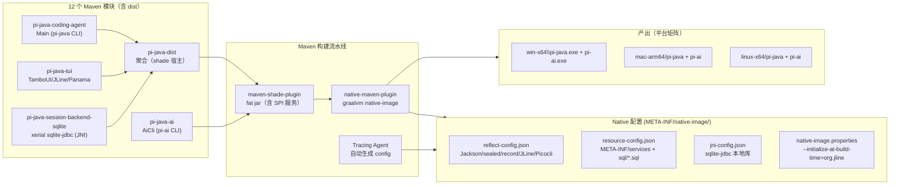

# Phase 5: 原生分发 — 阶段设计文档

> **目标**：通过 GraalVM Native Image 把 `pi-java` 与 `pi-ai` 两个 CLI 编译为独立原生二进制，实现秒级启动与低内存占用。
> **工时**：1–2 周（5 项任务）
> **输入文档**：`04-implementation-plan.md` §7（Phase 5 任务分解 + 风险 R2）
> **前置阶段**：Phase 3（CLI + TUI 可用）、Phase 4（持久化完整）——原生分发只改变「运行形态」，不改业务逻辑
> **对齐基准**：本阶段**无 pi 源码对应物**（pi 是 TypeScript/Node.js，原生分发为 pi-java 独有能力）。参考 `.agents/tamboui-demos/` 中 TamboUI 自带的 GraalVM 配置（JLine reflect-config + 构建时初始化）

---

## 1. 架构概览



**核心设计原则**：

- **两条 CLI 各产一个二进制**：`pi-java`（`com.pijava.coding.agent.Main`）与 `pi-ai`（`com.pijava.ai.cli.AiCli`）。`pi-java` 是主产物，运行时经 ServiceLoader 发现 `SqliteSessionBackendFactory`（sqlite 模块）与 `PiTuiEntryPoint`（tui 模块），因此这两个模块必须进入 native-image classpath。
- **fat jar 先行**：native-image 需要单一 jar。用 `maven-shade-plugin` 把「mainClass + 全部运行时依赖 + META-INF/services + 资源」打成 fat jar，再交给 native-image。这样 ServiceLoader 的 SPI 注册、SQL 迁移资源、logback 配置都被打进一个归档，native-image 的 reachability 分析从 fat jar 出发。
- **运行时聚合缺口（先决条件）**：当前 Maven 图中 `pi-java-session-backend-sqlite` 在 coding-agent 仅为 `test` scope，`pi-java-tui` 是反向依赖（tui → coding-agent），没有任何模块把 sqlite 作为 runtime 依赖。直接 shade coding-agent 不会把 sqlite/tui 打进 fat jar。Phase 5 第一步是建立运行时聚合（见 §5.1）。
- **配置以 Tracing Agent 为准、手写为辅**（对齐风险 R2）：反射面（Jackson sealed record、TamboUI/JLine 终端、Picocli 注解、settings.json 解析）先跑一次带 `-agentlib:native-image-agent` 的 JVM 冒烟（`pi-java -p "hello"` + `pi-ai list-models` + TUI 启动 + SQLite 会话读写），让 agent 自动生成 `reflect-config.json`/`resource-config.json`/`jni-config.json`；再针对已知库（JLine、sqlite-jdbc）手工补充稳定项。**不手写大段反射清单**。
- **优先选 GraalVM 友好库**（对齐风险 R2）：Jackson、Picocli、TamboUI 均声明支持 GraalVM；sqlite-jdbc 需 JNI 配置；Logback 反射较重，native 下考虑降级为 `slf4j-simple` 或 build-time 初始化（见 §5）。

---

## 2. 工具链选型

| 组件 | 选型 | 说明 |
|------|------|------|
| JDK | GraalVM Community Edition **25.2.x（JDK 25 LTS）** | 项目 `java.release` 由 26 降为 25（源码无 Java 26 独有特性，零代码改动）；Panama FFM 已是稳定 API |
| Native 构建插件 | `org.graalvm.buildtools:native-maven-plugin`（**0.10.6**） | 官方插件，`mvn -Pnative package` 一键构建，支持 `buildArgs`/`metadataRepository`；0.11.0 已出，本阶段锁定 0.10.x 稳定线 |
| Fat jar | `maven-shade-plugin` | 打包单一 jar + `Main-Class` 清单 + SPI 服务合并 |
| 反射配置生成 | Tracing Agent（`-agentlib:native-image-agent=config-output-dir=...`） | 自动产出 config JSON |
| 版本管理 | 版本集中在根 `pom.xml` `<properties>`（`version.graalvm`、`version.native-maven-plugin`、`version.shade-plugin`） | 与现有 `version.jackson` 等一致 |

> **Windows C 工具链（win-x64 native 前提，探针已核实）**：GraalVM native-image 在 Windows 上需 MSVC（`cl.exe`/`link.exe`）链接机器码，要求 Visual Studio 2022 Build Tools ≥17.6（「使用 C++ 的桌面开发」工作负载）。**本机探针确认无 `vswhere.exe`/`cl.exe`/`gcc`**，故 win-x64 native 构建委托 CI（`windows-latest` 预装 VS 2022）；本机只做 JVM 开发 + JVM 冒烟（§7）。mac/linux 用系统自带 clang/gcc，无此依赖。

### 2.1 新增根 pom 版本属性（实施第一步）

以下属性当前**均不存在**（已核实根 pom/BOM），实施第一步在根 `pom.xml` `<properties>` 统一新增，替换文档中出现的 `${...}` 引用：

| 属性 | 默认值 | 说明 |
|------|--------|------|
| `version.graalvm` | `25.2.x` | GraalVM CE for JDK 25（LTS）；本机已装 `D:\soft\jdk\graalvm-jdk-25`，CI 用同版本 |
| `version.native-maven-plugin` | `0.10.6` | 锁定 0.10 稳定线（§2 选型） |
| `version.shade-plugin` | `3.6.0` | maven-shade-plugin 稳定版 |
| `version.slf4j` | `2.0.16` | 与 BOM 现有 `slf4j-api` 字面量版本对齐（实施时可顺手把 BOM 字面量统一为该属性） |
> **依赖与风险（R2 展开）**：GraalVM for JDK 25 社区版需支持 Panama FFM + JNI 的 native-image 后端。sqlite-jdbc 的本地库（`sqlitejdbc.dll`/`libsqlitejdbc.dylib`/`.so`）按平台打包，native-image 需 `-H:+JNI` + 把本地库作为 resource 拷贝到构建产物旁。

---

## 3. 反射与 Native 配置总览

Native Image 关闭了反射/JNI/资源/序列化的默认可达性，需显式声明。按「谁需要」分五类：

> **格式说明（GraalVM 25，P5-2 已核）**：Tracing Agent 与 native-image 25 使用 consolidated **`reachability-metadata.json`**（单文件，内含 `reflection`/`resources`/`jni`/`bundles`/`serialization` section），**替代**旧版分文件的 `reflect-config.json`/`resource-config.json`/`jni-config.json`。下表「配置文件」列写的分文件名均指该 consolidated 文件内的对应 section。

| 类别 | 触发方 | 配置文件 | 关键内容 |
|------|--------|----------|----------|
| **反射** | Jackson（sealed record + `@JsonTypeInfo`/`@JsonSubTypes`/`@JsonCreator`/`@JsonValue`） | `reflect-config.json` | `Entry`/`LaneRecord` 全部子类型、`Message`/`ContentBlock`、判别 enum（`OperationOutcome` 等） |
| **反射** | TamboUI/JLine 终端后端 | `reflect-config.json` | `org.jline.terminal.impl.*`（复用 demo 的 140 行清单） |
| **反射** | Picocli 注解（`@Command`/`@Option`） | `reflect-config.json` 或 picocli-codegen | `ArgsParser` 命令类 |
| **JNI** | xerial sqlite-jdbc | `jni-config.json` + resource | `org.sqlite.*` 本地方法 + `sqlitejdbc*` 本地库 |
| **资源** | ServiceLoader + SQL 迁移 | `resource-config.json` | `META-INF/services/*`、`sql/001_initial.sql`；`logback.xml` 仅 JVM 构建需要（native 排除 logback 后无需打包，tui 无独立 logback.xml） |
| **动态代理** | （Jackson 或日志） | `proxy-config.json` | 按 Tracing Agent 产出 |
| **序列化** | （若启用 Java 序列化） | `serialization-config.json` | 按需 |

> **ServiceLoader SPI（关键）**：native-image 默认不扫描 `META-INF/services`。两条 SPI 路径：
> - `com.pijava.agent.session.SessionBackendFactory` → `SqliteSessionBackendFactory`（sqlite 模块）
> - `com.pijava.coding.agent.spi.TuiEntryPoint` → `PiTuiEntryPoint`（tui 模块）
>
> 需在 `resource-config.json` 声明 `META-INF/services/*`，并保证 provider 类被 native-image 的 reachability 分析视为可达（通常靠 mainClass 引用链 + `ServiceLoader` 调用点即可；必要时对 provider 类加 `--initialize-at-build-time` 或 reflect-config 兜底）。

---

## 4. 库级 Native 配置

### 4.1 Jackson（databind，2.19.2）

pi-java 的持久化/协议大量依赖 Jackson 对 sealed record 的 `@JsonTypeInfo` 多态反序列化。Native 下：

- **Jackson 多态类型**（`@JsonTypeInfo` + `@JsonSubTypes`，须注册全部子类型 + 判别）：`Entry`（7）、`LaneRecord`（9）、`ContentBlock`（5）、`StreamEvent`（13）。每个子类型的**全参构造器 + 字段**需可反射。其中 `StreamEvent` 当前仅在测试（`StreamEventTest`）序列化、native 主路径不触发，列入清单以防未来 RPC/telemetry 使用。
- **sealed 非多态类型**（无 `@JsonSubTypes`，走 manual codec 或显式 switch，如 JSONL `JsonlCodec`）：`Message`（4）、`SessionMutation`（5）、`LogItem`、`ForkOptions`。记录序列化仍需字段/构造器反射，但不需多态判别注册。
- **判别 enum**：`OperationOutcome`/`StepKind`/`UsageCause`/`ReplayKind`/`QueueKind`/`SessionErrorCode` 的 `@JsonCreator fromValue` 静态工厂需注册。
- **策略**：Tracing Agent 跑「JSONL v4 编解码 + SQLite payload 编解码 + settings 解析」冒烟即可覆盖绝大多数；再按 §4.5 的稳定清单兜底。`jackson-databind` 自带的 native feature 只能减少少量样板，**用户 sealed record/POJO 的反射注册仍以 Tracing Agent 产出为准**，不依赖自动注册。

### 4.2 TamboUI + JLine（0.4.0）

- **`native-image.properties`**（复用 demo，对齐 `tamboui-jline3-backend`）：
  ```
  Args = --initialize-at-build-time=org.jline \
         --enable-url-protocols=https \
         -H:+ReportExceptionStackTraces
  ```
- **`reflect-config.json`**：JLine 终端 provider 清单（`org.jline.terminal.impl.posix.*`/`jansi.*`/`jna.*`/`ffm.*`/`exec.*`/`win.*`），全部 `allDeclaredConstructors/Methods/Fields`。可直接从 `.agents/tamboui-demos/.../reflect-config.json` 拷贝并适配当前 JLine 版本。
- **Panama 后端**（`tamboui-panama-backend`）：FFM 在 native-image 下需 `--enable-native-access=ALL-UNNAMED`（或 `--enable-native-access` + `-H:+EnableUnsafe` 视后端而定）。Windows 上 Panama 后端可能仍需 fallback 到 jline3 后端（Phase 3 已有 `NoMode2027JLineBackend` 兜底，见下）。

### 4.3 SQLite（xerial sqlite-jdbc 3.47.1.0，JNI）

- `SqliteDatabase.open` 里 `Class.forName("org.sqlite.JDBC")` 触发驱动加载 → 需 `jni-config.json` 声明 `org.sqlite.*` 的本地方法，或依赖 sqlite-jdbc 自带的 native config。
- **coding-agent 侧反射**：`PersistentSessionRepositories` 用 `Class.forName("com.pijava.session.sqlite.SqliteSessionCreateOptions")`/`SqliteSessionListOptions` + `getConstructor` 构造 sqlite 选项、用 `getMethod("cwd").invoke` 读元数据。这些反射点在 coding-agent 模块（非 sqlite 模块），需纳入 reflect-config；冒烟须覆盖 fork 路径以触发 `SqliteSessionCreateOptions` 构造。
- **本地库打包**：sqlite-jdbc 的 jar 内按平台携带 `sqlitejdbc.dll/.dylib/.so`。native-image 需把它们作为 resource 抽取，产物目录结构为 `pi-java(.exe)` + 本地库（同目录或 `-Djava.library.path` 可定位处）。用 `-H:+JNI` 开启 JNI 支持。
- **风险**：三平台本地库需分别构建（§7 平台矩阵）；sqlite-jdbc 版本需与 GraalVM JNI 后端兼容（3.47.x 已验证）。

### 4.4 Picocli（4.7.7）

- `ArgsParser` 与 `AiCli` 用 `@Command`/`@Option` 注解。Picocli 官方推荐 `picocli-codegen` 注解处理器在编译期生成 `reflect-config`（避免反射），或靠 Tracing Agent 产出。选 **Tracing Agent**（与整体策略一致），必要时再上 codegen。

### 4.5 Logback → 简化日志（native 优化点）

Logback（`logback-classic`，runtime）依赖 Joran（SAX）+ 大量反射 + 类扫描，native-image 下配置成本高。**native 产物用 `slf4j-simple` 替换 `logback-classic`**，替换仅影响 native 构建，JVM 构建仍用 logback。

> **前置重构（已随本设计落地）**：`Logging.java` 已改为**仅依赖 slf4j-api**——logback 存在时经反射配置（根级别、TUI 模式 detach CONSOLE appender），logback 缺席（native）时降级为 `org.slf4j.simpleLogger.defaultLogLevel` 系统属性。因此替换依赖不会破坏编译，`Logging.configure(debug, tui)` 签名不变。

> **与 `10-logging-design.md` 的决策变更**：10-logging 原计划「保留 logback + 补 native 反射配置」，本设计改为「native 下切 slf4j-simple」。此为跨文档决策变更，落地时同步更新 10-logging 的 Phase 5 备注。

> **级别时机**：native 下 Logging.configure 在 Main 启动早期设置 org.slf4j.simpleLogger.defaultLogLevel；slf4j-simple 在首次创建 logger 时读取该属性，须保证 configure 先于任何日志输出（当前成立）。

### 4.6 Settings（JSON + Jackson，非 SnakeYAML）

`SettingsManager` 用 Jackson 解析 `settings.json`（`FileSettingsStorage`：全局 `~/.pi-java/agent/settings.json` + 项目 `<cwd>/.pi-java/settings.json`），反序列化走 `Json.mapper()` 的 `Settings` DTO，无 SnakeYAML 依赖。反射已被 §4.1 的 Jackson sealed record 策略覆盖，无需独立配置。

---

## 5. Maven Profile 设计（`-Pnative`）

根 `pom.xml` 新增 `native` profile，产出「shade fat jar → native image」两步：

```xml
<profiles>
  <profile>
    <id>native</id>
    <properties>
      <skipTests>true</skipTests>
    </properties>
    <dependencyManagement>
      <dependencies>
        <!-- native 下把 logback-classic 降为 provided（不进 fat jar），
             并引入 slf4j-simple 作为运行时实现；Logging.java 已 slf4j-api-only -->
        <dependency>
          <groupId>ch.qos.logback</groupId>
          <artifactId>logback-classic</artifactId>
          <version>${version.logback}</version>
          <scope>provided</scope>
        </dependency>
        <dependency>
          <groupId>org.slf4j</groupId>
          <artifactId>slf4j-simple</artifactId>
          <version>${version.slf4j}</version>
        </dependency>
      </dependencies>
    </dependencyManagement>
    <build>
      <plugins>
        <!-- 1. fat jar：shade 每个 CLI 模块，产出 -all.jar -->
        <plugin>
          <groupId>org.apache.maven.plugins</groupId>
          <artifactId>maven-shade-plugin</artifactId>
          <executions>
            <execution><phase>package</phase><goals><goal>shade</goal></goals>
              <configuration>
                <createDependencyReducedPom>false</createDependencyReducedPom>
                <transformers>
                  <!-- 合并 META-INF/services 的 SPI 注册 -->
                  <transformer implementation="...ServicesResourceTransformer"/>
                </transformers>
              </configuration>
            </execution>
          </executions>
        </plugin>
        <!-- 2. native-image：从 fat jar 产出二进制 -->
        <plugin>
          <groupId>org.graalvm.buildtools</groupId>
          <artifactId>native-maven-plugin</artifactId>
          <configuration>
            <mainClass>com.pijava.coding.agent.Main</mainClass>
            <imageName>pi-java</imageName>
            <buildArgs>
              <arg>--enable-url-protocols=https</arg>
              <arg>--enable-native-access=ALL-UNNAMED</arg>
              <arg>-H:+JNI</arg>
              <!-- -march 仅 x86 传入（§7）：由 CI 平台 profile 注入，arm64 不含该 arg -->
            </buildArgs>
          </configuration>
        </plugin>
      </plugins>
    </build>
  </profile>
</profiles>
```

- `pi-ai` 用第二个 execution：`mainClass=com.pijava.ai.cli.AiCli`、`imageName=pi-ai`。
- 构建命令对齐 `04-implementation-plan.md` §7：`mvn -Pnative package`。
- 原生 config 放在 shade 源模块的 `src/main/resources/META-INF/native-image/<groupId>/<artifactId>/`：`pi-java` 产物 → `pi-java-dist`（`com.pi-java/pi-java-dist`），`pi-ai` 产物 → `pi-java-ai`（`com.pi-java/pi-java-ai`）。文件为 consolidated `reachability-metadata.json`（GraalVM 25），Tracing Agent 生成后落这里，再由人工裁剪。
- **按模块归属（推荐）**：sqlite-jdbc 的 `jni-config.json` 放 `pi-java-session-backend-sqlite`、JLine reflect-config 放 `pi-java-tui` 各自模块的 `META-INF/native-image/`；native-image 会合并 classpath 上所有模块的 config，分散放置便于按模块维护（与集中放置二选一保持一致）。
- **-march 平台化**：`buildArgs` 不写死 `-march`；由 CI/平台 profile 按 `os.arch` 注入（x86-64 传 `-march=compatibility`，aarch64 不传），与 §7 平台矩阵一致。

### 5.1 运行时聚合（shade 源模块）

`pi-java` 主产物的 fat jar 必须包含 coding-agent + tui + sqlite 三个模块，但当前依赖图不满足（sqlite 仅 `test` scope、tui 为反向依赖）。**已定案：方案 A**——新增 `pi-java-dist` 聚合模块（不污染 tui 职责、天然承载 shade + native config + 平台产物目录），`runtime` 依赖 coding-agent + tui + session-backend-sqlite + 日志实现（JVM: logback-classic；native profile: slf4j-simple，见 §5），在此模块上执行 shade + native-image，`mainClass=com.pijava.coding.agent.Main`。

`pi-ai` 产物在 `pi-java-ai` 上 shade（ai 自包含，`mainClass=com.pijava.ai.cli.AiCli`）。

### 5.2 `pi-java-dist` 聚合模块骨架（方案 A）

§5 的 XML 是根 `native` profile（负责 `-Pnative` 激活 + dependencyManagement 里 logback→slf4j-simple 交换）；**shade + native-image 的 plugin execution 实际落在 dist 模块与 `pi-java-ai`**，而非根 pom：

```xml
<!-- pi-java-dist/pom.xml -->
<project>
  <parent>
    <groupId>com.pi-java</groupId>
    <artifactId>pi-java-parent</artifactId>
    <version>${project.version}</version>
  </parent>
  <artifactId>pi-java-dist</artifactId>
  <packaging>jar</packaging>

  <dependencies>
    <!-- 主类 Main 在 coding-agent（compile），其传递依赖拉入 agent-core -->
    <dependency>
      <groupId>com.pi-java</groupId>
      <artifactId>pi-java-coding-agent</artifactId>
    </dependency>
    <!-- SPI 实现：只进 runtime classpath，dist 代码不直接引用 -->
    <dependency>
      <groupId>com.pi-java</groupId>
      <artifactId>pi-java-tui</artifactId>
      <scope>runtime</scope>
    </dependency>
    <dependency>
      <groupId>com.pi-java</groupId>
      <artifactId>pi-java-session-backend-sqlite</artifactId>
      <scope>runtime</scope>
    </dependency>
  </dependencies>

  <build>
    <finalName>pi-java</finalName>
    <plugins>
      <!-- shade：fat jar + 合并 META-INF/services（SPI 注册） -->
      <plugin>
        <groupId>org.apache.maven.plugins</groupId>
        <artifactId>maven-shade-plugin</artifactId>
        <version>${version.shade-plugin}</version>
        <executions>
          <execution>
            <phase>package</phase>
            <goals><goal>shade</goal></goals>
            <configuration>
              <createDependencyReducedPom>false</createDependencyReducedPom>
              <transformers>
                <transformer implementation="org.apache.maven.plugins.shade.resource.ServicesResourceTransformer"/>
              </transformers>
            </configuration>
          </execution>
        </executions>
      </plugin>
      <!-- native-image：fat jar → 二进制 -->
      <plugin>
        <groupId>org.graalvm.buildtools</groupId>
        <artifactId>native-maven-plugin</artifactId>
        <version>${version.native-maven-plugin}</version>
        <executions>
          <execution>
            <id>build-native</id>
            <phase>package</phase>
            <goals><goal>compile-no-fork</goal></goals>
          </execution>
        </executions>
        <configuration>
          <mainClass>com.pijava.coding.agent.Main</mainClass>
          <imageName>pi-java</imageName>
          <buildArgs>
            <arg>--enable-url-protocols=https</arg>
            <arg>--enable-native-access=ALL-UNNAMED</arg>
            <arg>-H:+JNI</arg>
            <!-- -march 仅 x86 传入（§7）：由 CI 平台 profile 注入，arm64 不含该 arg -->
          </buildArgs>
        </configuration>
      </plugin>
    </plugins>
  </build>
</project>
```

要点：

- **SPI 可达性**：`pi-java-tui` 与 `pi-java-session-backend-sqlite` 以 `runtime` scope 引入，既不污染 dist 源码，又保证 shade 与 native-image 的 classpath 含 `PiTuiEntryPoint`/`SqliteSessionBackendFactory`，`ServiceLoader` 才能发现它们。
- **config 归属**：native config 随 shade 源模块走，放 `pi-java-dist/src/main/resources/META-INF/native-image/com.pi-java/dist/`（§5 已改）。
- **`pi-ai` 对称**：`pi-java-ai` 自身即入口模块，直接配 shade + native-image（`mainClass=com.pijava.ai.cli.AiCli`、`imageName=pi-ai`），无需 dist。
- **根 pom <modules> 增项**：新增 pi-java-dist 后必须加入根 pom 模块列表，否则 mvn -Pnative package 不会构建 dist（实施第一步）。

---

## 6. Tracing Agent 工作流（配置生成）

按风险 R2「从 Day 1 用 Tracing Agent 自动生成，不手写」。冒烟脚本覆盖所有反射面：

```bash
# 1. JVM 下带 agent 跑关键路径，生成 config 到 src/main/resources/META-INF/native-image/
#    （用 fat jar + JVM，agent 记录所有反射/资源/JNI 访问）
java -agentlib:native-image-agent=config-output-dir=... \
     -cp pi-java-all.jar com.pijava.coding.agent.Main -p "hello"          # print 模式 + LLM 流
java -agentlib:native-image-agent=config-merge-dir=... \
     -cp pi-java-all.jar com.pijava.coding.agent.Main -r <id> -p "x"     # SQLite 恢复 + 读写
java -agentlib:native-image-agent=config-merge-dir=... \
     -cp pi-java-all.jar com.pijava.ai.cli.AiCli list-models             # pi-ai
# TUI 交互模式 + 设置页 + /export /import（真实终端，手动跑一次）
```

覆盖矩阵（对齐 Phase 4 能力面）：
- JSONL/SQLite 会话 create/open/list/fork + import/export（Jackson sealed + sqlite JNI + SPI）。
- settings.json 解析（Jackson，`Settings` DTO）。
- 工具调用（bash/read/write 走 ProcessBuilder + NIO，无反射）。
- 交互 TUI（JLine 终端 + Panama 后端 + slash 命令）。

> 生成后**人工复核**：删掉仅测试路径的条目、确认判别 enum 的 `fromValue` 已注册、确认 `META-INF/services` 已进 resource-config。手写部分只保留 §4 列的稳定项。

> **GraalVM 25 实操要点（P5-2 本地已核）**：
> - **产出格式**：agent 的 `config-output-dir` 生成 consolidated `reachability-metadata.json`（含 `reflection`/`resources`/`jni` section），非旧版分文件（见 §3 格式说明）。
> - **Windows PATH 陷阱**：裸 `java` 可能解析到系统 jdk-26（agent 报「VM incompatible」），必须用全路径 `$JAVA_HOME/bin/java.exe`（GraalVM 25）。
> - **离线冒烟覆盖有限**：`--list-models`/`--version` 只录到 picocli + logback（native 下被 slf4j-simple 换掉，属噪声）+ JDK 基础类型；**Jackson sealed record（`Entry`/`LaneRecord`/`Message`/`ContentBlock`）只在会话持久化时触发**，离线冒烟录不到。
> - **会话冒烟移交 CI**：完整覆盖矩阵（`-p "hello"` 流式 + SQLite 会话 create/recover + FauxProvider 回放）在 CI native smoke job 里跑（本地无 LLM 会话 + 无 MSVC），生成的 `reachability-metadata.json` 回填 dist 模块再人工复核。

---

## 7. 平台矩阵（P5-5）

| 平台 | 二进制 | SQLite 本地库 | 终端后端 | 备注 |
|------|--------|---------------|----------|------|
| **win-x64** | `pi-java.exe`/`pi-ai.exe` | `sqlitejdbc.dll` | jline3（WinSysTerminal）优先，Panama 后端验证后启用 | 本机无 MSVC → native 走 CI `windows-latest`；本机仅 JVM 开发；`-march=compatibility` |
| **mac-arm64** | `pi-java`/`pi-ai` | `libsqlitejdbc.dylib` | Panama 后端（Terminal.app/iTerm2/Alacritty） | Apple Silicon 主力测试 |
| **linux-x64** | `pi-java`/`pi-ai` | `libsqlitejdbc.so` | Panama 后端 | CI 矩阵覆盖 |

- **构建矩阵**：GitHub Actions 三平台各跑 `mvn -Pnative package`（P5-4），产物上传 artifact，并对产物跑「`pi-java -p "hello"` + SQLite 会话 create/recover」冒烟（复用 Phase 4 端到端用例的 native 形态），避免只验证「构建成功」。公开仓库下 GitHub Actions 完全免费（无限分钟，含 macOS），是 win/mac/linux 三平台 native 的首选。

  ```yaml
  # .github/workflows/native.yml（P5-4：三平台 native 构建矩阵）
  name: Native Image
  on:
    push: { branches: [main] }
    pull_request:

  jobs:
    native:
      strategy:
        fail-fast: false
        matrix:
          os: [ubuntu-latest, windows-latest, macos-latest]   # macos-latest = Apple Silicon (arm64)
      runs-on: ${{ matrix.os }}
      steps:
        - uses: actions/checkout@v4

        - uses: graalvm/setup-graalvm@v1
          with:
            java-version: '25'
            distribution: 'graalvm-community'   # 免费 CE；对齐本机 Oracle GraalVM 可换 'oracle-graalvm'
            github-token: ${{ secrets.GITHUB_TOKEN }}
            cache: 'maven'

        # windows-latest 预装 VS 2022（MSVC）→ native-image 可直接链接（§2、风险 N7）
        - name: Build native image
          run: ./mvnw -Pnative package --batch-mode

        - uses: actions/upload-artifact@v4
          with:
            name: pi-java-native-${{ matrix.os }}
            path: |
              pi-java-dist/target/pi-java*
              pi-java-ai/target/pi-ai*
  ```

  > 说明：`graalvm/setup-graalvm@v1` 自带 native-image；`macos-latest` 即 Apple Silicon（匹配 mac-arm64）；win-x64 无需本机 MSVC（runner 预装 VS 2022）。CodeMagic 等移动端 CI 不适用于 JVM/native-image，不采用。
- **平台探针（P5-1 前置，本机已执行）**：hello-world 空壳 native-image 已跑——GraalVM 25 native-image 本身正常，但**本机无 `vswhere.exe`/`cl.exe`（无 VS 2022 Build Tools），Windows 链接无法完成** → win-x64 native 委托 CI（§2、风险 N7）。mac/linux 无需额外工具链。
- **`-march` 策略**：`-march=compatibility|native` 仅对 x86 目标有意义；arm64 的 `-march` 语义不同（默认即可），因此该参数应只在 x86 平台传入，arm64 构建不设置。跨平台发布用 `compatibility`。
- **本地库分发**：SQLite 本地库随二进制一起打包（zip/tar 归档），二进制靠相对路径或 `-Djava.library.path` 定位。

---

## 8. 启动性能与体积目标（里程碑）

| 指标 | 目标 | 度量 |
|------|------|------|
| 启动时间 | `< 100ms`（`pi-java -p "hello"` 到首帧/首 token）——含 sqlite JNI + JLine 初始化偏乐观，作 stretch 目标；CI 记录实测，可接受下限 100–300ms | 冷启动计时 |
| 空闲内存 | `< 50MB` RSS | 空闲态 RSS |
| 二进制体积 | `pi-java` 硬上限 ≤30MB，**精简后目标 ~15–20MB** | 产物大小 |

> 体积从 04 计划的「~10MB」上修为 ≤30MB（含 sqlite-jdbc JNI 库 + JLine + TamboUI 三个重型库），但「尽量精简」作为明确约束，应用下列精简策略把目标压到 ~15–20MB。仍远小于 JVM 启动（需 ~200MB 堆 + JDK）。

### 8.1 体积精简策略（对齐「尽量精简」约束）

| 策略 | 手段 | 预期收益 |
|------|------|----------|
| **charset 裁剪** | `-H:-AddAllCharsets`：只打包 UTF-8/US-ASCII，不打包全部 JDK charset | ~2MB |
| **日志降级** | native profile 用 `slf4j-simple` 替换 logback（§4.5）：去掉 Joran/反射/~1MB | ~1MB |
| **依赖裁剪** | shade 只含运行时可达模块；`protocol`/`client`/`server`/`evals` 不在 `pi-java`/`pi-ai` 运行时路径，不进 fat jar | 视依赖 |
| **GC** | `--gc=serial`（native-image 默认，最小） | 基线 |
| **异常栈精简** | release 构建去掉 `-H:+ReportExceptionStackTraces`（仅 debug 构建保留） | ~0.5MB |
| **内联** | 体积优先时 `-H:-InlineBeforeAnalysis`（用少量运行性能换体积） | ~1–2MB |
| **优化级别** | `-O2`（默认平衡）；必要时 `-O3` 与 `-O2` 对比择小 | 视场景 |
| **不做压缩壳** | 不用 UPX 等加壳（触发杀软误报、破坏签名） | — |

> 这些策略在 `-Pnative` profile 的 `buildArgs` 里落地（§5），构建后记录实测体积，不达 ~20MB 时按上表逐项加码。

---

## 9. 风险与缓解

| 序号 | 风险 | 影响 | 概率 | 缓解 |
|------|------|------|------|------|
| N1 | Jackson sealed record 反射面遗漏 → 运行时反序列化失败 | 高 | 中 | Tracing Agent 覆盖编解码路径 + 判别 enum 手写兜底 |
| N2 | sqlite-jdbc JNI 本地库未正确打包 → 启动即失败 | 高 | 中 | 三平台分别验证本地库；`jni-config.json` + resource 打包 + 冒烟测试 |
| N3 | TamboUI Panama 后端在 native 下不可用（FFM/信号） | 中 | 中 | 保留 jline3 后端兜底（Phase 3 已有）；`--initialize-at-build-time=org.jline` |
| N4 | Logback 反射过重拖慢构建/失败 | 中 | 中 | native profile 切换 `slf4j-simple`（§4.5） |
| N5 | ~~GraalVM for JDK 26 尚未发布~~ **已解决**：改用 GraalVM 25.2.x（JDK 25 LTS）+ 项目降到 Java 25 | 已解决 | — | `java.release` 26→25 仅改根 pom 两行，源码零改动；GraalVM 25 已装稳定 |
| N6 | 反射清单随 Phase 迭代漂移 | 中 | 中 | `-Pnative package` 纳入每 PR 验证（R2），config 与业务同仓 |
| N7 | ~~Windows 本机无 MSVC → native 链接失败~~ **已解决（方案 B）**：win-x64 native 委托 CI `windows-latest`（预装 VS 2022）；本机仅 JVM 开发 | 已解决 | — | 探针已核实本机无 cl.exe/gcc；日后本机需 win-x64 native 时先装 VS 2022 Build Tools |

---

## 10. 验收标准

- [ ] `mvn -Pnative package` 在 CI `windows-latest` 产出 win-x64 `pi-java.exe`/`pi-ai.exe`，可运行（本机无 MSVC，win-x64 native 委托 CI）。
- [ ] 三平台（win-x64 / mac-arm64 / linux-x64）native 构建成功（CI 矩阵）。
- [ ] `pi-java -p "hello"` 冷启动 < 100ms，空闲内存 < 50MB。
- [ ] 首次成功构建后回填 §8 实测的启动时间 / 空闲内存 / 二进制体积三项，并与目标对比（体积不达 ~20MB 时按 §8.1 逐项加码）。
- [ ] 原生二进制能完成「建会话 → 写 entry/record → SQLite 恢复 → `/export` `/import`」全链路（Phase 4 能力面回归）。
- [ ] CI 对三平台产物自动跑 native 冒烟（`-p "hello"` + SQLite create/recover），非仅构建成功。
- [ ] 交互 TUI 在原生二进制下可启动并处理输入（jline3 或 Panama 后端）。
- [ ] 无 `System.out.println` 残留、checkstyle/SpotBugs 零警告（延续 Phase 4 门禁）。

---

## 11. Phase 5 不做

- **CBOR 协议 / 远程会话**（→ Phase 6，`pi-java-protocol`/`server`/`client` 模块不在本阶段 native 产物内）。
- **交叉编译**：不在 win 上编译 mac/linux 产物（GraalVM 原生不支持交叉编译），三平台各自在目标平台构建。
- **native-image 的 GraalVM 升级策略**：本阶段锁定 GraalVM 25.2.x（JDK 25 LTS），后续升版本单独 PR（对齐风险 R6 思路）。
- **安装器/签名**：win/mac 的安装包、代码签名、公证 → 后续发布阶段，本阶段只产出裸二进制归档。

---

## 12. 设计审查记录

### v1.0（2026-08-16 初稿）

初始版本。因 `03-detailed-design.md` 无 Phase 5 章节、pi 无 GraalVM 对应物，本设计从 `04-implementation-plan.md` §7 任务分解 + 风险 R2 出发，参考 `.agents/tamboui-demos/` 的 TamboUI native 配置，明确：

1. **fat jar 先行**：shade 打包解决 ServiceLoader SPI 合并 + 资源归集。
2. **Tracing Agent 为主、手写为辅**：反射配置自动生成，仅 JLine/sqlite-jdbc 手写稳定项。
3. **两条 CLI 各一产物**：`pi-java` + `pi-ai`，sqlite/tui 模块经 ServiceLoader 进入 classpath。
4. **Logback → slf4j-simple**（native 优化点）。
5. **体积目标上修**（~10MB → ≤30MB）：如实反映 sqlite-jdbc/JLine/TamboUI 三个重型库。

### v1.1（2026-08-16 审批修订）

审批结论：**体积上修 + Logback 降级均通过**；体积追加「尽量精简」约束。据此新增 §8.1 体积精简策略（charset 裁剪 / 依赖裁剪 / 异常栈精简 / 内联 / GC），体积目标明确为「硬上限 ≤30MB、精简后 ~15–20MB」。其余设计（fat jar + shade、两条 CLI、Tracing Agent 为主）无异议。

### v1.2（2026-08-16 审查修订，含代码核实）

对照仓库事实与代码实施前审查，两轮修订合并：

1. **删除 SnakeYAML 反射面**：settings 实为 `settings.json` + Jackson（`SettingsManager`/`FileSettingsStorage`），snakeyaml 无任何模块依赖；§1/§3/§4.6/§6 统一为 Jackson 解析，并清理根 pom `version.snakeyaml` 死属性。
2. **Logback 降级前置重构**：`Logging.java` 改为仅依赖 slf4j-api（logback 经反射配置，缺席时降级 slf4j-simple 属性）；§4.5/§5 替换机制由「classifier」改为 native profile 内 dependencyManagement 将 `logback-classic` 降为 provided + 引入 `slf4j-simple`；标注与 `10-logging-design.md` 的跨文档决策变更。
3. **Message 子类型数修正**（3 → 4：System/User/Assistant/ToolResult）。
4. **新增「运行时聚合缺口」（§5.1）**：sqlite 仅 `test` scope、tui 为反向依赖，shade 源模块需先建立 runtime 聚合（方案 A：`pi-java-dist` 聚合模块；方案 B：tui 增加 sqlite runtime 依赖）。
5. **§4.3：补 coding-agent 对 `com.pijava.session.sqlite.*` 的反射入口**（`Class.forName` + `getConstructor`），冒烟须覆盖 fork 路径。
6. **P2 补充**：Jackson「自动注册」表述澄清（用户类型仍以 Tracing Agent 为准）；`-march` 仅 x86 语义；sqlite/tui 原生 config 按模块归属；平台探针任务（P5-1 前置）；CI 产物 native 冒烟（P5-4/验收）；启动 <100ms 列为 stretch 目标。

### v1.3（2026-08-16 复审修订）

按 95% 门禁复审，采纳「方案 A」并进一步修订：

1. **§5.1 定案方案 A**：新增 `pi-java-dist` 聚合模块（原「二选一」收敛为单一方案，dist 承载 shade + native config + 平台产物目录）。
2. **§4.1 反射清单分层**：区分 Jackson 多态类型（`Entry` 7 / `LaneRecord` 9 / `ContentBlock` 5 / **`StreamEvent` 13**）与 sealed 非多态类型（`Message` 4 / `SessionMutation` 5 / `LogItem` / `ForkOptions`）；补漏 `StreamEvent`（当前仅测试序列化，列入以防未来 RPC/telemetry 使用）。
3. **§2 锁定版本**：GraalVM CE 26.0.x（可用性 Day-1 核实）+ native-maven-plugin 0.10.6（0.11.0 已出，本阶段锁 0.10 稳定线）。
4. **§9 N5 升级**：GraalVM 26 可用性由「低概率」升为「高概率 Day-1 blocker」（26.0.0 计划 2026-03-17，截至 2026-08 版本跟踪源最新为 25.2.4）。
5. **§10 验收新增**：首次成功构建后回填 §8 实测启动/内存/体积。
6. **闭环 `10-logging-design.md`**：其 Phase 5 备注由「补 logback 反射配置」改为「native 下切 slf4j-simple」。
### v1.4（2026-08-16 复审修订，实施前勘误）

按实施前复审意见修订：

1. **§8.1 charset 标志语法**：`-H:+AddAllCharsets=false` 改为合法布尔语法 `-H:-AddAllCharsets`。
2. **`-march` 平台化**：§5/§5.2 的 `buildArgs` 不再写死 `-march=compatibility`，改由 CI/平台 profile 按 `os.arch` 注入（x86-64 传 `compatibility`、aarch64 不传），与 §7 一致。
3. **§2.1 新增版本属性清单**：`version.graalvm`（26.0.x）、`version.native-maven-plugin`（0.10.6）、`version.shade-plugin`（3.6.0）、`version.slf4j`（2.0.16，对齐 BOM 现有 slf4j-api），替换文档中的 `${...}` 引用。
4. **§3 resource 行**：`logback.xml` 标注「仅 JVM 构建需要，native 排除 logback 后无需打包；tui 无独立 logback.xml」。
5. **§5.1 dist 依赖**：日志实现措辞明确（JVM: logback-classic；native profile: slf4j-simple）。
6. **§5.2**：补「根 pom `<modules>` 增列 `pi-java-dist`」。
7. **§4.2**：`-H:EnableUnsafe` 更正为 `-H:+EnableUnsafe`。
8. **§4.5**：补 slf4j-simple 级别属性的设置时机说明（configure 先于任何日志输出）。

### v1.5（2026-08-16 工具链定案）

用户确认本机已装 `D:\soft\jdk\graalvm-jdk-25`，据此把工具链从「GraalVM 26（尚未发布）」改为「GraalVM 25 + Java 25 LTS」：

1. **§2 / §2.1**：JDK 目标改为 GraalVM CE 25.2.x（`version.graalvm=25.2.x`），项目 `java.release` 26 → 25。
2. **§9 N5**：从「高概率 Day-1 blocker」降为「已解决」（GraalVM 25 已装稳定 + Java 25 LTS）。
3. **§11**：升级策略锁 GraalVM 25.2.x。
4. **依据（已核实）**：pi-java 源码无 Java 26 独有特性（无 `--enable-preview`、无 FFM 直用，实际用 records/sealed/switch/虚拟线程，均 Java 16–21）；依赖侧 `tamboui-panama-backend` = class file 0x42（Java 22）、其余更低，无 >Java 25 字节码。
5. **配套代码改动（已执行）**：根 `pom.xml` + BOM `java.release` 26→25、enforcer `[26,27)`→`[25,26)`；`run.cmd` JAVA_HOME → `graalvm-jdk-25`；`ci.yml` `java-version` 26→25；4 处 Java 注释同步为「JDK 25」。全仓库无残留 JDK 26 引用。

### v1.6（2026-08-16 平台探针 + 方案 B）

本机平台探针（hello-world 空壳 native-image）结果：GraalVM 25 native-image 正常，但**本机无 Visual Studio 2022 Build Tools（无 `vswhere.exe`/`cl.exe`）且无 gcc**，Windows 链接无法完成。

1. **§2 / §7**：记录「Windows native 需 MSVC（VS 2022 Build Tools ≥17.6）」这一前提；win-x64 native 委托 CI `windows-latest`（预装 VS 2022），本机仅 JVM 开发。
2. **§9 新增 N7**：本机无 MSVC → 已解决（方案 B，委托 CI）。
3. **§10**：win-x64 验收改为「CI `windows-latest` 产出」。

### v1.7（2026-08-17 CI 方案补全）

确定 CI 用 GitHub Actions（公开仓库完全免费、三 OS 全覆盖），§7 构建矩阵补 `.github/workflows/native.yml` 片段：`graalvm/setup-graalvm@v1`（java-version 25）+ 三 OS 矩阵 + `./mvnw -Pnative package` + artifact 上传。mac-arm64 用 `macos-latest`（Apple Silicon）；win-x64 用 `windows-latest`（预装 VS 2022）。CodeMagic 等移动端 CI 不适配，不采用。

### v1.8（2026-08-17 P5-2 实操勘误）

P5-1 落地（`pi-java-dist` 模块 + native profile + shade fat jar，本地 `mvn clean verify` 通过、fat jar 冒烟 `--version` OK）后，P5-2 本地跑 Tracing Agent 发现：

1. **§3/§5/§6 格式变更**：GraalVM 25 的 agent 产出 consolidated `reachability-metadata.json`（替代旧版 reflect-config/resource-config/jni-config 分文件）；native-image 25 读取 `META-INF/native-image/<groupId>/<artifactId>/reachability-metadata.json`。
2. **§5 config 路径**：`com.pi-java/dist` 更正为 `com.pi-java/pi-java-dist`（groupId/artifactId 约定）。
3. **§6 实操要点**：Windows 裸 `java` 解析到 jdk-26（用全路径 `java.exe`）；离线冒烟只录 picocli+logback+JDK，Jackson sealed record 需会话冒烟，**移交 CI**。

### v1.9（2026-08-17 P5-4 落地）

落地 `.github/workflows/native.yml`（三平台 native 矩阵）并修两个 `-Pnative` 实测 bug：

1. **`skip.native.tests` → `maven.test.skip`**：前者非 Maven 识别属性（不会真跳过测试），改为 `maven.test.skip=true`。
2. **logback dependencyManagement 条目补 version**：native profile 里 logback-classic 条目无 version 会顶掉 BOM 版本管理 → `-Pnative validate` 报「version is missing」；补 `${version.logback}=1.5.16`。
3. **native.yml**：`graalvm/setup-graalvm@v1` + 三 OS + `./mvnw -Pnative package` + artifact 上传；`pi-ai` 原生产物与 native 冒烟留 TODO（P5-5）。
