# Phase 6: 生态扩展 — 阶段设计文档

> **目标**：在 Phase 0–4 的 MVP 基础上进入生态持续扩展：扩充 LLM Provider（聚焦中国大陆常用供应商）、建立评估框架（evals）、落地 JSONL RPC 模式、CBOR 远程会话、Skills/Extensions 插件体系、远程模型目录与 Maven Central 发布流水线。
> **工时**：持续阶段（按工作流分别推进；首批高优先级约 4–6 周）
> **输入文档**：`04-implementation-plan.md` §8（Phase 6 可选任务）、`01-requirements-analysis.md`（F2/F4/F7/F22/F24/F25/F31/F33/F35）、`02-architecture-design.md`（协议/客户端/服务端模块）、`03-detailed-design.md`（AI 层接口、AgentSession、协议预留）
> **前置阶段**：Phase 5（GraalVM 原生分发）**已放弃**（实测 149MB 远超 ≤30MB 目标，退回 JVM fat jar 分发，见 `10-phase5-native-design.md` §v1.10）。`pi-java-protocol`、`pi-java-client`、`pi-java-server`、`pi-java-evals` 四个模块目前仅有骨架（`package-info.java`）
> **对齐基准**：pi 的 `packages/ai`（Provider 生态）、`packages/evals`、`packages/protocol`、`packages/client`、`packages/server`、`packages/coding-agent`（RPC/Skills/Extensions）
>
> **⚠️ 分发形态变更影响**：本文档所有涉及 Native Image 的约束（reachability-metadata 同步、native 构建验收、`loadJar` 的 native 限制）均已作废，改为 JVM fat jar 语境。详见 §10 验收标准与 §11 风险表。

---

## 1. 架构概览

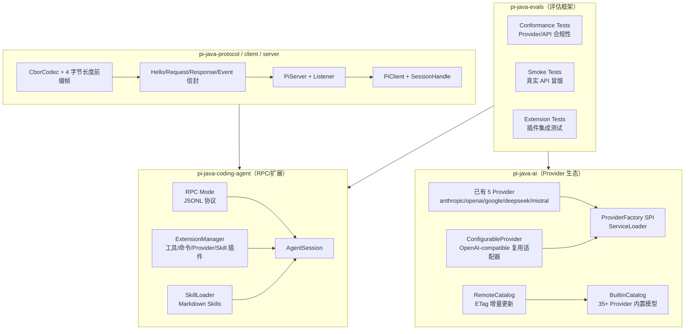

**核心设计原则**

- **Provider 生态优先复用协议适配器**：新增 Provider 中绝大多数是 OpenAI Chat Completions 兼容协议，用「配置描述 + 同一适配器」实现，而不是每个 Provider 复制一份协议代码。只有 Bedrock、Vertex AI、Azure OpenAI 等认证/协议差异大的供应商引入专属适配器。
- **Provider 范围聚焦中国大陆常用供应商**：不追求与 pi 的 39 个 provider 逐一对齐（pi 含大量境外 token-plan 变体与订阅制 OAuth provider，对本项目用户价值低）。本阶段按「中国大陆可直接使用 + OpenAI 兼容」筛选，见 §2.4。
- **一个 Provider 可支持多个协议**：pi 的 `Provider` 声明 `api` 为「协议 → 适配器」映射（如 `fireworks` 同时支持 `anthropic-messages` 与 `openai-completions`，`opencode` 支持 4 种）。pi-java 的 `ProviderConfig` 需支持多协议映射而非单一 `protocol` 字段。
- **Evals 是契约测试而不是脚本**：conformance 测试直接面向 `Provider` / `ChatApi` / `AgentHarness` 公开接口，使用 FauxProvider、录制响应、真实 API 三种模式分层执行。
- **RPC 与远程会话是两套不同抽象**：RPC 模式（JSONL over stdio）暴露的是**单个本地会话的完整控制面**（prompt/steer/model/compaction/bash/fork…），面向 headless 集成；CBOR client/server 暴露的是**多会话服务器的会话租约与快照订阅**，面向跨进程/跨机器。二者协议、粒度、语义都不同，不共享编解码层。
- **扩展点全部走 SPI**：Provider、Extension、Skill 都以 ServiceLoader 或目录扫描发现，避免 coding-agent 硬编码第三方类。
- **目录和发布属于生态闭环**：远程模型目录解决「内置数据滞后」问题；CLI 发布工具和 Maven Central 流水线让 Provider/目录数据可以独立迭代。

---

## 2. 工作流 A：Provider 生态扩展

### 2.1 现状与差距

| 现状（实测） | Phase 6 目标 |
|------|-------------|
| 内置 5 个 Provider（Anthropic/OpenAI/Google/DeepSeek/Mistral） | 新增 11 个中国大陆常用 Provider，合计 16 个（§2.4） |
| `Provider` / `ProviderFactory` / `ProviderRegistry` SPI 已存在 | 扩展为「配置驱动 + 专属适配器」双层体系 |
| `OpenAICompletionsApi` 已支持 baseUrl + `apiKeyEnvVar` 双参构造（DeepSeek 复用） | 抽象 `OpenAiCompatibleProvider`，批量接入 OpenAI 兼容供应商 |
| 4 个协议适配器：`OpenAICompletionsApi` / `AnthropicMessagesApi` / `GoogleGenerativeAiApi` / `MistralConversationsApi` | 复用现有 4 个适配器覆盖全部新增 Provider，本阶段不新增适配器 |
| `BuiltinCatalog` 硬编码 5 家模型数据（`anthropicModels()` 等 5 个静态方法 + `all()`） | 新增 `RemoteCatalog`，ETag 条件刷新，保留内置数据兜底 |
| `ProviderRegistry.discoverFromServiceLoader()` 已有，但**启动装配未调用**（`DefaultProviders.defaultProviders()` 为手动 `register`） | 在 `DefaultProviders` 中调用 ServiceLoader 发现，第三方 JAR 可自动注册（P6-1 显式子任务） |
| `ProviderApi` 是 `sealed interface ... permits ChatApi` | P6-28 已引入 `ImageApi`/`EmbeddingApi`，permits 改为 `ChatApi, ImageApi, EmbeddingApi`（详见 `12-phase6-image-embedding-design.md`） |

> **与 pi 的既有偏差（不在本阶段修正，仅记录）**：pi 的 `openai` provider 使用 `openai-responses` 协议（Responses API），pi-java 的 `OpenAIProvider` 使用 `OpenAICompletionsApi`（Chat Completions API）。pi 另有 `openai-responses` / `azure-openai-responses` / `openai-codex-responses` / `bedrock-converse-stream` / `google-vertex` / `pi-messages` 六个适配器 pi-java 未实现。本阶段的新增 Provider 全部落在已有 4 个适配器上，不触碰该偏差。

### 2.2 包结构与类图

```
com.pijava.ai.provider/
├── Provider.java                  ← 现有 SPI，保持兼容
├── ProviderFactory.java           ← 现有 SPI
├── ProviderRegistry.java          ← 现有注册表
├── ProviderConfig.java            ← 新增：Provider 静态配置（含多协议映射）
├── Protocol.java                  ← 新增：协议族枚举
├── ConfigurableProvider.java      ← 新增：配置驱动 Provider 基类
├── OpenAiCompatibleProvider.java  ← 新增：OpenAI 兼容 Provider 基类
├── AnthropicCompatibleProvider.java ← 新增：复用 AnthropicMessagesApi（MiniMax 等）
└── builtin/                       ← 新增：Provider 集中注册
    ├── ProviderCatalog.java
    └── ModelData.java
```

> **不含 bedrock/azure/vertex 子包**：三个云厂商 Provider 需要 `bedrock-converse-stream` / `azure-openai-responses` / `google-vertex` 三个 pi-java 尚未实现的适配器，且认证分别依赖 AWS SigV4、Azure `api-key` header、GCP ADC/服务账号。它们不在中国大陆常用范围内（§2.4 筛选标准），**整体移出本阶段**，留作后续独立议题。

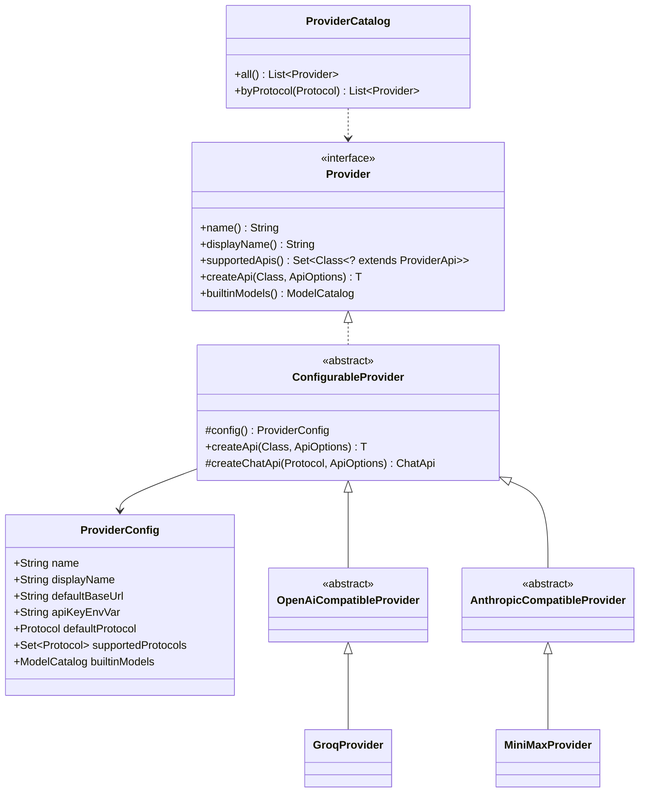

### 2.3 关键接口/类签名

```java
/**
 * 协议族 —— 对应一个 ChatApi 适配器实现。
 * 命名与 pi 的 KnownApi 对齐（pi: "openai-completions" / "anthropic-messages" / ...）。
 * 纯常量闭集 → 用 enum（CLAUDE.md 编码规范）。
 */
public enum Protocol {
    /** pi: "openai-completions" → OpenAICompletionsApi（Phase 1 已有） */
    OPENAI_COMPLETIONS,
    /** pi: "anthropic-messages" → AnthropicMessagesApi（Phase 1 已有） */
    ANTHROPIC_MESSAGES,
    /** pi: "google-generative-ai" → GoogleGenerativeAiApi（Phase 1 已有） */
    GOOGLE_GENERATIVE_AI,
    /** pi: "mistral-conversations" → MistralConversationsApi（Phase 1 已有） */
    MISTRAL_CONVERSATIONS,
    /** pi: "openai-responses" → OpenAIResponsesApi（Phase 6 新增，§2.5.1） */
    OPENAI_RESPONSES,
    /** pi: "azure-openai-responses" → AzureOpenAIResponsesApi（Phase 6 新增，§2.5.2） */
    AZURE_OPENAI_RESPONSES,
    /** pi: "pi-messages" → PiMessagesApi（Phase 6 新增，§2.5.3） */
    PI_MESSAGES;

    @JsonValue
    public String wireName() {
        return name().toLowerCase(Locale.ROOT).replace('_', '-');
    }
}
```

> **枚举范围**：7 个协议 —— Phase 1 已有 4 个 + Phase 6 新增 3 个（§2.5）。pi 另有 `openai-codex-responses`、`bedrock-converse-stream`、`google-vertex` 三个协议不实现（分别依赖 ChatGPT 订阅 OAuth、AWS SigV4、GCP ADC，均超出本阶段范围）。不设 `CUSTOM` 兜底值 —— 新协议必须先有适配器再加枚举值。

```java
// Provider 静态配置 —— 一个 Provider 一份不可变配置
public record ProviderConfig(
    String name,
    String displayName,
    String defaultBaseUrl,
    String apiKeyEnvVar,
    /** 未显式指定协议时使用的默认协议 */
    Protocol defaultProtocol,
    /**
     * 该 Provider 支持的全部协议。对齐 pi 的 `api` 映射：
     * pi 的 fireworks 同时支持 anthropic-messages 与 openai-completions，
     * opencode 支持 4 种。单协议 Provider 传 Set.of(defaultProtocol)。
     */
    Set<Protocol> supportedProtocols,
    ModelCatalog builtinModels
) {
    public ProviderConfig {
        Objects.requireNonNull(name, "name");
        Objects.requireNonNull(defaultProtocol, "defaultProtocol");
        builtinModels = builtinModels == null ? ModelCatalog.empty() : builtinModels;
        supportedProtocols = supportedProtocols == null || supportedProtocols.isEmpty()
            ? Set.of(defaultProtocol)
            : Set.copyOf(supportedProtocols);
        if (!supportedProtocols.contains(defaultProtocol)) {
            throw new IllegalArgumentException(
                "defaultProtocol " + defaultProtocol + " not in supportedProtocols");
        }
    }

    /** 单协议 Provider 的便捷构造。 */
    public static ProviderConfig single(
            String name, String displayName, String baseUrl,
            String apiKeyEnvVar, Protocol protocol, ModelCatalog models) {
        return new ProviderConfig(
            name, displayName, baseUrl, apiKeyEnvVar, protocol, Set.of(protocol), models);
    }
}

// 配置驱动 Provider 基类：所有新 Provider 复用
public abstract class ConfigurableProvider implements Provider {

    protected abstract ProviderConfig config();

    @Override
    public final String name() {
        return config().name();
    }

    @Override
    public final String displayName() {
        return config().displayName();
    }

    @Override
    public final Set<Class<? extends ProviderApi>> supportedApis() {
        return Set.of(ChatApi.class);
    }

    @Override
    public final ModelCatalog builtinModels() {
        return config().builtinModels();
    }

    /**
     * 统一的 ApiOptions 归一化 + 协议路由。
     * 注意：createApi 不能是 final —— 需要额外 header/请求体改写的 Provider
     * 要能覆写 createChatApi。
     */
    @Override
    public <T extends ProviderApi> T createApi(Class<T> apiType, ApiOptions options) {
        if (!apiType.equals(ChatApi.class)) {
            throw new IllegalArgumentException("Unsupported API type: " + apiType);
        }
        var protocol = resolveProtocol(options);
        return apiType.cast(createChatApi(protocol, effectiveOptions(options)));
    }

    /** 从 ApiOptions.extra 的 "protocol" 键读取协议，缺省用 config().defaultProtocol()。 */
    protected final Protocol resolveProtocol(ApiOptions options) {
        var raw = options.extra().get("protocol");
        if (raw == null) {
            return config().defaultProtocol();
        }
        var protocol = Protocol.valueOf(
            raw.toString().toUpperCase(Locale.ROOT).replace('-', '_'));
        if (!config().supportedProtocols().contains(protocol)) {
            throw new IllegalArgumentException(
                "Provider " + name() + " does not support protocol " + protocol);
        }
        return protocol;
    }

    /** baseUrl 空则回落到 config().defaultBaseUrl()。 */
    protected final ApiOptions effectiveOptions(ApiOptions options) {
        if (options.baseUrl() != null && !options.baseUrl().isBlank()) {
            return options;
        }
        return new ApiOptions(
            config().defaultBaseUrl(), options.apiKey(),
            options.timeout(), options.maxRetries(), options.extra());
    }

    /** 子类按协议构造适配器。 */
    protected abstract ChatApi createChatApi(Protocol protocol, ApiOptions options);
}

// OpenAI 兼容 Provider 基类：Groq/Moonshot/Qwen/... 共用
public abstract class OpenAiCompatibleProvider extends ConfigurableProvider {
    @Override
    protected ChatApi createChatApi(Protocol protocol, ApiOptions options) {
        return switch (protocol) {
            case OPENAI_COMPLETIONS ->
                new OpenAICompletionsApi(options, config().apiKeyEnvVar());
            default -> throw new IllegalArgumentException(
                "OpenAiCompatibleProvider cannot serve protocol " + protocol);
        };
    }
}

// Anthropic 兼容 Provider 基类：MiniMax 等（pi 的 minimax 走 anthropic-messages）
public abstract class AnthropicCompatibleProvider extends ConfigurableProvider {
    @Override
    protected ChatApi createChatApi(Protocol protocol, ApiOptions options) {
        return switch (protocol) {
            case ANTHROPIC_MESSAGES ->
                new AnthropicMessagesApi(options, config().apiKeyEnvVar());
            default -> throw new IllegalArgumentException(
                "AnthropicCompatibleProvider cannot serve protocol " + protocol);
        };
    }
}

// 具体 Provider 只需要声明配置；模型数据来自 ModelData 或远程目录
public final class GroqProvider extends OpenAiCompatibleProvider {
    @Override
    protected ProviderConfig config() {
        return ProviderConfig.single(
            "groq", "Groq", "https://api.groq.com/openai/v1",
            "GROQ_API_KEY", Protocol.OPENAI_COMPLETIONS,
            ModelData.groqModels());
    }
}

// 注册表增强：支持按协议列出、批量加载内置 Provider
public final class ProviderRegistry {
    // 现有方法保留：create/global/register/get/listAll/discoverFromServiceLoader/remove/clear
    public List<Provider> listByProtocol(Protocol protocol);
    public int loadBuiltinProviders();
}
```

> **⚠️ `AnthropicMessagesApi` 前置改造（P6-1 的阻塞子任务）**：实测 `AnthropicMessagesApi:37-40` 只有单参构造 `(ApiOptions)`，且：
> 1. `resolveApiKey` **硬编码 `ANTHROPIC_API_KEY`**（`:191`），无 `apiKeyEnvVar` 参数；
> 2. 构造器**完全忽略 `options.baseUrl()`**，直接 `AnthropicOkHttpClient.builder().apiKey(...)`，没有 `.baseUrl(...)`。
>
> 即 `AnthropicCompatibleProvider` 在改造前**无法工作** —— MiniMax 会拿 `MINIMAX_API_KEY` 的配置却读 `ANTHROPIC_API_KEY`，并把请求发到 `api.anthropic.com`。P6-1 必须先补 `(ApiOptions, String apiKeyEnvVar)` 构造 + `baseUrl` 覆盖，与 `OpenAICompletionsApi:59-63` 对称。这是本工作流的第一个提交。

### 2.4 新增 Provider 清单（聚焦中国大陆常用）

**筛选标准**：① 中国大陆可直接访问（无需代理）或为大陆主流云厂商；② 已有 pi-java 适配器可复用；③ 走 API key 认证（不依赖 OAuth 订阅流程）。**不追求补齐 pi 的 39 个 provider。**

`baseUrl` / 环境变量均取自 pi 源码实测值，未列出的为 pi 无对应 provider（需自行确认官方端点，标注「pi 无」）。

| # | Provider | id | baseUrl | 环境变量 | 协议 | pi 对应 |
|---|----------|-----|---------|---------|------|--------|
| 1 | 月之暗面 Kimi | `moonshotai-cn` | `https://api.moonshot.cn/v1` | `MOONSHOT_API_KEY` | OPENAI_COMPLETIONS | ✅ `moonshotai-cn` |
| 2 | 月之暗面（国际） | `moonshotai` | `https://api.moonshot.ai/v1` | `MOONSHOT_API_KEY` | OPENAI_COMPLETIONS | ✅ `moonshotai` |
| 3 | 智谱 GLM（编码） | `zai-coding-cn` | `https://open.bigmodel.cn/api/coding/paas/v4` | `ZAI_CODING_CN_API_KEY` | OPENAI_COMPLETIONS | ✅ `zai-coding-cn` |
| 4 | 智谱 Z.AI（国际） | `zai` | `https://api.z.ai/api/coding/paas/v4` | `ZAI_API_KEY` | OPENAI_COMPLETIONS | ✅ `zai` |
| 5 | 阿里通义千问 | `qwen-token-plan-cn` | `https://token-plan.cn-beijing.maas.aliyuncs.com/compatible-mode/v1` | `QWEN_TOKEN_PLAN_CN_API_KEY` | OPENAI_COMPLETIONS | ✅ `qwen-token-plan-cn` |
| 6 | 小米 MiMo | `xiaomi` | `https://api.xiaomimimo.com/v1` | `XIAOMI_API_KEY` | OPENAI_COMPLETIONS | ✅ `xiaomi` |
| 7 | 小米 MiMo（CN 套餐） | `xiaomi-token-plan-cn` | `https://token-plan-cn.xiaomimimo.com/v1` | `XIAOMI_TOKEN_PLAN_CN_API_KEY` | OPENAI_COMPLETIONS | ✅ `xiaomi-token-plan-cn` |
| 8 | MiniMax（大陆） | `minimax-cn` | `https://api.minimaxi.com/anthropic` | `MINIMAX_CN_API_KEY` | **ANTHROPIC_MESSAGES** | ✅ `minimax-cn` |
| 9 | MiniMax（国际） | `minimax` | `https://api.minimax.io/anthropic` | `MINIMAX_API_KEY` | **ANTHROPIC_MESSAGES** | ✅ `minimax` |
| 10 | 蚂蚁百灵 | `ant-ling` | `https://api.ant-ling.com/v1` | `ANT_LING_API_KEY` | OPENAI_COMPLETIONS | ✅ `ant-ling` |
| 11 | Ollama（本地部署） | `ollama` | `http://localhost:11434/v1` | 无（本地无鉴权） | OPENAI_COMPLETIONS | ❌ pi 无 |

**合计新增 11 个**，与现有 5 个（Anthropic/OpenAI/Google/DeepSeek/Mistral）合计 **16 个**。全部 baseUrl 与环境变量均有实测来源（Ollama 为官方固定本地端点），**无待确认项**。

> **`ollama` 的 apiKeyEnvVar 处理**：本地 Ollama 无鉴权，但 `OpenAICompletionsApi` 的 `resolveApiKey` 在无 key 时抛异常。P6-1 需要让 `ProviderConfig.apiKeyEnvVar` 支持 null/空，此时传占位 key（如 `"ollama"`）。这是一个显式子任务。

**明确不接入的供应商及原因**：

| 供应商 | 不接入原因 |
|-------|-----------|
| **百度千帆 / 腾讯混元 / 字节豆包（火山方舟）** | pi 无对应 provider 可参照，官方端点与鉴权方式需逐个查证；本阶段不接入。三家均声称 OpenAI 兼容，用户可通过 `models.json` 自定义 provider 自行接入（无需改代码），后续按需再纳入 |
| `amazon-bedrock` / `google-vertex` | 需 `bedrock-converse-stream` / `google-vertex` 适配器（pi-java 无）+ AWS SigV4 / GCP ADC 认证；非大陆常用 |
| `openai-codex` / `github-copilot` / `kimi-coding` / `xai` / `openrouter` / `radius` | 依赖 OAuth 订阅登录流程（pi 的 `lazyOAuth`），pi-java 无 `OAuthFlow`（见 §2.7） |
| `qwen-token-plan` / `qwen-token-plan-individual` / `xiaomi-token-plan-ams` / `xiaomi-token-plan-sgp` | 境外区域套餐变体，大陆用户用对应 `-cn` 版本即可 |
| `groq` / `cerebras` / `together` / `fireworks` / `baseten` / `nvidia` / `huggingface` / `vercel-ai-gateway` / `cloudflare-*` / `opencode*` | 境外服务，大陆访问需代理；架构上已被 `OpenAiCompatibleProvider` 支持，用户可通过 `models.json` 自定义 provider 接入（无需改代码） |

> **实现顺序**：先做 `AnthropicMessagesApi` 改造（§2.3 阻塞项）→ 接入 8 个 OPENAI_COMPLETIONS provider（#1-7、#10）→ 2 个 ANTHROPIC_MESSAGES provider（#8-9）→ Ollama（#11，需 apiKeyEnvVar 可空）。全部 11 个 provider 端点已确定，无需边实现边查证。

### 2.5 新增三个协议适配器

本阶段在 Phase 1 的 4 个适配器之上新增 3 个，全部对齐 pi 实现。三者都产出与现有适配器完全一致的 `StreamEvent` 序列（`AbstractChatApi` 契约不变），下游 `AgentHarness` 无感知。

```
com.pijava.ai.protocol/
├── OpenAICompletionsApi.java      ← 现有
├── AnthropicMessagesApi.java      ← 现有（需 §2.3 改造）
├── GoogleGenerativeAiApi.java     ← 现有
├── MistralConversationsApi.java   ← 现有
├── OpenAIResponsesApi.java        ← 新增 §2.5.1
├── ResponsesStreamProcessor.java  ← 新增：Responses 事件映射（两个 Api 共享）
├── ResponsesMessageConverter.java ← 新增：消息/工具转换（两个 Api 共享）
├── AzureOpenAIResponsesApi.java   ← 新增 §2.5.2
└── PiMessagesApi.java             ← 新增 §2.5.3
```

> **共享层对齐 pi**：pi 把 Responses 协议的转换与流处理抽到 `api/openai-responses-shared.ts`（790 行，导出 `convertResponsesMessages` / `convertResponsesTools` / `processResponsesStream`），由 `openai-responses.ts` 与 `azure-openai-responses.ts` 共用。pi-java 照此拆为 `ResponsesMessageConverter` + `ResponsesStreamProcessor` 两个包级类，避免 Azure 复制一份（也满足 CLAUDE.md 的 ≤500 行约束）。

#### 2.5.1 `OpenAIResponsesApi`（OpenAI 官方新标准）

pi 的 `openai` provider 用的就是这个协议（pi-java 现用 Chat Completions，属既有偏差，见 §2.1）。Responses API 是 OpenAI 面向 Agent 场景的新标准，相比 Chat Completions 的关键差异：单独的 reasoning 内容通道、服务端 `previous_response_id` 会话亲和、原生 prompt cache 控制。

```java
public final class OpenAIResponsesApi extends AbstractChatApi {

    public OpenAIResponsesApi(ApiOptions options) {
        this(options, "OPENAI_API_KEY");
    }

    public OpenAIResponsesApi(ApiOptions options, String apiKeyEnvVar);

    @Override
    protected void streamInternal(StreamRequest request,
                                  SubmissionPublisher<StreamEvent> publisher);
}

/** Responses 协议专属选项，从 ApiOptions.extra 读取。 */
public record ResponsesOptions(
    /** pi: reasoningEffort —— 复用现有 ThinkingLevel 映射 */
    ThinkingLevel reasoningEffort,
    /** pi: reasoningSummary "auto"|"detailed"|"concise"|null */
    String reasoningSummary,
    /** pi: serviceTier */
    String serviceTier,
    /** pi: cacheRetention "short"（默认）|"long"|"none"；long → prompt_cache_retention="24h" */
    CacheRetention cacheRetention,
    /** pi: sessionId —— 用于 prompt cache key / 会话亲和 */
    String sessionId
) {}
```

**事件映射**（对齐 pi `openai-responses-shared.ts:596-742`，→ pi-java `StreamEvent`）：

| Responses SSE 事件 | pi-java StreamEvent |
|-------------------|---------------------|
| `response.created` | `Start` |
| `response.output_item.added` | 按 item 类型开启内容块 |
| `response.reasoning_summary_text.delta` / `response.reasoning_text.delta` | `ThinkingStart`（首个 delta）+ `ThinkingDelta` |
| `response.reasoning_summary_part.done` | `ThinkingEnd` |
| `response.output_text.delta` | `TextStart`（首个 delta）+ `TextDelta` |
| `response.refusal.delta` | `TextDelta`（拒答文本并入文本通道） |
| `response.function_call_arguments.delta` | `ToolCallStart`（首个）+ `ToolCallDelta` |
| `response.function_call_arguments.done` | 参数 JSON 完成（配合 `ToolCallAccumulator`） |
| `response.output_item.done` | `TextEnd` / `ThinkingEnd` / `ToolCallEnd`（按块类型） |
| `response.completed` / `response.incomplete` | `UsageInfo` + `StreamDone` |
| `error` / `response.failed` | `StreamError` |

**stopReason 映射**（对齐 pi `mapStopReason:760-789`）：

| Responses status | reason |
|-----------------|--------|
| `completed` | `stop` |
| `incomplete` + `incomplete_details.reason == "max_output_tokens"` | `length` |
| `incomplete`（其他原因） | `error`（errorMessage 含 provider 原因） |
| `failed` / `cancelled` | `error` |
| `in_progress` / `queued` | `stop`（pi 注释标为「wonky」，照抄行为） |

**约束**：`max_output_tokens` 最小值 16（pi `OPENAI_RESPONSES_MIN_OUTPUT_TOKENS`，低于会被 API 拒绝），适配器需 clamp。

#### 2.5.2 `AzureOpenAIResponsesApi`（企业 Azure 云）

复用 §2.5.1 的转换与流处理，差异全在**客户端构造与端点解析**。

> **✅ SDK 支持已确认（实测 `openai-java` 4.42.0）**：SDK **原生支持 Azure**，无需手写 REST，也不引入 `com.azure:azure-ai-openai`。可用能力：
>
> | SDK 类 / 方法 | 作用 |
> |--------------|------|
> | `com.openai.azure.credential.AzureApiKeyCredential.create(key)` | Azure `api-key` 认证（`Credential` 实现，非 Bearer） |
> | `ClientOptions.Builder.credential(Credential)` | 注入上述凭证 |
> | `com.openai.azure.AzureOpenAIServiceVersion` | `api-version` 值，含 `latestStableVersion()`（当前 `2024-10-21`）/ `latestPreviewVersion()` / `fromString(s)` |
> | `ClientOptions.Builder.azureServiceVersion(v)` | 设置 `api-version` |
> | `com.openai.azure.AzureUrlPathMode` | `LEGACY` / `UNIFIED` / `AUTO`（默认） |
> | `ClientOptions.Builder.azureUrlPathMode(m)` | 覆盖路径模式 |
> | `com.openai.auth.AzureManagedIdentityTokenProvider` | Azure 托管标识（IMDS），本阶段不用 |
>
> **SDK 已自动处理的两件事**（原设计要手写，实际不必）：
> 1. **主机识别与路径模式**：`AzureUrlCategory.categorizeBaseUrl` 在 `AUTO` 下识别 `.openai.azure.com` / `.services.ai.azure.com` / `.azure-api.net` / `.cognitiveservices.azure.com` 四个后缀（比 pi 多一个 `.azure-api.net`），并按是否以 `/openai/v1` 结尾判定 `AZURE_UNIFIED` 或 `AZURE_LEGACY`。
> 2. **`api-version` 与部署路径注入**：`AZURE_LEGACY` 时自动补 `api-version`（未指定则用 `latestStableVersion()`）并把 `openai/deployments/{model}` 拼进路径；`AZURE_UNIFIED` 时仅在用户显式指定时加 `api-version`。
>
> **注意 SDK 的环境变量差异**：`ClientOptions.fromEnv()` 读的是 **`AZURE_OPENAI_KEY`**，且与 `OPENAI_API_KEY` 同时存在时**抛异常**。pi 用的是 `AZURE_OPENAI_API_KEY`。pi-java 显式传 `credential(...)` 而不走 `fromEnv()`，环境变量名由 `ProviderConfig.apiKeyEnvVar` 控制，取 pi 的 `AZURE_OPENAI_API_KEY` 以保持对齐，从而绕开这一冲突。

```java
public final class AzureOpenAIResponsesApi extends AbstractChatApi {

    /** pi: DEFAULT_AZURE_API_VERSION = "v1"（unified 路由的默认值） */
    private static final String DEFAULT_API_VERSION = "v1";

    public AzureOpenAIResponsesApi(ApiOptions options, String apiKeyEnvVar);
}

/** 从 ApiOptions.extra 读取，对齐 pi AzureOpenAIResponsesOptions。 */
public record AzureOptions(
    /** 优先级最高；否则 AZURE_OPENAI_API_VERSION env；否则 "v1" */
    String apiVersion,
    /** 完整 baseUrl；否则 AZURE_OPENAI_BASE_URL env */
    String baseUrl,
    /** 资源名，用于拼默认 baseUrl；否则 AZURE_OPENAI_RESOURCE_NAME env */
    String resourceName,
    /** 部署名；否则查 AZURE_OPENAI_DEPLOYMENT_NAME_MAP；否则用 model.id */
    String deploymentName
) {}
```

**客户端构造**：

```java
var client = OpenAIOkHttpClient.builder()
    .baseUrl(resolvedBaseUrl)
    .credential(AzureApiKeyCredential.create(apiKey))
    .azureServiceVersion(AzureOpenAIServiceVersion.fromString(apiVersion))
    .build();
```

**baseUrl 解析顺序**（pi `resolveAzureConfig`，SDK 不管这一层，需自己实现）：
1. `AzureOptions.baseUrl` → 2. `AZURE_OPENAI_BASE_URL` env → 3. 由 `resourceName` 拼 `https://{resourceName}.openai.azure.com/openai/v1` → 4. `ApiOptions.baseUrl` → 5. 全空则抛异常（错误信息列出全部可选配置项，照抄 pi 文案）。

**baseUrl 归一化**：去尾部斜杠 + 校验 URL 合法性即可；**主机后缀识别与路径补全交给 SDK**（`AzureUrlPathMode.AUTO`），不重复实现 pi 的 `normalizeAzureBaseUrl`。

**部署名映射**：`AZURE_OPENAI_DEPLOYMENT_NAME_MAP` 格式为 `modelId=deploymentName` 逗号分隔（pi `parseDeploymentNameMap:28-38`），畸形条目跳过。解析出的部署名作为 SDK 请求的 model 参数传入，由 SDK 在 `AZURE_LEGACY` 模式下拼进路径。

#### 2.5.3 `PiMessagesApi`（框架内部通信协议）

pi 自有的 wire 协议，**语义上是 pi-java `StreamEvent` 的直接 JSON 序列化**——理解它对本项目价值最高：它定义了「pi 生态内部如何传递流式助手消息」，`pi-java-server`（§5）向下游转发流事件时可直接复用同一套事件名，无需再设计一套。

**请求**：单次 `POST {baseUrl}/messages`，body `{ model, context, options }`，header `authorization: Bearer <key>` + `accept: text/event-stream`。`?debug=1` 查询参数请求后端返回路由诊断元数据。

**响应**：SSE 流（`data:` 行 + `\n\n` 分隔，`[DONE]` 忽略），每个 `data:` 是一个事件 JSON。

**事件与 pi-java `StreamEvent` 的对应关系**（几乎 1:1，这是关键发现）：

| pi-messages 事件 | pi-java `StreamEvent` | 字段对应 |
|-----------------|----------------------|---------|
| `start` | `Start` | — |
| `text_start` | `TextStart` | `contentIndex` |
| `text_delta` | `TextDelta` | `contentIndex`, `delta` |
| `text_end` | `TextEnd` | `contentIndex`, `content`→`text`, `contentSignature` |
| `thinking_start` | `ThinkingStart` | `contentIndex` |
| `thinking_delta` | `ThinkingDelta` | `contentIndex`, `delta` |
| `thinking_end` | `ThinkingEnd` | `contentIndex`, `content`→`thinking`, `contentSignature`, `redacted` |
| `toolcall_start` | `ToolCallStart` | `contentIndex`, `id`, `toolName` |
| `toolcall_delta` | `ToolCallDelta` | `contentIndex`, `delta`→`jsonDelta` |
| `toolcall_end` | `ToolCallEnd` | `contentIndex`, `toolCall` |
| `done` | `UsageInfo` + `StreamDone` | `reason`（`stop`\|`length`\|`toolUse`）, `usage`, `responseId`, `rewrite` |
| `error` | `StreamError` | `reason`（`aborted`\|`error`）, `usage`, `errorMessage`, `responseId`, `rewrite` |

```java
public final class PiMessagesApi extends AbstractChatApi {
    public PiMessagesApi(ApiOptions options, String apiKeyEnvVar);
}

/** SSE 载荷事件 —— 变体携带不同字段 → sealed interface + record（CLAUDE.md 规范）。 */
public sealed interface PiMessagesEvent {
    record Start() implements PiMessagesEvent {}
    record TextStart(int contentIndex) implements PiMessagesEvent {}
    record TextDelta(int contentIndex, String delta) implements PiMessagesEvent {}
    record TextEnd(int contentIndex, String content, String contentSignature)
        implements PiMessagesEvent {}
    record ThinkingStart(int contentIndex) implements PiMessagesEvent {}
    record ThinkingDelta(int contentIndex, String delta) implements PiMessagesEvent {}
    record ThinkingEnd(int contentIndex, String content, String contentSignature,
                       boolean redacted) implements PiMessagesEvent {}
    record ToolCallStart(int contentIndex, String id, String toolName)
        implements PiMessagesEvent {}
    record ToolCallDelta(int contentIndex, String delta) implements PiMessagesEvent {}
    record ToolCallEnd(int contentIndex, ToolCall toolCall) implements PiMessagesEvent {}
    record Done(String reason, Usage usage, String responseId, RewriteImpact rewrite)
        implements PiMessagesEvent {}
    record Error(String reason, Usage usage, String errorMessage, String responseId,
                 RewriteImpact rewrite) implements PiMessagesEvent {}
}

/** 服务端消息重写的影响摘要（网关策略），对齐 pi PiMessagesRewriteImpact。 */
public record RewriteImpact(
    String policyId,
    int policyVersion,
    boolean changed,
    int tokenCountChange,
    int messageCountChange,
    boolean systemPromptChanged
) {}
```

**终止契约**（pi `pi-messages.ts:404-411`）：流必须以 `done` 或 `error` 结束；若 SSE 结束仍未收到终止事件，抛「stream ended without a terminal event」。这与 conformance 用例 C1 一致（§3.4）。

**认证强制**：pi 在无 apiKey 时直接抛异常（`No API key provided for provider`），不回落 env。pi-java 保持 `apiKeyEnvVar` 回落以与其他适配器一致，但两者都不允许空 key。

> **为什么值得实现**：① pi 的 `radius` provider 走此协议，是接入任意自建网关的通道（用户可通过 `models.json` 声明 `"api": "pi-messages"` 指向自己的后端，无需写代码）；② 它是 §5 `pi-java-server` 转发流事件的现成 wire 格式，两处共用一套事件定义；③ 实现成本最低 —— 无需消息格式转换，只是 `StreamEvent` 的 JSON 编解码。

#### 2.5.4 三协议的 Provider 归属

| Provider | 协议 | 说明 |
|----------|------|------|
| `openai`（现有） | OPENAI_COMPLETIONS → **可选 OPENAI_RESPONSES** | 通过 `supportedProtocols` 同时声明两者，`extra.protocol` 切换；默认保持 Chat Completions 以免破坏现有行为 |
| `azure-openai-responses`（新增） | AZURE_OPENAI_RESPONSES | 企业 Azure 云，独立 Provider |
| 自建网关（用户配置） | PI_MESSAGES | 无内置 Provider，经 `models.json` / 第三方 `ProviderFactory` 接入 |

> `openai` 增加 `OPENAI_RESPONSES` 后即为「一个 Provider 多协议」的首个实例，正好验证 §2.3 的 `resolveProtocol` 路由。

### 2.6 数据流

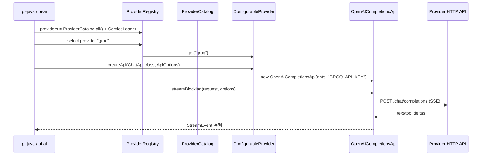

### 2.7 测试策略与外部依赖

- **单元测试**：每个 `ProviderConfig` 验证 name/baseUrl/envVar/模型数据不为空、`defaultProtocol ∈ supportedProtocols`；每个 Provider 的 `createApi` 返回可用的 `ChatApi`；多协议 Provider 验证 `extra.protocol` 路由正确、不支持的协议抛异常。
- **协议适配器测试**（§2.5 三个新增）：
  - `OpenAIResponsesApi`：用录制的 Responses SSE fixture 驱动，逐一断言 §2.5.1 事件映射表的每一行；单独测 stopReason 五种分支与 `max_output_tokens` clamp（<16 → 16）。
  - `AzureOpenAIResponsesApi`：重点测 baseUrl 五级解析顺序、`DEPLOYMENT_NAME_MAP` 解析（含畸形条目跳过）、全空配置抛异常。**不测主机后缀识别与 `api-version` 注入**（由 SDK 的 `AzureUrlPathMode.AUTO` 负责，属 SDK 职责）；不重测事件映射（与 §2.5.1 共享 `ResponsesStreamProcessor`）。
  - `PiMessagesApi`：`PiMessagesEvent` ↔ JSON round-trip（sealed 层次全覆盖）；SSE 分帧（`\r\n`→`\n` 归一、`\n\n` 分隔、`[DONE]` 忽略、尾部不完整帧）；缺终止事件抛异常。
- **Conformance 测试**：见工作流 B，所有 Provider 与所有协议适配器必须通过同一套 `ChatApi` 契约测试（流事件顺序、工具调用、usage、错误映射）。§2.5 的三个适配器全部纳入 C1–C8。
- **外部依赖变更**：
  - 全部新增 Provider（§2.4 的 11 个）不新增依赖 —— 复用现有 `openai-java` SDK / `anthropic-java` SDK / `PiHttpClient`。
  - `OpenAIResponsesApi`：`openai-java` SDK 已含 Responses API（`client.responses()`），**不新增依赖**。
  - `AzureOpenAIResponsesApi`：**已确认** `openai-java` 4.42.0 原生支持 Azure，**不新增依赖**（详见 §2.5.2）。
  - `PiMessagesApi`：纯 `PiHttpClient` + Jackson，**不新增依赖**。
  - Bedrock / Vertex 的云 SDK 依赖问题随三个云厂商 Provider 一并移出本阶段（§2.2），不再是本阶段决策项。

> **本阶段唯一的新增依赖**：`org.eclipse.jgit:org.eclipse.jgit:7.6.0`（3.22MB，排除 `JavaEWAH` / `commons-codec` 后仅传递 `slf4j-api`），仅供工作流 E 的技能目录扫描做 `.gitignore` 语义匹配（§6.4.1）。工作流 A 的 Provider 与三个新协议**零新增依赖**。

> **`ProviderApi` sealed 约束**：新增三个协议都产出 `ChatApi`，不需要新的 `ProviderApi` 子类型。`ImageApi` / `EmbeddingApi` 由 **P6-28** 落地（新增 `openrouter-images` provider 对齐 pi 的 `openrouter-images`，EmbeddingApi 走 OpenAI `/v1/embeddings`）—— 见 `12-phase6-image-embedding-design.md`。

---

## 3. 工作流 B：评估框架（evals）

### 3.1 目标

`pi-java-evals` 从骨架变为可运行的评估框架，覆盖：
- **Conformance tests**：Provider/API 合规性测试套件，不依赖真实网络（使用 fixture/录制/Faux）。
- **Smoke tests**：每个 Provider 1 个真实请求，快速验证凭据和端点可用。
- **Extension tests**：扩展/插件集成测试，验证工具、命令、Provider、Skill 能通过 SPI 装配进 AgentSession。

### 3.2 包结构与类图

```
src/main/java/com/pijava/evals/     ← 可复用的评估 API 与套件定义
├── api/
│   ├── EvalCase.java
│   ├── EvalSuite.java
│   ├── EvalContext.java
│   ├── EvalResult.java
│   └── EvalReporter.java
├── runner/
│   └── EvalRunner.java
├── conformance/
│   ├── ChatApiConformanceSuite.java     ← C1–C10 用例定义
│   ├── ProviderCatalogConformance.java
│   └── StreamEventOrderValidator.java
└── extension/
    └── ExtensionLifecycleSuite.java     ← 套件定义

src/test/java/com/pijava/evals/     ← JUnit 入口（真正被 surefire 执行）
├── ChatApiConformanceTest.java     ← 参数化展开 ChatApiConformanceSuite
├── ProviderCatalogTest.java
├── ExtensionLifecycleTest.java
├── SampleExtension.java            ← 测试用示例扩展
└── smoke/
    ├── ProviderSmokeTest.java      ← @Tag("smoke")
    └── SmokeTestTags.java
```

> **main / test 边界**：`pi-java-evals/pom.xml` 的 junit-jupiter 与 assertj 目前是 **compile scope**（无 `<scope>test</scope>`），意味着 main jar 会传递这两个依赖给下游。这是有意的 —— 评估 API（`EvalCase`/`EvalSuite`/`EvalRunner`）设计为可被第三方扩展作者复用来测自己的插件。**但套件定义放 main、JUnit 入口放 test**：`@Test`/`@Tag`/`@ParameterizedTest` 注解只出现在 `src/test`，`src/main` 不含任何 JUnit 注解，仅用 AssertJ 断言。这样下游复用 API 时不会被迫继承一堆测试类。

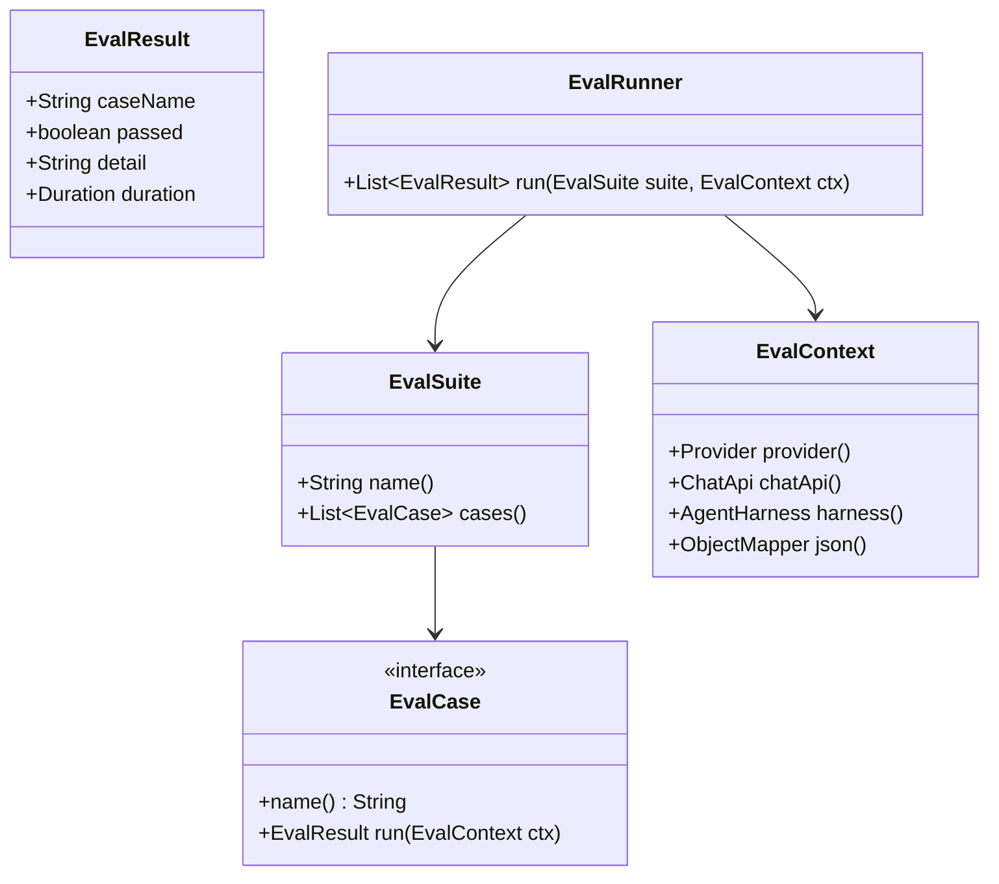

### 3.3 关键接口/类签名

```java
public interface EvalCase {
    String name();
    EvalResult run(EvalContext ctx);
}

public interface EvalSuite {
    String name();
    List<EvalCase> cases();
}

public interface EvalContext {
    /** 被测 Provider；FauxProvider 或真实 Provider 由运行参数决定 */
    Provider provider();

    /** 缓存好的 ChatApi 实例 */
    ChatApi chatApi();

    /** 被测 Agent 运行环境（扩展测试用） */
    AgentHarness harness();

    ObjectMapper json();
}

public record EvalResult(
    String caseName,
    boolean passed,
    String detail,
    Duration duration
) {
    public static EvalResult passed(String name, Duration d);
    public static EvalResult failed(String name, String detail, Duration d);
}

public final class EvalRunner {
    public List<EvalResult> run(EvalSuite suite, EvalContext ctx);
    public void runAll(List<EvalSuite> suites, EvalContext ctx);
}
```

### 3.4 Conformance 用例清单（首批）

事件名取自实际 `StreamEvent` sealed 层次（`ai/stream/StreamEvent.java`，13 个变体）。

| 编号 | 用例 | 验证点 |
|------|------|--------|
| C1 | 流事件必须以 `Start` 开始、`StreamDone` 或 `StreamError` 结束（二者必有其一） | 顺序正确性 |
| C2 | 普通文本流：`TextStart` → `TextDelta`+ → `TextEnd`，无工具调用时 `StreamDone.reason == "stop"` | 基本 chat |
| C3 | 工具调用完整生命周期：`ToolCallStart` → `ToolCallDelta`+ → `ToolCallEnd` → `StreamDone.reason == "toolUse"` | function calling |
| C4 | 工具参数 JSON 经 `ToolCallAccumulator` 累积后可解析为 `Map<String,Object>` | 参数完整性 |
| C5 | `UsageInfo` 出现且 `inputTokens`/`outputTokens` 非负 | usage 契约 |
| C6 | 错误响应映射为 `StreamError`，不抛未包装异常 | 错误契约 |
| C7 | `send()` 非流式与 `streamBlocking()` 聚合结果一致 | 双 API 等价 |
| C8 | 多轮消息（system/user/assistant/tool）往返不丢角色 | 消息映射 |
| C9 | 思考流：`ThinkingStart` → `ThinkingDelta`+ → `ThinkingEnd`（支持 thinking 的模型） | 推理通道 |
| C10 | 每个事件的 `partial` 快照非 null 且随流递增一致 | 快照契约 |

> **覆盖范围**：C1–C10 适用于全部 7 个协议适配器（Phase 1 的 4 个 + §2.5 新增 3 个）与全部 16 个 Provider。用 JUnit 5 `@ParameterizedTest` + `@MethodSource` 按「适配器 × 用例」矩阵展开。

### 3.5 Smoke 测试

- 使用 JUnit `@Tag("smoke")`，默认不执行。
- 运行条件：`-Dpi.eval.smoke=true` 且存在对应 Provider 的 API key 环境变量（§2.4 表格的「环境变量」列）。
- 每个 Provider 一个用例：最小 `streamBlocking("ping")`，成功条件为收到 `StreamDone`。
- **缺 key 时跳过而非失败**：用 `Assumptions.assumeTrue(System.getenv(envVar) != null)`，否则未配置全部 19 家凭据的开发者会看到大批红色失败。
- Ollama 用例额外要求本地 `localhost:11434` 可达，同样用 assumption 跳过。
- 在 CI 中作为手动 workflow 或定时 workflow，不阻塞普通 `mvn verify`。

### 3.6 Extension 测试

- 构造一个 `SampleExtension`（注册一个 `EchoTool`、一个 `/hello` 命令、一个 `FauxProvider`、一个 `SampleSkill`）。
- 验证 `ExtensionManager` 能从 ServiceLoader 发现并装配；`AgentSession` 创建后工具/命令/Provider/Skill 均可见。
- 验证 `--no-extensions` 能禁用发现。

---

## 4. 工作流 C：RPC 模式（JSONL）与 JSON 事件模式

### 4.1 目标

让 `pi-java` 可作为 headless 服务被外部进程集成：`--mode rpc` 从 stdin 读取 JSONL 命令、向 stdout 写 JSONL 响应与事件，不需要 TUI。同时落地 `--mode json`（当前与 rpc 一并被 `Main.java:58` 拒绝）。

> **`--mode json` 与 `--mode rpc` 是两种模式，不是主从关系**（对齐 pi `main.ts:118-132` + `print-mode.ts`）：
>
> | | `--mode json` | `--mode rpc` |
> |---|---|---|
> | 归属 | **print 模式的变体**（pi `resolveAppMode` 返回 `"json"`，走 `print-mode.ts`） | 独立 `rpc` 模式（走 `rpc-mode.ts`） |
> | stdin | **不读命令**，prompt 来自命令行参数 | 持续读 JSONL 命令 |
> | stdout | 仅事件流，无 response 信封 | 事件流 + response 信封 |
> | 生命周期 | 单次 prompt 后退出 | 常驻直到 EOF |
> | 共用部分 | 仅 `toJsonEvent` 事件序列化（剥除 `partial`） | 同左 |
>
> 因此 `--mode json` 的实现落点是 `PrintMode`（复用 `JsonEventMapper`），与 RPC 的命令分发无关。它列在 P6-5d 只是排期相邻，实现上互不依赖。

**协议对齐 pi**（`packages/coding-agent/src/modes/rpc/`），不使用 JSON-RPC 2.0 —— pi 用的是自定义 type-tagged JSONL，改用 JSON-RPC 会导致按 pi 编写的客户端无法接入。

### 4.2 包结构与协议

```
com.pijava.coding.agent.rpc/
├── RpcMode.java              ← Main 调用的入口
├── JsonlReader.java          ← 严格 LF-only 分帧（对齐 pi jsonl.ts）
├── JsonlWriter.java          ← 单行序列化
├── RpcCommand.java           ← sealed 命令类型（stdin）
├── RpcResponse.java          ← 响应信封（stdout）
├── RpcSessionState.java      ← get_state 载荷
├── RpcSlashCommand.java      ← get_commands 载荷
├── RpcDispatcher.java        ← 命令 → AgentSession 分发
└── RpcException.java

com.pijava.coding.agent.mode/
└── JsonEventMapper.java      ← AgentSessionEvent → 线格式（json/rpc 共用，对齐 pi json-event.ts）
```

**线格式**（对齐 pi `rpc-types.ts`）：命令、响应、事件都是顶层带 `type` 字段的 JSON 对象，一行一个。

```jsonl
{"id":"1","type":"prompt","message":"hello"}
{"type":"message_update","assistantMessageEvent":{"type":"text_delta","contentIndex":0,"delta":"Hi"}}
{"id":"1","type":"response","command":"prompt","success":true}
{"id":"2","type":"get_state"}
{"id":"2","type":"response","command":"get_state","success":true,"data":{"sessionId":"01J...","isStreaming":false,...}}
{"id":"3","type":"abort"}
{"id":"3","type":"response","command":"abort","success":true}
{"id":"4","type":"bad_command"}
{"id":"4","type":"response","command":"bad_command","success":false,"error":"Unknown command"}
```

**关键协议约定**（均取自 pi 实现）：

- `id` 是**可选字符串**（pi: `id?: string`），不是 JSON-RPC 的必需数字。客户端不传时响应也不带 `id`。
- 响应统一为 `{id?, type:"response", command:<原命令type>, success:boolean}`，成功时可选带 `data`，失败时带 `error: string`（pi 无错误码枚举）。
- `prompt` / `steer` / `follow_up` / `abort` 是**异步命令**：立即回 `success:true`，实际内容通过随后的事件流推送。pi 的注释明确 “async - events follow”。
- 事件**不带 `id`**，是无关联的通知流，由 `session.subscribe()` 推送。
- **分帧严格 LF-only**：pi 特意不用 Node readline，因为它会在 U+2028/U+2029 上切分——而这些字符在 JSON 字符串内是合法的。pi-java 同理**不能用 `BufferedReader.readLine()`**（Java 的 `readLine` 在 `\r`、`\n`、`\r\n` 上都切分，且不处理这两个 Unicode 分隔符），必须自己按 `\n` 扫描字节流，并仅剥除行尾 `\r`。这是 `JsonlReader` 存在的唯一理由。
- 事件流**剥除 `partial` 快照**（pi `json-event.ts`）：`message_update` 事件中的 `assistantMessageEvent` 去掉累积快照字段，只留增量——`message_start` 给初始消息，deltas 增量构建，`message_end` 给最终权威消息。pi-java 的 `StreamEvent` 每个变体都带 `AssistantMessage partial`，序列化时**必须省略**，否则每个 delta 都会重复整条消息。

### 4.3 命令集与分批

pi 有 30 个命令。本阶段按优先级分三批，**未实现的命令返回 `success:false, error:"Not implemented"`**，不静默忽略。

| 批次 | 命令 | 说明 |
|------|------|------|
| **首批（P6-5b）** | `prompt`、`steer`、`follow_up`、`abort`、`get_state`、`new_session`、`get_messages`、`get_last_assistant_text` | 覆盖基本对话回路，全部有对应的 `AgentSession` 方法（`processPrompt`/`steer`/`followUp`/`abort`/`lastAssistantText`） |
| **次批（P6-5c）** | `set_model`、`cycle_model`、`get_available_models`、`set_thinking_level`、`cycle_thinking_level`、`get_available_thinking_levels`、`compact`、`set_auto_compaction`、`get_session_stats`、`set_session_name`、`get_commands` | 模型/思考等级/压缩控制面 |
| **末批（P6-5d）** | `bash`、`abort_bash`、`switch_session`、`fork`、`clone`、`get_fork_messages`、`get_entries`、`get_tree`、`set_steering_mode`、`set_follow_up_mode`、`set_auto_retry`、`abort_retry`、`export_html` | ✅ 已实现（§13 v1.4）。`bash` 走会话级执行 + `BashExecutionUpdate` 事件、`export_html` 复用 P6-12 `HtmlExporter`、`get_tree` 从 transcript 按 `parentId` 建树、`set_auto_retry`/`abort_retry` 走 `SessionRunner` 重试循环 |

> 命令批次编号与 §8.1 任务编号一致：P6-5a 是前置的事件订阅改造（§4.7），P6-5b/c/d 为三批命令。`--mode json` 独立于三批，落点在 `PrintMode`（见 §4.1）。

**扩展 UI 双向通道**（pi `RpcExtensionUIRequest` / `RpcExtensionUIResponse`）：扩展需要用户输入时，stdout 发 `{type:"extension_ui_request", id, method:"select"|"confirm"|"input"|"editor"|"notify"|"setStatus"|"setWidget"|"setTitle"|"set_editor_text", ...}`，客户端从 stdin 回 `{type:"extension_ui_response", id, value|confirmed|cancelled}`。这是 RPC 模式下扩展能交互的唯一途径，**随工作流 E（扩展系统）一起落地，不在 P6-5 内**。

### 4.4 关键类/接口签名

```java
/** 命令 —— 变体字段不同 → sealed interface + record。 */
@JsonTypeInfo(use = Id.NAME, property = "type", include = As.EXISTING_PROPERTY)
public sealed interface RpcCommand {
    /** 可选关联 ID，回显在响应里。 */
    String id();

    /** 线格式的 type 值，如 "prompt"、"get_state"。 */
    String type();

    @JsonTypeName("prompt")
    record Prompt(String id, String message, List<ImageContent> images,
                  StreamingBehavior streamingBehavior) implements RpcCommand {
        public String type() { return "prompt"; }
    }

    @JsonTypeName("steer")
    record Steer(String id, String message, List<ImageContent> images) implements RpcCommand {
        public String type() { return "steer"; }
    }

    @JsonTypeName("abort")
    record Abort(String id) implements RpcCommand {
        public String type() { return "abort"; }
    }

    @JsonTypeName("get_state")
    record GetState(String id) implements RpcCommand {
        public String type() { return "get_state"; }
    }

    // ... 其余命令同构
}

/** pi: streamingBehavior?: "steer" | "followUp" —— 纯常量闭集 → enum。 */
public enum StreamingBehavior {
    STEER, FOLLOW_UP;

    @JsonValue
    public String wireName() {
        return this == STEER ? "steer" : "followUp";
    }
}

/**
 * 响应信封。pi 的成功/失败是同一个 shape 的两种取值，
 * 不是两个不同类型，故用单 record + 可空字段而非 sealed。
 */
public record RpcResponse(
    String id,
    String command,
    boolean success,
    Object data,        // success=true 时的载荷，可为 null
    String error        // success=false 时的消息
) {
    /** 线格式固定 type="response"。 */
    @JsonProperty("type")
    public String type() { return "response"; }

    public static RpcResponse ok(String id, String command);
    public static RpcResponse ok(String id, String command, Object data);
    public static RpcResponse fail(String id, String command, String message);
}

/** pi: RpcSessionState */
public record RpcSessionState(
    ModelInfo model,
    ThinkingLevel thinkingLevel,
    boolean isStreaming,
    boolean isCompacting,
    QueueMode steeringMode,
    QueueMode followUpMode,
    String sessionFile,
    String sessionId,
    String sessionName,
    boolean autoCompactionEnabled,
    int messageCount,
    int pendingMessageCount
) {}

/** pi: "all" | "one-at-a-time" */
public enum QueueMode {
    ALL, ONE_AT_A_TIME;

    @JsonValue
    public String wireName() {
        return this == ALL ? "all" : "one-at-a-time";
    }
}

/** 严格 LF-only JSONL 分帧 —— 不能用 BufferedReader.readLine()（见 §4.2）。 */
public final class JsonlReader implements Closeable {
    public JsonlReader(InputStream in);

    /** 读下一行；EOF 返回 null。仅按 '\n' 切分，剥除行尾 '\r'。 */
    public String readLine() throws IOException;
}

public final class RpcMode {
    /** 阻塞处理 stdin 直到 EOF；返回进程退出码。 */
    public static int run(InputStream in, OutputStream out, Args args);
}

public final class RpcDispatcher {
    public RpcDispatcher(AgentSession session, JsonlWriter out);

    /** 解析并分发一行；解析失败也要回 success:false 响应而非抛出。 */
    public void handleLine(String line);

    public void handle(RpcCommand command);
}
```

> **`AgentSession` 缺口**：文档原先假设有 `AgentSession.Factory`，实测**不存在** —— `AgentSession` 只有静态 `create(Args args)`（`AgentSession.java:99`）。`RpcDispatcher` 直接持有 `AgentSession` 实例；`new_session` / `switch_session` 命令需要重建会话，走 `AgentSession.create(args)` 或现有的 `findSession` / `latestSession` / `forkCopy`。
>
> **事件订阅缺口**：pi 用 `session.subscribe(listener)` 拿到统一的 `AgentSessionEvent` 流（含 `message_update`、`entry_appended`、`queue_update`、`compaction_start/end`、`auto_retry_*`、`bash_execution_update` 等 ~18 种）。pi-java 的 `AgentSession` 只有 `watchSession()` 返回 `WatchHandle<SessionSnapshot>`（`:329`），粒度是快照而非事件。P6-5a 需先补会话级事件订阅通道，详见 §4.7。**这是 P6-5 的首个子任务，先于任何命令实现。**

### 4.5 数据流

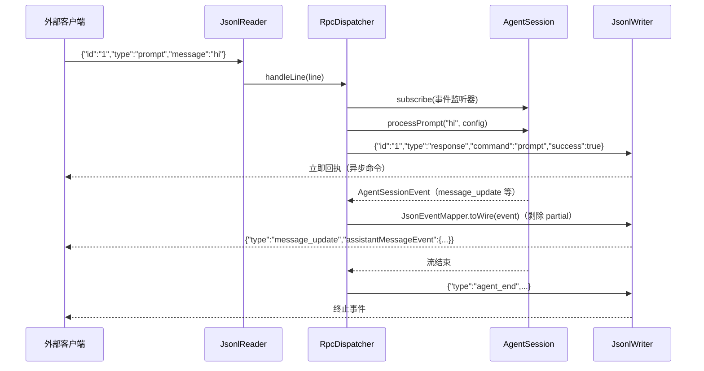

### 4.6 测试策略

- `JsonlReaderTest`：**分帧边界是重点** —— 仅 `\n` 切分；`\r\n` 剥 `\r`；载荷内含 U+2028/U+2029 **不切分**（这是 pi 特意规避 readline 的原因，必须有回归用例）；EOF 时残留缓冲作为最后一行；空行跳过。
- `RpcCommandTest` / `RpcResponseTest`：sealed 层次全变体 ↔ JSON round-trip；`type` 字段正确；未知 `type` 走失败响应而非抛异常。
- `JsonEventMapperTest`：断言 `message_update` 序列化结果**不含 `partial`**；其余事件原样透传。
- `RpcDispatcherTest`：FauxProvider 驱动，断言 `prompt` 先回 `success:true`、随后事件顺序正确、`id` 正确回显；未实现命令回 `Not implemented`。
- `RpcModeEndToEndTest`：`PipedInputStream`/`PipedOutputStream` 模拟 stdin/stdout，跑完整 prompt → 事件 → 响应回路。
- `AgentSessionSubscribeTest`（P6-5a）：多监听器各自收到事件；退订只摘除自己；监听器抛异常不影响其他监听器。
- 验收命令（§10）用 pi 的线格式，不是 JSON-RPC。

### 4.7 P6-5a：会话级事件订阅（RPC 前置）

**现状**（实测）：

| 层 | 现有能力 | 缺口 |
|----|---------|------|
| `AgentHarness` | `onStreamEvent(Consumer<StreamEvent>)`（`:142`）已能拿到全部 `StreamEvent` | **仅支持单监听器** —— `:138` 注释明确「Only one listener is active at a time」，`streamListener` 是单字段而非列表。Phase 3 的 Print/Interactive 模式已占用它 |
| `AgentHarness` | `watch(lane)` / `watchSession()` 返回 `WatchHandle<T>`（支持多监听器） | 粒度是快照，无增量事件 |
| `AgentSession` | 转发 `watchSession()` | 无事件级订阅 |

即：`StreamEvent` 源已存在，缺的是**多路复用**与**会话级事件层**。改造分两步：

**① `AgentHarness.onStreamEvent` 改为多监听器**

```java
// 现状：private Consumer<StreamEvent> streamListener = event -> { };
// 改为：
private final List<Consumer<StreamEvent>> streamListeners = new CopyOnWriteArrayList<>();

/**
 * 注册 StreamEvent 监听器。支持多监听器（Phase 6 起）。
 * @return 注册句柄；关闭它只摘除本监听器
 */
public AutoCloseable onStreamEvent(Consumer<StreamEvent> listener) {
    streamListeners.add(listener);
    return () -> streamListeners.remove(listener);
}
```

签名不变，故 Phase 3 的 Print/Interactive 调用点无需改动 —— 但语义从「替换」变为「追加」，需检查是否有代码依赖旧的替换行为。`CopyOnWriteArrayList` 保证广播时的并发安全（虚拟线程下的 lane 并发）。

**② `AgentSession` 新增 `AgentSessionEvent` 层**

对齐 pi 的 `_eventListeners` + `_emit` 广播模型：

```java
/** 会话级事件 —— 变体字段不同 → sealed interface + record。 */
public sealed interface AgentSessionEvent {
    /** 包装底层 StreamEvent；序列化时剥除 partial（§4.2）。 */
    record MessageUpdate(StreamEvent streamEvent) implements AgentSessionEvent {}
    record AgentEnd(List<Message> messages, boolean willRetry) implements AgentSessionEvent {}
    record AgentSettled() implements AgentSessionEvent {}
    record EntryAppended(Entry entry) implements AgentSessionEvent {}
    record QueueUpdate(List<String> steering, List<String> followUp)
        implements AgentSessionEvent {}
    record SessionInfoChanged(String name) implements AgentSessionEvent {}
    record ThinkingLevelChanged(ThinkingLevel level) implements AgentSessionEvent {}
    record CompactionStart(CompactionReason reason) implements AgentSessionEvent {}
    record CompactionEnd(CompactionReason reason, CompactionResult result,
                         boolean aborted, boolean willRetry, String errorMessage)
        implements AgentSessionEvent {}
    record AutoRetryStart(int attempt, int maxAttempts, long delayMs, String errorMessage)
        implements AgentSessionEvent {}
    record AutoRetryEnd(boolean success, int attempt, String finalError)
        implements AgentSessionEvent {}
    record BashExecutionUpdate(String id, String delta) implements AgentSessionEvent {}
}

/** pi: "manual" | "threshold" | "overflow" */
public enum CompactionReason { MANUAL, THRESHOLD, OVERFLOW }
```

```java
public final class AgentSession implements AutoCloseable {
    // 现有方法保留 ...

    /**
     * 订阅会话事件。支持多监听器；返回的句柄只摘除本监听器。
     * 对齐 pi AgentSession.subscribe。
     */
    public AutoCloseable subscribe(Consumer<AgentSessionEvent> listener);
}
```

**分批落地**：P6-5a 只做 `MessageUpdate` / `AgentEnd` / `AgentSettled` / `EntryAppended` 四种（覆盖 RPC 首批 8 个命令所需），其余随对应命令批次补齐。`BashExecutionUpdate` 随 RPC 末批的 `bash` 命令落地。

**对 Phase 2c 的影响**：`AgentHarness` 只改 `streamListener` 单字段 → 列表，不触碰 lane 调度、Hook、压缩等编排逻辑；`AgentSessionEvent` 完全是 coding-agent 层的新增物，`agent-core` 不感知。影响面可控。

---

## 5. 工作流 D：CBOR 协议与远程会话

### 5.1 目标与抽象层级（已修正）

让 `pi-java-client` 通过网络连接 `pi-java-server`，**获取远程实例上会话的独占租约并订阅其快照变化**。`pi-java-protocol` 提供 CBOR 编解码与帧格式。

> **⚠️ 抽象层级更正**：本节原设计把 server/client 建模为「远程 `SessionRepository`/`SessionStorage`」，即把 `appendEntry` 等**存储操作**跨网络转发。这与 pi 不符，且方向是错的。
>
> pi 的 `packages/server` 暴露的是**会话控制面**（`PiServerService` / `PiSessionRuntime`：`listSessions`/`listModels`/`createSession`/`openSession`，以及 runtime 上的 `prompt`/`steer`/`abort`/`setModel`/`setThinking`/`snapshot`/`subscribe`），**没有任何 entry 级存储方法**。存储始终是服务端本地的事，客户端拿到的是 `SessionSnapshot` 与 `TranscriptProgress` 事件。
>
> 按原设计实现会得到一个逐条 entry 往返的远程存储层 —— 既与 pi 不互通，也把每次 append 变成一次网络往返。本节据此重写。

### 5.2 帧格式与信封（对齐 pi）

**帧格式极简**（pi `protocol/src/framing.ts`）：**4 字节大端无符号长度前缀 + CBOR 载荷**。没有 version / messageId / type 字段 —— 那些语义全在 CBOR 载荷内部的信封里。

```
+--------+--------+--------+--------+----------------------------+
| len[0] | len[1] | len[2] | len[3] |   CBOR payload (len bytes) |
+--------+--------+--------+--------+----------------------------+
```

- `DEFAULT_MAX_FRAME_LENGTH = 16 * 1024 * 1024`（16MB），超限抛 `FrameError`。
- 解码器是**增量式**（pi `FrameDecoder`）：`push(chunk)` 返回本次凑齐的完整帧列表，内部维护 header/payload 累积状态与 `open`/`ended`/`failed` 三态。不能假设一次读到一个完整帧。
- `PROTOCOL_VERSION = 1`，**在 hello 握手里协商**，不在帧头。

**信封层次**（pi `protocol/src/schemas.ts`）：

```
ClientMessage = ClientHello | RequestEnvelope
ServerMessage = ServerHello | ServerHelloError | ResponseEnvelope | EventEnvelope
```

客户端**必须先发** `ClientHello{type:"hello", version:int}`；服务端回 `ServerHello{type:"hello", version:1, connectionId, snapshot}` 或 `ServerHelloError{type:"hello_error", error}`。

### 5.3 包结构与类图

```
com.pijava.protocol/
├── CborCodec.java            ← CBOR 编解码（Jackson CBOR）
├── FrameCodec.java           ← 4 字节长度前缀编码
├── FrameDecoder.java         ← 增量分帧（有状态）
├── FrameException.java
├── ProtocolVersion.java      ← PROTOCOL_VERSION = 1
├── ClientMessage.java        ← sealed: ClientHello | RequestEnvelope
├── ServerMessage.java        ← sealed: ServerHello | ServerHelloError | ResponseEnvelope | EventEnvelope
├── Command.java              ← sealed: 9 个命令
├── CommandResult.java        ← sealed: 9 个结果
├── ServerEvent.java          ← sealed: 4 个事件
├── SessionSnapshot.java      ← 会话快照
├── SessionMetadata.java
├── ServerSnapshot.java
├── ProtocolError.java
└── ProtocolErrorCode.java    ← enum: 7 个错误码

com.pijava.server/
├── PiServer.java             ← 接受连接、握手、分发
├── PiServerOptions.java
├── PiServerListener.java     ← 传输监听器 SPI
├── PiServerService.java      ← 服务边界（会话/模型）
├── PiSessionRuntime.java     ← 单个已获取会话的运行时
├── UnixSocketListener.java
└── PiServerException.java

com.pijava.client/
├── PiClient.java             ← 连接、握手、请求/响应关联
├── PiClientOptions.java
├── ByteTransport.java        ← 传输抽象 SPI
├── UnixSocketTransport.java
├── SessionHandle.java        ← 会话租约 + 快照订阅
└── PiClientException.java
```

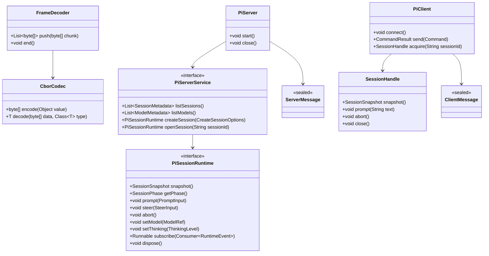

### 5.4 关键类/接口签名

```java
public final class ProtocolVersion {
    public static final int PROTOCOL_VERSION = 1;
    public static final int DEFAULT_MAX_FRAME_LENGTH = 16 * 1024 * 1024;
}

/** 4 字节大端无符号长度前缀。 */
public final class FrameCodec {
    public static byte[] encode(byte[] payload);
}

/** 增量分帧 —— 有状态，非线程安全，每连接一个实例。 */
public final class FrameDecoder {
    public FrameDecoder(int maxFrameLength);

    /** 累积字节，返回本次凑齐的完整载荷（可能 0 个或多个）。 */
    public List<byte[]> push(byte[] chunk);

    /** 流结束；若有不完整帧残留则抛 FrameException。 */
    public void end();
}

public sealed interface ClientMessage {
    record ClientHello(int version) implements ClientMessage {}
    record RequestEnvelope(String id, Command request) implements ClientMessage {}
}

public sealed interface ServerMessage {
    record ServerHello(int version, String connectionId, ServerSnapshot snapshot)
        implements ServerMessage {}
    record ServerHelloError(ProtocolError error) implements ServerMessage {}
    record ResponseEnvelope(String id, CommandResult result, ProtocolError error)
        implements ServerMessage {}
    record EventEnvelope(ServerEvent event) implements ServerMessage {}
}

/** 9 个命令，对齐 pi CommandSchema。 */
public sealed interface Command {
    record List() implements Command {}
    record Create(String cwd, String name, ModelRef model, ThinkingLevel thinkingLevel)
        implements Command {}
    record Attach(String sessionId) implements Command {}
    record Detach(String sessionId) implements Command {}
    record Prompt(String sessionId, String text) implements Command {}
    record Steer(String sessionId, String text) implements Command {}
    record Abort(String sessionId) implements Command {}
    record SetModel(String sessionId, ModelRef model) implements Command {}
    record SetThinking(String sessionId, ThinkingLevel thinkingLevel) implements Command {}
}

/**
 * 结果 —— 注意 pi 的设计：除 list/detach 外，
 * 所有命令结果都回完整 SessionSnapshot（而非增量），客户端整体替换。
 */
public sealed interface CommandResult {
    record ListResult(java.util.List<SessionMetadata> sessions) implements CommandResult {}
    record DetachResult(String sessionId) implements CommandResult {}
    record CreateResult(SessionSnapshot session) implements CommandResult {}
    record AttachResult(SessionSnapshot session) implements CommandResult {}
    record PromptResult(SessionSnapshot session) implements CommandResult {}
    record SteerResult(SessionSnapshot session) implements CommandResult {}
    record AbortResult(SessionSnapshot session) implements CommandResult {}
    record SetModelResult(SessionSnapshot session) implements CommandResult {}
    record SetThinkingResult(SessionSnapshot session) implements CommandResult {}
}

/** 4 个服务端推送事件。 */
public sealed interface ServerEvent {
    record ServerSnapshotEvent(ServerSnapshot snapshot) implements ServerEvent {}
    record SessionSnapshotEvent(SessionSnapshot snapshot) implements ServerEvent {}
    record SessionProgress(String sessionId, TranscriptProgress progress) implements ServerEvent {}
    record SessionRemoved(String sessionId) implements ServerEvent {}
}

/** 7 个错误码，纯常量闭集 → enum。 */
public enum ProtocolErrorCode {
    VERSION, BUSY, SESSION_LOCKED, NOT_FOUND,
    INVALID_REQUEST, NOT_IMPLEMENTED, INTERNAL_ERROR;

    @JsonValue
    public String wireName() {
        return name().toLowerCase(Locale.ROOT);
    }
}

/** 服务边界 —— 由 coding-agent 侧实现，server 模块只依赖此接口。 */
public interface PiServerService {
    List<SessionMetadata> listSessions();
    List<ModelMetadata> listModels();
    /** id 由 PiServer 生成并要求服务端持久化该确切 ID。 */
    PiSessionRuntime createSession(CreateSessionOptions options);
    PiSessionRuntime openSession(String sessionId);
}

/**
 * 一个已获取的会话租约。pi 明确要求：
 * 冲突操作必须直接拒绝（回 BUSY / SESSION_LOCKED），不排队。
 */
public interface PiSessionRuntime extends AutoCloseable {
    SessionSnapshot snapshot();
    SessionPhase getPhase();
    void prompt(PromptInput input);
    void steer(SteerInput input);
    void abort();
    void setModel(ModelRef model);
    void setThinking(ThinkingLevel level);
    Runnable subscribe(Consumer<RuntimeEvent> listener);
    @Override void close();
}

public record PiServerOptions(
    List<PiServerListener> listeners,
    int maxFrameLength,
    Duration handshakeTimeout,
    String serverId
) {}

/** 传输监听器 —— 提供已完成传输层认证的字节连接。 */
public interface PiServerListener extends Closeable {
    /** 启动后的可读地址（若传输有地址）。 */
    Optional<String> address();
    void start(Consumer<ByteConnection> accept);
    @Override void close();
}
```

**Windows 传输**：pi 只实现 Unix Domain Socket，且在 `win32` 上**直接抛异常**（`client/src/unix.ts:22`）。JDK 16+ 的 `SocketChannel.open(StandardProtocolFamily.UNIX)` 在 Windows 10/11 上原生支持 AF_UNIX，故 pi-java **不需要 TCP fallback** —— 这是相对 pi 的一处能力增强，需在文档与测试中注明。Unix socket 路径长度上限：Linux 107 字节、其他 103 字节（pi `MAX_UNIX_SOCKET_PATH_BYTES`）。

### 5.5 数据流

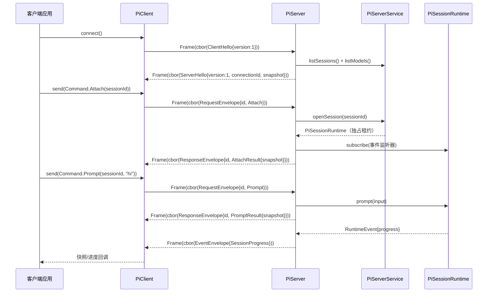

### 5.6 测试策略

- `FrameCodecTest`：4 字节大端编码正确；空载荷；载荷长度 = 上限；超上限抛异常。
- `FrameDecoderTest`：**增量分帧是重点** —— 一次 push 含多个完整帧；一个帧跨多次 push；header 本身被切断（1/2/3 字节到达）；长度声明超 16MB 抛 `FrameError`；`end()` 时残留不完整帧抛异常；`failed` 态后继续 push 抛异常。
- `CborCodecTest`：`ClientMessage`/`ServerMessage`/`Command`/`CommandResult`/`ServerEvent` 全 sealed 层次 round-trip；未知字段拒绝（pi 用 `StrictObject`，即禁止额外属性）。
- `HandshakeTest`：客户端未先发 hello → `INVALID_REQUEST`；版本不匹配 → `ServerHelloError{code:VERSION}`；握手超时。
- `PiServerClientIntegrationTest`：本地 Unix Domain Socket（Windows 亦走 AF_UNIX）启动 server，跑 list → create → attach → prompt → abort → detach 全流程；并发 attach 同一会话 → 第二个收 `SESSION_LOCKED`。
- **不再有** `appendEntry` / 远程存储相关测试（抽象已更正，见 §5.1）。

---

## 6. 工作流 E：Skills / Extensions / Plugins

### 6.1 现状

- `pi-java-agent-core` 已有 `Skill` / `SkillManager` / `PromptTemplate`，但缺少 Markdown 技能文件加载、项目级技能目录、技能注册到 AgentSession 的完整链路。
- CLI `Args` 已有 `--extension`/`-e`、`--no-extensions`/`-ne`、`--skill`、`--no-skills`/`-ns`（`ArgsParser.java:93-102`），但 `Main` 尚未实现扩展发现。`pi-java package` 子命令目前直接报错「extension system lands in Phase 6」（`PackageCommand.java:22`）。

**现有 `Skill` 接口与 pi 的差异**（`agent-core/skill/Skill.java` vs pi `core/skills.ts`）：

| pi-java `Skill` | pi `Skill` | 处理 |
|----------------|-----------|------|
| `name()` | `name` | 一致 |
| `label()` | **无** | pi-java 独有；Markdown 无 `label` 前言时回落为 `name` |
| `description()` | `description` | 一致 |
| `systemPrompt()` | 正文（`SKILL.md` body） | 一致（pi 把正文按需注入） |
| `tools()` | **无**（pi 技能不带工具定义） | pi-java 独有，Markdown 技能返回空列表 |
| **无** | `filePath` / `baseDir` | **需补** —— pi 明确要求技能内相对路径按 `baseDir`（`SKILL.md` 所在目录）解析 |
| **无** | `disableModelInvocation` | **需补** —— 对应前言 `disable-model-invocation: true`，为 true 时不进系统提示 |
| **无** | `sourceInfo` | 需补（来源：`user`/`project`/显式路径），用于 `get_commands` 上报与诊断 |

> `Skill` 接口需要扩展 3–4 个方法。因是 `interface` 且现有实现少（`SkillsTest` 内的测试桩），加 `default` 方法可平滑演进。

### 6.2 包结构与类图

```
com.pijava.coding.agent.extension/
├── PiExtension.java
├── ExtensionContext.java
├── ExtensionManager.java
├── ExtensionManifest.java
└── JarExtensionLoader.java

com.pijava.coding.agent.skill/
├── MarkdownSkillLoader.java   ← 单文件解析（前言 + 正文 + 校验）
├── SkillDiscovery.java        ← 目录递归扫描 + 多来源合并 + 去重
├── FrontmatterParser.java     ← YAML 前言解析（对齐 pi utils/frontmatter.ts）
├── MarkdownSkill.java         ← Skill 的 record 实现
├── SkillSource.java           ← enum: USER / PROJECT / EXPLICIT
└── ResourceDiagnostic.java    ← 校验诊断（对齐 pi core/diagnostics.ts）
```

> **不新增 agent-core 类**：原设计在 `com.pijava.agent.skill` 加 `FileSystemSkillRepository` + `CompositeSkillManager`，与 coding-agent 侧的 `MarkdownSkillLoader` 职责重叠（谁负责目录扫描不明）。**目录扫描统一放 coding-agent**（它才知道项目 cwd 与配置目录），agent-core 的 `SkillManager` 只做注册表，保持不变。

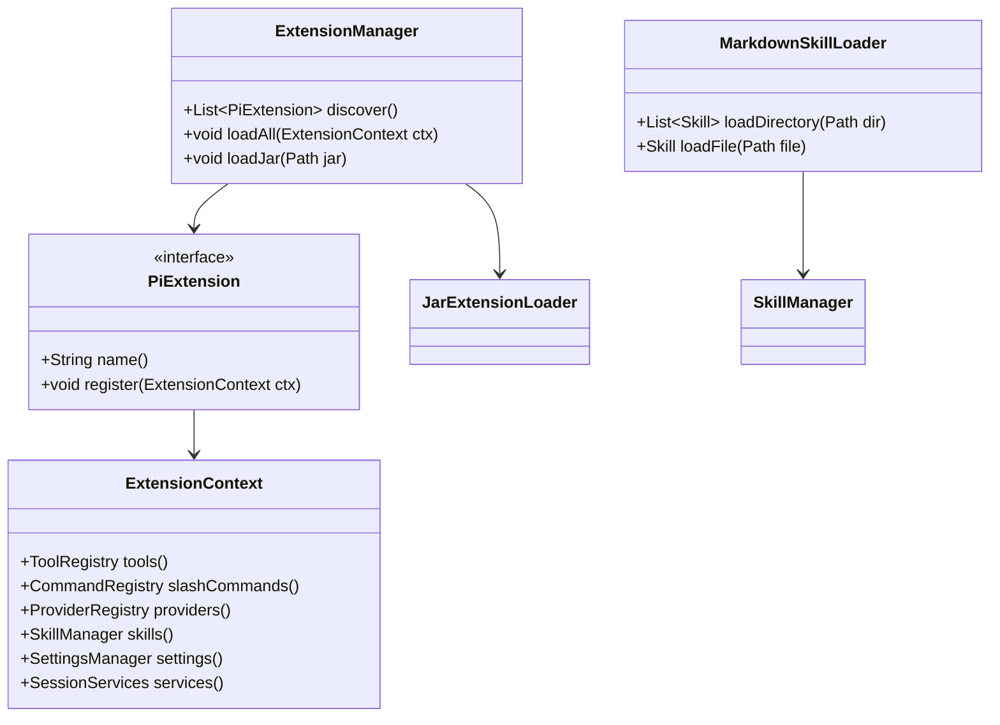

### 6.3 关键类/接口签名

```java
public interface PiExtension {
    /** 唯一扩展名，如 "my-tools" */
    String name();

    /** 扩展描述，用于 list-extensions */
    default String description() { return ""; }

    /** 注册工具/命令/Provider/Skill */
    void register(ExtensionContext ctx);
}

/**
 * 扩展注册上下文。
 *
 * 现有 SessionServices（record，7 个字段）已含 settings/trust/providers/models/
 * tools/slashCommands/sessionRepository —— 与本接口高度重叠。实现上直接包装
 * SessionServices，只补一个 SkillManager（SessionServices 目前没有技能字段）。
 */
public interface ExtensionContext {
    ToolRegistry tools();
    /** 注意实际类名是 CommandRegistry，方法名对齐 SessionServices.slashCommands()。 */
    CommandRegistry slashCommands();
    ProviderRegistry providers();
    SkillManager skills();
    SettingsManager settings();

    /** 便捷访问底层服务集合。 */
    SessionServices services();
}

public final class ExtensionManager {
    public ExtensionManager(ExtensionContext context);

    /** 从 classpath ServiceLoader 发现 PiExtension */
    public List<PiExtension> discover();

    /** 加载所有已发现扩展，返回已加载扩展名 */
    public Set<String> loadAll();

    /** 从外部 JAR 加载扩展（URLClassLoader） */
    public Set<String> loadJar(Path jar);

    /** 卸载指定扩展（若扩展支持 close） */
    public void unload(String name);
}

/**
 * 扩展清单，供 `pi-java package list` 展示（P6-16）。
 * 从 JAR 内 META-INF/pi-extension.json 读取；缺失时由已加载的
 * PiExtension 实例反射推导（name/description 来自接口方法，
 * tools/commands/providers/skills 来自注册前后的 registry diff）。
 */
public record ExtensionManifest(
    String name,
    String version,
    String description,
    List<String> tools,
    List<String> commands,
    List<String> providers,
    List<String> skills
) {
    public static Optional<ExtensionManifest> from(Path jar);
}

public final class MarkdownSkillLoader {
    /** 解析单个技能文件（前言 + 正文），含校验。 */
    public LoadSkillResult loadFile(Path file, SkillSource source);
}

public final class SkillDiscovery {
    public SkillDiscovery(Path cwd, Path agentDir);

    /** 扫描全部来源并合并去重。 */
    public LoadSkillsResult discoverAll(boolean includeDefaults, List<Path> explicitPaths);

    /** 扫描单个目录（递归，遵循 §6.4 的 SKILL.md 规则）。 */
    public LoadSkillsResult loadDirectory(Path dir, SkillSource source, boolean includeRootFiles);
}

/** 技能 + 诊断一起返回 —— 单个技能非法不应中断整批加载。 */
public record LoadSkillsResult(
    List<Skill> skills,
    List<ResourceDiagnostic> diagnostics
) {}
```

### 6.4 Markdown Skill 格式（对齐 pi）

```markdown
---
name: code-review
description: Run a focused code review on the current diff.
---

You are performing a code review. Focus on correctness, security, and maintainability.
Use the read/grep tools to inspect the diff.
```

**前言字段**（pi `SkillFrontmatter`）：

| 字段 | 必需 | 校验规则（pi `validateName` / `validateDescription`） |
|------|------|--------------------------------------------------|
| `name` | 否 | 缺失时**回落为父目录名**；≤64 字符；仅 `[a-z0-9-]`；不得以 `-` 开头/结尾；不得含连续 `--` |
| `description` | **是** | 非空；≤1024 字符；缺失或空 → 诊断错误，该技能被跳过 |
| `disable-model-invocation` | 否 | `true` 时不进系统提示（仅可显式调用） |
| `label` | 否 | **pi-java 独有**（pi 无此字段）；缺失时回落为 `name` |

**目录扫描规则**（pi `loadSkillsFromDirInternal:161-274`，三条规则需严格照抄）：

1. 目录内若含 `SKILL.md`，则**将该目录视为一个技能根，不再向下递归**；
2. 否则加载根目录下的直接 `.md` 子文件（仅当 `includeRootFiles`）；
3. 继续递归子目录以寻找 `SKILL.md`。

**忽略文件**：扫描时遵循 `.gitignore`、`.ignore`、`.fdignore`（pi `IGNORE_FILE_NAMES`），模式需按相对目录加前缀。实现见 §6.4.1。

**`baseDir` 语义**：技能正文内的相对路径按 `baseDir`（`SKILL.md` 所在目录 / `.md` 文件的 dirname）解析为绝对路径后再交给工具使用。pi 在系统提示里明确告知模型这条规则，pi-java 需照做。

**搜索目录**（修正原文档的路径错误）：

| 来源 | 路径 | 说明 |
|------|------|------|
| `USER` | `~/.pi-java/agent/skills/` | 全局。**不是 `~/.pi-java/skills/`** —— 现有代码的 agent 配置根是 `~/.pi-java/agent`（`FileSettingsStorage.java:50`），与 pi 的 `~/.pi/agent` 对齐 |
| `PROJECT` | `<project>/.pi-java/skills/` | 项目级，与 `FileSettingsStorage.java:42` 的 `.pi-java/settings.json` 同级 |
| `EXPLICIT` | CLI `--skill <path>` | 可为目录或单个 `.md` 文件 |

**去重与优先级**：按技能 `name` 去重，后加载覆盖先加载。顺序为 USER → PROJECT → EXPLICIT，即项目覆盖全局、显式路径优先级最高。

**环境变量覆盖**：pi 支持 `ENV_AGENT_DIR` 覆盖 agent 目录（`config.ts:515-521`），其变量名由 `` `${APP_NAME.toUpperCase()}_CODING_AGENT_DIR` `` 构造（`config.ts:495`），pi 实际得到 `PI_CODING_AGENT_DIR`。pi-java 按同一规则（APP_NAME = `pi-java`）得 **`PI_JAVA_CODING_AGENT_DIR`**，需与 `FileSettingsStorage.agentDir()` 统一 —— 该方法目前硬编码 `~/.pi-java/agent`，无环境变量支持，P6-6 需一并补上。

#### 6.4.1 忽略文件：采用 JGit `org.eclipse.jgit.ignore`

pi 用 `ignore` npm 包实现 gitignore 语义。Java 侧**已确认有完整对等方案** —— JGit 内置的 `org.eclipse.jgit.ignore` 包是 Git 官方语义的移植，**不自研子集**。

**新增依赖**：

```xml
<dependency>
    <groupId>org.eclipse.jgit</groupId>
    <artifactId>org.eclipse.jgit</artifactId>
    <version>7.6.0.202603022253-r</version>
    <exclusions>
        <!-- 仅用 ignore 包，不需要对象库/传输层依赖 -->
        <exclusion>
            <groupId>com.googlecode.javaewah</groupId>
            <artifactId>JavaEWAH</artifactId>
        </exclusion>
        <exclusion>
            <groupId>commons-codec</groupId>
            <artifactId>commons-codec</artifactId>
        </exclusion>
    </exclusions>
</dependency>
```

- 体积：**3.22MB**（fat jar 104MB → ~107MB，+3%）。
- 传递依赖：仅保留 `slf4j-api`。`JavaEWAH` 与 `commons-codec` **实测可排除** —— 在两者均不在 classpath 的情况下 ignore 功能正常工作。
- 版本选 `7.6.0.202603022253-r`（与 agentscope-java BOM 一致，本地仓库已有 7.4.0 / 7.5.0 / 7.6.0）。

> **slf4j 版本收敛（无需额外配置，但要知道原理）**：JGit 7.6.0 的父 POM 声明 `slf4j-version=2.0.17`，项目钉的是 `2.0.16`（根 `pom.xml:61` + `pi-java-bom/pom.xml:244-247` 的 `dependencyManagement`）。根 `pom.xml:119` 启用了 enforcer `<dependencyConvergence/>`，对传递依赖版本分歧会 fail build —— 但 BOM 的 `dependencyManagement` 优先级高于传递依赖，会把 2.0.17 强制降到 2.0.16，收敛检查自然通过。
>
> 需要注意的是**反向情形**：若将来从 BOM 中移除 `slf4j-api` 声明，JGit 会把 2.0.17 拖进来并触发 enforcer 失败。届时应在 BOM 中补回声明，而不是关闭收敛检查。

**关键 API**（实测 GraalVM JDK 25 通过）：

```java
import org.eclipse.jgit.ignore.IgnoreNode;

var node = new IgnoreNode();
node.parse(Files.newInputStream(gitignorePath));   // 也有 parse(String sourceName, InputStream)

/** null = 无规则匹配（继续询问上层）；TRUE = 忽略；FALSE = 显式取反保留 */
Boolean ignored = node.checkIgnored(relativePath, isDirectory);
```

**`IgnoreNode` 不需要 `Repository` 对象** —— 可独立解析任意 `.gitignore` 文本，因此 `.ignore` / `.fdignore` 用同一套解析器即可，无需为「不在 Git 仓库内的技能目录」做特殊处理。

**实测覆盖的语义**（用同一份规则文件验证）：

| 规则 | 输入 | `checkIgnored` |
|------|------|---------------|
| `*.log` | `a.log` | `TRUE` |
| `!important.log` | `important.log` | `FALSE`（取反生效，后规则覆盖前规则） |
| `build/` | `build`（dir=true） | `TRUE`（目录限定） |
| `**/temp` | `x/temp` | `TRUE`（双星） |
| `src/**/*.tmp` | `src/a/b/c.tmp` | `TRUE`（中间双星） |
| `[Dd]ebug` | `Debug` / `debug` | `TRUE`（字符类） |
| —— | `keep.txt` | `null`（无匹配） |

`# a comment` 与空行被自动跳过（6 条有效规则）。

**三个实现注意点**：

1. **`null` ≠ `false`**：`checkIgnored` 返回 `null` 表示「本层无规则匹配」，需继续询问父目录的 `IgnoreNode`；`FALSE` 表示「被 `!` 显式取反」，应**立即停止**上溯。多层 `.gitignore` 的优先级靠这个三态区分，不能简化为 boolean。
2. **路径必须是相对路径且用 `/` 分隔**：`FastIgnoreRule.PATH_SEPARATOR` 是 `/`。Windows 上需把 `Path` 转成 POSIX 形式（对齐 pi 的 `toPosixPath`）。
3. **`isDirectory` 参数必须准确**：`build/` 这类目录限定规则只在 `isDirectory=true` 时匹配。`Files.walkFileTree` 中 `preVisitDirectory` 传 `true`、`visitFile` 传 `false`。

> **顺带记录**：`agentscope-java` 虽然也依赖 JGit 7.6.0，但只用了 clone/lsRemote，**没有 `.gitignore` 语义实现**；其文件过滤走 JDK 原生 `PathMatcher`（`LocalFilesystem.java:431`）。它在那里留了个有价值的注释：JDK 的 `glob:**/x` **匹配不到搜索根下的一级文件**，必须额外准备一个剥掉 `**/` 前缀的 matcher。改用 JGit 后 pi-java 不会遇到这个坑 —— 这也是不自研 `PathMatcher` 方案的一个附带理由。

### 6.5 数据流

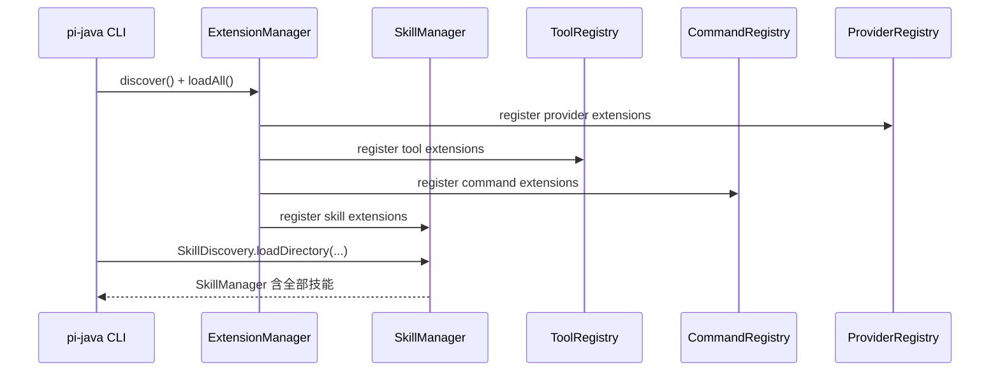

### 6.6 测试策略

- `FrontmatterParserTest`：正常前言；无前言（整文件为正文）；前言未闭合；空前言；前言含未知字段（保留不报错）。
- `MarkdownSkillLoaderTest`：**校验规则逐条覆盖** —— `name` 超 64 字符 / 含大写 / 含下划线 / 前后 `-` / 连续 `--` 各一例；`name` 缺失回落父目录名；`description` 缺失/空/超 1024 字符 → 诊断错误且技能被跳过；`disable-model-invocation: true` 不进系统提示；`label` 缺失回落 `name`。
- `SkillDiscoveryTest`：**目录规则三条** —— 含 `SKILL.md` 的目录不再递归；根级 `.md` 按 `includeRootFiles` 开关加载；深层 `SKILL.md` 能被递归找到。另测 USER→PROJECT→EXPLICIT 同名覆盖顺序、`baseDir` 为 `SKILL.md` 所在目录。
- `IgnoreFilterTest`（§6.4.1）：`null`/`TRUE`/`FALSE` 三态区分（`null` 继续上溯、`FALSE` 停止上溯）；多层 `.gitignore` 优先级；Windows 路径转 POSIX 后匹配；`isDirectory` 传错时 `build/` 规则失效的回归用例；`.ignore` / `.fdignore` 复用同一解析器。**不重测 gitignore 通配语义本身**（属 JGit 职责）。
- `ExtensionManagerTest`：ServiceLoader 发现、loadJar、重复注册去重、`--no-extensions` 禁用。
- `AgentSessionExtensionIntegrationTest`：FauxProvider + 示例扩展，验证扩展工具可被 Agent 调用。
- `SkillsDisabledTest`：`--no-skills` 时 `SkillManager` 为空、系统提示不含技能段。

---

## 7. 工作流 F：远程模型目录 + 发布流水线

### 7.1 远程模型目录（ETag）

#### 7.1.1 目标

`BuiltinCatalog` 静态数据会过时；`RemoteCatalog` 从远端 JSON 拉取模型目录，使用 `ETag`/`Last-Modified` 条件请求做增量更新，离线时回退本地缓存。

> **Phase 1 遗留缺口**：`04-implementation-plan.md` P1-11 任务写了「模型目录 + `BuiltinCatalog`：5 供应商模型数据 + 模糊搜索 **+ `ModelsStore` 接口**」，但代码中**不存在 `ModelsStore`** —— Phase 1 只交付了 `ModelCatalog` / `BuiltinCatalog` / `ModelInfo`。本阶段按 pi 的 `ModelsStore`（`ai/src/models-store.ts`）补齐该接口，`CatalogCache` 作为其文件系统实现，而不是另发明一套缓存抽象。

#### 7.1.2 包结构与类图

```
com.pijava.ai.catalog/
├── ModelCatalog.java          ← 现有
├── BuiltinCatalog.java        ← 现有
├── ModelInfo.java             ← 现有
├── ModelsStore.java           ← 新增：补 Phase 1 缺口，对齐 pi ModelsStore
├── ModelsStoreEntry.java      ← 新增：models + etag + lastModified + checkedAt
├── FileModelsStore.java       ← 新增：ModelsStore 的文件系统实现（原 CatalogCache）
├── InMemoryModelsStore.java   ← 新增：测试用（pi 亦有）
├── RemoteCatalog.java         ← 新增
├── CatalogSource.java         ← 新增
└── CatalogRefreshResult.java  ← 新增
```

```java
/** 对齐 pi ModelsStoreEntry。 */
public record ModelsStoreEntry(
    List<ModelInfo> models,
    /** 远端 Last-Modified 头 */
    Instant lastModified,
    /** 上次完成远端检查的时间 */
    Instant checkedAt,
    /** 远端 ETag，**原样存储（含引号）**并原样回填 If-None-Match */
    String etag
) {}

/** 按 provider ID 键控的持久化模型目录。 */
public interface ModelsStore {
    Optional<ModelsStoreEntry> read(String providerId);
    void write(String providerId, ModelsStoreEntry entry);
    void delete(String providerId);
}
```

> **ETag 必须原样透传**：pi 的注释明确 ETag 是不透明校验值，**含引号一起存**，回填 `If-None-Match` 时也原样发出。剥引号会导致条件请求失效（服务端永远返回 200）。

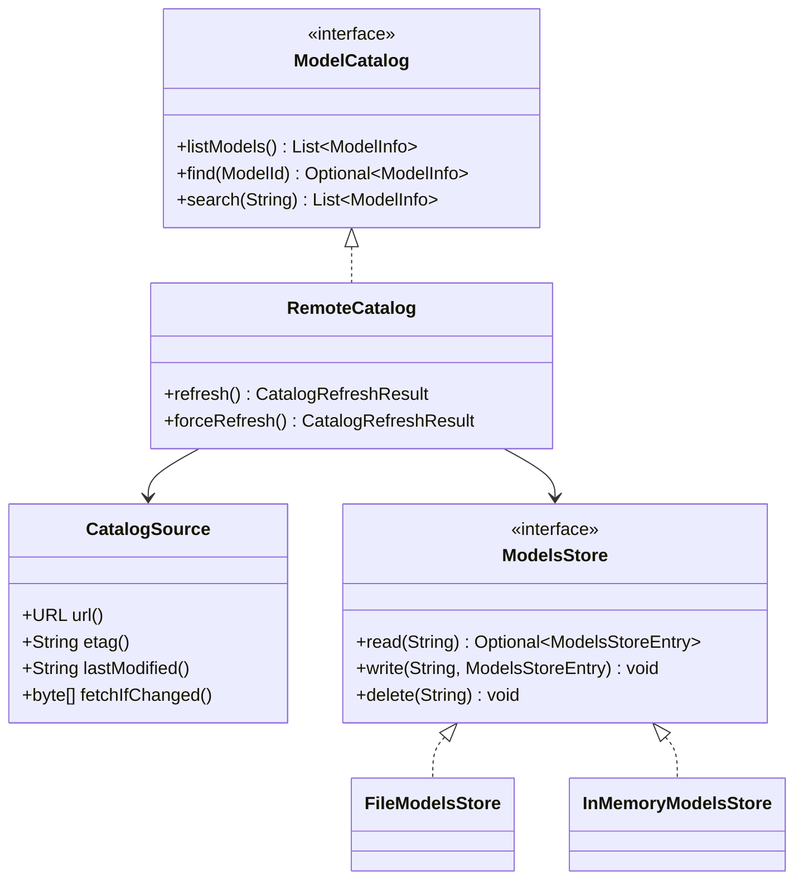

#### 7.1.3 关键接口/类签名

```java
public final class RemoteCatalog implements ModelCatalog {
    public RemoteCatalog(String providerName, URL source, ModelsStore store);

    /** 启动/定时刷新；304 时使用本地缓存 */
    public CatalogRefreshResult refresh();

    /** 忽略 ETag 强制刷新 */
    public CatalogRefreshResult forceRefresh();
}

public record CatalogSource(
    URL url,
    String etag,
    String lastModified
) {}

public record CatalogRefreshResult(
    boolean changed,
    int modelCount,
    String etag,
    Instant refreshedAt
) {}
```

#### 7.1.4 数据流

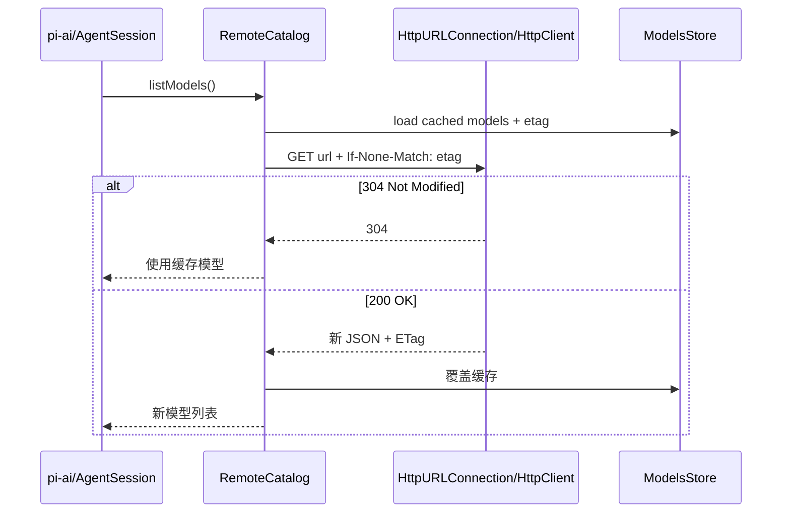

### 7.2 模型目录 CLI 发布工具

- 在 `pi-java-ai` 的 `AiCli` 新增子命令 `catalog`：

```
pi-ai catalog validate --file models.json
pi-ai catalog merge --base builtin.json --overlay remote.json --out merged.json
pi-ai catalog publish --file models.json --endpoint https://models.example.com/upload
```

- `CatalogPublisher` 负责校验 `ModelInfo` JSON schema、生成/更新 ETag、上传到静态托管端点（可通过配置的 HTTP PUT/S3 兼容接口，不引入强制云 SDK）。

### 7.3 Maven Central 发布流水线

- 在根 `pom.xml` 增加 `release` profile（构建期插件，不影响运行时依赖）：

| 插件 | 作用 |
|------|------|
| `maven-source-plugin` | 生成 sources.jar |
| `maven-javadoc-plugin` | 生成 javadoc.jar（已有） |
| `maven-gpg-plugin` | 签名 |
| `nexus-staging-maven-plugin` | 上传到 Maven Central staging |
| `flatten-maven-plugin` | 清理发布 POM（可选） |

- 发布命令：`./mvnw -Prelease -DskipTests deploy`
- 前置条件：`~/.m2/settings.xml` 配置 Central 账号、GPG key；CI 中仅在有 tag 时执行。

---

## 8. 任务清单（对应 `04-implementation-plan.md` §8）

### 8.1 本文档规划的任务

| 编号 | 任务 | 优先级 | 产出 | 状态 |
|------|------|--------|------|------|
| P6-0 | 编写阶段设计文档 | 高 | `11-phase6-ecosystem-design.md` | ✅ 本文档 |
| P6-1a | `AnthropicMessagesApi` 支持 `apiKeyEnvVar` + `baseUrl` 覆盖 | 高 | §2.3 阻塞项修复 | ✅ 已完成 |
| P6-1b | `ProviderConfig` / `ConfigurableProvider` / 两个协议基类 | 高 | 配置驱动 Provider 体系 | ✅ 已完成 |
| P6-1c | 新增 11 个中国大陆常用 Provider | 高 | §2.4 清单（合计 16 个） | ✅ 已完成 |
| P6-1d | `DefaultProviders` 调用 ServiceLoader 发现 | 高 | 第三方 JAR 可注册 Provider | ✅ 已完成 |
| P6-1e | `OpenAIResponsesApi` + Responses 共享转换层 | 高 | §2.5.1 | ✅ 已完成 |
| P6-1f | `AzureOpenAIResponsesApi` | 中 | §2.5.2 | ✅ 已完成 |
| P6-1g | `PiMessagesApi` | 中 | §2.5.3 | ✅ 已完成 |
| P6-2 | evals — conformance tests | 高 | `pi-java-evals` Conformance 套件 | ✅ 已完成 |
| P6-3 | evals — smoke tests | 高 | `pi-java-evals` Smoke 套件 | ✅ 已完成 |
| P6-4 | evals — extension tests | 高 | `pi-java-evals` Extension 套件 | ✅ 已完成 |
| P6-5a | `onStreamEvent` 改多监听器 + `AgentSessionEvent` 订阅层 | 中 | RPC 的前置依赖（§4.7） | ✅ 已完成 |
| P6-5b | RPC 模式首批命令 + JSONL 分帧 | 中 | `pi-java --mode rpc` | ✅ 已完成 |
| P6-5c | RPC 次批命令（模型/思考/压缩） | 中 | §4.3 次批 | ✅ 已完成（含 `set_auto_compaction`，验收时补齐，见 §13 v1.3） |
| P6-5d | RPC 末批命令 | 低 | §4.3 末批 | ✅ 已完成（13 个命令全部实现，见 §13 v1.4） |
| P6-5e | `--mode json`（PrintMode 改造，独立于 RPC） | 低 | §4.1 对照表 | ✅ 已完成 |
| P6-6 | 技能系统（Skills，含 JGit ignore + `PI_JAVA_CODING_AGENT_DIR`） | 中 | Markdown Skill 加载 + 目录发现 | ✅ 已完成 |
| P6-7 | 扩展系统（Extensions / Plugin） | 中 | `ExtensionManager` + `PiExtension` SPI | ✅ 已完成 |
| P6-7b | RPC 扩展 UI 双向通道 | 中 | §4.3 `extension_ui_request/response` | ✅ 已完成 |
| P6-8 | `ModelsStore` + 远程模型目录（ETag） | 中 | 补 Phase 1 缺口 + `RemoteCatalog` | ✅ 已完成 |
| P6-9a | CBOR 编解码 + 增量分帧 | 低 | `pi-java-protocol` | ✅ 已完成 |
| P6-9b | `PiServer` + Unix socket 监听 | 低 | `pi-java-server` | ✅ 已完成 |
| P6-9c | `PiClient` + `SessionHandle` | 低 | `pi-java-client` | ✅ 已完成 |
| P6-10 | 模型目录 CLI 发布工具 | 低 | `pi-ai catalog` 子命令 | ✅ 已完成 |
| P6-11 | Maven Central 发布流水线 | 低 | `release` profile | ✅ 已完成 |

### 8.2 从 Phase 3/4/5 推移到 Phase 6 的遗留任务

以下任务在早期阶段文档或代码中被显式标注「→ Phase 6」，属本阶段范围。**不补全这些，Phase 6 无法判定完成。**

| 编号 | 任务 | 优先级 | 出处 | 状态 |
|------|------|--------|------|------|
| P6-12 | HTML 导出渲染器 | 中 | `09-phase4:1628`、`Main.java:64`（`--export`）、`MiscCommands`（`/export`） | ✅ 已完成 |
| P6-13 | `/share` 会话分享 | 低 | `MiscCommands.java:64` | ✅ 已完成 |
| P6-14 | `pi-java config` 子命令（TUI 资源开关） | 低 | `ConfigCommand.java:16` | ✅ 已完成 |
| P6-15 | `auth print-bearer-token` | 低 | `AuthCommand.java:34` | ✅ 已完成 |
| P6-16 | `pi-java package` 子命令（扩展包管理） | 中 | `PackageCommand.java:22`，随 P6-7 落地 | ✅ 已完成 |
| P6-17 | OAuth 认证流程（`OAuthFlow`） | 中 | `03-detailed-design.md:64`；pi 有 9 个 OAuth provider | ✅ 已完成 |
| P6-18 | 多 profile 认证（同 provider 多组凭证） | 低 | `06-phase1:711` | ✅ 已完成 |
| P6-19 | URL 引用图片输入（非 base64） | 低 | `06-phase1:712` | ✅ 已完成 |
| P6-20 | OpenTelemetry Telemetry 实现 | 低 | `07c-phase2c:997,1011,1144` | ✅ 已完成 |
| P6-21 | 自定义主题文件加载 | 低 | `08-phase3:261` | ✅ 已完成 |
| P6-22 | Markdown 表格 / 图片 / mermaid 渲染 | 低 | `08-phase3:431,456` | ✅ 已完成 |
| P6-23 | 编辑器语法高亮 + 智能补全 | 低 | `08-phase3:485,487`（依赖 TamboUI 0.4+） | ✅ 已完成 |
| P6-24 | `tree.filter.*` / `models.*` 富过滤键绑定 | 低 | `08-phase3:601,635,647` | ✅ 已完成 |
| P6-25 | Entry 元数据事件富样式渲染 | 低 | `08-phase3:306` | ✅ 已完成 |
| P6-26 | 会话 diff 渲染 | 低 | `08b-phase3:447` | ✅ 已完成 |
| P6-27 | AI 生成 Skills | 低 | `07c-phase2c:1130` | ✅ 已完成 |
| P6-28 | `ImageApi` / `EmbeddingApi`（需改 `ProviderApi` permits） | 低 | `02-architecture:155`、`06-phase1:226`、`12-phase6-image-embedding-design.md` | ✅ 已完成（见 §13 v1.5） |

> **建议实施顺序**：P6-1a→1b→1c→1d（Provider 基础）→ P6-2/3/4（evals，可与 1e/1f/1g 并行）→ P6-5a→5b（RPC 核心）→ P6-6/P6-7/P6-16（Skills/Extensions）→ P6-8 → P6-12（HTML 导出）→ P6-17（OAuth）→ P6-9a/9b/9c（远程会话）→ P6-10/11 → 其余低优先级遗留项按需。
>
> 每个任务独立 PR，保持 PR diff < 2000 行。§8.2 的低优先级项不阻塞 Phase 6 主线验收（§10），但需在本表逐项标注状态，避免遗漏。

---

## 9. 测试策略汇总

| 模块/工作流 | 测试类型 | 关键用例 |
|-------------|----------|----------|
| Provider 生态 | 单元 + conformance | 配置合法性（`defaultProtocol ∈ supportedProtocols`）、多协议 `extra.protocol` 路由、OpenAI-compatible 共享协议测试 |
| 三个新协议适配器 | 单元 + fixture | Responses 事件映射逐行、stopReason 五分支、Azure baseUrl 五级解析 + 主机归一化、`PiMessagesEvent` round-trip + SSE 分帧 |
| Evals | JUnit 5 + 动态测试 | C1–C8 conformance、smoke tag、extension 生命周期 |
| RPC JSONL | 单元 + 端到端 | **LF-only 分帧（U+2028/U+2029 不切分）**、命令/响应 round-trip、事件剥除 `partial`、`RpcDispatcher` 分发、stdio 管道 E2E |
| CBOR 远程会话 | 单元 + 集成 | **增量分帧（跨 chunk / header 切断 / 16MB 上限）**、CborCodec round-trip、hello 握手三分支、本地 AF_UNIX 集成、并发 attach → `SESSION_LOCKED` |
| Skills | 单元 | 前言校验逐条（name 5 种非法 / description 3 种）、目录三规则、`.gitignore` 生效、来源覆盖顺序 |
| Extensions | 单元 + 集成 | ServiceLoader 发现、loadJar、去重、`--no-extensions` / `--no-skills` 禁用、Agent 调用扩展工具 |
| 远程目录 | 单元 + 集成 | 304/200 分支、**ETag 含引号原样透传**、离线缓存回退、`ModelsStore` 读写删 |
| 发布 | 构建验证 | `-Prelease package` 产物含 sources/javadoc/signature |

---

## 10. 验收标准（可量化）

1. **Provider 生态**
   - [x] `pi-ai list-models` 能列出 16 个 Provider（Phase 1 的 5 个 + §2.4 新增 11 个）。
   - [x] 每个新 Provider 通过 `ProviderCatalogConformance` 基础配置测试（name/baseUrl/envVar/协议集合非空且自洽）。
   - [x] OpenAI-compatible Provider 共用同一适配器，重复协议代码为零（除特殊响应差异外）。
   - [x] `AnthropicMessagesApi` 支持 `apiKeyEnvVar` 与 `baseUrl` 覆盖，MiniMax 能正确指向 `api.minimaxi.com`。
   - [x] `DefaultProviders` 会执行 ServiceLoader 发现；放入 classpath 的第三方 `ProviderFactory` 出现在 `list-models`。
   - [x] Ollama 在无 API key 环境下可用（`apiKeyEnvVar` 可空路径生效）。
2. **三个新协议适配器**
   - [x] `OpenAIResponsesApi` 通过 C1–C8，且 §2.5.1 事件映射表每行有对应断言。
   - [x] `openai` Provider 能通过 `extra.protocol` 在 Chat Completions 与 Responses 间切换（多协议路由首个实例）。
   - [x] `AzureOpenAIResponsesApi` 的 baseUrl 五级解析顺序与 `DEPLOYMENT_NAME_MAP` 解析测试通过；全空配置抛出含全部配置项的错误；未引入 `com.azure:*` 依赖。
   - [x] `PiMessagesApi` 的 `PiMessagesEvent` 全 sealed 变体 round-trip 通过；缺终止事件时抛异常。
3. **Evals**
   - [x] `mvn verify -pl pi-java-evals` 在无网络时全绿（conformance + extension）。
   - [x] `mvn verify -pl pi-java-evals -Dpi.eval.smoke=true` 在配置凭据时可跑 smoke，失败不误报普通 CI。
4. **RPC**
   - [x] `printf '{"id":"1","type":"prompt","message":"hi"}\n' | pi-java --mode rpc` 返回一条 `{"id":"1","type":"response","command":"prompt","success":true}` 及至少一条事件行（**pi 线格式，非 JSON-RPC**）。
   - [x] JSONL 分帧对含 U+2028/U+2029 的载荷不误切分（回归用例）。
   - [x] 事件行不含 `partial` 字段。
   - [x] 未实现命令返回 `success:false, error` 而非静默忽略；未知 `type` 亦如此。
   - [x] 首批 8 个命令有完整自动化测试。
5. **远程会话**
   - [x] `CborCodec` 对 `ClientMessage`/`ServerMessage`/`Command`/`CommandResult`/`ServerEvent` 全 sealed 层次 round-trip 通过。
   - [x] `FrameDecoder` 通过增量分帧全部边界用例（跨 chunk、header 切断、超 16MB、残留帧）。
   - [x] 本地 AF_UNIX（含 Windows）上的 server+client 集成测试通过 list/create/attach/prompt/abort/detach。
   - [x] 并发 attach 同一会话时第二个请求收到 `SESSION_LOCKED`（不排队）。
6. **Skills/Extensions**
   - [x] Markdown 技能的 `name`/`description` 校验规则全部生效，非法技能被跳过且产生诊断而非中断加载。
   - [x] 含 `SKILL.md` 的目录不再向下递归；深层 `SKILL.md` 能被发现。
   - [x] 技能搜索路径为 `~/.pi-java/agent/skills/` 与 `<project>/.pi-java/skills/`，且支持 `PI_JAVA_CODING_AGENT_DIR` 覆盖。
   - [x] `.gitignore` / `.ignore` / `.fdignore` 经 JGit `IgnoreNode` 生效；三态（`null`/`TRUE`/`FALSE`）上溯逻辑正确；JGit 传递依赖仅 `slf4j-api`（`mvn dependency:tree` 验证 `JavaEWAH` / `commons-codec` 已排除）。
   - [x] 示例扩展 JAR 能被 `ExtensionManager.loadJar` 加载并注册工具/命令/Provider/Skill。
   - [x] `--no-extensions` / `--no-skills` 能完全禁用对应发现。
7. **目录与发布**
   - [x] `ModelsStore` 接口落地（补 Phase 1 缺口），`FileModelsStore` 读写删测试通过。
   - [x] `RemoteCatalog.refresh()` 在本地 HTTP server 的 304/200 场景测试通过，ETag 含引号原样回填。
   - [x] `mvn -Prelease package -DskipTests` 在 CI 能产出可发布构件（不要求真正 deploy 到 Central）。
8. **整体**
   - [x] `mvn clean verify` 零错误零警告。
   - [x] Checkstyle / SpotBugs 通过。
   - [x] 所有新增文件 ≤500 行（CLAUDE.md 约束）；`ResponsesStreamProcessor` 等大类需注意拆分。
   - [x] fat jar（`pi-java-dist/target/pi-java.jar`）构建通过并可运行。**不再要求 Native Image**（Phase 5 已放弃，见文首）。
   - [x] §8.2 遗留任务表每项已标注状态（完成 / 明确延后），无未决项。

---

## 11. 风险与外部依赖变更

| 风险/变更 | 影响 | 缓解 |
|-----------|------|------|
| 部分新增 Provider 的 API 不完全兼容标准 OpenAI 协议 | 中 | 先 conformance 后接入；差异用 `ApiOptions.extra` 和覆写 `createChatApi` 隔离 |
| `AnthropicMessagesApi` 改造触及 Phase 1 已有代码 | 中 | 改造是纯增量（新增双参构造 + baseUrl 覆盖），保留原单参构造签名；现有 `AnthropicProvider` 行为不变，有回归测试兜底 |
| `openai` Provider 增加 Responses 协议可能改变现有行为 | 中 | 默认协议保持 `OPENAI_COMPLETIONS` 不变，Responses 需显式经 `extra.protocol` 选择；两条路径都有 conformance 覆盖 |
| RPC 需要 `AgentSession` 事件级订阅，现仅有快照订阅 | 中 | 已查证改造面可控（§4.7）：`AgentHarness.onStreamEvent` 已提供 `StreamEvent` 源，只需从单监听器改为 `CopyOnWriteArrayList`（签名不变，Phase 3 调用点无需改动，但需检查是否有代码依赖旧的「替换」语义）；`AgentSessionEvent` 是 coding-agent 层纯新增，`agent-core` 不感知。P6-5a 独立前置落地，只做 4 种事件 |
| RPC 30 个命令中末批依赖尚未实现的能力 | 中 | 三批切分（§4.3）；未实现命令统一回 `Not implemented`，协议形状先稳定 |
| CBOR 远程会话的序列化面扩大 | 中 | Jackson CBOR 多态需显式注册 sealed 子类型；集成测试覆盖全层次 round-trip。**不再涉及 native 反射配置**（Phase 5 已放弃） |
| 插件加载外部 JAR 的类隔离与依赖冲突 | 中 | 插件默认走 classpath/ServiceLoader；`loadJar` 用独立 `URLClassLoader`，延后到 P6-7 中后段。**native 冲突项作废**（已退回 fat jar） |
| Skills 目录扫描需实现 `.gitignore` 语义 | 低 | 已定案用 JGit `org.eclipse.jgit.ignore`（§6.4.1），Git 官方完整语义，实测通过。风险降为「新增 3.22MB 依赖」——fat jar +3%，可接受；两个传递依赖已排除 |
| Maven Central 发布涉及凭据和签名 | 低 | CI 仅 tag 触发；本机开发者按发布手册执行 |
| Phase 6 为持续阶段，范围蔓延 | 中 | 按优先级分批 PR；每批独立验收，不阻塞主线；§8.2 遗留表为收敛判据 |
| §8.2 有 17 项从早期阶段推移而来的遗留任务 | 中 | 多为低优先级 UI/渲染项，不阻塞主线验收；但需逐项标注状态，避免「Phase 6 永远无法完成」 |

---

## 12. 待确认决策

### 12.1 本次审核已决策（不再是待确认项）

| 决策项 | 结论 | 依据 |
|--------|------|------|
| Provider 名单范围 | **聚焦中国大陆常用，新增 11 个（合计 16 个）**，不对齐 pi 的 39 个 | 用户明确指示；pi 含大量境外 token-plan 变体与订阅制 OAuth provider，对本项目价值低 |
| 千帆 / 混元 / 豆包是否接入 | **不接入** | 用户明确指示；pi 无对应实现可参照、端点需查证。三家声称 OpenAI 兼容，用户可经 `models.json` 自行接入 |
| 是否引入云厂商 SDK | **不引入** —— Bedrock/Vertex 整体移出本阶段 | 需三个 pi-java 未实现的适配器 + 特殊认证；非大陆常用 |
| RPC 协议形态 | **对齐 pi 的自定义 type-tagged JSONL**，不用 JSON-RPC 2.0 | 用 JSON-RPC 会导致按 pi 编写的客户端无法接入 |
| CBOR 帧格式 | **4 字节大端长度前缀 + CBOR 载荷**，信封语义在载荷内 | pi `framing.ts` 实测；原设计的 version/messageId/type 帧头与 pi 不互通 |
| server/client 抽象层级 | **会话控制面 + 租约 + 快照订阅**，不是远程 `SessionRepository` | pi `PiServerService`/`PiSessionRuntime` 无任何 entry 级存储方法 |
| 远程会话传输 | **Unix Domain Socket（含 Windows AF_UNIX）**，无需 TCP fallback | JDK 16+ 在 Windows 10/11 原生支持 AF_UNIX；比 pi 更好（pi 在 win32 直接抛异常） |
| 技能全局目录 | `~/.pi-java/agent/skills/` | 与现有 `FileSettingsStorage.java:50` 的 agent 配置根一致 |
| 目录缓存抽象 | **补 `ModelsStore`**（Phase 1 缺口），`FileModelsStore` 为其实现 | 对齐 pi `models-store.ts`；不另发明 `CatalogCache` |
| 新增三个协议 | `openai-responses` / `azure-openai-responses` / `pi-messages` **纳入本阶段** | 用户明确指示；前两个为 OpenAI/Azure 官方新标准，第三个是 pi 生态内部协议 |
| Native Image 相关约束 | **全部作废**，改为 fat jar | Phase 5 已于 2026-08-18 放弃原生分发 |
| 插件 `loadJar` 是否纳入首批 | 延后到 P6-7 中后段；首批只做 classpath SPI | 保持原判断 |
| `openai-java` SDK 的 Azure 支持 | **原生支持，不新增依赖** | 实测 4.42.0 含 `AzureApiKeyCredential` / `AzureOpenAIServiceVersion` / `AzureUrlPathMode`，且自动处理主机识别与 `api-version` 注入（§2.5.2） |
| Agent 目录环境变量名 | **`PI_JAVA_CODING_AGENT_DIR`** | 对齐 pi 的构造规则 `${APP_NAME.toUpperCase()}_CODING_AGENT_DIR`（`config.ts:495`，pi 得 `PI_CODING_AGENT_DIR`）；pi-java 的 APP_NAME 为 `pi-java` → `PI_JAVA_CODING_AGENT_DIR`。不用先前建议的 `PI_JAVA_AGENT_DIR` |
| `AgentSession` 事件订阅的改造范围 | **多监听器事件总线 + 复用 `onStreamEvent`** | 对齐 pi：`AgentSession.subscribe(listener)` 返回退订函数、支持多监听器（pi `_eventListeners` 数组 + `_emit` 广播）。现有 `AgentHarness.onStreamEvent` 已提供 `StreamEvent` 源，但**限单监听器**（`:138` 注释明确），需改为列表；`AgentSessionEvent` 则是在其上新增的会话级事件层（详见 §4.7） |
| `--mode json` 与 `--mode rpc` 的关系 | **json 是 print 模式的变体，不是 RPC 的子集** | 对齐 pi `main.ts:118-132` + `print-mode.ts`：json 走 print 流程、只输出事件不读 stdin 命令；仅共用 `toJsonEvent` 序列化。已拆为独立任务 P6-5e（PrintMode 改造），不与 RPC 命令批次混编 |
| `.gitignore` 语义实现 | **用 JGit `org.eclipse.jgit.ignore`**，不自研子集 | 实测 JGit 7.6.0 的 `IgnoreNode` 提供 Git 官方完整语义且**无需 `Repository` 对象**，可独立解析任意 `.gitignore` 文本（§6.4.1）。原判断「Java 无对等库、只能实现子集」有误 |

### 12.2 仍待确认

**无。** 原 6 项待确认已于 2026-08-19 全部查证定案，逐项移入 §12.1。本文档可直接进入实施。

---

## 13. 设计审查记录

### v1.0（2026-08-18 初稿）

从 `04-implementation-plan.md` §8 的可选任务清单出发，规划 6 条工作流（Provider 生态 / evals / RPC / CBOR 远程会话 / Skills-Extensions / 目录与发布），11 项任务。

### v1.1（2026-08-19 审核修订，含代码与 pi 源码核实）

对照 pi-java 现有代码与 pi 参考实现逐节核实，修订如下：

**三处阻断级错误更正**

1. **§2.2 类图继承链错误**：原图让 `BedrockProvider`/`AzureOpenAIProvider`/`VertexAIProvider` 继承 `OpenAiCompatibleProvider`，但三者协议均非 OpenAI 兼容，且基类 `createApi` 被声明为 `final`，子类无法覆写 —— 编译不过。已改为 `ConfigurableProvider` 提供 `createChatApi` 抽象钩子，`createApi` 不再 final；Bedrock/Vertex 整体移出本阶段。
2. **§4 RPC 协议与 pi 不兼容**：原设计用 JSON-RPC 2.0，pi 实际是自定义 type-tagged JSONL（`{"id":"1","type":"prompt",...}` → `{"type":"response","command":"prompt","success":true}`）。已按 pi `rpc-types.ts` 重写，并补上 pi 的 30 个命令清单（原文档只列 6 个，其中 3 个在 pi 中不存在）、LF-only 分帧要求、事件剥除 `partial` 规则。
3. **§5 帧格式与抽象层级双重错误**：pi 的帧只有 4 字节大端长度前缀（16MB 上限 + 增量 `FrameDecoder`），version/messageId/type 语义在 CBOR 载荷内的 hello/request/response/event 信封里；且 pi 的 server 暴露**会话控制面 + 租约 + 快照订阅**，没有任何 entry 级存储方法 —— 原设计的「远程 `SessionRepository.appendEntry`」方向是错的。已整节重写。

**Provider 范围调整（用户指示）**

- 放弃对齐 pi 的 39 个 provider，改为聚焦中国大陆常用：新增 11 个（合计 16 个），baseUrl 与环境变量全部有实测来源，**无待确认端点**。
- 千帆 / 混元 / 豆包**不接入**：pi 无对应实现可参照，端点与鉴权需逐个查证。三家均声称 OpenAI 兼容，用户可经 `models.json` 自定义 provider 接入，后续按需再纳入。
- 原名单来自 04 计划，含 14 个 pi 并不存在的 provider（DeepInfra/OctoAI/Hyperbolic/Scale/Sourcegraph/WatsonX 等），并把 Mistral 重复计入。已列明不接入的供应商及逐条原因。

**新增三个协议适配器（用户指示）**

新增 `openai-responses`（OpenAI 官方新标准）、`azure-openai-responses`（企业 Azure）、`pi-messages`（pi 生态内部协议），均对齐 pi 实现并补出完整事件映射表、stopReason 分支、baseUrl 解析顺序。其中 `pi-messages` 的事件与 pi-java 现有 `StreamEvent` 近乎 1:1，实现成本最低且可复用于 §5 的服务端事件转发。

**代码核实发现的缺口（原文档未提及）**

- `AnthropicMessagesApi` 只有单参构造，硬编码 `ANTHROPIC_API_KEY` 且**完全忽略 `baseUrl`** —— Anthropic 兼容 provider（MiniMax）在改造前无法工作。列为 P6-1a 阻塞子任务。
- `AgentSession` **无事件级订阅**（只有 `watchSession()` 返回快照）。但 `AgentHarness.onStreamEvent`（`:142`）已提供 `StreamEvent` 源，**限单监听器**（`:138`）且已被 Phase 3 占用 —— 缺的是多路复用与会话级事件层，不是从零建通道。列为 P6-5a 前置任务（§4.7）。
- `AgentSession.Factory` **不存在**（原文档签名假设有），只有静态 `create(Args)`。
- `ProviderRegistry.discoverFromServiceLoader()` 存在但**启动装配从未调用**（`DefaultProviders` 是手动 register）。列为 P6-1d。
- `ModelsStore` **不存在**，虽然 04 计划 P1-11 声称交付。本阶段补齐并取代原设计自创的 `CatalogCache`。
- 技能全局目录应为 `~/.pi-java/agent/skills/`（原文档写 `~/.pi-java/skills/`），与 `FileSettingsStorage.java:50` 的 agent 配置根一致。
- 现有 `Skill` 接口缺 `baseDir`/`disableModelInvocation`/`sourceInfo` 三项 pi 必需字段；pi 无 `label`（pi-java 独有，需回落规则）。
- pi 的技能加载有完整校验规则（name ≤64 字符 + `[a-z0-9-]` + 无首尾/连续连字符，description 必需 ≤1024 字符）与 `SKILL.md` 三条目录递归规则、`.gitignore` 过滤 —— 原文档 §6.4 全部缺失。

**Native Image 约束作废**

Phase 5 已于 2026-08-18 放弃原生分发（实测 149MB vs ≤30MB 目标），文中所有 reachability-metadata 同步、native 构建验收、`loadJar` 的 native 限制均改为 fat jar 语境。

**任务清单补全**

原清单 11 项，遗漏了从 Phase 3/4/5 显式推移来的 17 项遗留任务（HTML 导出、`/share`、`config`/`package` 子命令、OAuth 流程、OpenTelemetry、自定义主题、Markdown 富渲染、语法高亮等）。新增 §8.2 单独成表 —— 不补全这些则 Phase 6 无法判定完成。同时把 P6-1/P6-5/P6-9 按依赖关系拆为带前置顺序的子任务。

### v1.2（2026-08-19 待确认项定案）

按「查证 pi 实现与 SDK 后逐项定案」的要求，§12.2 的 6 项待确认收敛为 1 项：

1. **Provider 名单再收窄**：按指示移除百度千帆 / 腾讯混元 / 字节豆包（pi 无对应实现可参照、端点需查证）。新增数 14 → **11**，合计 19 → **16**。这三家原是 §2.4 唯一的「边实现边查文档」项，同时也占据 §11 风险表与 §12.2 各一行 —— 三处一并消除，§2.4 现已无待确认端点。三家声称 OpenAI 兼容，用户可经 `models.json` 自行接入。
2. **`openai-java` 的 Azure 支持 —— 已确认原生支持**（实测 4.42.0）：含 `AzureApiKeyCredential`、`AzureOpenAIServiceVersion`、`AzureUrlPathMode`、`ClientOptions.Builder.{credential,azureServiceVersion,azureUrlPathMode}`。**不引入 `com.azure:*`，也不必手写 REST**。且 SDK 自动处理两件原设计打算手写的事：主机后缀识别（比 pi 多支持 `.azure-api.net`）与 `api-version`／部署路径注入。§2.5.2 据此简化，并移除相应测试项（属 SDK 职责）。另记录一处坑：SDK 的 `fromEnv()` 读 `AZURE_OPENAI_KEY` 且与 `OPENAI_API_KEY` 并存时抛异常 —— pi-java 显式传 `credential(...)` 绕开。
3. **Agent 目录环境变量名 —— `PI_JAVA_CODING_AGENT_DIR`**：pi 的变量名由 `` `${APP_NAME.toUpperCase()}_CODING_AGENT_DIR` `` 构造（`config.ts:495`，pi 得 `PI_CODING_AGENT_DIR`）。按同规则 pi-java 得此名，**不用先前建议的 `PI_JAVA_AGENT_DIR`**。`FileSettingsStorage.agentDir()` 目前硬编码无环境变量支持，P6-6 一并补。
4. **事件订阅改造范围 —— 多监听器事件总线，改造面小于 v1.1 所述**：v1.1 称「`AgentSession` 只有快照订阅，需补事件通道」，这话不完整 —— `AgentHarness.onStreamEvent`（`:142`）**已提供完整 `StreamEvent` 源**，但限单监听器（`:138` 注释明确）且已被 Phase 3 的 Print/Interactive 占用。因此真正要做的是：① `streamListener` 单字段 → `CopyOnWriteArrayList`（签名不变，Phase 3 调用点无需改动，但需检查是否有代码依赖旧的「替换」语义）；② 在 coding-agent 层新增 `AgentSessionEvent` sealed 层次 + `AgentSession.subscribe`（对齐 pi `_eventListeners` + `_emit`）。`agent-core` 不感知第二层，对 Phase 2c 编排逻辑零影响。新增 §4.7 详述，P6-5a 只做 4 种事件。风险等级从「高」下调为「中」。
5. **`--mode json` 的归属 —— 是 print 模式的变体，不是 RPC 的子集**：pi `main.ts:118-132` 的 `resolveAppMode` 对 json 返回 `"json"` 后走 `print-mode.ts`，只输出事件、不读 stdin 命令、单次 prompt 后退出，与 rpc 仅共用 `toJsonEvent`。原表述把它挂在 RPC 工作流下是错的。§4.1 新增两模式对照表，并从 P6-5d 拆出独立任务 **P6-5e**（PrintMode 改造）。
6. **命令批次编号冲突修正**：`P6-5a` 原同时指代「事件订阅前置任务」与「RPC 首批命令」。命令批次顺延为 P6-5b/c/d，P6-5a 专指前置改造。
7. **`.gitignore` 语义 —— 采用 JGit，原判断有误**：v1.1 与本轮初判均称「Java 无对等轻量库，只能实现子集」，**这是错的**。JGit 内置 `org.eclipse.jgit.ignore` 包（`IgnoreNode` / `FastIgnoreRule`），是 Git 官方语义的移植，且 `IgnoreNode` **不需要 `Repository` 对象**，可独立解析任意 `.gitignore` 文本 —— 对「技能目录可能不在 Git 仓库内」的场景正好适用。已用 GraalVM JDK 25 实测 7 类语义全部正确（通配 / `!` 取反 / 目录限定 / 双星 / 中间双星 / 字符类 / 无匹配返回 `null`）。
   - 代价：新增 3.22MB 依赖（fat jar 104MB → ~107MB，+3%）。实测 `JavaEWAH` 与 `commons-codec` **可排除**（两者均不在 classpath 时功能正常），仅保留项目已有的 `slf4j-api`。
   - slf4j 版本收敛：JGit 父 POM 要 `2.0.17`、项目钉 `2.0.16`，BOM 的 `dependencyManagement` 会强制降级，enforcer `<dependencyConvergence/>`（`pom.xml:119`）自然通过，**无需额外配置**。
   - 顺带查证：`agentscope-java` 虽依赖同版本 JGit，但**没有 `.gitignore` 语义实现**，只用了 clone/lsRemote；其文件过滤走 JDK `PathMatcher`（`LocalFilesystem.java:431`），并在注释里记录了 `glob:**/x` 匹配不到搜索根下一级文件的坑 —— 改用 JGit 可绕开。
   - 新增 §6.4.1 详述依赖坐标、API 用法、三个实现注意点（`null` ≠ `false` 的三态上溯、路径需转 POSIX、`isDirectory` 必须准确）。**§12.2 待确认项已清空。**

### v1.3（2026-08-22 实施完毕，验收核对）

全部任务完成（P6-5d / P6-28 显式延后），按 §10 逐项验收核对，勾选全部 34 项。**验收方式**：`mvn clean verify`（JDK 25 + Maven 3.9.9，13 个 reactor 项 SUCCESS，805 tests 0 failures 0 errors，17 skipped 为需凭据的 smoke 用例）+ 关键用例代码核对 + fat jar 运行时验证。核对中发现并修复两处缺口：

1. **`set_auto_compaction` 实为未实现**（`RpcDispatcher` 回 `Not implemented`），但 P6-5c 已标 ✅。harness 本有 `AgentHarness.get/setCompactionSettings`（`AgentHarness.java:470-472`）+ `CompactionSettings.enabled` 主开关，实现成本极低 —— 已实现为「切换 `enabled`、保留当前 reserve/keepRecent 预算」，并把 `get_state` 的 `autoCompactionEnabled` 从硬编码 `false` 改为读取 harness 真实状态（`RpcDispatcher.buildState`）。`RpcDispatcherTest.secondBatchControlCommands` 断言随之更新并新增 harness 状态断言。
2. **fat jar 无法运行**：`pi-java-dist/target/pi-java.jar` 因 shade 未排除签名依赖的 `META-INF/*.SF|DSA|RSA`，JVM 抛 `SecurityException: Invalid signature file digest`；且无 `Main-Class`，`java -jar` 报「无主清单属性」。已在 `pi-java-dist/pom.xml` shade 配置补 `<filters>` 排除签名文件与 `module-info.class`，并经 `ManifestResourceTransformer` 设 `mainClass=com.pijava.coding.agent.Main`。验证：`java -jar pi-java.jar --version` → `0.1.0-SNAPSHOT`；`--list-models` 列出 16 个 provider（§10.1 运行时确认）。

**其余 §10 项核对结论**：Provider 16 个（`ProviderCatalog.all()`）、ServiceLoader 发现（`DefaultProviders`→`registry.discoverFromServiceLoader()`）、RPC 首批 8 命令 + 未知命令回 `success:false`、U+2028/U+2029 不误切、事件剥 `partial`（`@JsonIgnoreProperties`）、CBOR 全 sealed 层次 round-trip + FrameDecoder 边界（16MB/header 切断/残留帧）、并发 attach→`SESSION_LOCKED`、Skills 校验/JGit 三态/`PI_JAVA_CODING_AGENT_DIR`、RemoteCatalog 304/200 + ETag 含引号原样回填 —— 均有对应测试类并通过。≤500 行约束仅 `pi-java-tui` 两处例外，均为 Phase 3 引入（`EventParser.java` 515 行为 TamboUI same-package 覆写、`PiTuiAppInputTest.java` 672 行），非本阶段新增。

### v1.4（2026-08-22 P6-5d 全部实现）

按用户指示「全部实现，对齐 pi」落地 RPC 末批 13 个命令（此前连 record 都未定义，发对应 type 收 `Unknown command`）。线格式逐条对照 pi `rpc-types.ts` / `rpc-mode.ts` 核实。

**新增基础设施**
- `AgentHarness.toolContext()` 公开 getter（bash 执行取 shell）。
- `AgentSession` 会话级方法：`executeBash(id, cmd, exclude)`（阻塞执行 + 发 `BashExecutionUpdate`）、`abortBash()`、`bashAborted()`、`setAutoRetryEnabled`/`autoRetryEnabled`、`abortRetry()`/`retryAborted()`/`resetRetryAbort()`、`forkFromEntry(entryId)`（持久化走 `ForkOptions.Branch`、内存走 `LaneConfig.parentLeafId`）、`getUserMessagesForForking()`。
- `SessionRunner.drive` 支持自动重试循环（对齐 pi `_willRetryAfterAgentEnd`）：run 以 `error` 结束且启用 + 未耗尽（max 3）+ 未被 `abort_retry` 中止时重跑；`AgentEnd.willRetry` 从硬编码 `false` 改为真实计算；发 `AutoRetryStart`/`AutoRetryEnd`。
- `JsonEventMapper` 补全 `queue_update`/`session_info_changed`/`thinking_level_changed`/`compaction_start|end`/`auto_retry_start|end`/`bash_execution_update` 线格式（此前全落 `unsupported_event`）。

**13 个命令实现**
- 队列模式：`set_steering_mode`/`set_follow_up_mode`（`String mode` → `QueueMode`）。
- 重试：`set_auto_retry`/`abort_retry`。
- bash：`bash`/`abort_bash`（v1 阻塞执行，`BashResult` 载荷含 output/exitCode/cancelled/truncated）。
- 会话：`switch_session`（`findSession` 原地 rebind）、`fork`（`forkFromEntry(entryId)`，`{text,cancelled}`）、`clone`（leaf 处 fork）、`get_fork_messages`、`get_entries`（含 `since` 过滤）、`get_tree`（transcript 按 `parentId` 建树，`{tree,leafId}`）。
- 导出：`export_html`（复用 P6-12 `HtmlExporter`；in-memory 会话内联写 header+transcript 并补 `message.role`，因 `Message.role()` 派生字段不序列化）。

**测试**：`RpcDispatcherTest` 增 `lastBatchModeAndRetryCommands` / `bashCommandRunsAndReturnsResult` / `sessionQueryAndExportCommands` / `autoRetryRerunsAfterError`；`RpcCommandTest` 末批 13 个 record round-trip。全部通过（10 + 3 + 4 mapper 测试）。

**既有偏差记录**：`fork` 响应 `text` 回空串（pi-java 无 pi 的 entry 文本选择流程）；`bash` 不增量流式（`ShellExecutor.execute` 阻塞 API，留待后续）；文件 ≤500 行约束三处超限——`RpcDispatcher.java`(601) 与 `AgentSession.java`(595，改动前已 545 超标) 为本阶段推高，`AgentHarness.java`(505) 仅超 5 行，拆分列为后续重构（与 §13 v1.3 记录的 TUI 既有例外一致）。

**额外修复（验收冒烟时发现）——`JsonlWriter` 关闭 System.out**：`ObjectMapper.writeValue(OutputStream, value)` 的 `AUTO_CLOSE_TARGET` 默认 true，第一次写就把 `System.out` close 掉，`PrintStream` 后续写被静默吞掉 —— `--mode rpc`/`--mode json` 多行输出只剩第一行（`RpcModeEndToEndTest` 用 `ByteArrayOutputStream` 未暴露）。改为 `writeValueAsBytes` 后 `out.write(bytes)` 不再触碰目标流。回归：`JsonlWriterTest.writesMultipleLines` / `doesNotCloseTheUnderlyingStream`。fat jar 冒烟验证 5 行命令全响应（含 `BashExecutionUpdate` 事件 + 未知命令 `success:false`）。

### v1.5（2026-08-22 P6-28 ImageApi/EmbeddingApi 落地）

原延后项 P6-28（`ImageApi`/`EmbeddingApi`，需破坏 `ProviderApi permits ChatApi`）按用户指示实现，设计文档 `docs/12-phase6-image-embedding-design.md`。用户两次决策：**ImageApi 直接复刻 pi 的 `openrouter-images.ts` 模式**（独立 provider，不挂靠 OpenAI）；**EmbeddingApi 一起做**（pi 无 embedding provider，pi-java 独有，OpenAI `/v1/embeddings`）。

- `ProviderApi permits ChatApi, ImageApi, EmbeddingApi`（一次破坏性变更到三能力）。
- 新增 `ImageApi`/`ImageRequest`/`ImageResult`/`ImageStopReason`（对齐 pi `ImagesFunction`/`ImagesContext`/`AssistantImages`/`ImagesStopReason`）与 `EmbeddingApi`/`EmbeddingRequest`/`EmbeddingResult`。
- `ConfigurableProvider.createApi` 三路分派 + `createImageApi`/`createEmbeddingApi` 钩子（默认抛 UnsupportedOperationException）；`createChatApi` 从 abstract 改为默认抛（图片专用 provider 无需实现）。
- 新增 `OpenRouterImagesProvider`（镜像 pi `openrouter-images.ts`：name/baseUrl `https://openrouter.ai/api/v1`/`OPENROUTER_API_KEY`，8 个 FLUX/seedream/gemini-image 模型）+ `OpenRouterImagesApi`（chat completions + `modalities:["image","text"]`，解析 `message.images` data URI；`Modality.Companion.of("image")` 绕开 SDK 枚举缺 IMAGE）。
- `OpenAIProvider` 加 `EmbeddingApi` → `OpenAIEmbeddingApi`（`client.embeddings()`）；`openaiModels()` 加 `text-embedding-3-small/large`。
- `ModelCapability` 加 `IMAGE_OUTPUT`；`CatalogModel` switch 补全。
- `AiCli` 加 `image`/`embed` 子命令；provider 计数 16 → 17（conformance/registry 测试同步更新）。
- 测试：round-trip（6）+ `OpenRouterImagesApiTest`（3：modalities 请求 + data URI 解析）+ `OpenAIEmbeddingApiTest`（3）。evals conformance 的协议一致性检查放宽为仅 chat provider（图片 provider 的 supportedProtocols 为空合法）。

**偏差记录**：ImageApi 接口形状/provider 模式/chat-with-modalities 调用对齐 pi；pi-java 用 openai-java SDK 实现 OpenRouter 调用（pi 用 openai npm SDK）。EmbeddingApi 无 pi 参照。`ProviderApi permits` 的破坏性变更是 P6-28 既定成本。
