# Phase 6: 生态扩展 — 阶段设计文档

> **目标**：在 Phase 0–5 的 MVP 基础上进入生态持续扩展：补齐 35 个 LLM Provider、建立评估框架（evals）、落地 JSONL RPC 模式、CBOR 远程会话、Skills/Extensions 插件体系、远程模型目录与 Maven Central 发布流水线。
> **工时**：持续阶段（按工作流分别推进；首批高优先级约 4–6 周）
> **输入文档**：`04-implementation-plan.md` §8（Phase 6 可选任务）、`01-requirements-analysis.md`（F2/F4/F7/F22/F24/F25/F31/F33/F35）、`02-architecture-design.md`（协议/客户端/服务端模块）、`03-detailed-design.md`（AI 层接口、AgentSession、协议预留）
> **前置阶段**：Phase 5（原生分发）已完成；`pi-java-protocol`、`pi-java-client`、`pi-java-server`、`pi-java-evals` 四个模块目前仅有骨架（`package-info.java`）
> **对齐基准**：pi 的 `packages/ai`（Provider 生态）、`packages/evals`、`packages/protocol`、`packages/client`、`packages/server`、`packages/coding-agent`（RPC/Skills/Extensions）

---

## 1. 架构概览

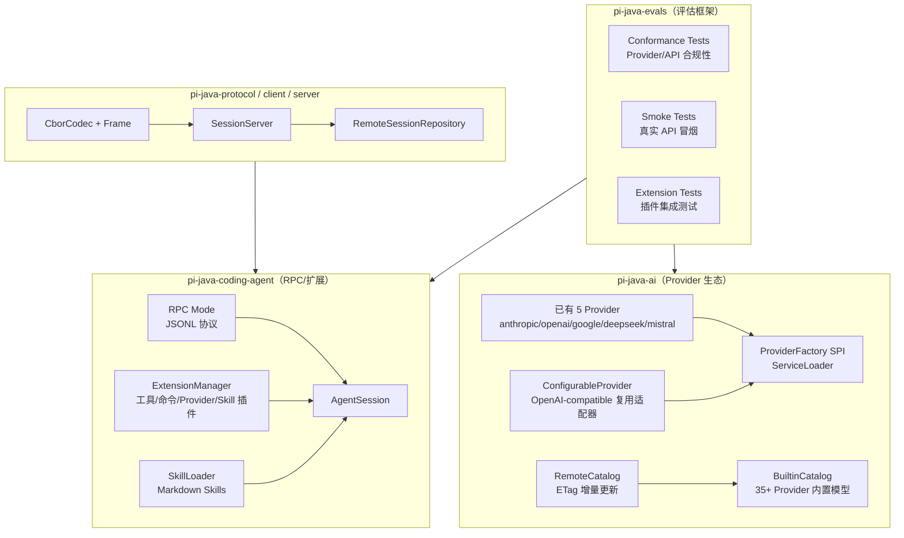

**核心设计原则**

- **Provider 生态优先复用协议适配器**：35 个新 Provider 中绝大多数是 OpenAI Chat Completions 兼容协议，用「配置描述 + 同一适配器」实现，而不是每个 Provider 复制一份协议代码。只有 Bedrock、Vertex AI、Azure OpenAI 等认证/协议差异大的供应商引入专属适配器。
- **Evals 是契约测试而不是脚本**：conformance 测试直接面向 `Provider` / `ChatApi` / `AgentHarness` 公开接口，使用 FauxProvider、录制响应、真实 API 三种模式分层执行。
- **RPC 与远程会话分离**：RPC 模式（JSONL）是 coding-agent 的进程内/stdio 集成协议，属于轻量 headless 接口；CBOR + client/server 是独立远程会话模块，面向跨进程/跨机器场景。
- **扩展点全部走 SPI**：Provider、Extension、Skill 都以 ServiceLoader 或目录扫描发现，避免 coding-agent 硬编码第三方类；Native Image 下保持 Phase 5 的 reachability-metadata 同步更新。
- **目录和发布属于生态闭环**：远程模型目录解决「内置数据滞后」问题；CLI 发布工具和 Maven Central 流水线让 Provider/目录数据可以独立迭代。

---

## 2. 工作流 A：Provider 生态扩展

### 2.1 现状与差距

| 现状 | Phase 6 目标 |
|------|-------------|
| 内置 5 个 Provider（Anthropic/OpenAI/Google/DeepSeek/Mistral） | 补齐 04 清单中的 35 个新 Provider，合计 40 个 |
| `Provider` / `ProviderFactory` / `ProviderRegistry` SPI 已存在 | 扩展为「配置驱动 + 专属适配器」双层体系 |
| `OpenAICompletionsApi` 已支持 baseUrl 覆盖（DeepSeek 复用） | 抽象 `OpenAiCompatibleProvider`，批量接入 OpenAI 兼容供应商 |
| `BuiltinCatalog` 硬编码 5 家模型数据 | 新增 `RemoteCatalog`，ETag 条件刷新，保留内置数据兜底 |
| `ProviderRegistry.discoverFromServiceLoader()` 已有 | 在启动装配中默认执行，第三方 JAR 可自动注册 Provider |

### 2.2 包结构与类图

```
com.pijava.ai.provider/
├── Provider.java                  ← 现有 SPI，保持兼容
├── ProviderFactory.java           ← 现有 SPI
├── ProviderRegistry.java          ← 现有注册表
├── ProviderConfig.java            ← 新增：Provider 静态配置
├── ConfigurableProvider.java      ← 新增：配置驱动 Provider 基类
├── OpenAiCompatibleProvider.java  ← 新增：OpenAI 兼容 Provider 基类
├── AnthropicCompatibleProvider.java ← 新增（可选：复用 AnthropicMessagesApi）
├── bedrock/                       ← 新增：Amazon Bedrock
│   ├── BedrockProvider.java
│   └── BedrockChatApi.java
├── azure/                         ← 新增：Azure OpenAI
│   ├── AzureOpenAIProvider.java
│   └── AzureOpenAIChatApi.java
├── vertex/                        ← 新增：Google Vertex AI
│   ├── VertexAIProvider.java
│   └── VertexAIChatApi.java
└── builtin/                       ← 新增：35 个 Provider 的集中注册
    ├── ProviderCatalog.java
    └── ModelData.java
```

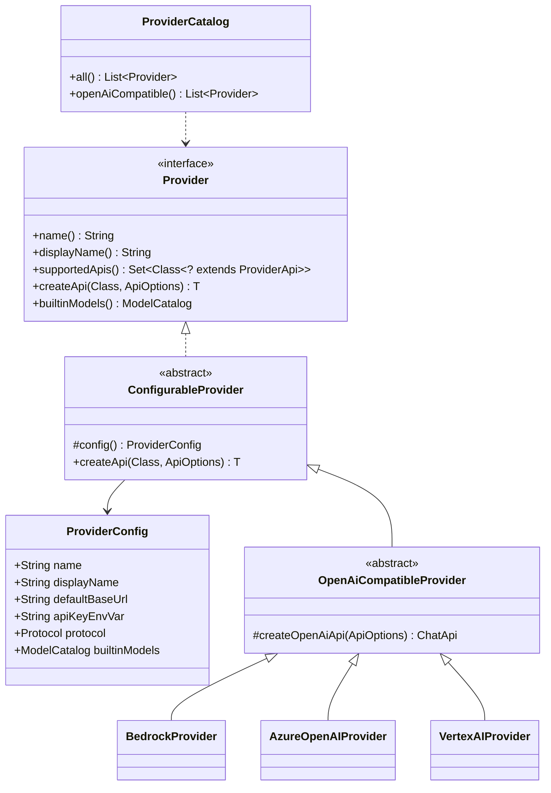

### 2.3 关键接口/类签名

```java
// Provider 静态配置 —— 一个 Provider 一份不可变配置
public enum Protocol {
    OPENAI_COMPATIBLE,
    ANTHROPIC_COMPATIBLE,
    GOOGLE,
    MISTRAL,
    BEDROCK,
    AZURE_OPENAI,
    VERTEX_AI,
    CUSTOM
}

public record ProviderConfig(
    String name,
    String displayName,
    Protocol protocol,
    String defaultBaseUrl,
    String apiKeyEnvVar,
    ModelCatalog builtinModels
) {
    public ProviderConfig {
        builtinModels = builtinModels == null ? ModelCatalog.empty() : builtinModels;
    }
}

// 配置驱动 Provider 基类：所有新 Provider 复用
public abstract class ConfigurableProvider implements Provider {

    protected abstract ProviderConfig config();

    @Override
    public final String name() {
        return config().name();
    }

    @Override
    public final String displayName() {
        return config().displayName();
    }

    @Override
    public final Set<Class<? extends ProviderApi>> supportedApis() {
        return Set.of(ChatApi.class);
    }

    @Override
    public final ModelCatalog builtinModels() {
        return config().builtinModels();
    }
}

// OpenAI 兼容 Provider 基类：DeepSeek/OpenRouter/Groq/... 共用
public abstract class OpenAiCompatibleProvider extends ConfigurableProvider {

    @Override
    public final <T extends ProviderApi> T createApi(Class<T> apiType, ApiOptions options) {
        if (!apiType.equals(ChatApi.class)) {
            throw new IllegalArgumentException("Unsupported API type: " + apiType);
        }
        var effective = new ApiOptions(
            options.baseUrl() != null && !options.baseUrl().isBlank()
                ? options.baseUrl() : config().defaultBaseUrl(),
            options.apiKey(),
            options.timeout(),
            options.maxRetries(),
            options.extra());
        return apiType.cast(new OpenAICompletionsApi(effective, config().apiKeyEnvVar()));
    }
}

// 具体 Provider 只需要声明配置；模型数据来自 ModelData 或远程目录
public final class GroqProvider extends OpenAiCompatibleProvider {
    @Override
    protected ProviderConfig config() {
        return new ProviderConfig(
            "groq", "Groq", Protocol.OPENAI_COMPATIBLE,
            "https://api.groq.com/openai/v1", "GROQ_API_KEY",
            ModelData.groqModels());
    }
}

// 注册表增强：支持按协议列出、批量加载 ServiceLoader Provider
public final class ProviderRegistry {
    // 现有方法保留 ...
    public List<Provider> listByProtocol(Protocol protocol);
    public int loadBuiltinProviders();
}
```

### 2.4 35 个新增 Provider 清单与接入分类

| 分类 | Provider | 接入方式 |
|------|----------|----------|
| OpenAI-compatible（约 20+） | OpenRouter, Groq, Together AI, Fireworks AI, DeepInfra, OctoAI, Hyperbolic, Lambda, Nebius, Nvidia NIM, Cloudflare Workers AI, GitHub Models, Perplexity, Sambanova, Scale, Sourcegraph, xAI, Zhipu AI, Moonshot, Baidu Qianfan, Alibaba Bailian, Tencent Hunyuan, ByteDance Doubao, StepFun, 01.AI, Ollama 等 | `OpenAiCompatibleProvider` + baseUrl/envVar + 模型数据 |
| Anthropic-compatible |（可选：Claude Code 兼容代理） | `AnthropicCompatibleProvider` 复用 `AnthropicMessagesApi` |
| 独立协议 | Cohere, HuggingFace, Replicate, Minimax, Snowflake Cortex, WatsonX, Mistral 已有 | 专属 `ChatApi` 或 raw HTTP 适配器 |
| 云厂商特殊认证 | Amazon Bedrock, Azure OpenAI, Google Vertex AI | 专属 Provider + 对应 SDK/签名（见 §2.6 外部依赖） |

> 实现顺序建议：先接入纯 OpenAI-compatible 且无需特殊请求体的 15 个；再接入有额外 header/参数或响应差异的 10 个；最后处理 Bedrock/Azure/Vertex 三个云厂商。

### 2.5 数据流

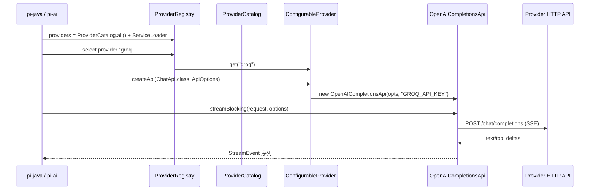

### 2.6 测试策略与外部依赖

- **单元测试**：每个 `ProviderConfig` 验证 name/baseUrl/envVar/模型数据不为空；每个 Provider 的 `createApi` 返回可用的 `ChatApi`；OpenAI-compatible Provider 共享同一套协议转换测试（用本地 MockWebServer 或 FauxProvider）。
- **Conformance 测试**：见工作流 B，所有 Provider 必须通过同一套 `ChatApi` 契约测试（流事件顺序、工具调用、usage、错误映射）。
- **外部依赖变更（待确认）**：
  - 大部分 OpenAI-compatible Provider 不新增依赖，继续使用 `openai-java` SDK 或 `PiHttpClient`。
  - Amazon Bedrock 可能需要 `software.amazon.awssdk:bedrockruntime`（或使用 AWS SigV4 手写签名）。
  - Azure OpenAI 可能需要 `com.azure:azure-ai-openai` 或手写 REST + `api-key` header。
  - Google Vertex AI 可能需要 `com.google.cloud:google-cloud-vertexai`。
  - 这些新增依赖在具体实现前先在本设计文档更新并让人确认。

---

## 3. 工作流 B：评估框架（evals）

### 3.1 目标

`pi-java-evals` 从骨架变为可运行的评估框架，覆盖：
- **Conformance tests**：Provider/API 合规性测试套件，不依赖真实网络（使用 fixture/录制/Faux）。
- **Smoke tests**：每个 Provider 1 个真实请求，快速验证凭据和端点可用。
- **Extension tests**：扩展/插件集成测试，验证工具、命令、Provider、Skill 能通过 SPI 装配进 AgentSession。

### 3.2 包结构与类图

```
com.pijava.evals/
├── api/                        ← 公共评估 API
│   ├── EvalCase.java
│   ├── EvalSuite.java
│   ├── EvalContext.java
│   ├── EvalResult.java
│   └── EvalReporter.java
├── runner/
│   └── EvalRunner.java
├── conformance/
│   ├── ChatApiConformanceSuite.java
│   ├── ProviderCatalogConformance.java
│   └── StreamEventOrderValidator.java
├── smoke/
│   ├── ProviderSmokeTest.java
│   └── SmokeTestTags.java
└── extension/
    ├── ExtensionLifecycleSuite.java
    └── SampleExtensionTest.java
```

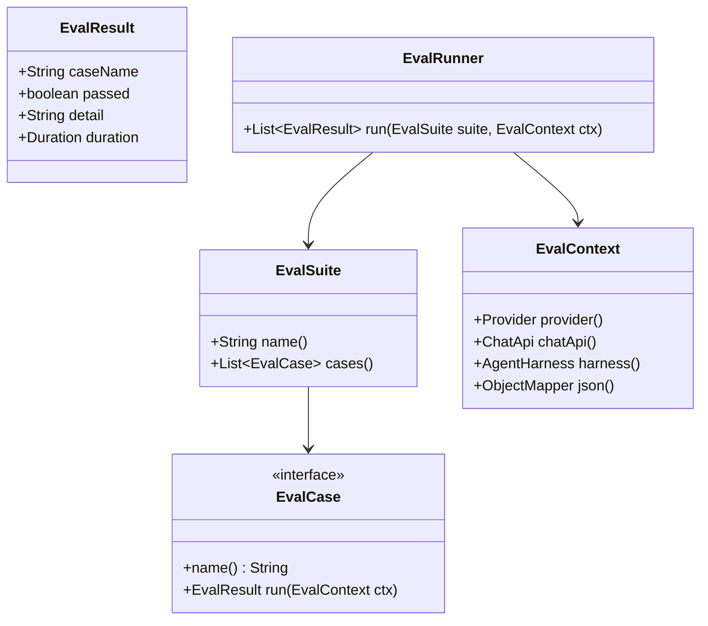

### 3.3 关键接口/类签名

```java
public interface EvalCase {
    String name();
    EvalResult run(EvalContext ctx);
}

public interface EvalSuite {
    String name();
    List<EvalCase> cases();
}

public interface EvalContext {
    /** 被测 Provider；FauxProvider 或真实 Provider 由运行参数决定 */
    Provider provider();

    /** 缓存好的 ChatApi 实例 */
    ChatApi chatApi();

    /** 被测 Agent 运行环境（扩展测试用） */
    AgentHarness harness();

    ObjectMapper json();
}

public record EvalResult(
    String caseName,
    boolean passed,
    String detail,
    Duration duration
) {
    public static EvalResult passed(String name, Duration d);
    public static EvalResult failed(String name, String detail, Duration d);
}

public final class EvalRunner {
    public List<EvalResult> run(EvalSuite suite, EvalContext ctx);
    public void runAll(List<EvalSuite> suites, EvalContext ctx);
}
```

### 3.4 Conformance 用例清单（首批）

| 编号 | 用例 | 验证点 |
|------|------|--------|
| C1 | 流事件必须以 `StreamEvent.Start` 开始、`StreamDone` 结束 | 顺序正确性 |
| C2 | 普通文本流输出 `TextDelta`，无工具调用时 `done.reason=stop` | 基本 chat |
| C3 | 工具调用完整生命周期：`ToolCallStart` → `ToolCallDelta` → `ToolCallEnd` → `done.reason=tool_use` | function calling |
| C4 | 工具参数 JSON 能累积并解析为 `Map<String,Object>` | 参数完整性 |
| C5 | 流式 usage 出现且 token 数非负 | usage 契约 |
| C6 | 错误响应映射为 `StreamError`，不抛未包装异常 | 错误契约 |
| C7 | `send()` 非流式与 `streamBlocking()` 聚合结果一致 | 双 API 等价 |
| C8 | 多轮消息（system/user/assistant/tool）往返不丢角色 | 消息映射 |

### 3.5 Smoke 测试

- 使用 JUnit `@Tag("smoke")`，默认不执行。
- 运行条件：`-Dpi.eval.smoke=true` 且存在对应 Provider 的 API key 环境变量。
- 每个 Provider 一个用例：`ping` 或最小 `streamBlocking("ping")`，成功条件为收到 `StreamDone`。
- 在 CI 中作为手动 workflow 或定时 workflow，不阻塞普通 `mvn verify`。

### 3.6 Extension 测试

- 构造一个 `SampleExtension`（注册一个 `EchoTool`、一个 `/hello` 命令、一个 `FauxProvider`、一个 `SampleSkill`）。
- 验证 `ExtensionManager` 能从 ServiceLoader 发现并装配；`AgentSession` 创建后工具/命令/Provider/Skill 均可见。
- 验证 `--no-extensions` 能禁用发现。

---

## 4. 工作流 C：RPC 模式（JSONL）

### 4.1 目标

让 `pi-java` 可作为 headless 服务被外部进程集成：`--mode rpc` 从 stdin 读取 JSONL 请求、向 stdout 写 JSONL 响应/通知，不需要 TUI。

### 4.2 包结构与协议

```
com.pijava.coding.agent.rpc/
├── RpcMode.java             ← Main 调用的入口
├── RpcProtocol.java         ← JSONL 编解码 + 常量
├── RpcServer.java           ← 请求分发
├── RpcClient.java           ← 测试/外部客户端示例
├── RpcRequest.java          ← sealed 请求类型
├── RpcResponse.java         ← sealed 响应类型
└── RpcException.java
```

协议采用 JSON-RPC 2.0 风格的 JSONL 行协议：

```jsonl
{"jsonrpc":"2.0","id":1,"method":"prompt","params":{"prompt":"hello","sessionId":null}}
{"jsonrpc":"2.0","id":1,"method":"prompt.result","result":{"sessionId":"01J...","text":"Hi!"}}
{"jsonrpc":"2.0","method":"prompt.event","params":{"type":"textDelta","text":"Hi"}}
{"jsonrpc":"2.0","id":2,"method":"abort","params":{"sessionId":"01J..."}}
```

### 4.3 关键类/接口签名

```java
public sealed interface RpcRequest permits
    PromptRequest, AbortRequest, ListSessionsRequest,
    ResumeRequest, ForkRequest, PingRequest {
}

public record PromptRequest(
    String prompt,
    String sessionId,       // null = 新建临时会话
    String model,
    String thinking,
    List<String> tools
) implements RpcRequest {}

public sealed interface RpcResponse permits
    PromptResult, ListSessionsResult, AbortResult, RpcError {
}

public record PromptResult(
    String sessionId,
    String text,
    String stopReason,
    Usage usage
) implements RpcResponse {}

public record RpcError(
    int code,
    String message,
    Map<String, Object> data
) implements RpcResponse {}

public final class RpcMode {
    /** 阻塞读取 stdin 全部请求并处理；返回进程退出码 */
    public static int run(BufferedReader in, PrintWriter out, Args args);
}

public final class RpcServer {
    public RpcServer(AgentSession.Factory sessionFactory, PrintWriter out);
    public void handle(String line);
    public void handle(RpcRequest request);
}
```

### 4.4 数据流

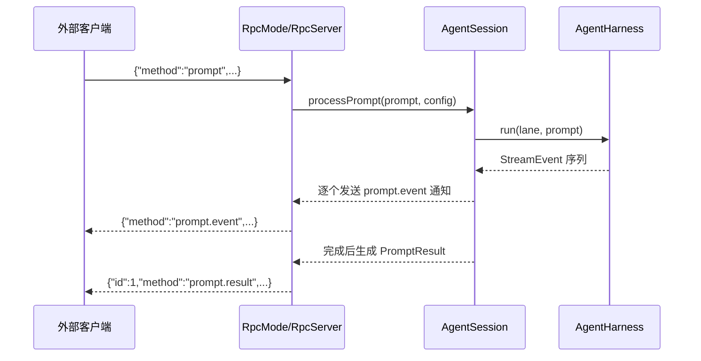

### 4.5 测试策略

- `RpcProtocolTest`：请求/响应对象与 JSONL 互转。
- `RpcServerTest`：使用内存 `AgentSession.Factory` + FauxProvider，断言 prompt 事件顺序和最终结果。
- `RpcModeEndToEndTest`：启动 `RpcMode.run` 的进程内管道（`PipedReader/PipedWriter`），模拟 stdin/stdout。

---

## 5. 工作流 D：CBOR 协议与远程会话

### 5.1 目标

让 `pi-java-client` 通过网络连接 `pi-java-server`，把远程实例的会话仓库/存储暴露为本地 `SessionRepository`/`SessionStorage`。`pi-java-protocol` 提供 CBOR 编解码和帧格式。

### 5.2 包结构与类图

```
com.pijava.protocol/
├── CborCodec.java
├── Frame.java
├── MessageType.java
├── RemoteRequest.java
├── RemoteResponse.java
└── ProtocolException.java

com.pijava.server/
├── SessionServer.java
├── SessionServerConfig.java
└── RemoteSessionHandler.java

com.pijava.client/
├── RemoteSessionClient.java
├── RemoteSessionRepository.java
└── RemoteSessionStorage.java
```

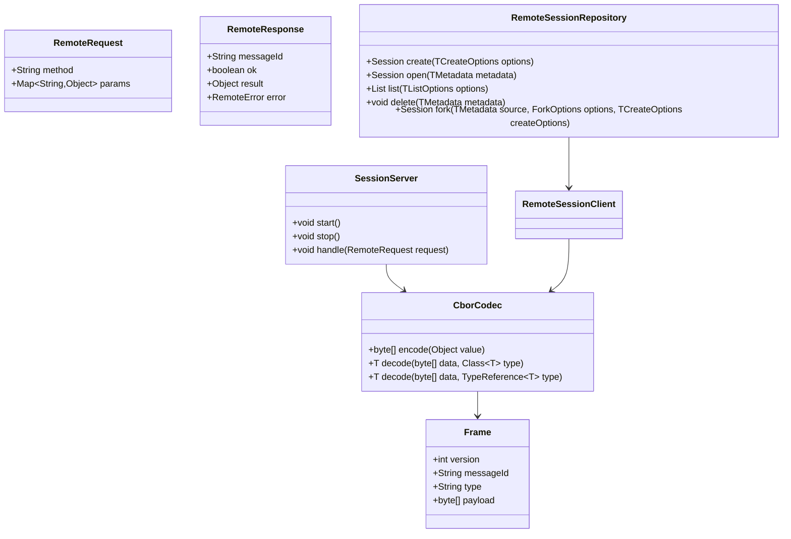

### 5.3 关键类/接口签名

```java
public final class CborCodec {
    public static final int PROTOCOL_VERSION = 1;

    public byte[] encode(Object value);

    public <T> T decode(byte[] data, Class<T> type);

    public <T> T decode(byte[] data, TypeReference<T> type);
}

public record Frame(
    int version,
    String messageId,
    String type,
    byte[] payload
) {
    public Frame {
        payload = payload == null ? new byte[0] : payload.clone();
    }

    public Frame withPayload(byte[] newPayload);
}

public enum MessageType {
    REQUEST,
    RESPONSE,
    EVENT,
    ERROR
}

public final class SessionServer implements AutoCloseable {
    public SessionServer(SessionServerConfig config, SessionRepository<?, ?, ?> repository);
    public void start();
    public void stop();
    @Override public void close();
}

public record SessionServerConfig(
    Path socketPath,            // Unix Domain Socket；Windows 可用 TCP fallback
    int backlog,
    Duration requestTimeout
) {
    public static SessionServerConfig unix(Path socketPath);
    public static SessionServerConfig tcp(String host, int port);
}
```

### 5.4 数据流

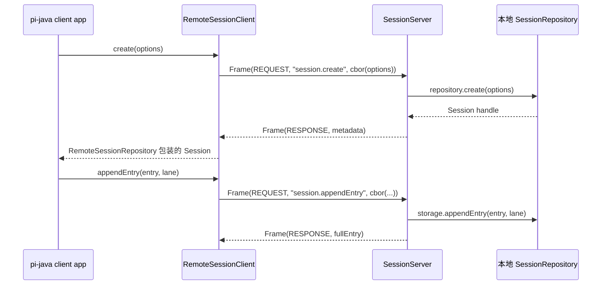

### 5.5 测试策略

- `CborCodecTest`：sealed record、`Entry`/`LaneRecord`/`SessionMutation` 等类型 round-trip。
- `FrameTest`：帧头/长度/截断/错误版本。
- `SessionServerClientIntegrationTest`：本地 Unix Domain Socket 或 localhost TCP 上启动 server，用 client 执行 create/open/list/append/fork/delete。
- Native Image 备注：新增 `pi-java-protocol` 反射面需同步 Phase 5 reachability-metadata（Jackson CBOR 多态）。

---

## 6. 工作流 E：Skills / Extensions / Plugins

### 6.1 现状

- `pi-java-agent-core` 已有 `Skill` / `SkillManager` / `PromptTemplate`，但缺少 Markdown 技能文件加载、项目级技能目录、技能注册到 AgentSession 的完整链路。
- CLI `Args` 已有 `--extension`、`--no-extensions`、`--skill`、`--no-skills`，但 `Main` 尚未实现扩展发现。

### 6.2 包结构与类图

```
com.pijava.coding.agent.extension/
├── PiExtension.java
├── ExtensionContext.java
├── ExtensionManager.java
├── ExtensionManifest.java
└── JarExtensionLoader.java

com.pijava.coding.agent.skill/
├── MarkdownSkillLoader.java
├── SkillDiscovery.java
└── SkillFormat.java

com.pijava.agent.skill/           ← agent-core 增强
├── FileSystemSkillRepository.java
└── CompositeSkillManager.java
```

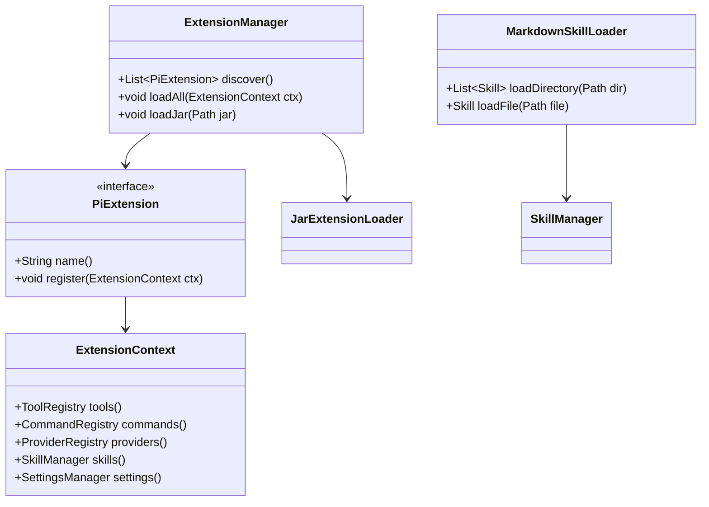

### 6.3 关键类/接口签名

```java
public interface PiExtension {
    /** 唯一扩展名，如 "my-tools" */
    String name();

    /** 扩展描述，用于 list-extensions */
    default String description() { return ""; }

    /** 注册工具/命令/Provider/Skill */
    void register(ExtensionContext ctx);
}

public interface ExtensionContext {
    ToolRegistry tools();
    CommandRegistry commands();
    ProviderRegistry providers();
    SkillManager skills();
    SettingsManager settings();
}

public final class ExtensionManager {
    public ExtensionManager(ExtensionContext context);

    /** 从 classpath ServiceLoader 发现 PiExtension */
    public List<PiExtension> discover();

    /** 加载所有已发现扩展，返回已加载扩展名 */
    public Set<String> loadAll();

    /** 从外部 JAR 加载扩展（URLClassLoader） */
    public Set<String> loadJar(Path jar);

    /** 卸载指定扩展（若扩展支持 close） */
    public void unload(String name);
}

public record ExtensionManifest(
    String name,
    String version,
    String description,
    List<String> tools,
    List<String> commands,
    List<String> providers,
    List<String> skills
) {
    public static ExtensionManifest from(Path jar);
}

public final class MarkdownSkillLoader {
    public List<Skill> loadDirectory(Path dir);

    /** 解析 Markdown 前言的 name/description/systemPrompt */
    public Skill loadFile(Path file);
}
```

### 6.4 Markdown Skill 格式

```markdown
---
name: code-review
label: Code Review
description: Run a focused code review on the current diff.
---

You are performing a code review. Focus on correctness, security, and maintainability.
Use the read/grep tools to inspect the diff.
```

- 搜索目录：`~/.pi-java/skills/`、`<project>/.pi-java/skills/`、CLI `--skill <path>`。
- `SkillDiscovery` 合并全局/项目/显式路径，注册到 `SkillManager`。

### 6.5 数据流

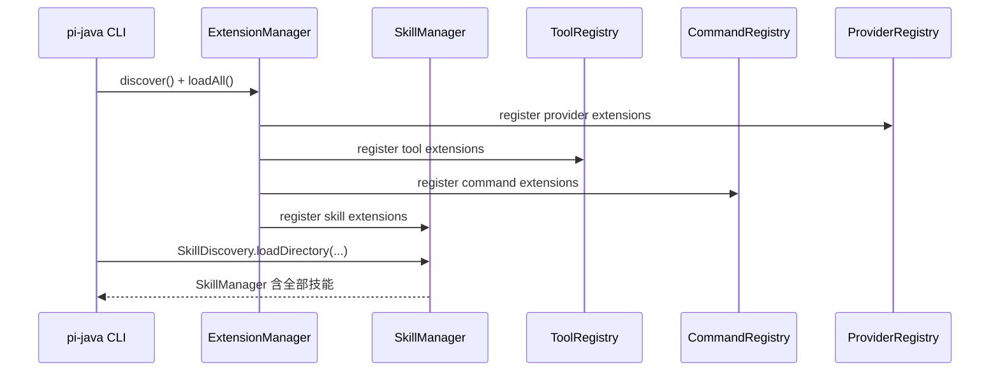

### 6.6 测试策略

- `MarkdownSkillLoaderTest`：解析正常/缺前言/非法格式。
- `ExtensionManagerTest`：ServiceLoader 发现、loadJar、重复注册去重、`--no-extensions` 禁用。
- `AgentSessionExtensionIntegrationTest`：FauxProvider + 示例扩展，验证扩展工具可被 Agent 调用。

---

## 7. 工作流 F：远程模型目录 + 发布流水线

### 7.1 远程模型目录（ETag）

#### 7.1.1 目标

`BuiltinCatalog` 静态数据会过时；`RemoteCatalog` 从远端 JSON 拉取模型目录，使用 `ETag`/`Last-Modified` 条件请求做增量更新，离线时回退本地缓存。

#### 7.1.2 包结构与类图

```
com.pijava.ai.catalog/
├── RemoteCatalog.java
├── CatalogSource.java
├── CatalogCache.java
└── CatalogRefreshResult.java
```

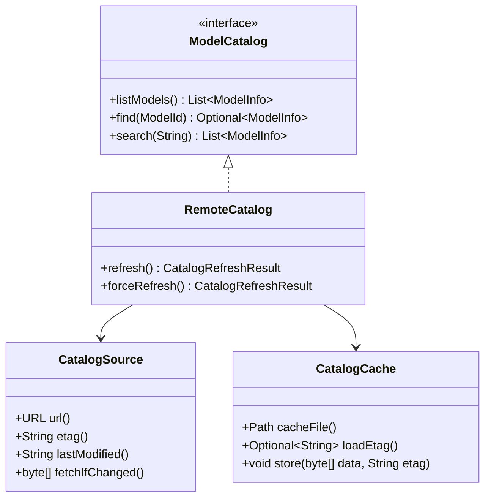

#### 7.1.3 关键接口/类签名

```java
public final class RemoteCatalog implements ModelCatalog {
    public RemoteCatalog(String providerName, URL source, Path cacheDir);

    /** 启动/定时刷新；304 时使用本地缓存 */
    public CatalogRefreshResult refresh();

    /** 忽略 ETag 强制刷新 */
    public CatalogRefreshResult forceRefresh();
}

public record CatalogSource(
    URL url,
    String etag,
    String lastModified
) {}

public record CatalogRefreshResult(
    boolean changed,
    int modelCount,
    String etag,
    Instant refreshedAt
) {}
```

#### 7.1.4 数据流

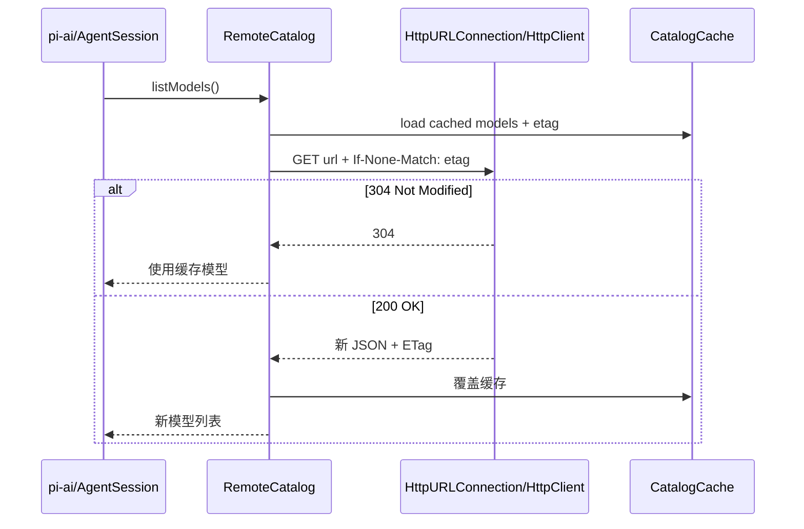

### 7.2 模型目录 CLI 发布工具

- 在 `pi-java-ai` 的 `AiCli` 新增子命令 `catalog`：

```
pi-ai catalog validate --file models.json
pi-ai catalog merge --base builtin.json --overlay remote.json --out merged.json
pi-ai catalog publish --file models.json --endpoint https://models.example.com/upload
```

- `CatalogPublisher` 负责校验 `ModelInfo` JSON schema、生成/更新 ETag、上传到静态托管端点（可通过配置的 HTTP PUT/S3 兼容接口，不引入强制云 SDK）。

### 7.3 Maven Central 发布流水线

- 在根 `pom.xml` 增加 `release` profile（构建期插件，不影响运行时依赖）：

| 插件 | 作用 |
|------|------|
| `maven-source-plugin` | 生成 sources.jar |
| `maven-javadoc-plugin` | 生成 javadoc.jar（已有） |
| `maven-gpg-plugin` | 签名 |
| `nexus-staging-maven-plugin` | 上传到 Maven Central staging |
| `flatten-maven-plugin` | 清理发布 POM（可选） |

- 发布命令：`./mvnw -Prelease -DskipTests deploy`
- 前置条件：`~/.m2/settings.xml` 配置 Central 账号、GPG key；CI 中仅在有 tag 时执行。

---

## 8. 任务清单（对应 `04-implementation-plan.md` §8）

| 编号 | 任务 | 优先级 | 产出 | 状态 |
|------|------|--------|------|------|
| P6-0 | 编写阶段设计文档 | 高 | `11-phase6-ecosystem-design.md` | 本文档 |
| P6-1 | 新增 35 个 Provider | 高 | `pi-java-ai` Provider 生态 | 未开始 |
| P6-2 | evals — conformance tests | 高 | `pi-java-evals` Conformance 套件 | 未开始 |
| P6-3 | evals — smoke tests | 高 | `pi-java-evals` Smoke 套件 | 未开始 |
| P6-4 | evals — extension tests | 高 | `pi-java-evals` Extension 套件 | 未开始 |
| P6-5 | RPC 模式（JSONL） | 中 | `pi-java --mode rpc` | 未开始 |
| P6-6 | 技能系统（Skills） | 中 | Markdown Skill 加载 + 目录发现 | 未开始 |
| P6-7 | 扩展系统（Extensions / Plugin） | 中 | `ExtensionManager` + `PiExtension` SPI | 未开始 |
| P6-8 | 远程模型目录更新（ETag） | 中 | `RemoteCatalog` | 未开始 |
| P6-9 | CBOR 协议 + 远程会话 | 低 | protocol/client/server 完整实现 | 未开始 |
| P6-10 | 模型目录 CLI 发布工具 | 低 | `pi-ai catalog` 子命令 | 未开始 |
| P6-11 | Maven Central 发布流水线 | 低 | `release` profile | 未开始 |

> 建议实施顺序：P6-1 → P6-2/P6-3/P6-4 → P6-5 → P6-6/P6-7 → P6-8 → P6-9 → P6-10/P6-11。每个任务独立 PR，保持 PR diff < 2000 行。

---

## 9. 测试策略汇总

| 模块/工作流 | 测试类型 | 关键用例 |
|-------------|----------|----------|
| Provider 生态 | 单元 + conformance | 配置合法性、createApi 路由、OpenAI-compatible 共享协议测试 |
| Evals | JUnit 5 + 动态测试 | C1–C8 conformance、smoke tag、extension 生命周期 |
| RPC JSONL | 单元 + 端到端 | 协议编解码、RpcServer 分发、stdio 管道 E2E |
| CBOR 远程会话 | 单元 + 集成 | CborCodec round-trip、本地 socket 集成、错误帧 |
| Skills/Extensions | 单元 + 集成 | Markdown 解析、ServiceLoader 发现、Agent 调用扩展工具 |
| 远程目录 | 单元 + 集成 | 304/200 分支、缓存回退、模型合并 |
| 发布 | 构建验证 | `-Prelease package` 产物含 sources/javadoc/signature |

---

## 10. 验收标准（可量化）

1. **Provider 生态**
   - [ ] `pi-ai list-models` 能列出 40 个 Provider（含 Phase 1 的 5 个）。
   - [ ] 每个新 Provider 至少通过 `ProviderCatalogConformance` 的基础配置测试。
   - [ ] OpenAI-compatible Provider 共用同一适配器，重复协议代码为零（除特殊响应差异外）。
2. **Evals**
   - [ ] `mvn verify -pl pi-java-evals` 在无网络时全绿（conformance + extension）。
   - [ ] `mvn verify -pl pi-java-evals -Dpi.eval.smoke=true` 在配置凭据时可跑 smoke，失败不误报普通 CI。
3. **RPC**
   - [ ] `printf '{"jsonrpc":"2.0","id":1,"method":"prompt","params":{"prompt":"hi"}}\n' | pi-java --mode rpc` 返回至少一条 event 通知和一条 result。
   - [ ] RPC 协议有完整自动化测试，覆盖新建/恢复/abort/错误。
4. **远程会话**
   - [ ] `CborCodec` 对所有核心 sealed record 类型 round-trip 通过。
   - [ ] 本地 Unix Domain Socket/TCP 上的 server+client 集成测试通过 create/open/list/append/fork/delete。
5. **Skills/Extensions**
   - [ ] 示例扩展 JAR 能被 `ExtensionManager.loadJar` 加载并注册工具/命令/Provider/Skill。
   - [ ] `--no-extensions` / `--no-skills` 能完全禁用对应发现。
6. **目录与发布**
   - [ ] `RemoteCatalog.refresh()` 在本地 HTTP server 的 304/200 场景测试通过。
   - [ ] `mvn -Prelease package -DskipTests` 在 CI 能产出可发布构件（不要求真正 deploy 到 Central）。
7. **整体**
   - [ ] `mvn clean verify` 零错误零警告。
   - [ ] Checkstyle / SpotBugs 通过。
   - [ ] Native Image 构建仍通过（新增反射面已同步到 reachability-metadata）。

---

## 11. 风险与外部依赖变更

| 风险/变更 | 影响 | 缓解 |
|-----------|------|------|
| 35 个 Provider 中部分 API 不兼容标准 OpenAI 协议 | 中 | 先 conformance 后接入；差异用 ProviderConfig.extra 和专属适配器隔离 |
| Bedrock/Azure/Vertex 需要新增云 SDK | 中 | 实现前更新本文档并让人确认；优先评估手写 REST 以控制依赖 |
| CBOR 远程会话的序列化面扩大 | 中 | 沿用 Phase 5 Tracing Agent + 明确反射清单；集成测试覆盖 |
| 插件加载外部 JAR 与 Native Image 冲突 | 中 | 插件默认走 classpath/ServiceLoader；`loadJar` 仅 JVM 模式支持，Native 模式文档注明 |
| Maven Central 发布涉及凭据和签名 | 低 | CI 仅 tag 触发；本机开发者按发布手册执行 |
| Phase 6 为持续阶段，范围蔓延 | 中 | 按优先级分批 PR；每批独立验收，不阻塞主线 |

---

## 12. 待确认决策

| 决策项 | 选项 | 建议 |
|--------|------|------|
| 新 Provider 是否全部走 `OpenAiCompatibleProvider` | 是 / 仅大部分 | 大部分；Bedrock/Azure/Vertex 专属适配器 |
| 是否引入云厂商 SDK | 引入 / 手写 REST | 优先手写 REST，若认证复杂再引入 SDK 并单独确认 |
| RPC JSONL 使用 JSON-RPC 2.0 还是自定义协议 | JSON-RPC 2.0 / 自定义 | JSON-RPC 2.0，生态兼容 |
| 远程会话传输优先 Unix Socket 还是 TCP | Unix Socket / TCP | Unix Socket（本机），保留 TCP 配置 |
| 插件 `loadJar` 是否纳入 Phase 6 首批 | 纳入 / 延后 | 延后到 P6-7 中后段；首批只做 classpath SPI |
