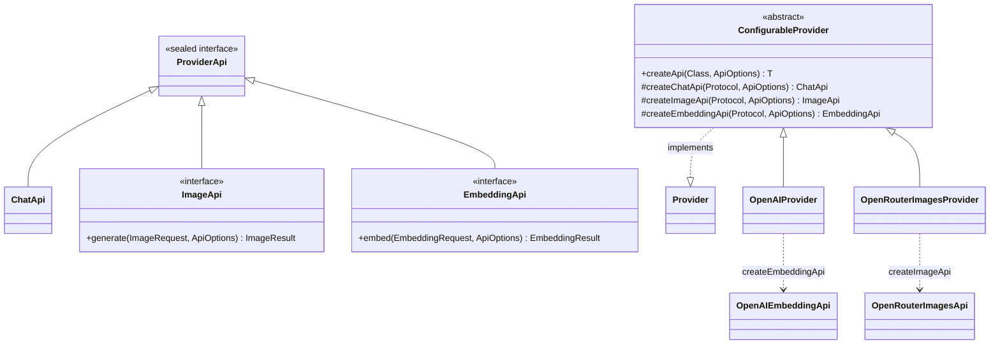
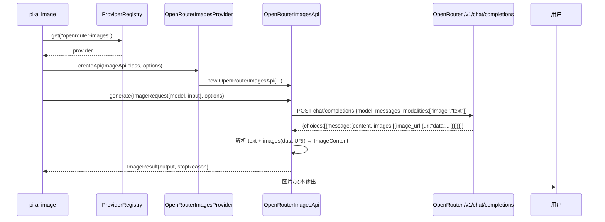

# Phase 6 — P6-28：ImageApi / EmbeddingApi 设计文档

> 状态：草稿（待审核）。对应 `11-phase6-ecosystem-design.md` §8.2 延后项 P6-28。
> 用户决策：**ImageApi 直接复刻 pi 的 `openrouter-images.ts` 模式**（独立 provider + chat-with-modalities）；EmbeddingApi 一起做（pi 无 embedding provider，pi-java 独有，用 OpenAI `/v1/embeddings`）。

---

## 1. 背景与目标

P6-28 原延后理由：「`ProviderApi` 是 `sealed ... permits ChatApi`，加 `ImageApi`/`EmbeddingApi` 需破坏性变更；pi 仅 `openrouter-images`」。

本阶段实现：
- **`ImageApi`** —— 图片生成能力，**对齐 pi 的 `ImagesFunction`/`AssistantImages`**：输入文本/图片内容块，输出图片 + 可选文本。底层直接复刻 pi `openrouter-images.ts`：新增独立 `openrouter-images` provider（不挂靠 OpenAI），走 OpenAI 兼容 chat completions + `modalities` 返回图片。
- **`EmbeddingApi`** —— 文本嵌入，pi-java 独有（pi 无 embedding provider），OpenAI `/v1/embeddings`。

**已实测的关键事实**（2026-08-22）：
- openai-java 4.42.0 的 `ChatCompletionCreateParams$Modality` 枚举仅 `TEXT`/`AUDIO`，但 `Modality.Companion.of("image")` 可构造任意值 → `modalities: ["image","text"]` 可表达。
- SDK `ChatCompletionMessage` **无 `images` 字段**；OpenRouter 的图片扩展落在 `_additionalProperties().get("images")`，需自行解析 data URI。
- SDK 原生支持 `client.images()`（`ImageGenerateParams`/`ImagesResponse`）与 `client.embeddings()`（`EmbeddingCreateParams`/`CreateEmbeddingResponse`）——EmbeddingApi 直接复用。
- pi 的 openrouter 图片模型 8 个：`black-forest-labs/flux.2-{flex,klein-4b,max,pro}`、`bytedance-seed/seedream-4.5`、`google/gemini-2.5-flash-image`、`google/gemini-3-pro-image`、`google/gemini-3-pro-image-preview`；baseUrl `https://openrouter.ai/api/v1`，auth `OPENROUTER_API_KEY`。

---

## 2. 与 pi 的对齐关系

| pi | pi-java | 说明 |
|----|---------|------|
| `ImagesProvider`（`images-models.ts`） | `OpenRouterImagesProvider`（独立 provider） | 图片专用，`supportedApis() = {ImageApi}` |
| `ImagesFunction(model, context, options)` | `ImageApi.generate(ImageRequest, ApiOptions)` | 接口对齐 |
| `ImagesContext.input`（TextContent\|ImageContent[]） | `ImageRequest.input: List<ContentBlock>` | 复用现有 `ContentBlock` |
| `AssistantImages` | `ImageResult` | 字段逐一对应 |
| `openrouter-images.ts`（chat + modalities） | `OpenRouterImagesApi`（chat + modalities） | 同一调用模式；pi 用 openai npm SDK，pi-java 用 openai-java SDK |
| `image-models.generated.ts` | OpenRouterImagesProvider 内置 8 模型 | 模型 id/baseUrl 一致 |
| —（pi 无 embedding） | `EmbeddingApi`/`OpenAIEmbeddingApi` | pi-java 独有 |

---

## 3. 包结构与类图

```
com.pijava.ai.api/                    ← 新增 API 能力类型
├── ProviderApi.java                  ← 改 permits ChatApi, ImageApi, EmbeddingApi
├── ImageApi.java                     ← 新增（对齐 pi ImagesFunction）
├── ImageRequest.java                 ← 新增
├── ImageResult.java                  ← 新增（对齐 pi AssistantImages）
├── ImageStopReason.java              ← 新增 enum
├── EmbeddingApi.java                 ← 新增
├── EmbeddingRequest.java             ← 新增
└── EmbeddingResult.java              ← 新增

com.pijava.ai.provider/
├── ConfigurableProvider.java         ← 改 createApi 三路分派 + createImageApi/createEmbeddingApi 钩子
├── OpenAIProvider.java               ← 改 supportedApis 加 EmbeddingApi + createEmbeddingApi
└── builtin/
    ├── OpenRouterImagesProvider.java ← 新增（镜像 pi openrouter-images.ts）
    └── ProviderCatalog.java          ← 改注册 OpenRouterImagesProvider

com.pijava.ai.protocol/
├── OpenRouterImagesApi.java          ← 新增（chat-with-modalities）
└── OpenAIEmbeddingApi.java           ← 新增（client.embeddings()）

com.pijava.ai.catalog/
└── BuiltinCatalog.java               ← 改 openaiModels() 加 text-embedding-3-small 等

com.pijava.ai.cli/
└── AiCli.java                        ← 改加 image / embed 子命令
```



---

## 4. 关键接口/类签名

### 4.1 `ProviderApi`（改）

```java
public sealed interface ProviderApi
        permits ChatApi, ImageApi, EmbeddingApi {
}
```

### 4.2 `ImageApi` / 载荷（新）

```java
/** 图片生成能力 —— 对齐 pi ImagesFunction。 */
public interface ImageApi extends ProviderApi {
    /** 生成图片。 */
    ImageResult generate(ImageRequest request, ApiOptions options);
}

/** 图片生成请求 —— pi ImagesContext.input。 */
public record ImageRequest(
    ModelId<?> model,
    List<ContentBlock> input        // 文本/图片内容块，defensively copied
) {}

/** 图片生成结果 —— pi AssistantImages。 */
public record ImageResult(
    String provider,                // "openrouter-images"
    String model,
    List<ContentBlock> output,      // TextContent | ImageContent
    ImageStopReason stopReason,
    String errorMessage,            // null on success
    long timestamp                  // Unix epoch ms
) {}

/** pi ImagesStopReason = "stop"|"error"|"aborted" —— 纯常量闭集 → enum。 */
public enum ImageStopReason {
    STOP, ERROR, ABORTED;
    @JsonValue public String wireName() { /* "stop" | "error" | "aborted" */ }
}
```

### 4.3 `EmbeddingApi` / 载荷（新）

```java
/** 文本嵌入能力 —— pi-java 独有（pi 无 embedding provider）。 */
public interface EmbeddingApi extends ProviderApi {
    EmbeddingResult embed(EmbeddingRequest request, ApiOptions options);
}

public record EmbeddingRequest(ModelId<?> model, List<String> input) {}
public record EmbeddingResult(String model, List<float[]> embeddings, int inputTokens) {}
```

### 4.4 `ConfigurableProvider`（改）

```java
@Override
public <T extends ProviderApi> T createApi(Class<T> apiType, ApiOptions options) {
    var protocol = resolveProtocol(options);
    var opts = effectiveOptions(options);
    if (apiType.equals(ChatApi.class))      return apiType.cast(createChatApi(protocol, opts));
    if (apiType.equals(ImageApi.class))     return apiType.cast(createImageApi(protocol, opts));
    if (apiType.equals(EmbeddingApi.class)) return apiType.cast(createEmbeddingApi(protocol, opts));
    throw new IllegalArgumentException("Unsupported API type: " + apiType);
}

/** 子类覆写以支持图片生成；基类默认不支持。 */
protected ImageApi createImageApi(Protocol protocol, ApiOptions options) {
    throw new UnsupportedOperationException("Provider " + name() + " does not support ImageApi");
}

/** 子类覆写以支持嵌入；基类默认不支持。 */
protected EmbeddingApi createEmbeddingApi(Protocol protocol, ApiOptions options) {
    throw new UnsupportedOperationException("Provider " + name() + " does not support EmbeddingApi");
}
```

### 4.5 `OpenRouterImagesProvider`（新）

```java
/** 镜像 pi openrouter-images.ts —— 图片专用 provider。 */
public final class OpenRouterImagesProvider extends ConfigurableProvider {

    @Override protected ProviderConfig config() {
        return new ProviderConfig(
            "openrouter-images", "OpenRouter Images",
            "https://openrouter.ai/api/v1", "OPENROUTER_API_KEY",
            Protocol.OPENAI_COMPLETIONS, Set.of(),           // 图片不走 chat 协议路由
            OpenRouterImageModels.catalog());                 // 8 个图片模型
    }

    @Override public Set<Class<? extends ProviderApi>> supportedApis() {
        return Set.of(ImageApi.class);
    }

    @Override protected ImageApi createImageApi(Protocol protocol, ApiOptions options) {
        return new OpenRouterImagesApi(options, config().apiKeyEnvVar());
    }
}
```

### 4.6 `OpenRouterImagesApi`（新）

```java
/** chat completions + modalities 返回图片（对齐 pi openrouter-images.ts）。 */
public final class OpenRouterImagesApi implements ImageApi {

    private final OpenAIClient client;
    private final String apiKey;

    public OpenRouterImagesApi(ApiOptions options, String apiKeyEnvVar) {
        this.apiKey = resolveKey(options, apiKeyEnvVar);
        var baseUrl = options.baseUrl() != null && !options.baseUrl().isBlank()
            ? options.baseUrl() : "https://openrouter.ai/api/v1";
        this.client = OpenAIOkHttpClient.builder().apiKey(apiKey).baseUrl(baseUrl).build();
    }

    @Override
    public ImageResult generate(ImageRequest request, ApiOptions options) {
        var result = new ImageResultBuilder();
        try {
            var params = buildParams(request);
            var response = client.chat().completions().create(params);
            var choice = response.choices().get(0);
            var message = choice.message();
            message.content().ifPresent(text ->
                result.output(new ContentBlock.TextContent(text)));
            // OpenRouter 图片扩展在 additionalProperties.images
            parseImages(message._additionalProperties().get("images"), result);
            return result.build(ImageStopReason.STOP);
        } catch (Exception e) {
            var aborted = options != null && options.extra().get("signal") instanceof AbortSignal s
                && s.isAborted();
            return result.build(aborted ? ImageStopReason.ABORTED : ImageStopReason.ERROR, e.getMessage());
        }
    }
}
```

`buildParams` 要点：
```java
var content = request.input().stream()
    .map(OpenRouterImagesApi::toContentPart)   // TextContent → ofText；ImageContent → ofImageUrl(data URI)
    .toList();
return ChatCompletionCreateParams.builder()
    .model(request.model().modelName())
    .addUserMessageOfArrayOfContentParts(content)
    .modalities(List.of(Modality.Companion.of("image"), Modality.TEXT))
    .build();
```

`parseImages` 要点：`message._additionalProperties().get("images")` 是数组 `[{image_url: {url: "data:<mime>;base64,<data>"}}]`，用正则 `^data:([^;]+);base64,(.+)$` 解析 → `ContentBlock.ImageContent(mediaType, data)`。

### 4.7 `OpenAIEmbeddingApi`（新）

```java
public final class OpenAIEmbeddingApi implements EmbeddingApi {

    private final OpenAIClient client;
    private final String apiKey;

    @Override
    public EmbeddingResult embed(EmbeddingRequest request, ApiOptions options) {
        var params = EmbeddingCreateParams.builder()
            .model(request.model().modelName())
            .input(request.input())      // SDK 支持 List<String>
            .build();
        var response = client.embeddings().create(params);
        var vectors = response.data().stream()
            .map(e -> e.embedding())     // List<Double> → float[]
            .toList();
        return new EmbeddingResult(request.model().modelName(), vectors,
            response.usage().map(u -> u.promptTokens()).orElse(0));
    }
}
```

### 4.8 `AiCli` 子命令（新）

```java
@Command(name = "image", description = "Generate an image via a provider")
class ImageCmd implements Runnable {
    @Option(names = "--provider", defaultValue = "openrouter-images") String provider;
    @Option(names = "--model") String model;
    @Parameters String prompt;
    public void run() { /* 解析 model → ImageApi.generate → 输出图片信息 */ }
}

@Command(name = "embed", description = "Embed text via a provider")
class EmbedCmd implements Runnable {
    @Option(names = "--provider", defaultValue = "openai") String provider;
    @Option(names = "--model", defaultValue = "text-embedding-3-small") String model;
    @Parameters String text;
    public void run() { /* EmbeddingApi.embed → 输出向量维度/前几维 */ }
}
```

---

## 5. 数据流



---

## 6. CLI 与配置

- `pi-ai image --model black-forest-labs/flux.2-flex "a red panda"` —— 需 `OPENROUTER_API_KEY`。
- `pi-ai embed "hello world"` —— 需 `OPENAI_API_KEY`，默认 `text-embedding-3-small`。
- `pi-ai list-models` 新增 `openrouter-images` 的 8 个图片模型（provider 计数 16 → 17）。

---

## 7. 测试策略

| 测试 | 类型 | 用例 |
|------|------|------|
| `ImageRequest`/`ImageResult`/`EmbeddingRequest`/`EmbeddingResult` | 单元 | JSON round-trip；`ImageStopReason` wire 值 |
| `OpenRouterImagesApiTest` | 单元 + fixture | 请求构建（modalities 含 image/text、content parts、baseUrl、apiKey 从 env）；响应解析（`message.images` data URI → `ImageContent`；缺图片只回 text；异常 → `ERROR` stopReason） |
| `OpenAIEmbeddingApiTest` | 单元 + fixture | 参数构建（model/input）；响应映射（embedding 向量、usage） |
| `ProviderCatalogConformance`（evals） | 集成 | `openrouter-images` 通过基础配置测试（name/baseUrl/envVar/模型非空）；OpenAI `supportedApis` 含 EmbeddingApi |
| CLI | 冒烟 | 无 key 时回清晰错误（不误报 CI，同 smoke 模式） |

---

## 8. 验收标准（可量化）

- [ ] `ProviderApi` 允许 `ChatApi`/`ImageApi`/`EmbeddingApi` 三种；`ConfigurableProvider.createApi` 三路分派，未支持类型抛清晰错误。
- [ ] `OpenRouterImagesProvider` 出现在 `ProviderRegistry`/`list-models`，`supportedApis() = {ImageApi}`，8 个图片模型可列。
- [ ] `OpenRouterImagesApi.generate` 请求含 `modalities: ["image","text"]` 与正确的 content parts；对含 `message.images` 的 fixture 正确产出 `ImageContent`（mediaType/data），无图时只回 text。
- [ ] `ImageResult` 字段与 pi `AssistantImages` 一一对应（provider/model/output/stopReason/errorMessage/timestamp）。
- [ ] OpenAI `EmbeddingApi` 通过 `client.embeddings()` 产出 `EmbeddingResult`；`text-embedding-3-small` 在 `list-models`。
- [ ] `pi-ai image`/`pi-ai embed` 在无 key 时输出可读错误；配 key 时可跑真实请求（smoke）。
- [ ] `mvn clean verify` 零错误零警告；新增文件 ≤500 行。

---

## 9. 与 pi 的偏差记录

- ImageApi 接口形状、provider 模式、chat-with-modalities 调用均对齐 pi；pi-java 用 openai-java SDK 实现 OpenRouter 调用（pi 用 openai npm SDK）。
- EmbeddingApi 为 pi-java 独有（pi 无 embedding provider，无对照）。
