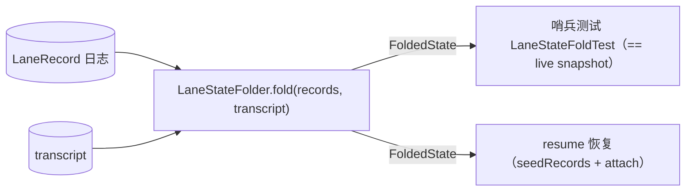

# 21 — Record 日志补全 + LaneState 可派生（对齐 pi harness/reducer.ts）

> 上一篇：`docs/20-agent-loop-optimization-plan.md`（agent-loop 状态机对齐）。
> 本篇是**记录日志（LaneRecord）完整性** + **记录派生（fold）** 阶段设计。
> 编制日期：2026-09-11。基准：pi `packages/agent/src/harness/reducer.ts`（667 行纯函数 `reduceLaneState`）。
>
> **范围**：① 补 P0 记录发射缺口；② 移植 pi reducer 子集 → `LaneStateFolder.fold(records, transcript)`；
> ③ resume 记录恢复；④ 哨兵测试 `LaneStateFoldTest`。**Out（明确推迟）**：见 §6。

## 0. 目标

把「LaneState 是可变的独立对象 + 并行审计日志」改为 **「LaneState 是 record 日志的纯函数折叠」**——
两条核心收益：

1. **审计闭环**：LaneRecord 全部 11 变体（含新增 `QueueConsumed`）都有发射点，日志不再是残缺的；
2. **可恢复**：`fold(records, transcript)` 能脱离 live driver 重建编排状态，为 resume/restore 提供数据源。

对齐基准是 pi 的 `harness/reducer.ts`。pi 的 reducer 是纯函数（`reduceLaneState(input)`），
只被测试消费，生产消费方是 resume/restore 层（`SuspendedOperation`）。

---

## 1. 现状盘点：P0 记录发射缺口

`LaneRecord.java` 现有 10 变体。逐项核对发射点：

| 变体 | 现状 | 缺口 |
|---|---|---|
| `OperationStarted` | run 发射（`ActionExecutor.run`） | ✅ |
| `OperationFinished` | L3 收敛为 `executeFinishOperation` 单点发射 | ✅ |
| `StepAttempt` | run 的 ASSISTANT 尝试发射（`ActionExecutor.executeStreamAssistant`） | ⚠️ **缺 stopReason 字段**（D3） |
| `ToolStarted` | run 执行工具时发射 | ✅ |
| `ToolFinished` | 同 | ✅ |
| `AbortRequested` | `AgentHarness.abort()` 非空闲时发射 | ⚠️ **`close()` 不发射**（D6） |
| `QueueEnqueued` | **从不发射** | 🔴 P0 |
| `QueueCancelled` | **从不发射** | 🔴 P0 |
| `WriteDeferred` | **从不发射** | 🔴 P0（pi-java 无 deferred 运行时，D5） |
| `UsageRecord` | run 结束时发射 | ⚠️ **仅 tokens>0 时发射**（D2） |

顺带：`AgentHarness.run()` / `runContinue()` 里 `records.clear()`（`:92, :143, :180`）是破坏性清空，
与「append-only 记录日志」相悖，需移除（D6）。

---

## 2. 关键设计决策

| # | 决策 | 理由 |
|---|---|---|
| **D1** | 移植 reducer **子集**（operation-state 派生），不搬全量 | 派生集正是核心；deferred 无运行时（§6-1） |
| **D2** | `UsageRecord` 无条件发射 stopReason（tokens==0 也写） | 否则 newestOwn.stopReason / phase 在 tokens==0、error/aborted 路径不可派生 |
| **D3** | `StepAttempt` 加 `stopReason` 字段（agent-core 内 schema 变更） | 否则 newestOwn.stopReason / phase 在 tokens==0、error/aborted 路径不可派生 |
| **D4** | **新增 `QueueConsumed` 记录变体**（pi-java 独有，偏离 pi 9 变体，需明示） | pi 靠 entry-presence 推断消费，pi-java 把 drain 合并成单条 user entry，结构上无法按条推断（§6-6）；`QueueCancelled` 仅表达显式取消 |
| **D5** | compaction 是 **step 而非嵌套 operation**：run 中发射 `StepAttempt(COMPACTION)`；空闲时发射 `OperationStarted(Compaction)`+`StepAttempt`+`OperationFinished` 三连 | `JsonlSessionStorage.appendRecord:191-197` 拒绝每 lane 第二个 open operation，run 中发射 OperationStarted(Compaction) 会破坏持久化 |
| **D6** | `lane.records` 改 **append-only**（移除 `run()`/`runContinue()` 的 clear，保留 `reset()`） | fold 需跨 run 历史（run N 入队 nextRun 在 run N+1 消费）；`persistPending` 已 id 去重 |
| **D7** | fold 是**纯函数** `LaneStateFolder.fold(records, transcript)`，供哨兵 + resume 恢复；live driver 继续原地改 LaneState。不做增量 apply | pi reducer 即纯函数；两个消费方都不需要增量 |
| **D8** | **abort outcome 修正**：`HarnessUtils.determineOutcome` 把 `"aborted"` → `"aborted"`（现映射到 error→FAILED，污染 `faulted`） | pi 对齐；⚠️ 行为变更，需查现有断言（见 §6-8 风险） |

> **为什么 fold 需要 transcript 一起**：pi 的 reducer 输入含 `ownEntries` + `configurationEntries`（entry 查询）。
> pi-java 的 `Entry` 走独立持久化（`transcript` + `seedTranscript` 路径），不重复进 record 日志。
> 所以 fold 签名 = `fold(records, transcript)`，二者是**两个独立投影**，不是一份数据源。

---

## 3. 目标类签名

### 3.1 `LaneRecord.StepAttempt` 增字段

```java
record StepAttempt(
    String id, long seq, String lane, Instant timestamp,
    String runId, StepKind step, int attempt, String resultEntryId,
    String compactionReason, String model, Integer messageCount, Integer toolCount,
    String thinking, Long durationMs,
    String stopReason        // NEW: newestOwn.stopReason 派生的来源（assistant step 才有值）
) implements LaneRecord {}
```

JSONL 旧文件解码 → null，向后兼容（SQLite 记录 payload 是 JSON blob，无表迁移）。

### 3.2 新增 `LaneRecord.QueueConsumed`（D4）

```java
/** A queue item was consumed (drained and merged into the transcript). pi-java 独有。 */
record QueueConsumed(
    String id, long seq, String lane, Instant timestamp,
    String runId,                 // 消费它的 run；空闲消费为 ""
    QueueKind queue,              // steer | followUp | nextRun
    List<ProvisionedEntry<?>> targets   // 该次 drain 消费的全部项（QueueMode 整体合并）
) implements LaneRecord {}
```

- `QueueEnqueued`（现有）在 `QueueManager.steer/followUp/nextRun` 发射（D5 §4-2）。
- `QueueCancelled`（现有）在 `QueueManager.cancelQueued` 发射（D4 §4-2）。
- `QueueConsumed`（新增）在 `ActionExecutor.executeConsumeQueueItem` 发射（D4 §4-2）。

### 3.3 `LaneStateFolder`（核心，新文件 ~300 行）

```java
package com.pijava.agent.harness;

/**
 * 纯函数：把 lane 的 record 日志 + transcript 折叠回编排状态。
 * 对齐 pi harness/reducer.ts 的 reduceLaneState（派生 operation-state 子集）。
 * 纯函数——不依赖 live driver，供哨兵测试与 resume 恢复消费。
 */
final class LaneStateFolder {

    /** 折叠结果：与 LaneState 对应字段对齐的不可变快照。 */
    record FoldedState(
        String lane,
        RunPhase phase,                 // IDLE | RUNNING | CHECKPOINT（fold 归一化，见 R5）
        String runId,                   // 当前 open operation 的 id；空闲为 null
        int stepIndex,                  // 当前 run 已完成的 step 数
        NewestOwn newestOwn,            // 最近一条 own entry 的摘要（含 stopReason）
        boolean faulted,                // 最近一次 operation 以 error 结束
        boolean aborted,                // 最近一次 operation 被 abort
        List<LaneInfo.QueuedItem> pendingSteer,
        List<LaneInfo.QueuedItem> pendingFollowUp,
        List<LaneInfo.QueuedItem> pendingNextRun
    ) {}

    /**
     * fold(records, transcript) 的入口。records 按 seq 升序 fold。
     * transcript 用于派生 newestOwn（own entry = transcript 里 role=assistant 的 Message entry）。
     */
    static FoldedState fold(
        String lane,
        List<LaneRecord> records,
        List<Entry> transcript
    ) { ... }
}
```

fold 逻辑（对齐 pi `reduceLaneState` 的相关分支）：
- **open operation**：按 seq 找最后一条 `OperationStarted`，其后无 `OperationFinished` → 该 op 是当前 run；
- **pendingSteer / pendingFollowUp / pendingNextRun**：按 seq 收集 `QueueEnqueued`，扣除已被
  `QueueConsumed` / `QueueCancelled` 消化的项；nextRun 的 `target.id` 永不进入 transcript → 视为仍 pending；
- **newestOwn**：transcript 里最后一个 `role=assistant` 的 `Entry.Message`，stopReason 取对应
  `StepAttempt.stopReason`（若无 → null）；
- **phase**：有 open op → CHECKPOINT（fold 归一化，见 R5）；无 → IDLE；
- **faulted / aborted**：最近一次 `OperationFinished` 的 outcome 是 `"error"`（D8 后 `"aborted"` 不再计入）；
- **stepIndex**：open op 内 `StepAttempt` 数。

`fold` 不派生：deferred（无运行时）、toolBatch、terminalFailure、effectiveConfiguration（§6）。

### 3.4 `AgentHarness.close()` 补 AbortRequested

```java
@Override
public void close() {
    closed = true;
    for (var lane : lanes.values()) {
        if (lane.abortSignal != null) lane.abortSignal.abort();
        if (!(lane.phase instanceof RunPhase.Idle)) {
            lane.records.add(new LaneRecord.AbortRequested(
                UUID.randomUUID().toString(), 0, lane.laneName, null,
                lane.runId == null ? "" : lane.runId));
        }
        snapshotService.publishState(lane.laneName);
    }
}
```

### 3.5 `SessionPersistence.attach` 恢复记录

`SessionPersistence.attach:56-71` 目前只恢复 entries（`seedTranscript`）。补：

```java
// attach 尾部：恢复 record 日志
var records = storage.findRecords(new RecordQuery(lane, null, null, null));
for (var record : records) {
    lane.records.add(record.committed(record.seq(), record.timestamp()));
}
```

---

## 4. 数据流（mermaid）

### 4.1 记录发射点（live driver 侧）

```mermaid
flowchart LR
    subgraph Live["live driver（原地改 LaneState）"]
        A["run()/runContinue()"] -->|OperationStarted| R
        B["executeStreamAssistant"] -->|StepAttempt(stopReason)| R
        C["executeConsumeQueueItem"] -->|QueueConsumed| R
        D["QueueManager.steer/followUp/nextRun"] -->|QueueEnqueued| R
        E["QueueManager.cancelQueued"] -->|QueueCancelled| R
        F["CompactionExecutor"] -->|StepAttempt(COMPACTION)| R
        G["executeFinishOperation"] -->|OperationFinished| R
        H["ToolExecutionPipeline"] -->|ToolStarted/ToolFinished| R
        I["close()/abort()"] -->|AbortRequested| R
        J["run 结束"] -->|UsageRecord(stopReason)| R
        R[(LaneRecord 日志)]
    end
```

### 4.2 消费方（fold 侧）



---

## 5. 测试清单

| 测试 | 文件（新） | 断言 |
|---|---|---|
| 哨兵：user→tool→follow-up→compaction 全驱动 | `LaneStateFoldTest` | 每个边界 `fold(records, transcript)` 派生的 phase/runId/stepIndex/newestOwn 与 live `LaneState` 相等（phase 在 tool_use-stream 后单一瞬态点跳过，R5） |
| 队列消费折叠 | 同 | enqueue→consume 后 fold 的 pendingFollowUp == live 队列剩余 |
| compaction step | 同 | run 中 compaction → fold 产出 `StepAttempt(COMPACTION)`，pendingWrites 正确 |
| abort 路径 | 同 | `abort()` 后 fold 的 `aborted=true`，phase 不为 RUNNING |
| 空闲三连 | 同 | 空闲 compaction → `OperationStarted(Compaction)`+`StepAttempt`+`OperationFinished` |
| queue 记录发射 | `QueueRecordEmissionTest` | steer/followUp/nextRun/cancelQueued 各发射对应记录 |
| 现有回归 | 复用 `AgentLoopL2Test` / `RunToCompletionTest` / `HookTest` | append-only + D8 行为变更不破坏现有语义 |

---

## 6. Out（明确推迟）项：为什么不做

| Out 项 | 为什么不做 | 何时做 |
|---|---|---|
| **1. deferred 执行机制** | pi-java 只有 schema 碎片，**无运行时**：`DeferredHandle` 全仓库 0 命中，`fetch_deferred`/`cancel_deferred` 无对应 Action，`WriteDeferred` record 无发射点。fold 派生的 deferred 字段无消费者 | P0 之后专门立项（需先做 write-deferred 运行时 + prompt-template 消费者） |
| **2. effectiveConfiguration** | fold 输入需要「配置 Entry（ModelChange/ThinkingLevelChange/ActiveToolsChange）进 record 日志」，目前这些 Entry 被 `ContextAssembler` 写进 transcript 而非 record 日志——**这是折叠数据源缺口**，不是 reducer 实现问题 | 需先补「配置变更也落 record」的发射点 |
| **3. toolBatch 派生** | pi `deriveToolBatch` 依赖 pi 的 entry-presence 语义（按条 entry 推断消费/结果）；pi-java 把同轮 drain 合并成单条 user entry，结构上无法按条对齐；toolBatch 主要用于 resume 续跑批量的校验，pi-java 无 `toolBatch` resume | 等 resume 完整性专项 |
| **4. terminalFailure 溯源** | 依赖 assistant `stopReason==="error"` + 判定错误是 step 还是 deferred_fetch 产物——后者无运行时（见 1）；且 pi-java 的 error 路径语义不同 | 随 deferred 立项一并考虑 |
| **5. entry-内嵌 stopReason（pi 做法）** | pi 把 stopReason 存在 assistant entry 的 message 上；pi-java 的 `StepAttempt` 无 stopReason 字段、`determineOutcome` 从内存 `lane.newestOwn` 读。若走 pi 路线 = 改 Entry 持久化 schema（JSONL/SQLite 双写）+ 全仓 message 消费方，blast radius 过大 | 本阶段用 D3 折中（StepAttempt 加 stopReason 字段） |
| **6. queue 消费按 entry-presence 推断** | pi 每条 queue item 对应一条 entry，消费 = entry 出现；pi-java 把 drain 合并成单条 user entry（QueueMode 整体合并），无逐条对应 | 本阶段用 D4 折中（新增 QueueConsumed record） |

---

## 7. 实施节奏

> **第一步（本阶段唯一交付物，写完即停）**：本篇 + `docs/02`/`docs/03` addendum，提交
> `docs(agent-core): 21 record-log fold design + 02/03 addendum`。**完成后停下，交人审核。**

**第二步（审核通过后实施，5 个代码提交）**：

| Step | 提交 | 主要文件 |
|---|---|---|
| 1 | `feat(agent-core): persist step stopReason on StepAttempt + abort outcome` | `record/LaneRecord.java`、`session/jsonl/RecordJsonCodec.java`、`harness/ActionExecutor.java`、`harness/HarnessUtils.java` + 4 处测试 fixture |
| 2 | `feat(agent-core): emit queue_enqueued/queue_cancelled/queue_consumed records` | `record/LaneRecord.java`（+QueueConsumed）、`harness/QueueManager.java`、`JsonlCodec`/`RecordJsonCodec`/`SessionState`/`SqliteCodecs` + 测试 |
| 3 | `feat(agent-core): compaction records, close abort, append-only records` | `harness/CompactionExecutor.java`、`harness/AgentHarness.java`（close + seedRecords）、`harness/ActionExecutor.java`（去 clear） |
| 4 | `feat(agent-core): LaneStateFolder — record-log fold` | `harness/LaneStateFolder.java`（新，~300 行） |
| 5 | `feat(agent-core): LaneStateFoldTest sentinel + resume record restore` | `harness/LaneStateFoldTest.java`（新）、`coding-agent/SessionPersistence.java`（attach records） |

分支 `phase21-record-fold`；显式 `git add <path>`，禁 `-A`/`.`。

---

## 8. 风险

| # | 风险 | 缓解 |
|---|---|---|
| **R1** | StepAttempt.stopReason ripple | 已全枚举（LaneRecord/RecordJsonCodec/ActionExecutor + 4 fixtures）；SQLite 记录 payload 是 JSON blob 无需表迁移，JSONL 旧文件解码 null 兼容 |
| **R2** | QueueConsumed 新变体漏配 case | `SessionState.matchesRecordQuery` 与 `SqliteCodecs.recordRunId` **必须**补 case，否则 findRecords(runId) / SQLite run_id 列漏掉新类型 |
| **R3** | append-only records 使 `LaneSnapshot.records()` 增长（长会话 web wire 膨胀） | 默认接受，审阅反对时再限流 |
| **R4** | 空闲 compaction 用 compaction op id 作 runId；harness 保持 idle | TryFinishRun 不会对 compaction op 跑 |
| **R5** | phase 微态歧义：records 无法区分「tool_use stream 后 CHECKPOINT 瞬态」与「TryFinishRun(tool_use) 后 ASSISTANT」 | fold 返回 settle 值（ASSISTANT）；哨兵在该单点跳过 phase 断言。可选后续：TryFinishRun 决策记录（推迟） |
| **R6** | QueueEnqueued.target.id 用 `Long.toString(seq)`，永不对应真实 transcript entry（prompts 合并） | fold 仅靠 QueueConsumed；设计文档须明示，避免未来移植 pi validateRecordLog 时误报 |
| **R7** | append-only 后 `reset()` 仍 clear → fold 历史截断 | reset 语义明确是「清空 lane」，保留；fold 只对 reset 之后的记录负责 |
| **D8 行为变更** | abort 终局 outcome FAILED→ABORTED | 查受影响测试（如 HookTest abort 用例）后一并改 |

---

## 9. 验收标准

- `mvn clean verify` 零错误零警告，全模块测试通过（agent-core → sqlite → coding-agent）
- `LaneStateFoldTest` 全绿：fold == live snapshot（哨兵）
- `QueueRecordEmissionTest` 全绿：三队列 + 取消 + 消费各发射记录
- `LaneRecord` 11 变体全部有发射点（无一变体「从未发射」）
- `SessionPersistence.attach` 恢复 records
- 无 `System.out.println` 残留，spotbugs/checkstyle 零违规
- 文件 ≤ 500 行（`LaneStateFolder` 若超则拆 `LaneStateQueueFold` / `LaneStateOpFold`）
