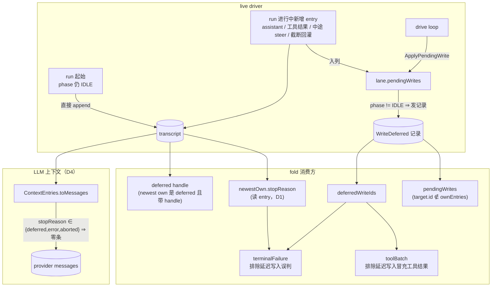

# 23 — Deferred 写入运行时 + entry 溯源（stopReason / toolBatch / terminalFailure）

> 上一篇：`docs/21-record-log-fold-design.md`（record 日志补全 + LaneStateFold）。
> 本篇实施 docs/21 §6 的推迟项中**确实可做**的部分：**#1 deferred 记录层**、**#2 toolBatch**、
> **#3 terminalFailure**、**#4 stopReason 入 entry**。
> 编制日期：2026-09-12。基准：pi `packages/agent/src/harness/reducer.ts` + `docs/harness-v2.md`。

---

## 0. 目标

把 orchestration 状态的三块**溯源信息**补齐，使 LaneState 的派生面与 pi 对齐：

1. **#4 溯源地基**：assistant 的 `stopReason` 落在 **entry** 上（pi 做法），而非 `StepAttempt` 旁路字段——
   这样「这条消息是为什么停的」成为**已持久化 entry 的固有属性**，任何读 entry 的地方都能拿到；
2. **#1 deferred 记录层**：`WriteDeferred` 从「有类型无发射点」变为有真实生产者 + 可派生 `pendingWrites`,
   并落地 `invalid_deferred_handle` / `provisioned_entry_mismatch` 校验；
3. **#2/#3 派生**：fold 产出 `toolBatch` 与 `terminalFailure`（含 provenance 判定）。

> **⚠️ 范围前提（必须先读）**：**pi 自己也没有实现 deferred 运行时**。核对结果：
> `DeferredHandle` 类型存在（`ai/src/types.ts:397`）、`StopReason` 有 `"deferred"` 成员、
> `WriteDeferred` 记录类型存在，但——`write_deferred` **零生产者**（只有测试构造）、
> `applyPendingWrite` **只存在于 `docs/harness-v2.md` 伪代码**、pi 的 `AgentHarness` 是**抛异常的 stub**、
> `fetchDeferred`/`cancelDeferred` 只有 **faux 测试 provider** 实现，anthropic/openai 全都没有。
>
> 因此 #1 不是「移植 pi 的成熟实现」，而是**照 pi 的 spec 补一个连 pi 都还没写的运行时**。
> 本阶段据此**明确不碰 provider 层**（见 §6-1），只做 harness/记录层。

---

## 1. 现状盘点

### 1.1 pi 侧（本期基准）

| 部件 | pi 位置 | 状态 |
|---|---|---|
| `DeferredHandle` | `ai/src/types.ts:397-407` | 类型存在 |
| `StopReason` + `"deferred"` | `ai/src/types.ts:393` | 存在 |
| `SimpleStreamOptions.deferred`（请求侧开关） | `ai/src/types.ts:306-307` | 类型存在，仅 faux 读 |
| `ProviderStreams.fetchDeferred/cancelDeferred` | `ai/src/types.ts:268-277` | 契约存在，仅 faux 实现 |
| `WriteDeferredRecord` | `harness/session/types.ts:184-188` | 类型存在 |
| **`write_deferred` 生产者** | — | 🔴 **不存在** |
| **`applyPendingWrite` 运行时** | 仅 `docs/harness-v2.md:2530` | 🔴 **不存在** |
| `deriveToolBatch` | `reducer.ts:479-486+` | 存在 |
| `terminalFailure` 派生 | `reducer.ts:614-640` | 存在 |
| `validateDeferredHandles` | `reducer.ts:272-283` | 存在 |

### 1.2 pi-java 侧

| 部件 | 位置 | 状态 |
|---|---|---|
| ai `AssistantMessage(id, content, usage, stopReason)` | `ai/message/AssistantMessage.java:27` | ✅ **已有 stopReason** |
| agent `Message.AssistantMessage(List<ContentBlock> content)` | `ai/message/Message.java:47` | 🔴 **丢弃 stopReason** |
| 丢弃点 | `ActionExecutor.java:462` | `new Message.AssistantMessage(lane.partial.content())` |
| `MessageJsonCodec` assistant 分支 | `:39` | 🔴 只有 `{role, content}`，无 stopReason 槽位 |
| `LaneRecord.WriteDeferred` | `record/LaneRecord.java:284-292` | 类型存在，🔴 **零发射点** |
| `lane.pendingWrites` + `Action.ApplyPendingWrite` | `ActionExecutor:106-120/462-467/307-308/668-669` | ✅ 机制已存在（仅缺记录） |
| `UsageCause.DEFERRED_FETCH` | `record/UsageCause.java:11` | 🔴 常量已声明，零发射点 |
| `FoldedState` | `harness/LaneStateFolder.java:56-79` | 🔴 无 deferred / pendingWrites / toolBatch / terminalFailure |
| `ContextEntries.toMessages` | `session/ContextEntries.java` | 🔴 无 pi 的零投影规则 |
| `SessionState.matchesRecordQuery` / `SqliteCodecs.recordRunId` | `:434` / `:58` | ✅ 已含 `WriteDeferred` |
| `LaneStateFolder ` 现有规模 | 447 行 | 再加 4 个派生必破 500 行 |
| `ActionExecutor` 现有规模 | 691 行 | 已破线，本期还要涨 |

### 1.3 对 docs/21 §6 的勘误（重要）

| docs/21 §6 原文 | 核对结论 |
|---|---|
| #2「pi-java 把同轮 drain 合并成单条 user entry，结构上无法按条对齐」 | ❌ **理由不成立**。pi 的 `deriveToolBatch` 按 **`toolCallId`** 匹配 assistant 的 toolCall block ↔ 之后的 toolResult entry，**与 queue drain 合并无关**；toolResult 从来是一条一个 entry。pi-java 完全具备该结构（§3.4）。 |
| #3「依赖 deferred 无运行时」 | ⚠️ **部分成立**。`producedByStep` 分支现成可做（`StepAttempt.resultEntryId` 已在传）；只有 `producedByDeferredFetch` 分支依赖 #1。 |
| #5「queue 消费按 entry-presence 推断」 | ✅ **已被 D4 取代**（`QueueConsumed`，commit `eccc9cf`）。本期**不纳入**，docs/21 §6-5 自己已写明「本阶段用 D4 折中」。 |

---

## 2. 关键设计决策

| # | 决策 | 理由 |
|---|---|---|
| **D1** | **entry 为 stopReason 唯一真相**；**删除 `StepAttempt.stopReason`**（`f4e5fdc` 加的字段回退） | pi 把 stopReason 存在 assistant message 上；两条真相源会长期漂移。快照 `FAIL_ON_UNKNOWN_PROPERTIES=false`，旧 JSONL 里残留的该字段解码时被忽略，无需迁移 |
| **D2** | 引入 `DeferredHandle` 类型 + `Message.AssistantMessage.deferred`，但**不引入任何生产者**；`deferred` 派生与 `invalid_deferred_handle` 校验**仅由测试覆盖** | 用户确认（B）。与 pi 现状一致（pi 的类型同样无生产者）。**如实记录，不假装有生产者** |
| **D3** | **`WriteDeferred` 生产者 = lane 非 idle 时新增到 `lane.pendingWrites` 的 entry** | 用户确认。对齐 pi「running 期间即 deferred」规则（`harness-v2.md:1894`）：run 自己产出的（assistant 回复 / 工具结果 / 中途 steer / 截断回灌）算 deferred；run 起始的用户 prompt 在 phase 仍为 IDLE 时入列，算直接 append |
| **D4** | **完整采纳 pi 的上下文投影规则**：`stopReason ∈ {deferred, error, aborted}` 的 assistant entry **投影为零条 provider 消息** | 用户确认（A，完整采纳）。对齐 pi `session/context.ts:71-73`。⚠️ 行为变更，见 R1 |
| **D5** | `toolBatch` 按 **`toolCallId`** 匹配，并用 `deferredWriteIds` 排除延迟写入 | pi `reducer.ts:479-486`。pi-java 另有 `ToolStarted/ToolFinished` 的 `assistantEntryId`/`toolCallId`/`toolIndex` 可交叉校验 |
| **D6** | `terminalFailure` 双 provenance：`step`（`StepAttempt.resultEntryId` == 该 entry）或 `deferred_fetch`（`usage.cause==DEFERRED_FETCH` 绑该 entry，或前一条 own entry 是 deferred）。且该 entry **不得**是 deferred write（`deferredWriteIds` 抑制） | pi `reducer.ts:614-640` |
| **D7** | 同期拆分：`LaneStateFolder` → 3 类；`ActionExecutor` 抽出 assistant 流执行 | 用户确认（C）。不拆必破 500 行规范 |
| **D8** | **不做 provider 层**：不加 `SimpleStreamOptions.deferred`、不加 `fetchDeferred`/`cancelDeferred` | 已在 §0 说明的范围内；无真实 provider 支持，做了是死代码 |

> **为什么 D3 选 `pendingWrites` 而非 Session 层 lane-view**：pi 的 spec 字面是「lane-view entry write」，
> 但 pi-java 的 `Session.appendEntry` 与 harness 的 `pendingWrites` 分属两层，跨层改造 blast radius 大得多；
> 而 `pendingWrites` 恰好就是 pi 派生的那个 `pendingWrites`（「已接受未应用」）的 live 对应物。

---

## 3. 目标类签名

### 3.1 ai 层

```java
// 新文件 ai/message/DeferredHandle.java
/** Provider handle for a deferred (asynchronous) response (pi ai/types.ts:397). */
public record DeferredHandle(
    String provider,
    String modelId,
    String api,
    String id,                    // provider token: response id / batch id + row id
    Long expiresAt,               // optional
    Long pollAfterMs,             // optional
    Map<String, Object> data      // provider conversion data; optional
) {}

// ai/message/Message.java — 加字段 + 保留兼容构造器
record AssistantMessage(
    List<ContentBlock> content,
    String stopReason,            // NEW: "stop" | "tool_use" | "length" | "error" | "aborted" | "deferred"
    DeferredHandle deferred       // NEW: 仅 stopReason=="deferred" 时有值
) implements Message {
    /** 兼容构造器：旧调用点与旧数据（stopReason/deferred 为 null）。 */
    public AssistantMessage(List<ContentBlock> content) { this(content, null, null); }
}
```

**兼容构造器是刻意的**：`Message.AssistantMessage` 的构造点散布在 agent-core、coding-agent、测试中，
加一个双参构造器把 churn 限制在真正需要传 stopReason 的那几处。

### 3.2 agent-core 层

```java
// ActionExecutor — 保留 stopReason，不再丢弃（原 :462）
var asstEntry = new Entry.Message(asstEntryId, 0, parentId, null,
    new Message.AssistantMessage(lane.partial.content(),
        lane.partial.stopReason(), lane.partial.deferred()), null);

// LaneRecord.StepAttempt — 删除 stopReason 组件（D1）
record StepAttempt(..., Long durationMs) implements LaneRecord {}

// LaneStateFolder.newestOwn — 改读 entry 上的 stopReason（D1）
private static LaneState.NewestOwn newestOwn(List<Entry> ownEntries, ...) { ... }
// stopReasonFor(ordered, entryId) 删除

// FoldedState — 新增 4 个派生字段
record FoldedState(
    ... 既有 11 项 ...,
    List<ProvisionedEntry<?>> pendingWrites,   // NEW (D3/#1)
    DeferredHandle deferred,                   // NEW (#1)
    ToolBatch toolBatch,                       // NEW (#2)
    TerminalFailure terminalFailure            // NEW (#3)
) {}

record ToolBatch(String assistantEntryId, List<ToolBatchCall> calls) {}
record ToolBatchCall(String toolCallId, String toolName, String resultEntryId, boolean missing) {}

record TerminalFailure(String entryId, String source, /* "step" | "deferred_fetch" */ Message message) {}
```

### 3.3 正文投影（D4）

```java
// session/ContextEntries.toMessages(...) — 加一条早退
if (entry instanceof Entry.Message m
        && m.message() instanceof Message.AssistantMessage a
        && PROJECT_OUT.contains(a.stopReason())) {   // {deferred, error, aborted}
    continue;                                        // 投影为零条 provider 消息
}
```

### 3.4 派生逻辑（对齐 pi）

- **`pendingWrites`（#1）**：本次 run 的 `WriteDeferred` 记录中，`target.id` **不在** ownEntries 里的 → 克隆 target。
  与 `pendingSteer/FollowUp` 不同，**abort 时不清零**（pi `reducer.ts:543-558`；延迟写入在取消时仍会被应用）。
- **`deferred`（#1）**：**仅看 newest own entry**——是 assistant 且 `stopReason=="deferred"` 且带 handle → 克隆 handle，否则 null。
  即「只有挂在算子尾部时才算未兑换」（pi 测试 `reducer.test.ts:982-1002`）。
- **`deferredWriteIds`（#1，供 #2/#3）**：本次 run 所有 `WriteDeferred.target.id` 的集合。
- **`toolBatch`（#2）**：取 ownEntries 中**最后一条内容含 toolCall 的 assistant entry**；对其每个 toolCall，
  在**该 entry 之后**的 ownEntries 里找 `role=="toolResult"` 且 `toolUseId` 相同、且 **id 不在 `deferredWriteIds`** 的 entry。
  找不到 → 该 call 标 `missing`（pi 用 `deferredWriteIds` 排除正是为了不让延迟写入冒充工具结果）。
  **「之后」按 ownEntries 中的位置判定，不用 `seq`**：未提交的 entry `seq` 恒为 0（storage 在 commit 时才赋值），
  与 `validateRecordLog` 采用位置序同理（docs/21 已确立）；持久化切片因先按 `seq` 稳定排序，两种口径一致。
  注：pi-java 另有 `ToolStarted/ToolFinished` 记录可作交叉校验，本阶段只用于**测试断言**，不进派生。
- **`terminalFailure`（#3）**：newest own 是 assistant 且 `stopReason=="error"`，**且**其 id 不在 `deferredWriteIds`，
  **且**满足 `producedByStep`（存在 `StepAttempt` 且 `resultEntryId` == 该 entry id）
  或 `producedByDeferredFetch`（存在 `UsageRecord.cause==DEFERRED_FETCH` 且 `entryId` == 该 entry，
  或 ownEntries 倒数第二条是 `stopReason=="deferred"` 的 assistant）。
  满足则产出 `TerminalFailure(entryId, source, message)`，否则 null。
- **校验新增**：`invalid_deferred_handle`（assistant entry 的 `stopReason=="deferred"` 必须带 handle）；
  `write_deferred` 的 `provisioned_entry_mismatch`（target id 若已在 entries 中存在，内容必须逐字节一致）。

### 3.5 拆分（D7）

| 新类 | 职责 | 迁出 |
|---|---|---|
| `LaneStateFolder` | 入口 `fold` + `FoldedState` + `EffectiveConfiguration` + `fold` 编排 | — |
| `RecordLogValidator` | `validateRecordLog` 子集 + 全部 corruption 规则 | `LaneStateFolder:304-356` |
| `LaneOperationFold` | op 派生：open op / phase / stepIndex / newestOwn / faulted / aborted / `deferred` / `pendingWrites` / `toolBatch` / `terminalFailure` | 新增 + 自 `LaneStateFolder` 迁入 |
| `AssistantStreamExecutor` | `executeStreamAssistant` 全流程（stream + span + overflow + hook + entry + StepAttempt/Usage 记录） | `ActionExecutor:333-484`（~150 行） |

`Action.ApplyPendingWrite` 语义**不变**（仍是「从 `lane.pendingWrites` 出列」；真正的持久化仍在
coding-agent 的 `persistPending`），本期只**额外**在入列时发 `WriteDeferred` 记录。

---

## 4. 数据流



---

## 5. 测试清单

| 测试 | 文件 | 断言 |
|---|---|---|
| `StepAttempt` 不再带 stopReason | 改 `LaneRecordTest` / `RecordObservabilityCodecTest` / `ConformanceSupport` / `RunSummaryAggregatorTest` | 删字段后全绿；旧 JSONL（含该字段）仍能解码 |
| entry 携带 stopReason 往返 | `RecordObservabilityCodecTest` 扩容 | assistant entry round-trip 后 `stopReason` 一致；旧文件缺字段→null |
| **折叠读 entry 的 stopReason** | `LaneStateFoldTest` 扩容 | fold 的 `newestOwn.stopReason` == live `lastAssistantMessage().stopReason()`（既有哨兵断言保持） |
| **投影规则（D4）** | 新 `ContextProjectionTest` | `deferred`/`error`/`aborted` 的 assistant entry **零条** provider 消息；`stop`/`tool_use`/`length` 正常投影；非 assistant entry 不受影响 |
| **WriteDeferred 发射（D3）** | 新 `WriteDeferredEmissionTest` | run 中产生的 entry（assistant/工具结果/中途 steer）各发一条 `WriteDeferred`；run 起始的用户 prompt **不**发 |
| **pendingWrites 派生** | 同 / `LaneStateFoldTest` | fold 的 `pendingWrites` == live `snapshot.pendingWrites()`；abort 后仍保留（≠ steer/followUp 清零） |
| `invalid_deferred_handle` | `LaneStateFoldTest` | 构造 `stopReason=="deferred"` 但无 handle 的 assistant entry → `RecordLogCorruption` |
| `provisioned_entry_mismatch`（write_deferred） | 同 | target id 已存在于 entries 且内容不同 → `RecordLogCorruption` |
| **toolBatch 派生（#2）** | 新 `ToolBatchFoldTest` | 一轮 tool_use：每 call 关联到 `toolUseId` 相同的 toolResult entry；未执行的 call 标 `missing`；延迟写入**不**被当作结果 |
| **terminalFailure 派生（#3）** | 新 `TerminalFailureFoldTest` | 三种 case：`step`（有 StepAttempt 绑定）、`deferred_fetch`（有 usage 记录绑定）、`deferred_fetch`（前一条 own 是 deferred）；无 provenance 的 error entry → null |
| 拆分不改变行为 | 既有 `AgentLoopL1/L2`、`RunToCompletion`、`QueueRecordEmission` | 全绿 |

---

## 6. Out（明确不做）

| Out 项 | 为什么不做 | 何时做 |
|---|---|---|
| **1. provider 层 deferred**（`SimpleStreamOptions.deferred`、`fetchDeferred`/`cancelDeferred`、长轮询/挂起恢复） | pi 自己都没实现（§0）；无真实 provider 支持，做了是死代码 | 出现支持 deferral 的真实 provider 时 |
| **2. `UsageCause.DEFERRED_FETCH` 的发射点** | 只有 provider 层会产出它，随 Out-1 | 同 Out-1 |
| **3. `RunOutcome.suspended` / `SuspendedOperation.reason`** | pi 的挂起语义依赖 provider 层 | 同 Out-1 |
| **4. `queue 消费按 entry-presence 推断`（docs/21 §6-5）** | 已被 D4（`QueueConsumed`）取代并落地 | 不适用 |
| **5. `deferred` 派生的真实消费者** | 无 provider → handle 永不产生；本阶段仅为 fold 完整性与校验而存在 | 同 Out-1 |

---

## 7. 实施节奏

> **第一步（本阶段唯一交付物，写完即停）**：本篇 + `docs/21` §6 勘误，提交
> `docs(agent-core): 23 deferred writes + entry provenance design (+ 21 §6 勘误)`。
> **完成后停下，交人审核。**

**第二步（审核通过后实施，6 个代码提交）**：

| Step | 提交 | 主要文件 |
|---|---|---|
| 1 | `feat(ai): DeferredHandle + stopReason/deferred on assistant messages` | `ai/message/DeferredHandle.java`（新）、`ai/message/Message.java`（+兼容构造器） |
| 2 | `feat(agent-core): persist assistant stopReason on the entry, drop StepAttempt.stopReason` | `ActionExecutor`、`MessageJsonCodec`、`LaneRecord`、`RecordJsonCodec`、`LaneStateFolder`（newestOwn 改读 entry）+ 4 处 fixture |
| 3 | `feat(agent-core): project deferred/error/aborted assistant entries out of provider context` | `ContextEntries` + `ContextProjectionTest`（新） |
| 4 | `refactor(agent-core): split LaneStateFolder; extract AssistantStreamExecutor` | `LaneStateFolder`、`RecordLogValidator`（新）、`LaneOperationFold`（新）、`AssistantStreamExecutor`（新）、`ActionExecutor` |
| 5 | `feat(agent-core): emit write_deferred from in-flight pending writes` | `ActionExecutor`（入列点发记录）、`LaneOperationFold`（pendingWrites/deferred/deferredWriteIds 派生）、`LaneStateFolder`（+2 校验）+ `WriteDeferredEmissionTest`（新） |
| 6 | `feat(agent-core): derive toolBatch + terminalFailure` | `LaneOperationFold` + `ToolBatchFoldTest` / `TerminalFailureFoldTest`（新） |

分支 `phase23-deferred-provenance`；显式 `git add <path>`，禁 `-A`/`.`。

---

## 8. 风险

| # | 风险 | 缓解 |
|---|---|---|
| **R1** | **D4 完整采纳是行为变更**：`error`/`aborted` 的 assistant entry 不再进 provider 上下文 | 先全量跑既有测试定位受影响用例；`dropTrailingErrorAssistant` 已覆盖尾部落库场景，语义不冲突。若确有依赖，用例需逐个审——**不允许为了让测试变绿而回退规则** |
| **R2** | 删 `StepAttempt.stopReason` 使 `f4e5fdc` 的产物作废；已落库记录含该字段 | `FAIL_ON_UNKNOWN_PROPERTIES=false`（已核实 `SessionJson:118`）+ `RecordJsonCodec` 是手写字段读取 → 旧文件安全；SQLite payload 是 JSON blob，无表迁移 |
| **R3** | `WriteDeferred` 发射使 record 量翻倍（run 中每条 entry 一条记录） | `LaneSnapshot.records()` 增长 → 既有 R3（docs/21）延续；若膨胀显著，另立项限流 |
| **R4** | fold 的 `deferred`/`toolBatch`/`terminalFailure` 当前**无 live 消费者**（只有哨兵测试） | 如实记录（同 D2/B 的处置）；它们是 resume 恢复正确性的组成部分，不是死代码 |
| **R5** | 拆分类改变包内可见性，可能碰 `LoopInvariants` / `ActionExecutor` 耦合 | 全部为 package-private 同类包内搬迁，不改公开 API；靠既有测试兜底 |
| **R6** | 删除字段与新增字段若分属不同提交，中间态可能有编译/测试失败 | Step 1（ai 加字段，兼容构造器兜底）→ Step 2（agent 落库 + 删字段）顺序保证每步可独立编译 |

---

## 9. 验收标准

- `mvn clean verify` 零错误零警告，全 11 模块测试通过（checkstyle/spotbugs 零违规）
- `LaneStateFoldTest` 全绿：fold == live snapshot（哨兵不退化）
- `ContextProjectionTest` 全绿：投影规则三种 stopReason 各自断言
- `WriteDeferredEmissionTest` 全绿：run 中 entry 各发记录，run 起始 prompt 不发
- `ToolBatchFoldTest` / `TerminalFailureFoldTest` 全绿：含 `missing` 与两种 provenance
- `LaneRecord` 的 `WriteDeferred` **有真实发射点**（docs/21 §9「11 变体全部有发射点」至此真正达成）
- `StepAttempt` 不再有 `stopReason` 字段；entry 为唯一真相
- 拆分后每个文件 ≤ 500 行（含 `ActionExecutor`）
- 无 `System.out.println` 残留
