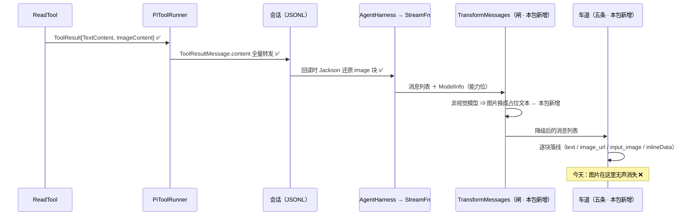

# 44 - 包H2：图片内容（三条车道收发 ＋ toolResult 路径 ＋ 非视觉降级闸）

> **来源**：`docs/41 §1.2`（**`ImageContent` 收发**，权重 2，台账 **B17**）·
> `docs/41 §1.1`（`transformMessages` 其余 4/5 条变换，权重 3，台账 **B14** —— 本包只取其中的**图片降级**那一条）。
> `docs/41 §7.2` 的 **H2** 行；ai 批次第二包（A0 之后）。
> **状态**：**设计待审核**（未写一行生产代码；`AnthropicMessagesApi.java:526-529` 的注释早就写明「行为变更须先过设计」）。
> **基准**：pi @ `3390bd936`（已核 `git rev-parse HEAD`）· pi-java @ `1da2221`
> **证据**：所有 `file:line` 均已实读 —— pi 侧一律 `git show 3390bd936:<path>`（**不读工作树**），
> SDK 侧一律 `javap` 实测。pi 侧路径相对 `D:\workplaceForai\pi`，java 侧相对 `D:\workplaceForai\pi-java`。

---

## 1. 这一包解决什么

**一句话**：`read` 工具读一张图，**模型完全看不到图** —— 不报错、内容为空。

链路已逐段查清，**缺口只在一处**（这是本包最重要的取证结论 —— 修错了段就是白干）：

| 段 | 位置 | 现状 |
|---|---|---|
| 产出 | `ReadTool.java:79-89` | ✅ 返回 `[TextContent("Read image file [image/png]"), ImageContent(mime, b64)]` |
| 结果载体 | `ToolResult.content`（`List<ContentBlock>`，`ToolResult.java:21`） | ✅ 原样带出 |
| 消息 | `PiToolRunner.java:198-207` `toOutcome`（pi `createToolResultMessage`） | ✅ content 全量转发 |
| 落盘／回读 | `MessageJsonCodec.java:169-172` ＋ Jackson（`@JsonSubTypes` 有 `image`/`image_url`） | ✅ 双向 |
| **出站（五条车道）** | 见 §3-D5 | ❌ **静默丢弃** |

**外加一个必须同包修的伴生问题**：pi 对**非视觉模型**会把图片**替换成占位文本**再出站
（`transform-messages.ts:35-57`），而 pi-java 的 `TransformMessages` 只落了 thinking 五分支
（`TransformMessages.java:21-24` 自陈）。**先加图片发送、不加这道闸** ⇒ 给非视觉模型发图片
＝ 从「静默丢图」换成「provider 400」，是**用一个硬故障换另一个硬故障**。故本包**必须**同时落这道闸。

**出站数据流（缺口在最后一跳）**：



---

## 2. 命题表

### 2.1 pi 侧（行为）

| # | 命题 | 证据 |
|---|---|---|
| P1 | `ImageContent` 只有两个字段：`data`（base64）＋ `mimeType`；**user 消息**与 **toolResult 消息**的 content 是 `(TextContent\|ImageContent)[]`；**assistant 消息的类型里根本没有图片** | `types.ts:380-384` · `:511` · `:544` |
| P2 | **降级闸在共享预通道里**，不在车道里：`transformMessages` 第一步就调 `downgradeUnsupportedImages`，且**先**跑（早于逐条变换与车道映射） | `transform-messages.ts:73-74` |
| P3 | 降级的判据是 `model.input.includes("image")` —— **整条消息列表原样返回**（不改对象） | `:35-38` |
| P4 | 占位符两条：user ＝ `"(image omitted: model does not support images)"`，toolResult ＝ `"(tool image omitted: model does not support images)"` | `:12-13` |
| P5 | 替换逻辑**带去重**：连续图片只出一个占位符；且**文本块内容恰好等于占位符**时，紧随其后的图片也**不**再补占位符（`previousWasPlaceholder = block.text === placeholder`） | `:15-33` |
| P6 | 降级只改 `content`，其余字段全带（`{...msg, content}`） | `:42-52` |
| P7 | **车道侧另有一道独立的能力门**（与 P2 冗余，pi 自己两处都写了）：completions 的 toolResult 图片、responses 的 toolResult 图片、google 的 toolResult 图片、mistral 的 `supportsImages` 形参 | `openai-completions.ts:1424` · `openai-responses-shared.ts:91` · `google-shared.ts:288` · `mistral-conversations.ts:517` |
| P8 | **user 图片在车道里无能力门**（Anthropic／completions／responses／google 四条都没有）—— 因为 P2 已经在前面替它们挡掉了 | 四条车道的 user 分支实读 |
| P9 | Anthropic 的 `convertContentBlocks`（toolResult **唯一**调用者）：无图片 ⇒ **把各文本块 `join("\n")` 成一个块**再净化；有图片 ⇒ 逐块映射（text 净化／image 走 `{type:"image",source:{type:"base64",media_type,data}}`）；**无文本块时 unshift 一个 `"(see attached image)"`** | `anthropic-messages.ts:128-174` · 调用点 `:1216` |
| P10 | Anthropic 的 **user** 分支与 P9 **不同**：逐块映射后**过滤掉 trim 为空的文本块**，过滤后为空则整条消息 `continue`；**没有** `"(see attached image)"` 补块 | `:1243-1269` |
| P11 | Anthropic 的 **assistant** 分支**忽略图片块**（`if text / else if thinking / else if toolCall`，无 else） | `:1307-1369` |
| P12 | completions 的 user 有图分支：`{type:"image_url", image_url:{url:"data:<mime>;base64,<data>"}}`；**不过滤空文本块**；仅当 `content.length === 0` 才跳过 | `:1255-1277` |
| P13 | completions 的 toolResult：文本块 join 后净化；`hasText ? text : hasImages ? "(see attached image)" : "(no tool output)"`；**连续的 toolResult 先合并收集图片**，再补一条**合成的 user 消息** `"Attached image(s) from tool result:"` ＋ 图片块 | `:1396-1459` |
| P14 | completions 的合成 user 消息前，若 `compat.requiresAssistantAfterToolResult` 还会插一条 assistant（**java 无此旗标**，见 §3-D6） | `:1441-1446` |
| P15 | Mistral 的 user 有图分支：过滤 `text \|\| supportsImages`；若过滤后为空**且**原本有图**且**不支持图 ⇒ 落一条**字符串**消息 `"(image omitted: model does not support images)"` | `:792-815` |
| P16 | Mistral 的 toolResult 走 `buildToolResultText`：错误前缀 `"[tool error] "`；文本非空时尾部追加 `"\n[tool image omitted: model does not support images]"`（仅当有图且不支持）；无文本时四选一（`(see attached image)` ／ `(image omitted: …)` ／ `[tool error] (no tool output)` ／ `(no tool output)`）；图片块按 `supportsImages` 追加 | `:851-897` |
| P17 | Mistral 的线格键名 `imageUrl` 在序列化时映射成 `image_url`（`["imageUrl","image_url"]`） | `:416` |
| P18 | Responses 的 `convertToolResultOutput`：无图片**或**模型不支持 ⇒ 返回**字符串**（`hasText ? text : images>0 ? "(see attached image)" : "(no tool output)"`）；否则返回**块数组** `[{input_text?, input_image(detail:"auto")…}]` | `openai-responses-shared.ts:78-110` |
| P19 | Google 的 toolResult：能力门过滤图片；`hasText ? text : hasImages ? "(see attached image)" : ""`；**Gemini 3+ 把图片嵌进 `functionResponse.parts`**，Gemini <3 另起一条 user 消息 `"Tool result image:"` ＋ 图片；连续的 functionResponse **合并进同一条 user 回合** | `google-shared.ts:280-340` |
| P20 | Google 的两个模型谓词：`requiresToolCallId(id)` ＝ `claude-*` ∨ `gpt-oss-*` ∨ gemini≥3；`supportsMultimodalFunctionResponse(id)` ＝ gemini 主版本 ≥3，**非 gemini 恒 true** | `:165-186` |
| P21 | github-copilot 有一条**独立的**「有没有图片」探测（`hasCopilotVisionInput`）用于动态请求头 | `github-copilot-headers.ts:11-21`；**java 无 copilot 车道**（R5 长尾）⇒ 不在本包 |
| P22 | Anthropic 的 `cache_control` 落点把 `image` 也列进「可挂的末块类型」 | `anthropic-messages.ts:1408`；**java 的 cache_control 整块未移植**（`docs/41 §1.1` 权重 3 行）⇒ 不在本包 |

### 2.2 pi-java 侧（现状）

| # | 事实 | 证据 |
|---|---|---|
| J1 | `ContentBlock.ImageContent(mediaType, data)` 已存在，字段顺序与 pi **相反**（java 是 `mediaType` 在前）；`UrlImageContent(url)` 是 **java 扩展**（P6-19，pi 无对应物） | `ContentBlock.java:73` · `:84` |
| J2 | 三条车道的 user 分支都用 `extractText` 把 content **拍平成纯文本**：completions `:429-432` · mistral `:305-309` · （responses `:147-152` 是「无图才拍平」） | 实读 |
| J3 | 三条车道的 toolResult 同理：completions `:436-441` · mistral `:320-323` · responses `:121-133`（`Output.ofString`） | 实读 |
| J4 | Anthropic 的 `toBlockParams` 是 **user 与 assistant 共用**的一处循环，只认 Text/Thinking/ToolUse；图片落进注释里的「静默丢弃」 | `AnthropicMessagesApi.java:495-529`（丢弃点 `:526-529`） |
| J5 | Anthropic 的 toolResult 走 `toTextBlocks`：**只收 TextContent**，且**一块一文本块**（pi 是 join 成一块，见 P9） | `:586-611` |
| J6 | Google 的 user 图片**已经通了**（`Part.fromBytes`），`UrlImageContent` 走 `fileData`；**toolResult 只取文本**，图片与 `(see attached image)` 都没有，也没有 P19 的 Gemini<3 分支与回合合并 | `GoogleGenerativeAiApi.java:316-380`（toolResult `:356-365`） |
| J7 | Responses 的 user 图片**已经通了**（`toUserItem:147-177`，含 `input_image` ＋ `detail:"auto"`）；**toolResult 只发字符串** | `ResponsesMessageConverter.java:147-177` · `:121-133` |
| J8 | `TransformMessages.apply(messages, target, apiName)` 只做 thinking 五分支；**签名里没有 `ModelInfo`** ⇒ 现在拿不到能力位 | `TransformMessages.java:43-55` · `:21-24` 自陈图片降级属 B14 |
| J9 | 能力位的现成载体是 `ModelCapability.IMAGE_INPUT`；目录模型与 `models.json` 模型都按 `input` 是否含 `"image"` 置位 | `BuiltinCatalog.java:178-194` · `ModelsJsonConfig.java:197-199` |
| J10 | ⚠️ **目录查不到时会退化成 `ModelInfo.minimal`（capabilities 为空）**，而 `minimal` 的 javadoc **逐字**要求「未知」与「不支持」必须分开，否则会毁掉目录未命中模型的请求 | `DefaultProviders.java:124-126` · `ModelInfo.java:117-131` |
| J11 | `Message.UserMessage` 的 `content` 由 `List.copyOf` 保证非 null ⇒ pi 的 `:73` 归一（`content == null ? [] : msg`）在 java **结构上不需要** | `Message.java:22-27` |
| J12 | 夹具现成：`RecordingHttpServer`（package A0 抽出，录**请求体 ＋ 小写化请求头**）· `LaneTransformMessagesWiringTest` 已有「按车道捕获请求体」的形状 | `ai/src/test/.../RecordingHttpServer.java` |
| J13 | SDK 面**齐备**（`javap` 实测）：anthropic `ContentBlockParam.ofImage` / `ImageBlockParam.Builder.source(Base64ImageSource\|UrlImageSource)` / `ToolResultBlockParam.Content.Block.ofImage` / `Base64ImageSource.MediaType.of(String)`；openai `ChatCompletionContentPart.ofImageUrl` / `ChatCompletionUserMessageParam.Content.ofArrayOfContentParts` / `ChatCompletionMessageParam.ofUser` / `ResponseInputItem.FunctionCallOutput.Output.ofResponseFunctionCallOutputItemList` / `ResponseFunctionCallOutputItem.ofInputImage\|ofInputText` | javap |
| J14 | ⚠️ `PathUtils.detectImageMimeType:48-59` 会返回 **`image/bmp`**，而 pi 的 Anthropic `media_type` 联合类型**不含 bmp**（只有 jpeg/png/gif/webp）。pi 那边是 TS 的 `as` 断言（**运行时不校验**）⇒ 照缝；但 java 的 SDK 是**有类型的**，`MediaType.of("image/bmp")` 会不会在 `build()` 抛，须**实测**（§4 步3 的探针） | `PathUtils.java:53` · `anthropic-messages.ts:136` |

---

## 3. 设计决策

### D1 —— 降级闸落在 `TransformMessages`，**不在车道里**（已定）

pi 的闸在共享预通道（P2），且 `apply` 的调用点五条车道**都已经有了**（`grep TransformMessages.apply` 命中 5 处）。
放在这一层的理由：① 照 pi 的位置（P2/P8）——车道里再写一道就变成**两处规则**；
② 车道侧仍有 pi 自己写的那几道门（P7）**照抄**，两处**都留着**，因为 pi 两处都留着（那是它的冗余，不是我们的）。

**`apply` 签名加第四个参数 `ModelInfo targetModel`**（J8 的缺口）。`null` ⇒ 按「未知」处理（见 D2）。

### D2 —— 能力位读取：`ModelInfo.supportsImageInput()`，**「未知」按「支持」处理**（推荐，待裁决 ①）

```java
/** pi {@code model.input.includes("image")}；⚠️ capabilities 为空 ⇒ 未知 ⇒ 返回 true（见下）。 */
public boolean supportsImageInput() {
    return capabilities.isEmpty() || capabilities.contains(ModelCapability.IMAGE_INPUT);
}
```

⚠️ **这是本包唯一一处刻意的行为偏离，方向是「宁可响亮地失败，不可安静地丢内容」**：

| 情形 | pi | 本设计 |
|---|---|---|
| 目录/models.json 声明了 `input`（含或不含 image） | 按声明 | **相同**（J9 已保证 capabilities 与 `input` 一一对应） |
| 目录未命中（J10） | **不存在这个状态** —— pi 的 `getModel` 直接抛，请求根本发不出去 | 未知 ⇒ **不降级、照发** ⇒ 真不支持则 provider **报错**（响亮） |

`ModelInfo.minimal` 的 javadoc（J10）**逐字**要求这个区分，本包只是把它兑现。
反方向（未知按不支持）会把「静默丢图」这个正在修的 bug **在目录未命中时原样重演**，不可接受。

### D3 —— 逐车道字段级照抄，**三处不对称必须保留**（已定）

| 不对称 | 一处 | 另一处 | 处置 |
|---|---|---|---|
| 文本块**过滤空块** | Anthropic user（P10，过滤） | Anthropic toolResult（P9）／completions user（P12）／mistral user（P15）**都不过滤** | **逐处照抄** |
| 占位符**补块** | Anthropic toolResult（P9，补 `"(see attached image)"`） | Anthropic user（P10，不补） | **逐处照抄** |
| 文本块**合并** | Anthropic toolResult（P9，join 成一块） | 其余各车道的既有做法 | **照抄** ⇒ 见下面的「顺带」 |

> ⚠️ **顺带的行为变更（须知情）**：`toTextBlocks`（J5）今天**一块一文本块**，pi 是 **join 成一块**
> （P9）。本包用 `convertContentBlocks` 整体替换它 ⇒ 工具结果里**多个文本块会被合并成一个**。
> 真实工具（Read/Bash/Grep…）都只产一个文本块，故线上不可观察；但**这是一处行为变更**，单列一个用例钉住。

### D4 —— `UrlImageContent`（java 扩展）在新车道里的处置（推荐，待裁决 ②）

pi **没有**这个类型（J1）⇒ 无 pi 行为可照抄，规则由 java 自己定。现状是 responses／google 已经映射，
Anthropic／completions／mistral 静默丢弃。三个选项：

| 选项 | 说明 |
|---|---|
| **A（推荐）** | completions／mistral 按**线格本名**下发（`image_url: {url}` ／ `image_url: url`），Anthropic 仍丢弃（`ImageContent.java` 的 javadoc 自陈「不支持 URL 图片，需先下载转 base64」，不在本包） |
| B | 全部保持丢弃（最小改动），只登记 |
| C | Anthropic 也发 —— SDK **有** `ImageBlockParam.Builder.source(UrlImageSource)`（J13），但 pi 的 TS 类型里没有这条，属**发明行为** |

⚠️ 选项 A 会让 `ImageContent.java:79-80` 的 javadoc「Anthropic 不支持 URL 图片」**变成不准确**
（那是 pi 的 TS 类型限制，不是 API 限制）—— 选 A 须同改那句注释。

### D5 —— 落点清单（本包 7 个落线点 ＋ 1 道闸）

| # | 车道 | 落点 | pi 参照 |
|---|---|---|---|
| 0 | 共享闸 | `TransformMessages`：`replaceImagesWithPlaceholder` ＋ `downgradeUnsupportedImages` | `transform-messages.ts:12-57` |
| 1 | Anthropic | user 分支图片（**仅 user**，assistant 照 P11 忽略） | `:1243-1269` |
| 2 | Anthropic | toolResult ⇒ `convertContentBlocks`（join ＋ 占位符 ＋ 图片块） | `:128-174` |
| 3 | completions | user 有图分支（content-part 数组） | `:1255-1277` |
| 4 | completions | toolResult：连续合并 ＋ `(see attached image)` ＋ 合成 user 消息 | `:1396-1459` |
| 5 | Mistral | user 有图分支 ＋ 不支持时的字符串占位消息 | `:792-815` |
| 6 | Mistral | toolResult ⇒ `buildToolResultText` ＋ 图片块（**整块照抄**，见待裁决 ③） | `:851-897` |
| 7 | Responses | toolResult ⇒ `convertToolResultOutput`（字符串／块数组二选一） | `openai-responses-shared.ts:78-110` |
| 8 | Google | toolResult ⇒ 能力门 ＋ `(see attached image)` ＋ Gemini 3+ 内嵌 / <3 另起回合 ＋ 回合合并 | `google-shared.ts:280-340` |

> ⚠️ 落点 1 的**形状问题**：`toBlockParams` 是 user 与 assistant **共用**的（J4），而 pi 的 assistant
> 分支**忽略**图片（P11）。⇒ 给该方法加一个显式形参（`boolean allowImages`，调用点算
> `msg instanceof Message.UserMessage`），**不**在共用循环里读 `msg` 的类型 —— 后者会让「哪条分支允许图片」
> 变成隐式知识。

### D6 —— **不做**（登记，不在本包）

| 不做的事 | 理由 |
|---|---|
| `compat.requiresToolResultName` / `requiresAssistantAfterToolResult` 两旗标（P14） | java 的 `ModelCompat` 是**逐旗标按消费者移植**的（`ModelCompat.java:6-11` 明文），而这两个旗标**无 `models.json` 解析面** ⇒ 加进来恒为 `false` ＝ 死码。另：`requiresAssistantAfterToolResult` 还会改**非图片**的 user 分支（`openai-completions.ts:1233`），超出本包 |
| github-copilot 的 vision 探测（P21） | java 无 copilot 车道（R5 长尾） |
| Anthropic `cache_control` 的 `image` 分支（P22） | cache_control 整块未移植，是 `docs/41 §1.1` 的独立权重 3 行 |
| `read.ts` 侧的 `processImage`（2000×2000 自动缩放）与「非视觉模型」文本注记 | 在 `coding-agent`／`agent-core`，不属 `ai` 模块 ⇒ 见待裁决 ④ |
| B14 的另外三条变换（`thoughtSignature` 剥离 ／ toolCall id 归一 ／ 孤儿 toolCall 合成） | 本包只取**图片降级**那一条；其余三条留在 B14 |

### D7 —— 关键签名（完整 Java，供审核）

```java
// ── 能力位（catalog/ModelInfo.java，新增）────────────────────────────
public boolean supportsImageInput();          // = capabilities.isEmpty() || contains(IMAGE_INPUT)

// ── 闸（api/TransformMessages.java）─────────────────────────────────
// 第三参数之后新增 ModelInfo；null ⇒ 按「未知」处理（D2）
public static List<Message> apply(List<Message> messages, ModelId<?> target,
                                  String apiName, ModelInfo targetModel);

// pi transform-messages.ts:35-57 —— 非视觉模型才替换；视觉模型返回原列表
private static List<Message> downgradeUnsupportedImages(List<Message> messages, ModelInfo model);

// pi :15-33 —— 连续图片只出一个占位符；文本块恰等于占位符时其后图片不再补
private static List<ContentBlock> replaceImagesWithPlaceholder(List<ContentBlock> content,
                                                              String placeholder);

// ── Anthropic（protocol/AnthropicMessagesApi.java）──────────────────
// 新增第三形参：调用点算 msg instanceof Message.UserMessage（D5 的形状说明）
private List<ContentBlockParam> toBlockParams(Message msg, boolean allowEmptySignature,
                                              boolean allowImages);
// pi :128-174 —— 整体替换 toTextBlocks（含 join 与占位符补块）
private static List<ToolResultBlockParam.Content.Block> convertContentBlocks(
        List<ContentBlock> blocks);

// ── OpenAI-completions（protocol/OpenAICompletionsApi.java）─────────
// 循环改下标式（pi :1398-1455 的连续 toolResult 合并需要 lookahead）
private static List<ChatCompletionContentPart> toUserContentParts(List<ContentBlock> content);

// ── Mistral（protocol/MistralConversationsApi.java）─────────────────
private List<Map<String, Object>> toMistralMessages(StreamRequest request);   // 读 request.model()
// pi :877-897 —— 整块照抄（待裁决 ③）
private static String buildToolResultText(String text, boolean hasImages,
                                          boolean supportsImages, boolean isError);

// ── OpenAI-responses（protocol/ResponsesMessageConverter.java）──────
// pi :78-110 —— 无图/不支持 ⇒ ofString；否则 ofResponseFunctionCallOutputItemList
private static ResponseInputItem.FunctionCallOutput.Output convertToolResultOutput(
        ModelInfo model, List<ContentBlock> content);

// ── Google（protocol/GoogleGenerativeAiApi.java）────────────────────
// pi google-shared.ts:165-186
private static boolean requiresToolCallId(String modelId);
private static boolean supportsMultimodalFunctionResponse(String modelId);
private static Optional<Integer> geminiMajorVersion(String modelId);
```

---

## 4. 实施步骤（每步：先红 → 实现 → 变异探针 → 回归 → 一个提交）

> **夹具纪律**（`docs/41 §7.3` 两条教训）：每一步先问「**这个夹具在什么情况下会红**」，
> 答不上来就是没牙；断言「某 SDK 的默认行为」前**先把实测值打出来**（A0 的教训，`docs/43 §9-6`）。

| 步 | 内容 | 先红（夹具的预期红） | 变异探针（注入后必须红） |
|---|---|---|---|
| **1** | `ModelInfo.supportsImageInput()` ＋ `TransformMessages` 降级闸（`apply` 加 `ModelInfo` 形参，五条车道传参） | 方法不存在（编译红）；降级用例：非视觉模型下 `[text,image,image,text]` 应变成 `[text,占位符,text]` —— 现状原样返回 | ① 把 `capabilities.isEmpty() \|\|` 删掉 ⇒ `minimal` 用例必须红；② 把 `previousWasPlaceholder` 去重删掉 ⇒ 「连续两图只出一个占位符」必须红；③ 把 toolResult 占位符换成 user 占位符 ⇒ 两侧文案用例必须红 |
| **2** | Anthropic：user 图片（仅 user）＋ `convertContentBlocks` 替换 `toTextBlocks` | 请求体无 `"type":"image"`；toolResult 多文本块未合并 | ① 去掉 user 分支的 `allowImages` 门 ⇒ assistant 带图用例必须红；② 去掉 `"(see attached image)"` 补块 ⇒ 无文本工具结果用例必须红 |
| **3** | completions：user 有图分支 ＋ toolResult 图片 ＋ 合成 user 消息 | 请求体无 `image_url`；无 `"Attached image(s) from tool result:"` | ① 去掉能力门 ⇒ 非视觉模型用例必须红；② 去掉连续合并（每条工具结果各发一条合成消息）⇒ 两条连续结果只出一条 user 消息的用例必须红 |
| **4** | Mistral：user 有图分支 ＋ `buildToolResultText` 整块 | 请求体无 `image_url`；无 `[tool error] ` 前缀 | ① 去掉 `supportsImages` 过滤 ⇒ 非视觉用例必须红；② 去掉尾部 `\n[tool image omitted: …]` ⇒ 文本非空＋有图＋不支持的用例必须红 |
| **5** | Responses：toolResult ⇒ `convertToolResultOutput` | toolResult 仍是 `"output":"…"` 字符串形态 | 把块数组分支的 `detail:"auto"` 删掉 ⇒ 线格字段用例必须红 |
| **6** | Google：toolResult 能力门 ＋ Gemini 3+/<3 两分支 ＋ 回合合并 | 请求体 `functionResponse` 内无 `parts`；Gemini<3 无 `"Tool result image:"` 回合 | 把 `supportsMultimodalFunctionResponse` 恒真 ⇒ Gemini<3 用例必须红 |
| **7** | 台账：`docs/41` 划行 ＋ `docs/32` B17 结案（＋ B14 注明「图片切片已落」）＋ 本文件 §8/§9/§10 | — | — |

**跨车道差分（步 3–6 各加一条）**：同一份消息列表过五条车道，**占位符文案必须逐字相同**
（`"(see attached image)"` 在四条车道里都出现；`"(image omitted: model does not support images)"` 在
mistral 的 user 路径与共享闸里都出现）—— 这条差分是**唯一**能同时钉住「照抄」与「别自己发明文案」的夹具。

**风险探针（步 2 内）**：`image/bmp`（J14）过 Anthropic 车道，断言 ① 不抛 ② 线上 `media_type` 是 `image/bmp`
—— 若 SDK 在 `build()` 上抛，则须在落线前把非四类 mime 归一（**照 pi 是照不出来的**，pi 是 `as` 断言）。

---

## 5. 验收

| # | 标准 | 判据 |
|---|---|---|
| A1 | 五条车道：user 图片 ＋ toolResult 图片都**上线** | 各车道一条「录请求体」用例（`RecordingHttpServer`），断言 `image`／`image_url`／`input_image`／`inlineData` 出现且 base64 值逐字相同 |
| A2 | 非视觉模型：图片**不出站**，占位符**出站** | 五条车道 × 能力门＝关闭 ⇒ 断言占位符文案 ＋ 断言**无** base64 片段 |
| A3 | 目录未命中（`minimal`）：图片**照发** | 一条用例钉 D2 的偏离（这是**有意的**，必须有用例说明意图） |
| A4 | 三处不对称（D3）逐处有用例 | ① 空文本块在 Anthropic user 被丢、在 toolResult 不被丢；② 占位符补块只在 toolResult；③ 工具结果多文本块合并成一个 |
| A5 | 回归 | `pi-java-ai` 用例数 ≥ 579 ＋ 新增；`telemetry`／`agent-core`／`coding-agent` 不降；L5 剧本 15/15 |
| A6 | 零残留 | 触碰过的 main 源零 `System.out`；checkstyle 0 违规；文件 ≤ 500 行 |

---

## 6. 遗留登记（本包预计产出）

1. **B14 收窄**：图片降级落地后，B14 只剩三条变换（`thoughtSignature` ／ id 归一 ／ 孤儿合成）⇒ 更新行文。
2. **B17 结案**：本包主体。
3. **新登记候选**：
   - `read.ts` 的 `processImage`（自动缩放到 2000×2000）在 java **零对应物** ⇒ 大图会**原样**送出去（token 与请求体大小风险）。
   - `read.ts:57-62` 的「非视觉模型」文本注记（`"[Current model does not support images. The image will be omitted from this request.]"`）在 java **零对应物**。
   - Mistral 的 `concat` 拼接（`extractSanitizedText`）vs pi 的 `join("\n")` —— 既有偏差，本包不动。
   - Responses 的 `toUserItem` **过滤空文本块**而 pi 不过滤（`ResponsesMessageConverter.java:160`）—— 既有偏差，本包不动。
   - `ModelCompat` 缺 `requiresToolResultName`／`requiresAssistantAfterToolResult`（D6）。

---

## 7. 待裁决（四点，请审核时给结论）

| # | 问题 | 我的建议 |
|---|---|---|
| ① | **能力位「未知」的处置**（D2）：`capabilities` 为空（目录未命中）时按**支持**（照发，可能 400）还是按**不支持**（降级，静默丢图）？ | **按支持** —— 响亮优于静默；且 `ModelInfo.minimal` 的 javadoc 已明文要求这个区分 |
| ② | **`UrlImageContent` 在新车道里下发还是继续丢弃**（D4）？ | **选项 A**：completions／mistral 按 `image_url` 下发（线格本名），Anthropic 仍丢弃 |
| ③ | **Mistral 工具结果分支整块照抄**（P16）会顺带带来 `name` 字段与 `[tool error] ` 前缀（今天都没有）—— 接受，还是只取图片那一半？ | **接受整块** —— pi 那是一个函数（`buildToolResultText`），拆一半等于自己发明第三种文案 |
| ④ | **`read.ts` 侧的两条**（自动缩放 ＋ 非视觉注记）登记还是并入本包？ | **登记** —— 本包是 `ai` 模块；那两条在 `agent-core`／`coding-agent`，并进来会让包跨三个模块 |

---

## 8. 不在本包范围

- **图片生成**（`ImageApi` ／ `OpenRouterImagesApi` ／ `ImagesModel` 注册表）—— 已有实现，本包不碰。
- **TUI 渲染图片**（`R14` Kitty/iTerm2 协议）／ **图片粘贴**（`K14`）—— `docs/41 §3.3` 的 tui 长尾。
- **`ImageContent.java` 的字段顺序**（java `mediaType,data` vs pi `data,mimeType`，J1）—— 纯形状，无行为后果，不动。
- **`DiffContent` 的丢弃**（各车道一致，且 `ContentBlock.java:116-119` 已说明是显示专用）。
- **Anthropic 的 URL 图片**（D4 选项 C）。
