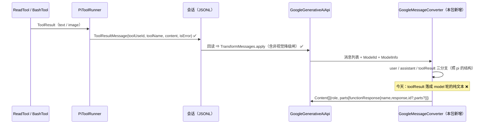

# 45 - 包B84：Google 车道的工具结果路径（`functionResponse` 整块移植）

> **来源**：`docs/32` **B84** 行（由包 H2 步 6 实测证伪后拆出，用户 2026-09-22 裁决「另立一包」）·
> `docs/44 §10-1`（实测证据）· `docs/41 §7.2`（ai 批次）。
> **状态**：**已实施**（2026-09-23 用户裁决「按照建议实施」，§9 五点全采纳；六步提交见 §9）。
> **基准**：pi @ `3390bd936` · pi-java @ `efedec4`（设计）／`4890057`（步5）
> **证据纪律**：pi 侧一律 `git show 3390bd936:<path>`（**不读工作树**）；SDK 侧一律 `javap`／探针实测。
> pi 路径相对 `D:\workplaceForai\pi`，java 路径相对 `D:\workplaceForai\pi-java`。
> **证据分级**：本文所有断言分三级 —— ①**实读**（贴 `file:line`）②**实测**（贴跑出来的值）
> ③**推断**（明写「未验证」）。凡带 ⚠️ 的都是「与直觉相反」的那一条。

---

## 1. 这一包解决什么

**一句话**：**Gemini 的多轮工具调用今天是坏的** —— 工具结果被当成一条 **model 轮**的纯文本发出去，
模型看不到「这条结果对应哪次调用」。

实测证据（包 H2 步 6，临时夹具把真请求体打出来；本次设计复核了代码路径，与之一致）：

| | 发出去的线格 |
|---|---|
| **pi-java 今天** | `{"role":"model","parts":[{"text":"file-a.txt"}]}` |
| **pi** | `{"role":"user","parts":[{"functionResponse":{"name":"ls","response":{"output":"file-a.txt"}}}]}` |

三处连带（均实读）：

1. **`toGoogleContents` 的 role 判据是「不是 user 就是 model」**（`GoogleGenerativeAiApi.java:320`
   `msg instanceof Message.UserMessage ? "user" : "model"`）⇒ 工具结果落进 model 轮。
2. **`toGoogleParts` 里那个 `ContentBlock.ToolResultContent` 分支实际不可达**（`:356-365`）——
   上面那条 role 判据把消息送去 model 轮，而**遍历的是 `msg.content()` 的原始块**
   （`TextContent`／`ImageContent`），`ToolResultContent` 是**块级**类型，不是消息级
   （见 §2.2 J3）⇒ 那个分支在**消息**路径上永远不命中。
3. **真要走它，两处都是错的**：`Part.fromFunctionResponse(tc.toolUseId(), …)` 的**第一个形参是
   `name`**（`javap` 实测）⇒ 发出去的 name 是**工具 id**；`response` 的键 java 写 `"content"`，
   pi 写 `"output"`／`"error"`（`google-shared.ts:314`）。

**外加三处「pi 有、java 没有」**（同一个函数里，实读）：连续 `functionResponse` **合并进同一 user 回合**
（`:320-330`）· Gemini <3 有图时**另起一条 user 回合** `"Tool result image:"`（`:332-338`）·
`id` 只在 `requiresToolCallId(modelId)` 时才写（`:310`／`:316`）。

**数据流（缺口在出站那一跳）**：



---

## 2. 命题表

### 2.1 pi 侧（行为）

| # | 命题 | 证据 |
|---|---|---|
| P1 | `convertMessages` **先按消息角色分三支**（user／assistant／toolResult），再各自映射块 | `google-shared.ts:191-343` |
| P2 | 工具结果的线格是 `Part{functionResponse:{name, response, parts?, id?}}`，**塞进一条 `role:"user"` 的 Content** | `:311-330` |
| P3 | `name` 取 **`msg.toolName`**（工具**名**，不是 id） | `:313` |
| P4 | `response` 的键按 `isError` 二选一：`{error: v}` ／ `{output: v}` | `:314` |
| P5 | `v`（`responseValue`）三选一：**有文本** ⇒ 净化后的文本（多文本块 `join("\n")`）；**无文本但有图** ⇒ `"(see attached image)"`；**两者都无** ⇒ `""` | `:286-287` · `:301` |
| P6 | 图片按**车道侧能力门**过滤：`model.input.includes("image")` 为假 ⇒ 图片整段消失（连 `hasImages` 都为假） | `:288-290` |
| P7 | `parts`（内嵌图片）**只在** `hasImages && supportsMultimodalFunctionResponse(model.id)` 时写；键**不写**时线上没有该键 | `:303-308` · `:315` |
| P8 | `id` **只在** `requiresToolCallId(model.id)` 时写 | `:310` · `:316` |
| P9 | **合并规则**：若 `contents` 的**最后一条**是 `role:"user"` **且**其 parts 里有 `functionResponse`，就把本条的 functionResponse **push 进去**；否则**新起一条** user Content | `:320-330` |
| P10 | **Gemini <3（或非多模态）且有图**：合并之后**再**push 一条 `{role:"user", parts:[{text:"Tool result image:"}, …图片]}`（那句文案**不净化**，是字面量） | `:332-338` |
| P11 | 因此 P9 的「最后一条」判据会被 P10 的图片回合**打断** ⇒ 下一条工具结果**新起**一回合（pi 自己的测试钉着这个形状：`contents[2]` 是合并后的 3 个 functionResponse、`contents[3]` 是图片回合、`contents[4]` 是**新起**的第三个 functionResponse） | `test/google-shared-image-tool-result-routing.test.ts:80-89` |
| P12 | `requiresToolCallId(id)` ＝ `id.startsWith("claude-")` ∨ `id.startsWith("gpt-oss-")` ∨ gemini 主版本 ≥ 3 | `:165-172` |
| P13 | `getGeminiMajorVersion` 的正则是 `/^gemini(?:-live)?-(\d+)/`（**大小写不敏感**、`gemini-live-2.5-*` 也认） | `:174-178` |
| P14 | `supportsMultimodalFunctionResponse(id)` ＝ gemini 主版本 ≥ 3；**非 gemini 恒 true**（含 `claude-*`／`gpt-oss-*`） | `:180-186` |
| P15 | ⚠️ **pi 的转换里没有「把 toolUseId 传给 name」这回事** —— name 与 id 是两个独立字段，各自有各自的来源 | `:313` · `:316` |
| P16 | `assistant` 分支：**空白文本块（`trim()===""`）跳过**，除非它带 `textSignature` | `:240` |
| P17 | ⚠️ pi 的流式侧**会**造出 `text:""` 的块（`part.text !== undefined` 就建块，含空串）⇒ P16 在真链路上**可达**，不是理论 | `google-generative-ai.ts:113` · `:141-144` |
| P18 | `assistant` 分支：`functionCall.id` 同样受 `requiresToolCallId` 门控 | `:271` |
| P19 | ⚠️ `functionResponse.parts` 在 **TS SDK** 里可写，且 Google REST 接受它（pi 的生产代码就这么发） | `:315` |

### 2.2 pi-java 侧（现状）

| # | 事实 | 证据 |
|---|---|---|
| J1 | `toGoogleContents` 只有两个角色：`msg instanceof Message.UserMessage ? "user" : "model"` ⇒ 工具结果与助手消息**同一条路径** | `GoogleGenerativeAiApi.java:317-333`（判据 `:320`） |
| J2 | 块映射是**一个 switch 管两个角色**（`toGoogleParts`），`TextContent` 分支 user／assistant 共用 | `:335-378`（文本 `:339-340`） |
| J3 | `ContentBlock.ToolResultContent(toolUseId, toolName, content, isError)` 是**块级**类型，字段齐备；生产上**只有 codec 会造**（`MessageJsonCodec:178` 解码 ＋ `SessionJson:168` 编码），**没有任何生产路径**把它放进某条消息的 content ⇒ 它是**解码专用**的死类型 | `ContentBlock.java:108` · 全仓 `new ContentBlock.ToolResultContent` 零命中 |
| J4 | `Message.ToolResultMessage` 字段齐备：`toolUseId` / `toolName` / `content` / `isError` | `Message.java:200-203` |
| J5 | 车道的消息入口是 `TransformMessages.apply(request.messages(), request.modelId(), apiName(), request.model())` —— **`ModelId` 与 `ModelInfo` 都已到手** | `GoogleGenerativeAiApi.java:113-114` |
| J6 | 图片落线**已有**两处现成实现：`ImageContent` ⇒ `Part.fromBytes(Base64.decode(data), mediaType)`；`UrlImageContent` ⇒ `fileData`（java 扩展） | `:366-376` |
| J7 | `ModelInfo.supportsImageInput()` ＝ `capabilities.isEmpty() \|\| capabilities.contains(IMAGE_INPUT)` —— **「未知」按「支持」**（包 H2 D2 裁决） | `ModelInfo.java:134-136` |
| J8 | ⚠️ **`google-genai 1.15.0` 的 `FunctionResponse` 没有 `parts` 字段**（`javap` 实测：只有 `willContinue`/`scheduling`/`id`/`name`/`response`），且 `Part.fromJson(...)` 会**静默丢掉**未知键（实测：`{"functionResponse":{"…","parts":[…]}}` 往返后 `parts` 消失）⇒ **P7 在 1.15.0 上写不出来** | javap ＋ 探针（§3-D5） |
| J9 | 车道文件 **407 行**；本包预计净增 ~120 行 ⇒ 会破 500 行上限 | `wc -l` |
| J10 | 内置 Google 目录只有 `gemini-2.5-pro` / `gemini-2.5-flash`（两者 `requiresToolCallId`＝false、`supportsMultimodalFunctionResponse`＝false）⇒ **gemini 3+ 只能经 `models.json` 进来** | `BuiltinCatalog.java:74-81` |
| J11 | `googleCaps()` 含 `IMAGE_INPUT` ⇒ 内置两个模型的图片路径是「支持」 | `BuiltinCatalog.java:191-195` |
| J12 | 夹具现成：`RecordingHttpServer`（录**真请求体** ＋ 小写化请求头）—— google 车道的请求体由 SDK 序列化，故这是**最强**的观察面 | `ai/src/test/.../RecordingHttpServer.java` |
| J13 | ⚠️ 车道侧**再写一道**能力门时，若用 `supportsImageInput()`，则与共享闸（同一个 `ModelInfo`、同一个判据）**恒同真同假** ⇒ 那道门**不可达**（包 H2 已在 completions／responses 两处实测过「去掉零红」） | `docs/44 §10-3` |
| J14 | ⚠️ 现有 `Base64.getDecoder()` 对**缺 padding 宽容**，但对**换行／URL-safe 字符抛** `IllegalArgumentException`（实测：`"QQ"`→ok、`"QQ==\n"`→抛、`"Q-Q="`→抛）；pi 是**原样透传** base64 串 | 探针（§6-3） |

---

## 3. 设计决策

### D1 —— 转换结构**按消息角色分三支**，照 pi（已定）

`toGoogleContents` 的 role 判据删掉，改成三分支：`UserMessage` ⇒ user 回合；`AssistantMessage` ⇒ model 回合；
`ToolResultMessage` ⇒ **`functionResponse` ＋ user 回合（含合并与独立图片回合）**。

理由：这不是「换个写法」，而是 pi 的**形状本身**（P1）——工具结果在 pi 里**不是块**，是消息级的东西；
java 那个块级分支（J3）就是照错形状写出来的产物。

### D2 —— 落点：拆出 `GoogleMessageConverter`（推荐，见 §7 ⑤）

车道 407 行（J9），本包净增 ~120 ⇒ 必然破 500。**步 2 先做纯搬移**（零行为改动，与包 H2 步 6 同一手法）：

| 搬走 | 行数 |
|---|---|
| `toGoogleContents` ＋ `toGoogleParts` ＋ `toGoogleFunctions` | ~75 |
| 新增：三分支 ＋ functionResponse ＋ 三个谓词 | ~120 |

结果：车道 ≈ 330 行，`GoogleMessageConverter` ≈ 200 行，两者都 ≤ 500。

### D3 —— `id` 门：`requiresToolCallId` **两侧都照抄**（推荐，见 §7 ②）

pi 两处都门控：`functionCall.id`（P18）与 `functionResponse.id`（P8）。java 今天**只有** functionCall
那一侧、且**门是开的**（`GoogleGenerativeAiApi.java:349-351` 无条件写 id）。

⚠️ 这一条**超出** B84 字面的「工具结果路径」（assistant 侧），但它是**同一个谓词的同一道门**：
只关门的一侧会造出一个 pi 里不存在的状态（functionCall 有 id、functionResponse 没有）。
今天的实际后果为零（工具结果路径整条是坏的），故一并做、并在提交信息里点明。

### D4 —— 车道侧能力门用 `supportsImageInput()`，**并如实登记它不可达**（推荐，见 §7 ③）

pi 在车道侧也有一道门（P6，与共享闸冗余 —— 这正是包 H2 已实测过的形态）。java 照抄，但**判据选哪个**是有后果的：

| 判据 | `capabilities` 为空（目录未命中）时 | 后果 |
|---|---|---|
| `capabilities().contains(IMAGE_INPUT)`（pi 的字面翻译） | **丢图** ⇒ `responseValue` 退回 `""` | **静默**丢数据 —— 与 H2 的 D2 裁决（未知按支持）**相反** |
| `supportsImageInput()`（H2 三处先例） | **留图** ⇒ 照发 | 真不支持时由 provider 报错（响亮） |

**选后者**：pi 没有「未知模型」这个状态（它的 `getModel` 查不到就抛），故这不是偏离 pi，而是 pi-java
独有状态下的方向选择；且与 H2 三处车道门**同一判据**。代价是：这道门与共享闸判据相同 ⇒ **恒不可达**
（J13）⇒ 变异探针**必然零红**。**这一条要写进代码注释**：不是夹具没牙，是这一行**没有出参**
（`docs/44 §10-3` 的同一句话）。

### D5 —— Gemini 3+ 的内嵌 `parts`：**bump `google-genai` 到 1.72.0**（推荐，见 §7 ①）

**这是本包最大的一个技术风险，已实测**：

| | 1.15.0（现锁） | 1.72.0（最新） |
|---|---|---|
| `FunctionResponse.parts()` | **不存在**（javap） | `Optional<List<FunctionResponsePart>>` |
| `FunctionResponsePart.inlineData()` | — | `Optional<FunctionResponseBlob>`（`fromBytes(byte[],String)` 可用） |
| `Part.fromJson(...)` 承载未知键 | **静默丢弃**（实测往返） | 不需要（有类型化 API） |
| 序列化 | 写不出来 | 实测 `{"functionResponse":{"parts":[{"inlineData":{…}}],"id":"call_a","name":"read","response":{"output":"alpha text"}}}`；**不写 parts 时该键不出现**（与 P7 一致） |

**升级可行性已实测**（不是推断）：把 `pi-java-bom/pom.xml:32` 改成 `1.72.0` 后
`mvn -pl pi-java-ai -am test` ⇒ **643/643 绿**；对车道用到的**全部** SDK 类型做 `javap` 逐签名 diff，
**只有新增、没有删除或改签名**（`Client`／`Client.Builder`／`Content`／`Content.Builder`／
`GenerateContentConfig(.Builder)`／`HttpOptions(.Builder)`／`FunctionDeclaration(.Builder)`／
`FunctionCall(.Builder)`／`Blob`／`FileData` 十个类）。pom 里的 OAuth 排除项仍然解析得通（构建成功）。

**残留（未验证）**：native-image 打包未跑（该路线此前已判「不现实」，见 memory）；新版本引入的
`com.google.genai.gaos.*` 等新包在 native 下的反射配置未核。

**若裁决不升**：gemini 3+ 与「非 gemini 经 Google」两条路径**只能降级**走独立 user 回合（P10 的形状），
即**明知偏离 pi**；且那条降级形状对 gemini 3+ 是否被接受**无证据**（不猜）。故不建议。

### D6 —— `toGoogleParts` 的 `ToolResultContent` 分支**置空**（推荐，见 §7 ⑤）

J3 已证明它是**解码专用**的死类型（生产零构造点）。B84 之后工具结果走**消息级**路径，块级分支更没用了。
`ContentBlock` 是 sealed ⇒ switch 必须穷尽 ⇒ 保留 case，**返回 `List.of()`**（与 `ThinkingContent`／
`DiffContent` 同形），注释写明「pi 无此类型；本 case 只可能来自手改的会话文件」。

⚠️ 与包 H2 的取舍一致：**不发明第三种形状**。

### D7 —— 空白助手文本块：**并入**（推荐，见 §7 ④）

pi 跳过空白文本块（P16），java 不跳（J2 的共用文本分支）。⚠️ 这一条**不是理论**：pi 自己的流式侧
会造出 `text:""` 的块（P17），java 的 google 车道**同样**（`GoogleGenerativeAiApi.java:187-194`
只判 `isPresent()`、不判空）⇒ 重放时 java 发 `{"text":""}`、pi 什么都不发。

**建议并入**（2 行）：它是**正在被重写的那个函数**里的分支，且与工具结果分支**并排**——
留着它等于在同一提交里明知故犯地偏离 pi。若裁决只登记，则进 §6。

### D8 —— 不做（登记，不在本包）

- **`thoughtSignature` 的收集与回传**（`isThinkingPart`／`retainThoughtSignature`／
  `resolveThoughtSignature`／同模型 thinking 回放／**带签名的空块保留**）——
  `docs/41:86` 已明裁**不在范围**（`ToolUseContent.thoughtSignature`／`TextContent.textSignature`
  一整族）。⚠️ 连带后果：P16 的「除非带签名」这半句在 java **恒为假**（没有签名字段），
  故 D7 的实现是「空白就跳」，**别照抄那个条件**（照抄会编译不过 —— 没有字段可读）。
- **`normalizeToolCallId`**（跨模型归一，`transform-messages.ts:136-142`）＝ **B14③**，
  与另外四条车道**同一个包**。⚠️ 交界处要写明：本包落地后，**跨模型**重放到 gemini 3+ 时
  `id` 仍是原值（可能带 `|` 或超 64 字符）而 pi 会归一 ⇒ 该缺口**仍在 B14③**，
  但**只对 gemini 3+／`claude-*`／`gpt-oss-*` 可达**（内置两个 gemini-2.5 上 `requiresToolCallId` 为假，
  归一是恒等变换）。
- **`withoutInitialSystemMessage` / `collapseSystemMessages`** —— java 的系统提示是请求上的独立字段
  （`GoogleGenerativeAiApi.java:293`），消息列表里**没有** system 角色（`Message.java:8-11` 明文）⇒ 面不存在。
- **Vertex 车道**（pi 的 `google-vertex.ts` 共用 `google-shared.ts`）—— java 无此车道（R5 长尾）。
- **`part.thought` 的接收侧**（java 已实现）与 **thinking level** —— 包 H1 已闭环。

### D9 —— 关键签名（完整 Java，供审核）

```java
/** google 车道的「消息 → 线格」转换（pi google-shared.ts:191-343）。 */
final class GoogleMessageConverter {

    private GoogleMessageConverter() {}

    /** pi :202 —— **先按角色分三支**，不再用「不是 user 就是 model」。 */
    static List<Content> toContents(List<Message> messages, ModelId<?> modelId, ModelInfo model) {
        var contents = new ArrayList<Content>();
        for (var msg : messages) {
            if (msg instanceof Message.UserMessage user) {
                var parts = new ArrayList<Part>();
                for (var block : user.content()) {
                    parts.addAll(blockParts(block));
                }
                if (parts.isEmpty()) {          // pi :222
                    continue;
                }
                contents.add(Content.builder().role("user").parts(parts).build());
            } else if (msg instanceof Message.AssistantMessage assistant) {
                var content = assistantContent(assistant, modelId);
                if (content != null) {          // pi :279
                    contents.add(content);
                }
            } else if (msg instanceof Message.ToolResultMessage tool) {
                addToolResult(contents, tool, modelId, model);
            }
        }
        return contents;
    }

    /** pi :228-283 —— 空白文本块跳过（D7）；`id` 受 P18 的门控（D3）。 */
    private static Content assistantContent(Message.AssistantMessage msg, ModelId<?> modelId) {
        var parts = new ArrayList<Part>();
        for (var block : msg.content()) {
            if (block instanceof ContentBlock.TextContent tc) {
                if (tc.text().isBlank()) {      // pi :240（「除非带签名」那半句在 java 恒假，见 D8）
                    continue;
                }
                parts.add(Part.fromText(SanitizeUnicode.surrogates(tc.text())));
            } else if (block instanceof ContentBlock.ToolUseContent tu) {
                var fc = FunctionCall.builder().name(tu.name()).args(tu.arguments());
                if (requiresToolCallId(modelId.modelName())) {   // pi :271
                    fc.id(tu.id());
                }
                parts.add(Part.builder().functionCall(fc.build()).build());
            }
        }
        return parts.isEmpty() ? null : Content.builder().role("model").parts(parts).build();
    }

    /** pi :284-339 —— 工具结果：`functionResponse` ＋ 合并 ＋（有图且非多模态时）独立图片回合。 */
    private static void addToolResult(List<Content> contents, Message.ToolResultMessage msg,
                                      ModelId<?> modelId, ModelInfo model) {
        var text = msg.content().stream()
                .filter(ContentBlock.TextContent.class::isInstance)
                .map(b -> ((ContentBlock.TextContent) b).text())
                .collect(Collectors.joining("\n"));                     // pi :287
        var images = model != null && model.supportsImageInput()         // pi :288（判据见 D4）
                ? msg.content().stream().filter(GoogleMessageConverter::isImageBlock).toList()
                : List.<ContentBlock>of();
        boolean hasText = !text.isEmpty();
        boolean hasImages = !images.isEmpty();
        boolean multimodal = supportsMultimodalFunctionResponse(modelId.modelName());  // pi :298
        // pi :301 —— 三选一；**净化的是拼好之后的整串**（A0 的 Google 落点之一）
        String responseValue = hasText ? SanitizeUnicode.surrogates(text)
                : hasImages ? "(see attached image)" : "";
        var imageParts = images.stream().map(GoogleMessageConverter::inlineDataPart).toList();

        var fnResponse = FunctionResponse.builder()
                .name(msg.toolName())                                   // pi :313（不是 toolUseId！）
                .response(msg.isError()                                 // pi :314
                        ? Map.of("error", responseValue)
                        : Map.of("output", responseValue));
        if (hasImages && multimodal) {                                  // pi :315
            fnResponse.parts(imageParts);
        }
        if (requiresToolCallId(modelId.modelName())) {                  // pi :316
            fnResponse.id(msg.toolUseId());
        }
        appendFunctionResponse(contents,
                Part.builder().functionResponse(fnResponse.build()).build());

        if (hasImages && !multimodal) {                                 // pi :332-338
            var parts = new ArrayList<Part>();
            parts.add(Part.fromText("Tool result image:"));             // 字面量，不净化
            parts.addAll(imageParts);
            contents.add(Content.builder().role("user").parts(parts).build());
        }
    }

    /** pi :320-330 —— 最后一条是「带 functionResponse 的 user 回合」就并入，否则新起一条。 */
    private static void appendFunctionResponse(List<Content> contents, Part fnResponse) {
        if (!contents.isEmpty()) {
            var last = contents.get(contents.size() - 1);
            boolean mergeable = "user".equals(last.role().orElse(null))
                    && last.parts().stream()
                        .flatMap(List::stream)
                        .anyMatch(p -> p.functionResponse().isPresent());
            if (mergeable) {
                var parts = new ArrayList<>(last.parts().orElse(List.of()));
                parts.add(fnResponse);
                contents.set(contents.size() - 1, last.toBuilder().parts(parts).build());
                return;
            }
        }
        contents.add(Content.builder().role("user").parts(List.of(fnResponse)).build());
    }

    /** pi :165-172。 */
    static boolean requiresToolCallId(String modelId) {
        var major = geminiMajorVersion(modelId);
        return modelId.startsWith("claude-") || modelId.startsWith("gpt-oss-")
                || (major != null && major >= 3);
    }

    /** pi :174-178 —— 正则 `/^gemini(?:-live)?-(\d+)/`，**先小写化**。 */
    private static Integer geminiMajorVersion(String modelId) {
        var m = GEMINI_VERSION.matcher(modelId.toLowerCase(Locale.ROOT));
        return m.find() ? Integer.parseInt(m.group(1)) : null;
    }

    /** pi :180-186 —— gemini ≥3；**非 gemini 恒 true**。 */
    static boolean supportsMultimodalFunctionResponse(String modelId) {
        var major = geminiMajorVersion(modelId);
        return major == null || major >= 3;
    }

    /** 块 → Part（原 `toGoogleParts`，逐行搬移 ＋ D6 的置空 ＋ D7 的空白判断上移）。 */
    private static List<Part> blockParts(ContentBlock block) { /* 见 §3-D6/D7 说明 */ }

    /** pi :303-308 —— `{inlineData:{mimeType,data}}`（与 J6 的 user 图片同一实现）。 */
    private static Part inlineDataPart(ContentBlock block) { /* Part.fromBytes(decode(data), mediaType) */ }
}
```

车道侧只改一行（`toGoogleContents(...)` ⇒ `GoogleMessageConverter.toContents(...)`），
外加 `toGoogleFunctions` 随迁。

---

## 4. 实施步骤（每步：先红 → 实现 → 变异探针 → 回归 → 一个提交）

> **夹具纪律**（`docs/41 §7.3`）：先问「**这个夹具在什么情况下会红**」，答不上来就是没牙；
> 断言「某 SDK 的默认行为」前**先把实测值打出来**（`docs/43 §9-6`）。

| 步 | 内容 | 先红（夹具的预期红） | 变异探针（注入后必须红） |
|---|---|---|---|
| **1** | `pi-java-bom/pom.xml` 升 `google-genai` 1.15.0 ⇒ **1.72.0** | 无（依赖升级，非行为改动）；**先做的两条实测已跑**：643/643 绿 ＋ `javap` 十类签名只有新增 | 一条探针钉 `FunctionResponse.builder().parts(...)` **能**序列化出 `parts` 键（1.15.0 上编译不过 ⇒ 这就是升级的证明） |
| **2** | 拆 `GoogleMessageConverter`（纯搬移，**零行为改动**） | 无先红（同 H2 步 6）；净＝既有用例全绿 | — |
| **3** | 三个谓词（`requiresToolCallId` ／ `geminiMajorVersion` ／ `supportsMultimodalFunctionResponse`） | 方法不存在（编译红）；直调用例钉 6 个取值：`gemini-2.5-flash`→false／`gemini-3-pro-preview`→true／`claude-sonnet-4`→true／`gpt-oss-120b`→true／`gemini-live-2.5-flash`→false／`gemini-3-flash`→true | ① 把 `>= 3` 改成 `> 3` ⇒ gemini-3 两条用例红；② 把 `major == null \|\|` 删掉 ⇒ 非 gemini 用例红；③ 把 `toLowerCase` 删掉 ⇒ 大写 id 用例红 |
| **4** | **toolResult 分支**（role／name／response／id 门／合并／独立图片回合／能力门） | 请求体里是 `{"role":"model","parts":[{"text":"file-a.txt"}]}`（已实测）—— 断言 `role=="user"` ＋ `functionResponse.name=="read"` ＋ `response.output=="alpha text"` | ① 把 `msg.toolName()` 换成 `msg.toolUseId()` ⇒ name 用例红；② 把 `Map.of("output", …)` 写成 `Map.of("content", …)` ⇒ 键名用例红；③ 去掉 `appendFunctionResponse` 的合并 ⇒ 镜像 pi 的「5 contents」用例红；④ 去掉独立图片回合 ⇒ 同一条用例红；⑤ 把 `isError` 三元反过来 ⇒ error 用例红 |
| **5** | assistant 侧：`id` 门（D3）＋ 空白文本跳过（D7，若采纳） | gemini-2.5 的 functionCall 带 `id`（今天恒带）；空白块发 `{"text":""}` | ① 把 `requiresToolCallId` 门去掉 ⇒ gemini-2.5 的 id 用例红；② 把 `isBlank` 判断删掉 ⇒ 空白块用例红 |
| **6** | 台账：`docs/32` B84 结案（＋ 新登记）· `docs/41` 相关行 · 本文件 §9/§10/§11 | — | — |

**镜像夹具（步 4 的骨架）**：pi 自己的 `google-shared-image-tool-result-routing.test.ts` 给了**同一份输入**
（1 条 user ＋ 1 条 assistant（3 个 toolCall）＋ 3 条 toolResult（text／image／text））与**两套期望**
（gemini-2.5 ⇒ **5** 条 contents（`:80-89`）；gemini-3 ⇒ **3** 条，且中间那条的 `functionResponse.parts`
有 1 张图（`:91-102`））。java 侧照抄这份输入 ⇒ **跨实现 oracle**，比自造夹具强一档。

---

## 5. 验收

| # | 标准 | 判据 |
|---|---|---|
| A1 | 工具结果上线为 `functionResponse`，**role 是 user** | `RecordingHttpServer` 录真请求体，断言 `"role":"user"` ＋ `"functionResponse"` ＋ `name`／`response` 逐字 |
| A2 | `name` 是**工具名**、`response` 键按 `isError` 二选一 | 两条用例（成功／失败） |
| A3 | 连续工具结果**合并**；有图且非多模态时**另起一回合**且打断合并 | 镜像 pi 的 5-contents 用例（P11 的形状） |
| A4 | gemini 3+ 的图片**内嵌**进 `functionResponse.parts` | 镜像 pi 的 3-contents 用例 |
| A5 | `id` 只在该发的时候发（两侧） | gemini-2.5 无 id／gemini-3 有 id，各一条 |
| A6 | 三选一的 `responseValue`（文本／`(see attached image)`／空串） | 三条用例 |
| A7 | 非视觉模型：共享闸先换占位文本 ⇒ 车道收到的是文本块 | 一条用例钉两层叠加的顺序（`docs/44 §10-4` 的同一形态） |
| A8 | 回归 | `pi-java-ai` ≥ 643 ＋ 新增；`telemetry`／`agent-core`／`coding-agent` 不降；L5 剧本 15/15 |
| A9 | 零残留 | 触碰过的 main 源零 `System.out`；checkstyle 0 违规；**两个文件都 ≤ 500 行** |

---

## 6. 遗留登记（本包预计产出）

1. **B84 结案**：本包主体。
2. **新登记候选**：
   - **车道侧能力门不可达**（D4）—— 与 B86 里那两处同形，**并进 B86** 更合适（同一形态第 3 例）。
   - **`google-genai` 的 native-image 未验证**（D5 的残留）。
   - **`Base64.getDecoder()` 比 pi 严格**（J14）：实测缺 padding 宽容、**换行／URL-safe 抛**；
     pi 原样透传 ⇒ 手改或外部导入的会话里那种 base64 会让 google 车道**抛异常**（H2 的 user 图片落点同）。
   - **`normalizeToolCallId` 的交界**（D8）：跨模型重放到 gemini 3+ 时 id 未归一 —— 归 **B14③**，
     但本包要把它在 B14 行里**点名**（否则那条缺口看起来只关乎 anthropic）。
3. **B14 行不动**（本包不落它的任何一条）。

---

## 7. 待裁决（五点，请审核时给结论）

| # | 问题 | 我的建议 |
|---|---|---|
| ① | **`google-genai` 升到 1.72.0**（D5）？不升就只能对 gemini 3+ 与「非 gemini 经 Google」降级成独立 user 回合（明知偏离 pi，且形状未被验证） | **升** —— 已实测：643/643 绿、十类签名只增不减、`parts` 能序列化。**不升则本包对 gemini 3+ 是残的** |
| ② | **`functionCall.id` 的门**（D3）：今天恒发 ⇒ 改成照 pi 门控（`requiresToolCallId`）。这**超出** B84 字面的「工具结果路径」 | **照抄门控** —— 只关一半的门会造出 pi 里不存在的状态；今天的实际后果为零（工具结果路径整条是坏的） |
| ③ | **车道侧能力门的判据**（D4）：`supportsImageInput()`（未知⇒留图，但**不可达**、探针零红）还是 `capabilities.contains(IMAGE_INPUT)`（字面照抄，但未知⇒**静默丢图**）？ | **`supportsImageInput()`** —— 与 H2 三处先例同判据；零红要**如实写进注释**（不是夹具没牙） |
| ④ | **空白助手文本块跳过**（D7）：并入（2 行）还是只登记？ | **并入** —— 它在**正在被重写的那个函数**里，真链路上可达（P17），留着等于同一提交里明知故犯 |
| ⑤ | **拆 `GoogleMessageConverter`**（D2）＋ **`ToolResultContent` 分支置空**（D6） | **都做** —— 前者是 500 行硬约束下的必然；后者是死类型（J3），置空是唯一不发明新形状的选项 |

---

## 8. 不在本包范围

- **`thoughtSignature` 一整族**（D8 第一条）—— `docs/41:86` 已裁不做。
- **跨模型 `normalizeToolCallId`**（B14③）—— 另立包，与另外四条车道一起做。
- **Vertex 车道**（pi 有、java 无，R5 长尾）。
- **`UrlImageContent` 在工具结果里的处置** —— pi 无此类型；java 的 `blockParts` 里 `UrlImageContent`
  走 `fileData` 是**已有**行为（用户图片），本包**不动**，也不把它算进 `hasImages`（照 pi 只认 `image`）。
- **`read.ts` 的两条**（B85）与**其余 B86 形状偏差** —— 各自在册。

---

## 9. 裁决与执行

**用户 2026-09-23 裁决**（「按照建议实施」）：§7 五点**全部按建议采纳** ——
① 升 `google-genai` 1.72.0 · ② `functionCall.id` 门两侧照抄 · ③ 车道侧能力门用
`supportsImageInput()`（并如实登记不可达）· ④ 空白助手文本块跳过并入 · ⑤ 拆
`GoogleMessageConverter` ＋ `ToolResultContent` 分支置空。

| 步 | 提交 | 内容 |
|---|---|---|
| 设计 | `efedec4` | `docs/45` 设计 |
| 1 | `a22ccca` | `google-genai` 1.15.0 ⇒ 1.72.0 ＋ SDK 能力探针（编译即证明） |
| 2 | `f77dfb4` | 拆出 `GoogleMessageConverter`（纯搬移，零行为改动） |
| 3 | `2b46773` | 两个模型谓词（`requiresToolCallId`／`supportsMultimodalFunctionResponse`） |
| 4 | `b1bf735` | toolResult 分支（三分支重写 ＋ 合并 ＋ 独立图片回合 ＋ 内嵌 parts ＋ D6 置空） |
| 5 | `4890057` | assistant 侧：空白文本块跳过 ＋ `functionCall.id` 门 |
| 6 | （本提交） | 台账（`docs/32`／`docs/41`／本文件 §9-§11） |

**行数**：车道 `GoogleGenerativeAiApi` 407 ⇒ **325**；新增 `GoogleMessageConverter` **346** ⇒ 两者 ≤ 500。
（设计 §3-D2 估「车道 ≈330／转换器 ≈200」，实际 325／346 —— 转换器比估计大，
因为 javadoc 逐条带 pi 行号，见 §10-1。）

---

## 10. 实施中的实测校正（相对本设计正文）

1. **⚠️ D9 的 `imageParts` 复用**在 Java SDK 上**写不出来**。设计给的是「一个 `imageParts`
   列表喂两处」（pi 的 TS 里两处都是 `Part`，形状相同）。实测：Java SDK 里这是**两个类型** ——
   内嵌要 `FunctionResponsePart`（`FunctionResponse.Builder.parts(List<FunctionResponsePart>)`），
   独立回合要 `Part`（`Content.Builder.parts(List<Part>)`）⇒ 两条路径**各自从 `images` 现算**
   （`functionResponseImagePart` 与 `inlineDataPart`）。D9 那段是伪 Java，照抄编译不过。

2. **⚠️ 步4 的一条「先红」是空过**：`gemini2OmitsFunctionResponseId`（断言「不发 id」）
   在**修复前也绿** —— 老实现发的是 `{"text":…}`，压根没有 `functionResponse` 可谈 id。
   这是「缺席断言在缺陷态恒真」的形态（与 H2 步6 的「纯搬移无红灯」同族但更隐蔽：
   它看起来是一条**有内容**的断言）。处置＝补一条前置断言「这确实是个 `functionResponse`
   且 `name=="read"`」，把它变成非空。**教训：凡断言「某键缺席」，先钉「承载它的那个对象在场」。**

3. **⚠️ 车道侧能力门（D4）按预测确认为不可达 —— 已实测，不是推断**：把
   `model != null && model.supportsImageInput()` 整个换成 `true` ⇒ **零红**（23/23 绿）。
   根因与包 H2 两处同形：共享闸按**同一个 `ModelInfo`**、**同一个判据**先跑过 ⇒
   车道永远收不到图片。⇒ 并入 **B86**（同一形态第 3 例），代码注释写明
   「**没有出参，不是夹具没牙**」。

4. **空白判据的 NBSP 缝（登记）**：pi 是 `!block.text || block.text.trim() === ""`，
   JS 的 `trim()` 会剥掉 U+00A0(NBSP)／U+FEFF 等；Java 的 `isBlank()`
   （`Character.isWhitespace`）**不认** NBSP ⇒ 一个**纯 NBSP** 的助手文本块
   在 pi 被跳过、在 java 上线。可达性：需要 provider 发一个纯 NBSP 的文本块。
   ⚠️ 三种 Java 写法里 `isBlank()` **最接近** pi（`trim()` 连 U+2000–U+200A 都不剥，
   比 `isBlank()` 离得更远）⇒ 取 `isBlank()`，差别如实登记。

5. **1.15.0 上探针的红是「编译错误」，但增量编译会退化成运行时错**：clean 构建下是
   `找不到符号：类 FunctionResponsePart`；若只改 BOM 不 clean，测试类不重编 ⇒
   运行时 `NoClassDefFoundError: com/google/genai/types/FunctionResponsePart`。
   **两种都红**，但归因不同 —— 引用这条探针时要说清是哪一种。

6. **实测确认**：`Part.fromFunctionResponse` 在 1.72.0 上从两参变**两参＋varargs**，
   旧调用点（`fromFunctionResponse(name, response)`）照常编译 ⇒ 十类 `javap` 的
   「只增不减」结论在**调用点**上也成立（不只签名表）。

---

## 11. 实施记录（逐步：先红 → 实现 → 变异探针 → 回归）

每步一个提交，`ai` 模块用例数逐包递增：

| 步 | 先红（实测） | 变异探针（实测红集） | ai 用例 |
|---|---|---|---|
| 1 | —（依赖升级，非行为改动）；**探针＝编译即证明** | ① 降回 1.15.0 ⇒ 探针红（clean＝编译错误／增量＝`NoClassDefFoundError`） | 643 → **645** |
| 2 | —（零行为改动，无红灯可看） | 无（纯搬家：红/绿集恒等，回归即证明） | 645（不变） |
| 3 | 编译红（方法不存在） | ① `>=3` 改 `>3` ⇒ 3 红 ② 删 `major == null \|\|` ⇒ 2 红 ③ 删 `toLowerCase` ⇒ 1 红 | → **655** |
| 4 | `10 / Failures 8 / Errors 1`（9 红，唯一绿的是**空过**，见 §10-2） | ① `name` 换成 `toolUseId` ⇒ 3 红 ② `output` 键改 `content` ⇒ 4 红 ③ 去合并 ⇒ 2 红 ④ 去独立图片回合 ⇒ 1 红 ⑤ `isError` 取反 ⇒ 5 红 ⑥ 去内嵌 `parts` ⇒ 1 红 ⑦ **拆掉车道侧能力门 ⇒ 零红**（§10-3） | → **665** |
| 5 | `6 / Failures 4`（两条「带 id」是对照面，今天恒带 ⇒ 绿） | ① `requiresToolCallId` 恒真 ⇒ 2 红（两侧的「2.5 不发 id」）② 拆掉空白判断 ⇒ 3 红 | → **671** |
| 6 | — | — | 671（不变） |

**最终回归**：ai **671** · telemetry 31 · agent-core **489** · **L5 15/15** ·
checkstyle 0 违规 · 两个触碰的文件 ≤ 500 行 · 触碰的 main 源零 `System.out`。

⚠️ **一次未复现的偶发红（登记）**：`agent-core` 全套第一次跑 `BUILD FAILURE`
（失败详情被当时的输出过滤吃掉，未留证），随后**两次**全绿（489/489）。
与 `docs/31 §8.27.7` 修掉的那次 `PiLoopTest` flake 同族形态 —— 未复现即不追，
但**如实记下**：本包的最后一次全绿**不代表**那次红不存在。

