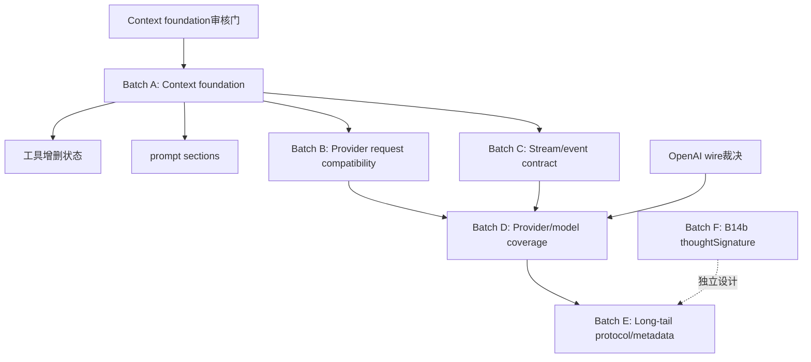

# 48 - pi-java-ai 下一步待做清单与设计入口

**状态：已批准，Batch A（A1）进入实施**  
**创建基准：** pi-java `f0400a2`（B14 收尾）  
**参考台账：** [`41-gap-inventory.md`](41-gap-inventory.md)、[`32-open-items-register.md`](32-open-items-register.md)、[`40-module-alignment-map.md`](40-module-alignment-map.md)  
**参考设计：** [`03-detailed-design.md`](03-detailed-design.md)、[`42-usage-domain-design.md`](42-usage-domain-design.md)、[`43-ai-hardfail-credentials-design.md`](43-ai-hardfail-credentials-design.md)、[`44-ai-image-content-design.md`](44-ai-image-content-design.md)、[`45-google-tool-result-design.md`](45-google-tool-result-design.md)、[`46-ai-extended-thinking-design.md`](46-ai-extended-thinking-design.md)、[`47-ai-transform-messages-rest-design.md`](47-ai-transform-messages-rest-design.md)

> 设计审核已通过；当前只允许按第 5 节逐项实施并回填证据，未完成任务不得标记为已完成。

---

## 1. 当前基线与范围

### 1.1 已完成、从本清单排除

以下功能在 `f0400a2` 前已完成，不得作为新任务重复开启：

- H1：usage、cache usage、cost、reasoning 生产链路；
- A0：Unicode sanitize、retryable error 扩展、凭证优先级、Anthropic Bearer/OAuth token 识别与鉴权头分派；
- H2：主流图片内容路径；
- B84：Google tool-result 路径的已核实结论；
- H5：extended thinking 块采集、落盘和回读；
- B14：图片降级、跨模型 tool-call ID normalization、orphan tool-result synthesis；
- B14：五类 ID normalizer 的六车道生产接线和四个 pi oracle。

### 1.2 B14 明确保留的差异

这些项目已在 `docs/47-ai-transform-messages-rest-design.md` 登记，不应被误报为 B14③④失败：

- B14b/R1：`thoughtSignature` 完整往返与剥离；
- R2：Java `UserMessage` / `ToolResultMessage` 没有 pi 对应的 timestamp 字段；
- R3：Responses composite tool-call ID 的部分生产来源不可达；
- R4：Responses 流程丢失 pi 的 `item.id` 会话迁移语义；
- R5：Java 当前没有独立 `SystemMessage` / `heldSystemMessages` 机制。

B14b/R1 单独列为 Batch F；R2/R3/R4 作为已知差异保留，除非后续设计包明确重新裁决。

### 1.3 统计口径

`docs/41-gap-inventory.md` 的总体数字和部分旧快照尚未因 H1/A0/H2/H5/B84/B14 完成而重新计算。当前排期以逐项行为证据为准，不使用旧百分比推导完成度。native-image 未验证、TUI 临时 JSONL 环境失败和历史并发 Maven `target` 竞争属于质量/环境记录，不混入功能任务。

---

## 2. 用户可观察缺口矩阵

| 编号 | 功能 | 优先级 | 用户可观察后果 | 当前 Java 现状/证据 | 依赖批次 | 设计包 |
|---|---|---:|---|---|---|---|
| A-01 | Anthropic `cache_control` | P0 | Anthropic prompt caching 无法按 pi 标记缓存区段，成本和延迟表现不一致 | `AnthropicRequestBuilder` / `AnthropicMessageConverter` 无 Anthropic `cache_control` 生产命中；`docs/41:54` | B | 无 |
| A-02 | OpenRouter chat provider | P0 | OpenRouter 只有 images 面，普通对话不可用 | `ProviderCatalog` 仅注册 `OpenRouterImagesProvider`；`docs/41:55` | D | 无 |
| A-03 | 统一 transcript/context 模型 | P0 | 缺少中途系统提示变化、工具变化和统一 provider context normalization | `Message` 只有 user/assistant/toolResult；`Context`/`StreamRequest` 分离 systemPrompt、messages、tools；`docs/41:56-58` | A | 无；挂靠 B14 R5 |
| A-04 | OpenAI 默认 wire 裁决 | P0 | pi 的 `openai` 默认走 Responses，Java 默认走 Completions，协议能力和会话语义不同 | `OpenAIProvider` 默认路由；`docs/41:101` | D | 无 |
| A-05 | `done` / `error` 终局事件载荷 | P0 | 下游拿不到与 pi 等价的最终 assistant/error message | `StreamEvent` 当前 `done` 主要携带 usage/partial，error 主要暴露 Throwable；`docs/41:102-103` | C | 无 |
| A-06 | xAI provider | P1 | xAI 普通 provider 端点不可用 | 当前仅 OAuth/provider error 相关痕迹，无 xAI provider 注册；`docs/41:63-64` | D | 无 |
| A-07 | `Model.compat` 扩展 | P1 | provider 无法依据模型能力决定 store、max-token 字段、developer role、缓存、会话亲和性和中途变化 | `ModelCompat` 当前只有少量已消费字段；`docs/41:67-68` | B/D | 无 |
| A-08 | 内置模型目录覆盖 | P1 | 大量模型退化为 `ModelInfo.minimal`，模型能力和价格不完整 | 当前内置目录为手写/有限覆盖；`docs/41:68-69` | D | 无 |
| A-09 | 非 Anthropic `thinkingFormat` | P1 | 非 Anthropic 推理模型无法按自身协议正确开启 thinking | 当前请求侧主要覆盖 Anthropic budget 形状；`docs/41:75` | B | 无 |
| A-10 | `simple-options` | P1 | `maxTokens` 可能超过 context window，thinking budget 可能未夹取 | `clampMaxTokensToContext` 等能力未形成生产路径；`docs/41:76` | B | 无 |
| A-11 | 工具状态增量 | P1 | 会话中途增删工具无法表达 | `Entry.ActiveToolsChange` 有形状但生产发射/归一化未闭环；`Context.tools` 目前整体替换；`docs/41:77` | A | 无 |
| A-12 | prompt `sections` | P1 | 无法按分段替换、比较或诊断系统提示词 | `SystemPromptBuilder` 仍输出单一字符串；`docs/41:78-79` | A | 无 |
| A-13 | `ContextOverflow` provider 门控 | P1 | z.ai 错误可能匹配不到，Cerebras 规则可能误命中其他 provider | `ContextOverflow` 仍是旧匹配/门控；`docs/41:79-80` | B | 无 |
| A-14 | provider retry `x-should-retry` | P1 | 服务端显式要求重试时 Java 可能不重试 | `PiHttpClient` 主要按状态码/IOException，`RetryPolicy` provider 预设零/少调用者；`docs/41:104-105,118` | B | 无 |
| A-15 | Anthropic OAuth 请求分支 | P1 | OAuth token 可识别/发头，但 OAuth 专用请求语义未完整进入 Anthropic 请求路径 | OAuth flow 主要由 `AuthCommand` 使用；system prompt 前缀和工具名转换未完整移植；`docs/41:69-70,156-157` | B | `docs/43` 部分覆盖鉴权基础 |
| A-16 | `models.json` provider/protocol/baseUrl 覆盖 | P1 | 自定义 provider 的 per-model 协议/URL 形状不完整，CLI base URL 可能被固定值覆盖 | `ModelsJsonSchema` 有字段但 `ModelsJsonConfig`/`ModelsJsonProvider` 消费不完整；`docs/41:108-109,262` | D | 无 |
| A-17 | 低频 provider wire | P2 | Bedrock、Vertex、Codex、Cloudflare 等特定 provider 不可用 | `Protocol` 无对应完整适配器；`docs/41:84-90` | E | 无 |
| A-18 | 模型/消息元数据长尾 | P2 | provider 能力、缓存和消息诊断信息表达不完整 | `namespace`、`textSignature`、`Model.input`、`ThinkingLevel.max`、Images registry、prompt cache metadata、Mistral compat、assistant 扩展字段等缺口 | E/F | 无；R1 单独 |
| A-19 | 低频协议能力 | P2 | grammar、transport、session resources、严格 JSON object 约束等能力缺失 | 当前生产路径零命中或未统一；`docs/41:89-90` | E | 无 |
| A-20 | 死码/无生产者清理 | P2 | API 形状与实际能力不一致，维护者可能误以为功能可用 | `UsageInfo.from`、`ModelThinkingLevels.supported/clamp`、`DeferredHandle` 等无生产者；`docs/41:116-123` | E | 无 |
| A-21 | B14b/R1 `thoughtSignature` | P2/独立裁决 | Google thought signature 无法完成真实往返/剥离 | Java 当前结构没有对应字段；`docs/47` B14b/R1 | F | 无；必须单独设计 |

---

## 3. 批次边界与依赖图



### Batch A — Context foundation

共同基础：`SystemMessage`/系统上下文表达、`TranscriptContext`、`normalizeContext`、工具增删事件和 prompt sections。必须先解决数据形状和 entry/transcript 投影，再让 provider 消费；不得先在单个 provider 中添加不可复用的特例。

### Batch B — Provider request compatibility

包括 Anthropic `cache_control`、`Model.compat`、thinking format、simple-options、retry header/provider retry、Anthropic OAuth 请求分支。涉及请求接口、模型元数据或鉴权链时必须先通过设计审核门。

### Batch C — Stream/event contract

统一 `done`/`error` 终局事件的载荷契约，检查 provider stream、agent 消费者、RPC/JSON 序列化和既有 pattern matching 的兼容性。

### Batch D — Provider and model coverage

包括 OpenAI 默认 Responses/Completions wire 裁决、OpenRouter chat、xAI、`models.json` 覆盖和内置模型目录。OpenAI 默认 wire 不能以改常量代替设计；必须先处理 Responses `item.id`/composite ID 与模型 compat 关系。

### Batch E — Long-tail protocol and metadata

在主流请求契约稳定后处理低频 wire、模型/消息元数据、grammar、transport、session-resources、JsonObject 约束，并逐项判断无生产者代码应接线、删除还是保留。

### Batch F — B14b/R1

单独评估 Java 当前结构是否可达、是否需要消息/JSON/adapter 形状变更。没有结构证据时不得仅添加字段或测试假装完成。

---

## 4. 设计审核门（实施前必须裁决）

以下问题没有裁决前，不得进入对应代码任务：

1. **Context 形状**：恢复独立 `Message.SystemMessage`，还是继续保留 `Context.systemPrompt` 并新增 `TranscriptContext`/分段模型？必须覆盖 entry 回放、provider 转换和 JSONL 兼容。
2. **工具增量**：`ActiveToolsChange` 如何投影为统一 transcript 语义，Anthropic `tool_addition`/`tool_removal` 与其他 provider 如何表达？
3. **prompt sections**：sections 是持久化 entry、仅构建期结构，还是两者分离？替换/差分的稳定 ID 如何定义？
4. **Anthropic cache control**：缓存边界是 system、tools、历史消息还是按模型 compat 选择；如何避免对不支持模型发出不兼容字段？
5. **终局事件**：`done`/`error` 是否扩展现有 sealed record，是否保留旧访问器；完整 assistant message 如何避免重复构造和不一致？
6. **OpenAI 默认 wire**：默认 Responses 与显式 Completions 的覆盖优先级；哪些模型/配置仍强制 Completions；OpenAI 与 Azure 的 `apiName`/item identity 差异。
7. **Model.compat**：字段默认值、`models.json` 反序列化、内置目录来源，以及每个字段的实际 request consumer。
8. **Maven 依赖**：任何新增或移除依赖必须先回写本文件并重新审核。

---

## 5. 实施任务表（审核前全部待开始）

状态定义：`⬜ 待开始` / `🔴 先红` / `🟡 实施中` / `🟢 已完成` / `⛔ 阻塞`。

| 批次 | 任务 | 优先级 | 依赖 | 状态 | Commit | 先红证据 | mutation probe/红集 | 回归证据 | 遗留 |
|---|---|---:|---|---|---|---|---|---|---|
| A | Context/Transcript 数据模型与 entry 投影设计落地 | P0 | 设计门1 | 🟡 实施中（数据模型已完成，entry 投影待完成） | `e9a3f7e..1bc9e07`（Task 1；已 cherry-pick 至 main 为 `f94d221..3491543`） | `TranscriptContextTest` RED：缺少 `Message.SystemMessage`/`ToolReference`/`TranscriptContext`；编译失败 | Task 1 RED → GREEN；Task 1 mutation/防御性拷贝断言；Task 1 review clean（两轮修订） | Task 1 focused：`TranscriptContextTest` 3/3；`MessageTest` 16/16；`ContentBlockJsonTest` 2/2；`git diff --check` clean | `ContextEntries` system payload 投影、`SessionJson` system JSON 尚未完成；Task 2 已暂停；**main 合并后 reactor compile 未通过：`GoogleMessageConverter.java:69` 的 `Message` 穷举 switch 尚未补 `SystemMessage` 机械分支**；后续需先补齐所有 sealed-switch 编译适配再继续回归 |
| A | `normalizeContext` 与 provider 消费迁移 | P0 | A1 | 🟡 实施中（normalizer 已迁移，provider 消费迁移未开始） | `ContextNormalizer.java` / `ContextNormalizerTest.java`（待 review commit） | Task 2 RED 原始证据在 agent worktree；当前 main focused test 被 `GoogleMessageConverter.java:69` sealed-switch 编译错误阻塞，尚未到测试执行 | Task 2 mutation probe 未在 main 完成；review 尚未执行 | `ContextNormalizerTest` 尚未取得 GREEN（编译阻塞）；`git diff --check` 待提交前执行 | `ContextNormalizer` 只建立纯适配器，未接 provider；需先补齐新增 `SystemMessage` 导致的全仓机械 sealed-switch 编译适配，再继续 Task 2 回归和 review |
| A | 工具增删状态线与 `tool_addition/removal` | P1 | A1/A2 | ⬜ 待开始 | — | — | — | — | — |
| A | prompt sections 构建、替换和差分 | P1 | A1 | ⬜ 待开始 | — | — | — | — | — |
| B | Anthropic `cache_control` | P0 | A1、设计门4 | ⬜ 待开始 | — | — | — | — | — |
| B | `Model.compat` 字段、JSON 映射与 request consumers | P1 | 设计门7 | ⬜ 待开始 | — | — | — | — | — |
| B | 非 Anthropic `thinkingFormat` | P1 | B2 | ⬜ 待开始 | — | — | — | — | — |
| B | `simple-options` max-token/thinking budget 夹取 | P1 | B2 | ⬜ 待开始 | — | — | — | — | — |
| B | retry header 与 provider retry 预设接线 | P1 | B2/设计门8 | ⬜ 待开始 | — | — | — | — | — |
| B | Anthropic OAuth credential → request path | P1 | A0 已完成、设计门8 | ⬜ 待开始 | — | — | — | — | — |
| B | `ContextOverflow` z.ai/Cerebras 门控 | P1 | — | ⬜ 待开始 | — | — | — | — | — |
| C | `done` 终局完整 assistant payload | P0 | 设计门5 | ⬜ 待开始 | — | — | — | — | — |
| C | `error` 终局 assistant error payload | P0 | C1 | ⬜ 待开始 | — | — | — | — | — |
| C | provider/agent/RPC 终局载荷迁移 | P0 | C1/C2 | ⬜ 待开始 | — | — | — | — | — |
| D | OpenAI 默认 wire 与显式 override 设计/实施 | P0 | 设计门6、R4裁决 | ⬜ 待开始 | — | — | — | — | — |
| D | OpenRouter chat provider | P0 | D1 | ⬜ 待开始 | — | — | — | — | — |
| D | xAI provider | P1 | D1 | ⬜ 待开始 | — | — | — | — | — |
| D | `models.json` provider/protocol/baseUrl 覆盖 | P1 | B2/D1 | ⬜ 待开始 | — | — | — | — | — |
| D | 内置模型目录覆盖/生成机制 | P1 | B2/D1 | ⬜ 待开始 | — | — | — | — | — |
| E | Bedrock/Vertex/Codex/Cloudflare wire | P2 | D | ⬜ 待开始 | — | — | — | — | — |
| E | 模型/消息 metadata 长尾 | P2 | B2/D | ⬜ 待开始 | — | — | — | — | — |
| E | grammar/transport/session-resources/JsonObject | P2 | D | ⬜ 待开始 | — | — | — | — | — |
| E | 无生产者代码逐项裁决与清理 | P2 | E1-E3 | ⬜ 待开始 | — | — | — | — | — |
| F | B14b/R1 `thoughtSignature` 可达性与设计 | P2 | 独立设计门 | ⬜ 待开始 | — | — | — | — | — |

> 审核通过前，这张表的状态、commit、证据列保持为空。实施时每完成一项立即更新，不等到批次收尾。

---

## 6. 每项验收门槛

每个任务必须按以下顺序留下证据：

1. **先红**：证明旧实现下目标测试失败；若结构上无法先红，必须说明原因并用 mutation probe 证明测试有牙。
2. **GREEN**：目标测试和必要的 provider/adapter-path 集成测试通过。
3. **Mutation probe**：移除接线或改变关键条件，记录精确红集。
4. **模块回归**：
   ```bash
   export JAVA_HOME='D:\soft\jdk\graalvm-jdk-25' && \
   /d/soft/apache-maven-3.9.9/bin/mvn -pl pi-java-ai -am test
   ```
5. **静态门禁**：checkstyle 0 violations、`git diff --check`、无新增 `System.out.println`、无无说明的 `@SuppressWarnings`、Java 文件不超过 500 行。
6. **串行构建**：不得并发运行会共享 `target` 的 Maven 命令。
7. **全 reactor**：运行 `mvn clean verify`；若 TUI 临时 JSONL 或其他环境问题失败，原样记录失败点，不得伪报成功。
8. **交互/流式任务**：补 FauxProvider 或真实 adapter-path 集成测试；涉及 TUI/CLI 时另做真实终端 smoke。
9. **审阅门**：每个独立任务必须有 SPEC COMPLIANCE 和 TASK QUALITY 两项审阅结论。

---

## 7. 明确不做与已知风险

- 不重做已完成的 H1/A0/H2/B84/H5/B14③④。
- 不把 Java 当前不存在的 `thoughtSignature`、timestamp、Responses `item.id` 或 `SystemMessage` 结构伪装成已实现。
- 不实现 pi 已删除或范围裁决排除的长尾功能。
- 不因无关模块的全 reactor flake 修改 `pi-java-ai` 生产行为。
- 不在没有 pi 行为证据、Java 可达路径和测试断言的情况下添加仅形状字段。
- `docs/41` 的旧总数、旧百分比和早期测试数量仅作历史参考。

已知环境/质量风险：

- native-image 尚未验证；
- 全 reactor clean verify 曾在 TUI 临时 JSONL append 处因 `NoSuchFileException` 失败；
- 并发 Maven 曾造成共享 `target` classfile race，必须串行复跑；
- 设计先于代码：本文件审核前不应产生实现 commit。

---

## 8. 人工审核清单

请审核以下事项：

- [ ] P0/P1 范围和优先级是否正确；
- [ ] Batch A 是否接受“先定义统一 Context/Transcript，再迁移 provider”的依赖顺序；
- [ ] 是否接受不恢复独立 `Message.SystemMessage`，而在设计阶段重新裁决 Context/Transcript 形状；
- [ ] OpenAI 默认 wire 的裁决范围是否足够；
- [ ] `done`/`error` 是否合并为一个终局事件契约包；
- [ ] Batch B、C、D 是否需要拆分或合并；
- [ ] B14b/R1 是否继续单独设计；
- [ ] 是否接受先红、mutation probe、串行回归、双审阅结论作为每项完成条件；
- [ ] 是否同意审核通过后才进入实施。

**审核回复入口：** 请直接指出需要修改的任务、优先级、范围、依赖或验收门槛；在收到明确审核通过前，本清单保持“设计待审核”，不开始实施。

---

## 9. 实施后回填约定（当前不执行）

审核通过后，按以下顺序更新：

1. 将顶部状态改为 `已批准，进入实施`，并记录用户裁决；
2. 每项按 `RED → GREEN → mutation → regression → review` 执行；
3. 每项完成后立即更新第 5 节对应行；
4. 仅在实际闭环后同步 `docs/41-gap-inventory.md` 和 `docs/32-open-items-register.md`；
5. 批次完成后追加“裁决与执行”“实测校正”“实施记录”；
6. 最终记录 focused tests、`pi-java-ai` 全模块回归、checkstyle、全 reactor 环境结果和剩余差异。
