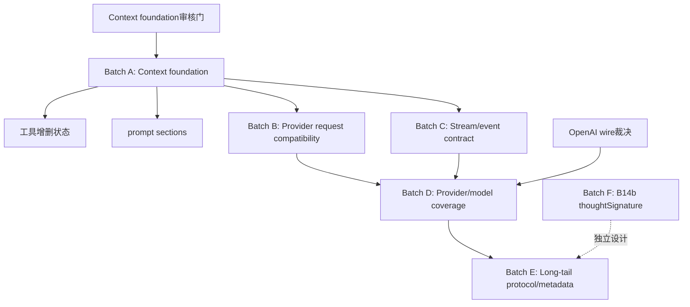

# 48 - pi-java-ai 下一步待做清单与设计入口

**状态：已批准；Batch A 已闭环 A1、A2 与包 B87/B88（2026-09-25–26）—— A3 已闭环（四条车道全部原生渲染，`docs/51 §12`）；A4 已闭环（prompt sections 构建/替换/差分 ＋ 生产接线，`docs/52 §12`，2026-09-26）；A-07 已闭环（`Model.compat` 的解析链、目录标注与已消费字段的生产者，`docs/53 §12`，2026-09-27 —— 四条车道的原生渲染与 sections 段补丁自此**生产可达**）**
> ⚠️ 本行是**活状态**，每包闭环后须回填（§9 步骤 7）。
**创建基准：** pi-java `f0400a2`（B14 收尾）  
**参考台账：** [`41-gap-inventory.md`](41-gap-inventory.md)、[`32-open-items-register.md`](32-open-items-register.md)、[`40-module-alignment-map.md`](40-module-alignment-map.md)  
**参考设计：** [`03-detailed-design.md`](03-detailed-design.md)、[`42-usage-domain-design.md`](42-usage-domain-design.md)、[`43-ai-hardfail-credentials-design.md`](43-ai-hardfail-credentials-design.md)、[`44-ai-image-content-design.md`](44-ai-image-content-design.md)、[`45-google-tool-result-design.md`](45-google-tool-result-design.md)、[`46-ai-extended-thinking-design.md`](46-ai-extended-thinking-design.md)、[`47-ai-transform-messages-rest-design.md`](47-ai-transform-messages-rest-design.md)

> 设计审核已通过；当前只允许按第 5 节逐项实施并回填证据，未完成任务不得标记为已完成。

---

## 1. 当前基线与范围

### 1.1 已完成、从本清单排除

以下功能在 `f0400a2` 前已完成，不得作为新任务重复开启：

- H1：usage、cache usage、cost、reasoning 生产链路；
- A0：Unicode sanitize、retryable error 扩展、凭证优先级、Anthropic Bearer/OAuth token 识别与鉴权头分派；
- H2：主流图片内容路径；
- B84：Google tool-result 路径的已核实结论；
- H5：extended thinking 块采集、落盘和回读；
- B14：图片降级、跨模型 tool-call ID normalization、orphan tool-result synthesis；
- B14：五类 ID normalizer 的六车道生产接线和四个 pi oracle。

### 1.2 B14 明确保留的差异

这些项目已在 `docs/47-ai-transform-messages-rest-design.md` 登记，不应被误报为 B14③④失败：

- B14b/R1：`thoughtSignature` 完整往返与剥离；
- R2：Java `UserMessage` / `ToolResultMessage` 没有 pi 对应的 timestamp 字段；
- R3：Responses composite tool-call ID 的部分生产来源不可达；
- R4：Responses 流程丢失 pi 的 `item.id` 会话迁移语义；
- R5：Java 当前没有独立 `SystemMessage` / `heldSystemMessages` 机制。

B14b/R1 单独列为 Batch F；R2/R3/R4 作为已知差异保留，除非后续设计包明确重新裁决。

### 1.3 统计口径

`docs/41-gap-inventory.md` 的总体数字和部分旧快照尚未因 H1/A0/H2/H5/B84/B14 完成而重新计算。当前排期以逐项行为证据为准，不使用旧百分比推导完成度。native-image 未验证、TUI 临时 JSONL 环境失败和历史并发 Maven `target` 竞争属于质量/环境记录，不混入功能任务。

---

## 2. 用户可观察缺口矩阵

| 编号 | 功能 | 优先级 | 用户可观察后果 | 当前 Java 现状/证据 | 依赖批次 | 设计包 |
|---|---|---:|---|---|---|---|
| A-01 | Anthropic `cache_control` | P0 | Anthropic prompt caching 无法按 pi 标记缓存区段，成本和延迟表现不一致 | `AnthropicRequestBuilder` / `AnthropicMessageConverter` 无 Anthropic `cache_control` 生产命中；`docs/41:54` | B | 无 |
| A-02 | OpenRouter chat provider | P0 | OpenRouter 只有 images 面，普通对话不可用 | `ProviderCatalog` 仅注册 `OpenRouterImagesProvider`；`docs/41:55` | D | 无 |
| A-03 | 统一 transcript/context 模型 | P0 | 缺少中途系统提示变化、工具变化和统一 provider context normalization | `Message` 只有 user/assistant/toolResult；`Context`/`StreamRequest` 分离 systemPrompt、messages、tools；`docs/41:56-58` | A | 无；挂靠 B14 R5 |
| A-04 | OpenAI 默认 wire 裁决 | P0 | pi 的 `openai` 默认走 Responses，Java 默认走 Completions，协议能力和会话语义不同 | `OpenAIProvider` 默认路由；`docs/41:101` | D | 无 |
| A-05 | `done` / `error` 终局事件载荷 | P0 | 下游拿不到与 pi 等价的最终 assistant/error message | `StreamEvent` 当前 `done` 主要携带 usage/partial，error 主要暴露 Throwable；`docs/41:102-103` | C | 无 |
| A-06 | xAI provider | P1 | xAI 普通 provider 端点不可用 | 当前仅 OAuth/provider error 相关痕迹，无 xAI provider 注册；`docs/41:63-64` | D | 无 |
| A-07 | `Model.compat` 扩展 | P1 | provider 无法依据模型能力决定 store、max-token 字段、developer role、缓存、会话亲和性和中途变化 | `ModelCompat` 当前只有少量已消费字段；`docs/41:67-68` | B/D | 无 |
| A-08 | 内置模型目录覆盖 | P1 | 大量模型退化为 `ModelInfo.minimal`，模型能力和价格不完整 | 当前内置目录为手写/有限覆盖；`docs/41:68-69` | D | 无 |
| A-09 | 非 Anthropic `thinkingFormat` | P1 | 非 Anthropic 推理模型无法按自身协议正确开启 thinking | 当前请求侧主要覆盖 Anthropic budget 形状；`docs/41:75` | B | 无 |
| A-10 | `simple-options` | P1 | `maxTokens` 可能超过 context window，thinking budget 可能未夹取 | `clampMaxTokensToContext` 等能力未形成生产路径；`docs/41:76` | B | 无 |
| A-11 | 工具状态增量 | P1 | 会话中途增删工具无法表达 | `Entry.ActiveToolsChange` 有形状但生产发射/归一化未闭环；`Context.tools` 目前整体替换；`docs/41:77` | A | 无 |
| A-12 | prompt `sections` | P1 | 无法按分段替换、比较或诊断系统提示词 | `SystemPromptBuilder` 仍输出单一字符串；`docs/41:78-79` | A | 无 |
| A-13 | `ContextOverflow` provider 门控 | P1 | z.ai 错误可能匹配不到，Cerebras 规则可能误命中其他 provider | `ContextOverflow` 仍是旧匹配/门控；`docs/41:79-80` | B | 无 |
| A-14 | provider retry `x-should-retry` | P1 | 服务端显式要求重试时 Java 可能不重试 | `PiHttpClient` 主要按状态码/IOException，`RetryPolicy` provider 预设零/少调用者；`docs/41:104-105,118` | B | 无 |
| A-15 | Anthropic OAuth 请求分支 | P1 | OAuth token 可识别/发头，但 OAuth 专用请求语义未完整进入 Anthropic 请求路径 | OAuth flow 主要由 `AuthCommand` 使用；system prompt 前缀和工具名转换未完整移植；`docs/41:69-70,156-157` | B | `docs/43` 部分覆盖鉴权基础 |
| A-16 | `models.json` provider/protocol/baseUrl 覆盖 | P1 | 自定义 provider 的 per-model 协议/URL 形状不完整，CLI base URL 可能被固定值覆盖 | `ModelsJsonSchema` 有字段但 `ModelsJsonConfig`/`ModelsJsonProvider` 消费不完整；`docs/41:108-109,262` | D | 无 |
| A-17 | 低频 provider wire | P2 | Bedrock、Vertex、Codex、Cloudflare 等特定 provider 不可用 | `Protocol` 无对应完整适配器；`docs/41:84-90` | E | 无 |
| A-18 | 模型/消息元数据长尾 | P2 | provider 能力、缓存和消息诊断信息表达不完整 | `namespace`、`textSignature`、`Model.input`、`ThinkingLevel.max`、Images registry、prompt cache metadata、Mistral compat、assistant 扩展字段等缺口 | E/F | 无；R1 单独 |
| A-19 | 低频协议能力 | P2 | grammar、transport、session resources、严格 JSON object 约束等能力缺失 | 当前生产路径零命中或未统一；`docs/41:89-90` | E | 无 |
| A-20 | 死码/无生产者清理 | P2 | API 形状与实际能力不一致，维护者可能误以为功能可用 | `UsageInfo.from`、`ModelThinkingLevels.supported/clamp`、`DeferredHandle` 等无生产者；`docs/41:116-123` | E | 无 |
| A-21 | B14b/R1 `thoughtSignature` | P2/独立裁决 | Google thought signature 无法完成真实往返/剥离 | Java 当前结构没有对应字段；`docs/47` B14b/R1 | F | 无；必须单独设计 |

---

## 3. 批次边界与依赖图


```mermaid
flowchart TD
    A[Batch A: Context foundation] --> A11[工具增删状态]
    A --> A12[prompt sections]
    A --> B[Batch B: Provider request compatibility]
    A --> C[Batch C: Stream/event contract]
    B --> D[Batch D: Provider/model coverage]
    C --> D
    D --> E[Batch E: Long-tail protocol/metadata]
    F[Batch F: B14b thoughtSignature] -.独立设计.-> E
    D0[OpenAI wire裁决] --> D
    A3[Context foundation审核门] --> A
```

### Batch A — Context foundation

共同基础：`SystemMessage`/系统上下文表达、`TranscriptContext`、`normalizeContext`、工具增删事件和 prompt sections。必须先解决数据形状和 entry/transcript 投影，再让 provider 消费；不得先在单个 provider 中添加不可复用的特例。

### Batch B — Provider request compatibility

包括 Anthropic `cache_control`、`Model.compat`、thinking format、simple-options、retry header/provider retry、Anthropic OAuth 请求分支。涉及请求接口、模型元数据或鉴权链时必须先通过设计审核门。

### Batch C — Stream/event contract

统一 `done`/`error` 终局事件的载荷契约，检查 provider stream、agent 消费者、RPC/JSON 序列化和既有 pattern matching 的兼容性。

### Batch D — Provider and model coverage

包括 OpenAI 默认 Responses/Completions wire 裁决、OpenRouter chat、xAI、`models.json` 覆盖和内置模型目录。OpenAI 默认 wire 不能以改常量代替设计；必须先处理 Responses `item.id`/composite ID 与模型 compat 关系。

### Batch E — Long-tail protocol and metadata

在主流请求契约稳定后处理低频 wire、模型/消息元数据、grammar、transport、session-resources、JsonObject 约束，并逐项判断无生产者代码应接线、删除还是保留。

### Batch F — B14b/R1

单独评估 Java 当前结构是否可达、是否需要消息/JSON/adapter 形状变更。没有结构证据时不得仅添加字段或测试假装完成。

---

## 4. 设计审核门（实施前必须裁决）

以下问题没有裁决前，不得进入对应代码任务：

1. **Context 形状**：恢复独立 `Message.SystemMessage`，还是继续保留 `Context.systemPrompt` 并新增 `TranscriptContext`/分段模型？必须覆盖 entry 回放、provider 转换和 JSONL 兼容。
2. **工具增量**：`ActiveToolsChange` 如何投影为统一 transcript 语义，Anthropic `tool_addition`/`tool_removal` 与其他 provider 如何表达？
3. **prompt sections**：sections 是持久化 entry、仅构建期结构，还是两者分离？替换/差分的稳定 ID 如何定义？
4. **Anthropic cache control**：缓存边界是 system、tools、历史消息还是按模型 compat 选择；如何避免对不支持模型发出不兼容字段？
5. **终局事件**：`done`/`error` 是否扩展现有 sealed record，是否保留旧访问器；完整 assistant message 如何避免重复构造和不一致？
6. **OpenAI 默认 wire**：默认 Responses 与显式 Completions 的覆盖优先级；哪些模型/配置仍强制 Completions；OpenAI 与 Azure 的 `apiName`/item identity 差异。
7. **Model.compat**：字段默认值、`models.json` 反序列化、内置目录来源，以及每个字段的实际 request consumer。
8. **Maven 依赖**：任何新增或移除依赖必须先回写本文件并重新审核。

---

## 5. 实施任务表（审核前全部待开始）

状态定义：`⬜ 待开始` / `📐 设计待审核` / `🔴 先红` / `🟡 实施中` / `🟢 已完成` / `⛔ 阻塞`。

| 批次 | 任务 | 优先级 | 依赖 | 状态 | Commit | 先红证据 | mutation probe/红集 | 回归证据 | 遗留 |
|---|---|---:|---|---|---|---|---|---|---|
| A | Context/Transcript 数据模型与 entry 投影设计落地 | P0 | 设计门1 | 🟢 已完成 | `f94d221..3491543`（Task 1）、`9065ec6`（全仓 sealed-switch 编译适配）、`7adea0d`（便捷构造器对齐设计）、`1956d6d`（Task 3：entry 投影＋session JSON）、`dc5ba44`（review 修复：≤500 行门禁＋显式 `case`＋删同义反复断言） | Task 1：`TranscriptContextTest` 编译失败（缺 `Message.SystemMessage`/`ToolReference`/`TranscriptContext`）；Task 3：`SessionJsonSystemMessageTest` 2 error（`timestamp`/可选字段键缺席）。Task 3 的 entry 投影测试**先红不成立**（`project` 已原样透传载荷）——按计划 §Execution Notes 记为结构性 RED 例外，改由 JSON 侧 mutation 守门 | M1 关掉前导插入 ⇒ 恰 1 红 `ContextNormalizerTest.prependsLegacySystemPromptAndCopiesTools:35`；M2 去掉 `SystemMessage.toolsAdded` 的 `List.copyOf` ⇒ 恰 1 红 `TranscriptContextTest.systemMessageAndTranscriptContextDefensivelyCopyCollections:54`；M3 关掉 `SessionJson` 的 system 分支 ⇒ 恰 2 红（`…WritesRoleContentAndTimestamp:51`、`…WritesNonEmptyOptionalFieldsUnderPiNames:66`）；M4 去掉「空值省略」门 ⇒ 恰 2 红（`…OmitsAbsentTimestamp:87`、`…WritesRoleContentAndTimestamp:54`）；M5 去掉重复守卫 ⇒ 恰 1 红 `…preservesExistingLeadingSystemMessageWithoutInjectingLegacyFields:56` | focused：`ContextNormalizerTest` 4/4、`TranscriptContextTest` 3/3、`MessageTest` 16/16、`ContentBlockJsonTest` 2/2；agent-core focused：`ContextEntriesTest` 17/17、`SessionJsonSystemMessageTest` 4/4、`JsonlSessionStorageTest` 11/11；模块回归 ai 819/819、agent-core 484/484；checkstyle 0 violations、`git diff --check` clean、无 `System.out.println`、改动文件均 ≤500 行 | 见 §10.3 遗留清单（`MessageJsonCodec` 回读、`toolsAdded` 线格形状、`sections` null 语义、TUI/web 无系统消息处理） |
| A | `normalizeContext` 与 provider 消费迁移 | P0 | A1 | 🟢 已完成 | `c1c8bf6`/`dc5ba44`（normalizer，A1 期）＋ **A2 迁移**：`7647097`（A2a helpers）· `3576bc3`（A2b ＋ R5）· `01cb866`（A2c PiMessages 线形状）· 文档 `6c74f18`/`52eeab2`（`docs/49 §12`） | A2a：新类型全部「找不到符号」（编译失败）；A2b：**stash 实现 ＋ 旧代码复跑** ⇒ 11/11 红（4 处 `IllegalStateException: unreachable message role` ＋ 7 处「桩零请求 ⇒ 线格解析 NPE」）；A2c：同法 2/2 红（失败信息里打出的旧体逐字在 `docs/49 §12.4`） | A2a：M6 ⇒ 3 红、M9 ⇒ 恰 1 红、M-TOOLS ⇒ 恰 1 红、M10 ⇒ 恰 1 红；A2b：M1 ⇒ 恰 2 红、M3 ⇒ 恰 2 红、**M5 ⇒ 零红**（可达输入下不可观察，`docs/49 §12.2-2`）；A2c：— | focused 全绿（`TranscriptsTest` 9 / `MessageTextsTest` 7 / `OrphanToolResultsHeldSystemMessageTest` 4 / `LaneTranscriptSourceTest` 7 / `PiMessagesRequestShapeTest` 2）；ai 819⇒**849**、agent-core 484、checkstyle 0 新违规、全 reactor `mvn clean verify` **SUCCESS**（14/14、7:08） | 两处计划被实测推翻（**R5 前移为 A2b 的前置条件**；M5 零红）；新登记 **B88**（Responses 带工具硬故障）/**B89**/**B90**；B87 **①仍开**（回读，见 `docs/50`）、②待收敛；四条非 Anthropic 车道的 pi 侧探针仍未补（`docs/49 §12.6-3`） |
| — | **包 B87/B88**（系统消息回读 ＋ Responses 车道工具声明）—— 设计见 `docs/50` | P0 | A1/A2 收尾 | 🟢 已完成 | `47e7f57`（B88）· `9f86e8c`（B87a 回读）· `6275f13`（B87b 落线收敛）· 文档 `0df2e54` ＋ 本行回填（`docs/50 §12`） | B88：新夹具 2/2 失败（`` `strict` is required, but was not set ``，桩零请求）；B87a/B87b：两个实现同时 stash ⇒ 读侧 6 error `has unknown message role` ＋ 1 failure、写侧 1 failure（键集 7 个） | B88：M1 ⇒ 恰 1 红（azure）、M2 ⇒ 恰 1 红（openai）；B87a：M3 ⇒ **4 红**（设计稿预测 1，校验随 helper 一起消失）、M4 ⇒ 恰 1 红；B87b：M5/M6 各 **2 红**（1 ＋ 1，两个写者各一，跨模块分两次跑） | ai 849⇒**851**、agent-core 484⇒**494**，全绿；checkstyle 0 新违规；全 reactor `mvn clean verify` **SUCCESS**（14/14、7:14） | 设计稿 §9 的 R1–R6 全按建议；实现偏离一处（`toToolDeclaration` 返 record 而非 `LinkedHashMap`）；连带面：五处**反射**夹具随签名改直调（21 个运行期 `NoSuchMethod`）；`constrainedSampling`/grammar 工具仍缺（L-A）；B87③/④ 分别归 A4/宿主面 |
| A | 工具增删状态线与 `tool_addition/removal` | P1 | A1/A2 | 🟢 | `bef15fa` `8a0f67c` `1700985` `f6665ec` `c59db5a` ＋ docs `61d0178` `3a088b1` | 先红：A3a 编译失败；A3b `git stash` ＋ pi 金标 ⇒ **10 红**；A3c 逐车道 `git stash` ⇒ Responses **4 红**、Anthropic **5 红**、Completions **3 红**（全部是「请求没有真的发出去」） | M1–M5 各 1–5 红 · M6–M11 各 1–5 红 · N1–N5 各 1–3 红 · A1–A5 各 1 红 · C1–C4 各 1–2 红 | ai 866⇒886、agent-core 494⇒505、conformance 15/15（金标已重生成为 pi `3390bd936` 的真实行为） | ⚠️ 实施中推翻过一处设计结论：Anthropic 与 Completions 一度被登记为「SDK 表达不了」（`docs/51 §3 F13` 初版、`docs/32` B92/B93），**实测两条 SDK 都有原始 JSON 直通** ⇒ 已落地并撤销登记（`docs/51 §12.4.1`）。四条车道的原生渲染在 A7 接线前仍**只有测试可达**（F5/F6）|
| A | prompt sections 构建、替换和差分 | P1 | A1 | 🟢 已完成（`docs/52 §12`） | `92a4b99`（A4a 删除态）· `fc1404e`/`032de6d`（A4b 机制＋替换旧 builder）· `40bb3ea`/`e7c68cc`（A4c 生产者＋接线） | A4a：新夹具 **9 跑 8 红**（`NullPointerException: section value`，形状门在上游故红集不分叉）；A4b/A4c：新增的 `NON_NULL` 落线陷阱与「每轮刷新 context.tools」各由**新夹具先红**（后者 2 红、前者 1 红，见 §12） | M1 ⇒ 10 红 · M2 ⇒ 2 红 · M3 ⇒ 4 红 · M4 ⇒ 3 红 · M5 ⇒ 2 红 · M6 ⇒ 2 红 · B1 ⇒ 4 红 · B2–B5 各 1 红 · C1 ⇒ 2 红 · C2 ⇒ 3 红 · C3 ⇒ 3 红 · C4 ⇒ 1 红 · C5 ⇒ 5 红 | 全 reactor `mvn -o test` SUCCESS；`ai` 886⇒893、`agent-core` 504⇒519、`coding-agent` 272；checkstyle 0 新违规 | R1–R7 全按建议；⚠️ **探针自身出过两次假零红**（子串式落地检查、`perl -0pi` 不带 `/g`），且 **C4 的零红是夹具盲区而非探针问题**（补「同 run 内切工具」后恰 1 红）——三条新教训见 `docs/52 §12.5`；新登记 **B94**（内置工具无 `promptSnippet`）/ **B95**（`docs` 段无生产者）/ **B96**（录制格式扩字段）；`ensureInitialDeclaration` 与 `ToolChangeDeclaration.initialDeclaration` 按 R4 **删除**（`docs/51` F11 更正）；`AgentHarness` 514⇒523、`PiLaneSink` 533⇒556（存量超限各增 9/23 行，未拆） |
| B | Anthropic `cache_control` | P0 | A1、设计门4 | ⬜ 待开始 | — | — | — | — | — |
| B | `Model.compat` 字段、JSON 映射与 request consumers | P1 | 设计门7 | 🟢 已完成（`docs/53 §12`） | `9eee9f8`（A7a 解析层）· `22bde33`（A7b 目录标注 ＋ models.json 面）· `3770fd3`（A7c 车道接线）· `3d7898e`（收口：最后一处直接读点） | A7a/A7b/A7c 均**编译失败**先红（新类／签名变更）；行为先红见 mutation 列（M1/M3/M4/M5c/M6/M7/M8 的红集就是「旧行为」） | M1⇒1 · **M2⇒0**（`forceAdaptiveThinking` 是二态常量字段，解析层贡献恒等于原值 ⇒ 形状改动非行为改动）· M3⇒2 · M4⇒1 · **M5⇒0**（`A && B ;` 被折叠成原条件 = **假变异**，与 A4 的 `\|\| false` 同型）· M5c⇒1 · M6⇒2 · M7⇒7 · M8⇒2 | 全 reactor `mvn -o test` **SUCCESS**（14/14）；`ai` 893⇒**942**、agent-core 519、coding-agent 272、conformance **15/15 仍绿**；checkstyle 0 新违规 | R1–R8 全按建议；⚠️ **「零红」新增第四种成因**（变异体语义等价，M2）＋**「假变异」第 2 次兑现**（M5）＋ CRLF 第 4 次（多行模式）——三条见 `docs/53 §12.7`；新登记 **B97**（内置目录三个 id 与 pi 不匹配，归 A-08）/ **B98**（零消费者的 compat 字段清单）/ **B99**（`supportsMidConvoEffort` 半可移植）/ **B100**（探测只认 `model.baseUrl` 的偏差）/ **B101**（F5/F6 结案）/ **B102**（缺 `modelOverrides` 与 provider 级 compat 两条覆盖路径，归 A-16）；**两处存量超限**（`MistralConversationsApi` 508⇒512、`ResponsesMessageConverter` 544⇒545，A7c **之前**即已超限）未拆 |
| B | 非 Anthropic `thinkingFormat` | P1 | B2 | ⬜ 待开始 | — | — | — | — | — |
| B | `simple-options` max-token/thinking budget 夹取 | P1 | B2 | ⬜ 待开始 | — | — | — | — | — |
| B | retry header 与 provider retry 预设接线 | P1 | B2/设计门8 | ⬜ 待开始 | — | — | — | — | — |
| B | Anthropic OAuth credential → request path | P1 | A0 已完成、设计门8 | ⬜ 待开始 | — | — | — | — | — |
| B | `ContextOverflow` z.ai/Cerebras 门控 | P1 | — | ⬜ 待开始 | — | — | — | — | — |
| C | `done` 终局完整 assistant payload | P0 | 设计门5 | ⬜ 待开始 | — | — | — | — | — |
| C | `error` 终局 assistant error payload | P0 | C1 | ⬜ 待开始 | — | — | — | — | — |
| C | provider/agent/RPC 终局载荷迁移 | P0 | C1/C2 | ⬜ 待开始 | — | — | — | — | — |
| D | OpenAI 默认 wire 与显式 override 设计/实施 | P0 | 设计门6、R4裁决 | ⬜ 待开始 | — | — | — | — | — |
| D | OpenRouter chat provider | P0 | D1 | ⬜ 待开始 | — | — | — | — | — |
| D | xAI provider | P1 | D1 | ⬜ 待开始 | — | — | — | — | — |
| D | `models.json` provider/protocol/baseUrl 覆盖 | P1 | B2/D1 | ⬜ 待开始 | — | — | — | — | — |
| D | 内置模型目录覆盖/生成机制 | P1 | B2/D1 | ⬜ 待开始 | — | — | — | — | — |
| E | Bedrock/Vertex/Codex/Cloudflare wire | P2 | D | ⬜ 待开始 | — | — | — | — | — |
| E | 模型/消息 metadata 长尾 | P2 | B2/D | ⬜ 待开始 | — | — | — | — | — |
| E | grammar/transport/session-resources/JsonObject | P2 | D | ⬜ 待开始 | — | — | — | — | — |
| E | 无生产者代码逐项裁决与清理 | P2 | E1-E3 | ⬜ 待开始 | — | — | — | — | — |
| F | B14b/R1 `thoughtSignature` 可达性与设计 | P2 | 独立设计门 | ⬜ 待开始 | — | — | — | — | — |

> 审核通过前，这张表的状态、commit、证据列保持为空。实施时每完成一项立即更新，不等到批次收尾。

---

## 6. 每项验收门槛

每个任务必须按以下顺序留下证据：

1. **先红**：证明旧实现下目标测试失败；若结构上无法先红，必须说明原因并用 mutation probe 证明测试有牙。
2. **GREEN**：目标测试和必要的 provider/adapter-path 集成测试通过。
3. **Mutation probe**：移除接线或改变关键条件，记录精确红集。
4. **模块回归**：
   ```bash
   export JAVA_HOME='D:\soft\jdk\graalvm-jdk-25' && \
   /d/soft/apache-maven-3.9.9/bin/mvn -pl pi-java-ai -am test
   ```
5. **静态门禁**：checkstyle 0 violations、`git diff --check`、无新增 `System.out.println`、无无说明的 `@SuppressWarnings`、Java 文件不超过 500 行。
6. **串行构建**：不得并发运行会共享 `target` 的 Maven 命令。
7. **全 reactor**：运行 `mvn clean verify`；若 TUI 临时 JSONL 或其他环境问题失败，原样记录失败点，不得伪报成功。
8. **交互/流式任务**：补 FauxProvider 或真实 adapter-path 集成测试；涉及 TUI/CLI 时另做真实终端 smoke。
9. **审阅门**：每个独立任务必须有 SPEC COMPLIANCE 和 TASK QUALITY 两项审阅结论。

---

## 7. 明确不做与已知风险

- 不重做已完成的 H1/A0/H2/B84/H5/B14③④。
- 不把 Java 当前不存在的 `thoughtSignature`、timestamp、Responses `item.id` 或 `SystemMessage` 结构伪装成已实现。
- 不实现 pi 已删除或范围裁决排除的长尾功能。
- 不因无关模块的全 reactor flake 修改 `pi-java-ai` 生产行为。
- 不在没有 pi 行为证据、Java 可达路径和测试断言的情况下添加仅形状字段。
- `docs/41` 的旧总数、旧百分比和早期测试数量仅作历史参考。

已知环境/质量风险：

- native-image 尚未验证；
- 全 reactor clean verify 曾在 TUI 临时 JSONL append 处因 `NoSuchFileException` 失败；
- 并发 Maven 曾造成共享 `target` classfile race，必须串行复跑；
- 设计先于代码：本文件审核前不应产生实现 commit。

---

## 8. 人工审核清单

请审核以下事项：

- [ ] P0/P1 范围和优先级是否正确；
- [ ] Batch A 是否接受“先定义统一 Context/Transcript，再迁移 provider”的依赖顺序；
- [ ] 是否接受不恢复独立 `Message.SystemMessage`，而在设计阶段重新裁决 Context/Transcript 形状；
- [ ] OpenAI 默认 wire 的裁决范围是否足够；
- [ ] `done`/`error` 是否合并为一个终局事件契约包；
- [ ] Batch B、C、D 是否需要拆分或合并；
- [ ] B14b/R1 是否继续单独设计；
- [ ] 是否接受先红、mutation probe、串行回归、双审阅结论作为每项完成条件；
- [ ] 是否同意审核通过后才进入实施。

**审核回复入口：** 请直接指出需要修改的任务、优先级、范围、依赖或验收门槛；在收到明确审核通过前，本清单保持“设计待审核”，不开始实施。

> ⚠️ **（2026-09-26 注）本节是获批前写下的审核邀请，措辞已过时** —— 本清单已于 2026-09-25 获批并进入实施。**当前状态一律以文首 banner 与 §5 实施表为准**，不要据本行判「尚未开工」。

---

## 9. 实施后回填约定（自 2026-09-25 起执行）

审核通过后，按以下顺序更新：

1. 将顶部状态改为 `已批准，进入实施`，并记录用户裁决；
2. 每项按 `RED → GREEN → mutation → regression → review` 执行；
3. 每项完成后立即更新第 5 节对应行；
4. 仅在实际闭环后同步 `docs/41-gap-inventory.md` 和 `docs/32-open-items-register.md`；
5. 批次完成后追加“裁决与执行”“实测校正”“实施记录”；
6. 最终记录 focused tests、`pi-java-ai` 全模块回归、checkstyle、全 reactor 环境结果和剩余差异；
7. **闭环时回填文首 banner**：本文件第 3 行不是一次性盖章，而是**活状态** —— 每包闭环后改写为「已闭环 <包名>（<日期>）；下一项＝ <X>」；
8. **每个包自己的设计文档也要翻**：`docs/49` / `docs/50` 这类「一包一文档」的顶部 `状态：设计待审核` 必须改为「已裁决并闭环（裁决、提交、§12 记录）」，否则与文末实施记录自相矛盾（2026-09-26 实测漏了 `docs/42`/`docs/49`/`docs/50` 三处，见 `docs/32` **B91**）。

---

## 10. Batch A1 实施记录（2026-09-25）

提交范围：`f94d221..3491543`（Task 1，先前已落）、`c1c8bf6`（Task 2）、`9065ec6`、`7adea0d`、`1956d6d`、`dc5ba44`。

### 10.1 裁决与执行

| # | 事项 | 裁决 | 落点 |
|---|---|---|---|
| A1-1 | 是否恢复独立 `Message.SystemMessage` | **恢复**，作为 `Message` 的第四变体；`Context.systemPrompt` 保留为兼容输入 | `Message.java:49-78` |
| A1-2 | 是否新增 `Entry.SystemMessage` | **不新增**：系统消息仍以 `Entry.Message` 载荷存在 | `ContextEntries.project` 原样透传 |
| A1-3 | `normalize` 的签名 | 三个 AI 层值直传（`String, List<Message>, List<ToolDefinition>`），不反向依赖 agent-core 的 `Context` | `ContextNormalizer.java:24-26` |
| A1-4 | 前导系统消息的重复守卫 | **保留** —— pi 的 `normalizeContext` 没有这道门，这是 A1 兼容层的适配，不是对 pi 原函数的承诺 | 设计 §Normalization 规则 2；`ContextNormalizer.java:30-34` |
| A1-5 | provider 文件的可改范围 | 只允许「让 Java 编译器能过的机械适配」，且不得超出显式不支持守卫 | `GoogleMessageConverter:89-93`、`MistralConversationsApi:333-336`、`ContextUsageEstimator:169-171` |
| A1-6 | 便捷构造器的 null 文本 | **一个空文本块**（`text == null ? "" : text`），不是空列表 | `7adea0d`；`Message.java:64-78` |
| A1-7 | `default` 还是显式 `case` | **显式 `case Message.SystemMessage`**：`default` 会把将来第五个变体一并吞进「不支持的角色」 | `dc5ba44` |

### 10.2 实测校正

1. **加一个 `Message` 变体会让全仓三处 pattern switch 不再穷举**（`GoogleMessageConverter.toContents`、`ContextUsageEstimator.estimateTokens`、conformance 的 `FrameNormalizer.messageOf`；`MistralConversationsApi` 此前已补）。第一次 `mvn compile` 报「成功」是**假的** —— agent-core 在 ai 的 jar 变化后没有被增量重编，只有 `mvn clean compile` 才暴露出 `ContextUsageEstimator.java:149`。与 `docs/32` 的「共享 `target` 假绿」同型，故本记录的回归一律走 clean。
2. **`ContextUsageEstimator` 的 system 分支取 `0L` 不是机械兜底**：pi 的 `estimateTokens` 根本没有 `"system"` case，落到函数末尾的 `return 0`（`compaction.ts:273-306`）。
3. **`SessionJson.messageNode` 的 `timestamp` 是「有才写」**，不是设计 §JSON shape 原文的「always write」：pi 的 `timestamp` 是必填 number，Java 的 `Instant` 可为 null（只有手写构造走得到），写 `null` 会造出 pi 里不存在的形状。这是**有意偏差**，由 `systemMessageNodeOmitsAbsentTimestamp` 钉住。
4. **`MistralConversationsApi` 因 A1 的守卫从 500 行涨到 505 行**，违反计划 §Global Constraints 与 §6 门禁 5。`checkstyle:check` 不报，是因为 `checkstyle.xml:7` 把全局 severity 设成 `warning`、插件只在 error 上失败 —— 但仓库自己的 `checkstyle-result.xml` 一直记着这条。修复＝把 `buildToolResultText` **原样搬进** `MistralToolResultText`（纯搬移，pi 侧本就是独立函数），文件回到 478 行。
5. **A1 的编译适配不能靠 `default` 兜底**：计划把它写成「机械适配」，但 `default` 的语义比「只处理 system」宽，故两处都改成显式 `case`。

### 10.3 遗留清单（A1 未做，需后续设计包裁决）

| # | 缺口 | 现状 | 影响 |
|---|---|---|---|
| L1 | **系统消息不能回读** | `MessageJsonCodec.decode` 对 `role: "system"` 抛 `unknown message role`（`:60`） | A1 的落线是**只写**的。今天不可达（无生产者），但 A2/A3 一旦接线，带系统消息的会话 resume 会直接报 schema 错 |
| L2 | **`toolsAdded` 的线格形状未定** | `SessionJson` 用 `valueToTree` 原样写 `ToolDefinition`（7 个组件），而 pi 的 `toolsAdded` 是 ai 层 `Tool[]` ＝ `{name, description, parameters}`（`types.ts:600-605`），与同仓 `PayloadRecordingStreamFn:125-131` 的 `{name, inputSchema}` 也不一致 | 今天不可达；A3 一读这个字段就会撞上。现有测试只断言 `name`，抓不到多余/错名键 |
| L3 | **`sections` 表达不了「删除」** | Java 是 `Map<String,String>`，pi 是 `Record<string, string \| null>`（`null` ＝ 删掉具名段，`types.ts:501`）；`Map.copyOf` 还会在 null 值上 NPE | A1 无 section 生产者，随 sections 包处理 |
| L4 | **TUI / web 不认系统消息** | `ChatMessage.java:73` 会渲染成 `"Unknown message role: system"`；`WebWireJson` / `JsonEventMapper:226` 不产出 `sections`/`toolsAdded`/`toolsRemoved` | 在 A1 的模块范围之外，今天无生产者 ⇒ 是静默误渲染，不是响亮失败 |

### 10.4 门禁结果

- **focused**：`ContextNormalizerTest` 4/4、`TranscriptContextTest` 3/3、`MessageTest` 16/16、`ContentBlockJsonTest` 2/2、`ContextEntriesTest` 17/17、`SessionJsonSystemMessageTest` 4/4、`JsonlSessionStorageTest` 11/11。
- **模块回归**：`pi-java-ai` 819/819、`pi-java-agent-core` 484/484。
- **静态门禁**：checkstyle 0 violations（ai + agent-core）、`git diff --check` clean、无新增 `System.out.println`、无无说明的 `@SuppressWarnings`、改动文件均 ≤500 行。
- **全 reactor**：`mvn clean verify`（串行）第一次在 `pi-java-tui` 的 `PiTuiAppInputTest.enterSubmitsAndLfInsertsNewline:292` 因临时目录 `NoSuchFileException` 失败 —— 即 §7 已登记的环境问题；该用例带 `-am` 单独复跑 10/10 绿，随后整条 reactor 复跑 **BUILD SUCCESS（14/14 模块，7:21）**。⚠️ 另记一条踩坑：`-pl pi-java-tui` **不带** `-am` 时该用例 10 个全 NPE，那是 `~/.m2` 旧构件，不是行为回归。

### 10.5 审阅结论

**SPEC COMPLIANCE：PASS**（一处已登记偏差）。无 provider 行为迁移 —— 主源码的 provider 改动只有两处机械守卫（`GoogleMessageConverter`、`MistralConversationsApi`）与 `ContextUsageEstimator` 的 `0L`，均不触碰 user/assistant/toolResult 的落线映射；`ContextNormalizer` 在生产代码里**零调用者**，五条 provider 车道仍读 `request.systemPrompt()`，A1 的 API 面是纯增量。未新增 `Entry.SystemMessage` 子类型（`Entry.java` 的 `@JsonSubTypes` 未动）。归一化逐条对齐设计 §Normalization 的六条规则；`Message.SystemMessage` / `TranscriptContext` / `ToolReference` 三个值类型与设计片段逐字一致。既有 user/assistant/tool 的 JSON 键集合由 `legacyMessageNodesKeepTheirExistingKeys` 用 `containsExactly` 钉住，形状不可能回归。无 Maven 依赖变更。唯一偏差是上文 §10.2-3 的 `timestamp` 条件写入 —— 已在代码注释与本节登记，不称「逐字合规」。

**TASK QUALITY：PASS**（首轮 FAIL 一项，已修）。文件聚焦、record 不可变、无重复归一化逻辑、无无关清理、无新增 `@SuppressWarnings`、无 `System.out.println`。首轮唯一硬失败是 `MistralConversationsApi` 的 505 行破门禁，已由 `dc5ba44` 修复（纯搬移）；同轮删掉 `ContextNormalizerTest` 里一条同义反复断言（`isNotSameAs(List.of(...))` 恒真，没有牙）。测试有牙由五条 mutation 证明（红集见 §5 表格首行），其中 M3/M4 分别证明「分支存在」与「空值省略」各自被守住。
